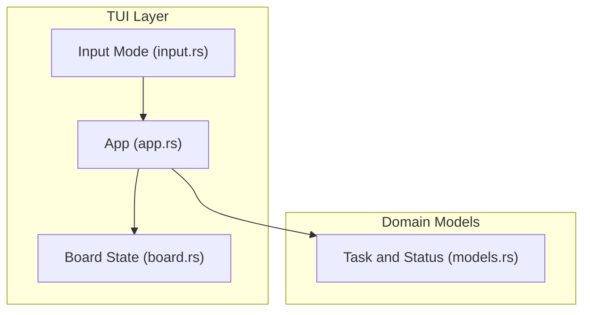
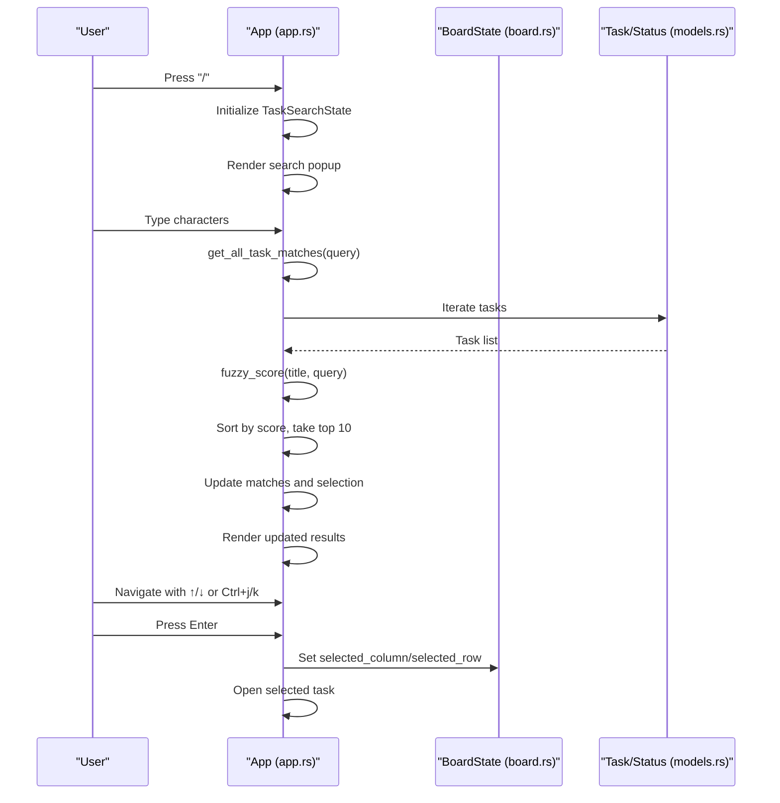
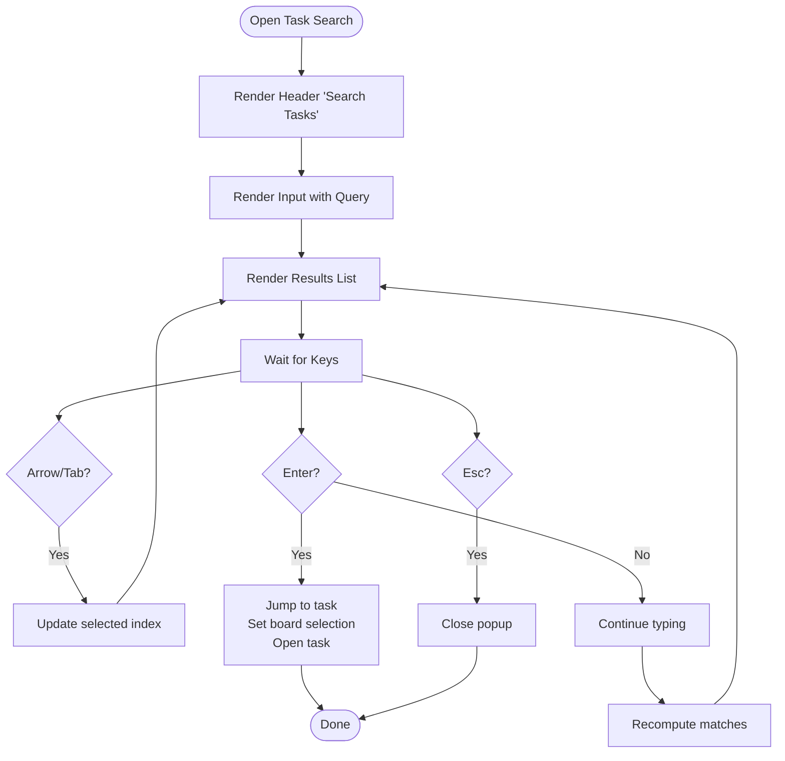
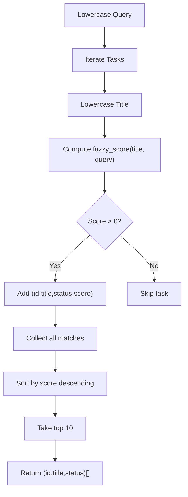
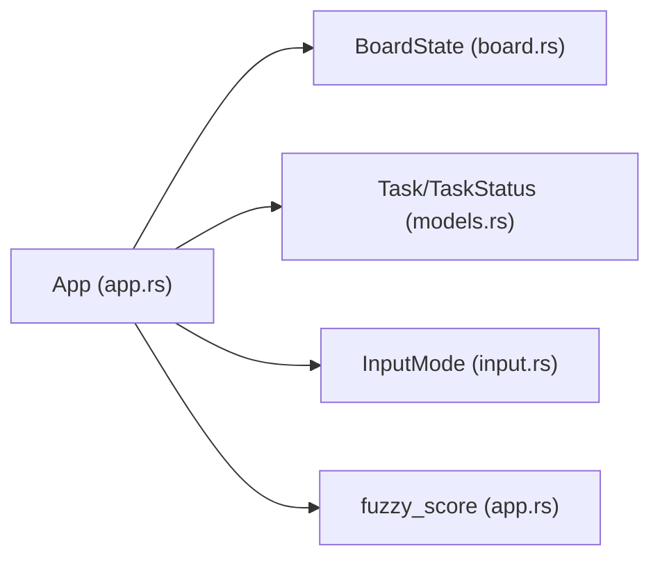

# Task Search and Filter

<cite>
**Referenced Files in This Document**
- [app.rs](file://src/tui/app.rs)
- [models.rs](file://src/db/models.rs)
- [board.rs](file://src/tui/board.rs)
- [input.rs](file://src/tui/input.rs)
</cite>

## Table of Contents
1. [Introduction](#introduction)
2. [Project Structure](#project-structure)
3. [Core Components](#core-components)
4. [Architecture Overview](#architecture-overview)
5. [Detailed Component Analysis](#detailed-component-analysis)
6. [Dependency Analysis](#dependency-analysis)
7. [Performance Considerations](#performance-considerations)
8. [Troubleshooting Guide](#troubleshooting-guide)
9. [Conclusion](#conclusion)

## Introduction
This document explains the task search functionality accessible via the "/" key. It covers the incremental filtering system that searches across task titles, the fuzzy matching algorithm, result ranking, and the search popup interface. It also documents keyboard navigation, how search integrates with board navigation, and performance considerations for large task sets.

## Project Structure
The task search feature is implemented in the TUI application module with supporting data models and board state management.

**Diagram sources**
- [app.rs](file://src/tui/app.rs)
- [board.rs](file://src/tui/board.rs)
- [models.rs](file://src/db/models.rs)
- [input.rs](file://src/tui/input.rs)

**Section sources**
- [app.rs](file://src/tui/app.rs)
- [board.rs](file://src/tui/board.rs)
- [models.rs](file://src/db/models.rs)
- [input.rs](file://src/tui/input.rs)

## Core Components
- TaskSearchState: Holds the current search query, matched results, and selection index.
- Fuzzy scoring algorithm: Computes match quality between query and task title.
- Incremental filtering: Updates results as the user types or deletes characters.
- Keyboard handlers: Manage search input, navigation, and jumping to tasks.
- Rendering: Draws the search popup with results and status indicators.

**Section sources**
- [app.rs](file://src/tui/app.rs)
- [models.rs](file://src/db/models.rs)

## Architecture Overview
The search flow begins when the user presses "/" in normal mode. The application enters search mode, renders a popup with an input field and results list, and continuously updates results as the user types. Selected results can be navigated with arrow keys or Ctrl+j/k, and pressing Enter jumps to the task and opens it.

**Diagram sources**
- [app.rs](file://src/tui/app.rs)
- [board.rs](file://src/tui/board.rs)
- [models.rs](file://src/db/models.rs)

## Detailed Component Analysis

### Task Search Popup and Rendering
The search popup displays:
- A header with the title "Search Tasks"
- An input line showing the current query with a cursor
- A scrollable results list with task titles and status icons
- Footer help text indicating navigation controls

Keyboard shortcuts within the search popup:
- Up/Down or Tab/BackTab: move selection up/down
- Ctrl+j/Ctrl+n: move selection down
- Ctrl+k/Ctrl+p: move selection up
- Enter: jump to the selected task and open it
- Esc: cancel search and close popup

**Diagram sources**
- [app.rs](file://src/tui/app.rs)

**Section sources**
- [app.rs](file://src/tui/app.rs)

### Incremental Filtering and Matching
Incremental filtering occurs on every keystroke or backspace:
- The query is normalized to lowercase for case-insensitive matching.
- Each task title is scored using a fuzzy scoring algorithm.
- Matches are sorted by score (highest first) and limited to the top 10 results.

Fuzzy scoring algorithm highlights:
- Exact character matches contribute base score.
- Bonus points for consecutive matches and for matches after separators (/,_,-,.).
- Only queries that consume all characters in the needle are considered valid matches.

**Diagram sources**
- [app.rs](file://src/tui/app.rs)

**Section sources**
- [app.rs](file://src/tui/app.rs)

### Search Syntax and Pattern Matching
Current implementation focuses on title-based fuzzy matching:
- No explicit syntax parsing for fields like "status:" or "id:".
- The system treats the entire query as a fuzzy substring-like pattern applied to task titles.
- For advanced filtering by status or ID, use the board navigation and keyboard shortcuts to move between columns and rows.

Effective search examples:
- "review": fuzzy match on titles containing "review"
- "AGX": fuzzy match on titles containing "A", "G", "X" in order
- Mixed queries: "planning task" to match titles containing both words in order

Note: While the UI supports incremental filtering, the current implementation does not parse field prefixes like "status:" or "id:". Use board navigation for precise targeting.

**Section sources**
- [app.rs](file://src/tui/app.rs)
- [models.rs](file://src/db/models.rs)

### Result Ranking and Selection
Ranking criteria:
- Higher scores indicate better matches.
- Consecutive character matches receive bonuses.
- Matches after separators receive bonuses.
- Queries that consume all characters in the needle are valid.

Selection behavior:
- The first result is preselected.
- Navigation moves the selection index within the filtered list.
- Pressing Enter jumps to the task's column and row on the board, then opens it.

**Section sources**
- [app.rs](file://src/tui/app.rs)
- [board.rs](file://src/tui/board.rs)

### Keyboard Shortcuts and Board Integration
Within the search popup:
- Arrow keys and Tab/BackTab: navigate results
- Ctrl+j/Ctrl+n: navigate down
- Ctrl+k/Ctrl+p: navigate up
- Enter: jump to task and open
- Esc: cancel

Board integration:
- Jumping to a task automatically selects the corresponding column (based on task status) and row (based on task position within that column).
- After opening, the board view reflects the new selection.

**Section sources**
- [app.rs](file://src/tui/app.rs)
- [board.rs](file://src/tui/board.rs)

## Dependency Analysis
The task search feature depends on:
- BoardState for task collection and selection mapping
- Task and TaskStatus models for status enumeration and display
- InputMode for determining when search is active
- Fuzzy scoring function for ranking results

**Diagram sources**
- [app.rs](file://src/tui/app.rs)
- [board.rs](file://src/tui/board.rs)
- [models.rs](file://src/db/models.rs)
- [input.rs](file://src/tui/input.rs)

**Section sources**
- [app.rs](file://src/tui/app.rs)
- [board.rs](file://src/tui/board.rs)
- [models.rs](file://src/db/models.rs)
- [input.rs](file://src/tui/input.rs)

## Performance Considerations
- Complexity: The filtering loop iterates over all tasks and computes a fuzzy score for each, resulting in O(N) filtering plus O(K) scoring per task, where N is the number of tasks and K is the average title length.
- Limiting results: The system caps results to 10, reducing rendering overhead.
- Incremental updates: Updates occur on each keystroke, which is efficient for typical task counts but may become noticeable with very large datasets.
- Recommendations:
  - Keep task titles concise to improve matching performance.
  - Prefer board navigation for large sets to reduce filtering overhead.
  - Consider adding indexing or caching if performance becomes a bottleneck.

**Section sources**
- [app.rs](file://src/tui/app.rs)

## Troubleshooting Guide
Common issues and resolutions:
- No results appear:
  - Ensure the query is not empty; an empty query yields a default score and may still produce results.
  - Verify tasks exist in the board; filtering operates on BoardState.tasks.
- Unexpected ordering:
  - Fuzzy scoring prioritizes consecutive matches and separator boundaries; adjust query to improve ranking.
- Jump does nothing:
  - Confirm a selection exists; Enter only works when a result is selected.
- Board selection incorrect:
  - Jumping sets the column based on task status and the row based on position within that column; verify task status and column order.

**Section sources**
- [app.rs](file://src/tui/app.rs)
- [board.rs](file://src/tui/board.rs)

## Conclusion
The task search feature provides fast, incremental filtering of tasks by title using a robust fuzzy scoring algorithm. It offers intuitive keyboard navigation, immediate feedback, and seamless integration with board navigation. While the current implementation focuses on title matching, the UI and architecture support future enhancements such as field-specific queries (e.g., status:, id:).