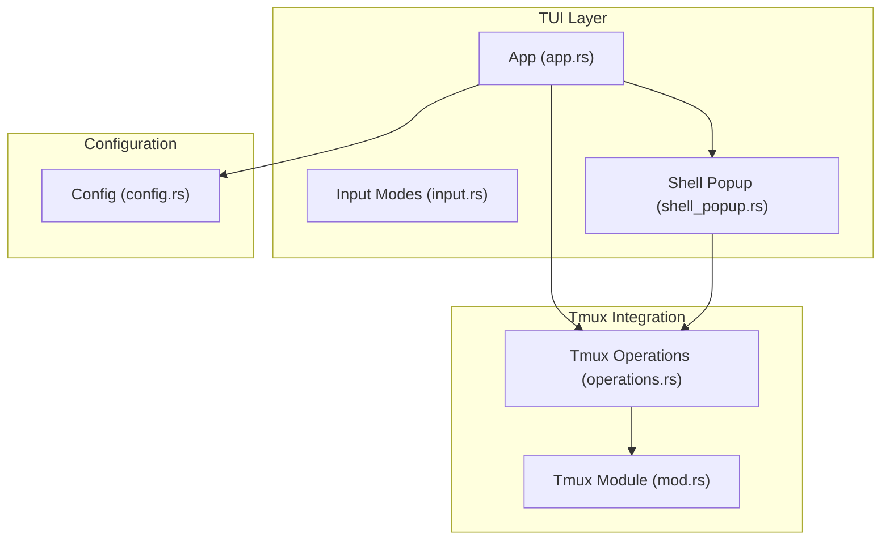
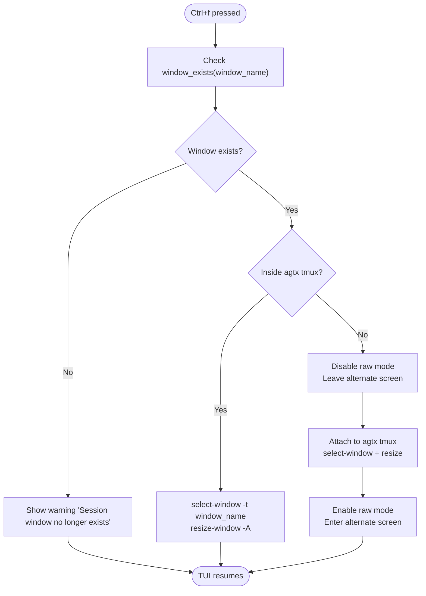
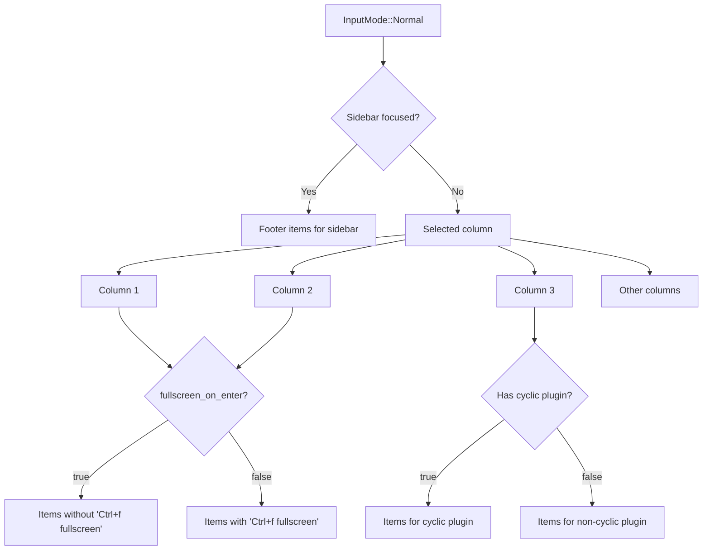
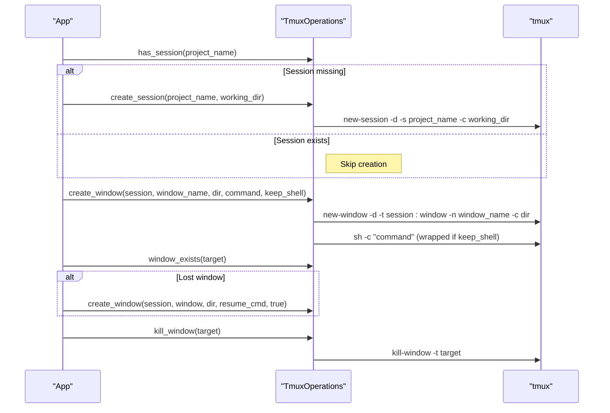
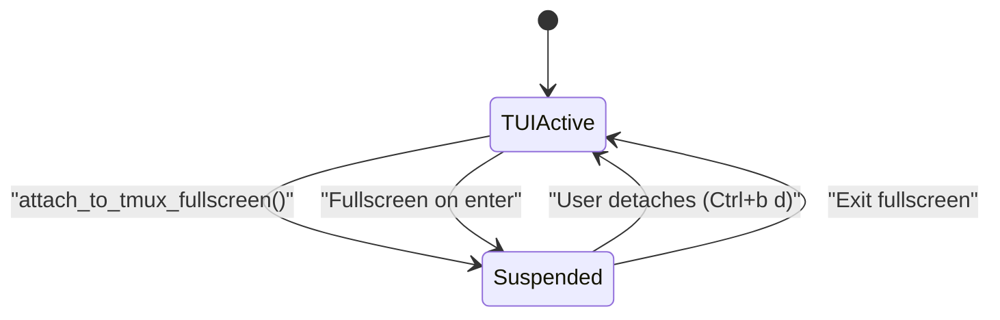
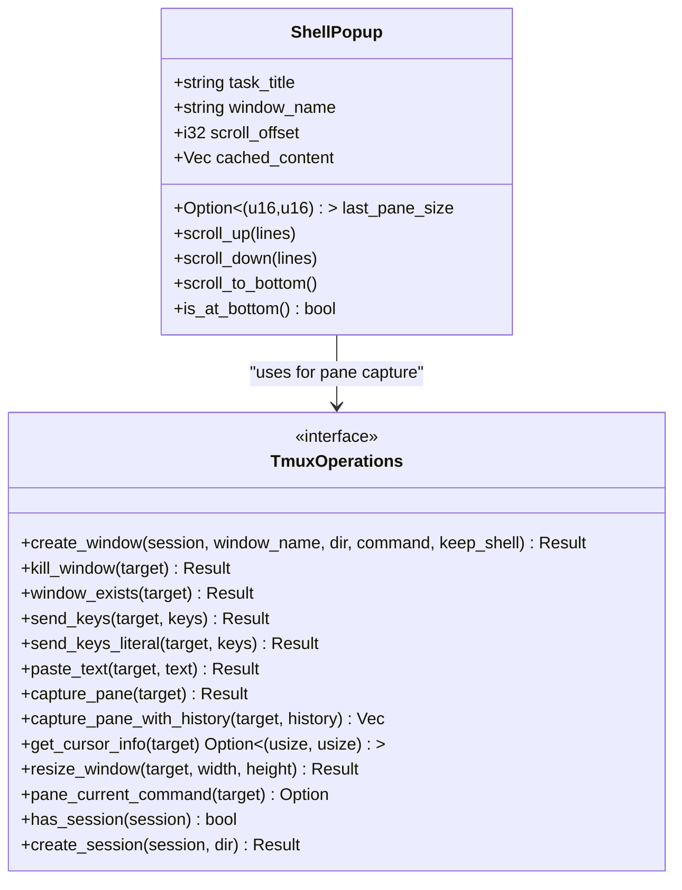
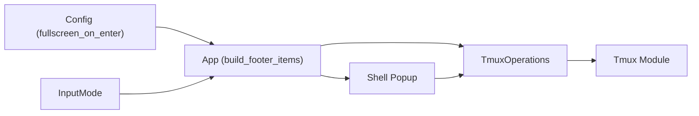

# Fullscreen tmux Attachment

<cite>
**Referenced Files in This Document**
- [src/tui/app.rs](file://src/tui/app.rs)
- [src/tmux/mod.rs](file://src/tmux/mod.rs)
- [src/tmux/operations.rs](file://src/tmux/operations.rs)
- [src/tui/shell_popup.rs](file://src/tui/shell_popup.rs)
- [src/config/mod.rs](file://src/config/mod.rs)
- [src/tui/input.rs](file://src/tui/input.rs)
</cite>

## Table of Contents
1. [Introduction](#introduction)
2. [Project Structure](#project-structure)
3. [Core Components](#core-components)
4. [Architecture Overview](#architecture-overview)
5. [Detailed Component Analysis](#detailed-component-analysis)
6. [Dependency Analysis](#dependency-analysis)
7. [Performance Considerations](#performance-considerations)
8. [Troubleshooting Guide](#troubleshooting-guide)
9. [Conclusion](#conclusion)

## Introduction
This document explains the fullscreen tmux attachment feature in the application, focusing on the Ctrl+f keyboard shortcut, column-specific attachment options, tmux session lifecycle management, and the fullscreen interface layout. It also provides troubleshooting guidance for tmux connectivity issues and session management best practices.

## Project Structure
The fullscreen tmux feature spans several modules:
- TUI application logic manages user interactions, layouts, and key handling
- Tmux integration provides session/window management and pane capture
- Shell popup displays detached tmux windows with scrollable content
- Configuration controls automatic fullscreen behavior on task popup open



**Diagram sources**
- [src/tui/app.rs](file://src/tui/app.rs)
- [src/tmux/mod.rs](file://src/tmux/mod.rs)
- [src/tmux/operations.rs](file://src/tmux/operations.rs)
- [src/tui/shell_popup.rs](file://src/tui/shell_popup.rs)
- [src/config/mod.rs](file://src/config/mod.rs)

**Section sources**
- [src/tui/app.rs](file://src/tui/app.rs)
- [src/tmux/mod.rs](file://src/tmux/mod.rs)
- [src/tmux/operations.rs](file://src/tmux/operations.rs)
- [src/tui/shell_popup.rs](file://src/tui/shell_popup.rs)
- [src/config/mod.rs](file://src/config/mod.rs)

## Core Components
- Fullscreen attachment handler: switches to tmux fullscreen when Ctrl+f is pressed in the shell popup
- Tmux operations abstraction: trait-based interface for tmux commands (windows, sessions, pane capture)
- Real tmux implementation: executes tmux commands against the dedicated agent server
- Shell popup: displays detached tmux windows with scrolling and history support
- Session lifecycle: ensures project tmux session exists, recovers missing windows, and cleans up on task completion

**Section sources**
- [src/tui/app.rs](file://src/tui/app.rs)
- [src/tmux/operations.rs](file://src/tmux/operations.rs)
- [src/tmux/mod.rs](file://src/tmux/mod.rs)
- [src/tui/shell_popup.rs](file://src/tui/shell_popup.rs)

## Architecture Overview
The fullscreen feature integrates the TUI with tmux by suspending the TUI, attaching to the tmux server, selecting the target window, resizing to fit the terminal, and resuming the TUI after detachment.

```mermaid
sequenceDiagram
participant User as "User"
participant App as "App (app.rs)"
participant TmuxOps as "TmuxOperations"
participant Tmux as "tmux"
User->>App : Press Ctrl+f in shell popup
App->>App : attach_to_tmux_fullscreen(window_name)
App->>TmuxOps : window_exists(window_name)
TmuxOps->>Tmux : has-session / list-windows
Tmux-->>TmuxOps : exists?
TmuxOps-->>App : result
alt Already inside agtx tmux
App->>Tmux : select-window -t window_name
App->>Tmux : resize-window -A
else Outside agtx tmux
App->>App : disable raw mode / leave alternate screen
App->>Tmux : attach -t session ; select-window -t window_name ; resize-window -A
App->>App : restore raw mode / enter alternate screen
end
Note over App,Tmux : User detaches (Ctrl+b d)<br/>TUI resumes automatically
```

**Diagram sources**
- [src/tui/app.rs](file://src/tui/app.rs)
- [src/tmux/operations.rs](file://src/tmux/operations.rs)

## Detailed Component Analysis

### Fullscreen Attachment Handler
The handler responds to Ctrl+f in the shell popup:
- Validates the target window exists
- Checks if already inside the agtx tmux server
- Switches windows directly if already inside
- Otherwise, suspends the TUI, attaches to the tmux server, selects the window, and resizes



**Diagram sources**
- [src/tui/app.rs](file://src/tui/app.rs)

**Section sources**
- [src/tui/app.rs](file://src/tui/app.rs)

### Column-Specific Attachment Options
The footer dynamically adapts to the current column and configuration:
- Normal mode shows different footer items depending on the selected column
- When `fullscreen_on_enter` is disabled, the footer includes "Ctrl+f fullscreen" for columns 1–3
- When `fullscreen_on_enter` is enabled, the footer omits "Ctrl+f fullscreen" and focuses on other actions



**Diagram sources**
- [src/tui/app.rs](file://src/tui/app.rs)
- [src/config/mod.rs](file://src/config/mod.rs)

**Section sources**
- [src/tui/app.rs](file://src/tui/app.rs)
- [src/config/mod.rs](file://src/config/mod.rs)

### Tmux Session Lifecycle Management
The application manages tmux sessions for projects and tasks:
- Project session creation: Ensures a project-level tmux session exists before use
- Task window creation: Creates task-specific windows with agent commands
- Recovery: Recreates missing task windows using agent resume commands
- Cleanup: Kills task windows and removes worktrees on task completion



**Diagram sources**
- [src/tui/app.rs](file://src/tui/app.rs)
- [src/tmux/operations.rs](file://src/tmux/operations.rs)

**Section sources**
- [src/tui/app.rs](file://src/tui/app.rs)
- [src/tmux/operations.rs](file://src/tmux/operations.rs)

### Fullscreen Interface Layout and Exit
The fullscreen mode temporarily suspends the TUI:
- Terminal state: raw mode disabled, alternate screen left
- Tmux attach: Attaches to the agtx server, selects the target window, and autosizes
- Exit: Detaching from tmux (Ctrl+b d) restores the TUI automatically



**Diagram sources**
- [src/tui/app.rs](file://src/tui/app.rs)

**Section sources**
- [src/tui/app.rs](file://src/tui/app.rs)

### Shell Popup and Pane Interaction
The shell popup displays detached tmux windows with:
- Scrollable content using history capture
- Footer with navigation hints and fullscreen option
- Automatic pane content updates during interaction



**Diagram sources**
- [src/tui/shell_popup.rs](file://src/tui/shell_popup.rs)
- [src/tmux/operations.rs](file://src/tmux/operations.rs)

**Section sources**
- [src/tui/shell_popup.rs](file://src/tui/shell_popup.rs)
- [src/tmux/operations.rs](file://src/tmux/operations.rs)

## Dependency Analysis
The fullscreen feature relies on:
- Tmux operations abstraction for all tmux interactions
- Configuration to control automatic fullscreen behavior
- Input modes to determine footer content and key handling
- Shell popup for displaying detached tmux windows



**Diagram sources**
- [src/config/mod.rs](file://src/config/mod.rs)
- [src/tui/input.rs](file://src/tui/input.rs)
- [src/tui/app.rs](file://src/tui/app.rs)
- [src/tmux/operations.rs](file://src/tmux/operations.rs)
- [src/tmux/mod.rs](file://src/tmux/mod.rs)
- [src/tui/shell_popup.rs](file://src/tui/shell_popup.rs)

**Section sources**
- [src/config/mod.rs](file://src/config/mod.rs)
- [src/tui/input.rs](file://src/tui/input.rs)
- [src/tui/app.rs](file://src/tui/app.rs)
- [src/tmux/operations.rs](file://src/tmux/operations.rs)
- [src/tmux/mod.rs](file://src/tmux/mod.rs)
- [src/tui/shell_popup.rs](file://src/tui/shell_popup.rs)

## Performance Considerations
- Pane capture with history can be expensive; the shell popup caches content and updates periodically
- Window existence checks avoid unnecessary attach attempts
- Resizing to terminal size ensures optimal display without excessive redraws

## Troubleshooting Guide
Common issues and resolutions:
- Tmux server not running: The application uses a dedicated server name; ensure tmux is installed and accessible
- Session/window missing: The system recovers by recreating missing windows using agent resume commands
- Cannot attach in nested tmux: The handler unsets the TMUX environment variable to allow attachment
- Terminal state problems: The handler restores terminal state after attaching; if the terminal becomes unusable, reattach to restore normal operation

Best practices:
- Keep the tmux server running and accessible
- Use the shell popup to monitor task windows; if a window disappears, rely on recovery mechanisms
- Configure automatic fullscreen behavior via configuration to streamline workflow
- Prefer detach (Ctrl+b d) to exit fullscreen rather than killing the tmux session

**Section sources**
- [src/tui/app.rs](file://src/tui/app.rs)
- [src/tmux/operations.rs](file://src/tmux/operations.rs)
- [src/tmux/mod.rs](file://src/tmux/mod.rs)

## Conclusion
The fullscreen tmux attachment feature provides seamless integration between the TUI and tmux, enabling direct interaction with task windows while preserving the application's terminal state. The implementation includes robust session lifecycle management, dynamic footer options, and reliable recovery mechanisms for missing windows.