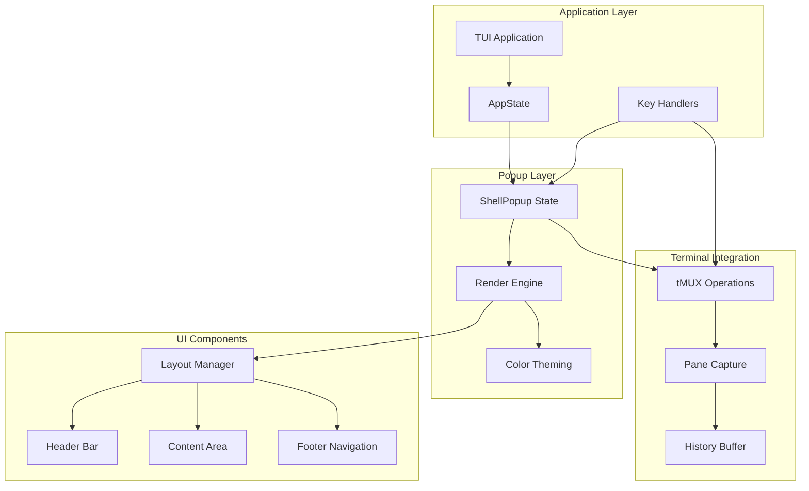
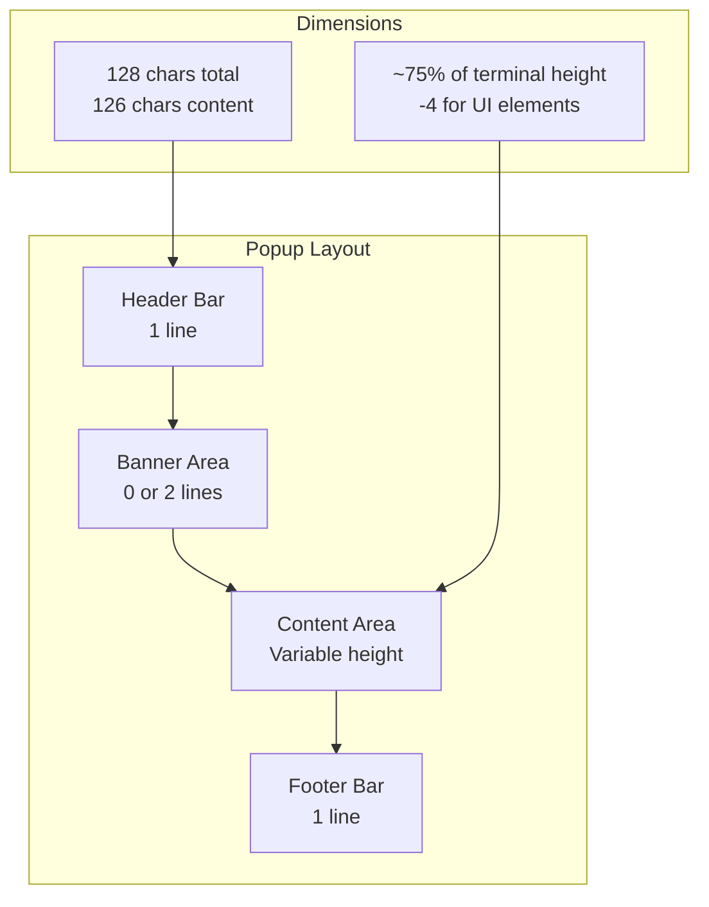
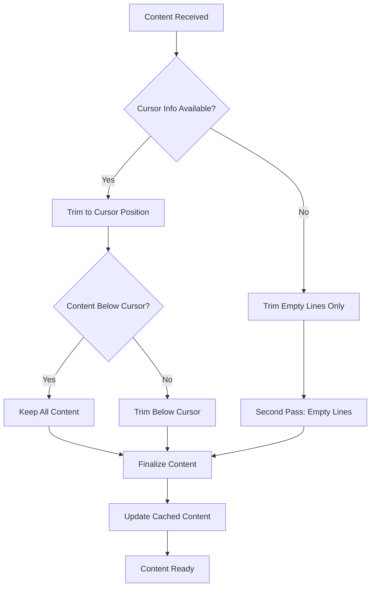
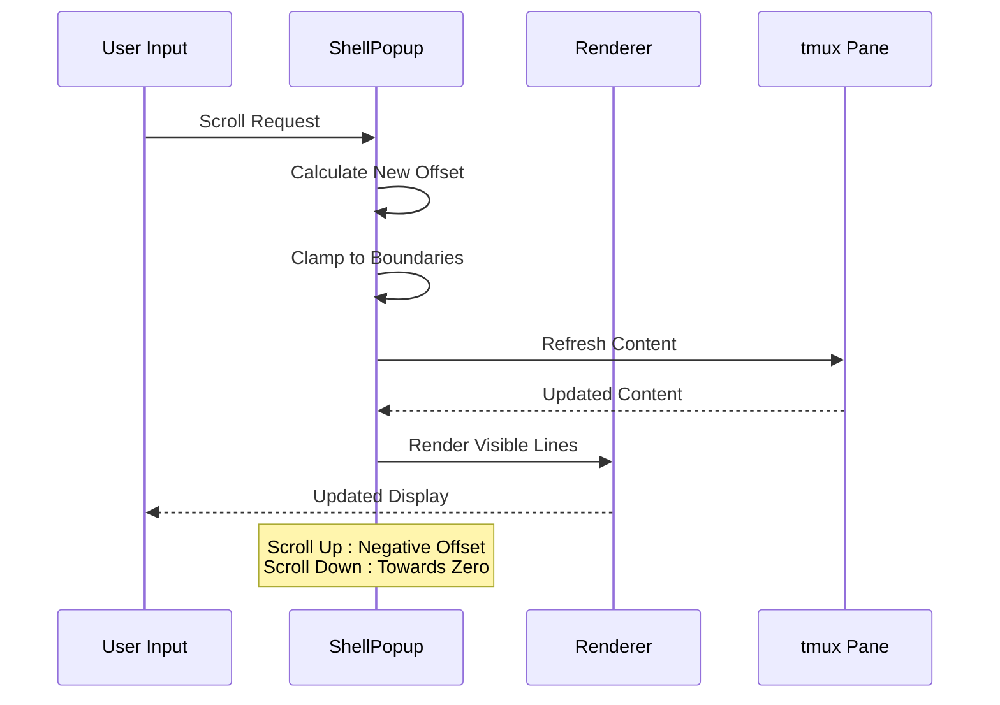
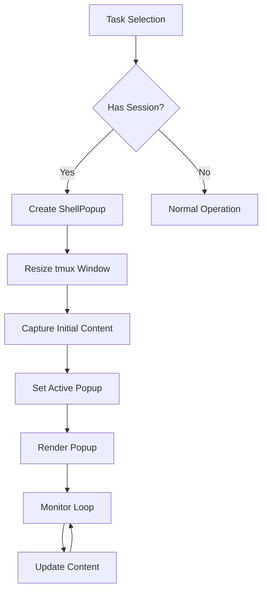
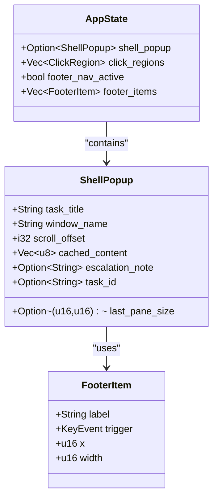

# Inline Shell Popup System

<cite>
**Referenced Files in This Document**
- [shell_popup.rs](file://src/tui/shell_popup.rs)
- [app.rs](file://src/tui/app.rs)
- [shell_popup_tests.rs](file://tests/shell_popup_tests.rs)
</cite>

## Table of Contents
1. [Introduction](#introduction)
2. [System Architecture](#system-architecture)
3. [Popup Dimensions and Layout](#popup-dimensions-and-layout)
4. [Content Management](#content-management)
5. [Scrolling Behavior](#scrolling-behavior)
6. [Activation and Lifecycle](#activation-and-lifecycle)
7. [Multiple Instance Management](#multiple-instance-management)
8. [Customization Options](#customization-options)
9. [Terminal Dimension Relationship](#terminal-dimension-relationship)
10. [Key Bindings and Navigation](#key-bindings-and-navigation)
11. [Troubleshooting Guide](#troubleshooting-guide)
12. [Conclusion](#conclusion)

## Introduction

The inline shell popup system provides an integrated terminal interface within the application's TUI (Text User Interface) for monitoring and interacting with tmux sessions. This system enables users to observe agent output, monitor task progress, and interact with running processes without leaving the main application interface.

The popup system is designed as a detachable tmux window that appears as an overlay within the main application, displaying real-time terminal output with advanced scrolling capabilities, customizable theming, and comprehensive keyboard navigation.

## System Architecture

The inline shell popup system follows a modular architecture with clear separation of concerns:

**Diagram sources**
- [app.rs:465-468](file://src/tui/app.rs#L465-L468)
- [shell_popup.rs:6-20](file://src/tui/shell_popup.rs#L6-L20)

The system consists of three primary layers:

1. **State Management Layer**: Maintains popup state including scroll position, cached content, and terminal dimensions
2. **Rendering Layer**: Handles visual presentation with customizable theming and responsive layouts
3. **Integration Layer**: Manages tmux communication and terminal interaction

**Section sources**
- [app.rs:465-468](file://src/tui/app.rs#L465-L468)
- [shell_popup.rs:6-20](file://src/tui/shell_popup.rs#L6-L20)

## Popup Dimensions and Layout

The popup system defines fixed dimensions that ensure consistent user experience across different terminal sizes:

### Fixed Dimensions
- **Total Width**: 128 characters (including borders)
- **Content Width**: 126 characters (128 - 2 for borders)
- **Height Percentage**: 75% of terminal height
- **Content Height**: Height - 4 (accounting for borders, header, and footer)

### Layout Structure
The popup follows a four-section vertical layout:

**Diagram sources**
- [app.rs:465-468](file://src/tui/app.rs#L465-L468)
- [shell_popup.rs:271-279](file://src/tui/shell_popup.rs#L271-L279)

### Responsive Behavior
The system automatically adapts to terminal size changes while maintaining proportional dimensions. The content area dynamically adjusts based on available space, ensuring optimal viewing regardless of terminal dimensions.

**Section sources**
- [app.rs:465-468](file://src/tui/app.rs#L465-L468)
- [shell_popup.rs:271-279](file://src/tui/shell_popup.rs#L271-L279)

## Content Management

The popup system efficiently manages terminal content through intelligent caching and trimming mechanisms:

### Content Caching Strategy
- **Cached Content**: Stores pane data in memory for immediate rendering
- **Periodic Updates**: Refreshes content at controlled intervals to balance performance and freshness
- **History Preservation**: Maintains scrollback history for backward navigation

### Content Trimming Logic
The system implements sophisticated content trimming to optimize space usage:

**Diagram sources**
- [shell_popup.rs:144-186](file://src/tui/shell_popup.rs#L144-L186)

### Maximum Trailing Empty Lines
The system maintains a configurable maximum of 3 trailing empty lines to preserve prompt visibility while minimizing unnecessary space usage.

**Section sources**
- [shell_popup.rs:132-133](file://src/tui/shell_popup.rs#L132-L133)
- [shell_popup.rs:144-186](file://src/tui/shell_popup.rs#L144-L186)

## Scrolling Behavior

The scrolling system provides intuitive navigation through terminal output with intelligent boundary management:

### Scroll Position Management
- **Scroll Offset**: Negative values indicate history (higher number = deeper history)
- **Bottom Position**: Zero offset indicates current/latest content
- **Boundary Detection**: Automatic detection of content boundaries

### Scroll Operations
The system supports multiple scrolling modes:

**Diagram sources**
- [shell_popup.rs:35-58](file://src/tui/shell_popup.rs#L35-L58)
- [shell_popup.rs:73-118](file://src/tui/shell_popup.rs#L73-L118)

### Scroll Calculation Algorithm
The visible content calculation considers both scroll position and content structure:

1. **Effective Line Count**: Adjusts for trailing empty lines based on scroll position
2. **Start Position**: Calculates viewport start based on scroll offset and visible height
3. **Boundary Handling**: Ensures smooth scrolling at content boundaries

**Section sources**
- [shell_popup.rs:35-58](file://src/tui/shell_popup.rs#L35-L58)
- [shell_popup.rs:73-118](file://src/tui/shell_popup.rs#L73-L118)

## Activation and Lifecycle

The popup activation process integrates seamlessly with task management and tmux session handling:

### Activation Trigger
Popup activation occurs when users interact with tasks that have associated tmux sessions:

**Diagram sources**
- [app.rs:6210-6243](file://src/tui/app.rs#L6210-L6243)

### tmux Integration
The system performs several tmux operations during activation:

1. **Window Resizing**: Matches popup dimensions to maintain consistent appearance
2. **Content Capture**: Retrieves initial pane content with scrollback history
3. **Session Recovery**: Attempts to recover lost tmux sessions before activation

**Section sources**
- [app.rs:6210-6243](file://src/tui/app.rs#L6210-L6243)

## Multiple Instance Management

The application supports managing multiple popup instances through a single-state architecture:

### State Architecture
Each popup instance maintains independent state while sharing common resources:

**Diagram sources**
- [app.rs:534-535](file://src/tui/app.rs#L534-L535)
- [shell_popup.rs:8-20](file://src/tui/shell_popup.rs#L8-L20)

### Instance Isolation
Each popup instance operates independently with its own:
- Scroll position and history
- Cached content and terminal dimensions
- Escalation note state
- Task association

**Section sources**
- [app.rs:534-535](file://src/tui/app.rs#L534-L535)
- [shell_popup.rs:8-20](file://src/tui/shell_popup.rs#L8-L20)

## Customization Options

The popup system provides extensive customization through theming and layout configuration:

### Color Theming
The system supports comprehensive color customization:

| Component | Default Color | Customizable |
|-----------|---------------|--------------|
| Border | Green | ✅ Yes |
| Header Foreground | Black | ✅ Yes |
| Header Background | Cyan | ✅ Yes |
| Footer Foreground | Black | ✅ Yes |
| Footer Background | Gray | ✅ Yes |
| Escalation Foreground | Black | ✅ Yes |
| Escalation Background | Yellow | ✅ Yes |

### Theme Integration
Colors integrate with the application's theme system, allowing users to customize the appearance consistently across the interface.

**Section sources**
- [shell_popup.rs:215-239](file://src/tui/shell_popup.rs#L215-L239)
- [app.rs:2448-2457](file://src/tui/app.rs#L2448-L2457)

## Terminal Dimension Relationship

The popup system establishes a direct relationship between popup dimensions and terminal characteristics:

### Proportional Scaling
- **Width**: Fixed 128 characters provides consistent character-based layout
- **Height**: 75% of terminal height ensures adequate content visibility
- **Content Area**: Automatically calculated as height minus UI element overhead

### Dynamic Adaptation
The system responds to terminal size changes through:
- Real-time dimension detection
- Proportional height calculations
- Adaptive content area sizing

**Section sources**
- [app.rs:465-468](file://src/tui/app.rs#L465-L468)
- [app.rs:6215-6233](file://src/tui/app.rs#L6215-L6233)

## Key Bindings and Navigation

The popup system provides comprehensive keyboard navigation with both traditional and modern interaction patterns:

### Standard Scroll Controls
- **Ctrl+J/Ctrl+N/Ctrl+Down**: Scroll down 5 lines
- **Ctrl+K/Ctrl+P/Ctrl+Up**: Scroll up 5 lines
- **Ctrl+D**: Page down 20 lines
- **Ctrl+U**: Page up 20 lines
- **Ctrl+G**: Jump to bottom (current position)

### Advanced Navigation
- **PageUp/PageDown**: Alternative page navigation
- **Ctrl+F**: Toggle fullscreen mode
- **Ctrl+Q**: Close popup
- **F2**: Toggle footer navigation mode

### Footer Navigation Mode
The system includes an advanced navigation mode that presents interactive footer items:
- **Arrow Keys/HL**: Navigate between footer items
- **Enter**: Activate selected item
- **Esc**: Exit navigation mode

**Section sources**
- [app.rs:201-247](file://src/tui/app.rs#L201-L247)
- [app.rs:3553-3601](file://src/tui/app.rs#L3553-L3601)

## Troubleshooting Guide

Common issues and their resolutions:

### Popup Not Appearing
- **Cause**: Task has no associated tmux session
- **Solution**: Ensure the task has an active session before attempting to open

### Content Not Updating
- **Cause**: tmux window may have been closed or resized unexpectedly
- **Solution**: Recreate the popup or restore the tmux session

### Scroll Position Issues
- **Cause**: Content trimming may have removed expected lines
- **Solution**: Use Ctrl+G to jump to bottom or adjust scroll sensitivity

### Performance Problems
- **Cause**: Excessive content capture frequency
- **Solution**: Allow natural refresh cycles or reduce content capture frequency

**Section sources**
- [app.rs:6245-6319](file://src/tui/app.rs#L6245-L6319)
- [shell_popup.rs:3540-3604](file://src/tui/app.rs#L3540-L3604)

## Conclusion

The inline shell popup system provides a robust, feature-rich terminal interface that enhances the application's monitoring and interaction capabilities. Through careful design of dimensions, content management, and user interaction patterns, the system delivers a seamless experience for observing and controlling tmux sessions.

Key strengths include:
- **Responsive Design**: Adapts to various terminal sizes while maintaining consistent proportions
- **Intelligent Content Management**: Efficient caching and trimming prevents memory issues
- **Comprehensive Navigation**: Multiple scroll modes and keyboard shortcuts accommodate different user preferences
- **Extensible Architecture**: Clean separation of concerns enables easy customization and maintenance

The system successfully bridges the gap between traditional terminal interfaces and modern TUI applications, providing users with powerful session monitoring capabilities without sacrificing usability or performance.