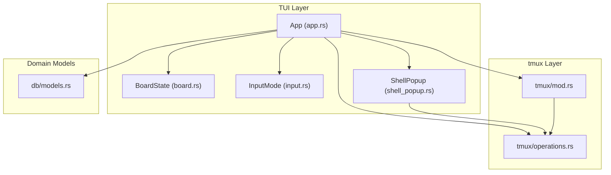
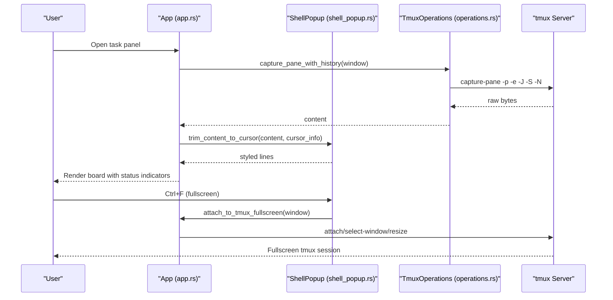
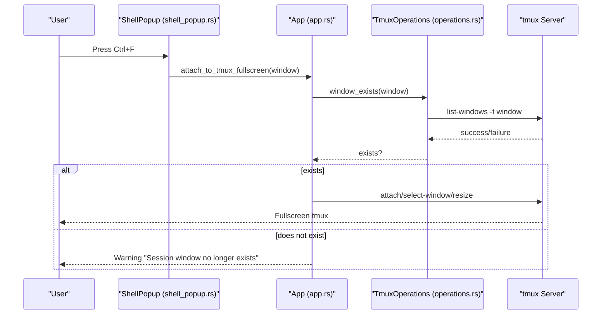
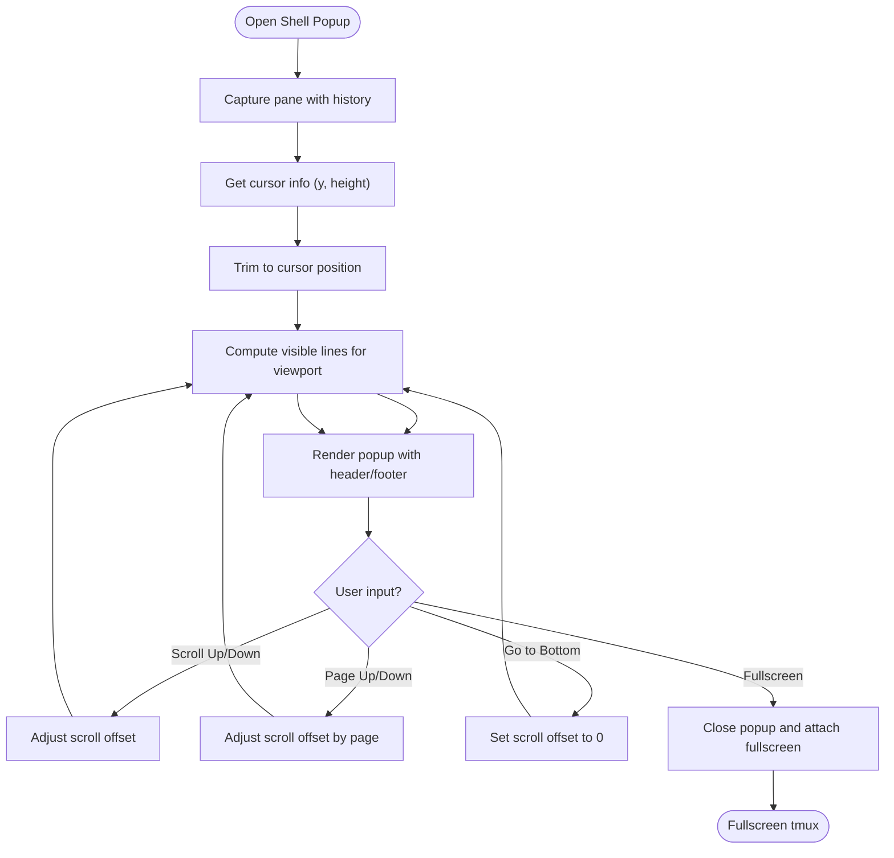
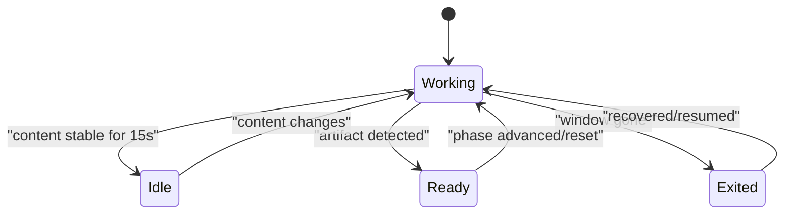
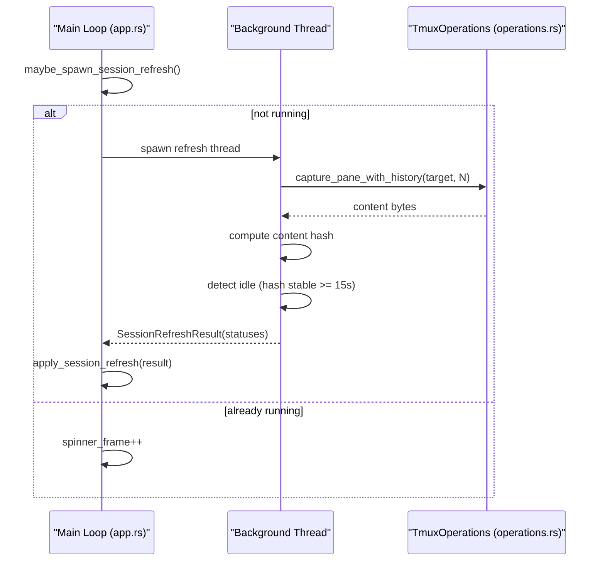
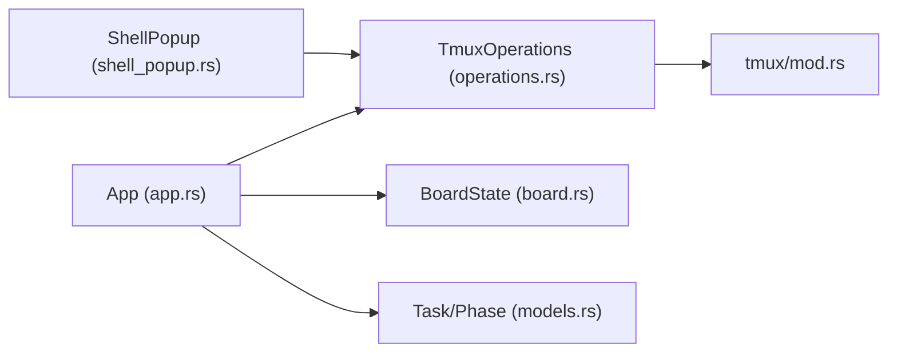

# Session Monitoring and Management

<cite>
**Referenced Files in This Document**
- [app.rs](file://src/tui/app.rs)
- [shell_popup.rs](file://src/tui/shell_popup.rs)
- [mod.rs](file://src/tmux/mod.rs)
- [operations.rs](file://src/tmux/operations.rs)
- [models.rs](file://src/db/models.rs)
- [board.rs](file://src/tui/board.rs)
- [input.rs](file://src/tui/input.rs)
</cite>

## Table of Contents
1. [Introduction](#introduction)
2. [Project Structure](#project-structure)
3. [Core Components](#core-components)
4. [Architecture Overview](#architecture-overview)
5. [Detailed Component Analysis](#detailed-component-analysis)
6. [Dependency Analysis](#dependency-analysis)
7. [Performance Considerations](#performance-considerations)
8. [Troubleshooting Guide](#troubleshooting-guide)
9. [Conclusion](#conclusion)

## Introduction
This document explains the session monitoring and management capabilities of the application, focusing on:
- Fullscreen tmux attachment via keyboard shortcut or column actions
- Inline shell popup system for monitoring agent sessions without leaving the kanban board
- Session status indicators (spinner states for active tasks, checkmarks for completed phases, pause icons for idle agents)
- Session refresh mechanism and how the interface tracks agent activity and progress
- Troubleshooting guidance for session connectivity issues
- Performance optimization tips for managing large numbers of concurrent sessions

## Project Structure
The session monitoring system spans several modules:
- TUI (Terminal User Interface) manages the kanban board, input handling, and rendering
- tmux module provides low-level tmux operations and session/window management
- Database models define task and phase states used for status tracking
- Shell popup module renders an inline terminal-like overlay for agent sessions

**Diagram sources**
- [app.rs](file://src/tui/app.rs)
- [board.rs](file://src/tui/board.rs)
- [input.rs](file://src/tui/input.rs)
- [shell_popup.rs](file://src/tui/shell_popup.rs)
- [mod.rs](file://src/tmux/mod.rs)
- [operations.rs](file://src/tmux/operations.rs)
- [models.rs](file://src/db/models.rs)

**Section sources**
- [app.rs](file://src/tui/app.rs)
- [board.rs](file://src/tui/board.rs)
- [input.rs](file://src/tui/input.rs)
- [shell_popup.rs](file://src/tui/shell_popup.rs)
- [mod.rs](file://src/tmux/mod.rs)
- [operations.rs](file://src/tmux/operations.rs)
- [models.rs](file://src/db/models.rs)

## Core Components
- tmux integration: Provides session/window lifecycle, pane capture, cursor detection, and key forwarding
- Shell popup: Renders an inline terminal overlay with scrolling, history trimming, and footer controls
- Kanban board: Displays task phases with status indicators and supports fullscreen tmux attachment
- Session refresh: Background polling of tmux panes to detect phase readiness and idle states
- Status indicators: Visual feedback for task progress and agent activity

**Section sources**
- [mod.rs](file://src/tmux/mod.rs)
- [operations.rs](file://src/tmux/operations.rs)
- [shell_popup.rs](file://src/tui/shell_popup.rs)
- [app.rs](file://src/tui/app.rs)
- [models.rs](file://src/db/models.rs)

## Architecture Overview
The system combines a TUI-driven kanban board with tmux-backed agent sessions. The TUI polls tmux panes in the background, computes phase status, and updates the board. Users can monitor agent output inline or attach fullscreen to a tmux session.

**Diagram sources**
- [app.rs](file://src/tui/app.rs)
- [shell_popup.rs](file://src/tui/shell_popup.rs)
- [operations.rs](file://src/tmux/operations.rs)
- [mod.rs](file://src/tmux/mod.rs)

## Detailed Component Analysis

### Fullscreen tmux attachment
The application supports fullscreen tmux attachment either via keyboard shortcut or column actions. When invoked, the TUI checks if the tmux window exists, optionally leaves alternate screen mode, and attaches to the tmux server. If already inside the agtx tmux server, it switches windows instead of nesting.

Key behaviors:
- Keyboard shortcut: Ctrl+F toggles fullscreen attachment from the shell popup
- Column actions: Depending on UI state, the footer exposes "fullscreen" or similar actions
- Safety checks: Window existence verification prevents errors if the session ended
- Nested tmux handling: Detects if already inside the agtx server and switches windows

**Diagram sources**
- [app.rs](file://src/tui/app.rs)
- [operations.rs](file://src/tmux/operations.rs)

**Section sources**
- [app.rs](file://src/tui/app.rs)
- [operations.rs](file://src/tmux/operations.rs)

### Inline shell popup system
The shell popup provides an inline terminal-like overlay for monitoring agent sessions. It captures pane content with history, trims to cursor position, computes visible lines for efficient rendering, and supports scrolling and fullscreen attachment.

Highlights:
- Content capture: Uses tmux capture-pane with history and ANSI sequences
- Cursor-aware trimming: Removes unused pane buffer space below the cursor
- Scrolling: Supports incremental and page-wise scrolling with bounds checking
- Footer controls: Displays keybindings for scrolling, paging, jumping to bottom, and fullscreen attachment
- Colors: Configurable theme colors for borders, headers, footers, and escalation banners

**Diagram sources**
- [shell_popup.rs](file://src/tui/shell_popup.rs)
- [operations.rs](file://src/tmux/operations.rs)

**Section sources**
- [shell_popup.rs](file://src/tui/shell_popup.rs)
- [operations.rs](file://src/tmux/operations.rs)

### Session status indicators
The kanban board displays session status using Unicode indicators:
- Spinner frames: Animated symbol indicating active work
- Checkmark: Indicates phase readiness (artifact detected)
- Pause icon: Indicates idle state after sustained inactivity
- X mark: Indicates session exited

These indicators reflect runtime phase status computed from tmux pane content and agent activity detection.

**Diagram sources**
- [app.rs](file://src/tui/app.rs)
- [models.rs](file://src/db/models.rs)

**Section sources**
- [app.rs](file://src/tui/app.rs)
- [models.rs](file://src/db/models.rs)

### Session refresh mechanism
The application periodically refreshes session status in a background thread to avoid blocking the UI. It:
- Spawns a background thread when cache TTL expires and at least one task needs checking
- Captures pane content and computes content hashes to detect idle states
- Updates phase status cache and applies results to the UI
- Emits notifications when phases become ready or agents become idle

Key timing and thresholds:
- Cache TTL: 2 seconds between refresh cycles
- Idle detection: 15 seconds of stable content hash indicates idle
- Orchestrator idle fallback: 15 seconds without explicit idle signal

**Diagram sources**
- [app.rs](file://src/tui/app.rs)
- [operations.rs](file://src/tmux/operations.rs)

**Section sources**
- [app.rs](file://src/tui/app.rs)
- [operations.rs](file://src/tmux/operations.rs)

### Agent activity and progress tracking
The system tracks agent activity through:
- Pane content capture and hashing for idle detection
- Explicit idle signals embedded in pane content
- Cursor position awareness to trim unused buffer space
- Escalation notes surfaced as visual warnings

Progress tracking:
- Phase advancement triggers notifications for orchestrator
- Merge conflict checks and stuck-task detection guardrails
- Persistent caching of phase status with timestamps

**Section sources**
- [app.rs](file://src/tui/app.rs)
- [shell_popup.rs](file://src/tui/shell_popup.rs)
- [operations.rs](file://src/tmux/operations.rs)

## Dependency Analysis
The session monitoring stack exhibits clear separation of concerns:
- TUI depends on tmux operations for pane capture and window management
- Shell popup depends on tmux operations for content capture and cursor info
- Database models define task and phase states used by the TUI
- Board state encapsulates task layout and selection for rendering

**Diagram sources**
- [app.rs](file://src/tui/app.rs)
- [operations.rs](file://src/tmux/operations.rs)
- [mod.rs](file://src/tmux/mod.rs)
- [shell_popup.rs](file://src/tui/shell_popup.rs)
- [models.rs](file://src/db/models.rs)
- [board.rs](file://src/tui/board.rs)

**Section sources**
- [app.rs](file://src/tui/app.rs)
- [operations.rs](file://src/tmux/operations.rs)
- [mod.rs](file://src/tmux/mod.rs)
- [shell_popup.rs](file://src/tui/shell_popup.rs)
- [models.rs](file://src/db/models.rs)
- [board.rs](file://src/tui/board.rs)

## Performance Considerations
- Background refresh: Non-blocking polling with 2-second cache TTL balances responsiveness and resource usage
- Content capture: History capture capped at a reasonable number of lines to limit memory and CPU overhead
- Idle detection: 15-second threshold reduces false positives and minimizes unnecessary notifications
- Cursor trimming: Reduces rendering workload by excluding unused pane buffer space
- Large-scale sessions: Consider increasing cache TTL or reducing history lines for very large workspaces

## Troubleshooting Guide
Common issues and resolutions:
- Session window missing: The fullscreen attachment flow warns and aborts if the tmux window no longer exists. Recreate the session or recover it using task recovery utilities.
- tmux server not responding: Verify the tmux server name and that tmux is installed. Check permissions and environment variables affecting nested tmux attachments.
- Popup not updating: Ensure background refresh is running and cache TTL is not preventing updates. Confirm pane capture succeeds and content is being trimmed to cursor position.
- Idle detection false positives/negatives: Adjust idle thresholds or rely on explicit idle signals embedded in agent output. Verify cursor info is available for accurate trimming.
- Performance degradation with many sessions: Increase cache TTL, reduce history lines, or limit concurrent fullscreen attachments.

**Section sources**
- [app.rs](file://src/tui/app.rs)
- [operations.rs](file://src/tmux/operations.rs)
- [shell_popup.rs](file://src/tui/shell_popup.rs)

## Conclusion
The session monitoring and management system integrates tmux-backed agent sessions with a responsive TUI. Users can monitor progress via inline popups, track status with visual indicators, and attach fullscreen when deeper interaction is needed. The background refresh mechanism ensures timely updates while maintaining performance, and the design supports scalable management of numerous concurrent sessions.