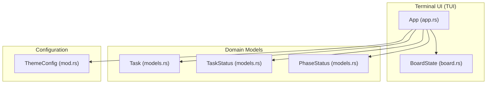
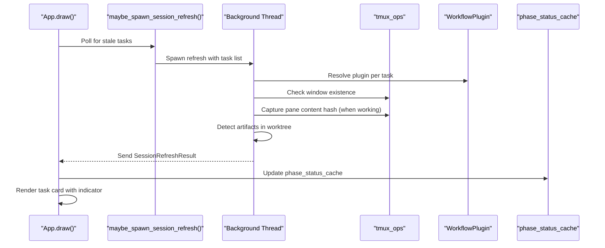
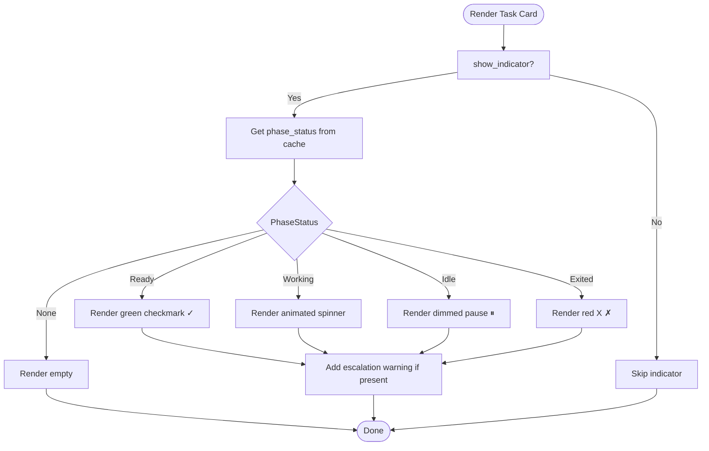
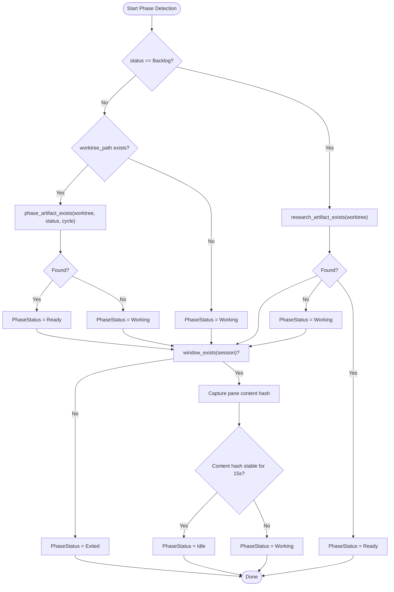
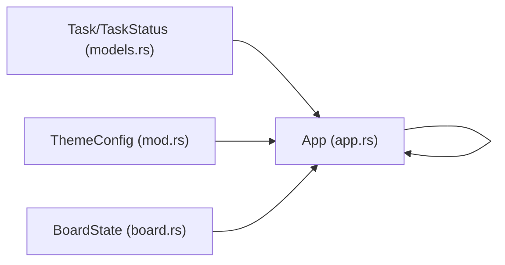

# Visual Status Indicators

<cite>
**Referenced Files in This Document**
- [app.rs](file://src/tui/app.rs)
- [board.rs](file://src/tui/board.rs)
- [models.rs](file://src/db/models.rs)
- [mod.rs](file://src/config/mod.rs)
</cite>

## Table of Contents
1. [Introduction](#introduction)
2. [Project Structure](#project-structure)
3. [Core Components](#core-components)
4. [Architecture Overview](#architecture-overview)
5. [Detailed Component Analysis](#detailed-component-analysis)
6. [Dependency Analysis](#dependency-analysis)
7. [Performance Considerations](#performance-considerations)
8. [Troubleshooting Guide](#troubleshooting-guide)
9. [Conclusion](#conclusion)

## Introduction
This document explains the visual status indicator system used in the terminal UI to communicate task progress and agent activity. It covers:
- Spinner animation for active tasks
- Green checkmark for completed phases
- Pause icon for idle agents
- Color coding and theme-driven styling
- Phase detection algorithm and how task status is determined
- Examples of status combinations and their meanings

## Project Structure
The visual status indicators are implemented in the terminal UI layer and rely on database models and configuration for task state and theme colors.

**Diagram sources**
- [app.rs:1256-1254](file://src/tui/app.rs#L1256-L1254)
- [board.rs:1-99](file://src/tui/board.rs#L1-L99)
- [models.rs:6-13](file://src/db/models.rs#L6-L13)
- [models.rs:233-245](file://src/db/models.rs#L233-L245)
- [mod.rs:42-95](file://src/config/mod.rs#L42-L95)

**Section sources**
- [app.rs:1256-1254](file://src/tui/app.rs#L1256-L1254)
- [board.rs:1-99](file://src/tui/board.rs#L1-L99)
- [models.rs:6-13](file://src/db/models.rs#L6-L13)
- [models.rs:233-245](file://src/db/models.rs#L233-L245)
- [mod.rs:42-95](file://src/config/mod.rs#L42-L95)

## Core Components
- TaskStatus: Kanban board status (Backlog, Planning, Running, Review, Done)
- PhaseStatus: Runtime-only phase detection (Working, Idle, Ready, Exited)
- ThemeConfig: Color palette for UI accents and dimmed states
- App drawing logic: Renders status indicators and escalations on task cards

Key responsibilities:
- TaskStatus drives column layout and high-level workflow progression
- PhaseStatus drives the visual indicator and idle detection
- ThemeConfig supplies color values for styling

**Section sources**
- [models.rs:6-56](file://src/db/models.rs#L6-L56)
- [models.rs:233-245](file://src/db/models.rs#L233-L245)
- [mod.rs:42-95](file://src/config/mod.rs#L42-L95)
- [app.rs:2471-2570](file://src/tui/app.rs#L2471-L2570)

## Architecture Overview
The visual status indicator is computed per task card and driven by periodic background polling of agent sessions.

**Diagram sources**
- [app.rs:6456-6641](file://src/tui/app.rs#L6456-L6641)
- [app.rs:6643-6704](file://src/tui/app.rs#L6643-L6704)

## Detailed Component Analysis

### Visual Indicator Rendering
Each task card displays a leading indicator that encodes phase status:
- Ready: Green checkmark
- Working: Animated spinner
- Idle: Pause symbol (dimmed)
- Exited: Red X
- None: No indicator shown

The indicator is combined with an optional escalation warning icon and the task title.

**Diagram sources**
- [app.rs:2528-2570](file://src/tui/app.rs#L2528-L2570)

**Section sources**
- [app.rs:2471-2570](file://src/tui/app.rs#L2471-L2570)

### Phase Detection Algorithm
PhaseStatus is determined by:
1. Artifact presence in the task's worktree for the current TaskStatus
2. Tmux window existence for the task’s session
3. Pane content hash stability for idle detection
4. Copy-back behavior on transitions

**Diagram sources**
- [app.rs:6544-6625](file://src/tui/app.rs#L6544-L6625)
- [app.rs:6643-6668](file://src/tui/app.rs#L6643-L6668)
- [app.rs:8402-8438](file://src/tui/app.rs#L8402-L8438)

**Section sources**
- [app.rs:6544-6625](file://src/tui/app.rs#L6544-L6625)
- [app.rs:6643-6668](file://src/tui/app.rs#L6643-L6668)
- [app.rs:8402-8438](file://src/tui/app.rs#L8402-L8438)

### Color Coding and Theme Integration
- Selected/unselected borders use theme colors
- Dimmed text for Idle states
- Accent color for warnings and highlights
- Indicator colors:
  - Ready: Green
  - Working: Yellow
  - Idle: Dimmed (theme-defined)
  - Exited: Red

ThemeConfig exposes hex color fields that are parsed to TUI colors at runtime.

**Section sources**
- [mod.rs:42-95](file://src/config/mod.rs#L42-L95)
- [app.rs:34-39](file://src/tui/app.rs#L34-L39)
- [app.rs:2534-2547](file://src/tui/app.rs#L2534-L2547)

### Task Progress and Status Mapping
TaskStatus controls the kanban column and high-level workflow stage. PhaseStatus controls the visual indicator and idle detection. The two are related as follows:
- Backlog: Research phase
- Planning: Planning phase
- Running: Running phase
- Review: Review phase
- Done: Terminal state

The phase detection logic maps TaskStatus to the appropriate artifact check and variant naming.

**Section sources**
- [models.rs:6-56](file://src/db/models.rs#L6-L56)
- [app.rs:8440-8479](file://src/tui/app.rs#L8440-L8479)

### Examples of Status Combinations
- Backlog with Ready: Research artifact detected; indicates the task can advance to Planning
- Running with Working: Agent is actively writing content; spinner animates
- Review with Idle: Agent has stopped updating for 15s; pause icon indicates waiting for user input
- Running with Exited: Agent process terminated unexpectedly; red X indicates failure
- Planning with Ready and escalation note: Planning artifact ready; warning icon indicates escalation

These combinations are derived from the intersection of TaskStatus and PhaseStatus, with optional escalation warnings.

**Section sources**
- [app.rs:2528-2570](file://src/tui/app.rs#L2528-L2570)
- [app.rs:6643-6668](file://src/tui/app.rs#L6643-L6668)

## Dependency Analysis
The visual status indicator depends on:
- Task model and TaskStatus for column mapping
- PhaseStatus for runtime state
- ThemeConfig for color resolution
- Background refresh pipeline for accurate PhaseStatus

**Diagram sources**
- [models.rs:6-56](file://src/db/models.rs#L6-L56)
- [mod.rs:42-95](file://src/config/mod.rs#L42-L95)
- [app.rs:1256-1254](file://src/tui/app.rs#L1256-L1254)
- [board.rs:1-99](file://src/tui/board.rs#L1-L99)

**Section sources**
- [models.rs:6-56](file://src/db/models.rs#L6-L56)
- [mod.rs:42-95](file://src/config/mod.rs#L42-L95)
- [app.rs:1256-1254](file://src/tui/app.rs#L1256-L1254)
- [board.rs:1-99](file://src/tui/board.rs#L1-L99)

## Performance Considerations
- Background refresh runs at ~2 Hz (2-second TTL) to balance responsiveness and overhead
- Content hash captures are limited to Working tasks with live windows
- Cache invalidation clears pane hashes on Ready/Exited to prevent stale idle detection
- Spinner animation advances on each draw loop to maintain smooth visuals

[No sources needed since this section provides general guidance]

## Troubleshooting Guide
Common issues and diagnostics:
- Indicator not updating: Verify background refresh is spawning and results are applied
- Idle not detected: Ensure pane content capture succeeds and hash remains stable for 15s
- Exited state unexpected: Confirm tmux window still exists; if artifact found, Exited may be overridden to Ready
- Color appears incorrect: Check ThemeConfig hex values and parsing

Operational hooks:
- Background refresh spawning and caching
- Applying refresh results and updating caches
- Idle detection thresholds and hash stabilization

**Section sources**
- [app.rs:6456-6641](file://src/tui/app.rs#L6456-L6641)
- [app.rs:6643-6668](file://src/tui/app.rs#L6643-L6668)

## Conclusion
The visual status indicator system combines TaskStatus and PhaseStatus with theme-driven colors to provide clear, real-time feedback on task progress. The phase detection algorithm reliably tracks agent activity, idle periods, and completion states, while the UI renders intuitive symbols and colors to guide user actions.