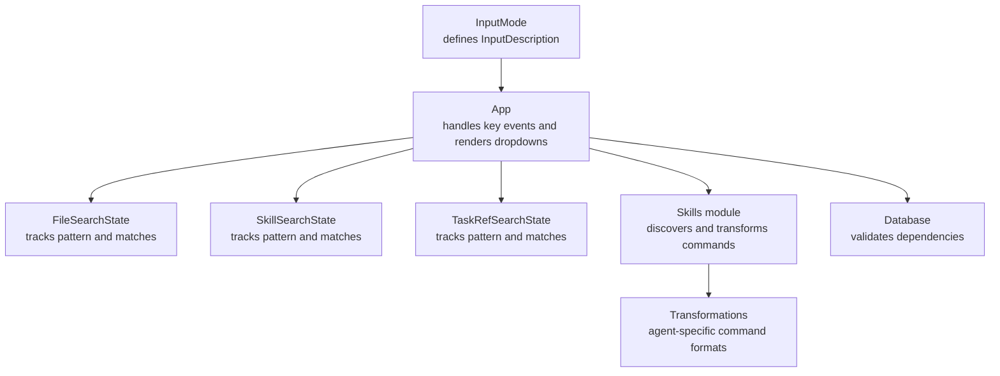
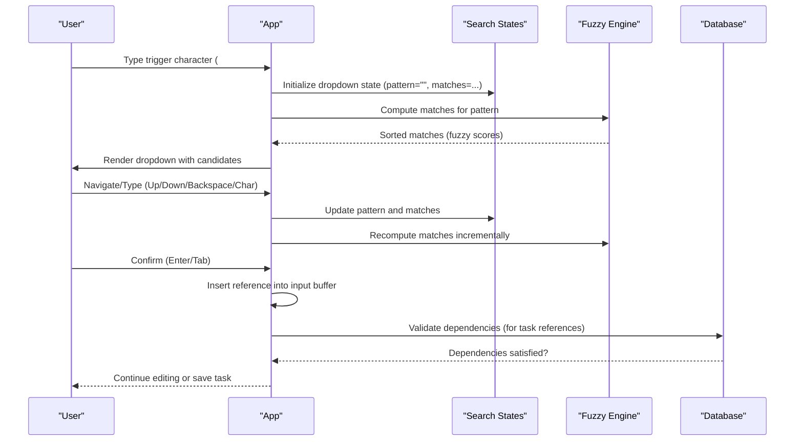
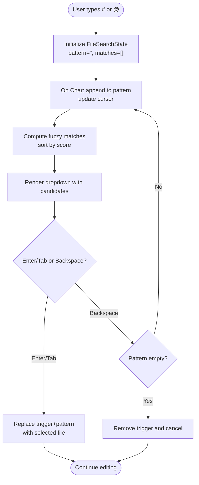
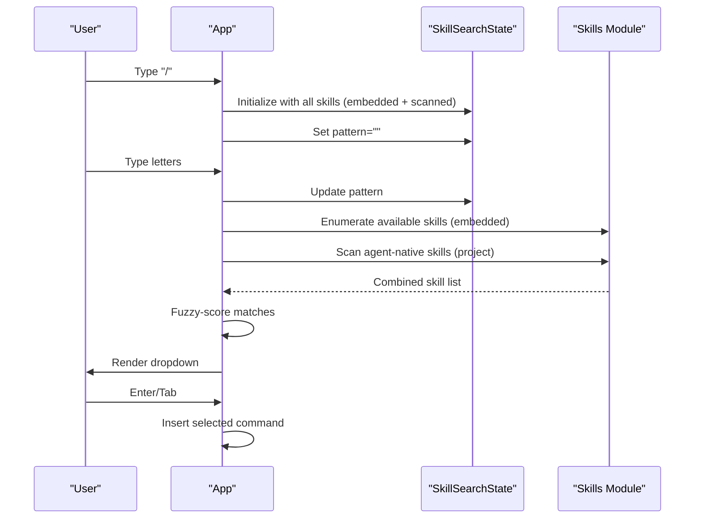
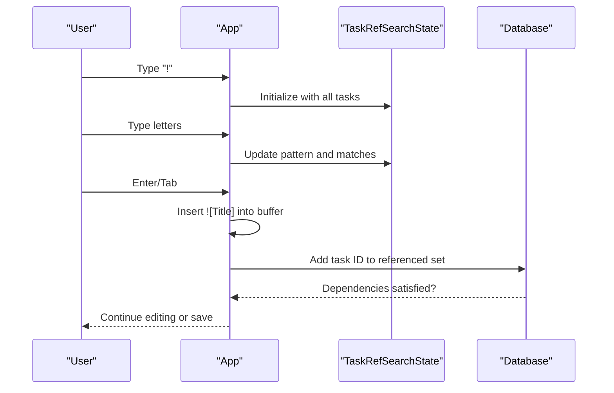
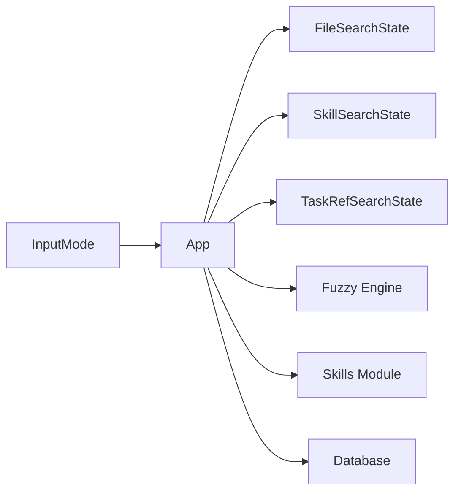

# Description Composition and References

<cite>
**Referenced Files in This Document**
- [input.rs](file://src/tui/input.rs)
- [app.rs](file://src/tui/app.rs)
- [skills.rs](file://src/skills.rs)
- [schema.rs](file://src/db/schema.rs)
- [app_tests.rs](file://tests/app_tests.rs)
- [db_tests.rs](file://tests/db_tests.rs)
</cite>

## Table of Contents
1. [Introduction](#introduction)
2. [Project Structure](#project-structure)
3. [Core Components](#core-components)
4. [Architecture Overview](#architecture-overview)
5. [Detailed Component Analysis](#detailed-component-analysis)
6. [Dependency Analysis](#dependency-analysis)
7. [Performance Considerations](#performance-considerations)
8. [Troubleshooting Guide](#troubleshooting-guide)
9. [Conclusion](#conclusion)

## Introduction
This document explains the task description composition phase with a focus on inline reference insertion. It covers:
- InputDescription mode and how the editor accepts keyboard input for task prompts
- Three reference types and their triggers: files with # and @, skills with /, and tasks with !
- Incremental dropdown search for each reference type powered by fuzzy matching
- Markdown-like reference syntax and how it integrates with the agent's skill system
- Examples of composing complex descriptions with multiple references
- Auto-completion and validation behaviors during composition

## Project Structure
The description composition feature spans three primary areas:
- Input mode definitions for the editor
- The TUI application logic that manages input buffers, dropdown states, and fuzzy search
- The skills subsystem that discovers and transforms agent-native commands

**Diagram sources**
- [input.rs:1-19](file://src/tui/input.rs#L1-L19)
- [app.rs:728-762](file://src/tui/app.rs#L728-L762)
- [skills.rs:31-115](file://src/skills.rs#L31-L115)
- [schema.rs:387-400](file://src/db/schema.rs#L387-L400)

**Section sources**
- [input.rs:1-19](file://src/tui/input.rs#L1-L19)
- [app.rs:728-762](file://src/tui/app.rs#L728-L762)
- [skills.rs:31-115](file://src/skills.rs#L31-L115)
- [schema.rs:387-400](file://src/db/schema.rs#L387-L400)

## Core Components
- InputDescription mode: The TUI enters a dedicated mode for editing task descriptions. While in this mode, the editor supports:
  - Triggering reference dropdowns via special characters
  - Incremental filtering with fuzzy search
  - Insertion of references into the input buffer
  - Navigation and completion via keyboard controls
- Reference types and triggers:
  - Files: # and @ (when typed at start-of-line or after whitespace)
  - Skills: / (when typed at start-of-line or after whitespace)
  - Tasks: ! (when typed at start-of-line or after whitespace)
- Dropdown rendering and selection:
  - File references: dropdown lists matched files
  - Skill references: dropdown lists commands with descriptions
  - Task references: dropdown lists tasks with titles and statuses
- Integration with the agent's skill system:
  - Built-in skills are embedded and available immediately
  - Project-specific skills are scanned from agent-native directories
  - Command transformations adapt canonical commands to agent-specific formats

**Section sources**
- [input.rs:1-19](file://src/tui/input.rs#L1-L19)
- [app.rs:4329-4428](file://src/tui/app.rs#L4329-L4428)
- [app.rs:1803-1838](file://src/tui/app.rs#L1803-L1838)
- [skills.rs:211-226](file://src/skills.rs#L211-L226)
- [skills.rs:259-408](file://src/skills.rs#L259-L408)

## Architecture Overview
The description composition pipeline combines user input, fuzzy search, and reference insertion with downstream validation.

**Diagram sources**
- [app.rs:4329-4428](file://src/tui/app.rs#L4329-L4428)
- [app.rs:4438-4474](file://src/tui/app.rs#L4438-L4474)
- [app.rs:7896-7983](file://src/tui/app.rs#L7896-L7983)
- [schema.rs:387-400](file://src/db/schema.rs#L387-L400)

## Detailed Component Analysis

### InputDescription Mode
- Purpose: Dedicated mode for editing task descriptions/prompts
- Behavior: Enables reference triggers and dropdowns; supports line continuation and saving tasks
- Integration: Works alongside other modes (Normal, SelectPlugin, InputTitle) controlled by InputMode

**Section sources**
- [input.rs:1-19](file://src/tui/input.rs#L1-L19)

### File Reference Search (# and @)
- Trigger conditions: Typed at start-of-line or after a space/newline
- State: FileSearchState tracks pattern, matches, selection, and trigger character
- Fuzzy search: Uses a custom fuzzy engine to rank files by relevance
- Insertion: On Enter/Tab, replaces trigger+pattern with the selected file path and preserves trailing text

**Diagram sources**
- [app.rs:4329-4348](file://src/tui/app.rs#L4329-L4348)
- [app.rs:4183-4254](file://src/tui/app.rs#L4183-L4254)
- [app.rs:4438-4447](file://src/tui/app.rs#L4438-L4447)
- [app.rs:7896-7983](file://src/tui/app.rs#L7896-L7983)

**Section sources**
- [app.rs:4329-4348](file://src/tui/app.rs#L4329-L4348)
- [app.rs:4183-4254](file://src/tui/app.rs#L4183-L4254)
- [app.rs:4438-4447](file://src/tui/app.rs#L4438-L4447)
- [app.rs:7896-7983](file://src/tui/app.rs#L7896-L7983)

### Skill Reference Search (/)
- Trigger conditions: Typed at start-of-line or after a space/newline
- State: SkillSearchState tracks pattern, matches, and original command set
- Discovery: Combines embedded built-in skills and project-scanned agent-native skills
- Matching: Fuzzy scoring against both command names and descriptions
- Insertion: On Enter/Tab, replaces / + pattern with the selected command

**Diagram sources**
- [app.rs:4350-4399](file://src/tui/app.rs#L4350-L4399)
- [app.rs:4449-4474](file://src/tui/app.rs#L4449-L4474)
- [skills.rs:211-226](file://src/skills.rs#L211-L226)
- [skills.rs:259-408](file://src/skills.rs#L259-L408)

**Section sources**
- [app.rs:4350-4399](file://src/tui/app.rs#L4350-L4399)
- [app.rs:4449-4474](file://src/tui/app.rs#L4449-L4474)
- [skills.rs:211-226](file://src/skills.rs#L211-L226)
- [skills.rs:259-408](file://src/skills.rs#L259-L408)

### Task Reference Search (!)
- Trigger conditions: Typed at start-of-line or after a space/newline
- State: TaskRefSearchState tracks pattern, matches, and selection
- Matching: Retrieves all tasks and filters incrementally as the user types
- Insertion: On Enter/Tab, inserts a reference in the form ![Title] and records the referenced task ID
- Validation: Dependencies are validated against the project database

**Diagram sources**
- [app.rs:4401-4428](file://src/tui/app.rs#L4401-L4428)
- [app.rs:4031-4096](file://src/tui/app.rs#L4031-L4096)
- [schema.rs:387-400](file://src/db/schema.rs#L387-L400)

**Section sources**
- [app.rs:4401-4428](file://src/tui/app.rs#L4401-L4428)
- [app.rs:4031-4096](file://src/tui/app.rs#L4031-L4096)
- [schema.rs:387-400](file://src/db/schema.rs#L387-L400)

### Markdown-like Reference Syntax and Agent Skill Integration
- File references: Inserted as literal paths after the trigger character
- Skill references: Inserted as agent-native commands (e.g., /namespace:command or $namespace-command)
- Task references: Inserted as ![Title] with the task title; internally tracked by task ID
- Agent-specific transformations:
  - Canonical commands are transformed per agent (e.g., OpenCode, Codex, Cursor)
  - Embedded skills are available without filesystem access
  - Project skills are scanned from agent-native directories

**Section sources**
- [app.rs:4114-4125](file://src/tui/app.rs#L4114-L4125)
- [app.rs:4190-4202](file://src/tui/app.rs#L4190-L4202)
- [app.rs:4031-4038](file://src/tui/app.rs#L4031-L4038)
- [skills.rs:85-115](file://src/skills.rs#L85-L115)
- [skills.rs:211-226](file://src/skills.rs#L211-L226)
- [skills.rs:259-408](file://src/skills.rs#L259-L408)

### Auto-completion and Validation Features
- Auto-completion:
  - Incremental filtering as the user types for all three reference types
  - Fuzzy scoring prioritizes exact matches and separators
- Validation:
  - Task dependency satisfaction is checked against the project database
  - Empty or invalid dependencies are handled gracefully

**Section sources**
- [app.rs:7896-7983](file://src/tui/app.rs#L7896-L7983)
- [schema.rs:387-400](file://src/db/schema.rs#L387-L400)
- [db_tests.rs:250-293](file://tests/db_tests.rs#L250-L293)

## Dependency Analysis
The description composition feature depends on:
- InputMode for enabling the editor mode
- Search states for managing dropdown UI and filtering
- Fuzzy search utilities for ranking candidates
- Skills module for discovering and transforming commands
- Database for validating task dependencies

**Diagram sources**
- [input.rs:1-19](file://src/tui/input.rs#L1-L19)
- [app.rs:728-762](file://src/tui/app.rs#L728-L762)
- [app.rs:7896-7983](file://src/tui/app.rs#L7896-L7983)
- [skills.rs:211-226](file://src/skills.rs#L211-L226)
- [schema.rs:387-400](file://src/db/schema.rs#L387-L400)

**Section sources**
- [input.rs:1-19](file://src/tui/input.rs#L1-L19)
- [app.rs:728-762](file://src/tui/app.rs#L728-L762)
- [app.rs:7896-7983](file://src/tui/app.rs#L7896-L7983)
- [skills.rs:211-226](file://src/skills.rs#L211-L226)
- [schema.rs:387-400](file://src/db/schema.rs#L387-L400)

## Performance Considerations
- Fuzzy search complexity:
  - File search: O(N) over tracked files with per-file scoring; capped at a small number of results
  - Skill search: O(M) to score against combined skill list; capped at a small number of results
- Memory:
  - Search states hold small lists of candidates and a copy of the full skill list for fast re-filtering
- Rendering:
  - Dropdowns are rendered only when active and bounded in height

[No sources needed since this section provides general guidance]

## Troubleshooting Guide
- References not appearing:
  - Ensure the trigger occurs at start-of-line or after a space/newline
  - Verify the project has files/skills/tasks available for fuzzy matching
- Skill command not recognized:
  - Confirm the agent supports interactive skill invocation
  - Check that the skill exists in the appropriate agent-native directory
- Task reference not inserted:
  - Make sure a task is selected from the dropdown before confirming
  - Confirm the task ID is recorded in the wizard referenced set
- Validation errors:
  - Review dependency satisfaction logic and referenced task statuses

**Section sources**
- [app.rs:4350-4399](file://src/tui/app.rs#L4350-L4399)
- [app.rs:4401-4428](file://src/tui/app.rs#L4401-L4428)
- [app.rs:4114-4125](file://src/tui/app.rs#L4114-L4125)
- [app.rs:4190-4202](file://src/tui/app.rs#L4190-L4202)
- [app.rs:4031-4038](file://src/tui/app.rs#L4031-L4038)
- [schema.rs:387-400](file://src/db/schema.rs#L387-L400)

## Conclusion
The description composition phase provides an efficient, keyboard-driven workflow for embedding references into task prompts. By leveraging incremental fuzzy search and agent-aware command transformations, users can compose rich descriptions that combine files, skills, and tasks seamlessly. Validation ensures dependencies are respected, and the UI remains responsive through bounded dropdowns and targeted recomputation.