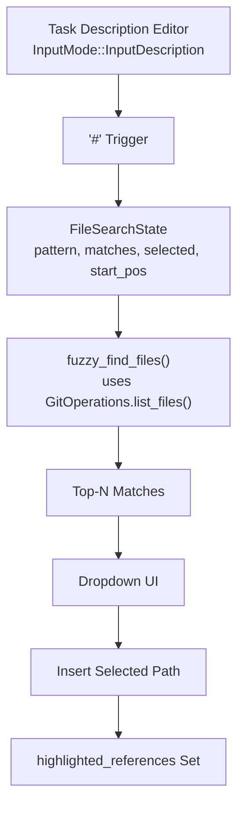
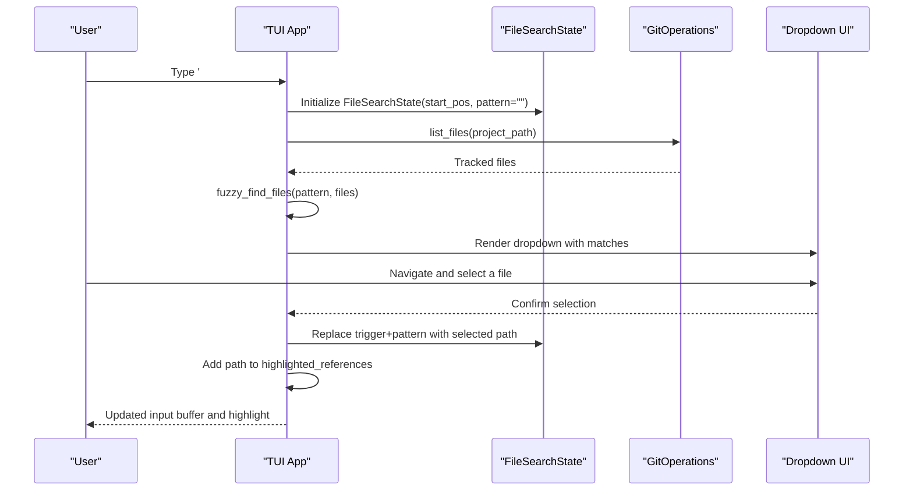
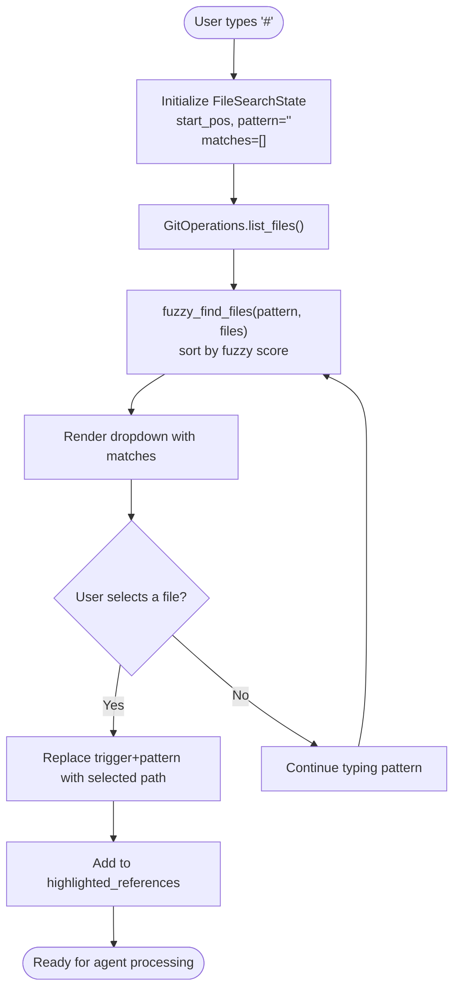
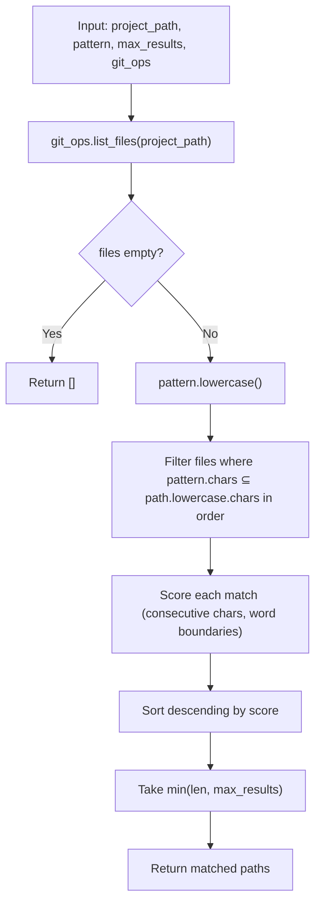
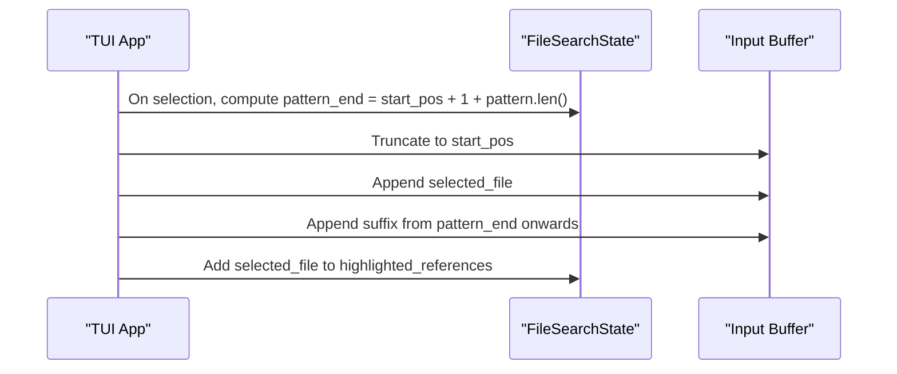
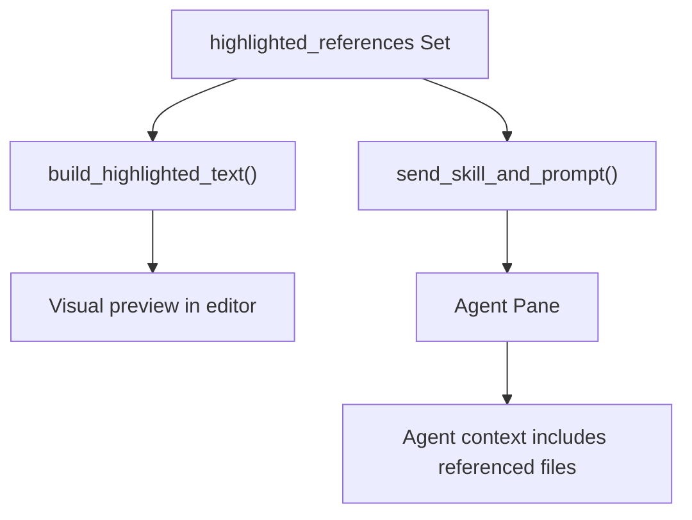
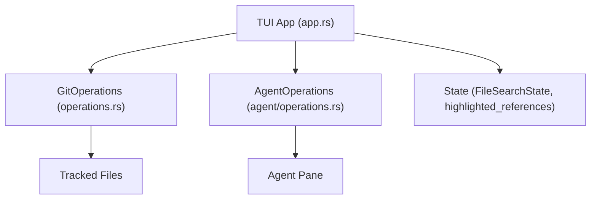

# File References and Search

<cite>
**Referenced Files in This Document**
- [app.rs](file://src/tui/app.rs)
- [operations.rs](file://src/git/operations.rs)
- [app_tests.rs](file://src/tui/app_tests.rs)
- [input.rs](file://src/tui/input.rs)
- [main.rs](file://src/main.rs)
- [lib.rs](file://src/lib.rs)
</cite>

## Table of Contents
1. [Introduction](#introduction)
2. [Project Structure](#project-structure)
3. [Core Components](#core-components)
4. [Architecture Overview](#architecture-overview)
5. [Detailed Component Analysis](#detailed-component-analysis)
6. [Dependency Analysis](#dependency-analysis)
7. [Performance Considerations](#performance-considerations)
8. [Troubleshooting Guide](#troubleshooting-guide)
9. [Conclusion](#conclusion)

## Introduction
This document explains the file reference system that enables users to reference files in the project using the # trigger within the task description editor. It covers how incremental file search works with pattern matching and fuzzy filtering, how file paths are resolved, and how file references are processed by agents. It also provides examples of effective file references and clarifies the relationship between file references and code context.

## Project Structure
The file reference system is implemented in the TUI application and integrates with Git operations for file discovery. The key elements are:
- A dedicated input mode for editing task descriptions
- A file search state that tracks the trigger position, pattern, and matches
- A fuzzy search algorithm that ranks files based on relevance
- A mechanism to replace the trigger + pattern with the selected file path
- A highlighting system that marks referenced files in the UI

**Diagram sources**
- [app.rs:4335-4447](file://src/tui/app.rs#L4335-L4447)
- [app.rs:7896-7939](file://src/tui/app.rs#L7896-L7939)
- [operations.rs:245-257](file://src/git/operations.rs#L245-L257)

**Section sources**
- [app.rs:192-197](file://src/tui/app.rs#L192-L197)
- [input.rs:1-19](file://src/tui/input.rs#L1-L19)

## Core Components
- FileSearchState: Tracks the active file search, including the pattern, available matches, currently selected match, and the starting position of the trigger in the input buffer.
- fuzzy_find_files(): Performs incremental fuzzy search over tracked files discovered via Git, returning top-N matches sorted by relevance.
- GitOperations.list_files(): Provides the authoritative list of files respecting .gitignore and repository state.
- build_highlighted_text(): Renders the task description with referenced file paths visually highlighted.
- Agent integration: When sending prompts to agents, the system can transform or combine skill commands and prompts, ensuring referenced files are included in the agent's context.

**Section sources**
- [app.rs:729-740](file://src/tui/app.rs#L729-L740)
- [app.rs:7896-7939](file://src/tui/app.rs#L7896-L7939)
- [operations.rs:62-63](file://src/git/operations.rs#L62-L63)
- [operations.rs:245-257](file://src/git/operations.rs#L245-L257)
- [app.rs:7850-7894](file://src/tui/app.rs#L7850-L7894)

## Architecture Overview
The file reference workflow connects user input, fuzzy search, UI rendering, and agent communication:

**Diagram sources**
- [app.rs:4335-4447](file://src/tui/app.rs#L4335-L4447)
- [app.rs:7896-7939](file://src/tui/app.rs#L7896-L7939)
- [operations.rs:245-257](file://src/git/operations.rs#L245-L257)

## Detailed Component Analysis

### File Search State and Trigger Handling
- Trigger activation: The # character activates file search mode when typed in the task description editor. The system records the insertion position to later replace the trigger and pattern with the chosen file path.
- Incremental updates: As the user types, the system recalculates matches using fuzzy_find_files and updates the dropdown.
- Selection and insertion: Confirming a selection replaces the trigger+pattern with the selected file path and adds it to the highlighted_references set for visual emphasis.

**Diagram sources**
- [app.rs:4335-4447](file://src/tui/app.rs#L4335-L4447)
- [app.rs:7896-7939](file://src/tui/app.rs#L7896-L7939)

**Section sources**
- [app.rs:4335-4447](file://src/tui/app.rs#L4335-L4447)
- [app.rs:4183-4231](file://src/tui/app.rs#L4183-L4231)

### Fuzzy Search Algorithm
- Data source: Uses Git to enumerate files, ensuring only tracked files are considered and .gitignore rules are respected.
- Pattern matching: Converts both the pattern and file paths to lowercase for case-insensitive comparison.
- Scoring: A custom fuzzy scoring function checks if all pattern characters appear in order within the path, awarding bonuses for:
  - Word boundaries (e.g., after '/', '_', '-', '.')
  - Consecutive character matches
- Results: Returns up to N matches (default 10) sorted by score, with ties broken by path ordering.

**Diagram sources**
- [app.rs:7896-7939](file://src/tui/app.rs#L7896-L7939)
- [app.rs:7941-7959](file://src/tui/app.rs#L7941-L7959)
- [operations.rs:245-257](file://src/git/operations.rs#L245-L257)

**Section sources**
- [app.rs:7896-7939](file://src/tui/app.rs#L7896-L7939)
- [app.rs:7941-7959](file://src/tui/app.rs#L7941-L7959)
- [app_tests.rs:588-629](file://src/tui/app_tests.rs#L588-L629)

### File Path Resolution and Replacement
- Position tracking: The system stores the start position of the trigger to precisely replace only the trigger and pattern portion of the input buffer.
- Replacement semantics: After selection, the suffix after the pattern remains intact, preserving any surrounding text.
- Highlighting: The inserted path is added to a set of highlighted references, enabling visual emphasis in the UI.

**Diagram sources**
- [app.rs:4190-4202](file://src/tui/app.rs#L4190-L4202)

**Section sources**
- [app.rs:4190-4202](file://src/tui/app.rs#L4190-L4202)

### Relationship Between File References and Code Context
- UI highlighting: The build_highlighted_text function scans the task description for referenced file paths and renders them with a distinct style, aiding readability and context awareness.
- Agent processing: When sending prompts to agents, the system can:
  - Combine skill commands and prompts appropriately depending on the agent type
  - Clear agent context when transitioning phases (e.g., Claude supports a clear command)
  - Wait for agent readiness and prompt triggers before sending subsequent messages
- Artifact handling: The system can copy referenced task artifacts and diffs into a dedicated references directory for downstream processing.

**Diagram sources**
- [app.rs:7850-7894](file://src/tui/app.rs#L7850-L7894)
- [app.rs:8158-8326](file://src/tui/app.rs#L8158-L8326)
- [app.rs:7244-7269](file://src/tui/app.rs#L7244-L7269)

**Section sources**
- [app.rs:7850-7894](file://src/tui/app.rs#L7850-L7894)
- [app.rs:8158-8326](file://src/tui/app.rs#L8158-L8326)
- [app.rs:7244-7269](file://src/tui/app.rs#L7244-L7269)

## Dependency Analysis
The file reference system depends on:
- Git operations for enumerating files
- TUI state management for input handling and rendering
- Agent operations for prompt delivery and context management

**Diagram sources**
- [app.rs:4438-4447](file://src/tui/app.rs#L4438-L4447)
- [operations.rs:11-75](file://src/git/operations.rs#L11-L75)

**Section sources**
- [app.rs:4438-4447](file://src/tui/app.rs#L4438-L4447)
- [operations.rs:11-75](file://src/git/operations.rs#L11-L75)

## Performance Considerations
- Fuzzy search complexity: The fuzzy scoring iterates through each candidate file and its characters, with a time complexity proportional to O(N × M) where N is the number of tracked files and M is the average path length. Sorting adds O(N log N).
- Practical limits: The system caps results to a small number (default 10) to keep UI responsiveness.
- Git enumeration cost: Git operations are fast for typical repositories, but very large repos may benefit from precomputing file lists or caching.

## Troubleshooting Guide
- No matches found:
  - Verify the repository is a Git repository and contains tracked files.
  - Ensure .gitignore is not excluding desired files unintentionally.
- Pattern yields unexpected results:
  - The fuzzy algorithm prioritizes word boundaries and consecutive matches. Try shorter, more distinctive fragments of the path.
- Selection does not replace the trigger+pattern:
  - Confirm the input mode is InputDescription and that the cursor is positioned correctly when typing #.
- Highlighting not applied:
  - Ensure the referenced path exists in the repository and matches the case-insensitive fuzzy search.

**Section sources**
- [app.rs:4335-4447](file://src/tui/app.rs#L4335-L4447)
- [app_tests.rs:588-629](file://src/tui/app_tests.rs#L588-L629)

## Conclusion
The file reference system provides an efficient, incremental way to include precise file paths in task descriptions. By leveraging Git for file discovery, a custom fuzzy scorer for ranking, and a robust replacement mechanism, it integrates seamlessly with the TUI and agent workflows. Effective usage involves typing # followed by a concise pattern, selecting the intended file from the dropdown, and relying on the highlighting to confirm context inclusion.