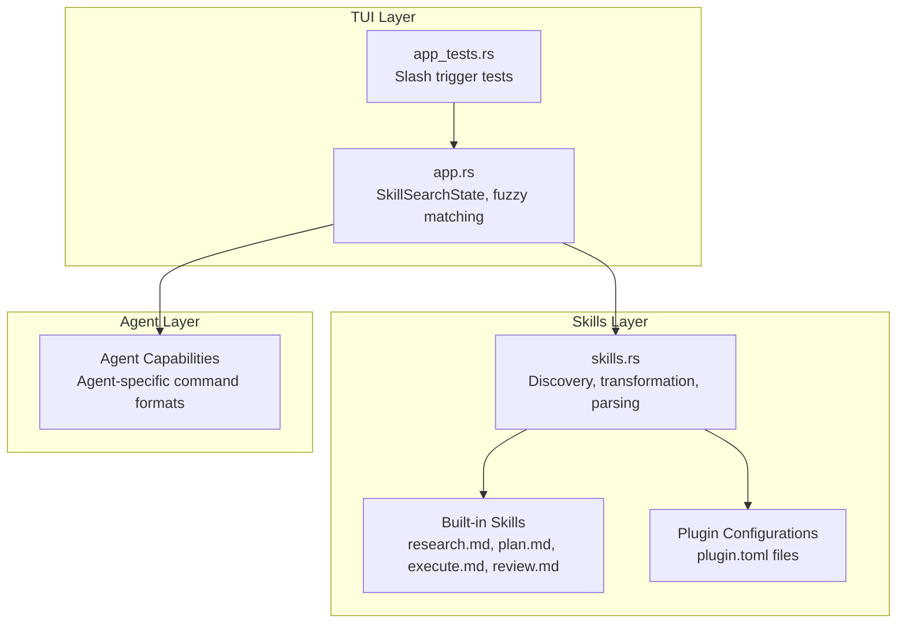
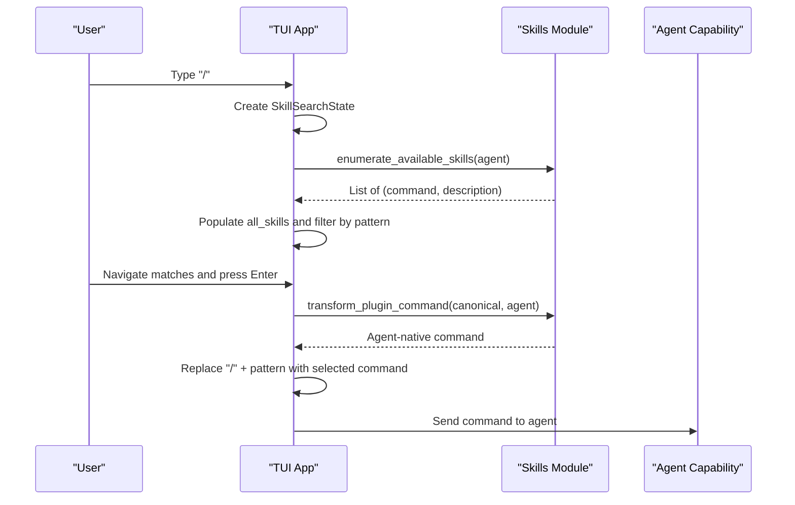
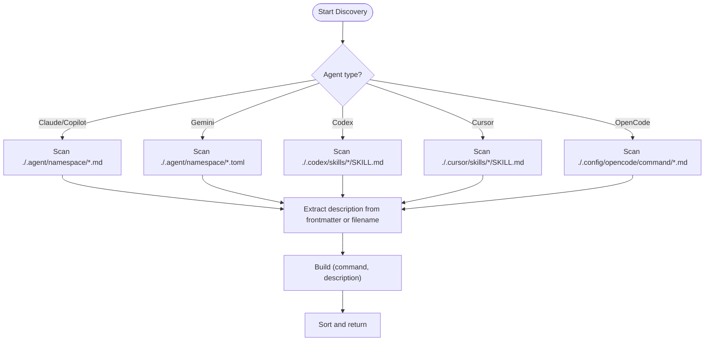
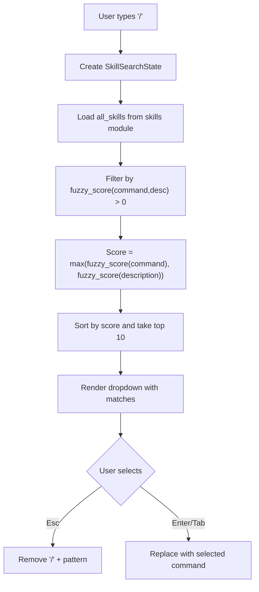
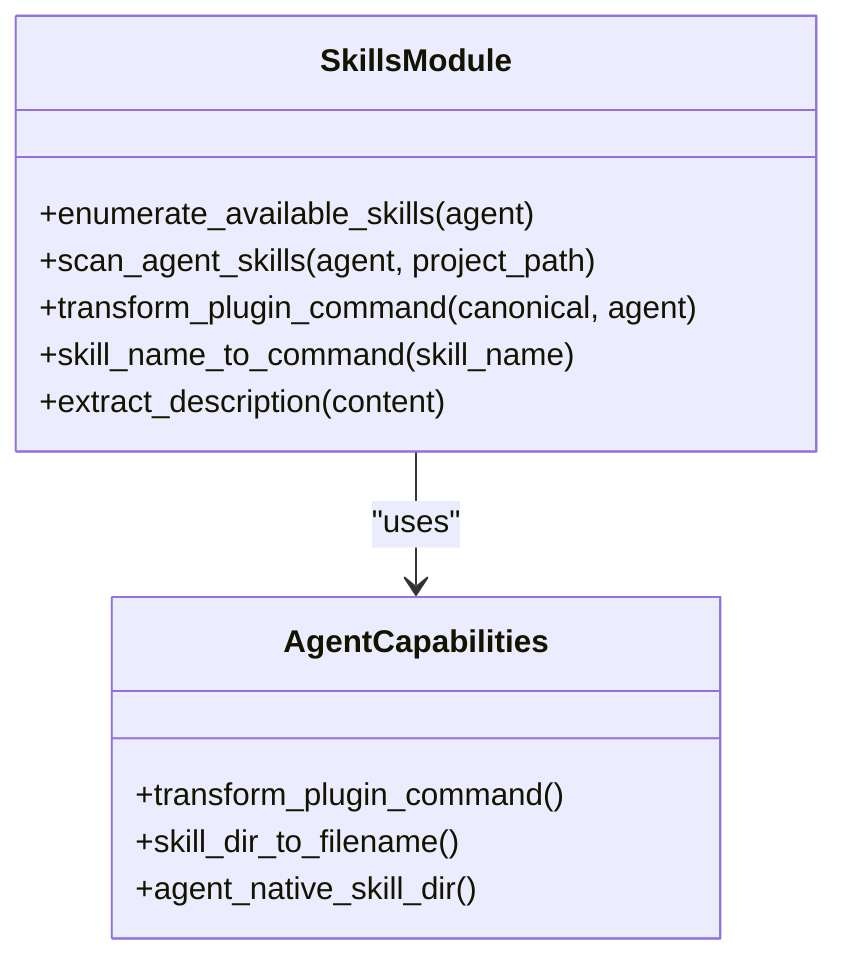
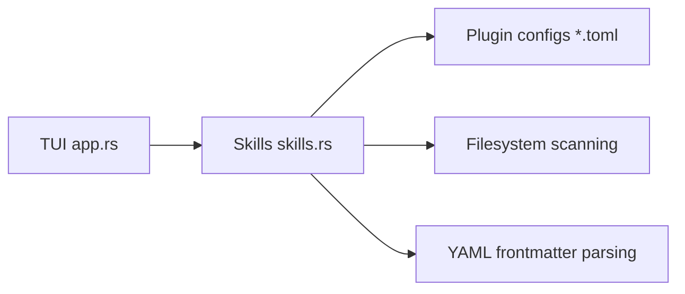

# Skill References and Search

<cite>
**Referenced Files in This Document**
- [skills.rs](file://src/skills.rs)
- [app.rs](file://src/tui/app.rs)
- [app_tests.rs](file://src/tui/app_tests.rs)
- [plugin.toml](file://plugins/agtx/plugin.toml)
- [research.md](file://plugins/agtx/skills/research.md)
- [plan.md](file://plugins/agtx/skills/plan.md)
- [execute.md](file://plugins/agtx/skills/execute.md)
- [review.md](file://plugins/agtx/skills/review.md)
- [plugin.toml](file://plugins/agent-skills/plugin.toml)
- [plugin.toml](file://plugins/gsd/plugin.toml)
- [plugin.toml](file://plugins/agtx-terse/plugin.toml)
</cite>

## Table of Contents
1. [Introduction](#introduction)
2. [Project Structure](#project-structure)
3. [Core Components](#core-components)
4. [Architecture Overview](#architecture-overview)
5. [Detailed Component Analysis](#detailed-component-analysis)
6. [Dependency Analysis](#dependency-analysis)
7. [Performance Considerations](#performance-considerations)
8. [Troubleshooting Guide](#troubleshooting-guide)
9. [Conclusion](#conclusion)

## Introduction
This document explains the skill reference system powered by the "/" trigger for referencing agent skills. It covers how skills are discovered, searched, filtered, and transformed for different agents. It also documents how skills map to agent capabilities and how the system integrates with the agent's skill transformation pipeline.

## Project Structure
The skill reference system spans several modules:
- Skills discovery and transformation live in the skills module
- The TUI manages interactive skill search triggered by "/"
- Plugin configurations define built-in skills and agent-specific commands
- Agent capability mapping ensures skills are presented in agent-appropriate forms

**Diagram sources**
- [skills.rs:1-409](file://src/skills.rs#L1-L409)
- [app.rs:745-753](file://src/tui/app.rs#L745-L753)
- [app_tests.rs:4481-4507](file://src/tui/app_tests.rs#L4481-L4507)

**Section sources**
- [skills.rs:1-409](file://src/skills.rs#L1-L409)
- [app.rs:745-753](file://src/tui/app.rs#L745-L753)
- [app_tests.rs:4481-4507](file://src/tui/app_tests.rs#L4481-L4507)

## Core Components
- Skill discovery and enumeration:
  - Built-in skills are embedded and enumerated for agent-native invocation
  - Native agent skills are scanned from project directories
- Skill search and filtering:
  - Interactive skill search triggered by "/" with fuzzy matching on command and description
- Agent capability mapping:
  - Command transformation to match agent-specific invocation syntax
  - Frontmatter extraction for descriptions

**Section sources**
- [skills.rs:211-226](file://src/skills.rs#L211-L226)
- [skills.rs:259-408](file://src/skills.rs#L259-L408)
- [app.rs:4449-4474](file://src/tui/app.rs#L4449-L4474)

## Architecture Overview
The skill reference system integrates three layers:
- Skills layer: embeds built-in skills and scans native agent skills, extracting descriptions and transforming commands
- TUI layer: captures "/" input, builds a searchable list, and replaces the trigger with the selected skill command
- Agent layer: maps skill commands to agent-specific invocation formats

**Diagram sources**
- [app.rs:4102-4122](file://src/tui/app.rs#L4102-L4122)
- [skills.rs:211-226](file://src/skills.rs#L211-L226)
- [skills.rs:93-115](file://src/skills.rs#L93-L115)

## Detailed Component Analysis

### Skill Discovery and Enumeration
- Built-in skills:
  - Embedded at compile time and exposed as (directory_name, content) tuples
  - Enumerated into agent-native (command, description) pairs using canonical transformations
- Native agent skills:
  - Scanned from agent-specific directories
  - Supported agents include Claude/Copilot, Gemini, Codex, Cursor, and OpenCode
  - Descriptions extracted from YAML frontmatter or file stems

**Diagram sources**
- [skills.rs:259-408](file://src/skills.rs#L259-L408)

**Section sources**
- [skills.rs:14-21](file://src/skills.rs#L14-L21)
- [skills.rs:211-226](file://src/skills.rs#L211-L226)
- [skills.rs:259-408](file://src/skills.rs#L259-L408)

### Skill Search and Filtering
- Trigger:
  - "/" at word boundary triggers skill search
  - Tests confirm "/" does not trigger mid-word
- Search state:
  - SkillSearchState holds pattern, matches, all_skills, and selection
- Matching:
  - Fuzzy scoring on command and description
  - Maximum of both scores determines relevance
  - Top 10 results returned and sorted by score
- Insertion:
  - On Enter/Tab, the trigger plus pattern is replaced with the selected command

**Diagram sources**
- [app.rs:4449-4474](file://src/tui/app.rs#L4449-L4474)
- [app_tests.rs:4481-4507](file://src/tui/app_tests.rs#L4481-L4507)

**Section sources**
- [app.rs:4449-4474](file://src/tui/app.rs#L4449-L4474)
- [app_tests.rs:4481-4507](file://src/tui/app_tests.rs#L4481-L4507)

### Agent Capability Mapping and Transformation
- Canonical to agent-native command:
  - Canonical form uses "/" + "namespace:command"
  - Transformed per agent rules (e.g., colon to hyphen, slash to dollar)
- Skill name to command:
  - Converts "agtx-plan" to "agtx:plan" by replacing first hyphen with ":"
- Frontmatter extraction:
  - Reads YAML frontmatter to extract descriptions
- Agent-native filenames:
  - Maps directory names to agent-specific file extensions and naming

**Diagram sources**
- [skills.rs:211-226](file://src/skills.rs#L211-L226)
- [skills.rs:93-115](file://src/skills.rs#L93-L115)
- [skills.rs:47-81](file://src/skills.rs#L47-L81)
- [skills.rs:196-209](file://src/skills.rs#L196-L209)

**Section sources**
- [skills.rs:47-81](file://src/skills.rs#L47-L81)
- [skills.rs:93-115](file://src/skills.rs#L93-L115)
- [skills.rs:196-209](file://src/skills.rs#L196-L209)

### Examples of Skill References
- Built-in agtx skills:
  - Commands follow the pattern "/agtx:{phase}" where phase is research, plan, execute, or review
  - Descriptions are taken from SKILL.md frontmatter
- Plugin-provided skills:
  - Plugins define commands like "/gsd:plan-phase {phase}" or "/spec" for research
  - Agent-skills plugin maps to "/spec", "/plan", "/build", "/review"
- Agent-native skills:
  - Found under agent-specific directories (e.g., .claude/commands, .gemini/commands)
  - Descriptions parsed from frontmatter or file names

**Section sources**
- [plugin.toml:11-16](file://plugins/agtx/plugin.toml#L11-L16)
- [research.md:1-45](file://plugins/agtx/skills/research.md#L1-L45)
- [plan.md:1-43](file://plugins/agtx/skills/plan.md#L1-L43)
- [execute.md:1-39](file://plugins/agtx/skills/execute.md#L1-L39)
- [review.md:1-36](file://plugins/agtx/skills/review.md#L1-L36)
- [plugin.toml:8-19](file://plugins/agent-skills/plugin.toml#L8-L19)
- [plugin.toml:15-21](file://plugins/gsd/plugin.toml#L15-L21)

### Integration with Agent's Skill Transformation System
- The TUI collects the agent name and delegates command transformation to the skills module
- The skills module applies agent-specific rules to produce the correct invocation syntax
- This ensures that skill references integrate seamlessly with the agent's native command format

**Section sources**
- [skills.rs:93-115](file://src/skills.rs#L93-L115)
- [app.rs:4102-4122](file://src/tui/app.rs#L4102-L4122)

## Dependency Analysis
- The TUI depends on the skills module for:
  - Loading available skills
  - Transforming commands for the selected agent
- The skills module depends on:
  - Plugin configurations for built-in commands
  - File system scanning for agent-native skills
  - Frontmatter parsing for descriptions

**Diagram sources**
- [app.rs:4449-4474](file://src/tui/app.rs#L4449-L4474)
- [skills.rs:141-194](file://src/skills.rs#L141-L194)
- [skills.rs:259-408](file://src/skills.rs#L259-L408)
- [skills.rs:196-209](file://src/skills.rs#L196-L209)

**Section sources**
- [app.rs:4449-4474](file://src/tui/app.rs#L4449-L4474)
- [skills.rs:141-194](file://src/skills.rs#L141-L194)
- [skills.rs:259-408](file://src/skills.rs#L259-L408)
- [skills.rs:196-209](file://src/skills.rs#L196-L209)

## Performance Considerations
- Fuzzy matching is bounded to top 10 results to limit computation
- Sorting occurs after filtering to minimize overhead
- Built-in skills are embedded to avoid runtime file I/O during enumeration
- Native agent skill scanning reads only the necessary metadata (frontmatter or file names)

## Troubleshooting Guide
- "/" does not trigger skill search mid-word:
  - The system checks word boundaries; ensure "/" is preceded by whitespace or start of line
- No skills appear:
  - Verify agent-native directories exist and contain valid files
  - Confirm plugin configurations support the selected agent
- Incorrect command format:
  - Ensure the agent-specific transformation rules are applied (e.g., colon to hyphen for certain agents)
- Description missing:
  - For native skills, ensure frontmatter is properly formatted or rely on file stem fallback

**Section sources**
- [app_tests.rs:4481-4507](file://src/tui/app_tests.rs#L4481-L4507)
- [skills.rs:259-408](file://src/skills.rs#L259-L408)
- [skills.rs:93-115](file://src/skills.rs#L93-L115)

## Conclusion
The skill reference system provides an efficient, agent-aware way to discover and invoke skills using the "/" trigger. It combines embedded built-in skills, native agent skill discovery, and intelligent fuzzy search to deliver a seamless experience. The system’s transformation layer ensures that skill references integrate cleanly with each agent’s command format, enabling consistent behavior across diverse agent ecosystems.