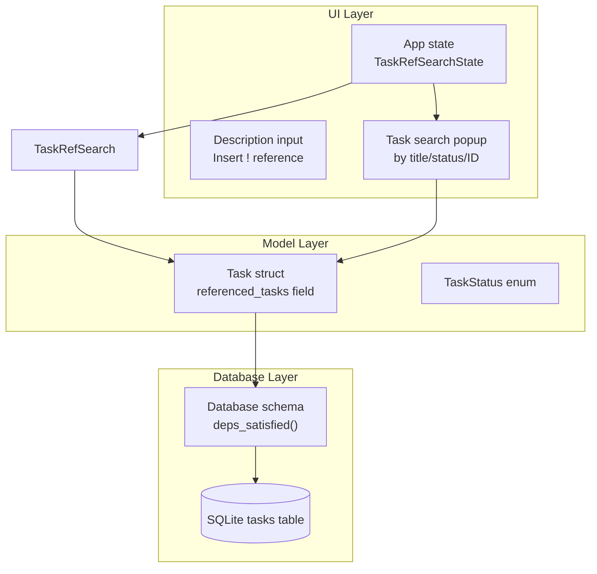
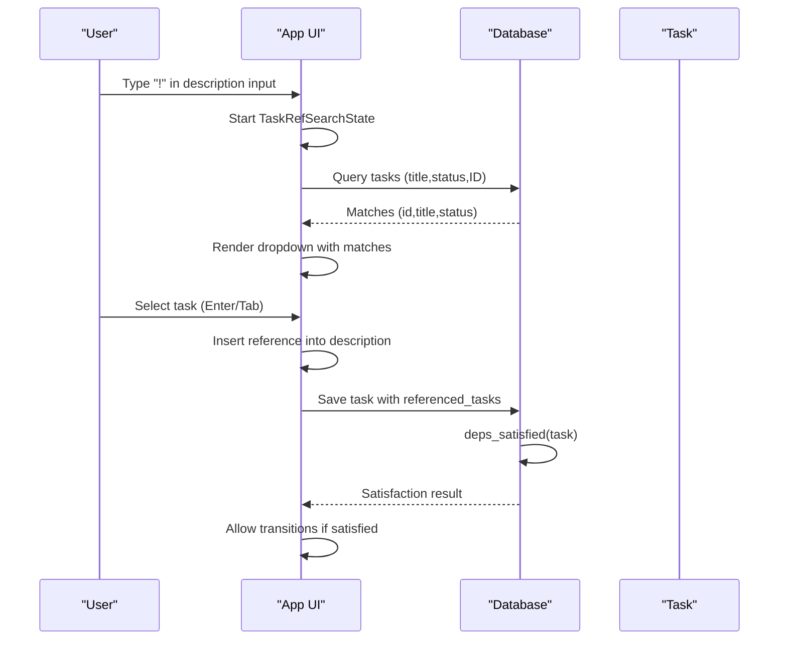
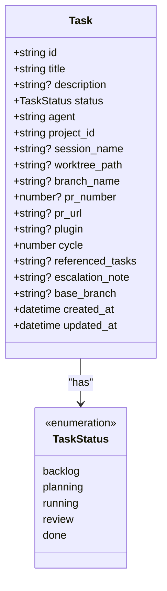
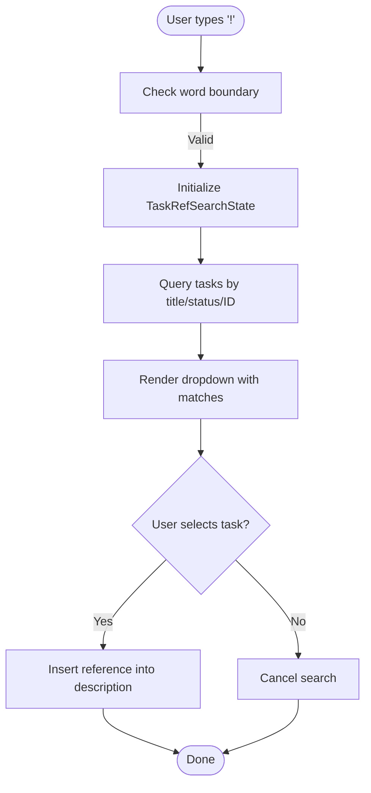
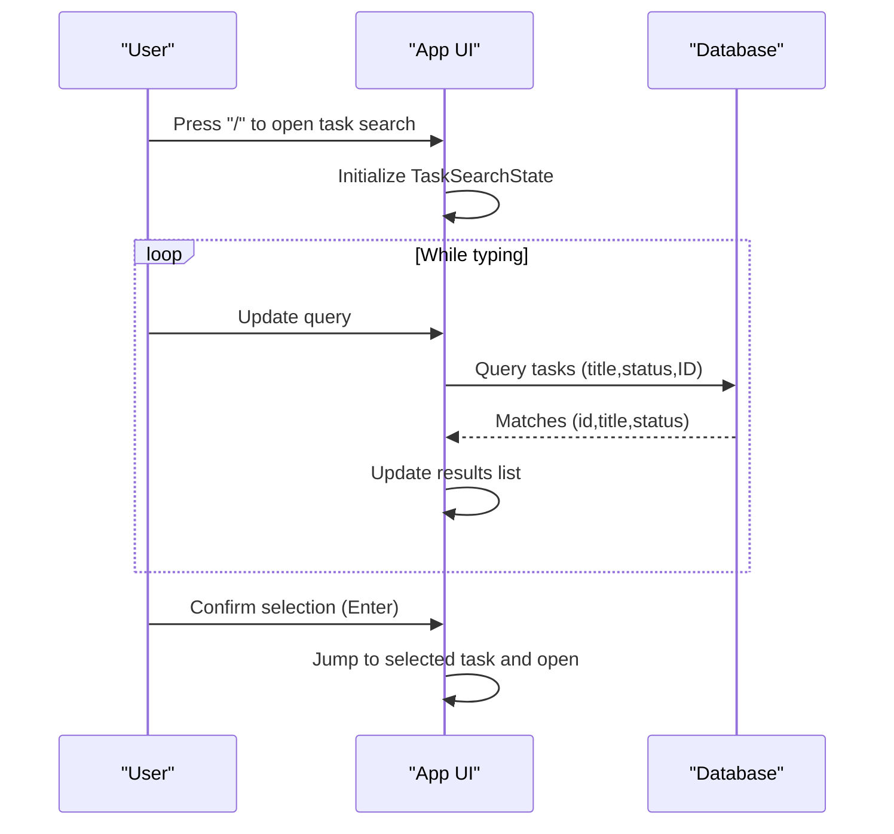
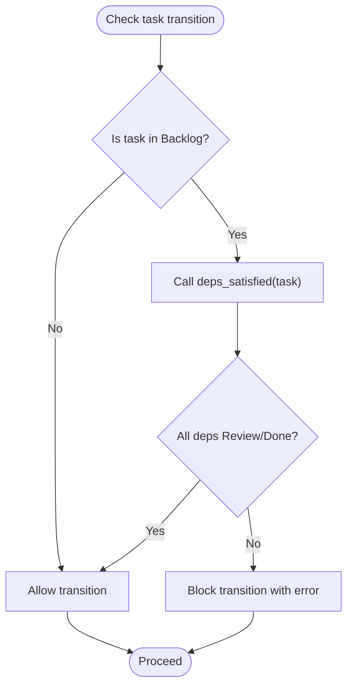
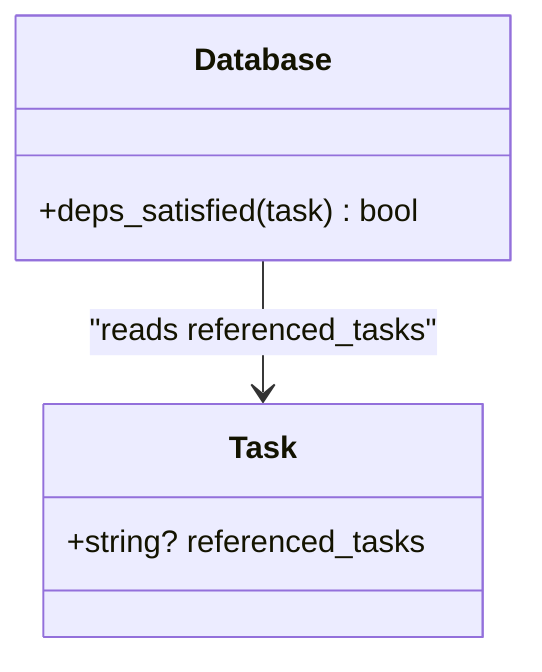
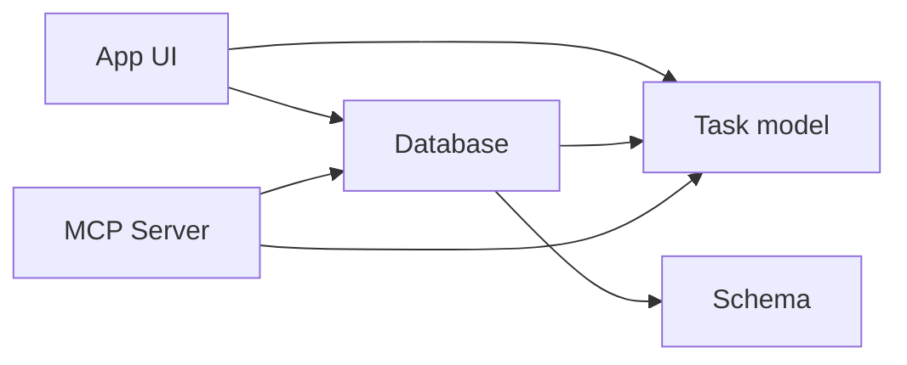

# Task References and Cross-linking

<cite>
**Referenced Files in This Document**
- [app.rs](file://src/tui/app.rs)
- [models.rs](file://src/db/models.rs)
- [schema.rs](file://src/db/schema.rs)
- [db_tests.rs](file://tests/db_tests.rs)
- [server.rs](file://src/mcp/server.rs)
</cite>

## Table of Contents
1. [Introduction](#introduction)
2. [Project Structure](#project-structure)
3. [Core Components](#core-components)
4. [Architecture Overview](#architecture-overview)
5. [Detailed Component Analysis](#detailed-component-analysis)
6. [Dependency Analysis](#dependency-analysis)
7. [Performance Considerations](#performance-considerations)
8. [Troubleshooting Guide](#troubleshooting-guide)
9. [Conclusion](#conclusion)

## Introduction
This document explains the task reference system that enables cross-task linking using the `!` trigger. It covers how tasks can reference other tasks, how the system enforces dependency rules, and how this improves workflow coordination across the lifecycle of tasks. You will learn how to search for tasks by title, status, and ID, how to create cross-links between tasks, and how dependency satisfaction affects state transitions.

## Project Structure
The task reference system spans three main areas:
- Task model definition and storage
- UI integration for task reference search and insertion
- Database logic for dependency satisfaction checks

**Diagram sources**
- [models.rs:58-133](file://src/db/models.rs#L58-L133)
- [schema.rs:387-400](file://src/db/schema.rs#L387-L400)
- [app.rs:755-762](file://src/tui/app.rs#L755-L762)
- [app.rs:1840-1895](file://src/tui/app.rs#L1840-L1895)

**Section sources**
- [models.rs:58-133](file://src/db/models.rs#L58-L133)
- [schema.rs:97-148](file://src/db/schema.rs#L97-L148)
- [app.rs:755-762](file://src/tui/app.rs#L755-L762)

## Core Components
- Task model: Includes a `referenced_tasks` field storing comma-separated task IDs.
- Database: Provides dependency satisfaction checks based on referenced task statuses.
- UI: Implements task reference search (`!` trigger) and task search popup for filtering by title, status, and ID.

Key responsibilities:
- Model: Define task structure and referenced_tasks storage.
- Database: Persist tasks, resolve dependencies, and enforce dependency rules.
- UI: Provide interactive search experiences and insert references into task descriptions.

**Section sources**
- [models.rs:74](file://src/db/models.rs#L74)
- [schema.rs:387-400](file://src/db/schema.rs#L387-L400)
- [app.rs:4401-4428](file://src/tui/app.rs#L4401-L4428)

## Architecture Overview
The task reference system integrates the model, database, and UI layers to support cross-task linking and dependency-aware transitions.

**Diagram sources**
- [app.rs:4401-4428](file://src/tui/app.rs#L4401-L4428)
- [app.rs:1840-1895](file://src/tui/app.rs#L1840-L1895)
- [schema.rs:387-400](file://src/db/schema.rs#L387-L400)

## Detailed Component Analysis

### Task Reference Model
The Task struct stores a comma-separated list of referenced task IDs in the `referenced_tasks` field. This enables flexible cross-linking between tasks.

**Diagram sources**
- [models.rs:58-133](file://src/db/models.rs#L58-L133)

**Section sources**
- [models.rs:74](file://src/db/models.rs#L74)
- [models.rs:58-133](file://src/db/models.rs#L58-L133)

### Task Reference Search and Insertion
The UI supports inserting references using the `!` trigger in the description input. When the user types `!` at a word boundary, the system:
- Starts a task reference search state
- Queries matching tasks (title, status, ID)
- Renders a dropdown for selection
- Inserts the selected task reference into the description

**Diagram sources**
- [app.rs:4401-4428](file://src/tui/app.rs#L4401-L4428)
- [app.rs:1840-1895](file://src/tui/app.rs#L1840-L1895)

**Section sources**
- [app.rs:4401-4428](file://src/tui/app.rs#L4401-L4428)
- [app.rs:1840-1895](file://src/tui/app.rs#L1840-L1895)

### Task Search Popup (Filtering by Title, Status, ID)
The task search popup allows filtering tasks by:
- Title: fuzzy matching against task titles
- Status: filter by backlog/planning/running/review/done
- ID: filter by task ID substring

**Diagram sources**
- [app.rs:1912-1972](file://src/tui/app.rs#L1912-L1972)
- [app.rs:3320-3374](file://src/tui/app.rs#L3320-L3374)

**Section sources**
- [app.rs:1912-1972](file://src/tui/app.rs#L1912-L1972)
- [app.rs:3320-3374](file://src/tui/app.rs#L3320-L3374)

### Dependency Satisfaction and Workflow Coordination
Dependencies are enforced by checking whether referenced tasks are in Review or Done. The system prevents forward state transitions for tasks in Backlog if dependencies are not satisfied.

**Diagram sources**
- [schema.rs:387-400](file://src/db/schema.rs#L387-L400)
- [app.rs:5834-5843](file://src/tui/app.rs#L5834-L5843)

**Section sources**
- [schema.rs:387-400](file://src/db/schema.rs#L387-L400)
- [app.rs:5834-5843](file://src/tui/app.rs#L5834-L5843)

### Cross-task Linking Capabilities
Cross-task links are stored as comma-separated task IDs in the `referenced_tasks` field. The system treats missing referenced tasks as satisfied, allowing workflows to continue even if a referenced task is deleted.

**Diagram sources**
- [schema.rs:387-400](file://src/db/schema.rs#L387-L400)
- [models.rs:74](file://src/db/models.rs#L74)

**Section sources**
- [schema.rs:387-400](file://src/db/schema.rs#L387-L400)
- [models.rs:74](file://src/db/models.rs#L74)

### Effective Task Reference Examples
- Use `!` to reference prerequisite tasks that must complete before starting work.
- Reference related tasks to maintain context (e.g., "See !task-abc for design context").
- Keep references current: the system treats missing references as satisfied, but outdated references can mislead workflow expectations.

[No sources needed since this section provides general guidance]

## Dependency Analysis
The dependency system couples the UI, model, and database layers:
- UI depends on the model for task representation and on the database for dependency checks.
- Database depends on the model for task fields and on the schema for persistence.
- The MCP server also resolves index-based dependencies to task IDs and enforces dependency satisfaction.

**Diagram sources**
- [app.rs:4401-4428](file://src/tui/app.rs#L4401-L4428)
- [schema.rs:387-400](file://src/db/schema.rs#L387-L400)
- [models.rs:58-133](file://src/db/models.rs#L58-L133)
- [server.rs:1074-1083](file://src/mcp/server.rs#L1074-L1083)

**Section sources**
- [server.rs:1074-1083](file://src/mcp/server.rs#L1074-L1083)
- [schema.rs:387-400](file://src/db/schema.rs#L387-L400)

## Performance Considerations
- Dependency checks iterate over referenced task IDs and query each referenced task; keep the number of references reasonable to avoid excessive queries.
- Task search uses fuzzy matching; limit result sets to improve responsiveness.
- Batch operations (e.g., creating tasks with dependencies) minimize transaction overhead.

[No sources needed since this section provides general guidance]

## Troubleshooting Guide
Common scenarios and resolutions:
- Transition blocked in Backlog: Verify that referenced tasks are in Review or Done. If a referenced task is missing, the system treats it as satisfied; confirm the intended dependency relationship.
- Reference not appearing: Ensure the reference string is a comma-separated list of valid task IDs and that the referenced tasks exist.
- Task search yields unexpected results: Confirm the query filters by title, status, and ID are correct.

**Section sources**
- [schema.rs:387-400](file://src/db/schema.rs#L387-L400)
- [db_tests.rs:250-293](file://tests/db_tests.rs#L250-L293)

## Conclusion
The task reference system provides powerful cross-linking capabilities through the `!` trigger and task search. By enforcing dependency satisfaction, it ensures logical workflow progression and improves coordination across tasks. Use references judiciously, keep them current, and leverage task search to filter by title, status, and ID for efficient navigation and linking.