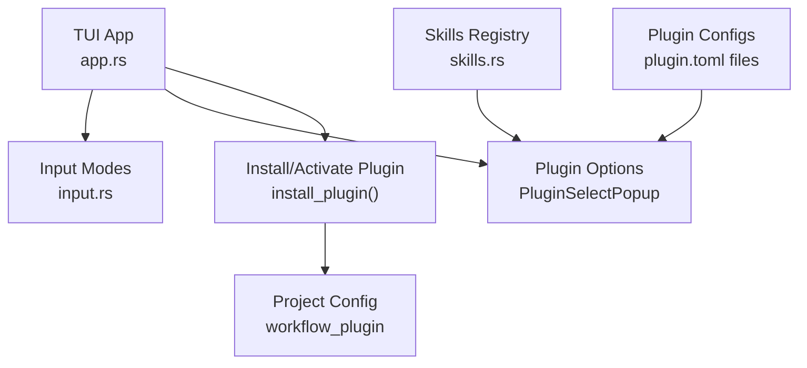
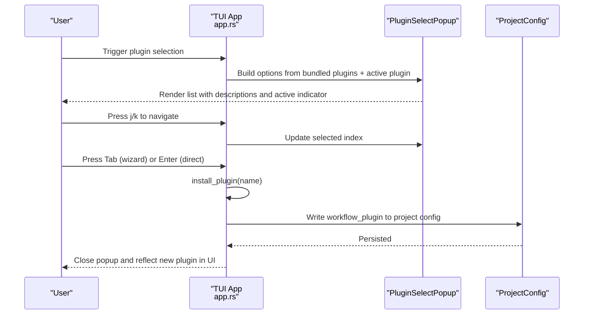
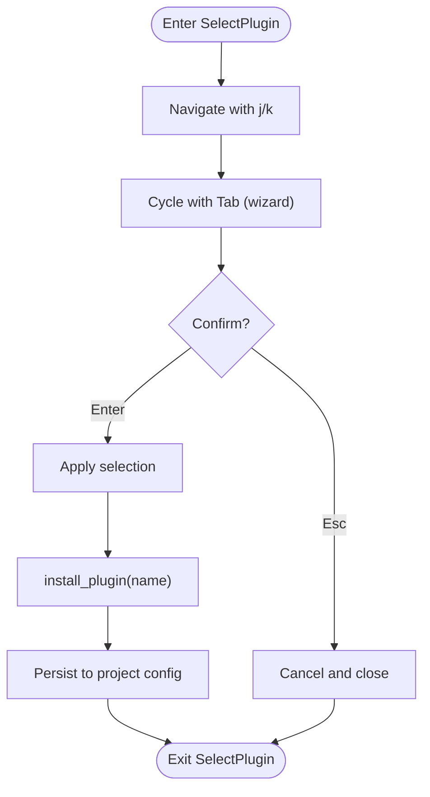
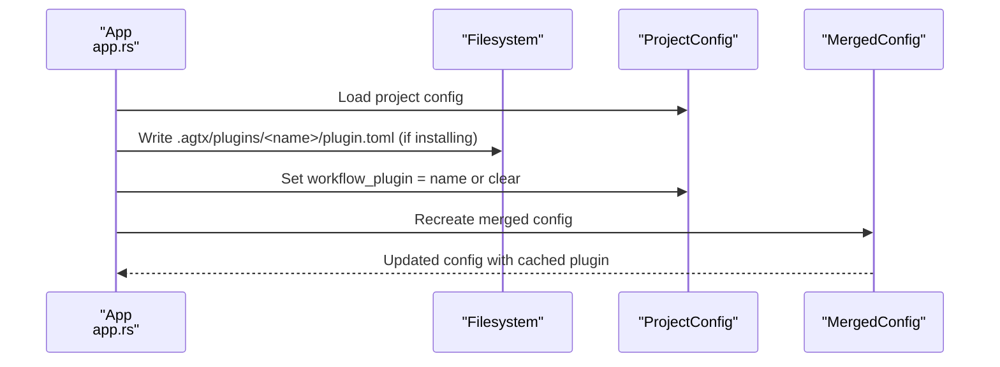
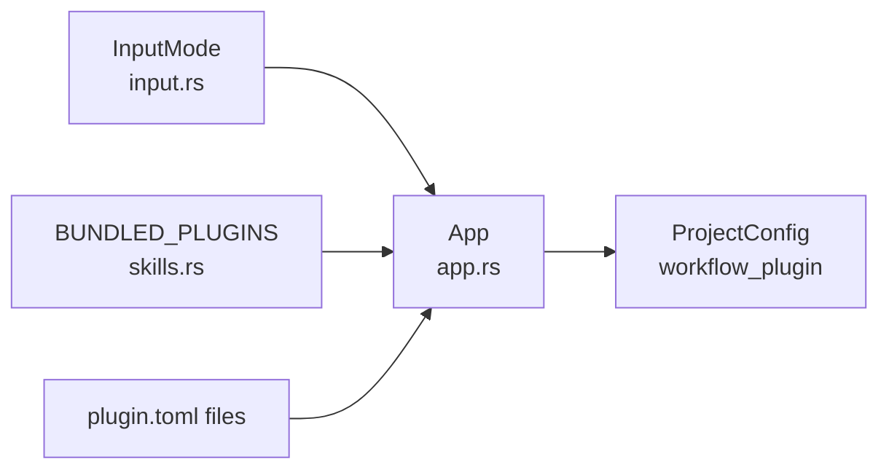

# Plugin Selection and Configuration

<cite>
**Referenced Files in This Document**
- [app.rs](file://src/tui/app.rs)
- [input.rs](file://src/tui/input.rs)
- [skills.rs](file://src/skills.rs)
- [plugin.toml](file://plugins/agtx/plugin.toml)
- [plugin.toml](file://plugins/gsd/plugin.toml)
- [plugin.toml](file://plugins/spec-kit/plugin.toml)
- [plugin.toml](file://plugins/bmad/plugin.toml)
- [plugin.toml](file://plugins/openspec/plugin.toml)
- [plugin.toml](file://plugins/superpowers/plugin.toml)
- [app_tests.rs](file://src/tui/app_tests.rs)
</cite>

## Table of Contents
1. [Introduction](#introduction)
2. [Project Structure](#project-structure)
3. [Core Components](#core-components)
4. [Architecture Overview](#architecture-overview)
5. [Detailed Component Analysis](#detailed-component-analysis)
6. [Dependency Analysis](#dependency-analysis)
7. [Performance Considerations](#performance-considerations)
8. [Troubleshooting Guide](#troubleshooting-guide)
9. [Conclusion](#conclusion)

## Introduction
This document explains the plugin selection phase in the application, focusing on the SelectPlugin mode interface, navigation controls, and the plugin description system. It details how plugins relate to workflow methodologies (AGTX, GSD, Spec-Kit, BMAD, OpenSpec, Superpowers), how to choose appropriate plugins for different task types, and how plugin activation and deactivation work.

## Project Structure
The plugin selection feature is implemented in the TUI layer and integrates with the configuration system and plugin metadata. Key areas:
- TUI input modes define SelectPlugin as a distinct state for choosing a workflow plugin.
- The application constructs a plugin selection popup populated from bundled plugins and the current project’s active plugin.
- Plugin metadata (descriptions, commands, artifacts) comes from plugin.toml files and compile-time embedded plugin configurations.

**Diagram sources**
- [app.rs](file://src/tui/app.rs)
- [input.rs](file://src/tui/input.rs)
- [skills.rs](file://src/skills.rs)
- [plugin.toml](file://plugins/agtx/plugin.toml)

**Section sources**
- [app.rs](file://src/tui/app.rs)
- [input.rs](file://src/tui/input.rs)
- [skills.rs](file://src/skills.rs)

## Core Components
- SelectPlugin input mode: A dedicated UI state enabling plugin selection with keyboard navigation and tab cycling.
- PluginSelectPopup: A transient overlay containing the list of available plugins with one-line descriptions and active indicators.
- PluginOption: Data model representing each plugin option with name, display label, description, and active flag.
- Plugin installation: Writes the chosen plugin’s embedded configuration into the project’s .agtx/plugins directory and updates the project’s workflow_plugin setting.

Key behaviors:
- Navigation: j/k moves selection up/down; Tab cycles through options in the wizard flow.
- Activation: Enter applies the selection; Esc cancels and closes the popup.
- Active indicator: The active plugin is highlighted in the popup.

**Section sources**
- [input.rs](file://src/tui/input.rs)
- [app.rs](file://src/tui/app.rs)
- [app_tests.rs](file://src/tui/app_tests.rs)

## Architecture Overview
The plugin selection flow connects UI input handling, state management, and configuration persistence.

**Diagram sources**
- [app.rs](file://src/tui/app.rs)
- [app_tests.rs](file://src/tui/app_tests.rs)

## Detailed Component Analysis

### SelectPlugin Mode and Controls
- InputMode::SelectPlugin defines the plugin selection state.
- Footer items for SelectPlugin include j/k navigation, Tab cycling, Enter to confirm, and Esc to cancel.
- The footer text mirrors these controls for quick reference.

**Diagram sources**
- [app.rs](file://src/tui/app.rs)
- [input.rs](file://src/tui/input.rs)

**Section sources**
- [input.rs](file://src/tui/input.rs)
- [app.rs](file://src/tui/app.rs)

### Plugin Description System
- Each plugin option displays a one-line summary derived from the plugin’s description field.
- The active plugin is visually indicated in the popup.
- When no plugin is explicitly configured, the default AGTX workflow is considered active.

Implementation highlights:
- PluginSelectPopup holds selected index and options list.
- Options are constructed from bundled plugins and the current active plugin.
- Tests verify that AGTX is selected by default when no plugin is active and that the active plugin is correctly highlighted.

**Section sources**
- [app.rs](file://src/tui/app.rs)
- [app_tests.rs](file://src/tui/app_tests.rs)

### Plugin Activation and Deactivation
- Deactivation: Choosing the empty/AGTX option clears the project’s workflow_plugin setting, reverting to the built-in AGTX workflow.
- Activation: Choosing a named plugin writes its embedded plugin.toml into the project’s .agtx/plugins/<name>/plugin.toml and sets workflow_plugin to that name.
- Persistence: After installation, the merged configuration is refreshed to reflect the new plugin.

**Diagram sources**
- [app.rs](file://src/tui/app.rs)

**Section sources**
- [app.rs](file://src/tui/app.rs)

### Relationship Between Plugins and Workflow Methodologies
Each plugin encapsulates a distinct workflow methodology with commands, artifacts, and optional initialization scripts. Below are the key methodologies and their characteristics:

- AGTX (default)
  - Built-in workflow with skills and prompts.
  - Commands for research, planning, execution, and review.
  - Artifacts for each phase stored under .agtx/.

- GSD (Get Shit Done)
  - Structured spec-driven development with cyclic phases.
  - Initialization via an external tool; copies project planning files.
  - Commands for pre-research, research, planning, execution, and verification.
  - Artifacts mapped to phase-specific files.

- Spec-Kit
  - Specifications become executable artifacts.
  - Copies a specification directory to worktrees.
  - Commands for specifying, planning, implementing, and analyzing.

- BMAD (AI-driven agile)
  - Initializes via an external installer and manages planning/implementation artifacts.
  - Commands for creating product requirement documents, developing stories, and reviewing code.

- OpenSpec
  - Lightweight AI-guided specification framework.
  - Copies an openspec directory and defines commands for proposing, applying, and verifying changes.

- Superpowers
  - Brainstorming, plans, TDD, and subagent-driven development.
  - Copies documentation directories and provides prompts tailored to the workflow.

- Additional plugins (void, agent-skills, oh-my-claudecode) provide specialized or alternative workflows.

**Section sources**
- [plugin.toml](file://plugins/agtx/plugin.toml)
- [plugin.toml](file://plugins/gsd/plugin.toml)
- [plugin.toml](file://plugins/spec-kit/plugin.toml)
- [plugin.toml](file://plugins/bmad/plugin.toml)
- [plugin.toml](file://plugins/openspec/plugin.toml)
- [plugin.toml](file://plugins/superpowers/plugin.toml)
- [skills.rs](file://src/skills.rs)

### Guidance on Selecting Plugins by Task Type
- Research-heavy tasks: Choose GSD or Spec-Kit for structured specification and planning phases.
- Implementation-focused tasks: AGTX or Superpowers offer built-in execution and review steps.
- Agile/iterative tasks: GSD supports cyclic phases; BMAD provides structured artifact management.
- Lightweight specification tasks: OpenSpec streamlines proposal and application workflows.
- Plain agent sessions: Use the void plugin to bypass prompting and skills.
- Multi-agent orchestration: Consider agent-skills or oh-my-claudecode for advanced orchestration needs.

[No sources needed since this section provides general guidance]

## Dependency Analysis
The plugin selection feature depends on:
- InputMode enumeration to gate the SelectPlugin UI state.
- Plugin metadata from embedded configurations and plugin.toml files.
- Project configuration persistence to record the active plugin.
- Skills registry for discovering and transforming plugin commands.

**Diagram sources**
- [input.rs](file://src/tui/input.rs)
- [skills.rs](file://src/skills.rs)
- [app.rs](file://src/tui/app.rs)

**Section sources**
- [input.rs](file://src/tui/input.rs)
- [skills.rs](file://src/skills.rs)
- [app.rs](file://src/tui/app.rs)

## Performance Considerations
- Plugin option construction reads from embedded plugin configurations and the current project config; this is lightweight and occurs only when opening the selection popup.
- Installing a plugin writes a small TOML file and updates configuration; ensure the project directory is writable.
- Refreshing merged configuration after installation is fast but should be avoided in tight loops.

[No sources needed since this section provides general guidance]

## Troubleshooting Guide
Common issues and resolutions:
- No plugin appears active: Verify the project’s workflow_plugin setting. If unset, AGTX is the effective default.
- Tab cycling does not work in SelectPlugin: Ensure you are in the wizard flow; Tab cycles options in the wizard, while j/k navigate in the direct SelectPlugin popup.
- Plugin changes not reflected: After installation, the merged configuration is refreshed; restart the application if changes do not appear immediately.
- Conflicting plugin settings: Clear the workflow_plugin in project config to revert to AGTX.

**Section sources**
- [app.rs](file://src/tui/app.rs)
- [app_tests.rs](file://src/tui/app_tests.rs)

## Conclusion
The plugin selection phase provides a streamlined interface to choose and activate workflow methodologies. By leveraging j/k navigation, Tab cycling, and clear one-line descriptions, users can quickly align their tasks with the most suitable plugin. Understanding the relationship between plugins and methodologies helps in selecting the right tool for the job, whether it is AGTX for general tasks, GSD for structured spec-driven development, Spec-Kit for executable specifications, BMAD for agile iterations, OpenSpec for lightweight proposals, or Superpowers for advanced planning and TDD.