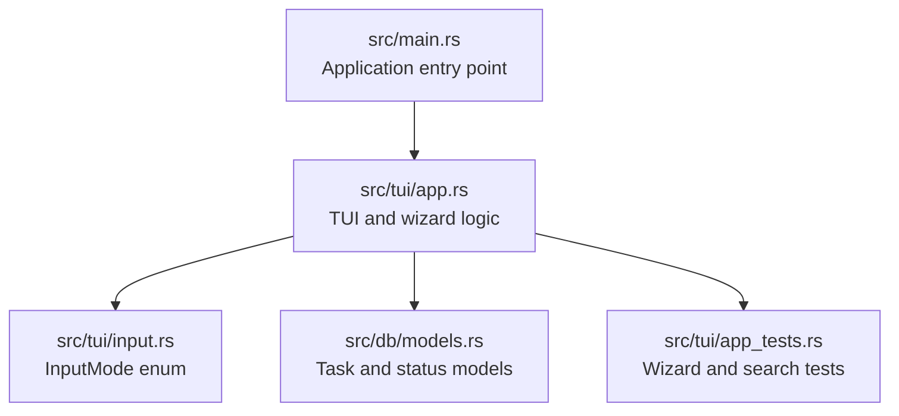
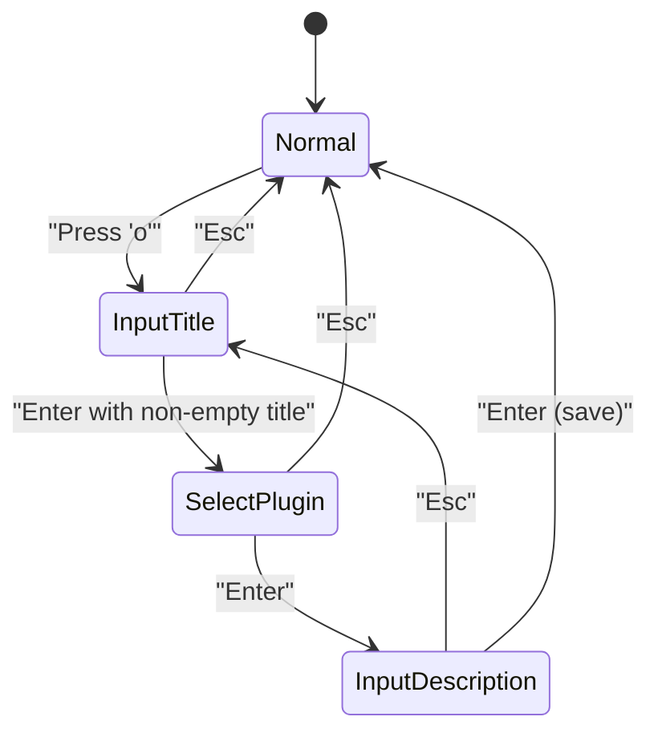
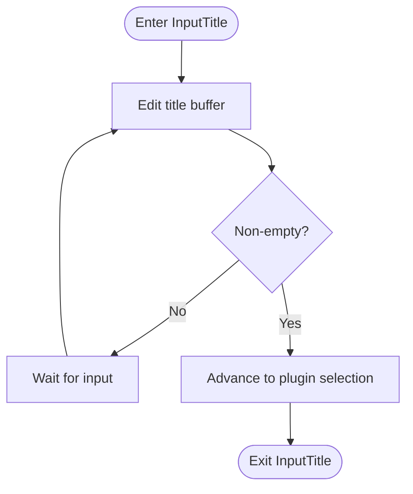
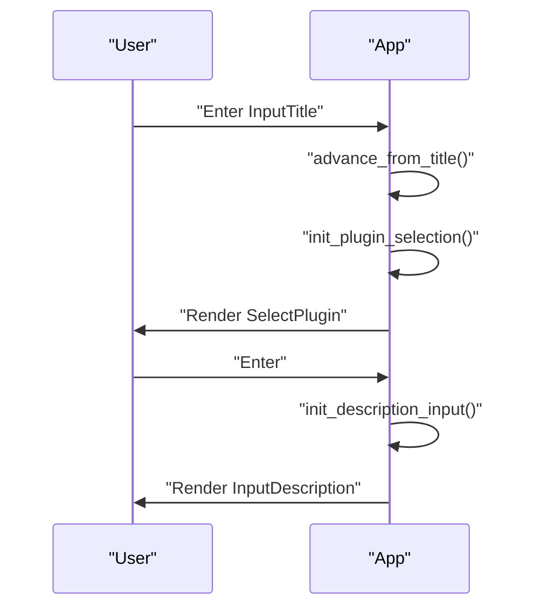
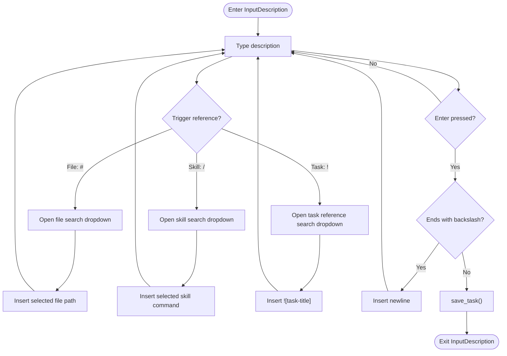
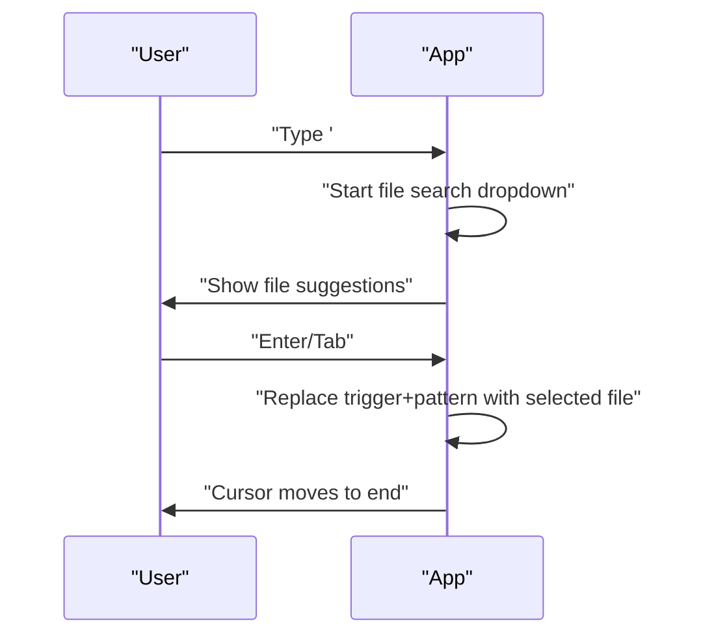
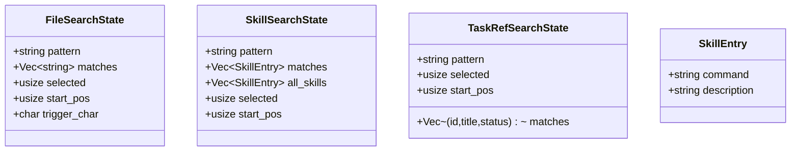
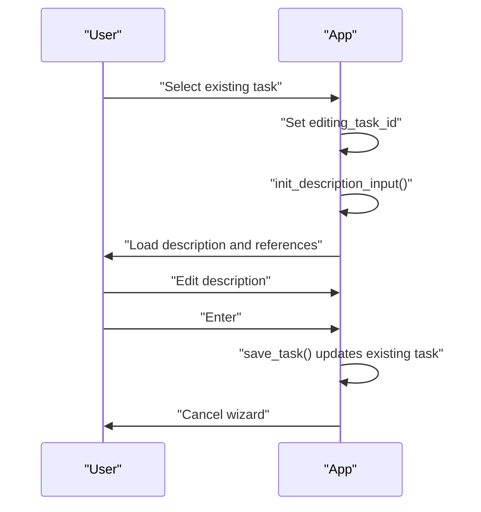
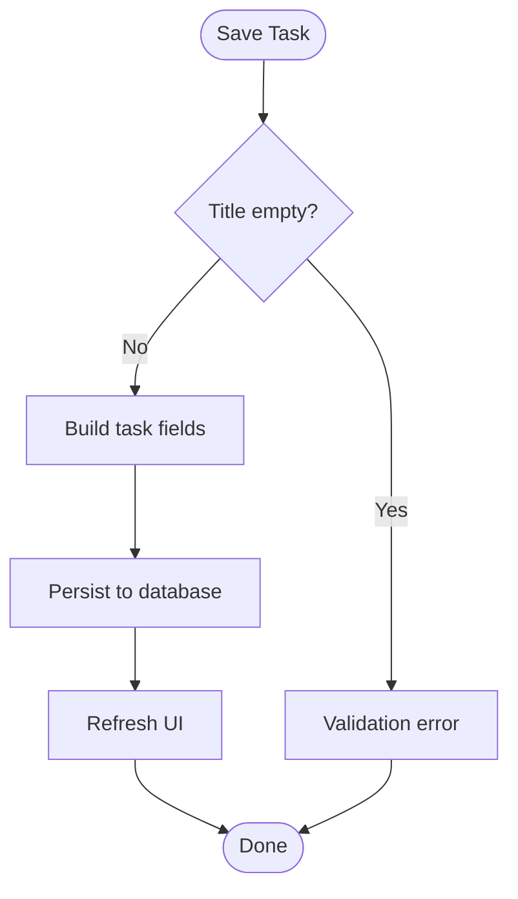
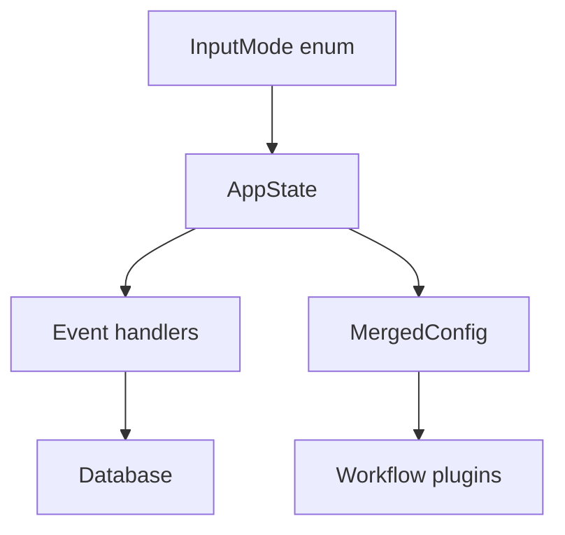

# Task Creation and Management Wizard

<cite>
**Referenced Files in This Document**
- [main.rs](file://src/main.rs)
- [input.rs](file://src/tui/input.rs)
- [app.rs](file://src/tui/app.rs)
- [models.rs](file://src/db/models.rs)
- [app_tests.rs](file://src/tui/app_tests.rs)
</cite>

## Table of Contents
1. [Introduction](#introduction)
2. [Project Structure](#project-structure)
3. [Core Components](#core-components)
4. [Architecture Overview](#architecture-overview)
5. [Detailed Component Analysis](#detailed-component-analysis)
6. [Dependency Analysis](#dependency-analysis)
7. [Performance Considerations](#performance-considerations)
8. [Troubleshooting Guide](#troubleshooting-guide)
9. [Conclusion](#conclusion)

## Introduction
This document explains the agtx task creation wizard workflow, focusing on the three-phase process for building tasks: title entry, plugin selection, and description composition. It details the inline reference system for files, skills, and tasks, the incremental search dropdowns, task editing, validation, and best practices for composing effective task descriptions.

## Project Structure
The task wizard is implemented in the TUI layer with supporting database and model definitions:
- Entry point initializes the application and TUI
- Input modes define the wizard states
- App logic handles key events, state transitions, and persistence
- Database models represent persisted tasks and their metadata

**Diagram sources**
- [main.rs:16-96](file://src/main.rs#L16-L96)
- [input.rs:1-19](file://src/tui/input.rs#L1-L19)
- [app.rs:448-560](file://src/tui/app.rs#L448-L560)
- [models.rs:58-133](file://src/db/models.rs#L58-L133)
- [app_tests.rs:4439-4497](file://src/tui/app_tests.rs#L4439-L4497)

**Section sources**
- [main.rs:16-96](file://src/main.rs#L16-L96)
- [input.rs:1-19](file://src/tui/input.rs#L1-L19)
- [app.rs:448-560](file://src/tui/app.rs#L448-L560)
- [models.rs:58-133](file://src/db/models.rs#L58-L133)

## Core Components
- InputMode defines the wizard states: Normal, InputTitle, SelectPlugin, InputDescription
- AppState tracks wizard state, buffers, selections, and search dropdowns
- Handlers manage key events per mode and coordinate transitions
- Persistence writes tasks to the database with validation and cleanup

Key responsibilities:
- Title entry validates non-empty input and advances to plugin selection
- Plugin selection filters compatible plugins and advances to description
- Description supports inline references and incremental search dropdowns
- Save validates and persists tasks, handling both creation and editing

**Section sources**
- [input.rs:1-19](file://src/tui/input.rs#L1-L19)
- [app.rs:448-560](file://src/tui/app.rs#L448-L560)
- [app.rs:4347-4407](file://src/tui/app.rs#L4347-L4407)
- [models.rs:58-133](file://src/db/models.rs#L58-L133)

## Architecture Overview
The wizard follows a state machine with three primary modes and supporting search dropdowns. The flow integrates with the database for persistence and with agent/plugin configurations for workflow selection.

**Diagram sources**
- [input.rs:1-19](file://src/tui/input.rs#L1-L19)
- [app.rs:3772-3784](file://src/tui/app.rs#L3772-L3784)
- [app.rs:3851-3879](file://src/tui/app.rs#L3851-L3879)
- [app.rs:3882-4143](file://src/tui/app.rs#L3882-L4143)

## Detailed Component Analysis

### Three-Phase Wizard

#### Phase 1: Title Entry (InputTitle)
- Accepts keyboard input with standard editing operations (arrows, alt+word movement, backspace/delete)
- On Enter with non-empty buffer, stores the title and advances to plugin selection
- On Esc, cancels the wizard

**Diagram sources**
- [app.rs:3772-3784](file://src/tui/app.rs#L3772-L3784)

**Section sources**
- [app.rs:3772-3784](file://src/tui/app.rs#L3772-L3784)

#### Phase 2: Plugin Selection (SelectPlugin)
- Initializes plugin options based on agent compatibility and project configuration
- Supports cycling with Tab and directional selection
- Advances to description input on Enter

**Diagram sources**
- [app.rs:4500-4512](file://src/tui/app.rs#L4500-L4512)
- [app.rs:4410-4456](file://src/tui/app.rs#L4410-L4456)
- [app.rs:3851-3879](file://src/tui/app.rs#L3851-L3879)
- [app.rs:4459-4484](file://src/tui/app.rs#L4459-L4484)

**Section sources**
- [app.rs:4410-4456](file://src/tui/app.rs#L4410-L4456)
- [app.rs:4500-4512](file://src/tui/app.rs#L4500-L4512)
- [app.rs:3851-3879](file://src/tui/app.rs#L3851-L3879)

#### Phase 3: Description Composition (InputDescription)
- Supports inline reference insertion via search dropdowns
- Handles line continuation with backslash
- Saves on Enter (creating or updating tasks)

**Diagram sources**
- [app.rs:4127-4307](file://src/tui/app.rs#L4127-L4307)
- [app.rs:4347-4407](file://src/tui/app.rs#L4347-L4407)

**Section sources**
- [app.rs:4127-4307](file://src/tui/app.rs#L4127-L4307)
- [app.rs:4347-4407](file://src/tui/app.rs#L4347-L4407)

### Inline Reference System
The wizard supports three types of inline references in the description:

- File references: triggered by # or @, inserts a file path
- Skill references: triggered by / at line start or after space, inserts a skill command
- Task references: triggered by ! at line start or after space, inserts ![task-title]

**Diagram sources**
- [app.rs:4200-4220](file://src/tui/app.rs#L4200-L4220)
- [app.rs:4309-4318](file://src/tui/app.rs#L4309-L4318)

**Section sources**
- [app.rs:4200-4220](file://src/tui/app.rs#L4200-L4220)
- [app.rs:4221-4271](file://src/tui/app.rs#L4221-L4271)
- [app.rs:4272-4299](file://src/tui/app.rs#L4272-L4299)

### Search Dropdown Functionality
- File search: fuzzy matching over project files, supports incremental filtering
- Skill search: fuzzy matching over available skills (bundled and project-specific), deduplicated by command
- Task reference search: fuzzy matching over existing tasks by title/status

**Diagram sources**
- [app.rs:679-687](file://src/tui/app.rs#L679-L687)
- [app.rs:696-704](file://src/tui/app.rs#L696-L704)
- [app.rs:706-713](file://src/tui/app.rs#L706-L713)

**Section sources**
- [app.rs:4309-4345](file://src/tui/app.rs#L4309-L4345)
- [app.rs:4320-4345](file://src/tui/app.rs#L4320-L4345)
- [app.rs:3361-3368](file://src/tui/app.rs#L3361-L3368)

### Task Editing Workflow
- Editing mode is initiated by selecting an existing task
- Description buffer is pre-populated with existing content
- Referenced task IDs are restored from persisted data
- Save updates the existing task record

**Diagram sources**
- [app.rs:4459-4484](file://src/tui/app.rs#L4459-L4484)
- [app.rs:4374-4389](file://src/tui/app.rs#L4374-L4389)

**Section sources**
- [app.rs:4459-4484](file://src/tui/app.rs#L4459-L4484)
- [app.rs:4374-4389](file://src/tui/app.rs#L4374-L4389)

### Validation and Persistence
- Title validation: non-empty title required to advance from InputTitle
- Plugin selection: filters incompatible plugins by agent
- Description validation: optional; saving persists title, description, agent, plugin, and referenced task IDs
- Database writes: creates new tasks in Backlog or updates existing ones

**Diagram sources**
- [app.rs:4347-4407](file://src/tui/app.rs#L4347-L4407)
- [models.rs:58-133](file://src/db/models.rs#L58-L133)

**Section sources**
- [app.rs:4347-4407](file://src/tui/app.rs#L4347-L4407)
- [models.rs:58-133](file://src/db/models.rs#L58-L133)

## Dependency Analysis
The wizard depends on:
- InputMode for state transitions
- AppState for buffers, selections, and search dropdowns
- Database for task persistence
- Config for agent and plugin selection

**Diagram sources**
- [input.rs:1-19](file://src/tui/input.rs#L1-L19)
- [app.rs:448-560](file://src/tui/app.rs#L448-L560)
- [app.rs:4410-4456](file://src/tui/app.rs#L4410-L4456)

**Section sources**
- [input.rs:1-19](file://src/tui/input.rs#L1-L19)
- [app.rs:448-560](file://src/tui/app.rs#L448-L560)
- [app.rs:4410-4456](file://src/tui/app.rs#L4410-L4456)

## Performance Considerations
- Incremental fuzzy search limits results to top candidates for responsiveness
- Search dropdowns are scoped to the current input buffer position to minimize overhead
- Plugin filtering occurs once per wizard initiation to avoid repeated computation

## Troubleshooting Guide
Common issues and resolutions:
- Wizard does not advance from title: ensure the title buffer is non-empty before pressing Enter
- Plugin selection skipped unexpectedly: wizard skips plugin selection when no agents are detected (e.g., test mode)
- Skill search not triggering: ensure / is typed at line start or after a space
- Task reference search not triggering: ensure ! is typed at line start or after a space or newline
- Saving fails: verify title is set; description is optional; ensure database is available

**Section sources**
- [app.rs:4500-4512](file://src/tui/app.rs#L4500-L4512)
- [app.rs:4221-4271](file://src/tui/app.rs#L4221-L4271)
- [app.rs:4272-4299](file://src/tui/app.rs#L4272-L4299)
- [app_tests.rs:4439-4497](file://src/tui/app_tests.rs#L4439-L4497)

## Conclusion
The agtx task creation wizard provides a structured, incremental workflow for building tasks with powerful inline reference capabilities. By leveraging fuzzy search dropdowns and a clean state machine, users can compose rich descriptions that incorporate files, skills, and related tasks. The design balances usability with robustness, including validation and editing support for existing tasks.