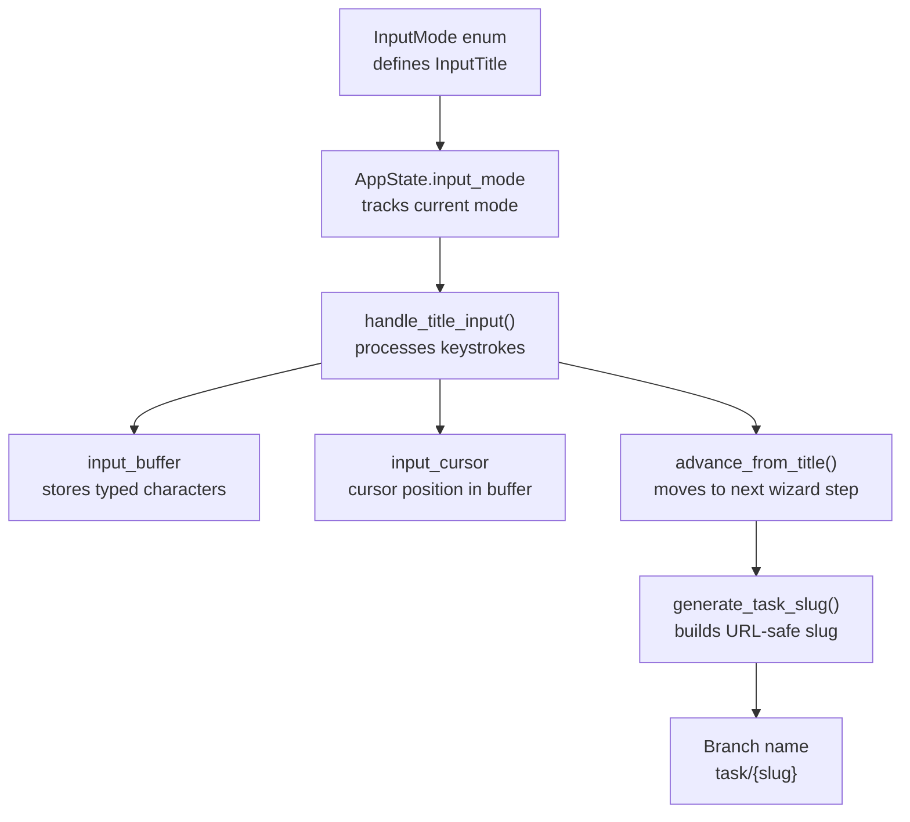
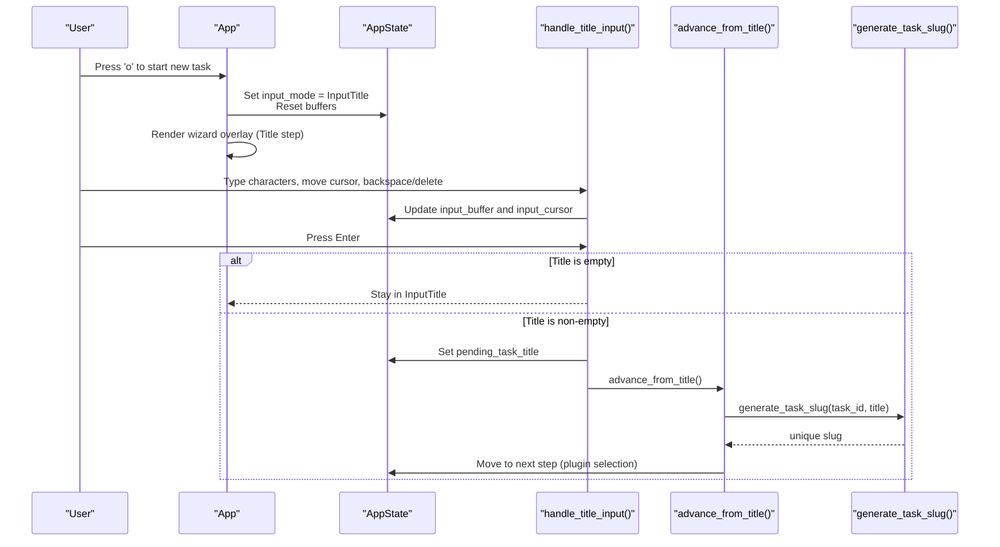
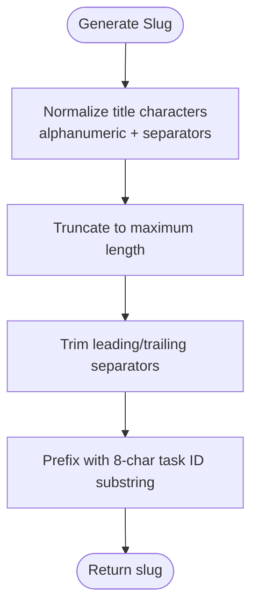
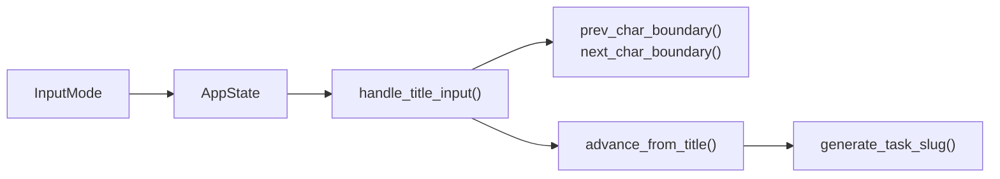

# Title Entry and Validation

<cite>
**Referenced Files in This Document**
- [input.rs](file://src/tui/input.rs)
- [app.rs](file://src/tui/app.rs)
- [app_tests.rs](file://src/tui/app_tests.rs)
</cite>

## Table of Contents
1. [Introduction](#introduction)
2. [Project Structure](#project-structure)
3. [Core Components](#core-components)
4. [Architecture Overview](#architecture-overview)
5. [Detailed Component Analysis](#detailed-component-analysis)
6. [Dependency Analysis](#dependency-analysis)
7. [Performance Considerations](#performance-considerations)
8. [Troubleshooting Guide](#troubleshooting-guide)
9. [Conclusion](#conclusion)

## Introduction
This document explains the task title entry phase of the wizard, focusing on the InputTitle mode interface, character-by-character input handling, cursor positioning, validation rules, length restrictions, and automatic slug generation. It also provides practical guidelines for crafting clear, actionable task titles and outlines common formatting pitfalls to avoid.

## Project Structure
The title entry experience is implemented in the TUI application module. The key files are:
- Input mode definition for the wizard steps
- Application state and input handling for the title entry
- Slug generation logic for task identifiers
- Tests validating slug behavior and input handling

**Diagram sources**
- [input.rs:1-19](file://src/tui/input.rs#L1-L19)
- [app.rs:497-509](file://src/tui/app.rs#L497-L509)
- [app.rs:3901-3978](file://src/tui/app.rs#L3901-L3978)
- [app.rs:4628-4640](file://src/tui/app.rs#L4628-L4640)
- [app.rs:7030-7048](file://src/tui/app.rs#L7030-L7048)

**Section sources**
- [input.rs:1-19](file://src/tui/input.rs#L1-L19)
- [app.rs:497-509](file://src/tui/app.rs#L497-L509)
- [app.rs:3901-3978](file://src/tui/app.rs#L3901-L3978)
- [app.rs:4628-4640](file://src/tui/app.rs#L4628-L4640)
- [app.rs:7030-7048](file://src/tui/app.rs#L7030-L7048)

## Core Components
- InputMode enum defines the InputTitle step in the wizard.
- AppState tracks the input buffer and cursor position during title entry.
- handle_title_input processes keystrokes, manages cursor movement, and validates submission.
- advance_from_title transitions to the next wizard step after a valid title is entered.
- generate_task_slug transforms the title into a URL-safe, unique slug with an ID prefix.

Key behaviors:
- Character insertion/deletion respects UTF-8 boundaries.
- Word-boundary navigation supports Alt+Left/Right and macOS Option+Left/Right.
- Submission requires a non-empty title; otherwise, the wizard remains in InputTitle mode.

**Section sources**
- [input.rs:1-12](file://src/tui/input.rs#L1-L12)
- [app.rs:497-509](file://src/tui/app.rs#L497-L509)
- [app.rs:3901-3978](file://src/tui/app.rs#L3901-L3978)
- [app.rs:4628-4640](file://src/tui/app.rs#L4628-L4640)
- [app.rs:7030-7048](file://src/tui/app.rs#L7030-L7048)

## Architecture Overview
The title entry flow integrates with the broader wizard and TUI rendering system. The following sequence diagram maps the actual code paths for entering and validating a task title.

**Diagram sources**
- [app.rs:3810-3815](file://src/tui/app.rs#L3810-L3815)
- [app.rs:3901-3978](file://src/tui/app.rs#L3901-L3978)
- [app.rs:4628-4640](file://src/tui/app.rs#L4628-L4640)
- [app.rs:7030-7048](file://src/tui/app.rs#L7030-L7048)

## Detailed Component Analysis

### InputTitle Mode Interface
- The wizard overlay displays a “New Task” or “Edit Task” title and presents step indicators.
- The footer text for InputTitle mode communicates available actions: cancel with Escape and submit with Enter.
- The overlay is drawn when input_mode equals InputTitle.

Behavior highlights:
- The overlay is rendered only when input_mode is InputTitle, SelectPlugin, or InputDescription.
- The step index for the Title step is zero, enabling breadcrumb navigation.

**Section sources**
- [app.rs:1545-1599](file://src/tui/app.rs#L1545-L1599)
- [app.rs:333-343](file://src/tui/app.rs#L333-L343)
- [input.rs:6-7](file://src/tui/input.rs#L6-L7)

### Character-by-Character Input Handling
The handle_title_input function processes keystrokes with precise cursor and buffer management:
- Insertion: inserts the character at the current cursor position and advances the cursor by the character’s UTF-8 length.
- Deletion: Backspace deletes the character before the cursor; Delete removes the character after the cursor. Both respect UTF-8 boundaries.
- Navigation: Left/Right moves the cursor by UTF-8 boundaries; Home/End jump to the start/end of the buffer.
- Word-boundary navigation: Alt+Left/Right (or macOS Option+Left/Right) jumps between word boundaries.
- Alt+Backspace deletes the word before the cursor.
- Esc cancels the wizard; Enter validates and proceeds if the title is non-empty.

UTF-8 safety:
- Cursor advancement and deletion use helper functions that compute the previous/next character boundary, ensuring edits do not split multibyte characters.

**Section sources**
- [app.rs:3901-3978](file://src/tui/app.rs#L3901-L3978)
- [app.rs:7813-7831](file://src/tui/app.rs#L7813-L7831)

### Cursor Positioning
Cursor movement is handled with UTF-8-aware boundary calculations:
- prev_char_boundary finds the start of the previous character.
- next_char_boundary finds the end of the next character.
- word_boundary_left and word_boundary_right locate word boundaries for efficient navigation.

These functions ensure accurate cursor placement for Unicode text, including emojis and non-Latin scripts.

**Section sources**
- [app.rs:7813-7831](file://src/tui/app.rs#L7813-L7831)

### Title Validation Rules and Length Restrictions
Validation occurs upon pressing Enter:
- A non-empty title is required to advance.
- The pending_task_title is set to the current input_buffer value.
- After validation, the wizard transitions to the next step.

Length and sanitization:
- The slug generator trims leading/trailing separators and limits the title portion to a maximum length.
- Special characters are normalized to separators for slug safety.

Note: There is no explicit minimum length enforced in the title input handler; however, the slug generator ensures a meaningful title segment is produced.

**Section sources**
- [app.rs:3907-3914](file://src/tui/app.rs#L3907-L3914)
- [app.rs:4628-4640](file://src/tui/app.rs#L4628-L4640)
- [app.rs:7030-7048](file://src/tui/app.rs#L7030-L7048)

### Slug Generation and Automatic Title-to-Slug Behavior
The generate_task_slug function produces a URL-safe, unique slug:
- Converts the title to ASCII-alphanumeric and separators, replacing disallowed characters with separators.
- Limits the title portion to a maximum length.
- Removes leading/trailing separators.
- Prepends an 8-character prefix derived from the task ID to ensure uniqueness.

The generated slug becomes the branch name prefix for task worktrees.

**Diagram sources**
- [app.rs:7030-7048](file://src/tui/app.rs#L7030-L7048)

**Section sources**
- [app.rs:7030-7048](file://src/tui/app.rs#L7030-L7048)
- [app_tests.rs:936-967](file://src/tui/app_tests.rs#L936-L967)
- [app_tests.rs:7880-7902](file://src/tui/app_tests.rs#L7880-L7902)

### Examples and Guidelines
Effective task titles:
- Actionable verbs at the beginning (e.g., “Implement login”, “Refactor API”).
- Concise and specific (e.g., “Add OAuth flow” rather than “Work on auth”).
- Avoid unnecessary punctuation or vague terms.

Common formatting issues to avoid:
- Starting with articles or prepositions (“The feature” vs. “Feature”).
- Overly long or vague phrasing (“Fix bugs” vs. “Fix broken links on homepage”).
- Excessive punctuation or symbols that require normalization in the slug.

Guidelines:
- Keep titles under ~60 characters for readability; the slug generator caps the title segment to a safe length.
- Prefer nouns or short phrases that clearly describe the outcome.
- Use imperative form for clarity and actionability.

[No sources needed since this section provides general guidance]

## Dependency Analysis
The title entry phase depends on:
- InputMode enum to signal the current wizard step.
- AppState to maintain input_buffer and input_cursor.
- Helper functions for UTF-8 boundary navigation.
- Slug generation for downstream branch naming.

**Diagram sources**
- [input.rs:1-12](file://src/tui/input.rs#L1-L12)
- [app.rs:497-509](file://src/tui/app.rs#L497-L509)
- [app.rs:3901-3978](file://src/tui/app.rs#L3901-L3978)
- [app.rs:4628-4640](file://src/tui/app.rs#L4628-L4640)
- [app.rs:7030-7048](file://src/tui/app.rs#L7030-L7048)

**Section sources**
- [input.rs:1-12](file://src/tui/input.rs#L1-L12)
- [app.rs:497-509](file://src/tui/app.rs#L497-L509)
- [app.rs:3901-3978](file://src/tui/app.rs#L3901-L3978)
- [app.rs:4628-4640](file://src/tui/app.rs#L4628-L4640)
- [app.rs:7030-7048](file://src/tui/app.rs#L7030-L7048)

## Performance Considerations
- UTF-8 boundary computations are O(n) in the worst case for large titles; however, typical titles are short, minimizing impact.
- Slug generation performs a single pass over the title with trimming and substring operations, which are efficient for reasonable lengths.
- Rendering the wizard overlay occurs only when input_mode is active, avoiding unnecessary redraws.

[No sources needed since this section provides general guidance]

## Troubleshooting Guide
Common issues and resolutions:
- Title remains empty after Enter: Ensure the buffer contains at least one character before submitting.
- Cursor jumps unexpectedly: Verify Alt/Option key combinations are used for word-boundary navigation; for ASCII characters, Left/Right move by UTF-8 boundaries.
- Deleting splits multibyte characters: Use Backspace/Delete or Alt+Backspace; the handlers manage UTF-8 boundaries automatically.
- Slug looks truncated: Titles exceeding the maximum length are trimmed by the slug generator; shorten the title for readability.

Validation and behavior tests:
- Slug generation tests confirm ID prefixes, special character replacement, and length limits.
- Input handling tests verify UTF-8 correctness and boundary navigation.

**Section sources**
- [app_tests.rs:936-967](file://src/tui/app_tests.rs#L936-L967)
- [app_tests.rs:7880-7902](file://src/tui/app_tests.rs#L7880-L7902)
- [app_tests.rs:4590-4615](file://src/tui/app_tests.rs#L4590-L4615)

## Conclusion
The InputTitle mode provides a robust, UTF-8-aware editor for task titles, with precise cursor handling and word-boundary navigation. Titles are validated on submission and transformed into URL-safe, unique slugs that drive downstream task workflows. Following the provided guidelines will help users create clear, actionable titles that integrate smoothly with the system’s slug generation and branch naming.