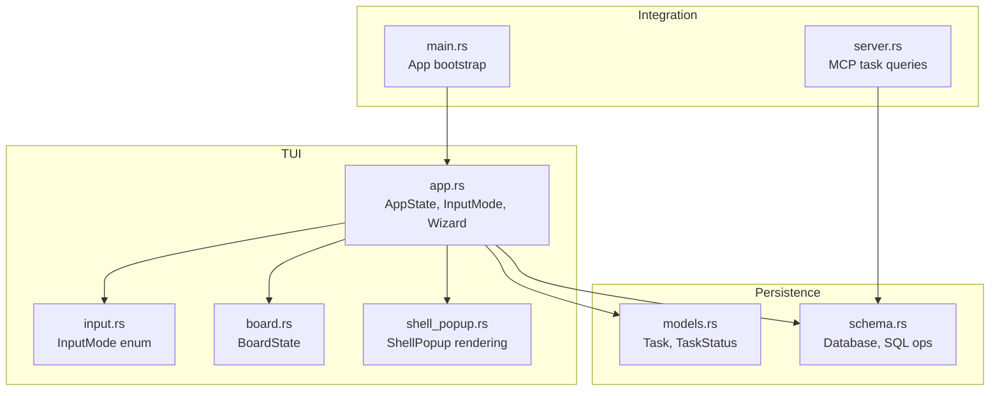
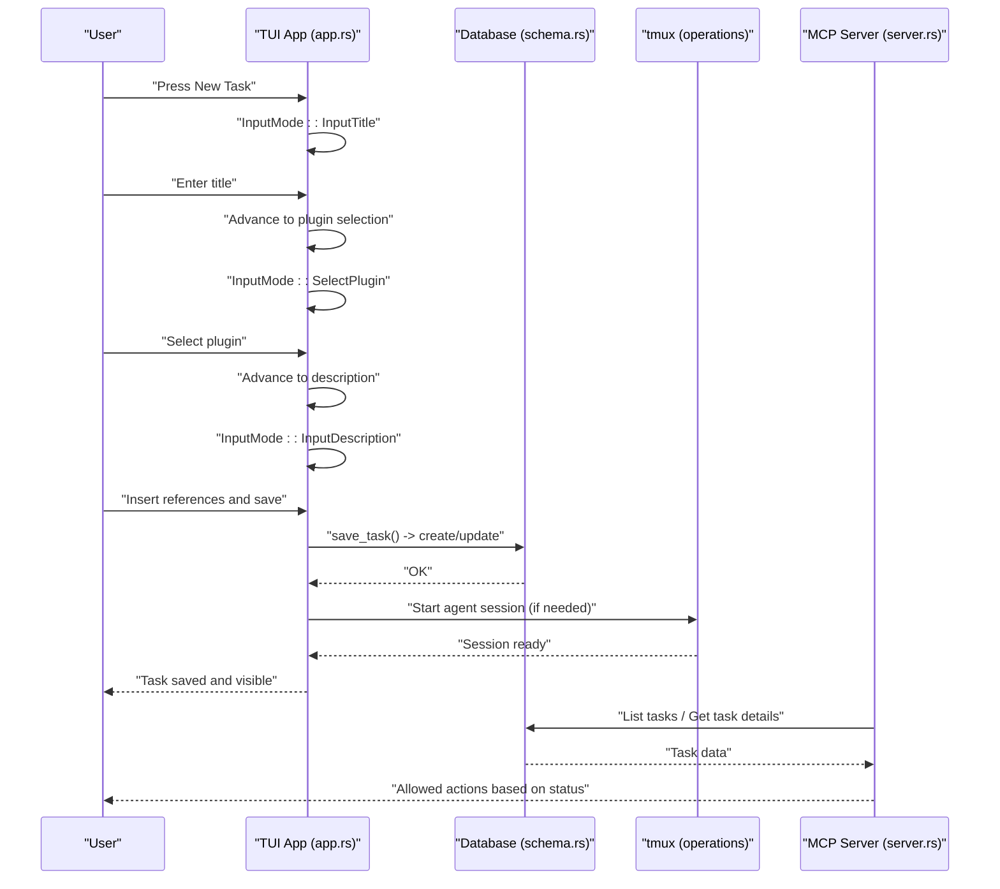
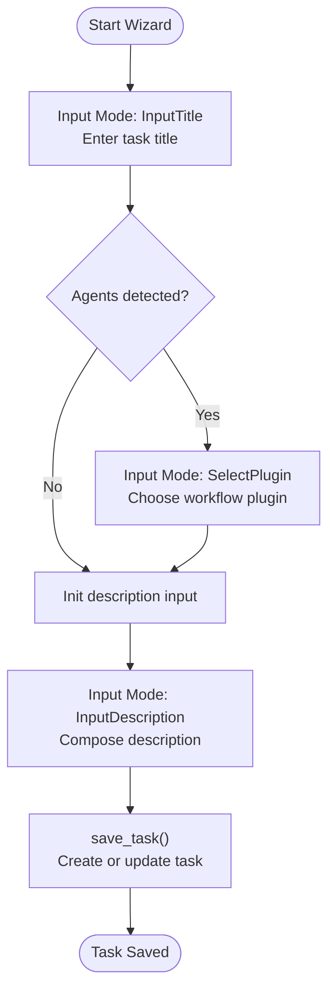
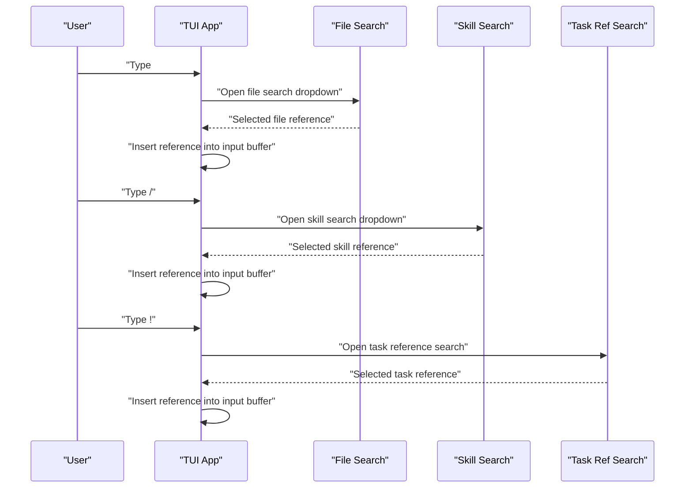
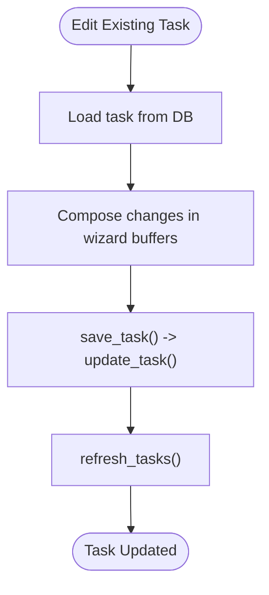
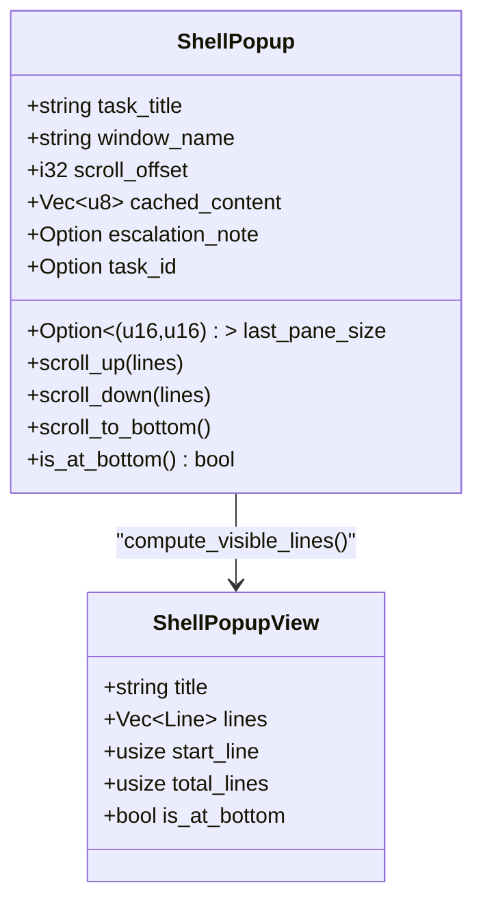
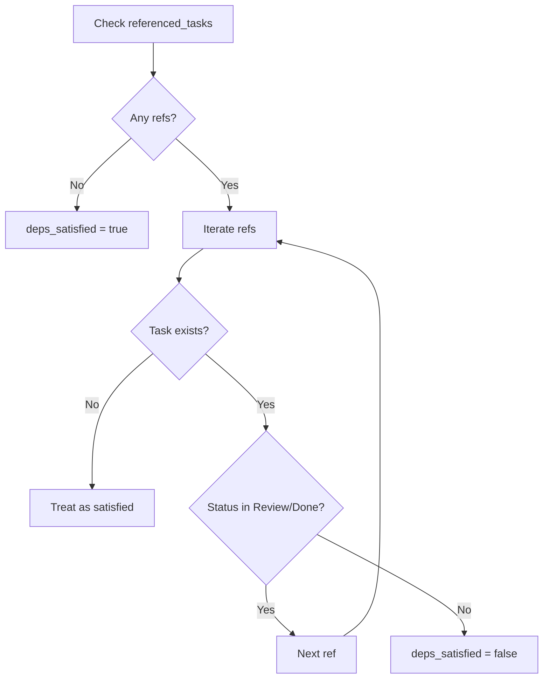
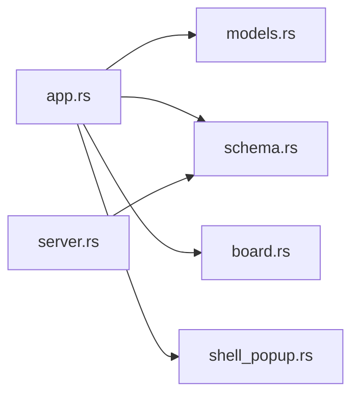

# Task Management and Editing

<cite>
**Referenced Files in This Document**
- [main.rs](file://src/main.rs)
- [app.rs](file://src/tui/app.rs)
- [input.rs](file://src/tui/input.rs)
- [shell_popup.rs](file://src/tui/shell_popup.rs)
- [models.rs](file://src/db/models.rs)
- [schema.rs](file://src/db/schema.rs)
- [board.rs](file://src/tui/board.rs)
- [app_tests.rs](file://tests/app_tests.rs)
- [db_tests.rs](file://tests/db_tests.rs)
- [server.rs](file://src/mcp/server.rs)
</cite>

## Table of Contents
1. [Introduction](#introduction)
2. [Project Structure](#project-structure)
3. [Core Components](#core-components)
4. [Architecture Overview](#architecture-overview)
5. [Detailed Component Analysis](#detailed-component-analysis)
6. [Dependency Analysis](#dependency-analysis)
7. [Performance Considerations](#performance-considerations)
8. [Troubleshooting Guide](#troubleshooting-guide)
9. [Conclusion](#conclusion)

## Introduction
This document explains the task management and editing features in AGTX with a focus on the task creation wizard and inline editing capabilities. It covers:
- Step-by-step task creation: title input, plugin selection, and description composition
- Inline editor features for inserting file references, agent skills, and task dependencies
- Task modification workflows: editing descriptions, updating agent assignments, changing priorities
- The shell popup system for viewing task details, running commands, and monitoring agent activity
- Practical examples for complex tasks with multiple dependencies, external file references, and cross-task coordination
- Validation and error handling for invalid inputs and conflicting dependencies

## Project Structure
AGTX’s task lifecycle spans the TUI application, database persistence, and tmux-backed agent sessions. The key areas are:
- TUI application state and modes for task creation and editing
- Database schema and model definitions for tasks and transitions
- Shell popup rendering and scrolling for live agent output
- MCP server integration for task queries and actions

**Diagram sources**
- [app.rs](file://src/tui/app.rs)
- [input.rs](file://src/tui/input.rs)
- [board.rs](file://src/tui/board.rs)
- [shell_popup.rs](file://src/tui/shell_popup.rs)
- [models.rs](file://src/db/models.rs)
- [schema.rs](file://src/db/schema.rs)
- [main.rs](file://src/main.rs)
- [server.rs](file://src/mcp/server.rs)

**Section sources**
- [main.rs](file://src/main.rs)
- [app.rs](file://src/tui/app.rs)
- [input.rs](file://src/tui/input.rs)
- [board.rs](file://src/tui/board.rs)
- [shell_popup.rs](file://src/tui/shell_popup.rs)
- [models.rs](file://src/db/models.rs)
- [schema.rs](file://src/db/schema.rs)
- [server.rs](file://src/mcp/server.rs)

## Core Components
- Task model and status: defines task fields, lifecycle, and helper methods
- Database operations: create, update, query tasks, and dependency satisfaction checks
- TUI wizard: title input, plugin selection, and description composition
- Inline editing: file references, agent skills, and task dependencies
- Shell popup: detached tmux window for monitoring agent activity
- MCP server: task retrieval and allowed actions computed from status and dependencies

**Section sources**
- [models.rs](file://src/db/models.rs)
- [schema.rs](file://src/db/schema.rs)
- [app.rs](file://src/tui/app.rs)
- [input.rs](file://src/tui/input.rs)
- [shell_popup.rs](file://src/tui/shell_popup.rs)
- [server.rs](file://src/mcp/server.rs)

## Architecture Overview
The task creation and editing pipeline integrates TUI input modes, wizard state, database persistence, and tmux agent sessions. The MCP server augments task visibility and action availability.

**Diagram sources**
- [app.rs](file://src/tui/app.rs)
- [schema.rs](file://src/db/schema.rs)
- [server.rs](file://src/mcp/server.rs)

## Detailed Component Analysis

### Task Creation Wizard
The wizard guides users through three steps:
1. Title input
2. Plugin selection (optional, skipped when no agents are detected)
3. Description composition with inline references

Key behaviors:
- Title step advances to plugin selection unless agents are absent
- Plugin selection filters compatible plugins for the configured agent
- Description step supports file references, agent skills, and task dependencies
- Saving persists title, description, agent, plugin, and referenced task IDs

**Diagram sources**
- [app.rs](file://src/tui/app.rs)
- [input.rs](file://src/tui/input.rs)

**Section sources**
- [app.rs](file://src/tui/app.rs)
- [input.rs](file://src/tui/input.rs)
- [app_tests.rs](file://tests/app_tests.rs)

### Inline Editor Capabilities
While composing descriptions, users can insert:
- File references: triggers a file search dropdown and inserts a reference marker
- Agent skills: triggers a skill search dropdown and inserts a skill reference
- Task dependencies: triggers a task reference search and inserts a task reference

These triggers are handled during description input and maintain an input buffer with a cursor position. Insertions update the buffer and optionally highlight references.

**Diagram sources**
- [app.rs](file://src/tui/app.rs)

**Section sources**
- [app.rs](file://src/tui/app.rs)
- [app_tests.rs](file://tests/app_tests.rs)

### Task Modification Workflows
Editing an existing task updates:
- Title and description
- Agent assignment (from configuration)
- Plugin selection
- Referenced task IDs (dependencies)

Saving an existing task performs an update operation and refreshes the board.

**Diagram sources**
- [app.rs](file://src/tui/app.rs)
- [schema.rs](file://src/db/schema.rs)

**Section sources**
- [app.rs](file://src/tui/app.rs)
- [schema.rs](file://src/db/schema.rs)
- [app_tests.rs](file://tests/app_tests.rs)

### Shell Popup System
The shell popup displays a detached tmux window for a selected task:
- Renders styled terminal output lines
- Supports scrolling up/down and jumping to bottom
- Shows a footer with navigation hints
- Optionally shows an escalation banner

**Diagram sources**
- [shell_popup.rs](file://src/tui/shell_popup.rs)

**Section sources**
- [shell_popup.rs](file://src/tui/shell_popup.rs)
- [app.rs](file://src/tui/app.rs)

### Task Validation and Error Handling
- Dependency satisfaction: a task is considered satisfied if all referenced tasks are in Review or Done; missing references are treated as satisfied
- Status transitions: allowed actions are computed based on current status and dependency satisfaction
- Warning messages: the UI surfaces warnings for prerequisites (e.g., research phase required before planning)

**Diagram sources**
- [schema.rs](file://src/db/schema.rs)
- [server.rs](file://src/mcp/server.rs)

**Section sources**
- [schema.rs](file://src/db/schema.rs)
- [db_tests.rs](file://tests/db_tests.rs)
- [server.rs](file://src/mcp/server.rs)
- [app.rs](file://src/tui/app.rs)

## Dependency Analysis
- TUI depends on database models and schema for task persistence
- TUI coordinates with tmux operations for agent sessions
- MCP server reads from the database to provide task summaries and allowed actions
- Board state tracks selected tasks and column positions for navigation

**Diagram sources**
- [app.rs](file://src/tui/app.rs)
- [models.rs](file://src/db/models.rs)
- [schema.rs](file://src/db/schema.rs)
- [board.rs](file://src/tui/board.rs)
- [shell_popup.rs](file://src/tui/shell_popup.rs)
- [server.rs](file://src/mcp/server.rs)

**Section sources**
- [app.rs](file://src/tui/app.rs)
- [models.rs](file://src/db/models.rs)
- [schema.rs](file://src/db/schema.rs)
- [board.rs](file://src/tui/board.rs)
- [shell_popup.rs](file://src/tui/shell_popup.rs)
- [server.rs](file://src/mcp/server.rs)

## Performance Considerations
- Database operations are executed synchronously in the main thread; batch operations are supported for bulk inserts
- Dependency satisfaction checks iterate over referenced task IDs; caching of satisfaction results can reduce repeated DB queries
- Shell popup computes visible lines and trims trailing empty lines to optimize rendering
- Input mode transitions minimize unnecessary UI redraws

## Troubleshooting Guide
Common scenarios and resolutions:
- Research phase required before planning: the UI warns and prevents progression until prerequisites are met
- Empty description handling: saving with an empty description stores a null value
- Plugin filtering: incompatible plugins are excluded based on agent support
- Task deletion: removal cleans up tmux sessions and Git resources before deleting from the database

**Section sources**
- [app.rs](file://src/tui/app.rs)
- [schema.rs](file://src/db/schema.rs)
- [app_tests.rs](file://tests/app_tests.rs)

## Conclusion
AGTX provides a structured task creation wizard and robust inline editing features for composing rich task descriptions with file references, agent skills, and task dependencies. The shell popup enables continuous monitoring of agent activity, while the database and MCP server integrate task state, dependencies, and allowed actions. The validation system ensures tasks can only progress when dependencies are satisfied, and the UI surfaces helpful warnings to guide users through required steps.