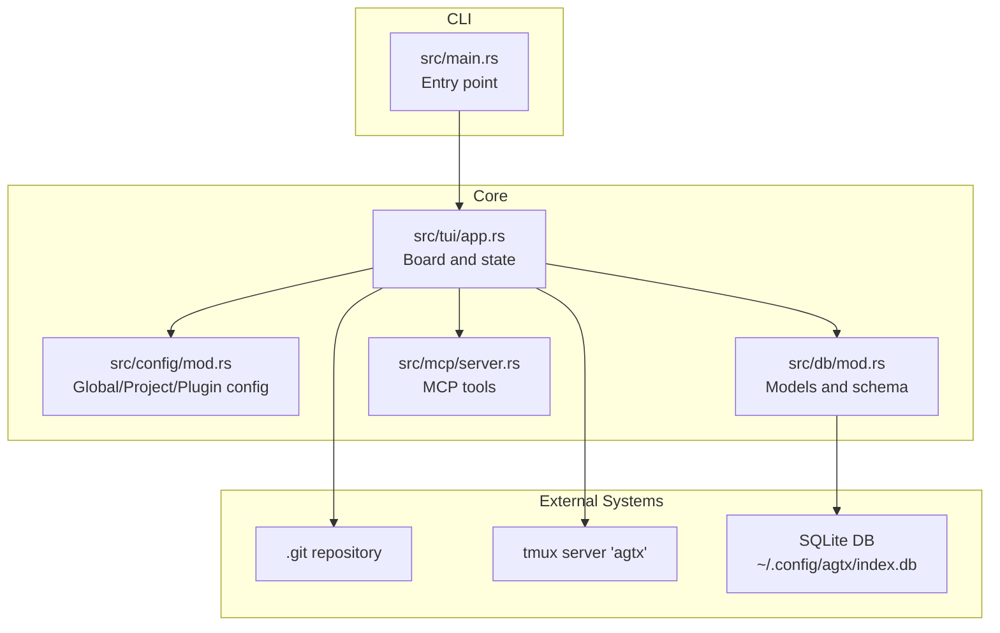
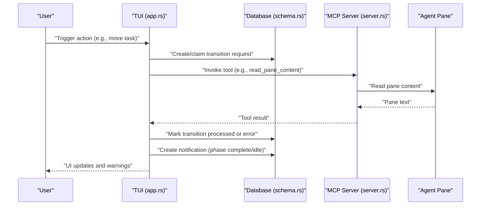
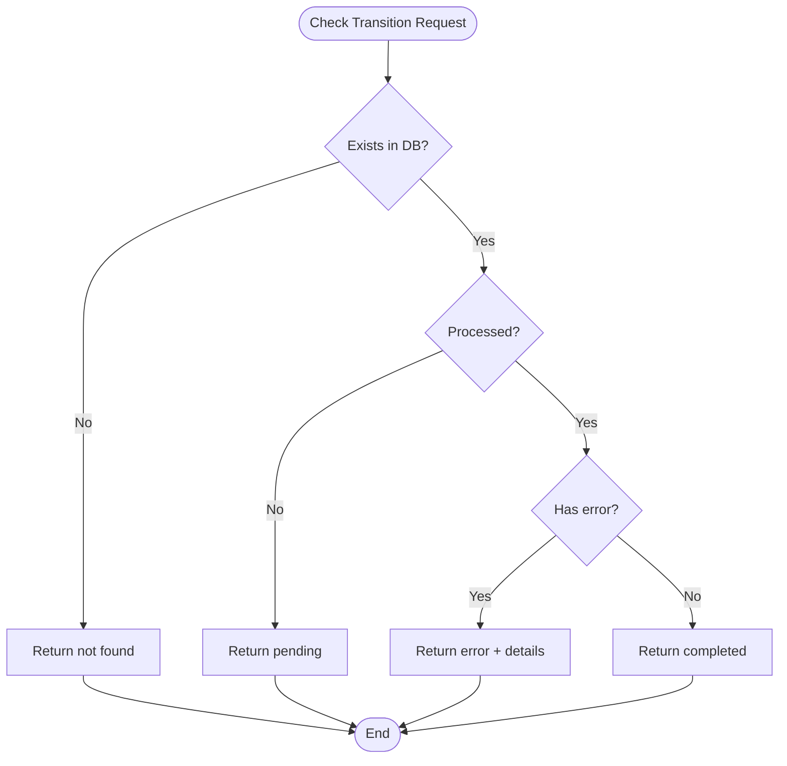
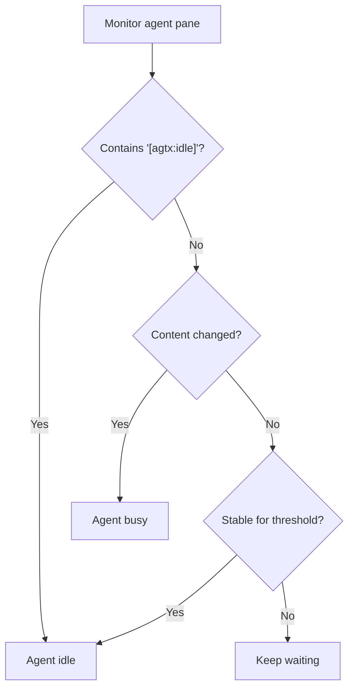
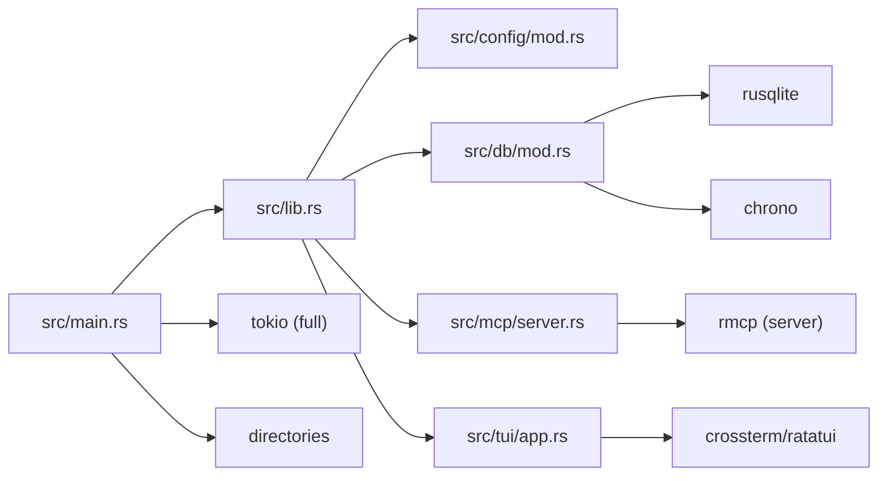
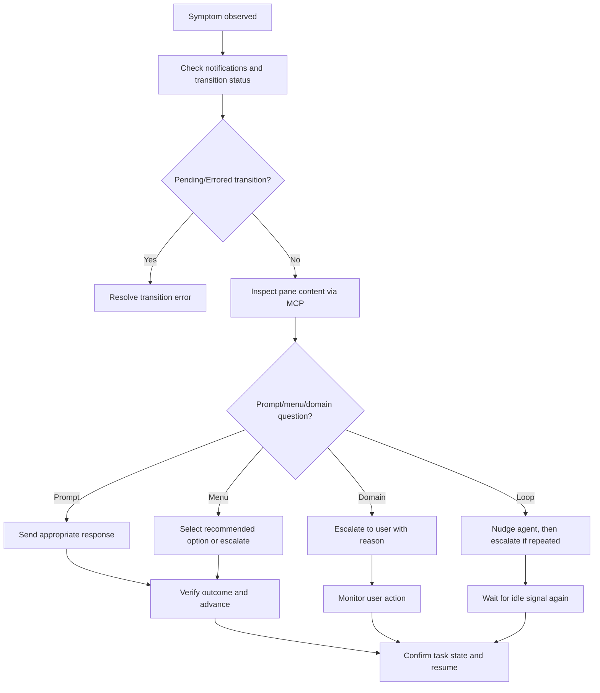

# Debugging Tools and Diagnostic Procedures

<cite>
**Referenced Files in This Document**
- [README.md](file://README.md)
- [Cargo.toml](file://Cargo.toml)
- [src/main.rs](file://src/main.rs)
- [src/lib.rs](file://src/lib.rs)
- [src/config/mod.rs](file://src/config/mod.rs)
- [src/db/mod.rs](file://src/db/mod.rs)
- [src/db/schema.rs](file://src/db/schema.rs)
- [src/mcp/server.rs](file://src/mcp/server.rs)
- [src/tui/app.rs](file://src/tui/app.rs)
- [plugins/agtx/skills/orchestrate.md](file://plugins/agtx/skills/orchestrate.md)
- [plugins/agtx/skills/merge-conflicts.md](file://plugins/agtx/skills/merge-conflicts.md)
</cite>

## Table of Contents
1. [Introduction](#introduction)
2. [Project Structure](#project-structure)
3. [Core Components](#core-components)
4. [Architecture Overview](#architecture-overview)
5. [Detailed Component Analysis](#detailed-component-analysis)
6. [Dependency Analysis](#dependency-analysis)
7. [Performance Considerations](#performance-considerations)
8. [Troubleshooting Guide](#troubleshooting-guide)
9. [Conclusion](#conclusion)

## Introduction
This document explains how to debug and diagnose issues in agtx. It covers enabling diagnostic visibility, interpreting error messages, using built-in diagnostic commands, inspecting configuration, verifying internal state, collecting diagnostic information for bug reports, analyzing crash logs, performing system health checks, and following systematic troubleshooting workflows.

## Project Structure
Agtx is a terminal-native Kanban board for managing coding agents. It integrates:
- A TUI for task lifecycle management
- MCP server for external agent orchestration
- Git worktrees and tmux sessions for isolated agent execution
- A local SQLite database for state and notifications
- Configuration files for global and per-project settings

**Diagram sources**
- [src/main.rs:16-96](file://src/main.rs#L16-L96)
- [src/lib.rs:10-23](file://src/lib.rs#L10-L23)
- [src/config/mod.rs:230-303](file://src/config/mod.rs#L230-L303)
- [src/db/mod.rs:1-6](file://src/db/mod.rs#L1-L6)
- [src/mcp/server.rs:638-755](file://src/mcp/server.rs#L638-L755)
- [src/tui/app.rs:4707-6825](file://src/tui/app.rs#L4707-L6825)

**Section sources**
- [README.md:506-572](file://README.md#L506-L572)
- [src/main.rs:16-96](file://src/main.rs#L16-L96)
- [src/lib.rs:10-23](file://src/lib.rs#L10-L23)

## Core Components
- Configuration system: global and project-level TOML files, merged configuration, and plugin definitions.
- Database: local SQLite storage for tasks, transition requests, notifications, and cleanup policies.
- MCP server: JSON-RPC tools exposing board state and actions to external agents.
- TUI: orchestrates tasks, monitors agent panes, and surfaces diagnostics and warnings.
- Orchestrator: advanced automation that detects idle agents, reads pane content, and escalates issues.

Key diagnostic capabilities:
- Notifications queue for asynchronous events
- Transition request tracking with error propagation
- Orchestrator idle detection and escalation
- MCP tool responses for state inspection

**Section sources**
- [src/config/mod.rs:230-408](file://src/config/mod.rs#L230-L408)
- [src/db/schema.rs:499-564](file://src/db/schema.rs#L499-L564)
- [src/db/schema.rs:598-655](file://src/db/schema.rs#L598-L655)
- [src/mcp/server.rs:638-755](file://src/mcp/server.rs#L638-L755)
- [src/tui/app.rs:6903-6931](file://src/tui/app.rs#L6903-L6931)
- [plugins/agtx/skills/orchestrate.md:79-200](file://plugins/agtx/skills/orchestrate.md#L79-L200)

## Architecture Overview
Agtx’s diagnostic architecture centers on the TUI, MCP server, and database. The orchestrator leverages MCP tools to read pane content, send nudges, and escalate issues. The database stores notifications and transition requests to persist state and aid post-mortem analysis.

**Diagram sources**
- [src/tui/app.rs:4707-6825](file://src/tui/app.rs#L4707-L6825)
- [src/db/schema.rs:499-564](file://src/db/schema.rs#L499-L564)
- [src/db/schema.rs:598-655](file://src/db/schema.rs#L598-L655)
- [src/mcp/server.rs:638-755](file://src/mcp/server.rs#L638-L755)

## Detailed Component Analysis

### Configuration Inspection and Validation
- Global configuration path and defaults
- Project configuration overlay and merging
- Plugin configuration loading and validation
- Worktree and agent settings

Diagnostic tips:
- Verify configuration locations and overrides
- Confirm plugin presence and compatibility
- Validate worktree base branch and directory settings

**Section sources**
- [src/config/mod.rs:230-303](file://src/config/mod.rs#L230-L303)
- [src/config/mod.rs:355-408](file://src/config/mod.rs#L355-L408)
- [src/config/mod.rs:545-594](file://src/config/mod.rs#L545-L594)
- [README.md:261-303](file://README.md#L261-L303)

### Database State Verification
- Transition requests lifecycle (pending, claimed, processed, error)
- Notifications queue (peek/consume)
- Cleanup policies for stale requests

Diagnostic tips:
- Inspect pending transition requests for stuck actions
- Consume and review notifications for recent events
- Use cleanup to remove stale entries

**Diagram sources**
- [src/db/schema.rs:499-564](file://src/db/schema.rs#L499-L564)
- [src/db/schema.rs:598-655](file://src/db/schema.rs#L598-L655)

**Section sources**
- [src/db/schema.rs:499-564](file://src/db/schema.rs#L499-L564)
- [src/db/schema.rs:598-655](file://src/db/schema.rs#L598-L655)

### MCP Tools for Diagnostics
- list_projects, list_tasks, get_task
- read_pane_content, send_to_task
- get_transition_status, get_notifications

Diagnostic tips:
- Use list_projects to enumerate indexed repositories
- Use get_task to validate allowed_actions and dependencies
- Use read_pane_content to diagnose stuck agents
- Use get_transition_status to correlate UI actions with backend processing

**Section sources**
- [README.md:586-602](file://README.md#L586-L602)
- [src/mcp/server.rs:638-755](file://src/mcp/server.rs#L638-L755)
- [src/mcp/server.rs:834-858](file://src/mcp/server.rs#L834-L858)

### TUI Diagnostics and Warnings
- Warning messages for dependency violations and phase transitions
- Idle detection for orchestrator and stuck tasks
- Escalation notifications to the user

Diagnostic tips:
- Pay attention to transient warning banners
- Use Ctrl+F to attach to a task’s tmux window for live inspection
- Monitor the board for escalation badges

**Section sources**
- [src/tui/app.rs:4707-4730](file://src/tui/app.rs#L4707-L4730)
- [src/tui/app.rs:6903-6931](file://src/tui/app.rs#L6903-L6931)
- [src/tui/app.rs:6817-6825](file://src/tui/app.rs#L6817-L6825)

### Orchestrator Automation and Escalation
- Idle detection thresholds and fallback logic
- Decision rules for prompts, menus, and domain questions
- Escalation to user with concise reasons

Diagnostic tips:
- Confirm orchestrator idle signals and fallback timers
- Review escalation reasons surfaced in the TUI
- Use send_to_task to provide nudges when appropriate

**Diagram sources**
- [src/tui/app.rs:6903-6931](file://src/tui/app.rs#L6903-L6931)
- [plugins/agtx/skills/orchestrate.md:79-200](file://plugins/agtx/skills/orchestrate.md#L79-L200)

**Section sources**
- [src/tui/app.rs:6903-6931](file://src/tui/app.rs#L6903-L6931)
- [plugins/agtx/skills/orchestrate.md:79-200](file://plugins/agtx/skills/orchestrate.md#L79-L200)

### Merge Conflict Resolution Diagnostics
- Automated conflict detection and resolution guidance
- Post-resolution verification steps

Diagnostic tips:
- Use the merge-conflicts skill to resolve and verify changes
- Review diffs for both sides of conflicts and test results

**Section sources**
- [plugins/agtx/skills/merge-conflicts.md:10-44](file://plugins/agtx/skills/merge-conflicts.md#L10-L44)

## Dependency Analysis
Agtx’s diagnostics depend on:
- Tokio runtime for async operations
- rmcp for MCP server transport
- rusqlite for local persistence
- crossterm and ratatui for TUI rendering
- chrono for timestamps and cleanup
- directories for platform-appropriate paths

**Diagram sources**
- [Cargo.toml:12-38](file://Cargo.toml#L12-L38)
- [src/lib.rs:1-8](file://src/lib.rs#L1-L8)
- [src/main.rs:16-96](file://src/main.rs#L16-L96)

**Section sources**
- [Cargo.toml:12-38](file://Cargo.toml#L12-L38)
- [src/lib.rs:1-8](file://src/lib.rs#L1-L8)

## Performance Considerations
- MCP tool responses serialize JSON; avoid excessive polling
- Transition request cleanup prevents accumulation of stale entries
- TUI rendering and pane reads should be scoped to active tasks
- Use tmux attach for targeted inspection rather than broad monitoring

[No sources needed since this section provides general guidance]

## Troubleshooting Guide

### Enabling Debug Logging
- Use verbose logging via environment variables or application flags where applicable.
- Inspect tmux pane content directly for immediate feedback.
- Monitor notifications and transition statuses for asynchronous events.

**Section sources**
- [src/tui/app.rs:6903-6931](file://src/tui/app.rs#L6903-L6931)
- [src/mcp/server.rs:834-858](file://src/mcp/server.rs#L834-L858)

### Interpreting Error Messages
- Transition request errors indicate failures during phase advancement
- Notification messages surface task completion or idle alerts
- Plugin configuration errors can prevent commands/prompt triggers from firing

Actions:
- Retrieve transition status for detailed error context
- Consume notifications to confirm recent events
- Validate plugin commands and prompts

**Section sources**
- [src/db/schema.rs:499-564](file://src/db/schema.rs#L499-L564)
- [src/db/schema.rs:598-655](file://src/db/schema.rs#L598-L655)
- [src/mcp/server.rs:638-755](file://src/mcp/server.rs#L638-L755)

### Built-in Diagnostic Commands
- Use MCP tools to inspect board state and agent panes
- Read pane content to diagnose stuck agents
- Send nudges or escalate to user when appropriate

**Section sources**
- [README.md:586-602](file://README.md#L586-L602)
- [plugins/agtx/skills/orchestrate.md:79-200](file://plugins/agtx/skills/orchestrate.md#L79-L200)

### UI Diagnostics
- Watch for warning banners and escalation indicators
- Use fullscreen attach to inspect agent sessions
- Review task details and allowed actions

**Section sources**
- [src/tui/app.rs:4707-4730](file://src/tui/app.rs#L4707-L4730)
- [src/tui/app.rs:6817-6825](file://src/tui/app.rs#L6817-L6825)

### Configuration Inspection
- Validate global and project config files
- Confirm plugin presence and compatibility
- Verify worktree base branch and directory settings

**Section sources**
- [src/config/mod.rs:230-303](file://src/config/mod.rs#L230-L303)
- [src/config/mod.rs:545-594](file://src/config/mod.rs#L545-L594)
- [README.md:261-303](file://README.md#L261-L303)

### State Verification Procedures
- Check pending transition requests and claimants
- Consume notifications and review recent events
- Clean up stale transition requests

**Section sources**
- [src/db/schema.rs:499-564](file://src/db/schema.rs#L499-L564)
- [src/db/schema.rs:598-655](file://src/db/schema.rs#L598-L655)

### Collecting Diagnostic Information for Bug Reports
- Include:
  - Global and project configuration excerpts
  - Recent notifications and transition status
  - Task details and allowed actions
  - tmux pane content around the failure
  - Steps to reproduce and environment details

**Section sources**
- [src/config/mod.rs:230-303](file://src/config/mod.rs#L230-L303)
- [src/db/schema.rs:598-655](file://src/db/schema.rs#L598-L655)
- [src/mcp/server.rs:638-755](file://src/mcp/server.rs#L638-L755)

### Analyzing Crash Logs
- Look for transition request errors and timestamps
- Correlate with notifications and orchestrator idle detection
- Inspect plugin commands and prompt triggers for misconfiguration

**Section sources**
- [src/db/schema.rs:499-564](file://src/db/schema.rs#L499-L564)
- [src/db/schema.rs:598-655](file://src/db/schema.rs#L598-L655)
- [src/tui/app.rs:6903-6931](file://src/tui/app.rs#L6903-L6931)

### System Health Checks
- Verify tmux server and sessions
- Confirm database connectivity and cleanup
- Validate agent availability and plugin compatibility

**Section sources**
- [README.md:549-564](file://README.md#L549-L564)
- [src/db/schema.rs:545-554](file://src/db/schema.rs#L545-L554)
- [src/agent/mod.rs:124-169](file://src/agent/mod.rs#L124-L169)

### Troubleshooting Workflows
- Isolate stuck tasks using orchestrator idle detection and pane content
- Validate dependencies and allowed actions before advancing
- Use MCP tools to confirm state and retry failed transitions
- Escalate unresolved issues with concise reasons

**Diagram sources**
- [src/mcp/server.rs:638-755](file://src/mcp/server.rs#L638-L755)
- [plugins/agtx/skills/orchestrate.md:79-200](file://plugins/agtx/skills/orchestrate.md#L79-L200)
- [src/tui/app.rs:6903-6931](file://src/tui/app.rs#L6903-L6931)

**Section sources**
- [plugins/agtx/skills/orchestrate.md:79-200](file://plugins/agtx/skills/orchestrate.md#L79-L200)
- [src/tui/app.rs:6903-6931](file://src/tui/app.rs#L6903-L6931)

## Conclusion
Agtx provides robust diagnostics through its TUI, MCP tools, database-backed notifications and transition tracking, and orchestrator automation. Use the workflows and tools outlined above to systematically isolate problems, collect actionable evidence, and resolve issues efficiently.