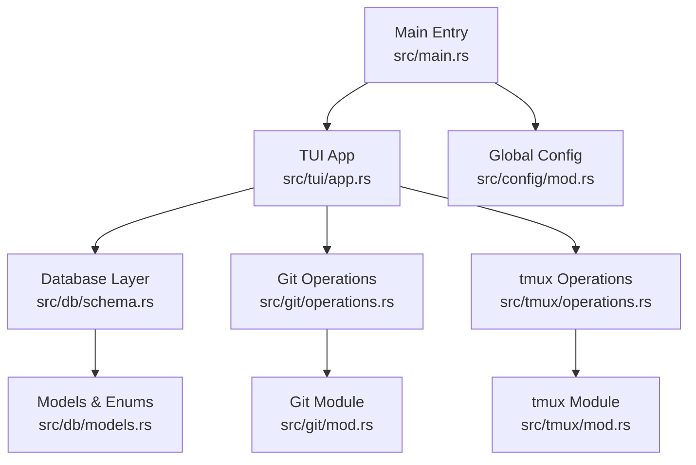
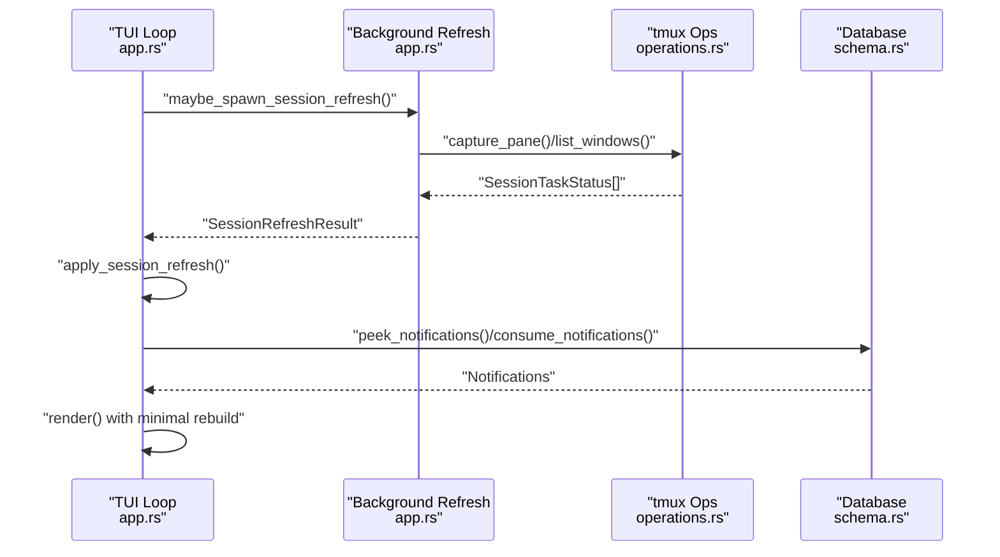
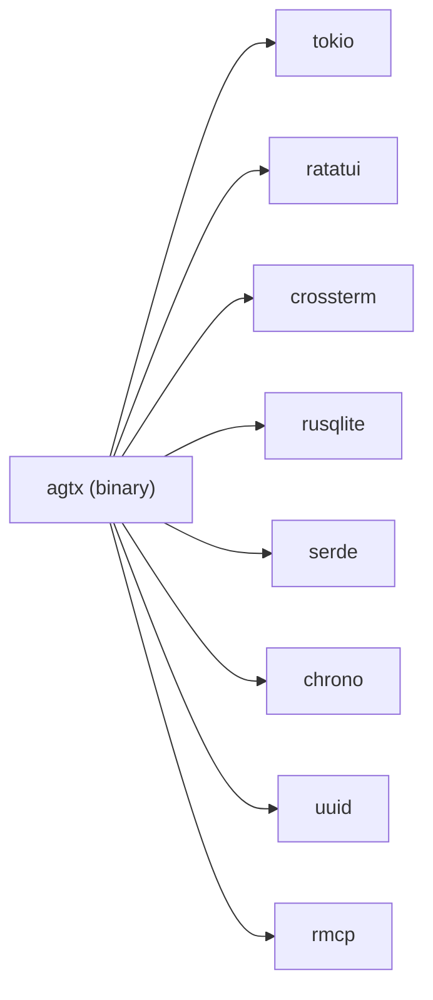

# Memory and CPU Usage Optimization

<cite>
**Referenced Files in This Document**
- [Cargo.toml](file://Cargo.toml)
- [src/lib.rs](file://src/lib.rs)
- [src/main.rs](file://src/main.rs)
- [src/tui/app.rs](file://src/tui/app.rs)
- [src/tui/board.rs](file://src/tui/board.rs)
- [src/db/mod.rs](file://src/db/mod.rs)
- [src/db/models.rs](file://src/db/models.rs)
- [src/db/schema.rs](file://src/db/schema.rs)
- [src/git/mod.rs](file://src/git/mod.rs)
- [src/git/operations.rs](file://src/git/operations.rs)
- [src/tmux/mod.rs](file://src/tmux/mod.rs)
- [src/tmux/operations.rs](file://src/tmux/operations.rs)
- [src/config/mod.rs](file://src/config/mod.rs)
</cite>

## Table of Contents
1. [Introduction](#introduction)
2. [Project Structure](#project-structure)
3. [Core Components](#core-components)
4. [Architecture Overview](#architecture-overview)
5. [Detailed Component Analysis](#detailed-component-analysis)
6. [Dependency Analysis](#dependency-analysis)
7. [Performance Considerations](#performance-considerations)
8. [Troubleshooting Guide](#troubleshooting-guide)
9. [Conclusion](#conclusion)

## Introduction
This document focuses on memory and CPU optimization techniques for managing large task sets, optimizing rendering performance for extensive boards, reducing CPU overhead during intensive operations, and tuning database queries, Git operation batching, and tmux session management efficiency. It also covers monitoring techniques for tracking resource consumption and identifying performance bottlenecks, along with configuration recommendations tailored to different system specifications and usage patterns.

## Project Structure
The application is a TUI-driven Kanban board orchestrating agent tasks with integrated Git and tmux workflows. Key modules include:
- TUI rendering and state management
- Database layer for tasks and notifications
- Git operations for worktrees and diffs
- tmux operations for session/window management
- Configuration for agents, worktrees, and UI behavior

**Diagram sources**
- [src/main.rs:16-96](file://src/main.rs#L16-L96)
- [src/tui/app.rs:793-800](file://src/tui/app.rs#L793-L800)
- [src/db/schema.rs:8-10](file://src/db/schema.rs#L8-L10)
- [src/git/operations.rs:11-75](file://src/git/operations.rs#L11-L75)
- [src/tmux/operations.rs:10-59](file://src/tmux/operations.rs#L10-L59)
- [src/db/models.rs:58-79](file://src/db/models.rs#L58-L79)
- [src/git/mod.rs:18-39](file://src/git/mod.rs#L18-L39)
- [src/tmux/mod.rs:11-13](file://src/tmux/mod.rs#L11-L13)

**Section sources**
- [src/lib.rs:1-24](file://src/lib.rs#L1-L24)
- [src/main.rs:16-96](file://src/main.rs#L16-L96)

## Core Components
- TUI App: Central state machine coordinating rendering, event handling, background refresh, and UI updates.
- Database: SQLite-backed storage with indexes and batch operations to minimize I/O overhead.
- Git Operations: Trait-based abstraction enabling mocking and efficient worktree management.
- tmux Operations: Trait-based abstraction for session/window lifecycle and pane capture.
- Configuration: Global and project-level settings controlling agent behavior, worktree usage, and UI preferences.

**Section sources**
- [src/tui/app.rs:496-609](file://src/tui/app.rs#L496-L609)
- [src/db/schema.rs:97-180](file://src/db/schema.rs#L97-L180)
- [src/git/operations.rs:11-75](file://src/git/operations.rs#L11-L75)
- [src/tmux/operations.rs:10-59](file://src/tmux/operations.rs#L10-L59)
- [src/config/mod.rs:229-408](file://src/config/mod.rs#L229-L408)

## Architecture Overview
The system uses a hybrid synchronous rendering loop with asynchronous background workers to avoid blocking the UI. Rendering is optimized by minimizing allocations and recomputing only necessary UI regions. Background refresh threads poll tmux session states and feed results back via channels, decoupling I/O-bound operations from the main thread.

**Diagram sources**
- [src/tui/app.rs:6456-6505](file://src/tui/app.rs#L6456-L6505)
- [src/tmux/operations.rs:166-182](file://src/tmux/operations.rs#L166-L182)
- [src/db/schema.rs:606-654](file://src/db/schema.rs#L606-L654)

## Detailed Component Analysis

### Memory Management for Large Task Sets
- Task storage: Tasks are stored as structured records with optional fields to avoid unnecessary allocations for unset properties.
- Board state: BoardState holds a vector of tasks and selection indices; selection filtering is computed on demand rather than pre-stored.
- Caching: Phase status and pane content hashes are cached with TTL to avoid repeated expensive tmux captures and reduce memory churn.
- Indexes: Database indexes on status and project_id accelerate filtering and reduce scan costs.

Optimization strategies:
- Prefer lazy computation and on-demand filtering over materializing intermediate collections.
- Use compact optional fields and avoid cloning large strings unnecessarily.
- Limit cache sizes by TTL and periodic eviction to cap memory growth.

**Section sources**
- [src/tui/board.rs:4-99](file://src/tui/board.rs#L4-L99)
- [src/db/models.rs:58-79](file://src/db/models.rs#L58-L79)
- [src/db/schema.rs:117-118](file://src/db/schema.rs#L117-L118)
- [src/tui/app.rs:6465-6486](file://src/tui/app.rs#L6465-L6486)

### Rendering Performance for Extensive Boards
- Minimal redraw: Footer items and click regions are rebuilt per frame; reuse and avoid reallocating static UI elements.
- Efficient layout: Ratatui widgets are used with fixed-size buffers and incremental updates.
- Conditional rendering: Only render visible panes and avoid heavy computations when off-screen.

Optimization strategies:
- Cache frequently used UI metrics (e.g., widths, heights) and invalidate only when layout changes.
- Defer expensive operations (e.g., diff generation) until needed.
- Use lazy evaluation for task lists and avoid sorting/filtering unless the underlying data changes.

**Section sources**
- [src/tui/app.rs:252-293](file://src/tui/app.rs#L252-L293)
- [src/tui/app.rs:1256-1256](file://src/tui/app.rs#L1256-L1256)

### CPU Overhead Reduction During Intensive Operations
- Background refresh: Poll tmux status in a background thread with a short TTL cache to amortize cost across frames.
- Non-blocking channels: Use try_recv to poll results without stalling the UI loop.
- Debounced actions: Avoid redundant tmux captures by caching pane content hashes and clearing them on state changes.

Optimization strategies:
- Tune cache TTL to balance freshness and CPU usage.
- Batch tmux queries per frame to reduce process invocation overhead.
- Gate expensive checks behind guards (e.g., only when phase is Planning/Running).

**Section sources**
- [src/tui/app.rs:6456-6466](file://src/tui/app.rs#L6456-L6466)
- [src/tui/app.rs:1225-1238](file://src/tui/app.rs#L1225-L1238)
- [src/tui/app.rs:6767-6825](file://src/tui/app.rs#L6767-L6825)

### Database Query Optimization
- Indexes: Status and project_id indexes support fast filtering and ordering.
- Prepared statements: Reuse prepared statements to reduce compilation overhead.
- Batch writes: create_tasks_batch wraps multiple inserts in a transaction to reduce WAL overhead.
- Atomic operations: consume_notifications uses RETURNING to atomically dequeue and process notifications.

Optimization strategies:
- Use targeted queries with appropriate WHERE clauses and ORDER BY to leverage indexes.
- Batch related writes to minimize fsync and transaction overhead.
- Avoid N+1 queries by pre-loading referenced data when needed.

**Section sources**
- [src/db/schema.rs:117-118](file://src/db/schema.rs#L117-L118)
- [src/db/schema.rs:242-274](file://src/db/schema.rs#L242-L274)
- [src/db/schema.rs:630-654](file://src/db/schema.rs#L630-L654)

### Git Operation Batching and Efficiency
- Trait abstraction: GitOperations allows mocking and isolates process invocations.
- Conflict detection: fetch_and_check_conflicts performs a single virtual merge-tree check to detect conflicts without modifying the working tree.
- Worktree management: RealGitOps delegates to module functions to create/remove worktrees and diff operations.

Optimization strategies:
- Coalesce frequent git commands by combining steps (e.g., fetch + merge-tree in one method).
- Cache branch detection and default branch resolution to avoid repeated rev-parse calls.
- Use diff stat and staged/unstaged checks selectively to avoid heavy diffs on large repos.

**Section sources**
- [src/git/operations.rs:11-75](file://src/git/operations.rs#L11-L75)
- [src/git/operations.rs:211-243](file://src/git/operations.rs#L211-L243)
- [src/git/mod.rs:18-39](file://src/git/mod.rs#L18-L39)

### tmux Session Management Efficiency
- Trait abstraction: TmuxOperations enables deterministic testing and isolates external process calls.
- Window lifecycle: create_window supports keeping a shell on exit for task panes and closing windows cleanly.
- Pane capture: capture_pane_with_history retrieves recent output efficiently for idle detection and stuck-task notifications.

Optimization strategies:
- Reuse tmux server name and target formatting to minimize quoting overhead.
- Limit pane capture depth to recent lines for responsiveness.
- Avoid redundant window existence checks by caching state within a frame.

**Section sources**
- [src/tmux/operations.rs:10-59](file://src/tmux/operations.rs#L10-L59)
- [src/tmux/operations.rs:174-182](file://src/tmux/operations.rs#L174-L182)
- [src/tmux/mod.rs:11-13](file://src/tmux/mod.rs#L11-L13)

### Monitoring Resource Consumption and Bottlenecks
- Idle detection: PhaseStatus.Working vs Idle is determined by comparing pane content hashes across refresh cycles.
- Stuck-task notifications: After 1 minute of Idle in Planning/Running, a notification is enqueued to alert the orchestrator.
- Warning messages: Temporary warnings are auto-cleared after a timeout to prevent UI clutter.

Optimization strategies:
- Monitor cache TTL impact on responsiveness and CPU usage.
- Track notification throughput to ensure the MCP pipeline is not backlogging.
- Profile tmux capture frequency to balance UI responsiveness with process overhead.

**Section sources**
- [src/db/models.rs:234-244](file://src/db/models.rs#L234-L244)
- [src/tui/app.rs:6767-6825](file://src/tui/app.rs#L6767-L6825)
- [src/tui/app.rs:1245-1250](file://src/tui/app.rs#L1245-L1250)

## Dependency Analysis
The application relies on a small set of core dependencies with clear separation of concerns:
- tokio for async runtime and background tasks
- rusqlite for embedded database operations
- ratatui/crossterm for TUI rendering and input handling
- rmcp for MCP server transport

**Diagram sources**
- [Cargo.toml:12-38](file://Cargo.toml#L12-L38)

**Section sources**
- [Cargo.toml:12-38](file://Cargo.toml#L12-L38)

## Performance Considerations
- CPU budgeting: Keep background refresh TTL low (e.g., 2 seconds) to balance responsiveness and CPU usage.
- Memory footprint: Prefer compact optional fields and avoid cloning large strings; clear caches on state transitions.
- I/O batching: Group tmux captures and Git operations per frame; avoid redundant process invocations.
- Rendering efficiency: Minimize widget rebuilds; cache UI metrics and only update changed regions.
- Database throughput: Use transactions for batch writes; leverage indexes for filtering; avoid N+1 queries.

[No sources needed since this section provides general guidance]

## Troubleshooting Guide
Common issues and remedies:
- High CPU usage during tmux refresh: Reduce cache TTL or limit the number of tasks polled per refresh cycle.
- Memory growth with large boards: Verify cache eviction and ensure pane content hashes are cleared on state changes.
- Slow database operations: Confirm indexes exist and queries use appropriate filters; batch writes when importing large datasets.
- Git conflicts detection failures: Ensure merge-tree is available (Git 2.38+) and that fetch succeeds before merge-tree checks.
- tmux session instability: Verify tmux server name consistency and that window targets are formatted correctly.

**Section sources**
- [src/tui/app.rs:6456-6466](file://src/tui/app.rs#L6456-L6466)
- [src/db/schema.rs:117-118](file://src/db/schema.rs#L117-L118)
- [src/git/operations.rs:211-243](file://src/git/operations.rs#L211-L243)
- [src/tmux/operations.rs:73-108](file://src/tmux/operations.rs#L73-L108)

## Conclusion
By combining background refresh with short TTL caching, selective tmux pane captures, efficient database indexing and batching, and careful TUI rendering strategies, the system achieves responsive performance even with large task sets. Tuning configuration options—such as worktree usage, fullscreen behavior, and agent assignments—allows further optimization for different system specs and usage patterns.

[No sources needed since this section summarizes without analyzing specific files]