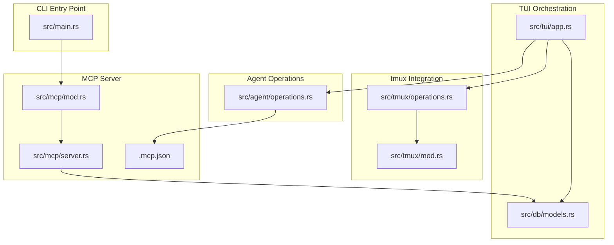
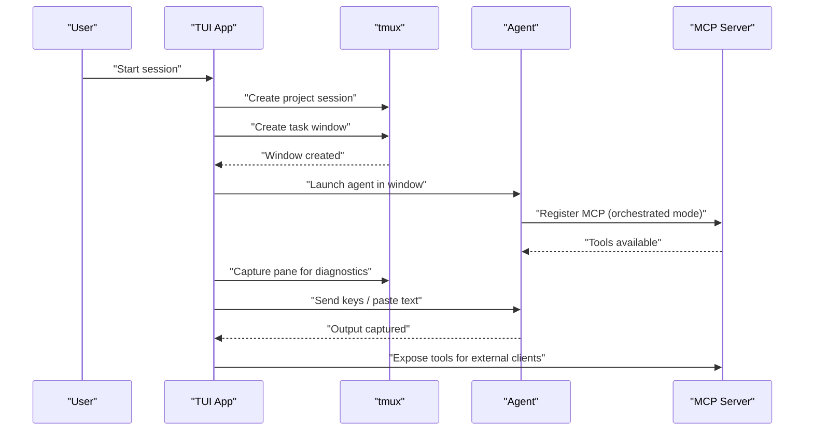
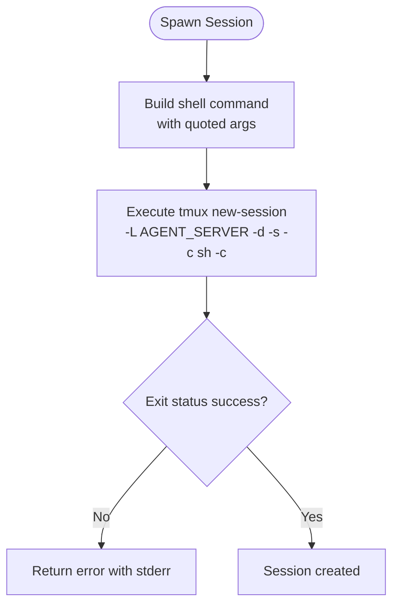
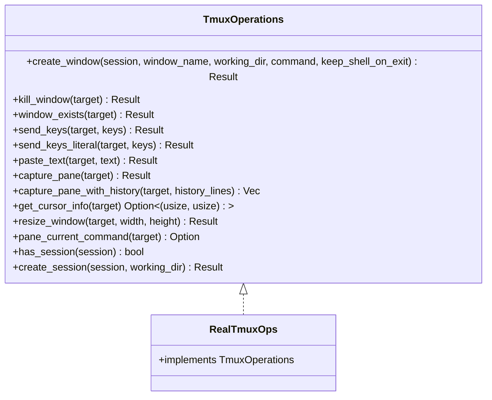
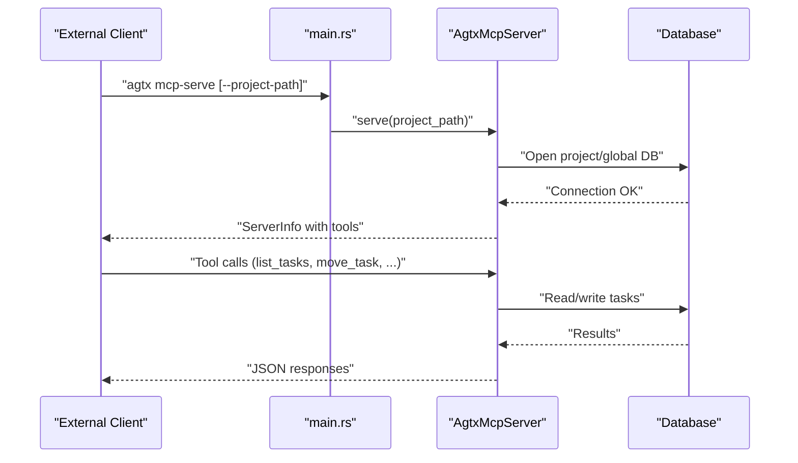
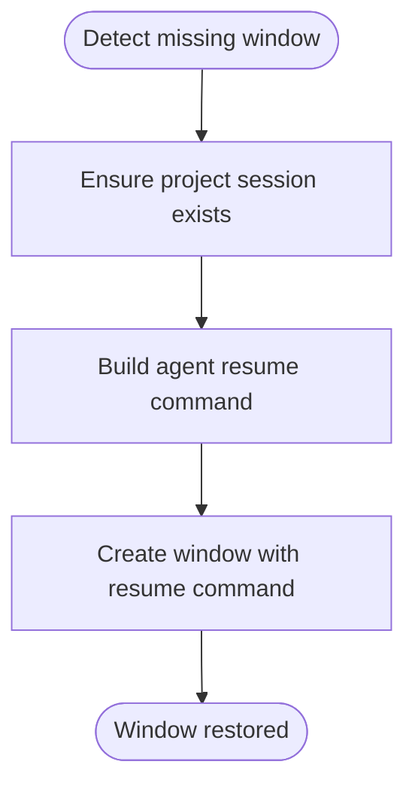
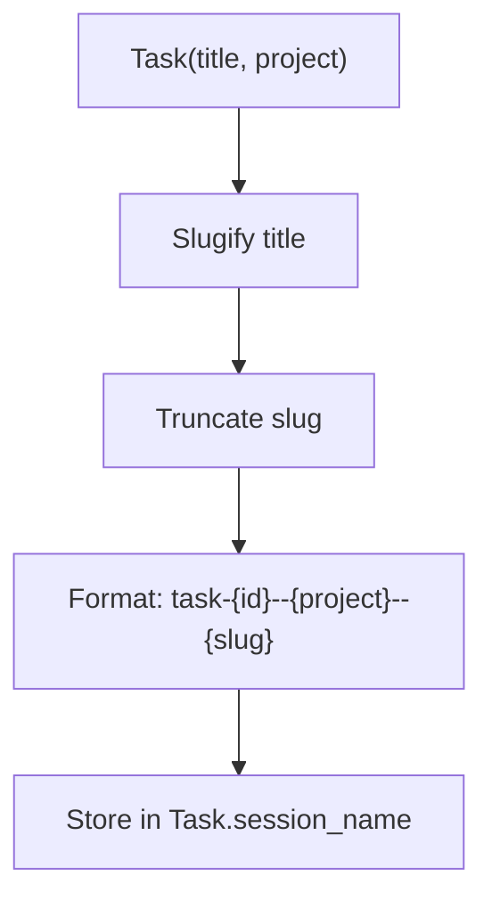
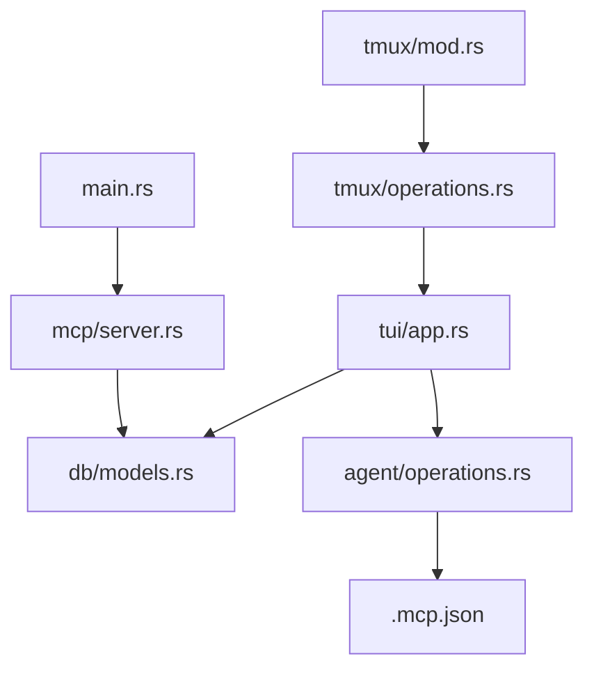

# Session Management and Connectivity Problems

<cite>
**Referenced Files in This Document**
- [src/tmux/mod.rs](file://src/tmux/mod.rs)
- [src/tmux/operations.rs](file://src/tmux/operations.rs)
- [src/mcp/server.rs](file://src/mcp/server.rs)
- [src/mcp/mod.rs](file://src/mcp/mod.rs)
- [src/main.rs](file://src/main.rs)
- [src/db/models.rs](file://src/db/models.rs)
- [src/tui/app.rs](file://src/tui/app.rs)
- [src/agent/operations.rs](file://src/agent/operations.rs)
- [.mcp.json](file://.mcp.json)
- [Cargo.toml](file://Cargo.toml)
</cite>

## Table of Contents
1. [Introduction](#introduction)
2. [Project Structure](#project-structure)
3. [Core Components](#core-components)
4. [Architecture Overview](#architecture-overview)
5. [Detailed Component Analysis](#detailed-component-analysis)
6. [Dependency Analysis](#dependency-analysis)
7. [Performance Considerations](#performance-considerations)
8. [Troubleshooting Guide](#troubleshooting-guide)
9. [Conclusion](#conclusion)

## Introduction
This document provides comprehensive guidance for diagnosing and resolving tmux session management issues and MCP (Model Context Protocol) connectivity problems in the agtx system. It covers common session corruption scenarios, connection timeouts, agent communication failures, orphaned process cleanup, MCP server connectivity, and strategies to maintain session persistence across system restarts. The content is grounded in the repository's tmux integration, MCP server implementation, and TUI orchestration logic.

## Project Structure
The relevant subsystems for session and connectivity management are organized as follows:
- tmux integration: session lifecycle, pane capture, key sending, and session sanitization
- MCP server: tool router, server modes, and stdio transport
- TUI orchestration: session recovery, idle detection, and resource cleanup
- Agent operations: orchestrator command building and resume command generation
- Database models: task session naming and persistence metadata

**Diagram sources**
- [src/main.rs:30-61](file://src/main.rs#L30-L61)
- [src/mcp/mod.rs:1-5](file://src/mcp/mod.rs#L1-L5)
- [src/mcp/server.rs:1245-1263](file://src/mcp/server.rs#L1245-L1263)
- [src/tmux/mod.rs:1-189](file://src/tmux/mod.rs#L1-L189)
- [src/tmux/operations.rs:1-249](file://src/tmux/operations.rs#L1-L249)
- [src/tui/app.rs:6961-7006](file://src/tui/app.rs#L6961-L7006)
- [src/db/models.rs:119-133](file://src/db/models.rs#L119-L133)
- [src/agent/operations.rs:88-107](file://src/agent/operations.rs#L88-L107)
- [.mcp.json:1-7](file://.mcp.json#L1-L7)

**Section sources**
- [src/main.rs:30-61](file://src/main.rs#L30-L61)
- [src/mcp/mod.rs:1-5](file://src/mcp/mod.rs#L1-L5)
- [src/mcp/server.rs:1245-1263](file://src/mcp/server.rs#L1245-L1263)
- [src/tmux/mod.rs:1-189](file://src/tmux/mod.rs#L1-L189)
- [src/tmux/operations.rs:1-249](file://src/tmux/operations.rs#L1-L249)
- [src/tui/app.rs:6961-7006](file://src/tui/app.rs#L6961-L7006)
- [src/db/models.rs:119-133](file://src/db/models.rs#L119-L133)
- [src/agent/operations.rs:88-107](file://src/agent/operations.rs#L88-L107)
- [.mcp.json:1-7](file://.mcp.json#L1-L7)

## Core Components
- tmux session management: spawns, lists, attaches, kills, captures panes, and validates session existence
- tmux operations abstraction: trait-based interface enabling mocking and real command execution
- MCP server: project-scoped and global modes, tool router, stdio transport, and server info
- TUI session recovery: detects missing windows, ensures project sessions, and recreates windows with resume commands
- Agent orchestrator command building: generates commands that register/unregister MCP during orchestrated sessions
- Database task session naming: deterministic session name generation for task windows

**Section sources**
- [src/tmux/mod.rs:14-142](file://src/tmux/mod.rs#L14-L142)
- [src/tmux/operations.rs:10-59](file://src/tmux/operations.rs#L10-L59)
- [src/mcp/server.rs:16-24](file://src/mcp/server.rs#L16-L24)
- [src/tui/app.rs:6971-7006](file://src/tui/app.rs#L6971-L7006)
- [src/agent/operations.rs:88-107](file://src/agent/operations.rs#L88-L107)
- [src/db/models.rs:119-133](file://src/db/models.rs#L119-L133)

## Architecture Overview
The system orchestrates autonomous coding agents within tmux sessions. The TUI monitors task windows, recovers missing sessions, and coordinates agent interactions. The MCP server exposes tools for listing tasks, moving tasks between phases, and retrieving pane content. Agents can operate in interactive or orchestrated modes, with MCP registration managed automatically.

**Diagram sources**
- [src/tui/app.rs:6961-7006](file://src/tui/app.rs#L6961-L7006)
- [src/tmux/operations.rs:64-110](file://src/tmux/operations.rs#L64-L110)
- [src/mcp/server.rs:1218-1243](file://src/mcp/server.rs#L1218-L1243)
- [src/agent/operations.rs:92-107](file://src/agent/operations.rs#L92-L107)

## Detailed Component Analysis

### tmux Session Management
The tmux module provides primitives for session lifecycle and diagnostics:
- Spawning sessions with working directory and quoted arguments
- Listing sessions with activity and creation timestamps
- Checking session existence
- Capturing pane content and sending keys
- Attaching to sessions and killing sessions
- Sanitizing project names for tmux compatibility

**Diagram sources**
- [src/tmux/mod.rs:15-48](file://src/tmux/mod.rs#L15-L48)

**Section sources**
- [src/tmux/mod.rs:14-142](file://src/tmux/mod.rs#L14-L142)
- [src/tmux/mod.rs:144-166](file://src/tmux/mod.rs#L144-L166)
- [src/tmux/mod.rs:168-188](file://src/tmux/mod.rs#L168-L188)

### tmux Operations Abstraction
The operations trait enables testing and real command execution:
- Window creation with optional command and shell retention
- Window and session existence checks
- Pane capture with and without history
- Cursor info retrieval and pane sizing
- Current command detection and session creation

**Diagram sources**
- [src/tmux/operations.rs:10-59](file://src/tmux/operations.rs#L10-L59)
- [src/tmux/operations.rs:64-248](file://src/tmux/operations.rs#L64-L248)

**Section sources**
- [src/tmux/operations.rs:10-59](file://src/tmux/operations.rs#L10-L59)
- [src/tmux/operations.rs:64-248](file://src/tmux/operations.rs#L64-L248)

### MCP Server Connectivity
The MCP server supports two modes:
- Project-scoped: bound to a single project path
- Global: serves all indexed projects, requiring project_id for CRUD tools

**Diagram sources**
- [src/main.rs:30-61](file://src/main.rs#L30-L61)
- [src/mcp/server.rs:1245-1263](file://src/mcp/server.rs#L1245-L1263)
- [src/mcp/server.rs:1218-1243](file://src/mcp/server.rs#L1218-L1243)

**Section sources**
- [src/mcp/server.rs:16-24](file://src/mcp/server.rs#L16-L24)
- [src/mcp/server.rs:1245-1263](file://src/mcp/server.rs#L1245-L1263)
- [src/mcp/server.rs:1218-1243](file://src/mcp/server.rs#L1218-L1243)
- [src/main.rs:30-61](file://src/main.rs#L30-L61)

### TUI Session Recovery and Orphaned Processes
The TUI detects missing tmux windows and recreates them using agent resume commands:
- Ensures project tmux session exists
- Recovers task windows with worktree paths
- Builds resume commands for agents that support it

**Diagram sources**
- [src/tui/app.rs:6971-7006](file://src/tui/app.rs#L6971-L7006)
- [src/tui/app.rs:6961-6969](file://src/tui/app.rs#L6961-L6969)
- [src/agent/operations.rs:88-107](file://src/agent/operations.rs#L88-L107)

**Section sources**
- [src/tui/app.rs:6971-7006](file://src/tui/app.rs#L6971-L7006)
- [src/tui/app.rs:6961-6969](file://src/tui/app.rs#L6961-L6969)
- [src/agent/operations.rs:88-107](file://src/agent/operations.rs#L88-L107)

### Task Session Naming and Persistence
Task session names are generated deterministically from task IDs, project names, and slugs. This enables reliable recovery after system restarts.

**Diagram sources**
- [src/db/models.rs:119-133](file://src/db/models.rs#L119-L133)

**Section sources**
- [src/db/models.rs:119-133](file://src/db/models.rs#L119-L133)

## Dependency Analysis
The tmux and MCP subsystems depend on the database for task state and on the agent operations for command construction. The TUI orchestrates these components and handles recovery scenarios.

**Diagram sources**
- [src/tmux/mod.rs:1-189](file://src/tmux/mod.rs#L1-L189)
- [src/tmux/operations.rs:1-249](file://src/tmux/operations.rs#L1-L249)
- [src/tui/app.rs:6961-7006](file://src/tui/app.rs#L6961-L7006)
- [src/db/models.rs:119-133](file://src/db/models.rs#L119-L133)
- [src/agent/operations.rs:88-107](file://src/agent/operations.rs#L88-L107)
- [src/mcp/server.rs:1245-1263](file://src/mcp/server.rs#L1245-L1263)
- [src/main.rs:30-61](file://src/main.rs#L30-L61)
- [.mcp.json:1-7](file://.mcp.json#L1-L7)

**Section sources**
- [src/tmux/mod.rs:1-189](file://src/tmux/mod.rs#L1-L189)
- [src/tmux/operations.rs:1-249](file://src/tmux/operations.rs#L1-L249)
- [src/tui/app.rs:6961-7006](file://src/tui/app.rs#L6961-L7006)
- [src/db/models.rs:119-133](file://src/db/models.rs#L119-L133)
- [src/agent/operations.rs:88-107](file://src/agent/operations.rs#L88-L107)
- [src/mcp/server.rs:1245-1263](file://src/mcp/server.rs#L1245-L1263)
- [src/main.rs:30-61](file://src/main.rs#L30-L61)
- [.mcp.json:1-7](file://.mcp.json#L1-L7)

## Performance Considerations
- Prefer capturing pane content with bounded history to avoid memory overhead
- Use window existence checks before attempting operations to minimize error handling costs
- Ensure project tmux sessions are created once per project to reduce repeated setup overhead
- Keep agent resume commands lightweight to accelerate recovery after restarts

## Troubleshooting Guide

### Common Session Corruption Scenarios
- Symptoms: task window disappeared, agent process exited unexpectedly, pane content not updating
- Diagnose:
  - Verify project session exists and task window exists
  - Capture pane content to confirm agent output
  - Check current command in pane to identify stuck processes
- Recovery:
  - Recreate the task window using the agent's resume command
  - Ensure project tmux session exists before window creation

**Section sources**
- [src/tui/app.rs:6602-6612](file://src/tui/app.rs#L6602-L6612)
- [src/tui/app.rs:6971-7006](file://src/tui/app.rs#L6971-L7006)
- [src/tmux/operations.rs:213-229](file://src/tmux/operations.rs#L213-L229)

### Connection Timeouts and MCP Server Connectivity
- Symptoms: external client cannot connect to MCP server, tools not available
- Diagnose:
  - Confirm server mode (project-scoped vs global) and project_id usage
  - Validate database connectivity for the selected mode
  - Check stdio transport readiness
- Resolution:
  - Start server with correct mode and path
  - Ensure project_id is provided in global mode for CRUD tools
  - Verify MCP registration JSON and agent-specific registration steps

**Section sources**
- [src/mcp/server.rs:16-24](file://src/mcp/server.rs#L16-L24)
- [src/mcp/server.rs:1245-1263](file://src/mcp/server.rs#L1245-L1263)
- [src/mcp/server.rs:1218-1243](file://src/mcp/server.rs#L1218-L1243)
- [.mcp.json:1-7](file://.mcp.json#L1-L7)

### Agent Communication Failures
- Symptoms: agent not responding, MCP registration failing, stale agent sessions
- Diagnose:
  - Check agent availability and command construction
  - Verify orchestrator command includes MCP registration/cleanup
  - Ensure resume command is valid for the agent
- Resolution:
  - Use agent registry fallback to default agent
  - Pre-remove stale MCP registrations before adding new ones
  - Recreate session with resume command to recover from crashes

**Section sources**
- [src/agent/operations.rs:112-163](file://src/agent/operations.rs#L112-L163)
- [src/agent/operations.rs:92-107](file://src/agent/operations.rs#L92-L107)
- [src/tui/app.rs:6971-7006](file://src/tui/app.rs#L6971-L7006)

### Cleaning Up Stale Sessions and Orphaned Processes
- Use tmux kill-session and kill-window commands to remove stale sessions
- Ensure worktree cleanup scripts are executed post-task completion
- Archive artifacts from worktrees before removing them

**Section sources**
- [src/tmux/mod.rs:133-142](file://src/tmux/mod.rs#L133-L142)
- [src/tui/app.rs:7050-7071](file://src/tui/app.rs#L7050-L7071)
- [src/tui/app.rs:7073-7100](file://src/tui/app.rs#L7073-L7100)

### Maintaining Session Persistence Across System Restarts
- Rely on deterministic task session naming to recreate sessions reliably
- Implement project tmux session creation guard to prevent duplication
- Use resume commands to restore agent state after tmux server restarts

**Section sources**
- [src/db/models.rs:119-133](file://src/db/models.rs#L119-L133)
- [src/tui/app.rs:6961-6969](file://src/tui/app.rs#L6961-L6969)
- [src/agent/operations.rs:88-107](file://src/agent/operations.rs#L88-L107)

## Conclusion
The agtx system provides robust tmux session management and MCP connectivity through modular components: tmux primitives, an operations abstraction, a flexible MCP server, and TUI-driven session recovery. By leveraging deterministic session naming, resilient window recreation, and agent-specific orchestration commands, the system maintains reliability across restarts and recovers gracefully from common corruption and connectivity issues.