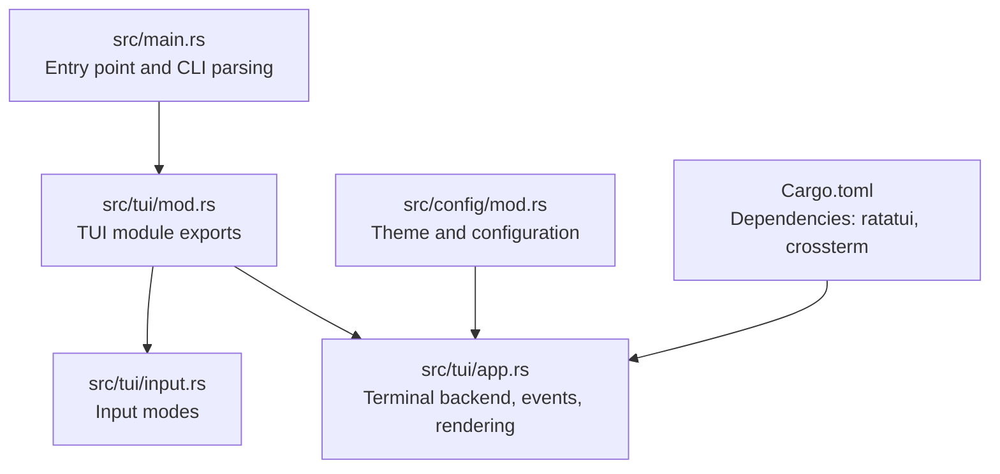
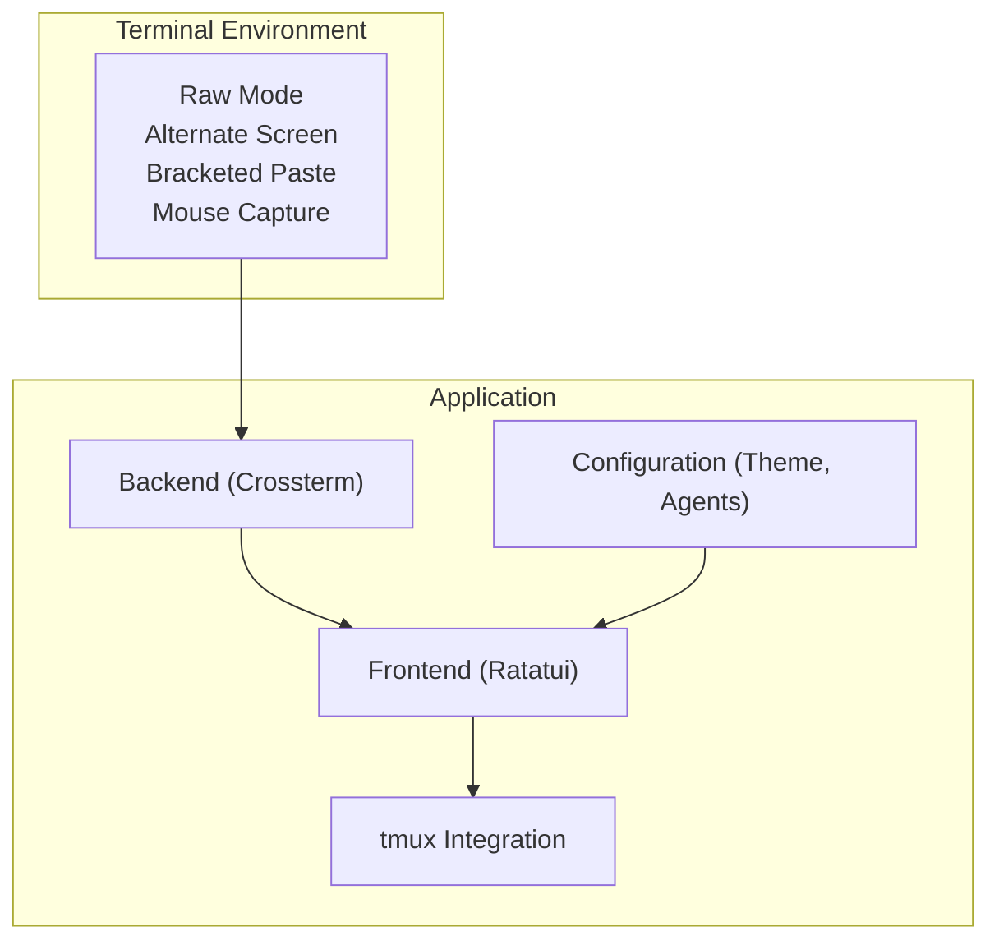
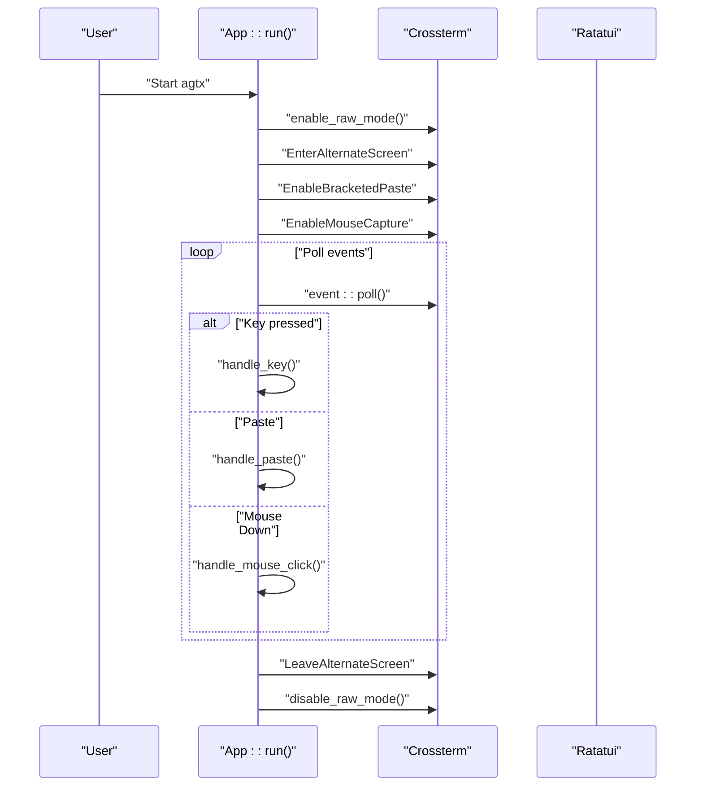
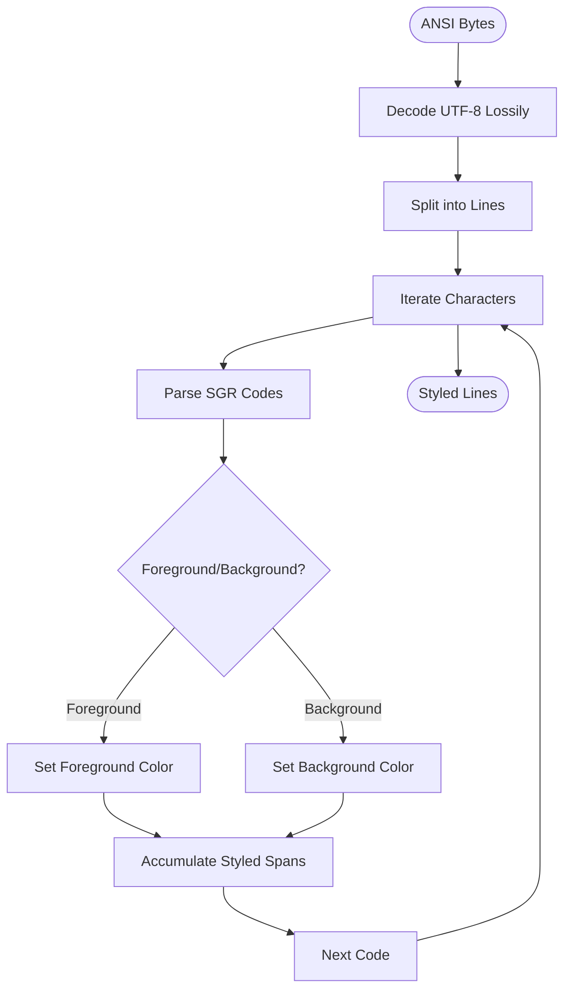
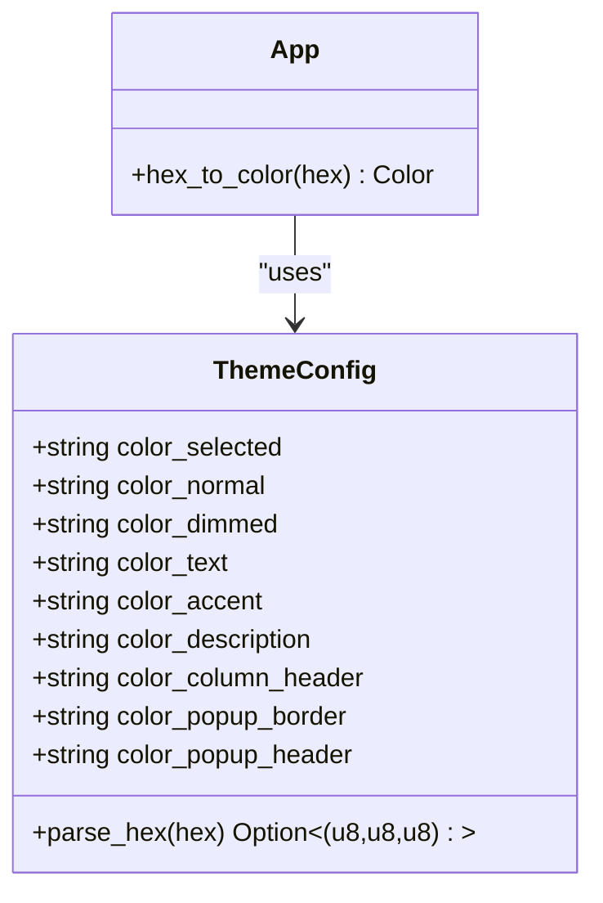
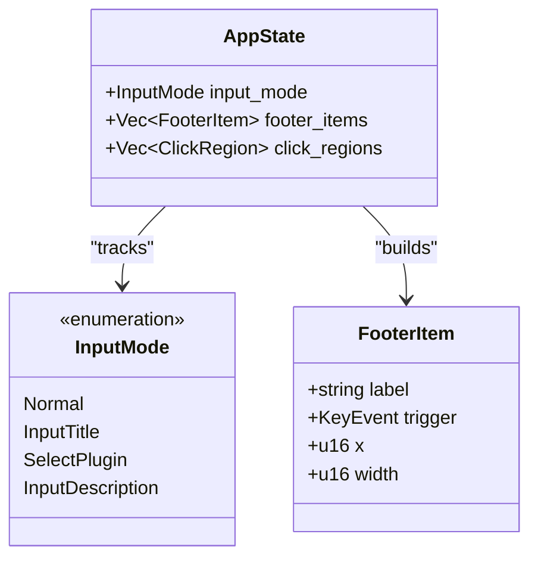
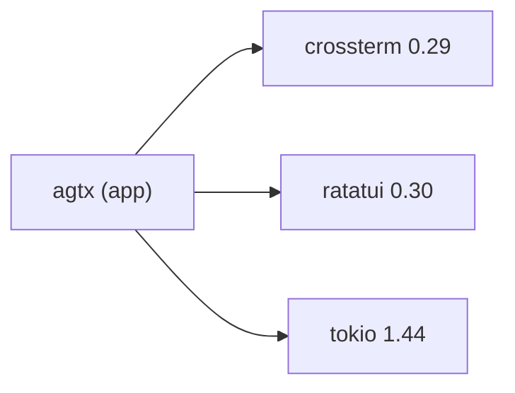

# Terminal Compatibility and Environment Setup

<cite>
**Referenced Files in This Document**
- [README.md](file://README.md)
- [install.sh](file://install.sh)
- [Cargo.toml](file://Cargo.toml)
- [src/main.rs](file://src/main.rs)
- [src/lib.rs](file://src/lib.rs)
- [src/tui/mod.rs](file://src/tui/mod.rs)
- [src/tui/input.rs](file://src/tui/input.rs)
- [src/tui/app.rs](file://src/tui/app.rs)
- [src/config/mod.rs](file://src/config/mod.rs)
</cite>

## Table of Contents
1. [Introduction](#introduction)
2. [Project Structure](#project-structure)
3. [Core Components](#core-components)
4. [Architecture Overview](#architecture-overview)
5. [Detailed Component Analysis](#detailed-component-analysis)
6. [Dependency Analysis](#dependency-analysis)
7. [Performance Considerations](#performance-considerations)
8. [Troubleshooting Guide](#troubleshooting-guide)
9. [Conclusion](#conclusion)

## Introduction
This document provides comprehensive guidance for terminal compatibility and environment setup for agtx. It focuses on terminal emulator compatibility, font rendering, color palette handling, character encoding, and platform-specific configurations across macOS, Linux, and Windows. It also covers troubleshooting terminal capability detection failures and input handling issues, along with practical steps to configure terminal preferences for optimal agtx performance.

## Project Structure
Agtx is a terminal-native TUI application built with Rust and Ratatui, using Crossterm for terminal control. The TUI module encapsulates terminal initialization, event handling, and rendering. Configuration is centralized in a theme and settings subsystem supporting color customization and per-phase agent overrides.

**Diagram sources**
- [src/main.rs:1-228](file://src/main.rs#L1-L228)
- [src/tui/mod.rs:1-8](file://src/tui/mod.rs#L1-L8)
- [src/tui/app.rs:1-463](file://src/tui/app.rs#L1-L463)
- [src/tui/input.rs:1-19](file://src/tui/input.rs#L1-L19)
- [src/config/mod.rs:1-595](file://src/config/mod.rs#L1-L595)
- [Cargo.toml:1-50](file://Cargo.toml#L1-L50)

**Section sources**
- [src/main.rs:1-96](file://src/main.rs#L1-L96)
- [src/tui/mod.rs:1-8](file://src/tui/mod.rs#L1-L8)
- [src/tui/app.rs:1-463](file://src/tui/app.rs#L1-L463)
- [src/config/mod.rs:1-595](file://src/config/mod.rs#L1-L595)
- [Cargo.toml:1-50](file://Cargo.toml#L1-L50)

## Core Components
- Terminal backend and raw mode management: Agtx uses Crossterm to enable raw mode, alternate screen, bracketed paste, and mouse capture. These capabilities are essential for reliable input handling and rendering.
- TUI rendering engine: Ratatui renders widgets, text, and interactive elements. Agtx parses ANSI color sequences to maintain accurate color presentation in popups and tmux panes.
- Input handling: The TUI supports keyboard input, bracketed paste, and mouse events. Footer items and click regions enable both keyboard and mouse-driven navigation.
- Theme and color system: Colors are defined as hex strings in configuration and converted to Ratatui Color types for rendering.

Key implementation references:
- Terminal initialization and cleanup: [src/tui/app.rs:822-6307](file://src/tui/app.rs#L822-L6307)
- ANSI color parsing: [src/tui/app.rs:7637-7771](file://src/tui/app.rs#L7637-L7771)
- Mouse and paste handling: [src/tui/app.rs:1197-1214](file://src/tui/app.rs#L1197-L1214)
- Theme color parsing: [src/config/mod.rs:133-144](file://src/config/mod.rs#L133-L144)

**Section sources**
- [src/tui/app.rs:822-6307](file://src/tui/app.rs#L822-L6307)
- [src/tui/app.rs:7637-7771](file://src/tui/app.rs#L7637-L7771)
- [src/tui/app.rs:1197-1214](file://src/tui/app.rs#L1197-L1214)
- [src/config/mod.rs:133-144](file://src/config/mod.rs#L133-L144)

## Architecture Overview
Agtx operates in a terminal environment with a TUI frontend backed by Ratatui and Crossterm. The application manages raw terminal mode, alternate screen, and mouse input. ANSI color sequences from tmux panes are parsed and rendered accurately. Configuration drives theme colors and behavior.

**Diagram sources**
- [src/tui/app.rs:1-463](file://src/tui/app.rs#L1-L463)
- [src/config/mod.rs:1-595](file://src/config/mod.rs#L1-L595)

## Detailed Component Analysis

### Terminal Initialization and Event Loop
Agtx initializes the terminal with raw mode, alternate screen, bracketed paste, and mouse capture. The event loop processes keyboard, paste, and mouse events. Bracketed paste ensures clipboard content is handled reliably. Mouse events are hit-tested against clickable regions to dispatch consistent key events.

**Diagram sources**
- [src/tui/app.rs:1197-1214](file://src/tui/app.rs#L1197-L1214)
- [src/tui/app.rs:3606-3623](file://src/tui/app.rs#L3606-L3623)
- [src/tui/app.rs:822-6307](file://src/tui/app.rs#L822-L6307)

**Section sources**
- [src/tui/app.rs:1197-1214](file://src/tui/app.rs#L1197-L1214)
- [src/tui/app.rs:3606-3623](file://src/tui/app.rs#L3606-L3623)
- [src/tui/app.rs:822-6307](file://src/tui/app.rs#L822-L6307)

### ANSI Color Parsing and Rendering
Agtx parses ANSI SGR sequences to apply styles and colors to text. This ensures accurate rendering of colored output from tmux panes within the TUI.

**Diagram sources**
- [src/tui/app.rs:7637-7771](file://src/tui/app.rs#L7637-L7771)

**Section sources**
- [src/tui/app.rs:7637-7771](file://src/tui/app.rs#L7637-L7771)

### Theme and Color Configuration
Colors are defined as hex strings in configuration and converted to Ratatui Color types. The theme system supports configurable colors for borders, text, accents, and popups.

**Diagram sources**
- [src/config/mod.rs:42-144](file://src/config/mod.rs#L42-L144)
- [src/tui/app.rs:34-39](file://src/tui/app.rs#L34-L39)

**Section sources**
- [src/config/mod.rs:42-144](file://src/config/mod.rs#L42-L144)
- [src/tui/app.rs:34-39](file://src/tui/app.rs#L34-L39)

### Input Modes and Footer Navigation
Agtx defines input modes for navigation, task creation, plugin selection, and description editing. Footer items provide contextual hints and support both keyboard and mouse interaction.

**Diagram sources**
- [src/tui/input.rs:2-18](file://src/tui/input.rs#L2-L18)
- [src/tui/app.rs:473-494](file://src/tui/app.rs#L473-L494)
- [src/tui/app.rs:496-609](file://src/tui/app.rs#L496-L609)

**Section sources**
- [src/tui/input.rs:2-18](file://src/tui/input.rs#L2-L18)
- [src/tui/app.rs:473-494](file://src/tui/app.rs#L473-L494)
- [src/tui/app.rs:496-609](file://src/tui/app.rs#L496-L609)

## Dependency Analysis
Agtx relies on Crossterm for terminal control and Ratatui for rendering. These dependencies underpin raw mode, alternate screen, bracketed paste, mouse capture, and drawing operations.

**Diagram sources**
- [Cargo.toml:12-16](file://Cargo.toml#L12-L16)

**Section sources**
- [Cargo.toml:12-16](file://Cargo.toml#L12-L16)

## Performance Considerations
- Minimize redraws: The TUI rebuilds footer items each frame; keep footer complexity reasonable to reduce layout overhead.
- Efficient ANSI parsing: ANSI color parsing is linear in input length; avoid extremely long lines to keep rendering snappy.
- Mouse hit-testing: Click regions are recalculated each frame; ensure footer layouts remain compact to limit hit-testing cost.

## Troubleshooting Guide

### Terminal Capability Detection Failures
Symptoms:
- Keys do not behave as expected (e.g., Ctrl combinations, function keys)
- Mouse clicks do not register
- Colors appear incorrect or missing

Common causes and fixes:
- Raw mode not enabled: Ensure the terminal is switched to raw mode before rendering. Agtx enables raw mode at startup and disables it on exit. Verify terminal compatibility and that no external process interferes with terminal state.
- Alternate screen not supported: Some terminals disable alternate screen. Agtx enters and exits alternate screen; if unsupported, rendering may flicker or fail. Prefer terminals that fully support alternate screen.
- Bracketed paste disabled: Clipboard pastes may not be recognized. Agtx enables bracketed paste; ensure the terminal supports it.
- Mouse capture not supported: Mouse events rely on mouse capture. If unsupported, use keyboard navigation.

References:
- Terminal initialization and cleanup: [src/tui/app.rs:822-6307](file://src/tui/app.rs#L822-L6307)
- Event loop and mouse handling: [src/tui/app.rs:1197-1214](file://src/tui/app.rs#L1197-L1214)

**Section sources**
- [src/tui/app.rs:822-6307](file://src/tui/app.rs#L822-L6307)
- [src/tui/app.rs:1197-1214](file://src/tui/app.rs#L1197-L1214)

### Input Handling Problems
Symptoms:
- Special keys (Ctrl+F, Alt+ arrows) not recognized
- Paste not applied to the correct field
- Mouse clicks do not trigger actions

Common causes and fixes:
- Bracketed paste not enabled: Ensure bracketed paste is enabled in the terminal. Agtx expects bracketed paste to distinguish program-generated paste from user input.
- Modifier keys not transmitted: Some terminals alter modifier key behavior over SSH or in nested environments. Use terminals that pass through modifier keys reliably.
- Mouse coordinate mismatch: Ensure the terminal reports accurate mouse coordinates. If clicks miss targets, verify terminal mouse reporting settings.

References:
- Paste handling: [src/tui/app.rs:3625-3641](file://src/tui/app.rs#L3625-L3641)
- Mouse click dispatch: [src/tui/app.rs:3606-3623](file://src/tui/app.rs#L3606-L3623)

**Section sources**
- [src/tui/app.rs:3625-3641](file://src/tui/app.rs#L3625-L3641)
- [src/tui/app.rs:3606-3623](file://src/tui/app.rs#L3606-L3623)

### Font Rendering and Character Encoding Issues
Symptoms:
- Incorrect cursor positioning in editors
- Misaligned text or glyphs
- Emoji or CJK characters rendering incorrectly

Common causes and fixes:
- Wide character display width: Cursor movement and display positions account for Unicode width. Ensure the terminal’s Unicode width calculation is accurate.
- Font ligatures and emoji: Some fonts render emoji or ligatures wider than expected. Use a font with predictable monospace widths and disable problematic ligatures if necessary.
- Locale and encoding: Ensure the locale is set to a UTF-8 compatible encoding. Agtx decodes bytes as UTF-8 lossily; mismatches can lead to unexpected characters.

References:
- Cursor display position and boundaries: [src/tui/app.rs:7773-7811](file://src/tui/app.rs#L7773-L7811)

**Section sources**
- [src/tui/app.rs:7773-7811](file://src/tui/app.rs#L7773-L7811)

### Color Palette Problems
Symptoms:
- Colors appear washed out or incorrect
- Theme-defined colors not applied

Common causes and fixes:
- Terminal color support: Some terminals do not support 256 or RGB color modes. Agtx parses SGR codes for indexed and RGB colors; if unsupported, colors may degrade to basic palette.
- Theme configuration: Verify theme color hex values are valid and within range. Agtx converts hex to Ratatui Color types.

References:
- Theme color parsing: [src/config/mod.rs:133-144](file://src/config/mod.rs#L133-L144)
- ANSI color parsing: [src/tui/app.rs:7637-7771](file://src/tui/app.rs#L7637-L7771)

**Section sources**
- [src/config/mod.rs:133-144](file://src/config/mod.rs#L133-L144)
- [src/tui/app.rs:7637-7771](file://src/tui/app.rs#L7637-L7771)

### Platform-Specific Configurations

#### macOS
- Terminal.app: Enable “Use Option as Meta key” for Alt-modifier handling. Enable “Bracketed paste” in Terminal preferences. Use a Unicode-capable font with consistent monospace widths.
- iTerm2: Enable “Use Option as Meta key” in Profiles > Keys. Enable “Bracketed paste” in Profiles > Terminal. Use a font with good emoji and CJK coverage.

References:
- Terminal capability enabling: [src/tui/app.rs:822-6307](file://src/tui/app.rs#L822-L6307)

**Section sources**
- [src/tui/app.rs:822-6307](file://src/tui/app.rs#L822-L6307)

#### Linux
- GNOME Terminal, Konsole, xfce4-terminal: Enable “Bracketed paste” in preferences. Ensure UTF-8 locale is set. Use a Nerd Font or JetBrains Mono variant for consistent glyph widths.
- Alacritty: Enable bracketed paste and set a Unicode-capable font. Adjust font size and ligature settings as needed.

References:
- Terminal capability enabling: [src/tui/app.rs:822-6307](file://src/tui/app.rs#L822-L6307)

**Section sources**
- [src/tui/app.rs:822-6307](file://src/tui/app.rs#L822-L6307)

#### Windows
- Windows Terminal: Enable “Use Option as Meta key” in profile settings. Enable “Bracketed paste.” Use a Unicode-capable font (e.g., Cascadia Code NF).
- ConEmu, cmder: Bracketed paste may not be supported. Prefer Windows Terminal for best compatibility.

References:
- Terminal capability enabling: [src/tui/app.rs:822-6307](file://src/tui/app.rs#L822-L6307)

**Section sources**
- [src/tui/app.rs:822-6307](file://src/tui/app.rs#L822-L6307)

### Terminal Preferences for Optimal agtx Performance
- Enable bracketed paste in all terminals to ensure reliable paste handling.
- Enable mouse capture for mouse-driven navigation.
- Use a Unicode-capable, monospace font with consistent width for accurate cursor and layout calculations.
- Set locale to a UTF-8 encoding to prevent decoding issues.
- Prefer terminals with robust alternate screen support for smooth rendering.

References:
- Event loop and capabilities: [src/tui/app.rs:1197-1214](file://src/tui/app.rs#L1197-L1214)
- Terminal initialization: [src/tui/app.rs:822-6307](file://src/tui/app.rs#L822-L6307)

**Section sources**
- [src/tui/app.rs:1197-1214](file://src/tui/app.rs#L1197-L1214)
- [src/tui/app.rs:822-6307](file://src/tui/app.rs#L822-L6307)

## Conclusion
Agtx’s terminal compatibility hinges on robust terminal capabilities: raw mode, alternate screen, bracketed paste, and mouse capture. Proper terminal configuration—especially bracketed paste and mouse capture—ensures reliable input handling and rendering. ANSI color parsing preserves visual fidelity from tmux panes. For best results, use modern terminals with full capability support and configure fonts and locales appropriately. The troubleshooting guidance above addresses common issues across macOS, Linux, and Windows environments.