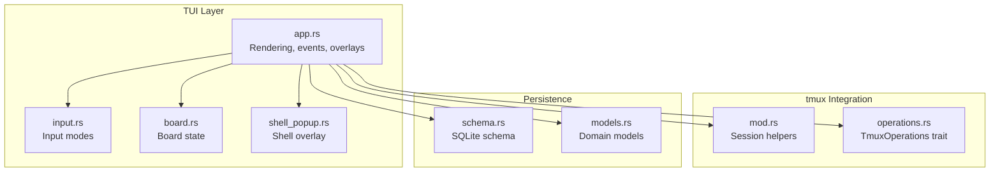
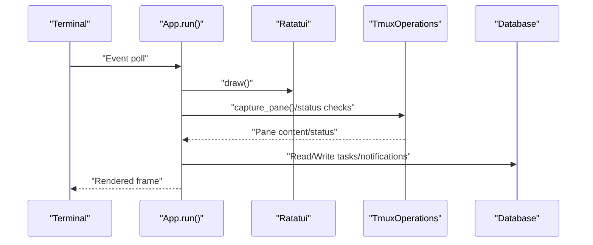
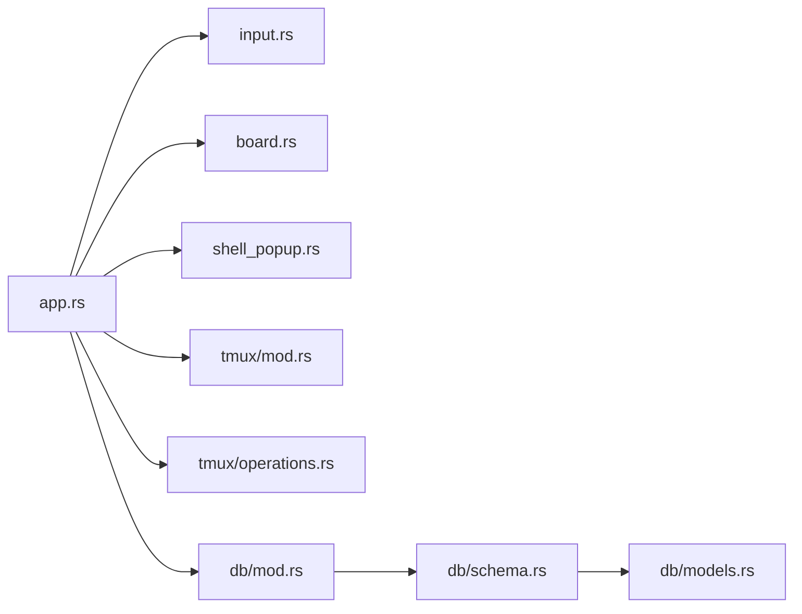

# Troubleshooting and Performance Optimization

<cite>
**Referenced Files in This Document**
- [src/tui/app.rs](file://src/tui/app.rs)
- [src/tui/input.rs](file://src/tui/input.rs)
- [src/tui/board.rs](file://src/tui/board.rs)
- [src/tui/shell_popup.rs](file://src/tui/shell_popup.rs)
- [src/tmux/mod.rs](file://src/tmux/mod.rs)
- [src/tmux/operations.rs](file://src/tmux/operations.rs)
- [src/db/mod.rs](file://src/db/mod.rs)
- [src/db/models.rs](file://src/db/models.rs)
- [src/db/schema.rs](file://src/db/schema.rs)
- [src/main.rs](file://src/main.rs)
- [Cargo.toml](file://Cargo.toml)
</cite>

## Table of Contents
1. [Introduction](#introduction)
2. [Project Structure](#project-structure)
3. [Core Components](#core-components)
4. [Architecture Overview](#architecture-overview)
5. [Detailed Component Analysis](#detailed-component-analysis)
6. [Dependency Analysis](#dependency-analysis)
7. [Performance Considerations](#performance-considerations)
8. [Troubleshooting Guide](#troubleshooting-guide)
9. [Conclusion](#conclusion)

## Introduction
This document provides comprehensive troubleshooting guidance and performance optimization strategies for the agtx terminal UI. It focuses on:
- Terminal compatibility and keyboard input issues
- Rendering glitches and layout problems
- Diagnostic tools and interpreting error messages
- Performance tuning for large task sets and constrained environments
- Session management and tmux connectivity
- Database performance tuning

## Project Structure
Agtx is a terminal-based Kanban board orchestrating AI agents within tmux sessions. The UI is built with Ratatui and Crossterm, backed by SQLite for persistence. Key areas affecting UI stability and performance:
- TUI rendering and input handling
- tmux session/window lifecycle
- Database schema and queries
- Background refresh and caching

**Diagram sources**
- [src/tui/app.rs](file://src/tui/app.rs)
- [src/tui/input.rs](file://src/tui/input.rs)
- [src/tui/board.rs](file://src/tui/board.rs)
- [src/tui/shell_popup.rs](file://src/tui/shell_popup.rs)
- [src/tmux/mod.rs](file://src/tmux/mod.rs)
- [src/tmux/operations.rs](file://src/tmux/operations.rs)
- [src/db/schema.rs](file://src/db/schema.rs)
- [src/db/models.rs](file://src/db/models.rs)

**Section sources**
- [src/tui/app.rs](file://src/tui/app.rs)
- [src/tmux/mod.rs](file://src/tmux/mod.rs)
- [src/db/schema.rs](file://src/db/schema.rs)

## Core Components
- TUI rendering and event loop: Handles drawing, input modes, overlays, and background tasks.
- tmux integration: Creates, manages, and communicates with tmux sessions/windows.
- Database: Stores tasks, projects, transition requests, and notifications.
- Shell popup: Detaches a tmux pane into a floating overlay with scrolling and ANSI parsing.

Key implementation references:
- Terminal initialization and panic safety
- Event loop and overlays
- Background refresh and caching
- Shell popup rendering and scrolling
- tmux operations and error reporting
- Database schema and migrations

**Section sources**
- [src/tui/app.rs](file://src/tui/app.rs)
- [src/tui/shell_popup.rs](file://src/tui/shell_popup.rs)
- [src/tmux/operations.rs](file://src/tmux/operations.rs)
- [src/db/schema.rs](file://src/db/schema.rs)

## Architecture Overview
The UI runs a continuous loop:
- Poll for input events (keyboard, mouse, paste)
- Draw the board and overlays
- Periodically refresh tmux session status
- Apply background results and deliver notifications

**Diagram sources**
- [src/tui/app.rs](file://src/tui/app.rs)
- [src/tmux/operations.rs](file://src/tmux/operations.rs)
- [src/db/schema.rs](file://src/db/schema.rs)

## Detailed Component Analysis

### Terminal Compatibility and Keyboard Input
Common issues:
- Non-responsive keys or unexpected behavior
- Mouse click areas not triggering actions
- Bracketed paste not applied to panes
- Terminal resizing causing layout glitches

Diagnostics:
- Verify raw mode and alternate screen are active during startup.
- Confirm mouse capture is enabled for click regions.
- Check that bracketed paste is enabled for paste events.
- Validate footer item construction and click region registration.

Remediation steps:
- Ensure terminal supports bracketed paste and mouse tracking.
- Re-enter the app to reinitialize terminal modes.
- Use the footer navigation mode (F2) to confirm item activation.
- For paste issues, rely on tmux’s load-buffer + paste-buffer mechanism.

**Section sources**
- [src/tui/app.rs](file://src/tui/app.rs)
- [src/tui/input.rs](file://src/tui/input.rs)

### Rendering Glitches and Layout Problems
Symptoms:
- Overlays not appearing or misaligned
- Scrollbars not updating
- Task cards truncated or overlapping
- Shell popup content not refreshing

Root causes:
- Off-by-one errors in computed sizes
- Incorrect click region bounds
- ANSI parsing issues in shell popup
- Cache invalidation timing

Fixes:
- Recompute visible lines and scroll offsets in the shell popup.
- Validate pane dimensions and trim content to cursor when available.
- Ensure footer items rebuild every frame and click regions are registered post-render.
- Limit visible card count per column based on available height.

**Section sources**
- [src/tui/app.rs](file://src/tui/app.rs)
- [src/tui/shell_popup.rs](file://src/tui/shell_popup.rs)

### Diagnostic Tools and Error Messages
Built-in diagnostics:
- Warning messages with auto-clear after a delay
- PR creation status popups (success/error)
- Stuck-task notifications delivered via DB
- Background refresh status and spinner frames

Interpretation:
- Warning messages indicate transient issues; they clear automatically.
- PR status popups show “Creating” vs “Pushing” vs “Success” vs “Error” states.
- Stuck-task notifications appear after 1 minute of idle time in Planning/Running phases.

Where to look:
- Warning message clearing logic and TTL.
- PR status popup rendering and error propagation.
- Stuck-task notification gating and persistence.

**Section sources**
- [src/tui/app.rs](file://src/tui/app.rs)
- [src/db/schema.rs](file://src/db/schema.rs)

### Shell Popup Behavior and tmux Pane Capture
Behavior:
- Captures pane content with history and parses ANSI.
- Supports scrolling and jumping to bottom.
- Uses cursor info to trim content to active prompt area.

Optimization tips:
- Limit history capture to a reasonable number of lines.
- Cache pane content and invalidate on size change or activity threshold.
- Trim trailing empty lines to reduce rendering overhead.

**Section sources**
- [src/tui/shell_popup.rs](file://src/tui/shell_popup.rs)
- [src/tmux/operations.rs](file://src/tmux/operations.rs)

### Session Management and tmux Connectivity
Key operations:
- Create/kill windows and sessions
- Send keys and paste text
- Capture pane content and detect cursor position
- Resize windows and check current command

Troubleshooting:
- If a task’s tmux window disappears, the app recovers by recreating sessions.
- Use safe session naming to avoid invalid characters.
- When attaching to sessions, ensure the tmux server is running.

**Section sources**
- [src/tmux/mod.rs](file://src/tmux/mod.rs)
- [src/tmux/operations.rs](file://src/tmux/operations.rs)
- [src/tui/app.rs](file://src/tui/app.rs)

### Database Performance and Tuning
Schema highlights:
- Indexed columns for tasks (status, project_id)
- Migration support for evolving schema
- Transaction batching for bulk inserts

Performance tips:
- Use batched writes for large task imports.
- Leverage indexes for frequent queries (status, project).
- Clean up old transition requests to prevent table bloat.

**Section sources**
- [src/db/schema.rs](file://src/db/schema.rs)
- [src/db/models.rs](file://src/db/models.rs)

## Dependency Analysis
High-level dependencies:
- app.rs depends on tui modules, tmux operations, and database.
- tmux operations depend on system tmux binary.
- Database schema depends on rusqlite and migrations.

**Diagram sources**
- [src/tui/app.rs](file://src/tui/app.rs)
- [src/tui/input.rs](file://src/tui/input.rs)
- [src/tui/board.rs](file://src/tui/board.rs)
- [src/tui/shell_popup.rs](file://src/tui/shell_popup.rs)
- [src/tmux/mod.rs](file://src/tmux/mod.rs)
- [src/tmux/operations.rs](file://src/tmux/operations.rs)
- [src/db/mod.rs](file://src/db/mod.rs)
- [src/db/schema.rs](file://src/db/schema.rs)
- [src/db/models.rs](file://src/db/models.rs)

**Section sources**
- [src/tui/app.rs](file://src/tui/app.rs)
- [src/tmux/operations.rs](file://src/tmux/operations.rs)
- [src/db/schema.rs](file://src/db/schema.rs)

## Performance Considerations
- Event loop cadence: The app polls events with a short timeout and draws each iteration. On constrained terminals, reduce unnecessary overlays and long lists.
- Background refresh: A background thread periodically checks tmux phase status with a 2-second cache TTL. Avoid spawning multiple concurrent refresh threads.
- Shell popup capture: Limit history lines and cache pane content. Invalidate cache on size changes.
- Database writes: Batch updates for large imports. Use transactions to minimize fsync overhead.
- Rendering: Compute visible lines and scroll offsets efficiently; avoid re-parsing ANSI on every frame.

[No sources needed since this section provides general guidance]

## Troubleshooting Guide

### Terminal Compatibility Issues
- Symptoms: Keys not recognized, mouse clicks ignored, paste not applied.
- Checks:
  - Confirm raw mode and alternate screen are active at startup.
  - Verify bracketed paste and mouse capture are enabled.
  - Ensure terminal supports required features (e.g., 256-color mode).
- Actions:
  - Restart the app to reinitialize terminal modes.
  - Try a different terminal emulator if issues persist.
  - Use bracketed paste mode in your terminal settings.

**Section sources**
- [src/tui/app.rs](file://src/tui/app.rs)

### Keyboard Input Problems
- Symptoms: Unexpected key behavior, overlay not responding, F2 navigation not working.
- Checks:
  - Validate input mode transitions and key dispatch logic.
  - Confirm footer items are rebuilt each frame and mapped to KeyEvents.
- Actions:
  - Re-enter the overlay to reset input mode.
  - Use F2 navigation to focus footer items and press Enter to activate.

**Section sources**
- [src/tui/input.rs](file://src/tui/input.rs)
- [src/tui/app.rs](file://src/tui/app.rs)

### Rendering Glitches
- Symptoms: Overlays misaligned, truncated cards, incorrect scrollbars.
- Checks:
  - Inspect computed visible lines and scroll offsets in the shell popup.
  - Verify click region bounds and footer item widths.
  - Confirm pane dimensions and content trimming logic.
- Actions:
  - Reduce terminal font size or increase terminal height to fit overlays.
  - Close overlays to free space for the board.
  - Resize terminal to trigger pane dimension recalculation.

**Section sources**
- [src/tui/app.rs](file://src/tui/app.rs)
- [src/tui/shell_popup.rs](file://src/tui/shell_popup.rs)

### Diagnostic Tools and Error Messages
- Warning messages: Appear temporarily in the footer; auto-clear after a delay.
- PR status popups: Show progress and error details for pull request operations.
- Stuck-task notifications: Sent after 1 minute of idle time in Planning/Running phases.
- Actions:
  - Dismiss warnings and retry the operation.
  - For PR errors, inspect the error message and fix underlying issues (e.g., credentials, branch protection).
  - Investigate stuck tasks and escalate if necessary.

**Section sources**
- [src/tui/app.rs](file://src/tui/app.rs)
- [src/db/schema.rs](file://src/db/schema.rs)

### Performance Optimization Techniques
- Large task sets:
  - Prefer filtering and search popups to reduce visible workload.
  - Use column-based navigation to limit per-column rendering.
- Slow terminals:
  - Minimize overlay usage; close popups to reduce redraw cost.
  - Avoid excessive scrolling in the shell popup; jump to bottom when needed.
- Resource-constrained systems:
  - Reduce background refresh frequency by allowing cache TTL to stabilize.
  - Use transaction batching for database writes.
  - Limit history capture lines in the shell popup.

**Section sources**
- [src/tui/app.rs](file://src/tui/app.rs)
- [src/tui/shell_popup.rs](file://src/tui/shell_popup.rs)
- [src/db/schema.rs](file://src/db/schema.rs)

### Session Management and tmux Connectivity
- Symptoms: Lost tmux windows, inability to attach, stale session references.
- Checks:
  - Verify tmux server availability and session existence.
  - Confirm window creation and pane capture succeed.
- Actions:
  - Recreate missing windows for Planning/Running/Review tasks.
  - Use safe session naming to avoid invalid characters.
  - Ensure tmux server is running and accessible.

**Section sources**
- [src/tmux/mod.rs](file://src/tmux/mod.rs)
- [src/tmux/operations.rs](file://src/tmux/operations.rs)
- [src/tui/app.rs](file://src/tui/app.rs)

### Database Performance Tuning
- Indexes: Ensure queries leverage status and project_id indexes.
- Migrations: Apply schema migrations to keep tables optimized.
- Cleanup: Remove old transition requests to maintain performance.
- Bulk operations: Use batched inserts for large datasets.

**Section sources**
- [src/db/schema.rs](file://src/db/schema.rs)
- [src/db/models.rs](file://src/db/models.rs)

## Conclusion
By understanding the TUI event loop, tmux integration, and database schema, you can effectively troubleshoot UI issues and optimize performance. Focus on terminal compatibility, efficient rendering, controlled background refresh, and robust tmux session management. Use the built-in diagnostics to quickly identify and resolve transient issues, and tune database operations for large-scale workloads.