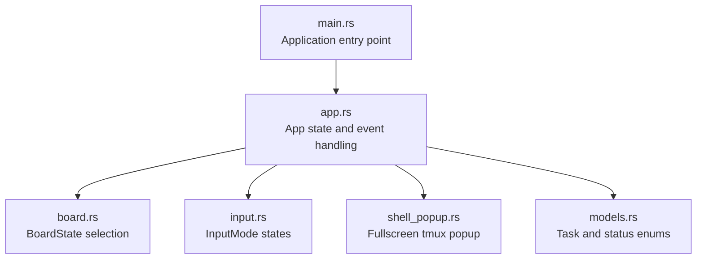
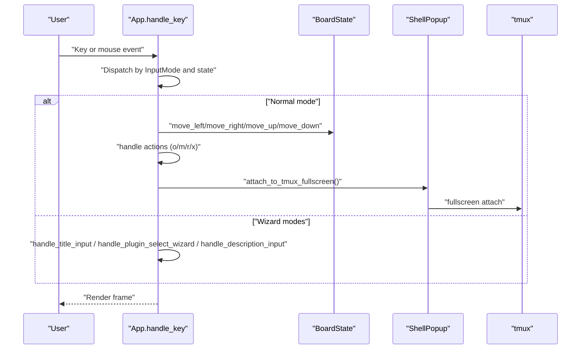
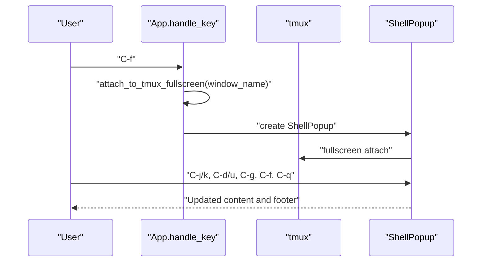
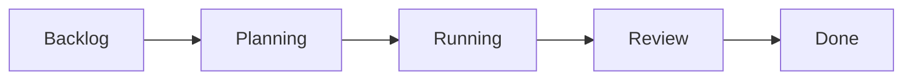
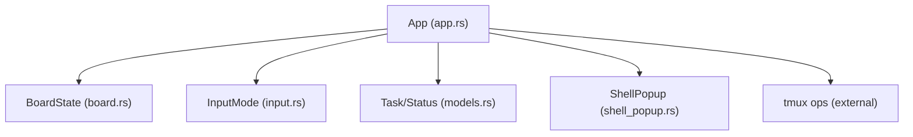

# User Interface Guide

<cite>
**Referenced Files in This Document**
- [app.rs](file://src/tui/app.rs)
- [board.rs](file://src/tui/board.rs)
- [input.rs](file://src/tui/input.rs)
- [shell_popup.rs](file://src/tui/shell_popup.rs)
- [models.rs](file://src/db/models.rs)
- [main.rs](file://src/main.rs)
</cite>

## Table of Contents
1. [Introduction](#introduction)
2. [Project Structure](#project-structure)
3. [Core Components](#core-components)
4. [Architecture Overview](#architecture-overview)
5. [Detailed Component Analysis](#detailed-component-analysis)
6. [Dependency Analysis](#dependency-analysis)
7. [Performance Considerations](#performance-considerations)
8. [Troubleshooting Guide](#troubleshooting-guide)
9. [Conclusion](#conclusion)
10. [Appendices](#appendices)

## Introduction
This guide documents the terminal-based Kanban board user interface for agtx. It explains keyboard shortcuts, navigation patterns, the task creation wizard, task management features, fullscreen tmux attachment, inline task popup for session monitoring, visual indicators, troubleshooting, performance tips, accessibility, and customization options.

## Project Structure
The TUI is implemented with a terminal UI library and a state machine that renders a Kanban board, manages input modes, and integrates with tmux sessions and database-backed tasks.

**Diagram sources**
- [main.rs:16-96](file://src/main.rs#L16-L96)
- [app.rs:744-747](file://src/tui/app.rs#L744-L747)
- [board.rs:3-99](file://src/tui/board.rs#L3-L99)
- [input.rs:1-19](file://src/tui/input.rs#L1-L19)
- [shell_popup.rs:1-326](file://src/tui/shell_popup.rs#L1-L326)
- [models.rs:5-245](file://src/db/models.rs#L5-L245)

**Section sources**
- [main.rs:16-96](file://src/main.rs#L16-L96)
- [app.rs:744-747](file://src/tui/app.rs#L744-L747)

## Core Components
- App: Central state container holding UI state, rendering logic, and event handling.
- BoardState: Tracks selected column and row for Kanban navigation.
- InputMode: Wizard and input states for task creation and editing.
- ShellPopup: Fullscreen tmux session viewer with scrolling and status footer.
- Models: Task and status enums backing the board and transitions.

**Section sources**
- [app.rs:448-560](file://src/tui/app.rs#L448-L560)
- [board.rs:3-99](file://src/tui/board.rs#L3-L99)
- [input.rs:1-19](file://src/tui/input.rs#L1-L19)
- [shell_popup.rs:4-57](file://src/tui/shell_popup.rs#L4-L57)
- [models.rs:58-133](file://src/db/models.rs#L58-L133)

## Architecture Overview
The TUI runs in raw terminal mode, renders frames with a layout engine, and reacts to keyboard and mouse events. The App maintains state for the board, input modes, popups, and tmux integration. Rendering is split into board, footer, and popup areas.

**Diagram sources**
- [app.rs:2729-2861](file://src/tui/app.rs#L2729-L2861)
- [board.rs:52-81](file://src/tui/board.rs#L52-L81)
- [shell_popup.rs:246-325](file://src/tui/shell_popup.rs#L246-L325)

## Detailed Component Analysis

### Keyboard Shortcuts and Navigation Patterns
- Column movement:
  - h or left arrow: move selection left
  - l or right arrow: move selection right
- Task navigation within a column:
  - j or down arrow: move selection down
  - k or up arrow: move selection up
- Action keys (Normal mode):
  - o: create task (opens title input wizard)
  - m: move task right (advance status)
  - r: move task left (return to previous status)
  - x: delete task (opens confirmation)
  - d: show git diff popup
  - /: open task search
  - C-f: fullscreen attach to tmux session (when applicable)
  - e: toggle sidebar visibility
  - q: quit
- Footer keyboard navigation:
  - F2: toggle footer item navigation mode
  - Arrow keys or h/l: switch between footer actions
  - Enter: activate selected footer action
  - Esc: exit footer navigation mode

Notes:
- Footer items vary by selected column and state (e.g., “run”, “done”, “resume”, “next phase” appear conditionally).
- Sidebar-focused mode changes available actions.

**Section sources**
- [app.rs:65-199](file://src/tui/app.rs#L65-L199)
- [app.rs:254-294](file://src/tui/app.rs#L254-L294)
- [app.rs:2729-2777](file://src/tui/app.rs#L2729-L2777)
- [board.rs:52-81](file://src/tui/board.rs#L52-L81)

### Task Creation Wizard Workflow
The wizard proceeds through three input modes:

1) Title entry (InputTitle)
- Enter: proceed to plugin selection
- Esc: cancel

2) Plugin selection (SelectPlugin)
- j/k or arrows: select plugin
- Tab: cycle plugin options
- Enter: confirm selection and proceed
- Esc: cancel

3) Description/prompt composition (InputDescription)
- # : insert file references
- / : insert skill references
- ! : insert task references
- Esc: cancel
- Enter: save and create task

Inline reference insertion supports:
- File references: typed after a trigger character to choose files
- Skill references: typed after a trigger character to choose skills
- Task references: typed after a trigger character to choose tasks

Footer hints:
- “Enter task title... [Esc] cancel [Enter] next”
- “[j/k] select plugin [Tab] cycle [Enter] next [Esc] cancel”
- “[#] files [/] skills [!] tasks [Esc] cancel [+Enter] newline [Enter] save”

**Section sources**
- [input.rs:2-12](file://src/tui/input.rs#L2-L12)
- [app.rs:180-197](file://src/tui/app.rs#L180-L197)
- [app.rs:2856-2859](file://src/tui/app.rs#L2856-L2859)

### Task Management Interface
- Task details view:
  - Opened via Enter on a selected task
  - Shows description, agent, plugin, PR info, referenced tasks, escalation notes, and timestamps
- Agent session monitoring:
  - Inline ShellPopup shows live tmux output
  - Footer indicates scroll position and keybindings
  - Escalation banners highlight important notices
- Search functionality:
  - Task search popup allows filtering tasks by title/status
  - File/skill/task reference search dropdowns support quick insertion

**Section sources**
- [app.rs:3243-3247](file://src/tui/app.rs#L3243-L3247)
- [shell_popup.rs:118-128](file://src/tui/shell_popup.rs#L118-L128)
- [shell_popup.rs:246-325](file://src/tui/shell_popup.rs#L246-L325)

### Fullscreen tmux Attachment and Inline Popup
- Fullscreen attachment:
  - C-f in Normal mode attaches to the selected task’s tmux session
  - Opens a fullscreen tmux window inside the terminal
- Inline popup:
  - Scroll controls: C-j/C-k scroll line-by-line
  - Page controls: C-d/C-u page up/down
  - Bottom: C-g jump to bottom
  - Close: C-q
  - Footer shows current line or “At bottom” indicator

**Diagram sources**
- [app.rs:2842-2853](file://src/tui/app.rs#L2842-L2853)
- [shell_popup.rs:246-325](file://src/tui/shell_popup.rs#L246-L325)

**Section sources**
- [app.rs:2842-2853](file://src/tui/app.rs#L2842-L2853)
- [shell_popup.rs:33-56](file://src/tui/shell_popup.rs#L33-L56)
- [shell_popup.rs:118-128](file://src/tui/shell_popup.rs#L118-L128)

### Visual Indicators
- Spinner states for active tasks:
  - Animated spinner indicates ongoing work in the tmux pane
- Checkmarks for completed phases:
  - Visual markers indicate phase readiness
- Pause icons for idle agents:
  - Indicates waiting/idle status

These are part of the rendering pipeline and footer indicators managed by the App and ShellPopup.

**Section sources**
- [app.rs:522-529](file://src/tui/app.rs#L522-L529)
- [shell_popup.rs:118-128](file://src/tui/shell_popup.rs#L118-L128)

### Task Status and Columns
The Kanban board organizes tasks across ordered columns reflecting lifecycle stages.

**Diagram sources**
- [models.rs:47-56](file://src/db/models.rs#L47-L56)

**Section sources**
- [models.rs:58-133](file://src/db/models.rs#L58-L133)
- [board.rs:20-33](file://src/tui/board.rs#L20-L33)

## Dependency Analysis
The TUI depends on:
- Terminal rendering (via a terminal UI framework)
- tmux operations for session attachment
- Database-backed models for tasks and statuses
- Input modes coordinating the wizard and normal operation

**Diagram sources**
- [app.rs:20-28](file://src/tui/app.rs#L20-L28)
- [board.rs:1-99](file://src/tui/board.rs#L1-L99)
- [input.rs:1-19](file://src/tui/input.rs#L1-L19)
- [models.rs:58-133](file://src/db/models.rs#L58-L133)
- [shell_popup.rs:1-326](file://src/tui/shell_popup.rs#L1-L326)

**Section sources**
- [app.rs:20-28](file://src/tui/app.rs#L20-L28)

## Performance Considerations
- Minimize redraws:
  - Use incremental updates and avoid unnecessary full re-renders
- Efficient tmux pane capture:
  - Cache pane content and update only when content changes
  - Trim trailing empty lines to reduce rendering overhead
- Footer navigation:
  - Keep footer rebuilds minimal; reuse computed items when possible
- Background refresh:
  - Poll phase status and session changes asynchronously to avoid blocking the UI

[No sources needed since this section provides general guidance]

## Troubleshooting Guide
Common UI issues and resolutions:
- Keys not responding:
  - Ensure raw mode is active and the terminal supports the keys
  - Verify no conflicting popups are intercepting input
- Footer navigation not working:
  - Press F2 to toggle footer navigation mode
  - Confirm no modal popup is active
- Fullscreen tmux attach fails:
  - Confirm the task has a valid session name
  - Ensure tmux is installed and accessible
- Scroll in ShellPopup appears off:
  - Use C-g to jump to bottom
  - Adjust scroll offsets incrementally with C-j/k
- Reference insertion not appearing:
  - Trigger the appropriate character (#, /, !) and select from the dropdown
- Task moves unexpectedly:
  - Confirm move confirm popups are acknowledged
  - Use r to move back if needed

**Section sources**
- [app.rs:2729-2777](file://src/tui/app.rs#L2729-L2777)
- [app.rs:2842-2853](file://src/tui/app.rs#L2842-L2853)
- [shell_popup.rs:33-56](file://src/tui/shell_popup.rs#L33-L56)

## Conclusion
The agtx TUI provides a fast, keyboard-centric Kanban interface with a guided task creation wizard, robust tmux integration, and contextual popups. By leveraging column and task navigation, footer-driven actions, and inline session monitoring, users can efficiently orchestrate AI-assisted development workflows directly in the terminal.

[No sources needed since this section summarizes without analyzing specific files]

## Appendices

### Accessibility Considerations
- Keyboard-first design:
  - All actions are reachable via keyboard; mouse is optional
- Footer navigation:
  - F2 toggles keyboard navigation of footer actions
- Contrast and readability:
  - Use theme-aware colors for borders, headers, and footers
- Terminal compatibility:
  - Requires a modern terminal supporting extended keys and colors

**Section sources**
- [app.rs:65-199](file://src/tui/app.rs#L65-L199)
- [shell_popup.rs:214-237](file://src/tui/shell_popup.rs#L214-L237)

### Customization Options
- Theme colors:
  - Customize border, header, footer, and escalation colors for the ShellPopup
- Footer labels:
  - Footer items are dynamically generated; behavior can be influenced by state and configuration
- Fullscreen behavior:
  - Toggle fullscreen attachment via C-f depending on configuration

**Section sources**
- [shell_popup.rs:214-237](file://src/tui/shell_popup.rs#L214-L237)
- [app.rs:59-199](file://src/tui/app.rs#L59-L199)