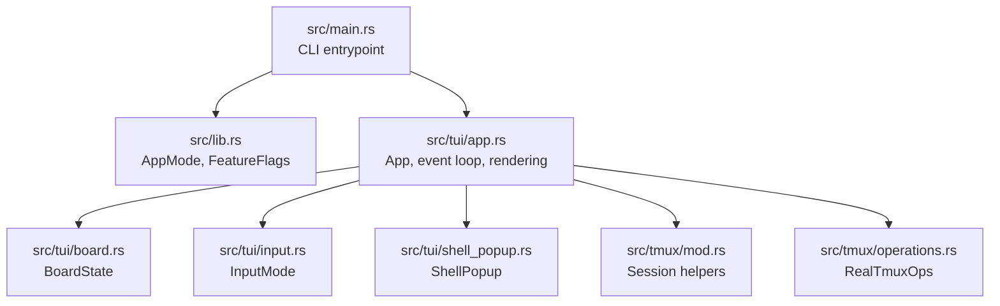
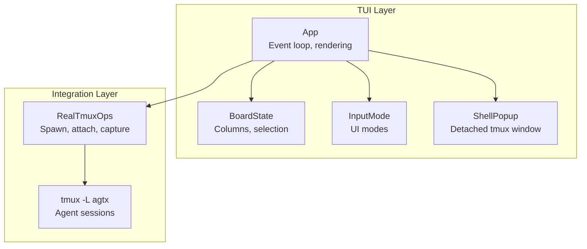
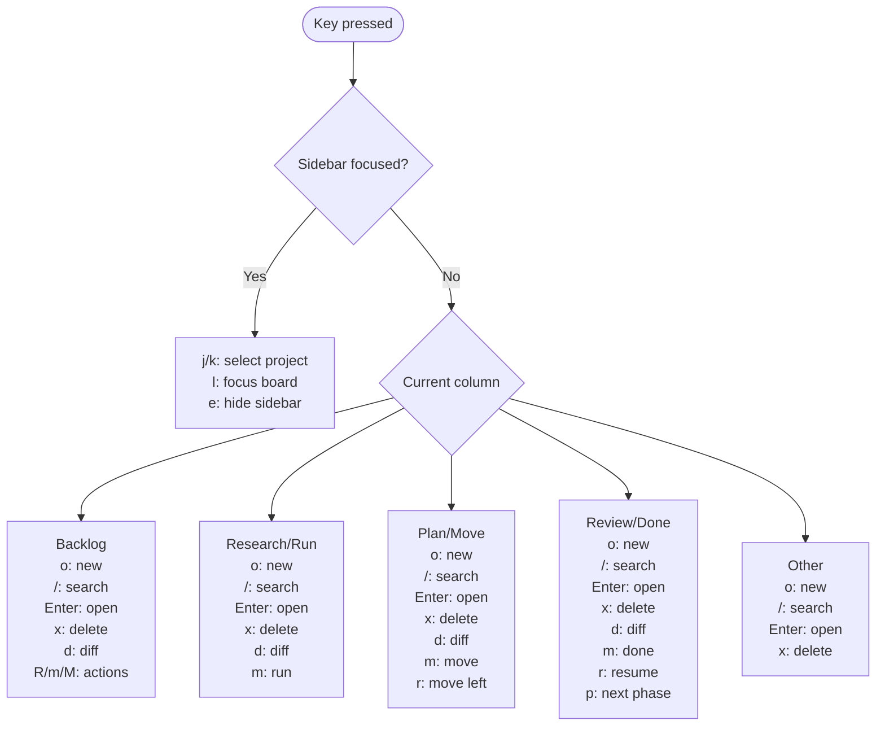
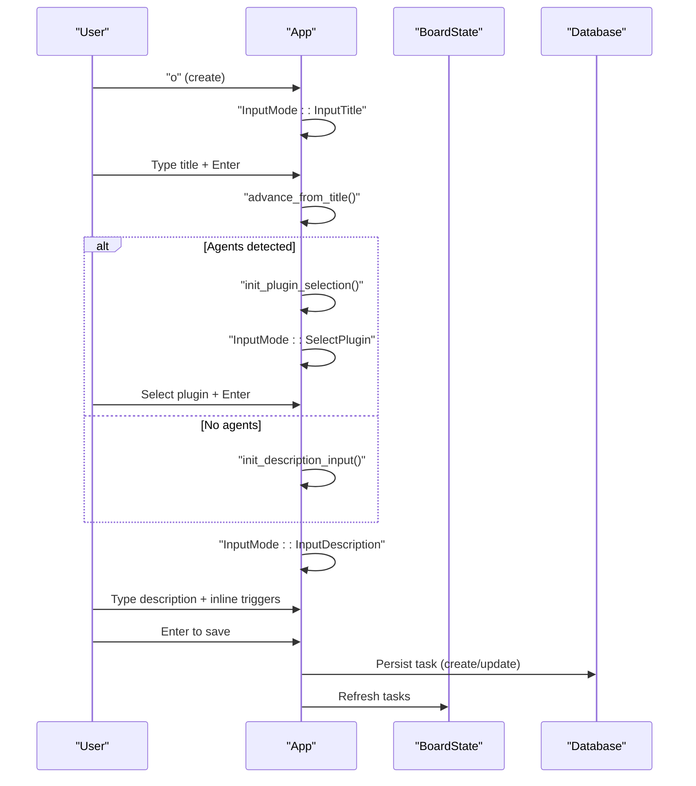
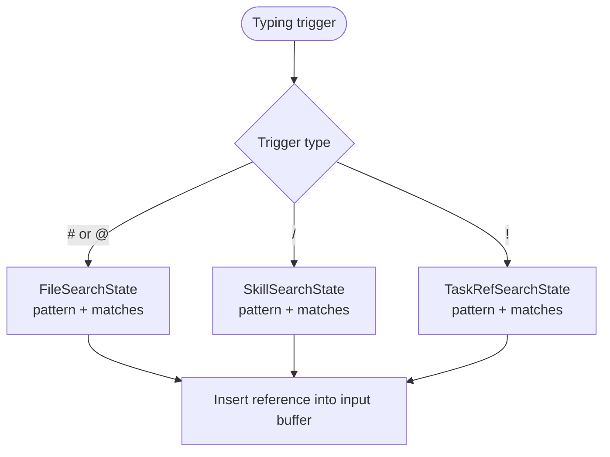
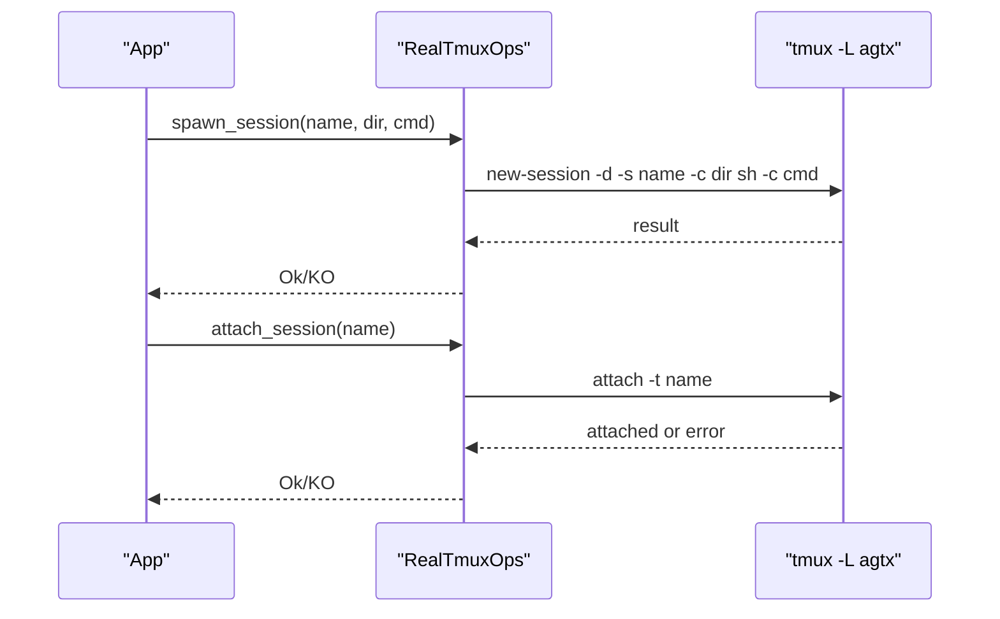
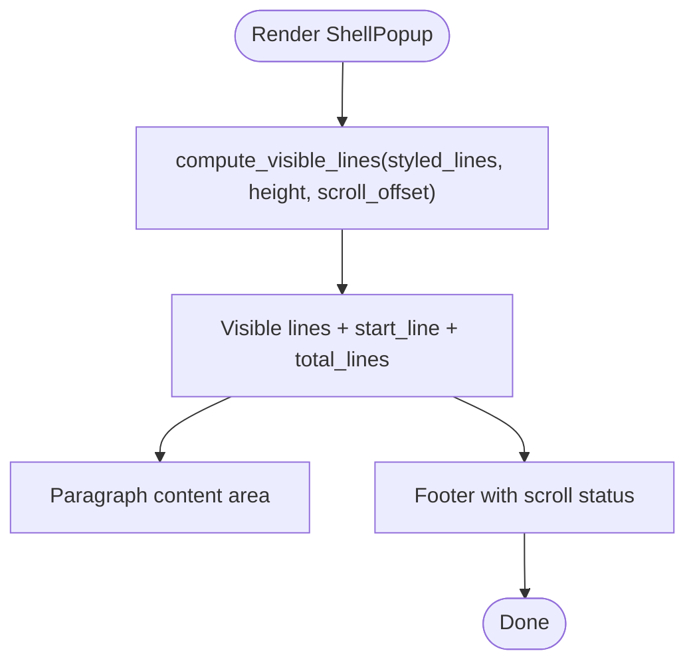
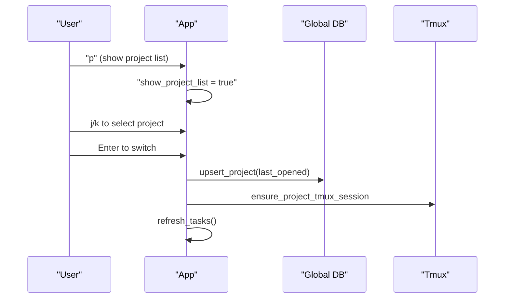
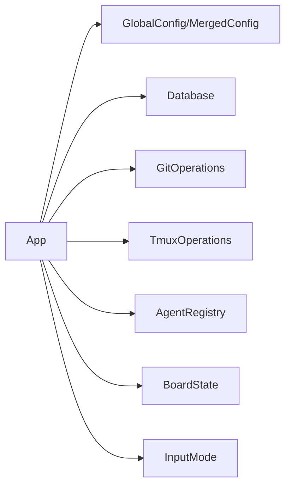

# User Interface Guide

<cite>
**Referenced Files in This Document**
- [main.rs](file://src/main.rs)
- [lib.rs](file://src/lib.rs)
- [app.rs](file://src/tui/app.rs)
- [board.rs](file://src/tui/board.rs)
- [input.rs](file://src/tui/input.rs)
- [shell_popup.rs](file://src/tui/shell_popup.rs)
- [mod.rs](file://src/tmux/mod.rs)
- [operations.rs](file://src/tmux/operations.rs)
</cite>

## Table of Contents
1. [Introduction](#introduction)
2. [Project Structure](#project-structure)
3. [Core Components](#core-components)
4. [Architecture Overview](#architecture-overview)
5. [Detailed Component Analysis](#detailed-component-analysis)
6. [Dependency Analysis](#dependency-analysis)
7. [Performance Considerations](#performance-considerations)
8. [Troubleshooting Guide](#troubleshooting-guide)
9. [Conclusion](#conclusion)
10. [Appendices](#appendices)

## Introduction
This guide documents the AGTX terminal user interface (TUI) built with Ratatui. It focuses on the kanban board layout, keyboard navigation, task operations, the task creation wizard, inline editor features, tmux integration, project switching, and practical workflows. The goal is to help both new and experienced users operate the application efficiently and troubleshoot common issues.

## Project Structure
The TUI lives under the tui module and integrates with tmux for agent sessions and shells. The main entry point initializes the application and delegates to the TUI runtime.

**Diagram sources**
- [main.rs:16-96](file://src/main.rs#L16-L96)
- [lib.rs:12-24](file://src/lib.rs#L12-L24)
- [app.rs:501-504](file://src/tui/app.rs#L501-L504)
- [board.rs:4-9](file://src/tui/board.rs#L4-L9)
- [input.rs:2-12](file://src/tui/input.rs#L2-L12)
- [shell_popup.rs:4-18](file://src/tui/shell_popup.rs#L4-L18)
- [mod.rs:11-165](file://src/tmux/mod.rs#L11-L165)
- [operations.rs:178-248](file://src/tmux/operations.rs#L178-L248)

**Section sources**
- [main.rs:16-96](file://src/main.rs#L16-L96)
- [lib.rs:12-24](file://src/lib.rs#L12-L24)

## Core Components
- App: Initializes terminal, loads configuration, sets up tmux sessions, runs the event loop, and renders UI.
- BoardState: Tracks tasks and selection within the kanban board’s columns.
- InputMode: Controls the current input state (normal, title input, plugin selection, description input).
- ShellPopup: Manages a detached tmux window rendered in a popup overlay.
- Tmux integration: Spawns, attaches, resizes, captures panes, and monitors sessions.

**Section sources**
- [app.rs:501-504](file://src/tui/app.rs#L501-L504)
- [board.rs:4-9](file://src/tui/board.rs#L4-L9)
- [input.rs:2-12](file://src/tui/input.rs#L2-L12)
- [shell_popup.rs:4-18](file://src/tui/shell_popup.rs#L4-L18)
- [mod.rs:11-165](file://src/tmux/mod.rs#L11-L165)

## Architecture Overview
The TUI composes a terminal-backed UI with a tmux-backed agent orchestration layer. The App manages state, renders the board and popups, and routes keyboard events to appropriate handlers. Tmux operations are abstracted behind traits for testability and real execution.

**Diagram sources**
- [app.rs:38-86](file://src/tui/app.rs#L38-L86)
- [board.rs:11-92](file://src/tui/board.rs#L11-L92)
- [input.rs:2-12](file://src/tui/input.rs#L2-L12)
- [shell_popup.rs:246-325](file://src/tui/shell_popup.rs#L246-L325)
- [operations.rs:178-248](file://src/tmux/operations.rs#L178-L248)
- [mod.rs:11-165](file://src/tmux/mod.rs#L11-L165)

## Detailed Component Analysis

### Kanban Board Layout and Navigation
The board displays tasks across workflow columns. Selection moves with arrow keys, and navigation differs depending on the focused area (board vs. sidebar).

- Columns: The board enumerates columns by status order. Selection is clamped to the current column’s task count.
- Movement:
  - Left/right: Move selection between columns.
  - Up/down: Move within the current column.
- Sidebar focus:
  - When the sidebar is focused, j/k navigates projects; l switches focus back to the board; e hides the sidebar.

**Diagram sources**
- [app.rs:38-86](file://src/tui/app.rs#L38-L86)
- [board.rs:52-91](file://src/tui/board.rs#L52-L91)

**Section sources**
- [board.rs:11-92](file://src/tui/board.rs#L11-L92)
- [app.rs:38-86](file://src/tui/app.rs#L38-L86)

### Keyboard Shortcuts Reference
- Navigation
  - h/j/k/l arrows: move selection within the board; j/k also navigate the project list when the sidebar is focused.
  - l: switch focus from sidebar to board.
  - e: toggle sidebar visibility.
  - q: quit the application.
- Task Operations
  - o: create a new task (opens the wizard).
  - x: delete the selected task.
  - Enter: open task details or confirm selections.
  - d: open a diff view for the selected task.
  - m: move task right (advance phase).
  - r: move task left (reverse phase).
  - R: initiate research phase.
  - M: run agent on the selected task.
- Advanced Features
  - C-f: enter fullscreen mode for the board.
  - P: open plugin selection during task creation.
  - O: toggle the orchestrator agent (experimental).
  - Ctrl+j/k: scroll within the shell popup.
  - Ctrl+d/u: page scroll within the shell popup.
  - Ctrl+g: jump to bottom within the shell popup.
  - Ctrl+q: close the shell popup.

**Section sources**
- [app.rs:38-86](file://src/tui/app.rs#L38-L86)
- [shell_popup.rs:118-128](file://src/tui/shell_popup.rs#L118-L128)

### Task Creation Wizard
The wizard guides you through three steps:
1. Title input: Enter the task title; press Enter to continue.
2. Plugin selection: Choose a workflow plugin; use j/k to select and Tab to cycle; press Enter to proceed.
3. Description input: Add a description and references; use inline triggers to insert files, skills, and task references.

Inline editor features:
- Insert file references: Type # or @ to trigger file search; select a file to insert a reference.
- Insert agent skills: Type / at the start of the buffer or after whitespace to trigger skill search; select a skill to insert.
- Insert task references: Type ! to trigger task reference search; select a task to insert a reference.
- Save: Press Enter to finalize and create or update the task.

**Diagram sources**
- [app.rs:4149-4162](file://src/tui/app.rs#L4149-L4162)
- [app.rs:4059-4106](file://src/tui/app.rs#L4059-L4106)
- [app.rs:4108-4134](file://src/tui/app.rs#L4108-L4134)
- [app.rs:4036-4057](file://src/tui/app.rs#L4036-L4057)

**Section sources**
- [app.rs:4036-4162](file://src/tui/app.rs#L4036-L4162)
- [input.rs:2-12](file://src/tui/input.rs#L2-L12)

### Inline Editor: File References, Agent Skills, Task Dependencies
- File references: Typing # or @ opens a file search dropdown; choose a file to insert a reference into the description.
- Agent skills: Typing / at the start of the buffer or after a space opens a skill search dropdown; choose a skill to insert.
- Task references: Typing ! opens a task reference search dropdown; choose a task to insert a reference.
- Highlighting: References inserted via these mechanisms are tracked for highlighting.

**Diagram sources**
- [app.rs:3850-3880](file://src/tui/app.rs#L3850-L3880)
- [app.rs:3871-3881](file://src/tui/app.rs#L3871-L3881)
- [app.rs:3860-3870](file://src/tui/app.rs#L3860-L3870)

**Section sources**
- [app.rs:3850-3881](file://src/tui/app.rs#L3850-L3881)

### Tmux Integration
AGTX uses a dedicated tmux server named “agtx” to manage agent sessions. Key capabilities:
- Spawn sessions: Launch agent sessions with working directories and commands.
- Attach sessions: Directly attach to a session from anywhere, toggling between nested and window-switch modes.
- Resize windows: Dynamically resize windows to fit content.
- Capture panes: Retrieve recent output for rendering in the shell popup.
- Monitor sessions: Track pane content hashes and idle states for notifications.

**Diagram sources**
- [mod.rs:15-48](file://src/tmux/mod.rs#L15-L48)
- [operations.rs:203-248](file://src/tmux/operations.rs#L203-L248)

**Section sources**
- [mod.rs:11-165](file://src/tmux/mod.rs#L11-L165)
- [operations.rs:178-248](file://src/tmux/operations.rs#L178-L248)

### Shell Popup: Detached Tmux Window
The shell popup renders a detached tmux window inside the TUI. It supports:
- Scrolling: Up/down and page controls; jump to bottom.
- History trimming: Keeps trailing empty lines minimal; trims to cursor when applicable.
- Footer indicators: Shows scroll position and key hints.

**Diagram sources**
- [shell_popup.rs:69-116](file://src/tui/shell_popup.rs#L69-L116)
- [shell_popup.rs:246-325](file://src/tui/shell_popup.rs#L246-L325)

**Section sources**
- [shell_popup.rs:20-57](file://src/tui/shell_popup.rs#L20-L57)
- [shell_popup.rs:69-128](file://src/tui/shell_popup.rs#L69-L128)

### Project Sidebar and Switching Between Repositories
- Toggle sidebar: Press e to show/hide the project list.
- Navigate projects: Use j/k to move the cursor; Enter to switch to the selected project.
- Quick switch: Press n to switch to the current directory if it is a git repository.
- Project list: Press p to open the project list overlay; Esc to close.

**Diagram sources**
- [app.rs:3219-3253](file://src/tui/app.rs#L3219-L3253)
- [app.rs:6351-6387](file://src/tui/app.rs#L6351-L6387)

**Section sources**
- [app.rs:3219-3253](file://src/tui/app.rs#L3219-L3253)
- [app.rs:6351-6387](file://src/tui/app.rs#L6351-L6387)

### Practical Workflows

- Create a task
  - Press o, enter a title, optionally select a plugin, add a description and references, then save.
- Move a task through phases
  - Select the task, press m to move right (advance), r to move left (reverse), or p to cycle phases when supported.
- Manage multiple projects
  - Press p to open the project list, navigate with j/k, and press Enter to switch.
- Open task popups and monitor agent activity
  - Press Enter on a task to open details; use the shell popup to monitor agent output; scroll with Ctrl+j/k and page with Ctrl+d/u.

[No sources needed since this section aggregates previously analyzed functionality]

## Dependency Analysis
The TUI depends on configuration, database, git, tmux, and agent registries. The App holds injectable operations for tmux, git, and agents to support testing and flexibility.

**Diagram sources**
- [app.rs:17-29](file://src/tui/app.rs#L17-L29)
- [app.rs:573-640](file://src/tui/app.rs#L573-L640)

**Section sources**
- [app.rs:17-29](file://src/tui/app.rs#L17-L29)
- [app.rs:573-640](file://src/tui/app.rs#L573-L640)

## Performance Considerations
- Large boards
  - Minimize frequent redraws by batching updates and refreshing tasks only when necessary.
  - Use column-aware selection to avoid scanning all tasks when moving within a column.
- Shell popup scrolling
  - Trim trailing empty lines and cursor-aware trimming reduce memory overhead and improve rendering speed.
- Background monitoring
  - Use non-blocking channels for tmux session refresh to avoid blocking the UI thread.
- Tmux capture
  - Limit captured lines to a reasonable number and reuse cached content when possible.

[No sources needed since this section provides general guidance]

## Troubleshooting Guide
- Tmux server not found
  - Ensure the “agtx” tmux server is available. The application spawns sessions under this server; if missing, operations may fail.
- Session window missing
  - If a task’s tmux window disappears (e.g., after a crash), the application recovers by recreating sessions. A warning message appears if the window is missing.
- Shell popup not updating
  - Verify pane dimensions and cursor info are being captured; ensure the pane is resized appropriately.
- Fullscreen mode issues
  - On Enter, the UI may offer C-f to toggle fullscreen; ensure terminal supports alternate screen and bracketed paste.
- Plugin selection not appearing
  - If no agents are detected, the wizard skips plugin selection and proceeds directly to description input.

**Section sources**
- [operations.rs:231-248](file://src/tmux/operations.rs#L231-L248)
- [app.rs:5774-5782](file://src/tui/app.rs#L5774-L5782)
- [shell_popup.rs:142-211](file://src/tui/shell_popup.rs#L142-L211)
- [app.rs:38-86](file://src/tui/app.rs#L38-L86)
- [app.rs:4151-4155](file://src/tui/app.rs#L4151-L4155)

## Conclusion
The AGTX TUI provides a fast, terminal-native way to manage tasks, orchestrate agents via tmux, and monitor progress through a kanban board. By mastering the keyboard shortcuts, the task creation wizard, and tmux integration, you can streamline development workflows across multiple repositories.

[No sources needed since this section summarizes without analyzing specific files]

## Appendices

### Appendix A: Keyboard Shortcuts Summary
- Navigation: h/j/k/l, j/k in sidebar, l to focus board, e to toggle sidebar, q to quit.
- Task operations: o (create), x (delete), Enter (open/save), d (diff), m (move right), r (move left), R (research), M (run).
- Advanced: C-f (fullscreen), P (plugin selection), O (toggle orchestrator).
- Shell popup: Ctrl+j/k (scroll), Ctrl+d/u (page), Ctrl+g (bottom), Ctrl+q (close).

**Section sources**
- [app.rs:38-86](file://src/tui/app.rs#L38-L86)
- [shell_popup.rs:118-128](file://src/tui/shell_popup.rs#L118-L128)