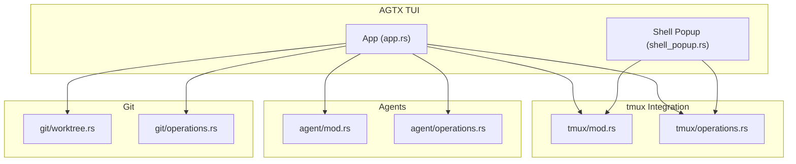
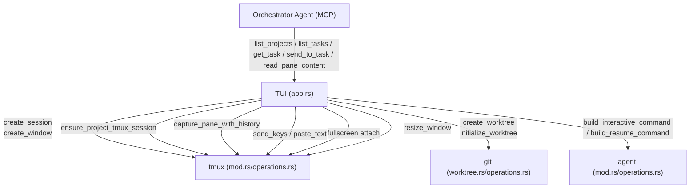
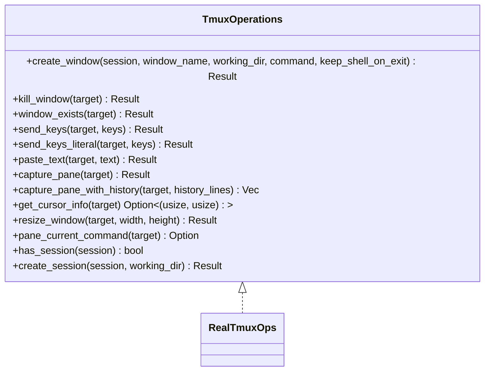
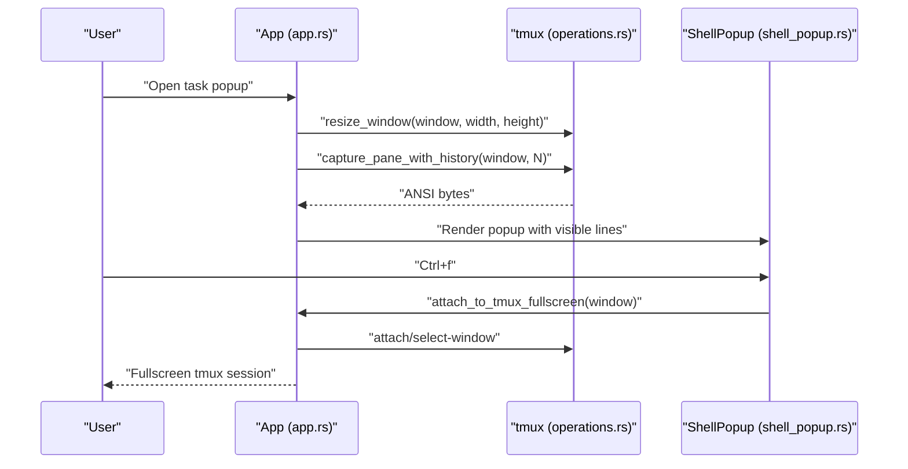
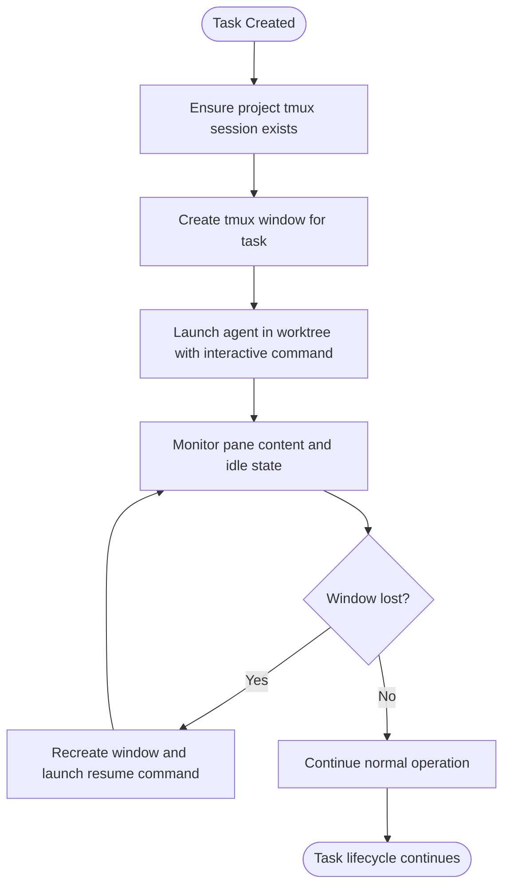
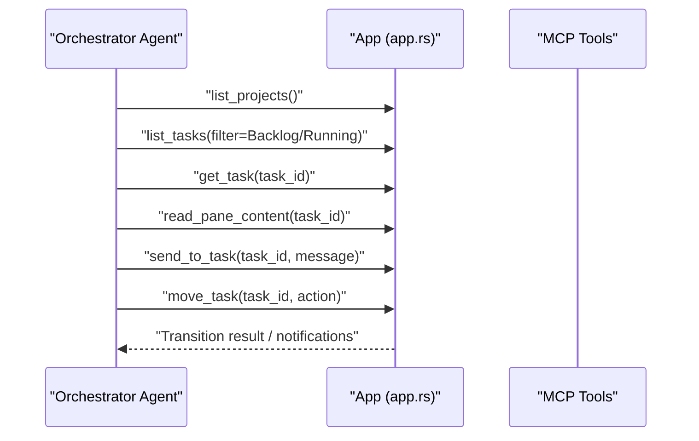
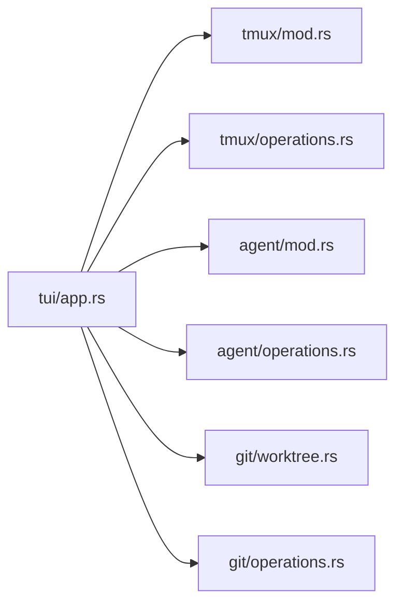

# tmux Integration and Sessions

<cite>
**Referenced Files in This Document**
- [src/tmux/mod.rs](file://src/tmux/mod.rs)
- [src/tmux/operations.rs](file://src/tmux/operations.rs)
- [src/tui/app.rs](file://src/tui/app.rs)
- [src/tui/shell_popup.rs](file://src/tui/shell_popup.rs)
- [src/agent/mod.rs](file://src/agent/mod.rs)
- [src/agent/operations.rs](file://src/agent/operations.rs)
- [src/git/worktree.rs](file://src/git/worktree.rs)
- [src/git/operations.rs](file://src/git/operations.rs)
- [src/lib.rs](file://src/lib.rs)
- [src/main.rs](file://src/main.rs)
- [README.md](file://README.md)
</cite>

## Table of Contents
1. [Introduction](#introduction)
2. [Project Structure](#project-structure)
3. [Core Components](#core-components)
4. [Architecture Overview](#architecture-overview)
5. [Detailed Component Analysis](#detailed-component-analysis)
6. [Dependency Analysis](#dependency-analysis)
7. [Performance Considerations](#performance-considerations)
8. [Troubleshooting Guide](#troubleshooting-guide)
9. [Conclusion](#conclusion)

## Introduction
This document explains AGTX’s tmux integration and session management for orchestrating multiple AI agents across tasks. It covers how AGTX creates and organizes tmux sessions per project and per task, how agent outputs are captured and displayed in a TUI popup, how fullscreen attachment works, and how the system recovers from lost connections. It also documents the agent session management model, including how different agents are assigned to specific phases and how their outputs are captured and displayed. Practical examples demonstrate opening task sessions, attaching to fullscreen views, monitoring agent activity, and troubleshooting session issues. Finally, it describes the integration with the orchestrator agent and how it coordinates multiple agent sessions within a project.

## Project Structure
AGTX’s tmux integration centers on a dedicated tmux server and a set of modules that manage sessions, windows, panes, and agent interactions:
- tmux module: low-level tmux operations and session/window management
- tui module: TUI rendering, task popup, and user interactions
- agent module: agent detection, command construction, and orchestrator integration
- git module: worktree management for task isolation
- app module: application orchestration, session recovery, and fullscreen attach

**Diagram sources**
- [src/tui/app.rs](file://src/tui/app.rs)
- [src/tui/shell_popup.rs](file://src/tui/shell_popup.rs)
- [src/tmux/mod.rs](file://src/tmux/mod.rs)
- [src/tmux/operations.rs](file://src/tmux/operations.rs)
- [src/agent/mod.rs](file://src/agent/mod.rs)
- [src/agent/operations.rs](file://src/agent/operations.rs)
- [src/git/worktree.rs](file://src/git/worktree.rs)
- [src/git/operations.rs](file://src/git/operations.rs)

**Section sources**
- [src/lib.rs:12-24](file://src/lib.rs#L12-L24)
- [src/main.rs:16-96](file://src/main.rs#L16-L96)

## Core Components
- tmux server and naming: AGTX uses a dedicated tmux server named “agtx” and organizes sessions by project name. Tasks are represented as windows within a project session. Session names follow a convention that embeds task IDs and sanitized project names.
- Tmux operations abstraction: A trait-based design enables real tmux operations and mocking for tests.
- TUI task popup: Provides an embedded, scrollable view of a task’s tmux pane with history and cursor-aware trimming.
- Agent integration: Agents are detected and commands are constructed per agent; resume commands are used to recover sessions after tmux server restarts.
- Worktree isolation: Each task runs in a dedicated git worktree, ensuring isolation and persistence across phases.

**Section sources**
- [src/tmux/mod.rs:11-189](file://src/tmux/mod.rs#L11-L189)
- [src/tmux/operations.rs:8-59](file://src/tmux/operations.rs#L8-L59)
- [src/tui/shell_popup.rs:4-57](file://src/tui/shell_popup.rs#L4-L57)
- [src/agent/mod.rs:10-171](file://src/agent/mod.rs#L10-L171)
- [src/git/worktree.rs:5-123](file://src/git/worktree.rs#L5-L123)

## Architecture Overview
The tmux architecture integrates the TUI, tmux server, git worktrees, and agent commands:
- The TUI renders the kanban board and task popups.
- Each project has a tmux session; each task has a window within that session.
- Agent commands are launched inside worktree directories and send/receive input via tmux.
- The orchestrator agent can observe and interact with tasks via MCP tools exposed by the TUI.

**Diagram sources**
- [src/tui/app.rs](file://src/tui/app.rs)
- [src/tmux/mod.rs](file://src/tmux/mod.rs)
- [src/tmux/operations.rs](file://src/tmux/operations.rs)
- [src/git/worktree.rs](file://src/git/worktree.rs)
- [src/git/operations.rs](file://src/git/operations.rs)
- [src/agent/mod.rs](file://src/agent/mod.rs)
- [src/agent/operations.rs](file://src/agent/operations.rs)

## Detailed Component Analysis

### tmux Session and Window Management
- Dedicated tmux server: All sessions run under a server named “agtx”, preventing interference with user sessions.
- Project sessions: Each project gets a tmux session named after the project (sanitized).
- Task windows: Each task is a window within the project session; window names are derived from task metadata.
- Lifecycle operations: Create, attach, kill, list, and check existence of sessions/windows; capture pane content; send keys; resize windows.

**Diagram sources**
- [src/tmux/operations.rs:8-59](file://src/tmux/operations.rs#L8-L59)
- [src/tmux/operations.rs:61-248](file://src/tmux/operations.rs#L61-L248)

**Section sources**
- [src/tmux/mod.rs:11-189](file://src/tmux/mod.rs#L11-L189)
- [src/tmux/operations.rs:61-248](file://src/tmux/operations.rs#L61-L248)

### Task Popup System (Embedded View and Fullscreen)
- Embedded popup: When a task is opened, AGTX resizes the tmux window to match the popup size, captures pane content with history, and renders a scrollable view with cursor-aware trimming.
- Fullscreen attach: Users can attach to a task’s tmux window for immersive interaction; the TUI suspends and resumes appropriately, and can switch windows when already inside the “agtx” server.
- Key bindings: Within the popup, users can scroll history, jump to bottom, and attach fullscreen via Ctrl+f.

**Diagram sources**
- [src/tui/app.rs](file://src/tui/app.rs)
- [src/tui/shell_popup.rs](file://src/tui/shell_popup.rs)
- [src/tmux/operations.rs](file://src/tmux/operations.rs)

**Section sources**
- [src/tui/app.rs](file://src/tui/app.rs)
- [src/tui/shell_popup.rs:69-128](file://src/tui/shell_popup.rs#L69-L128)
- [src/tui/shell_popup.rs:142-211](file://src/tui/shell_popup.rs#L142-L211)

### Agent Session Management and Recovery
- Agent assignment: Different agents can be assigned per phase (research, planning, running, review) via configuration; the agent registry resolves the appropriate agent for each task.
- Resume capability: If a tmux window is lost (server restart, manual kill), AGTX can recover by creating a new window and launching the agent’s resume command in the worktree directory.
- Worktree isolation: Each task has a dedicated git worktree; agent commands run inside the worktree, preserving context across phases.

**Diagram sources**
- [src/tui/app.rs](file://src/tui/app.rs)
- [src/agent/mod.rs](file://src/agent/mod.rs)
- [src/agent/operations.rs](file://src/agent/operations.rs)
- [src/git/worktree.rs](file://src/git/worktree.rs)

**Section sources**
- [src/agent/mod.rs:10-171](file://src/agent/mod.rs#L10-L171)
- [src/agent/operations.rs:55-108](file://src/agent/operations.rs#L55-L108)
- [src/git/worktree.rs](file://src/git/worktree.rs)
- [src/tui/app.rs](file://src/tui/app.rs)

### Session Naming Conventions and Window Organization
- Project session naming: Projects are sanitized to form tmux session names suitable for tmux identifiers.
- Task window naming: Windows represent individual tasks within a project session; the TUI constructs window names from task metadata.
- Pane capture and trimming: Pane content is captured with history and trimmed to the visible region and cursor position to reduce noise.

**Section sources**
- [src/tmux/mod.rs](file://src/tmux/mod.rs)
- [src/tui/shell_popup.rs:142-211](file://src/tui/shell_popup.rs#L142-L211)

### Integration with the Orchestrator Agent
- MCP server: The orchestrator agent communicates with AGTX via MCP tools exposed by the TUI, including listing projects/tasks, reading pane content, and sending messages to a task’s agent pane.
- Notifications and transitions: The orchestrator observes task progress and advances phases automatically, with fallbacks to escalate to the user when stuck.

**Diagram sources**
- [README.md](file://README.md)
- [src/tui/app.rs](file://src/tui/app.rs)

**Section sources**
- [README.md](file://README.md)
- [src/tui/app.rs](file://src/tui/app.rs)

## Dependency Analysis
- Coupling: The TUI depends on tmux operations for pane capture, resizing, and attaching; it also depends on agent operations for constructing commands and on git operations for worktree management.
- Cohesion: tmux operations encapsulate tmux-specific logic behind a trait, enabling testability and separation of concerns.
- External dependencies: tmux server, agent CLIs, and git worktrees.

**Diagram sources**
- [src/tui/app.rs](file://src/tui/app.rs)
- [src/tmux/mod.rs](file://src/tmux/mod.rs)
- [src/tmux/operations.rs](file://src/tmux/operations.rs)
- [src/agent/mod.rs](file://src/agent/mod.rs)
- [src/agent/operations.rs](file://src/agent/operations.rs)
- [src/git/worktree.rs](file://src/git/worktree.rs)
- [src/git/operations.rs](file://src/git/operations.rs)

**Section sources**
- [src/tui/app.rs](file://src/tui/app.rs)
- [src/tmux/mod.rs](file://src/tmux/mod.rs)
- [src/tmux/operations.rs](file://src/tmux/operations.rs)
- [src/agent/mod.rs](file://src/agent/mod.rs)
- [src/agent/operations.rs](file://src/agent/operations.rs)
- [src/git/worktree.rs](file://src/git/worktree.rs)
- [src/git/operations.rs](file://src/git/operations.rs)

## Performance Considerations
- Pane capture with history: Capturing large histories can be expensive; the TUI limits history size and trims content to the visible region and cursor position to maintain responsiveness.
- Resize and reflow: Resizing tmux windows triggers reflow in TUI-capable agents; the TUI adds a brief delay to allow re-rendering.
- Idle detection: Periodic pane content hashing avoids frequent tmux queries while still detecting idle tasks.

[No sources needed since this section provides general guidance]

## Troubleshooting Guide
Common issues and resolutions:
- Session window missing: If a task popup fails to open or fullscreen attach reports the window does not exist, the tmux window may have been killed or the server restarted. Use the recovery flow to recreate the window and resume the agent session.
- Lost connection or server restart: Use the agent’s resume command to reconnect to the last session in the worktree directory.
- Conflicts after Review: If a task becomes idle after Review, AGTX checks for merge conflicts with the default branch and can send the merge conflicts skill to resolve them automatically.
- Fullscreen attach problems: If fullscreen attach behaves unexpectedly, ensure you are not already inside the “agtx” tmux server; the TUI switches windows when already inside the server.

**Section sources**
- [src/tui/app.rs](file://src/tui/app.rs)
- [src/agent/mod.rs](file://src/agent/mod.rs)
- [src/agent/operations.rs](file://src/agent/operations.rs)
- [src/git/operations.rs](file://src/git/operations.rs)

## Conclusion
AGTX’s tmux integration provides robust, persistent, and observable task sessions across multiple agents and phases. The system cleanly separates concerns between the TUI, tmux operations, agent commands, and git worktrees, enabling seamless task management, immersive fullscreen interaction, and resilient recovery from failures. The orchestrator agent augments this by observing and guiding task lifecycles, while the TUI offers a powerful embedded view and fullscreen attach for deep inspection and control.