# AGTX Default Workflow

<cite>
**Referenced Files in This Document**
- [plugin.toml](file://plugins/agtx/plugin.toml)
- [research.md](file://plugins/agtx/skills/research.md)
- [plan.md](file://plugins/agtx/skills/plan.md)
- [execute.md](file://plugins/agtx/skills/execute.md)
- [review.md](file://plugins/agtx/skills/review.md)
- [orchestrate.md](file://plugins/agtx/skills/orchestrate.md)
- [merge-conflicts.md](file://plugins/agtx/skills/merge-conflicts.md)
- [skills.rs](file://src/skills.rs)
- [config/mod.rs](file://src/config/mod.rs)
- [app.rs](file://src/tui/app.rs)
- [main.rs](file://src/main.rs)
- [Cargo.toml](file://Cargo.toml)
</cite>

## Table of Contents
1. [Introduction](#introduction)
2. [Project Structure](#project-structure)
3. [Core Components](#core-components)
4. [Architecture Overview](#architecture-overview)
5. [Detailed Component Analysis](#detailed-component-analysis)
6. [Dependency Analysis](#dependency-analysis)
7. [Performance Considerations](#performance-considerations)
8. [Troubleshooting Guide](#troubleshooting-guide)
9. [Conclusion](#conclusion)

## Introduction
This document explains the AGTX default workflow plugin, a five-phase methodology for managing AI-assisted coding tasks in the terminal. The phases are Research, Planning, Execution, Review, and Done. The plugin defines artifact files (.agtx/research.md, .agtx/plan.md, .agtx/execute.md, .agtx/review.md) and command mappings (/agtx:research, /agtx:plan, /agtx:execute, /agtx:review) that integrate with the skills system. It also documents the clear_context_on_advance setting and its impact on agent state management, along with practical examples of progressing through phases and best practices for organized development.

## Project Structure
The AGTX default workflow is implemented as a built-in plugin with:
- A plugin configuration (plugin.toml) defining artifacts, commands, and behavior
- Four phase-specific skill prompts (research.md, plan.md, execute.md, review.md)
- An orchestrator skill for multi-agent coordination
- A merge-conflicts skill for resolving conflicts
- A skills registry that embeds and exposes these skills at runtime
- A configuration model that interprets plugin settings like clear_context_on_advance

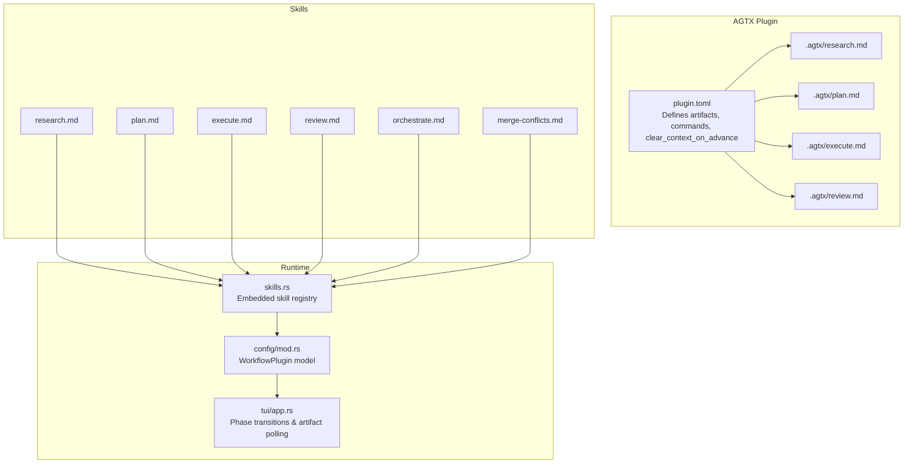

**Diagram sources**
- [plugin.toml:1-16](file://plugins/agtx/plugin.toml#L1-L16)
- [research.md:1-45](file://plugins/agtx/skills/research.md#L1-L45)
- [plan.md:1-43](file://plugins/agtx/skills/plan.md#L1-L43)
- [execute.md:1-39](file://plugins/agtx/skills/execute.md#L1-L39)
- [review.md:1-36](file://plugins/agtx/skills/review.md#L1-L36)
- [skills.rs:5-21](file://src/skills.rs#L5-L21)
- [config/mod.rs:410-451](file://src/config/mod.rs#L410-L451)
- [app.rs:5451-5472](file://src/tui/app.rs#L5451-L5472)

**Section sources**
- [plugin.toml:1-16](file://plugins/agtx/plugin.toml#L1-L16)
- [skills.rs:5-21](file://src/skills.rs#L5-L21)

## Core Components
- Plugin configuration: Declares artifact paths and command mappings for each phase, plus clear_context_on_advance behavior.
- Phase skills: Four markdown prompts that define the Research, Planning, Execution, and Review phases and their outputs.
- Embedded skill registry: Compiles skill content into constants and exposes them for enumeration and agent-native transformations.
- WorkflowPlugin model: Deserializes plugin.toml into a strongly-typed configuration consumed by the TUI and tmux integration.
- Phase transitions: The TUI sends commands, waits for prompt triggers, polls for artifacts, and copies them back when configured.

**Section sources**
- [plugin.toml:5-16](file://plugins/agtx/plugin.toml#L5-L16)
- [research.md:1-45](file://plugins/agtx/skills/research.md#L1-L45)
- [plan.md:1-43](file://plugins/agtx/skills/plan.md#L1-L43)
- [execute.md:1-39](file://plugins/agtx/skills/execute.md#L1-L39)
- [review.md:1-36](file://plugins/agtx/skills/review.md#L1-L36)
- [skills.rs:5-21](file://src/skills.rs#L5-L21)
- [config/mod.rs:410-451](file://src/config/mod.rs#L410-L451)
- [app.rs:5451-5472](file://src/tui/app.rs#L5451-L5472)

## Architecture Overview
The AGTX default workflow orchestrates tasks through a Kanban-like board with four managed phases plus Done. The user controls Backlog and Research; the orchestrator advances Planning and Running; Review is the final managed state. Artifacts are written to .agtx files and optionally copied back to the project root upon completion.

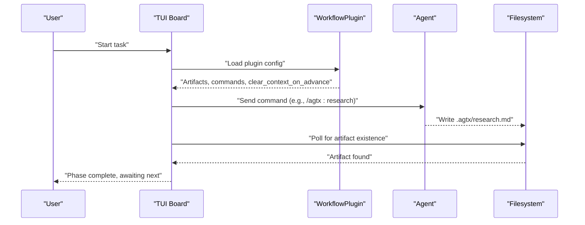

**Diagram sources**
- [plugin.toml:5-16](file://plugins/agtx/plugin.toml#L5-L16)
- [research.md:23-45](file://plugins/agtx/skills/research.md#L23-L45)
- [config/mod.rs:410-451](file://src/config/mod.rs#L410-L451)
- [app.rs:5451-5472](file://src/tui/app.rs#L5451-L5472)

## Detailed Component Analysis

### Plugin Configuration and Commands
- Artifact mapping: research/planning/running/review map to .agtx/research.md, .agtx/plan.md, .agtx/execute.md, .agtx/review.md respectively.
- Command mappings: /agtx:research, /agtx:plan, /agtx:execute, /agtx:review.
- clear_context_on_advance: When true, the system sends a "clear context" command before advancing to a phase skill (currently supported for Claude Code).

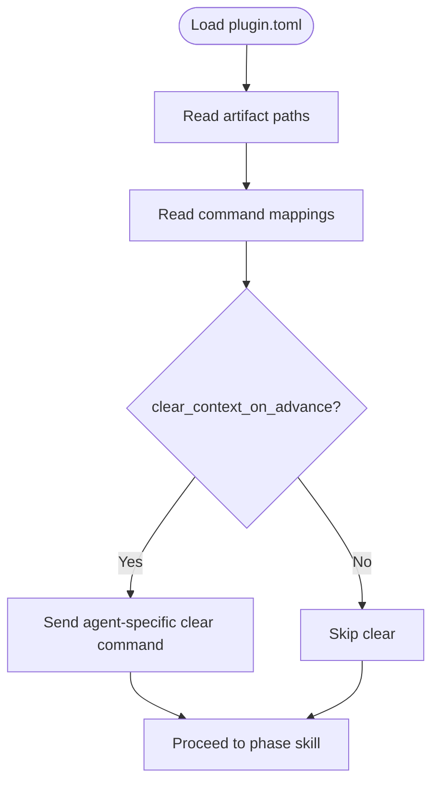

**Diagram sources**
- [plugin.toml:3-16](file://plugins/agtx/plugin.toml#L3-L16)
- [config/mod.rs:438-442](file://src/config/mod.rs#L438-L442)

**Section sources**
- [plugin.toml:3-16](file://plugins/agtx/plugin.toml#L3-L16)
- [config/mod.rs:438-442](file://src/config/mod.rs#L438-L442)

### Research Phase
- Purpose: Read-only exploration to understand the task and codebase.
- Outputs: .agtx/research.md with sections for relevant files, architecture, complexity, and open questions.
- Constraints: Do not modify source files; stop after writing the artifact.

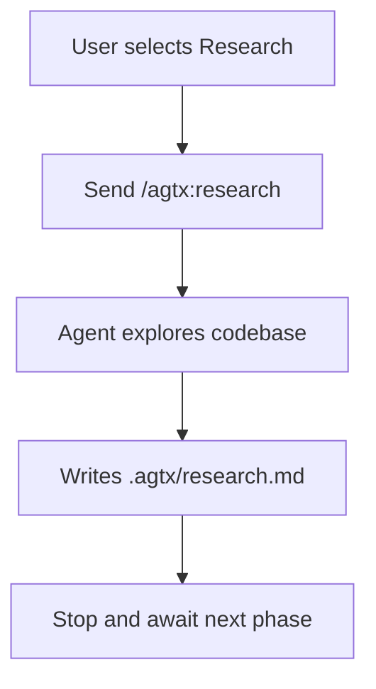

**Diagram sources**
- [research.md:1-45](file://plugins/agtx/skills/research.md#L1-L45)

**Section sources**
- [research.md:1-45](file://plugins/agtx/skills/research.md#L1-L45)

### Planning Phase
- Purpose: Analyze and create a detailed implementation plan.
- Inputs: Task description and optional prior .agtx/research.md.
- Outputs: .agtx/plan.md with Analysis, Plan, and Risks sections.
- Constraints: Do not implement; stop after writing the artifact.

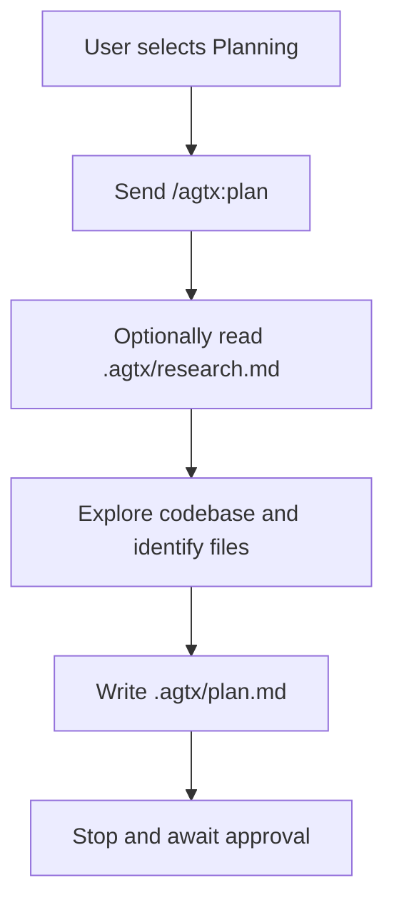

**Diagram sources**
- [plan.md:1-43](file://plugins/agtx/skills/plan.md#L1-L43)

**Section sources**
- [plan.md:1-43](file://plugins/agtx/skills/plan.md#L1-L43)

### Execution Phase
- Purpose: Implement the approved plan and produce a summary.
- Inputs: Task description and .agtx/plan.md.
- Outputs: .agtx/execute.md with Changes and Testing sections.
- Constraints: Do not exceed the plan; stop after writing the artifact.

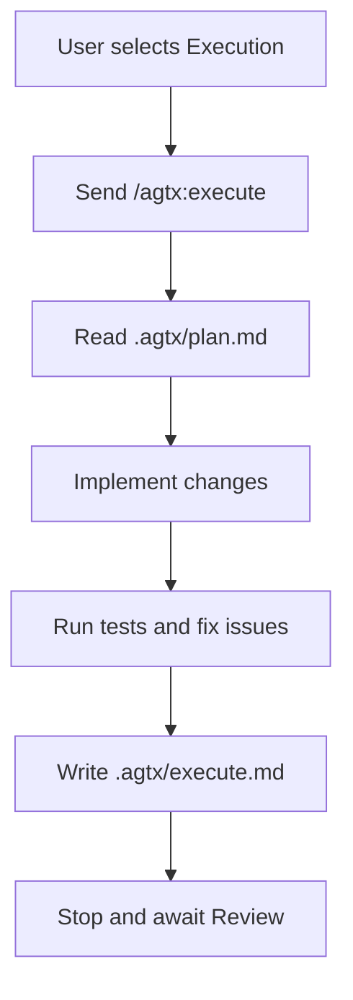

**Diagram sources**
- [execute.md:1-39](file://plugins/agtx/skills/execute.md#L1-L39)

**Section sources**
- [execute.md:1-39](file://plugins/agtx/skills/execute.md#L1-L39)

### Review Phase
- Purpose: Self-review for correctness, edge cases, style, tests, and security.
- Outputs: .agtx/review.md with Review and Status sections.
- Constraints: Do not modify code; stop after writing the artifact.

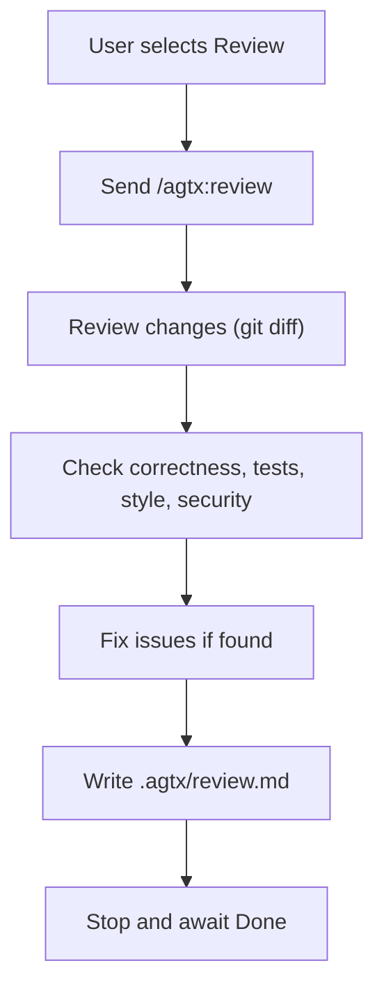

**Diagram sources**
- [review.md:1-36](file://plugins/agtx/skills/review.md#L1-L36)

**Section sources**
- [review.md:1-36](file://plugins/agtx/skills/review.md#L1-L36)

### Orchestrator Agent
- Role: Advance tasks through Planning and Running phases, monitor completions, and coordinate multiple agents.
- Behavior: Receives notifications when a phase completes, reads task details, checks allowed_actions, and moves tasks forward.

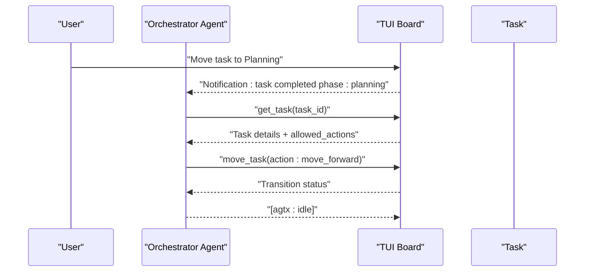

**Diagram sources**
- [orchestrate.md:30-90](file://plugins/agtx/skills/orchestrate.md#L30-L90)

**Section sources**
- [orchestrate.md:1-200](file://plugins/agtx/skills/orchestrate.md#L1-L200)

### Merge Conflicts Resolution
- Steps: Commit current work, merge default branch, resolve all conflicts, review conflicted files, run tests, and commit the merge.
- Rules: Always merge, never rebase; do not squash or force push.

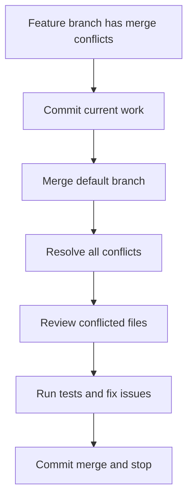

**Diagram sources**
- [merge-conflicts.md:10-53](file://plugins/agtx/skills/merge-conflicts.md#L10-L53)

**Section sources**
- [merge-conflicts.md:1-53](file://plugins/agtx/skills/merge-conflicts.md#L1-L53)

### Skills System Integration
- Embedded content: Skill markdown files are embedded at compile time via include_str!().
- Enumeration: The registry exposes built-in skills and generates agent-native command names and filenames.
- Transformation: Converts skill names to canonical commands and adapts them per agent (e.g., Claude/Gemini, Cursor, Codex).

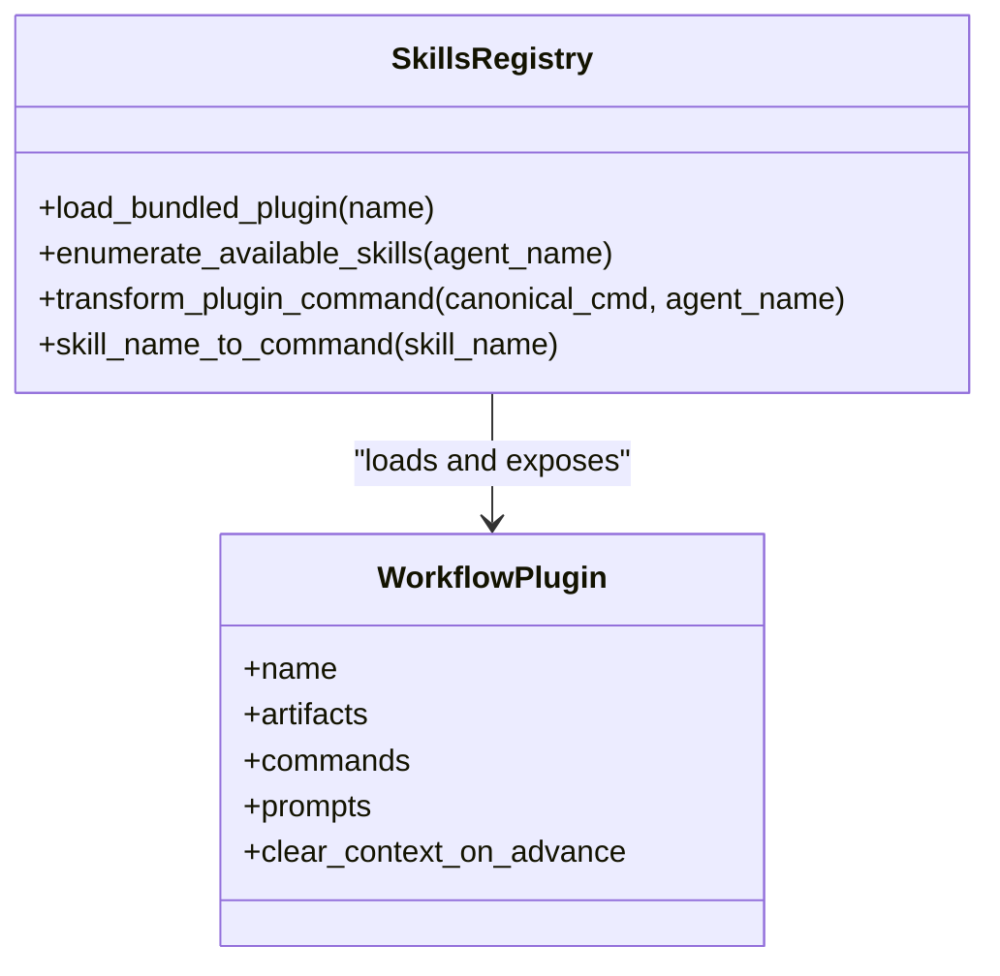

**Diagram sources**
- [skills.rs:24-115](file://src/skills.rs#L24-L115)
- [config/mod.rs:410-451](file://src/config/mod.rs#L410-L451)

**Section sources**
- [skills.rs:5-21](file://src/skills.rs#L5-L21)
- [skills.rs:24-115](file://src/skills.rs#L24-L115)
- [config/mod.rs:410-451](file://src/config/mod.rs#L410-L451)

### Phase Transitions and Artifact Management
- Command emission: The TUI resolves the plugin command and agent-specific invocation, then sends it to the agent via tmux.
- Prompt triggers: Optional text to wait for before sending the prompt with task context.
- Artifact polling: The TUI polls for artifact existence; when found, marks the phase complete.
- Copy-back: Optional configuration to copy artifacts from worktree to project root after completion.

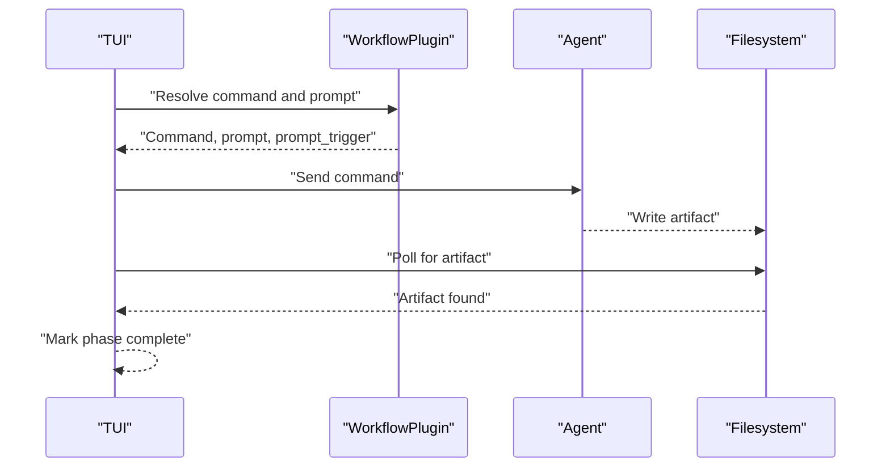

**Diagram sources**
- [app.rs:5451-5472](file://src/tui/app.rs#L5451-L5472)
- [config/mod.rs:505-510](file://src/config/mod.rs#L505-L510)
- [config/mod.rs:443-446](file://src/config/mod.rs#L443-L446)

**Section sources**
- [app.rs:5451-5472](file://src/tui/app.rs#L5451-L5472)
- [config/mod.rs:505-510](file://src/config/mod.rs#L505-L510)
- [config/mod.rs:443-446](file://src/config/mod.rs#L443-L446)

## Dependency Analysis
- The skills registry depends on plugin.toml and skill markdown files to expose commands and prompts.
- The TUI depends on the WorkflowPlugin model to resolve commands, prompts, and artifact paths.
- The configuration module defines the clear_context_on_advance field that influences agent behavior during phase transitions.

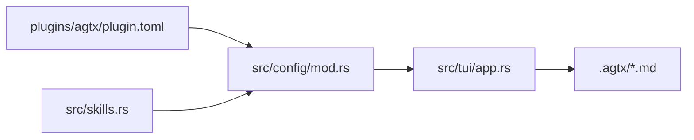

**Diagram sources**
- [plugin.toml:1-16](file://plugins/agtx/plugin.toml#L1-L16)
- [skills.rs:5-21](file://src/skills.rs#L5-L21)
- [config/mod.rs:410-451](file://src/config/mod.rs#L410-L451)
- [app.rs:5451-5472](file://src/tui/app.rs#L5451-L5472)

**Section sources**
- [plugin.toml:1-16](file://plugins/agtx/plugin.toml#L1-L16)
- [skills.rs:5-21](file://src/skills.rs#L5-L21)
- [config/mod.rs:410-451](file://src/config/mod.rs#L410-L451)
- [app.rs:5451-5472](file://src/tui/app.rs#L5451-L5472)

## Performance Considerations
- Artifact polling: The TUI polls for artifact existence; keep artifact generation efficient to minimize wait times.
- Prompt triggers: Configure prompt triggers to avoid unnecessary delays while ensuring reliable readiness signals.
- Auto-dismiss rules: Use auto_dismiss to reduce manual intervention for repetitive prompts.
- Clear context on advance: Enabling clear_context_on_advance can reset agent state between phases, potentially reducing memory usage and context drift.

## Troubleshooting Guide
- Artifacts not appearing: Verify the agent writes to the expected .agtx paths and that the TUI is polling for the correct artifact names.
- Phase gating: If a phase cannot be entered directly from Backlog, ensure the prerequisite artifact exists or the plugin command/prompt contains {task}.
- Preresearch fallback: If no research artifacts exist, the preresearch command (if configured) runs before switching to the regular research command.
- Merge conflicts: Follow the merge-conflicts skill steps precisely to preserve changes and maintain a clean history.

**Section sources**
- [config/mod.rs:512-537](file://src/config/mod.rs#L512-L537)
- [config/mod.rs:545-572](file://src/config/mod.rs#L545-L572)
- [merge-conflicts.md:10-53](file://plugins/agtx/skills/merge-conflicts.md#L10-L53)

## Conclusion
The AGTX default workflow provides a structured, artifact-driven process for AI-assisted development. By leveraging plugin configuration, embedded skills, and a Kanban-style board, teams can maintain clear separation of concerns across phases, enforce quality gates in Review, and streamline handoffs to Done. The clear_context_on_advance setting helps manage agent state across transitions, while the skills system ensures consistent command mappings and agent-native integrations.