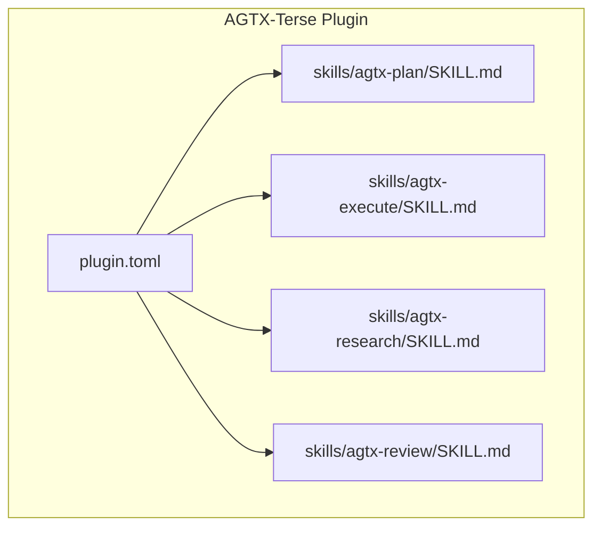
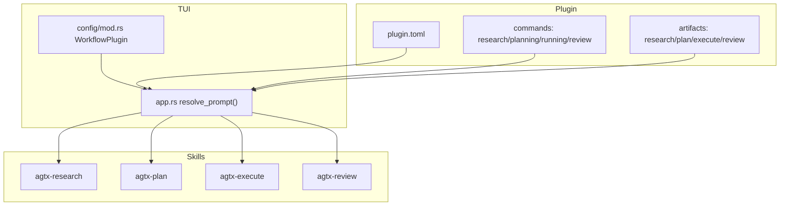
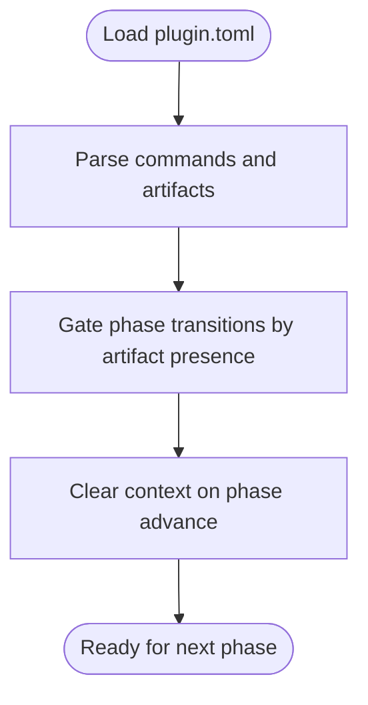
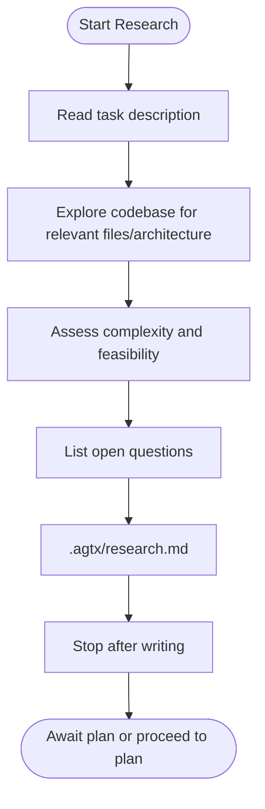
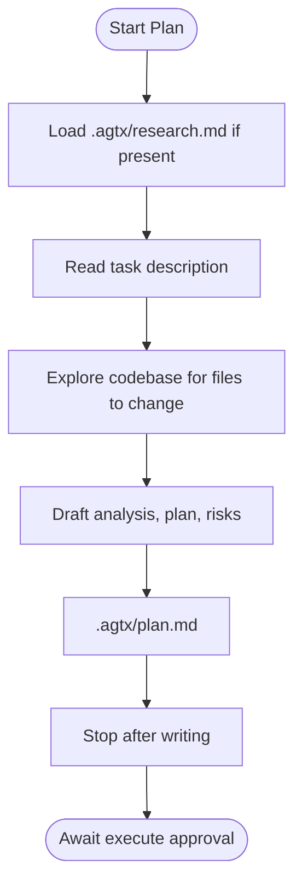
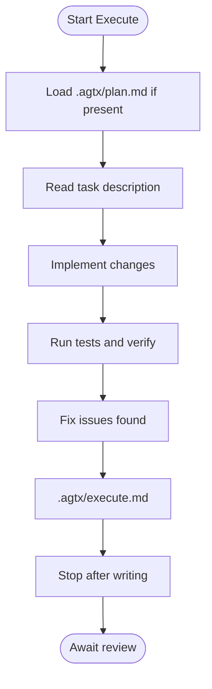
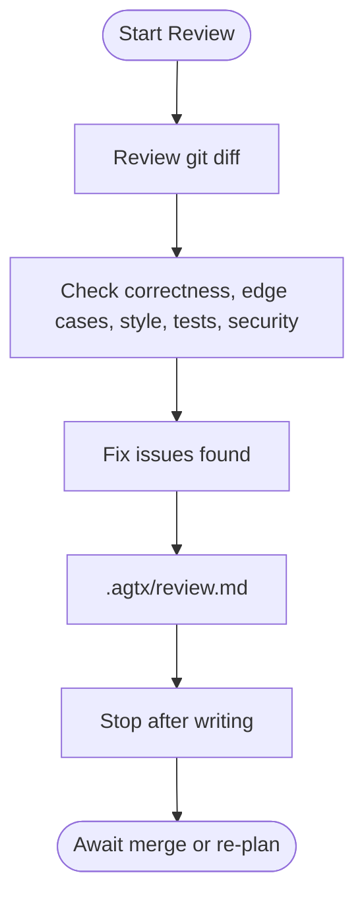
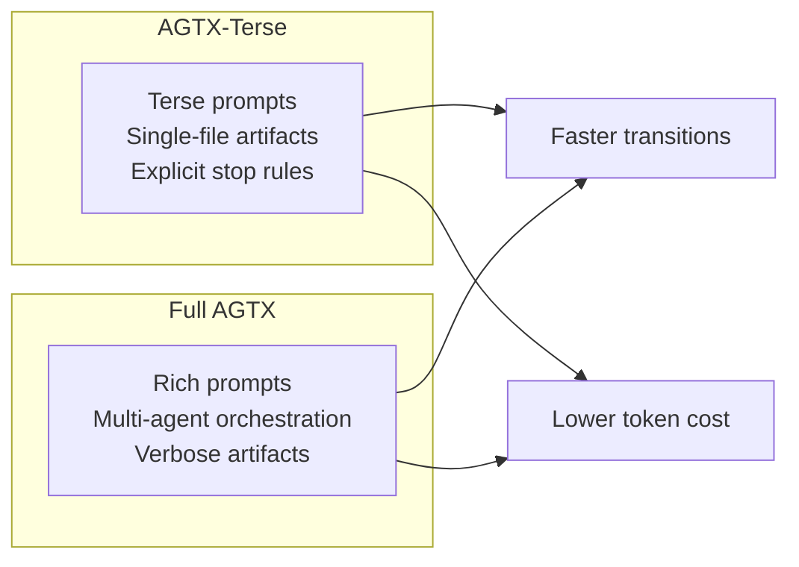
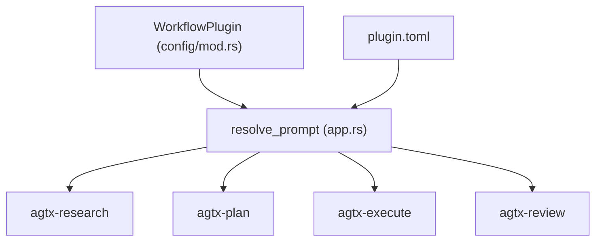

# AGTX-Terse Workflow

<cite>
**Referenced Files in This Document**
- [README.md](file://README.md)
- [plugin.toml](file://plugins/agtx-terse/plugin.toml)
- [SKILL.md](file://plugins/agtx-terse/skills/agtx-plan/SKILL.md)
- [SKILL.md](file://plugins/agtx-terse/skills/agtx-execute/SKILL.md)
- [SKILL.md](file://plugins/agtx-terse/skills/agtx-research/SKILL.md)
- [SKILL.md](file://plugins/agtx-terse/skills/agtx-review/SKILL.md)
- [plugin.toml](file://plugins/agtx/plugin.toml)
- [plan.md](file://plugins/agtx/skills/plan.md)
- [research.md](file://plugins/agtx/skills/research.md)
- [review.md](file://plugins/agtx/skills/review.md)
- [orchestrate.md](file://plugins/agtx/skills/orchestrate.md)
- [mod.rs](file://src/config/mod.rs)
- [app.rs](file://src/tui/app.rs)
- [llms.txt](file://llms.txt)
- [llms-full.txt](file://llms-full.txt)
</cite>

## Table of Contents
1. [Introduction](#introduction)
2. [Project Structure](#project-structure)
3. [Core Components](#core-components)
4. [Architecture Overview](#architecture-overview)
5. [Detailed Component Analysis](#detailed-component-analysis)
6. [Dependency Analysis](#dependency-analysis)
7. [Performance Considerations](#performance-considerations)
8. [Troubleshooting Guide](#troubleshooting-guide)
9. [Conclusion](#conclusion)
10. [Appendices](#appendices)

## Introduction
This document explains the AGTX-Terse workflow plugin, a cost-effective variant of the AGTX system optimized for token efficiency and minimal interaction overhead. It focuses on four essential phases—research, plan, execute, and review—using concise prompts, minimal artifact complexity, and streamlined agent interactions. Compared to the full AGTX workflow, AGTX-Terse reduces token usage by compressing instruction sets, limiting output verbosity, and avoiding multi-agent orchestration in favor of human-in-the-loop progression.

## Project Structure
The AGTX-Terse plugin is implemented as a spec-driven plugin with a small set of skills and a compact configuration. It mirrors the full AGTX workflow’s phases but simplifies prompts and output expectations to reduce token consumption.

**Diagram sources**
- [plugin.toml:1-16](file://plugins/agtx-terse/plugin.toml#L1-L16)
- [SKILL.md:1-48](file://plugins/agtx-terse/skills/agtx-plan/SKILL.md#L1-L48)
- [SKILL.md:1-44](file://plugins/agtx-terse/skills/agtx-execute/SKILL.md#L1-L44)
- [SKILL.md:1-50](file://plugins/agtx-terse/skills/agtx-research/SKILL.md#L1-L50)
- [SKILL.md:1-41](file://plugins/agtx-terse/skills/agtx-review/SKILL.md#L1-L41)

**Section sources**
- [plugin.toml:1-16](file://plugins/agtx-terse/plugin.toml#L1-L16)
- [README.md:339-339](file://README.md#L339-L339)

## Core Components
- Plugin configuration defines commands and artifacts for the four phases and enforces context clearing on phase transitions to minimize cross-phase token carryover.
- Four skills define the Terse workflow:
  - Research: read-only exploration, minimal output, no code changes.
  - Plan: produce a concise plan with analysis, steps, risks, and explicit stop-after-writing.
  - Execute: implement approved changes, run tests, summarize results, and stop after writing.
  - Review: self-review for correctness, edge cases, style, tests, and security; produce a concise report and status.

Key Terse characteristics:
- Output style: terse, fragments, short synonyms, exact code, one-line status updates.
- Explicit stop-after-writing to prevent continuous prompting and reduce token usage.
- Minimal artifact complexity: each phase writes a single markdown file with a small number of sections.

**Section sources**
- [plugin.toml:1-16](file://plugins/agtx-terse/plugin.toml#L1-L16)
- [SKILL.md:46-50](file://plugins/agtx-terse/skills/agtx-research/SKILL.md#L46-L50)
- [SKILL.md:44-48](file://plugins/agtx-terse/skills/agtx-plan/SKILL.md#L44-L48)
- [SKILL.md:40-44](file://plugins/agtx-terse/skills/agtx-execute/SKILL.md#L40-L44)
- [SKILL.md:37-41](file://plugins/agtx-terse/skills/agtx-review/SKILL.md#L37-L41)

## Architecture Overview
AGTX-Terse integrates with the AGTX TUI and agent ecosystem via plugin configuration and skill files. The TUI resolves plugin commands and prompts, deploys skills to agent contexts, and monitors artifact files to gate phase transitions.

**Diagram sources**
- [mod.rs:410-441](file://src/config/mod.rs#L410-L441)
- [app.rs:7985-8020](file://src/tui/app.rs#L7985-L8020)
- [plugin.toml:1-16](file://plugins/agtx-terse/plugin.toml#L1-L16)

**Section sources**
- [README.md:506-547](file://README.md#L506-L547)
- [app.rs:7985-8020](file://src/tui/app.rs#L7985-L8020)
- [mod.rs:410-441](file://src/config/mod.rs#L410-L441)

## Detailed Component Analysis

### AGTX-Terse Plugin Configuration
- Commands: standardized slash commands for research, plan, execute, and review.
- Artifacts: single-file outputs per phase stored under a shared directory.
- Context clearing: enabled to reduce cross-phase token accumulation.

**Diagram sources**
- [plugin.toml:1-16](file://plugins/agtx-terse/plugin.toml#L1-L16)
- [mod.rs:438-441](file://src/config/mod.rs#L438-L441)

**Section sources**
- [plugin.toml:1-16](file://plugins/agtx-terse/plugin.toml#L1-L16)
- [mod.rs:438-441](file://src/config/mod.rs#L438-L441)

### Research Phase (Terse)
- Purpose: read-only exploration to assess scope and dependencies.
- Output: minimal markdown with relevant files, architecture notes, complexity assessment, and open questions.
- Constraints: no code modifications, explicit stop-after-writing.

**Diagram sources**
- [SKILL.md:14-44](file://plugins/agtx-terse/skills/agtx-research/SKILL.md#L14-L44)

**Section sources**
- [SKILL.md:1-50](file://plugins/agtx-terse/skills/agtx-research/SKILL.md#L1-L50)

### Plan Phase (Terse)
- Purpose: create a concise implementation plan based on research.
- Output: analysis, step-by-step plan, risks; then stop and await approval.
- Constraints: do not implement; stop after writing.

**Diagram sources**
- [SKILL.md:15-42](file://plugins/agtx-terse/skills/agtx-plan/SKILL.md#L15-L42)

**Section sources**
- [SKILL.md:1-48](file://plugins/agtx-terse/skills/agtx-plan/SKILL.md#L1-L48)

### Execute Phase (Terse)
- Purpose: implement approved changes, run tests, and summarize results.
- Output: changes made, testing performed, and fixes; then stop after writing.
- Constraints: stay within plan; stop after writing.

**Diagram sources**
- [SKILL.md:15-38](file://plugins/agtx-terse/skills/agtx-execute/SKILL.md#L15-L38)

**Section sources**
- [SKILL.md:1-44](file://plugins/agtx-terse/skills/agtx-execute/SKILL.md#L1-L44)

### Review Phase (Terse)
- Purpose: self-review for correctness, edge cases, style, tests, and security.
- Output: review findings and status (READY or NEEDS_WORK); then stop after writing.

**Diagram sources**
- [SKILL.md:10-35](file://plugins/agtx-terse/skills/agtx-review/SKILL.md#L10-L35)

**Section sources**
- [SKILL.md:1-41](file://plugins/agtx-terse/skills/agtx-review/SKILL.md#L1-L41)

### Comparison: AGTX-Terse vs Full AGTX
- Token usage:
  - Terse: concise prompts, minimal sections, explicit stop-after-writing, single-file artifacts.
  - Full AGTX: richer prompts, optional multi-agent orchestration, more verbose artifacts and diagnostics.
- Processing speed:
  - Terse: faster phase transitions due to fewer tokens and simpler instructions.
  - Full AGTX: slower due to orchestration overhead and richer prompts.
- Output quality:
  - Terse: sufficient for straightforward tasks; may require additional documentation for complex refactors.
  - Full AGTX: supports multi-agent collaboration and richer artifact generation for complex tasks.

**Section sources**
- [plugin.toml:1-16](file://plugins/agtx-terse/plugin.toml#L1-L16)
- [plan.md:1-43](file://plugins/agtx/skills/plan.md#L1-L43)
- [research.md:1-45](file://plugins/agtx/skills/research.md#L1-L45)
- [review.md:1-36](file://plugins/agtx/skills/review.md#L1-L36)
- [orchestrate.md:1-200](file://plugins/agtx/skills/orchestrate.md#L1-L200)

## Dependency Analysis
- Plugin configuration drives command resolution and prompt substitution.
- The TUI resolves prompts and coordinates skill execution per agent compatibility.
- Skills depend on artifact presence to gate transitions.

**Diagram sources**
- [mod.rs:410-441](file://src/config/mod.rs#L410-L441)
- [app.rs:7985-8020](file://src/tui/app.rs#L7985-L8020)
- [plugin.toml:1-16](file://plugins/agtx-terse/plugin.toml#L1-L16)

**Section sources**
- [mod.rs:410-441](file://src/config/mod.rs#L410-L441)
- [app.rs:7985-8020](file://src/tui/app.rs#L7985-L8020)

## Performance Considerations
- Token efficiency:
  - Terse output style and explicit stop rules reduce continuous prompting.
  - Single-file artifacts minimize parsing and context overhead.
- Interaction efficiency:
  - Human-in-the-loop progression avoids multi-agent coordination delays.
  - Context clearing prevents token bloat across phases.
- Practical tips:
  - Keep task descriptions concise to reduce downstream token usage.
  - Use the research phase to clarify scope before planning to avoid rework.

[No sources needed since this section provides general guidance]

## Troubleshooting Guide
- Phase stuck:
  - Ensure the previous phase’s artifact exists and is readable by the TUI.
  - Confirm the plugin’s command and prompt triggers are compatible with the agent.
- Unexpected multi-agent orchestration:
  - AGTX-Terse does not include an orchestrator; ensure you selected the Terse plugin and not the full AGTX plugin.
- Agent command mismatches:
  - Verify agent-specific command transformations are not required for Terse (standard slash commands are used).

**Section sources**
- [plugin.toml:11-16](file://plugins/agtx-terse/plugin.toml#L11-L16)
- [README.md:339-339](file://README.md#L339-L339)
- [llms.txt:1-36](file://llms.txt#L1-L36)
- [llms-full.txt:1-124](file://llms-full.txt#L1-L124)

## Conclusion
AGTX-Terse delivers a streamlined, cost-effective workflow that maintains essential functionality with minimal token usage and simplified interactions. Teams prioritizing budget-conscious development can adopt AGTX-Terse for straightforward tasks, reserving the full AGTX workflow for complex, multi-agent scenarios requiring richer documentation and orchestration.

[No sources needed since this section summarizes without analyzing specific files]

## Appendices

### Configuration Recommendations for Budget-Conscious Teams
- Select AGTX-Terse plugin for tasks where concise outputs and minimal interaction suffice.
- Keep prompts and summaries brief; rely on the Terse output style guidelines.
- Use research to clarify scope and reduce rework, lowering overall token consumption.
- Avoid enabling multi-agent orchestration for simple tasks to minimize latency and token usage.

**Section sources**
- [README.md:339-339](file://README.md#L339-L339)
- [SKILL.md:46-50](file://plugins/agtx-terse/skills/agtx-research/SKILL.md#L46-L50)
- [SKILL.md:44-48](file://plugins/agtx-terse/skills/agtx-plan/SKILL.md#L44-L48)
- [SKILL.md:40-44](file://plugins/agtx-terse/skills/agtx-execute/SKILL.md#L40-L44)
- [SKILL.md:37-41](file://plugins/agtx-terse/skills/agtx-review/SKILL.md#L37-L41)