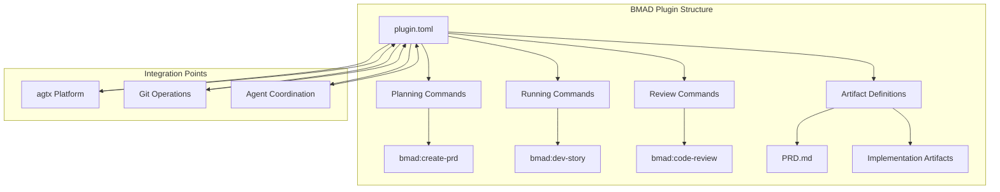
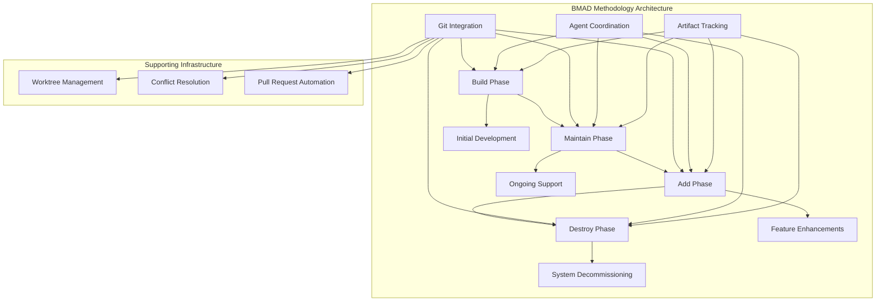
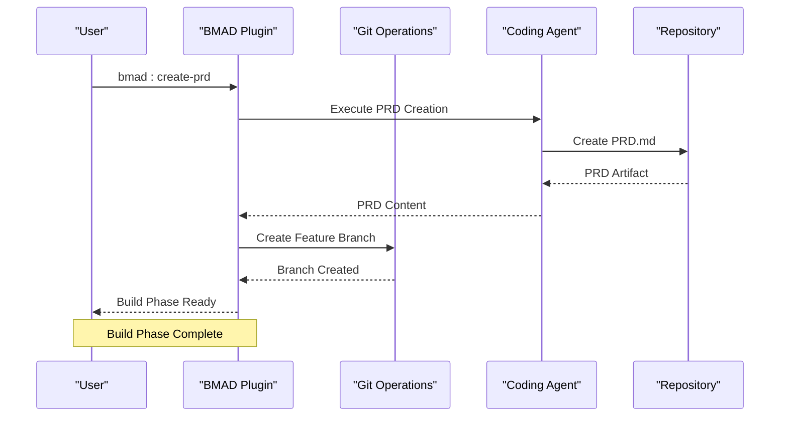
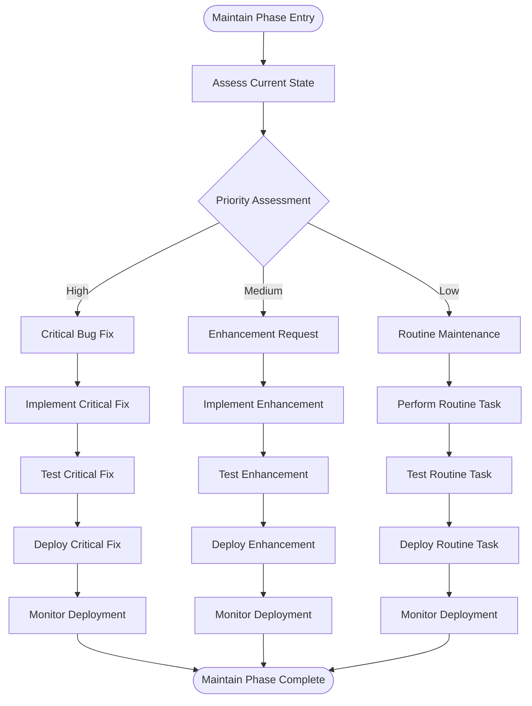
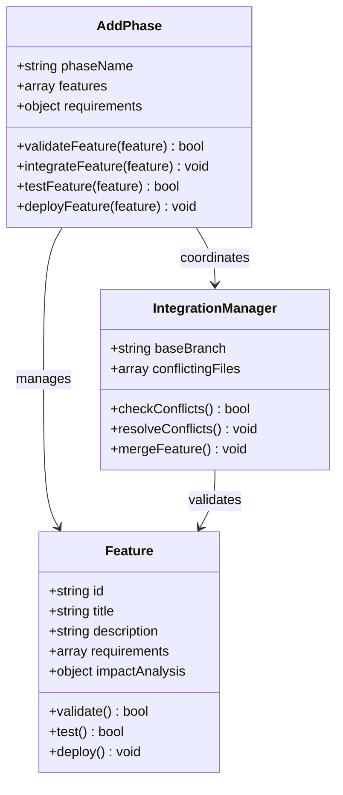
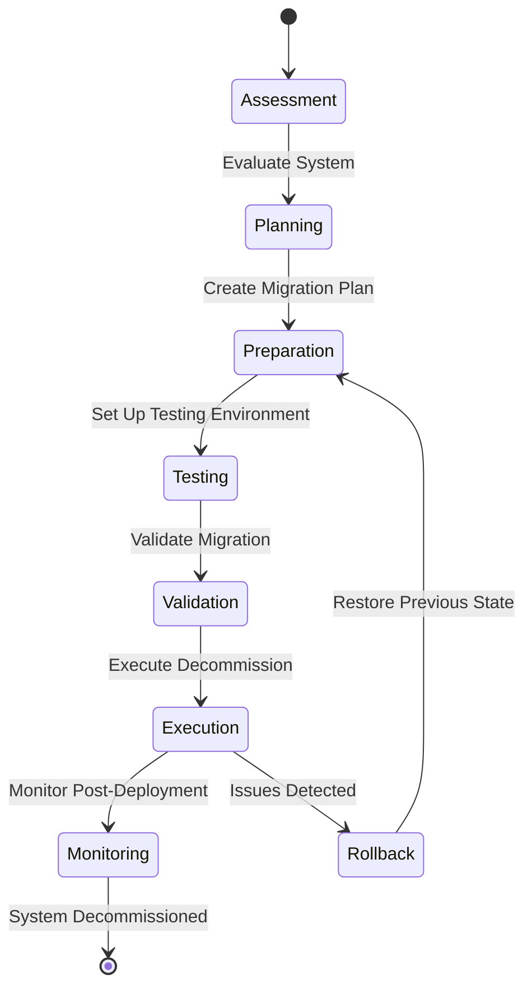
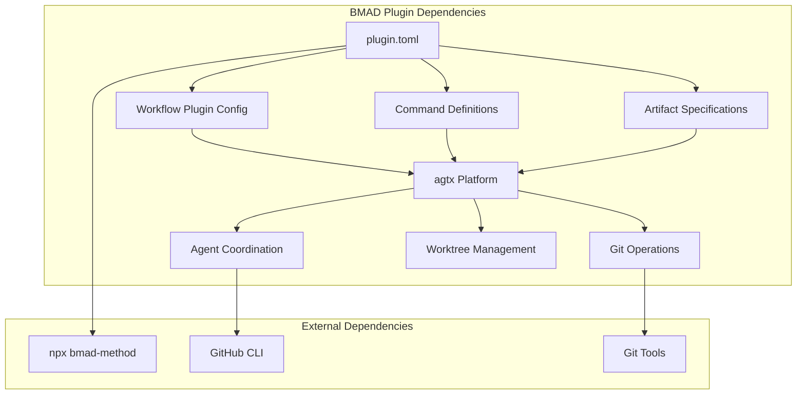
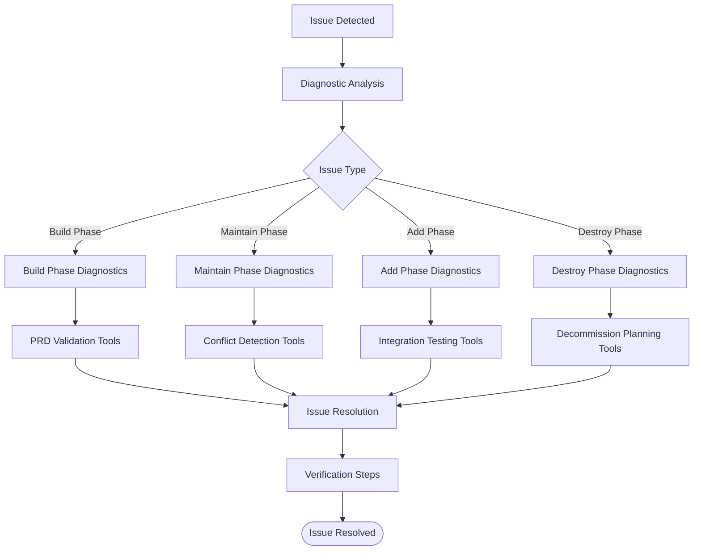

# BMAD Agile Methodology

<cite>
**Referenced Files in This Document**
- [plugin.toml](file://plugins/bmad/plugin.toml)
- [README.md](file://README.md)
- [skills.rs](file://src/skills.rs)
- [config/mod.rs](file://src/config/mod.rs)
- [git/mod.rs](file://src/git/mod.rs)
- [git/operations.rs](file://src/git/operations.rs)
- [git/provider.rs](file://src/git/provider.rs)
- [git/worktree.rs](file://src/git/worktree.rs)
- [agent/operations.rs](file://src/agent/operations.rs)
</cite>

## Table of Contents
1. [Introduction](#introduction)
2. [Project Structure](#project-structure)
3. [Core Components](#core-components)
4. [Architecture Overview](#architecture-overview)
5. [Detailed Component Analysis](#detailed-component-analysis)
6. [Dependency Analysis](#dependency-analysis)
7. [Performance Considerations](#performance-considerations)
8. [Troubleshooting Guide](#troubleshooting-guide)
9. [Conclusion](#conclusion)

## Introduction

The BMAD (Build-Maintain-Add-Destroy) Agile Methodology plugin represents a structured, phase-based approach to software development that emphasizes continuous evolution and adaptive project management. This methodology divides the software lifecycle into four distinct phases, each with specific goals, deliverables, and integration points with Git operations for managing code evolution across multiple lifecycle phases.

Unlike traditional waterfall or simple agile approaches, BMAD provides a comprehensive framework for long-running systems that require continuous adaptation, maintenance, and strategic evolution. The methodology recognizes that modern software systems rarely reach a final "done" state but instead require ongoing attention through structured phases of development and maintenance.

The plugin integrates seamlessly with the agtx platform's worktree-based architecture, enabling parallel development across all phases while maintaining strict separation of concerns and ensuring that each phase builds upon previous work without compromising system stability.

## Project Structure

The BMAD plugin follows the standard agtx plugin architecture pattern, leveraging the platform's spec-driven workflow system. The plugin configuration defines the four-phase methodology while integrating with the broader agtx ecosystem for task management, agent coordination, and Git operations.

**Diagram sources**
- [plugin.toml:1-22](file://plugins/bmad/plugin.toml#L1-L22)
- [README.md:342-343](file://README.md#L342-L343)

The plugin structure demonstrates a clean separation of concerns where the plugin configuration defines the methodology while the agtx platform handles the execution, coordination, and Git integration. This modular approach enables easy customization and extension of the BMAD methodology for different project needs.

**Section sources**
- [plugin.toml:1-22](file://plugins/bmad/plugin.toml#L1-L22)
- [README.md:342-343](file://README.md#L342-L343)

## Core Components

The BMAD plugin consists of several interconnected components that work together to provide a comprehensive agile methodology framework. Each component serves a specific purpose in the overall methodology while contributing to the seamless integration with the agtx platform.

### Plugin Configuration System

The plugin configuration defines the four-phase methodology through structured TOML configuration that specifies commands, prompts, artifacts, and integration points. This configuration serves as the foundation for the entire BMAD workflow, establishing clear expectations for each phase and defining the deliverables expected at each stage.

### Command Integration Layer

The plugin integrates three primary commands that correspond to the core phases of the BMAD methodology: PRD creation, development story execution, and code review processes. These commands serve as entry points for each phase while maintaining consistency with the agtx platform's command structure.

### Artifact Management System

The plugin defines specific artifact requirements for each phase, ensuring that progress can be tracked and validated throughout the methodology. These artifacts serve as checkpoints that indicate successful completion of each phase and provide the foundation for transitioning to subsequent phases.

### Integration with Git Operations

The BMAD plugin leverages the agtx platform's comprehensive Git operation capabilities, including worktree management, branch operations, and merge conflict detection. This integration ensures that the methodology supports proper version control practices while enabling parallel development across multiple phases.

**Section sources**
- [plugin.toml:6-21](file://plugins/bmad/plugin.toml#L6-L21)
- [skills.rs:174-178](file://src/skills.rs#L174-L178)

## Architecture Overview

The BMAD methodology architecture represents a sophisticated integration of phase-based development with modern DevOps practices. The system combines structured methodology with automated tooling to create a comprehensive development framework that supports long-term project evolution.

**Diagram sources**
- [README.md:506-547](file://README.md#L506-L547)
- [git/worktree.rs:8-65](file://src/git/worktree.rs#L8-L65)

The architecture demonstrates a cyclical methodology where each phase feeds into the next, creating a continuous improvement loop. The Git integration ensures that each phase maintains proper version control boundaries while the agent coordination system enables automated execution of methodology-defined processes.

## Detailed Component Analysis

### Build Phase Implementation

The Build phase represents the initial development stage of the BMAD methodology, focusing on establishing the foundational elements of the system. This phase integrates with the PRD creation process to ensure that development efforts are properly scoped and documented from the outset.

**Diagram sources**
- [plugin.toml:10-13](file://plugins/bmad/plugin.toml#L10-L13)
- [git/worktree.rs:14-65](file://src/git/worktree.rs#L14-L65)

The Build phase establishes the foundation for subsequent phases by creating comprehensive documentation and establishing proper development boundaries. The integration with Git ensures that development efforts are properly isolated and can be tracked independently.

### Maintain Phase Operations

The Maintain phase focuses on ongoing support and bug fixes, representing the continuous operational aspect of the BMAD methodology. This phase emphasizes systematic approaches to technical debt management and operational excellence.

**Diagram sources**
- [README.md:164](file://README.md#L164)
- [git/operations.rs:78-276](file://src/git/operations.rs#L78-L276)

The Maintain phase incorporates automated conflict detection and resolution, ensuring that maintenance activities don't introduce regressions or destabilize the system. The phase emphasizes systematic approaches to technical debt management and operational excellence.

### Add Phase Development

The Add phase encompasses feature enhancements and new functionality development, representing the growth and evolution of the system. This phase requires careful integration with existing systems while maintaining backward compatibility and system stability.

**Diagram sources**
- [git/operations.rs:211-243](file://src/git/operations.rs#L211-L243)
- [git/provider.rs:43-109](file://src/git/provider.rs#L43-L109)

The Add phase demonstrates sophisticated conflict resolution capabilities, utilizing Git's merge-tree functionality to detect potential conflicts before they occur. This proactive approach minimizes disruption to ongoing development while ensuring system stability.

### Destroy Phase Decommissioning

The Destroy phase addresses system decommissioning and replacement strategies, providing structured approaches to system retirement and modernization. This phase requires careful planning and execution to minimize disruption to users and stakeholders.

**Diagram sources**
- [README.md:604-646](file://README.md#L604-L646)
- [git/worktree.rs:275-297](file://src/git/worktree.rs#L275-L297)

The Destroy phase incorporates comprehensive monitoring and rollback capabilities, ensuring that system decommissioning can be executed safely and reversibly. The phase emphasizes careful planning and execution to minimize risk and disruption.

**Section sources**
- [plugin.toml:10-13](file://plugins/bmad/plugin.toml#L10-L13)
- [README.md:164](file://README.md#L164)
- [git/operations.rs:78-276](file://src/git/operations.rs#L78-L276)
- [git/provider.rs:43-109](file://src/git/provider.rs#L43-L109)

## Dependency Analysis

The BMAD plugin exhibits a well-structured dependency hierarchy that enables loose coupling while maintaining necessary integration points. Understanding these dependencies is crucial for effective plugin development and system maintenance.

**Diagram sources**
- [plugin.toml:3](file://plugins/bmad/plugin.toml#L3)
- [config/mod.rs:410-451](file://src/config/mod.rs#L410-L451)

The dependency analysis reveals a clean separation between the plugin configuration and the underlying platform infrastructure. The plugin relies on the agtx platform for core functionality while maintaining flexibility through configuration-driven behavior.

Key dependency relationships include:
- **Configuration-driven**: All behavior is defined through TOML configuration
- **Platform-agnostic**: Integration occurs through standardized interfaces
- **Tool-agnostic**: External tool dependencies are optional and configurable
- **Extensible**: New phases and commands can be added through configuration

**Section sources**
- [plugin.toml:3](file://plugins/bmad/plugin.toml#L3)
- [config/mod.rs:410-451](file://src/config/mod.rs#L410-L451)

## Performance Considerations

The BMAD methodology incorporates several performance optimization strategies that enhance development velocity while maintaining system reliability. These considerations are particularly important for long-running systems that require continuous adaptation and maintenance.

### Parallel Development Efficiency

The worktree-based architecture enables parallel development across multiple phases without resource contention. Each phase operates independently in its own Git worktree, allowing teams to work simultaneously on different aspects of the system without interference.

### Automated Conflict Detection

The integration with Git's merge-tree functionality provides non-destructive conflict detection, preventing wasted development time on incompatible changes. This proactive approach reduces merge conflicts and improves overall development throughput.

### Incremental Artifact Processing

The plugin's artifact-driven approach enables incremental processing and validation, reducing the overhead associated with full system rebuilds or redeployments. Each phase produces specific artifacts that can be processed independently, enabling targeted updates and faster feedback cycles.

### Resource Optimization Strategies

The methodology emphasizes efficient resource utilization through:
- **Isolated Development Environments**: Worktrees prevent resource conflicts between phases
- **Selective Artifact Processing**: Only relevant artifacts trigger downstream actions
- **Automated Testing Integration**: Continuous validation prevents costly debugging sessions
- **Parallel Phase Execution**: Multiple phases can operate concurrently without interference

## Troubleshooting Guide

The BMAD methodology includes comprehensive troubleshooting capabilities that help identify and resolve issues across all phases of the development lifecycle. These capabilities are essential for maintaining system stability and development efficiency.

### Common Phase Transition Issues

Phase transitions represent common failure points in the BMAD methodology. The system provides several diagnostic capabilities to identify and resolve transition issues:

**Build Phase Issues**
- PRD creation failures due to insufficient requirements
- Git branch creation conflicts with existing work
- Agent command execution failures

**Maintain Phase Problems**
- Conflict detection false positives during routine maintenance
- Test automation failures in maintenance scenarios
- Deployment rollback complications

**Add Phase Challenges**
- Integration conflicts with existing system components
- Feature validation failures in testing environments
- Merge conflict resolution timeouts

**Destroy Phase Difficulties**
- Decommission planning failures
- Migration testing complications
- Rollback execution issues

### Diagnostic Tools and Techniques

The agtx platform provides several diagnostic tools for troubleshooting BMAD methodology issues:

**Diagram sources**
- [README.md:614-646](file://README.md#L614-L646)
- [git/operations.rs:92-128](file://src/git/operations.rs#L92-L128)

### Resolution Strategies

Effective troubleshooting of BMAD methodology issues requires understanding the specific characteristics of each phase and implementing appropriate resolution strategies:

**Preventive Measures**
- Regular artifact validation throughout each phase
- Automated conflict detection before major changes
- Comprehensive testing at each phase boundary
- Clear communication protocols between phases

**Corrective Actions**
- Phased rollback procedures for failed transitions
- Isolated testing environments for problematic features
- Enhanced monitoring and alerting systems
- Documentation improvements for recurring issues

**Long-term Solutions**
- Process improvements based on issue patterns
- Tooling enhancements for common problem areas
- Training improvements for team members
- System architecture modifications for persistent issues

**Section sources**
- [README.md:614-646](file://README.md#L614-L646)
- [git/operations.rs:92-128](file://src/git/operations.rs#L92-L128)

## Conclusion

The BMAD Agile Methodology plugin represents a comprehensive approach to software development that emphasizes continuous evolution, adaptive project management, and long-term system sustainability. Through its four-phase methodology—Build, Maintain, Add, and Destroy—the plugin provides structured frameworks for managing complex software systems throughout their entire lifecycle.

The integration with the agtx platform's worktree-based architecture, Git operations, and agent coordination systems creates a robust foundation for implementing the BMAD methodology effectively. This integration enables parallel development, automated conflict resolution, and systematic artifact management that supports the methodology's goals.

Key strengths of the BMAD methodology include its emphasis on systematic technical debt management, structured approach to system evolution, and comprehensive integration with modern DevOps practices. The methodology's four-phase structure provides clear progression points while maintaining flexibility for different project contexts and requirements.

For organizations managing long-running systems that require continuous adaptation and maintenance, the BMAD methodology offers proven strategies for balancing innovation with operational stability. The methodology's focus on structured decomposition, systematic testing, and controlled evolution provides reliable frameworks for managing complex software ecosystems over extended periods.

The plugin's extensible architecture and configuration-driven approach ensure that the methodology can be adapted to various organizational needs while maintaining consistency and effectiveness across different project contexts. This adaptability, combined with the robust integration capabilities, positions the BMAD methodology as a valuable tool for modern software development organizations.