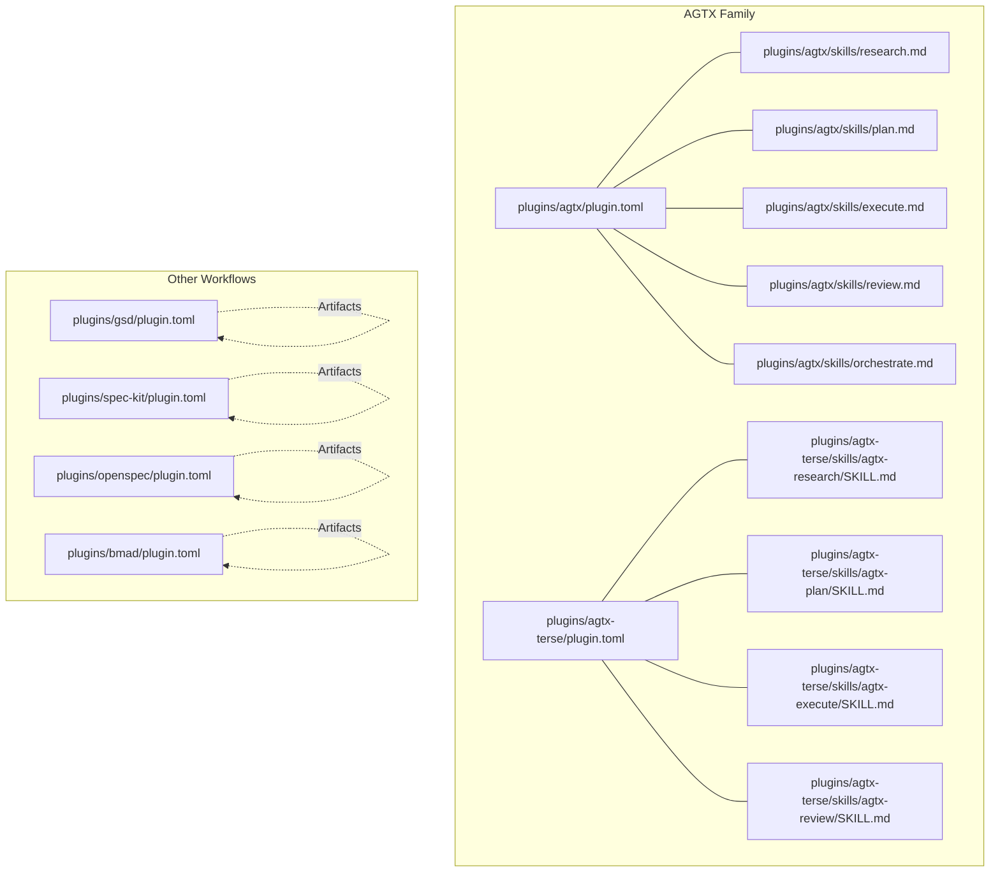
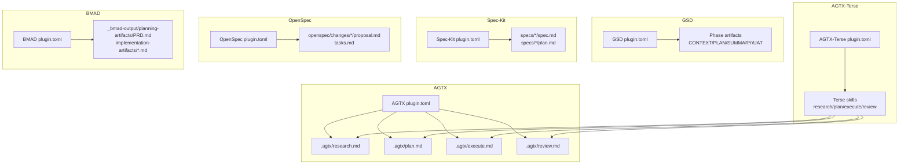
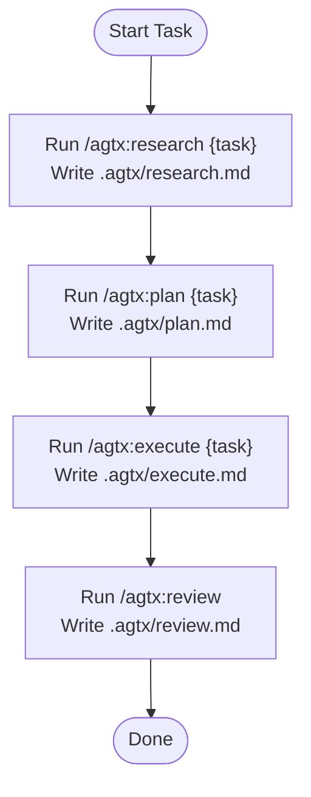
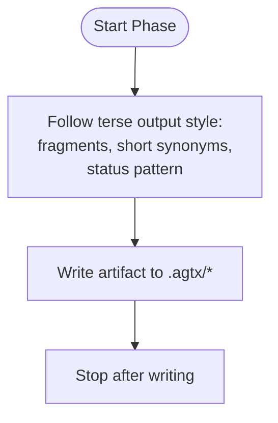
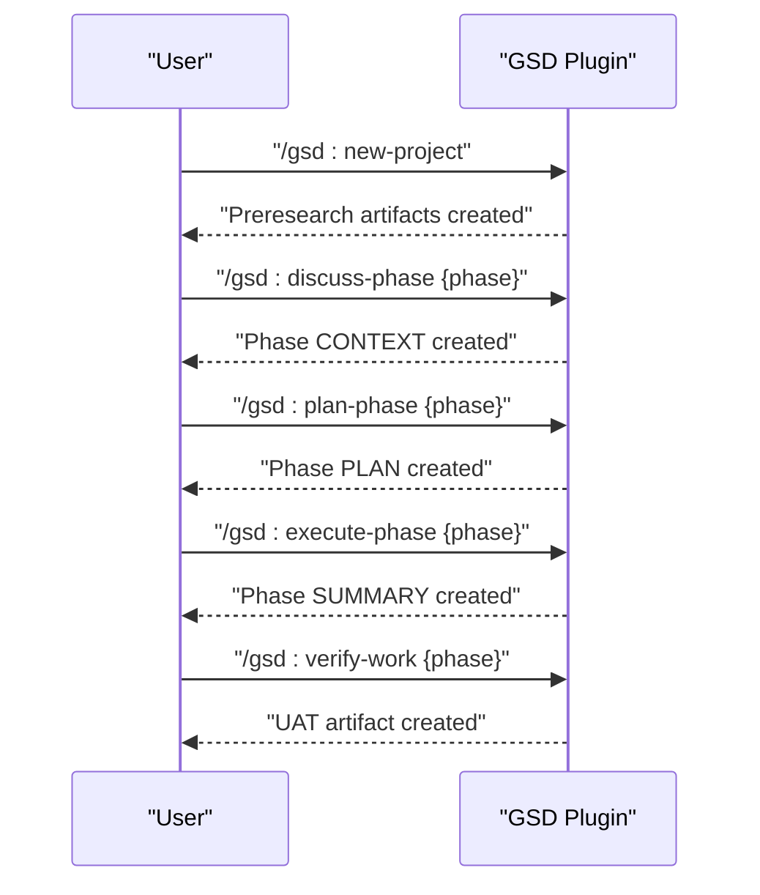
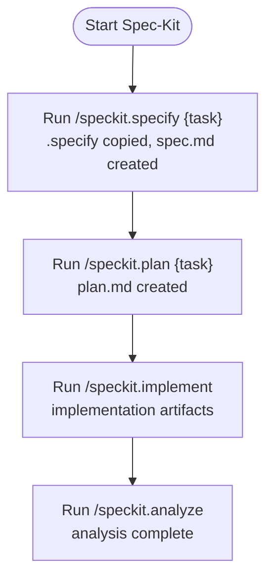
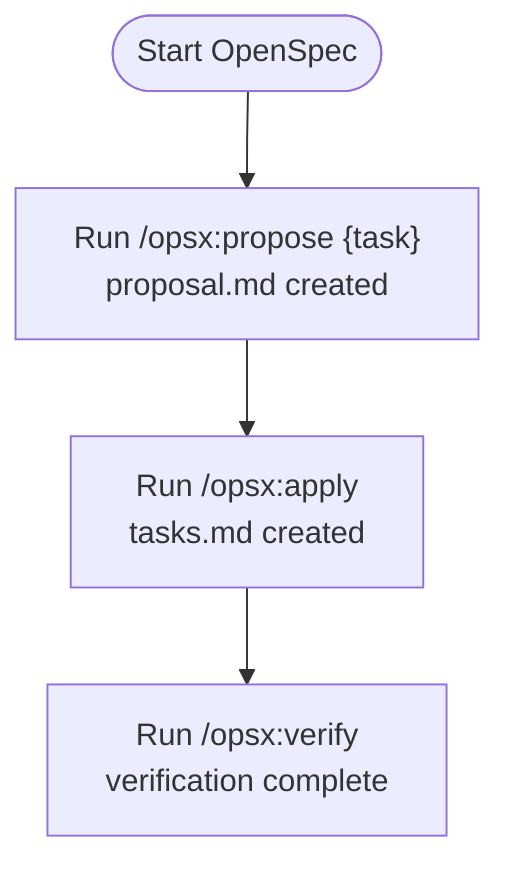
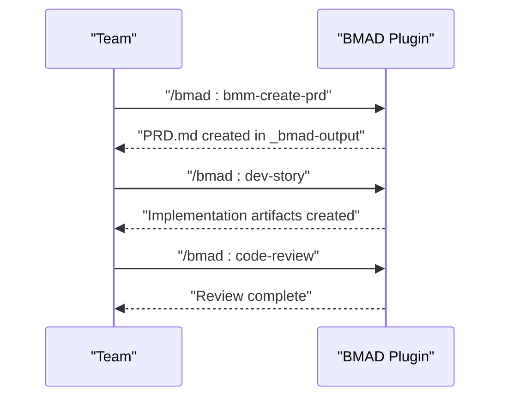
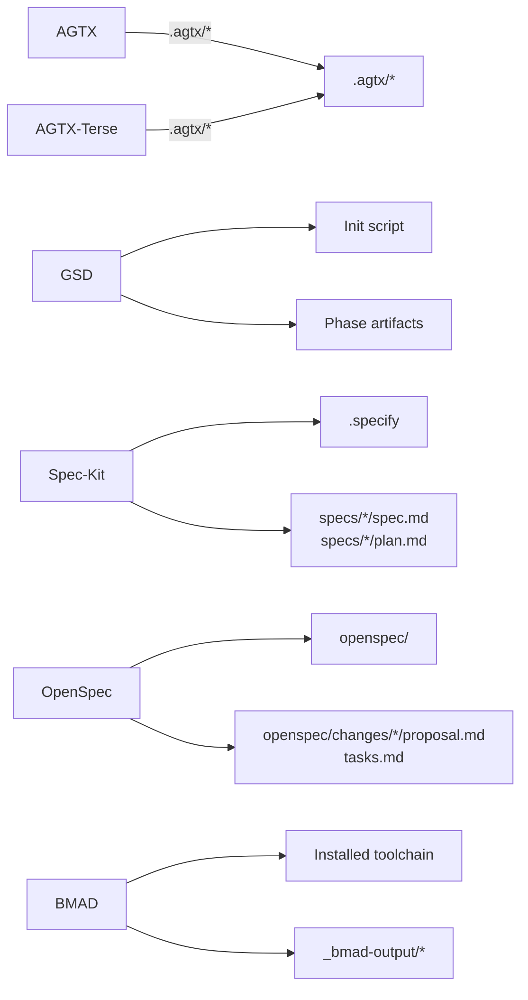

# Built-in Workflow Plugins

<cite>
**Referenced Files in This Document**
- [plugins/agtx/plugin.toml](file://plugins/agtx/plugin.toml)
- [plugins/agtx/skills/research.md](file://plugins/agtx/skills/research.md)
- [plugins/agtx/skills/plan.md](file://plugins/agtx/skills/plan.md)
- [plugins/agtx/skills/execute.md](file://plugins/agtx/skills/execute.md)
- [plugins/agtx/skills/review.md](file://plugins/agtx/skills/review.md)
- [plugins/agtx/skills/orchestrate.md](file://plugins/agtx/skills/orchestrate.md)
- [plugins/agtx-terse/plugin.toml](file://plugins/agtx-terse/plugin.toml)
- [plugins/agtx-terse/skills/agtx-research/SKILL.md](file://plugins/agtx-terse/skills/agtx-research/SKILL.md)
- [plugins/agtx-terse/skills/agtx-plan/SKILL.md](file://plugins/agtx-terse/skills/agtx-plan/SKILL.md)
- [plugins/agtx-terse/skills/agtx-execute/SKILL.md](file://plugins/agtx-terse/skills/agtx-execute/SKILL.md)
- [plugins/agtx-terse/skills/agtx-review/SKILL.md](file://plugins/agtx-terse/skills/agtx-review/SKILL.md)
- [plugins/gsd/plugin.toml](file://plugins/gsd/plugin.toml)
- [plugins/spec-kit/plugin.toml](file://plugins/spec-kit/plugin.toml)
- [plugins/openspec/plugin.toml](file://plugins/openspec/plugin.toml)
- [plugins/bmad/plugin.toml](file://plugins/bmad/plugin.toml)
</cite>

## Table of Contents
1. [Introduction](#introduction)
2. [Project Structure](#project-structure)
3. [Core Components](#core-components)
4. [Architecture Overview](#architecture-overview)
5. [Detailed Component Analysis](#detailed-component-analysis)
6. [Dependency Analysis](#dependency-analysis)
7. [Performance Considerations](#performance-considerations)
8. [Troubleshooting Guide](#troubleshooting-guide)
9. [Decision Matrix](#decision-matrix)
10. [Conclusion](#conclusion)

## Introduction
This document describes the built-in workflow plugins that define repeatable, artifact-driven development processes. It covers seven core methodologies:
- AGTX default workflow: a five-phase process (Research → Planning → Execution → Review → Done) with explicit artifact management.
- AGTX-Terse: a token-efficient variant of AGTX with concise outputs and minimal token usage.
- GSD (Get Shit Done): a structured, spec-driven framework emphasizing rapid execution and delivery.
- Spec-Kit: GitHub’s specification-driven development framework with formal documentation requirements.
- OpenSpec: a lightweight AI-guided specification approach for flexible development.
- BMAD (Build-Maintain-Add-Destroy): an agile methodology supporting iterative development cycles.
For each plugin, we document configuration options, command mappings, artifact locations, and recommended use cases. We also include a decision matrix to help teams select the right workflow based on project complexity, team size, and delivery requirements.

## Project Structure
The workflow plugins live under plugins/<plugin>/ with per-phase skills and a plugin.toml configuration. AGTX and AGTX-Terse share the same artifact locations but differ in output verbosity. GSD, Spec-Kit, OpenSpec, and BMAD each define their own artifact schemas and command sets.

**Diagram sources**
- [plugins/agtx/plugin.toml:1-16](file://plugins/agtx/plugin.toml#L1-L16)
- [plugins/agtx/skills/research.md:1-45](file://plugins/agtx/skills/research.md#L1-L45)
- [plugins/agtx/skills/plan.md:1-43](file://plugins/agtx/skills/plan.md#L1-L43)
- [plugins/agtx/skills/execute.md:1-39](file://plugins/agtx/skills/execute.md#L1-L39)
- [plugins/agtx/skills/review.md:1-36](file://plugins/agtx/skills/review.md#L1-L36)
- [plugins/agtx/skills/orchestrate.md:1-200](file://plugins/agtx/skills/orchestrate.md#L1-L200)
- [plugins/agtx-terse/plugin.toml:1-16](file://plugins/agtx-terse/plugin.toml#L1-L16)
- [plugins/agtx-terse/skills/agtx-research/SKILL.md:1-50](file://plugins/agtx-terse/skills/agtx-research/SKILL.md#L1-L50)
- [plugins/agtx-terse/skills/agtx-plan/SKILL.md:1-48](file://plugins/agtx-terse/skills/agtx-plan/SKILL.md#L1-L48)
- [plugins/agtx-terse/skills/agtx-execute/SKILL.md:1-44](file://plugins/agtx-terse/skills/agtx-execute/SKILL.md#L1-L44)
- [plugins/agtx-terse/skills/agtx-review/SKILL.md:1-41](file://plugins/agtx-terse/skills/agtx-review/SKILL.md#L1-L41)
- [plugins/gsd/plugin.toml:1-34](file://plugins/gsd/plugin.toml#L1-L34)
- [plugins/spec-kit/plugin.toml:1-21](file://plugins/spec-kit/plugin.toml#L1-L21)
- [plugins/openspec/plugin.toml:1-21](file://plugins/openspec/plugin.toml#L1-L21)
- [plugins/bmad/plugin.toml:1-22](file://plugins/bmad/plugin.toml#L1-L22)

**Section sources**
- [plugins/agtx/plugin.toml:1-16](file://plugins/agtx/plugin.toml#L1-L16)
- [plugins/agtx-terse/plugin.toml:1-16](file://plugins/agtx-terse/plugin.toml#L1-L16)
- [plugins/gsd/plugin.toml:1-34](file://plugins/gsd/plugin.toml#L1-L34)
- [plugins/spec-kit/plugin.toml:1-21](file://plugins/spec-kit/plugin.toml#L1-L21)
- [plugins/openspec/plugin.toml:1-21](file://plugins/openspec/plugin.toml#L1-L21)
- [plugins/bmad/plugin.toml:1-22](file://plugins/bmad/plugin.toml#L1-L22)

## Core Components
This section documents each workflow plugin’s configuration, commands, artifacts, and recommended use cases.

### AGTX Default Workflow
- Purpose: Five-phase, artifact-driven development with explicit handoffs and quality gates.
- Phases and artifacts:
  - Research: .agtx/research.md
  - Planning: .agtx/plan.md
  - Execution: .agtx/execute.md
  - Review: .agtx/review.md
  - Done: user-managed (merge/cleanup)
- Commands:
  - /agtx:research {task}
  - /agtx:plan {task}
  - /agtx:execute {task}
  - /agtx:review
- Orchestrator: agtx-orchestrate skill coordinates movement between Planning and Running, then to Review.

Recommended use cases:
- Projects requiring formal documentation and approvals before implementation.
- Teams needing explicit checkpoints and shared understanding via artifacts.

**Section sources**
- [plugins/agtx/plugin.toml:1-16](file://plugins/agtx/plugin.toml#L1-L16)
- [plugins/agtx/skills/research.md:1-45](file://plugins/agtx/skills/research.md#L1-L45)
- [plugins/agtx/skills/plan.md:1-43](file://plugins/agtx/skills/plan.md#L1-L43)
- [plugins/agtx/skills/execute.md:1-39](file://plugins/agtx/skills/execute.md#L1-L39)
- [plugins/agtx/skills/review.md:1-36](file://plugins/agtx/skills/review.md#L1-L36)
- [plugins/agtx/skills/orchestrate.md:43-90](file://plugins/agtx/skills/orchestrate.md#L43-L90)

### AGTX-Terse (Token-Efficient Variant)
- Purpose: Same five-phase structure as AGTX but optimized for lower token usage and concise outputs.
- Artifacts: identical to AGTX (.agtx/research.md, .agtx/plan.md, .agtx/execute.md, .agtx/review.md).
- Commands: identical to AGTX (/agtx:research {task}, /agtx:plan {task}, /agtx:execute {task}, /agtx:review).
- Output style: terse, fragment-based, with status updates in a compact pattern.

Recommended use cases:
- Cost-conscious environments where token budgets are tight.
- Quick iterations where speed matters more than verbose documentation.

**Section sources**
- [plugins/agtx-terse/plugin.toml:1-16](file://plugins/agtx-terse/plugin.toml#L1-L16)
- [plugins/agtx-terse/skills/agtx-research/SKILL.md:46-50](file://plugins/agtx-terse/skills/agtx-research/SKILL.md#L46-L50)
- [plugins/agtx-terse/skills/agtx-plan/SKILL.md:44-48](file://plugins/agtx-terse/skills/agtx-plan/SKILL.md#L44-L48)
- [plugins/agtx-terse/skills/agtx-execute/SKILL.md:40-44](file://plugins/agtx-terse/skills/agtx-execute/SKILL.md#L40-L44)
- [plugins/agtx-terse/skills/agtx-review/SKILL.md:37-41](file://plugins/agtx-terse/skills/agtx-review/SKILL.md#L37-L41)

### GSD (Get Shit Done)
- Purpose: Structured, spec-driven development focused on rapid execution and delivery.
- Initialization: runs an init script to scaffold project materials locally.
- Supported agents: claude, codex, gemini, opencode.
- Cyclic mode: designed for iterative cycles.
- Artifacts:
  - preresearch: config.json, PROJECT.md, REQUIREMENTS.md, ROADMAP.md, STATE.md
  - research: phase-specific CONTEXT files
  - planning: phase-specific PLAN files
  - running: phase-specific SUMMARY files
  - review: UAT files
- Commands:
  - /gsd:new-project
  - /gsd:discuss-phase {phase}
  - /gsd:plan-phase {phase}
  - /gsd:execute-phase {phase}
  - /gsd:verify-work {phase}
- Prompting:
  - research prompt template: "Task: {task}"
  - research prompt trigger: "What do you want to build?"

Recommended use cases:
- Rapid prototyping and delivery-focused projects.
- Teams that prefer structured phases with automated scaffolding.

**Section sources**
- [plugins/gsd/plugin.toml:1-34](file://plugins/gsd/plugin.toml#L1-L34)

### Spec-Kit (GitHub Specification-Driven Development)
- Purpose: Specifications become executable artifacts; formal documentation drives implementation.
- Initialization: expects spec-kit to be installed in the project root; .specify directory is copied to worktrees.
- Artifacts:
  - research: specs/*/spec.md
  - planning: specs/*/plan.md
  - Other phases fall back to AGTX defaults if unspecified.
- Commands:
  - /speckit.specify {task}
  - /speckit.plan {task}
  - /speckit.implement
  - /speckit.analyze

Recommended use cases:
- Organizations adopting formal specification-first practices.
- Projects requiring traceability from spec to plan to implementation.

**Section sources**
- [plugins/spec-kit/plugin.toml:1-21](file://plugins/spec-kit/plugin.toml#L1-L21)

### OpenSpec (Lightweight AI-Guided Specification)
- Purpose: Lightweight AI-assisted specification for flexible development.
- Initialization: expects openspec to be initialized in the project root; openspec/ directory is copied to worktrees.
- Artifacts:
  - planning: openspec/changes/*/proposal.md
  - running: openspec/changes/*/tasks.md
- Commands:
  - /opsx:propose {task}
  - /opsx:apply
  - /opsx:verify
- Copy-back: planning phase copies the openspec directory back to the host.

Recommended use cases:
- Small to medium teams needing lightweight specification without heavy toolchains.
- Projects favoring iterative, AI-assisted proposal and application.

**Section sources**
- [plugins/openspec/plugin.toml:1-21](file://plugins/openspec/plugin.toml#L1-L21)

### BMAD (Build-Maintain-Add-Destroy)
- Purpose: AI-driven agile methodology with structured phases for iterative development.
- Initialization: installs BMAD tooling via an init script.
- Artifacts:
  - planning: _bmad-output/planning-artifacts/PRD.md
  - running: _bmad-output/implementation-artifacts/*.md
- Commands:
  - /bmad:bmm-create-prd
  - /bmad:dev-story
  - /bmad:code-review
- Copy-back: copies planning and implementation artifacts back to the host.

Recommended use cases:
- Agile teams practicing iterative cycles with structured deliverables.
- Projects needing PRD-to-implementation traceability.

**Section sources**
- [plugins/bmad/plugin.toml:1-22](file://plugins/bmad/plugin.toml#L1-L22)

## Architecture Overview
The workflows are orchestrated through plugin configurations and per-phase skills. AGTX and AGTX-Terse share the same artifact lifecycle but differ in output verbosity. GSD, Spec-Kit, OpenSpec, and BMAD introduce domain-specific artifact schemas and command sets.

**Diagram sources**
- [plugins/agtx/plugin.toml:1-16](file://plugins/agtx/plugin.toml#L1-L16)
- [plugins/agtx-terse/plugin.toml:1-16](file://plugins/agtx-terse/plugin.toml#L1-L16)
- [plugins/gsd/plugin.toml:1-34](file://plugins/gsd/plugin.toml#L1-L34)
- [plugins/spec-kit/plugin.toml:1-21](file://plugins/spec-kit/plugin.toml#L1-L21)
- [plugins/openspec/plugin.toml:1-21](file://plugins/openspec/plugin.toml#L1-L21)
- [plugins/bmad/plugin.toml:1-22](file://plugins/bmad/plugin.toml#L1-L22)

## Detailed Component Analysis

### AGTX Five-Phase Lifecycle
The AGTX workflow defines a strict lifecycle with explicit artifacts and handoffs:
- Research: produce .agtx/research.md
- Planning: produce .agtx/plan.md
- Execution: produce .agtx/execute.md
- Review: produce .agtx/review.md
- Done: user merges and cleans up

**Diagram sources**
- [plugins/agtx/plugin.toml:5-15](file://plugins/agtx/plugin.toml#L5-L15)
- [plugins/agtx/skills/research.md:21-45](file://plugins/agtx/skills/research.md#L21-L45)
- [plugins/agtx/skills/plan.md:23-43](file://plugins/agtx/skills/plan.md#L23-L43)
- [plugins/agtx/skills/execute.md:23-39](file://plugins/agtx/skills/execute.md#L23-L39)
- [plugins/agtx/skills/review.md:21-36](file://plugins/agtx/skills/review.md#L21-L36)

**Section sources**
- [plugins/agtx/plugin.toml:5-15](file://plugins/agtx/plugin.toml#L5-L15)
- [plugins/agtx/skills/research.md:1-45](file://plugins/agtx/skills/research.md#L1-L45)
- [plugins/agtx/skills/plan.md:1-43](file://plugins/agtx/skills/plan.md#L1-L43)
- [plugins/agtx/skills/execute.md:1-39](file://plugins/agtx/skills/execute.md#L1-L39)
- [plugins/agtx/skills/review.md:1-36](file://plugins/agtx/skills/review.md#L1-L36)

### AGTX-Terse Output Style
AGTX-Terse enforces a concise output style across all phases:
- Output style guidance emphasizes terseness, fragments, and status updates in a compact pattern.
- Commands and artifacts remain identical to AGTX.

**Diagram sources**
- [plugins/agtx-terse/skills/agtx-research/SKILL.md:46-50](file://plugins/agtx-terse/skills/agtx-research/SKILL.md#L46-L50)
- [plugins/agtx-terse/skills/agtx-plan/SKILL.md:44-48](file://plugins/agtx-terse/skills/agtx-plan/SKILL.md#L44-L48)
- [plugins/agtx-terse/skills/agtx-execute/SKILL.md:40-44](file://plugins/agtx-terse/skills/agtx-execute/SKILL.md#L40-L44)
- [plugins/agtx-terse/skills/agtx-review/SKILL.md:37-41](file://plugins/agtx-terse/skills/agtx-review/SKILL.md#L37-L41)

**Section sources**
- [plugins/agtx-terse/plugin.toml:1-16](file://plugins/agtx-terse/plugin.toml#L1-L16)
- [plugins/agtx-terse/skills/agtx-research/SKILL.md:46-50](file://plugins/agtx-terse/skills/agtx-research/SKILL.md#L46-L50)
- [plugins/agtx-terse/skills/agtx-plan/SKILL.md:44-48](file://plugins/agtx-terse/skills/agtx-plan/SKILL.md#L44-L48)
- [plugins/agtx-terse/skills/agtx-execute/SKILL.md:40-44](file://plugins/agtx-terse/skills/agtx-execute/SKILL.md#L40-L44)
- [plugins/agtx-terse/skills/agtx-review/SKILL.md:37-41](file://plugins/agtx-terse/skills/agtx-review/SKILL.md#L37-L41)

### GSD Command Sequence
GSD uses a command-driven lifecycle with phase-specific commands and automated scaffolding.

**Diagram sources**
- [plugins/gsd/plugin.toml:15-21](file://plugins/gsd/plugin.toml#L15-L21)

**Section sources**
- [plugins/gsd/plugin.toml:1-34](file://plugins/gsd/plugin.toml#L1-L34)

### Spec-Kit Specification Lifecycle
Spec-Kit treats specifications as executable artifacts, progressing from spec to plan to implementation.

**Diagram sources**
- [plugins/spec-kit/plugin.toml:10-18](file://plugins/spec-kit/plugin.toml#L10-L18)

**Section sources**
- [plugins/spec-kit/plugin.toml:1-21](file://plugins/spec-kit/plugin.toml#L1-L21)

### OpenSpec Proposal and Application
OpenSpec focuses on lightweight proposals and tasks for flexible development.

**Diagram sources**
- [plugins/openspec/plugin.toml:11-14](file://plugins/openspec/plugin.toml#L11-L14)

**Section sources**
- [plugins/openspec/plugin.toml:1-21](file://plugins/openspec/plugin.toml#L1-L21)

### BMAD Iterative Delivery
BMAD structures work from PRD to implementation artifacts with a code review gate.

**Diagram sources**
- [plugins/bmad/plugin.toml:10-13](file://plugins/bmad/plugin.toml#L10-L13)

**Section sources**
- [plugins/bmad/plugin.toml:1-22](file://plugins/bmad/plugin.toml#L1-L22)

## Dependency Analysis
- AGTX and AGTX-Terse depend on shared artifact locations (.agtx/*) and identical commands.
- GSD depends on external initialization and generates phase-specific artifacts.
- Spec-Kit depends on a pre-initialized .specify directory and produces spec/plan artifacts.
- OpenSpec depends on an initialized openspec/ directory and produces proposal/tasks artifacts.
- BMAD depends on an installed toolchain and produces PRD and implementation artifacts.

**Diagram sources**
- [plugins/agtx/plugin.toml:5-15](file://plugins/agtx/plugin.toml#L5-L15)
- [plugins/agtx-terse/plugin.toml:5-15](file://plugins/agtx-terse/plugin.toml#L5-L15)
- [plugins/gsd/plugin.toml:3-13](file://plugins/gsd/plugin.toml#L3-L13)
- [plugins/spec-kit/plugin.toml:4-11](file://plugins/spec-kit/plugin.toml#L4-L11)
- [plugins/openspec/plugin.toml:3-9](file://plugins/openspec/plugin.toml#L3-L9)
- [plugins/bmad/plugin.toml:3-8](file://plugins/bmad/plugin.toml#L3-L8)

**Section sources**
- [plugins/agtx/plugin.toml:1-16](file://plugins/agtx/plugin.toml#L1-L16)
- [plugins/agtx-terse/plugin.toml:1-16](file://plugins/agtx-terse/plugin.toml#L1-L16)
- [plugins/gsd/plugin.toml:1-34](file://plugins/gsd/plugin.toml#L1-L34)
- [plugins/spec-kit/plugin.toml:1-21](file://plugins/spec-kit/plugin.toml#L1-L21)
- [plugins/openspec/plugin.toml:1-21](file://plugins/openspec/plugin.toml#L1-L21)
- [plugins/bmad/plugin.toml:1-22](file://plugins/bmad/plugin.toml#L1-L22)

## Performance Considerations
- AGTX-Terse reduces token usage by enforcing concise outputs, beneficial for cost-sensitive scenarios.
- GSD’s cyclic mode supports iterative development, potentially reducing cycle time through automation.
- Spec-Kit and OpenSpec minimize overhead by focusing on lightweight artifacts and AI assistance.
- BMAD’s structured phases can improve throughput by aligning planning and implementation.

## Troubleshooting Guide
Common issues and resolutions:
- Missing initialization:
  - GSD: Ensure the init script runs to scaffold preresearch artifacts.
  - Spec-Kit/OpenSpec: Initialize the respective tool in the project root before use.
  - BMAD: Ensure the toolchain is installed before invoking commands.
- Artifact not found:
  - Verify artifact paths in plugin.toml match generated files.
  - Confirm copy_back directives if artifacts are expected on the host.
- Command not recognized:
  - Ensure the correct command mapping is used for each workflow.
  - Check supported agents for GSD if using agent-specific features.

**Section sources**
- [plugins/gsd/plugin.toml:3-3](file://plugins/gsd/plugin.toml#L3-L3)
- [plugins/spec-kit/plugin.toml:3-3](file://plugins/spec-kit/plugin.toml#L3-L3)
- [plugins/openspec/plugin.toml:3-3](file://plugins/openspec/plugin.toml#L3-L3)
- [plugins/bmad/plugin.toml:3-3](file://plugins/bmad/plugin.toml#L3-L3)

## Decision Matrix
Select a workflow based on project complexity, team size, and delivery requirements.

- Project complexity
  - Low to moderate: AGTX-Terse or OpenSpec for quick iterations.
  - High: AGTX for formal documentation, Spec-Kit for specification-first, BMAD for structured agile.
- Team size
  - Small: AGTX-Terse, OpenSpec, or GSD for streamlined processes.
  - Large: AGTX with orchestrator, BMAD for iterative delivery, GSD for rapid cycles.
- Delivery requirements
  - Formal documentation and approvals: AGTX or Spec-Kit.
  - Rapid delivery with structured phases: GSD or BMAD.
  - Lightweight AI-assisted specs: OpenSpec.

## Conclusion
These built-in workflow plugins provide structured, artifact-driven development approaches tailored to different project needs. Choose AGTX for formal documentation, AGTX-Terse for cost efficiency, GSD for rapid delivery, Spec-Kit for specification-first practices, OpenSpec for lightweight AI-assisted specs, and BMAD for iterative agile cycles. Use the decision matrix to align workflow selection with project complexity, team size, and delivery goals.