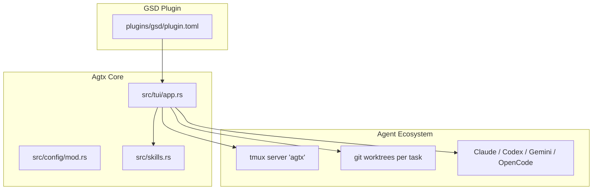
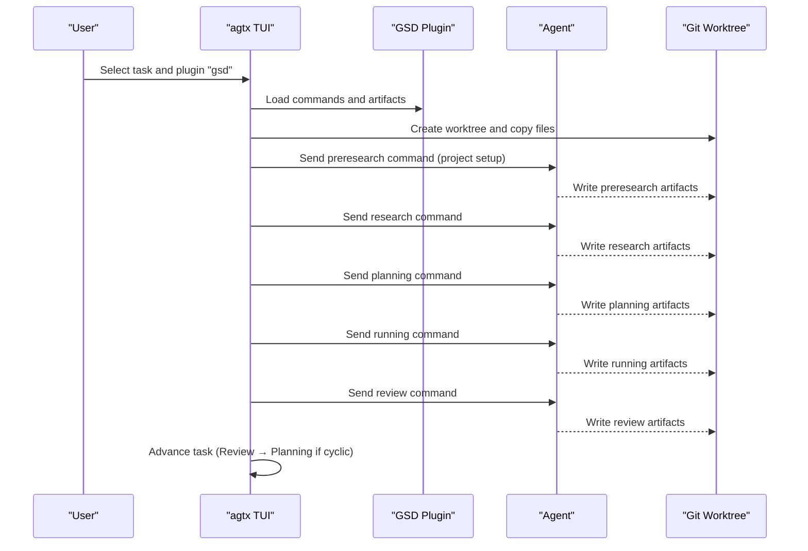
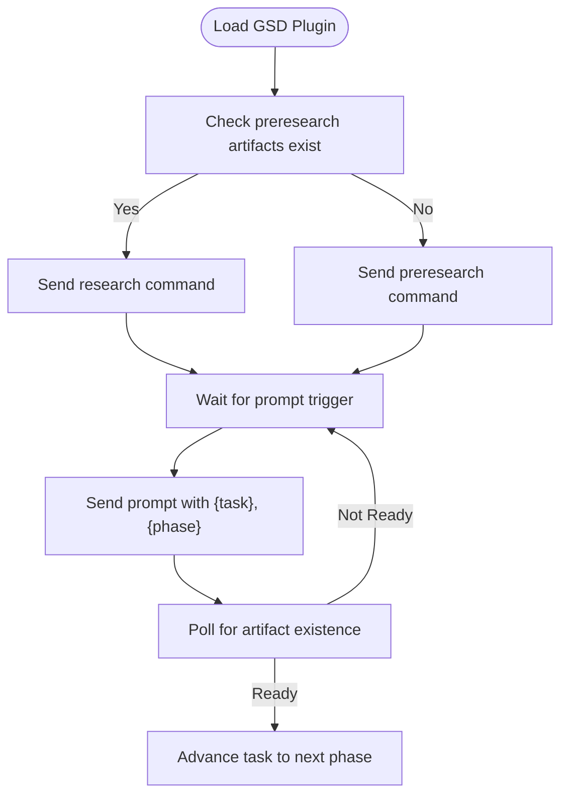
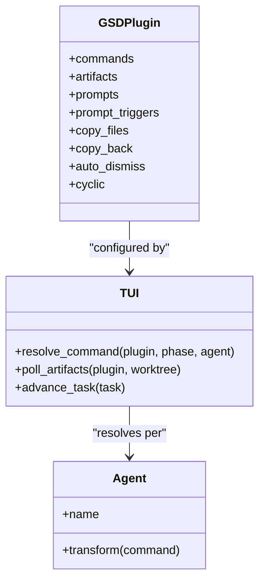
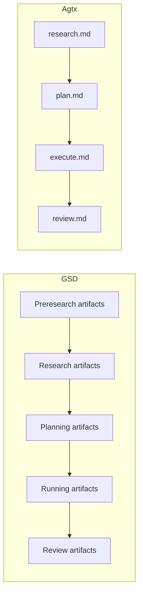
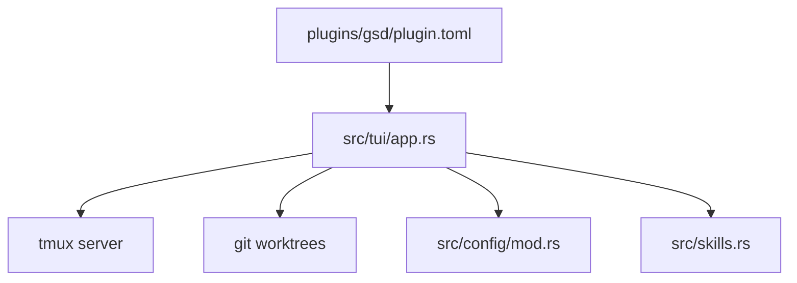

# GSD Methodology

<cite>
**Referenced Files in This Document**
- [plugin.toml](file://plugins/gsd/plugin.toml)
- [app.rs](file://src/tui/app.rs)
- [app_tests.rs](file://src/tui/app_tests.rs)
- [README.md](file://README.md)
- [CLAUDE.md](file://CLAUDE.md)
- [plugin.toml](file://plugins/agtx/plugin.toml)
- [execute.md](file://plugins/agtx/skills/execute.md)
- [plan.md](file://plugins/agtx/skills/plan.md)
- [research.md](file://plugins/agtx/skills/research.md)
- [review.md](file://plugins/agtx/skills/review.md)
</cite>

## Table of Contents
1. [Introduction](#introduction)
2. [Project Structure](#project-structure)
3. [Core Components](#core-components)
4. [Architecture Overview](#architecture-overview)
5. [Detailed Component Analysis](#detailed-component-analysis)
6. [Dependency Analysis](#dependency-analysis)
7. [Performance Considerations](#performance-considerations)
8. [Troubleshooting Guide](#troubleshooting-guide)
9. [Conclusion](#conclusion)

## Introduction
GSD (Get Shit Done) is a rapid execution workflow optimized for speed and immediate value delivery. It emphasizes a structured, spec-driven approach with minimal documentation overhead, focusing on executable results. The methodology uses a cyclic workflow with clearly defined phases and artifact-driven gating to accelerate turnaround while maintaining traceability and quality checkpoints.

Unlike traditional methodologies that often prioritize extensive documentation and approvals, GSD streamlines phases to reduce friction and accelerate delivery. It leverages interactive prompts, automated artifact polling, and a robust plugin system to minimize handoffs and keep teams focused on building.

## Project Structure
The GSD plugin is defined by a single configuration file that declares commands, prompts, artifacts, and behavior for each phase. It integrates with the broader agtx ecosystem to manage tmux sessions, git worktrees, and agent coordination.

**Diagram sources**
- [plugin.toml:1-33](file://plugins/gsd/plugin.toml#L1-L33)
- [app.rs:5304-5323](file://src/tui/app.rs#L5304-L5323)
- [CLAUDE.md:50-92](file://CLAUDE.md#L50-L92)

**Section sources**
- [plugin.toml:1-33](file://plugins/gsd/plugin.toml#L1-L33)
- [CLAUDE.md:50-92](file://CLAUDE.md#L50-L92)

## Core Components
- Plugin configuration: Defines commands, prompts, artifacts, and behavior for each phase.
- Phase gating: Artifacts signal readiness to advance; copy_back propagates shared outputs.
- Cyclic workflow: Review → Planning transitions enable iterative cycles with phase counters.
- Preresearch fallback: One-time project setup command runs before regular research.
- Auto-dismiss: Interactive prompts are auto-handled to reduce friction.

Key characteristics:
- Minimal documentation overhead: Artifacts replace lengthy reports.
- Rapid iteration: Cyclic phases allow continuous delivery loops.
- Agent-agnostic commands: Canonical commands are transformed per agent.
- Spec-driven execution: Artifacts and prompts enforce structured progression.

**Section sources**
- [plugin.toml:1-33](file://plugins/gsd/plugin.toml#L1-L33)
- [app.rs:5304-5323](file://src/tui/app.rs#L5304-L5323)

## Architecture Overview
GSD operates within agtx’s task lifecycle. Each task runs in its own tmux window and git worktree. The plugin configures commands per phase; agtx resolves commands per agent, sends prompts when triggers appear, polls for artifacts, and advances tasks automatically upon completion.

**Diagram sources**
- [plugin.toml:8-20](file://plugins/gsd/plugin.toml#L8-L20)
- [app.rs:5304-5323](file://src/tui/app.rs#L5304-L5323)
- [CLAUDE.md:506-547](file://CLAUDE.md#L506-L547)

## Detailed Component Analysis

### GSD Plugin Configuration
The GSD plugin defines:
- Commands: Canonical slash commands per phase, with {phase} substitution for cyclic workflows.
- Artifacts: File paths that signal phase completion; supports wildcards and {phase}.
- Prompts: Templates injected after commands; includes a research prompt.
- Prompt triggers: Text patterns waited for before sending prompts.
- Copy files: Initial project files copied into worktrees.
- Copy back: Artifacts propagated from worktree to project root on completion.
- Auto-dismiss: Rules to auto-handle interactive prompts.

**Diagram sources**
- [plugin.toml:8-26](file://plugins/gsd/plugin.toml#L8-L26)
- [app.rs:5304-5323](file://src/tui/app.rs#L5304-L5323)

**Section sources**
- [plugin.toml:1-33](file://plugins/gsd/plugin.toml#L1-L33)

### Phase Mapping and Artifacts
GSD maps phases to specific artifact files:
- Preresearch: Project-level configuration and planning documents.
- Research: Phase-specific context files.
- Planning: Phase-specific plan files.
- Running: Phase-specific summary files.
- Review: Phase-specific UAT files.

This artifact-first design ensures deterministic gating and reduces ambiguity in phase transitions.

**Section sources**
- [plugin.toml:8-13](file://plugins/gsd/plugin.toml#L8-L13)

### Command Resolution and Agent Compatibility
Commands are written once in canonical form and transformed per agent. GSD supports Claude, Codex, Gemini, and OpenCode. The orchestrator and TUI handle agent switching and prompt injection automatically.

**Diagram sources**
- [plugin.toml:15-26](file://plugins/gsd/plugin.toml#L15-L26)
- [CLAUDE.md:142-146](file://CLAUDE.md#L142-L146)

**Section sources**
- [plugin.toml:15-26](file://plugins/gsd/plugin.toml#L15-L26)
- [CLAUDE.md:142-146](file://CLAUDE.md#L142-L146)

### Comparison with Agtx Default Workflow
While GSD focuses on rapid execution with cyclic phases and artifact-driven gating, the agtx default workflow provides built-in skills for research, planning, execution, and review. Both share the same underlying architecture (tmux, git worktrees, agent coordination), but GSD minimizes documentation overhead and accelerates delivery.

**Diagram sources**
- [plugin.toml:8-13](file://plugins/gsd/plugin.toml#L8-L13)
- [plugin.toml:5-9](file://plugins/agtx/plugin.toml#L5-L9)

**Section sources**
- [plugin.toml:8-13](file://plugins/gsd/plugin.toml#L8-L13)
- [plugin.toml:5-9](file://plugins/agtx/plugin.toml#L5-L9)

### Best Practices for Adopting GSD
- Start with preresearch: Use the project setup command to establish baseline planning documents.
- Keep artifacts small and focused: Emphasize executable outputs over verbose documentation.
- Leverage cyclic phases: Iterate quickly by moving Review → Planning with incremented phase counters.
- Automate repetitive prompts: Configure auto-dismiss rules to reduce manual intervention.
- Align agents per phase: Assign agents that best suit each phase (e.g., research, implementation, review).
- Monitor merge conflicts: Use built-in conflict checks and resolution skills during Review.

**Section sources**
- [plugin.toml:28-33](file://plugins/gsd/plugin.toml#L28-L33)
- [README.md:604-646](file://README.md#L604-L646)

### Ideal Project Types
GSD excels for:
- Feature delivery with tight feedback loops.
- Prototyping and MVP development.
- Maintenance tasks requiring quick fixes and validations.
- Teams needing predictable, artifact-driven progress with minimal ceremony.

[No sources needed since this section provides general guidance]

### Balancing Speed with Quality Assurance
- Use UAT artifacts in Review to validate behavior.
- Employ the merge-conflict resolution skill to maintain clean histories.
- Keep phase plans concise but actionable to reduce rework.
- Encourage early, frequent reviews to surface issues before they compound.

**Section sources**
- [plugin.toml:12-13](file://plugins/gsd/plugin.toml#L12-L13)
- [README.md:164-165](file://README.md#L164-L165)

### Trade-offs and Mitigation Strategies
- Trade-off: Reduced documentation overhead may obscure design rationale.
  - Mitigation: Use concise artifact summaries and inline references to decisions.
- Trade-off: Rapid cycles risk introducing technical debt.
  - Mitigation: Enforce UAT and review artifacts; schedule retrospectives within cycles.
- Trade-off: Auto-dismiss rules may mask critical user choices.
  - Mitigation: Limit auto-dismiss to non-critical prompts; escalate ambiguous decisions.
- Trade-off: Cyclic workflows can accumulate complexity if phases grow unbounded.
  - Mitigation: Define clear criteria for phase completion and limit cycle scope.

**Section sources**
- [plugin.toml:31-33](file://plugins/gsd/plugin.toml#L31-L33)
- [app_tests.rs:3190-3202](file://src/tui/app_tests.rs#L3190-L3202)

## Dependency Analysis
GSD relies on agtx’s plugin system, tmux integration, and git worktrees. The plugin configuration determines how commands are resolved per agent and how artifacts gate transitions.

**Diagram sources**
- [plugin.toml:1-33](file://plugins/gsd/plugin.toml#L1-L33)
- [app.rs:5304-5323](file://src/tui/app.rs#L5304-L5323)
- [CLAUDE.md:50-92](file://CLAUDE.md#L50-L92)

**Section sources**
- [plugin.toml:1-33](file://plugins/gsd/plugin.toml#L1-L33)
- [app.rs:5304-5323](file://src/tui/app.rs#L5304-L5323)

## Performance Considerations
- Artifact polling: Efficiently detects completion without constant manual checks.
- Caching: Plugin instances are cached per task to avoid repeated disk reads.
- Background operations: Phase status polling and async operations improve responsiveness.
- Minimal overhead: Auto-dismiss and prompt triggers reduce idle time and manual intervention.

[No sources needed since this section provides general guidance]

## Troubleshooting Guide
Common issues and resolutions:
- Phase stuck: If a task remains idle, the orchestrator reads the agent pane and either nudges or escalates to the user.
- Missing artifacts: Ensure artifact paths match plugin configuration; verify {phase} substitution in cyclic workflows.
- Agent command mismatches: Confirm agent compatibility and command transformations.
- Preresearch artifacts not found: Run the preresearch command to initialize project-level planning documents.

**Section sources**
- [app.rs:5304-5323](file://src/tui/app.rs#L5304-L5323)
- [app_tests.rs:2621-2643](file://src/tui/app_tests.rs#L2621-L2643)
- [README.md:604-646](file://README.md#L604-L646)

## Conclusion
GSD delivers a pragmatic, artifact-driven workflow that prioritizes speed and immediate value while maintaining structure and traceability. By minimizing documentation overhead and leveraging cyclic phases, it accelerates delivery without sacrificing quality checkpoints. Teams adopting GSD should emphasize concise artifacts, automated prompt handling, and disciplined review practices to balance rapid iteration with reliability.