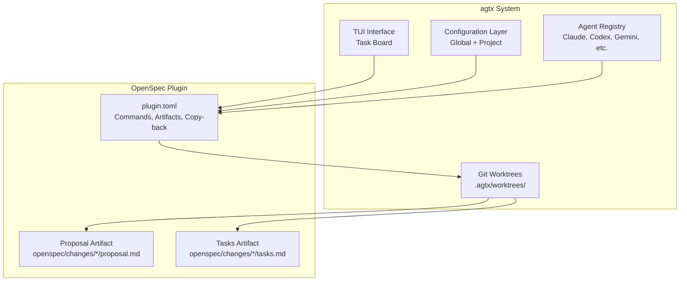
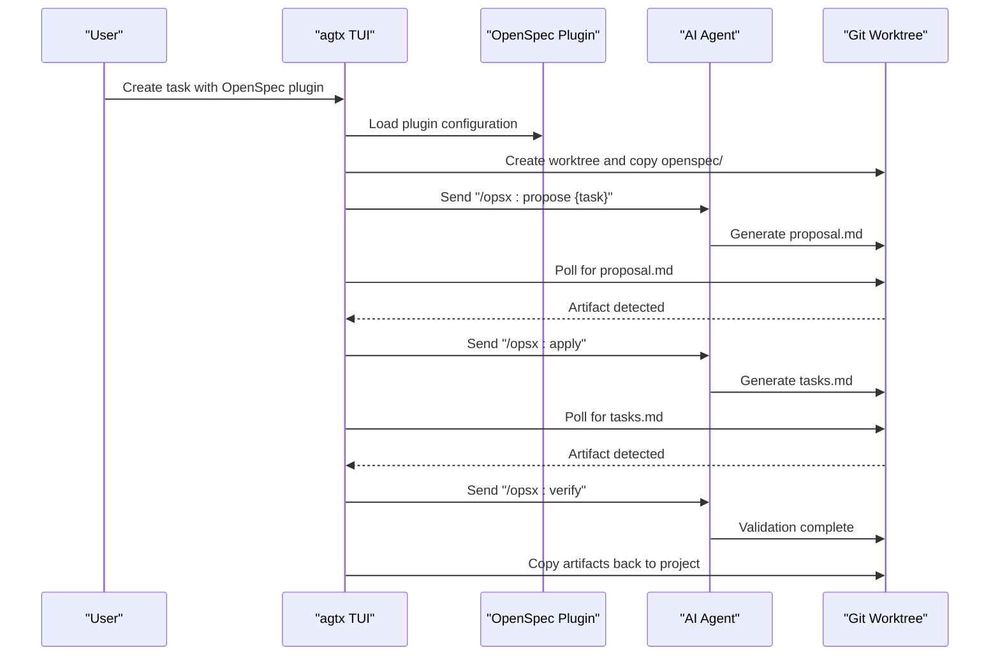
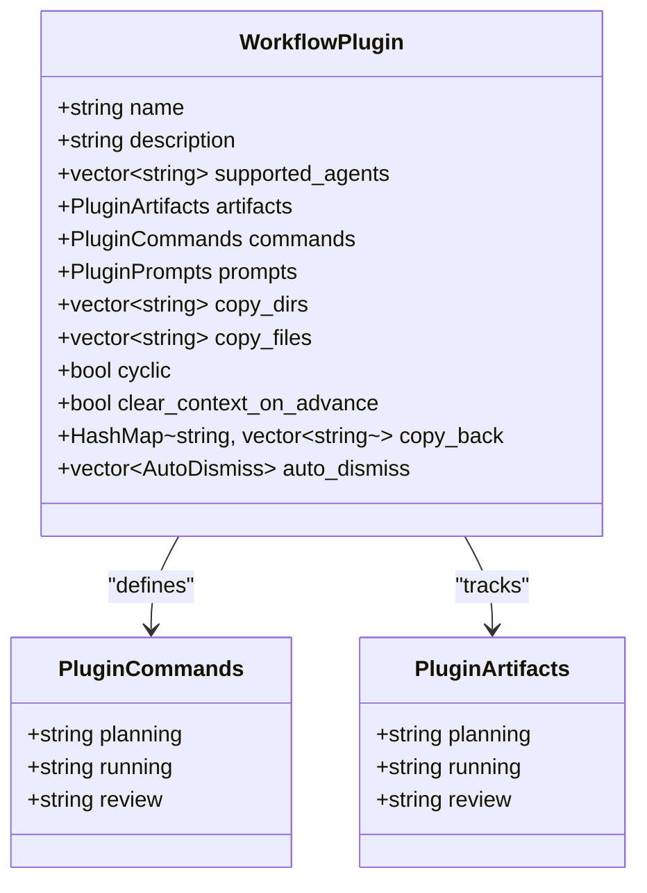
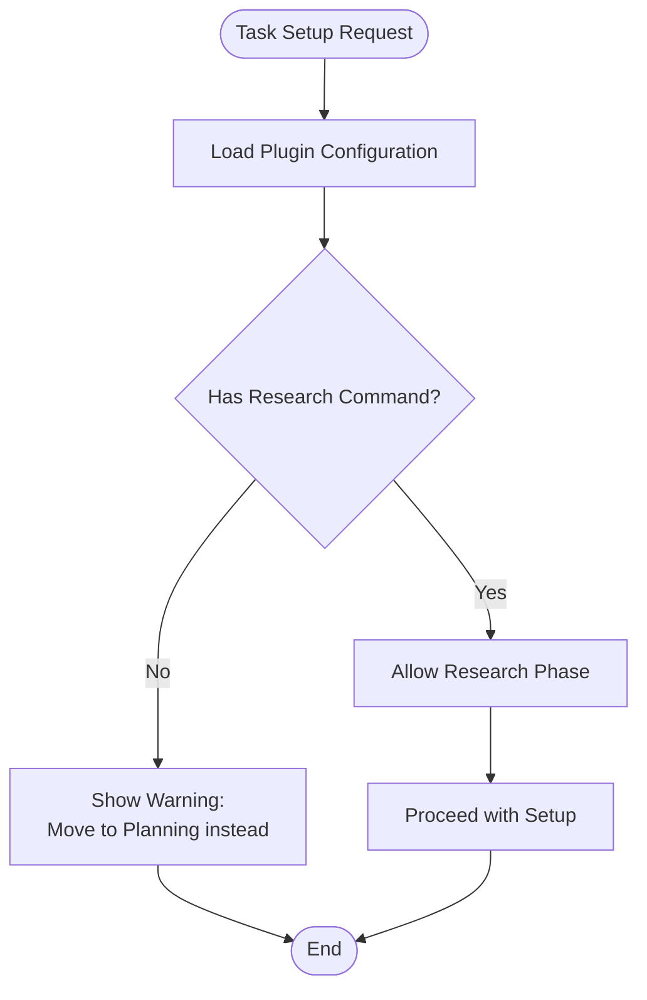
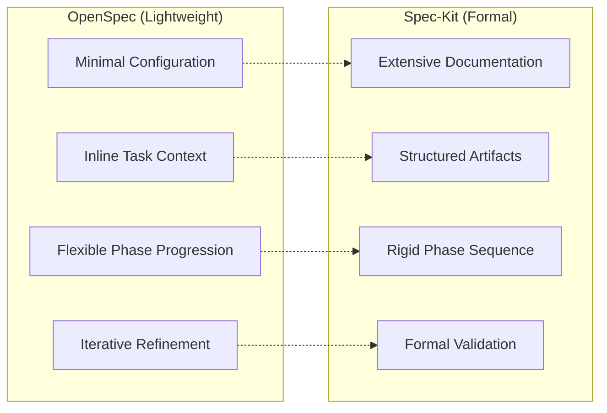
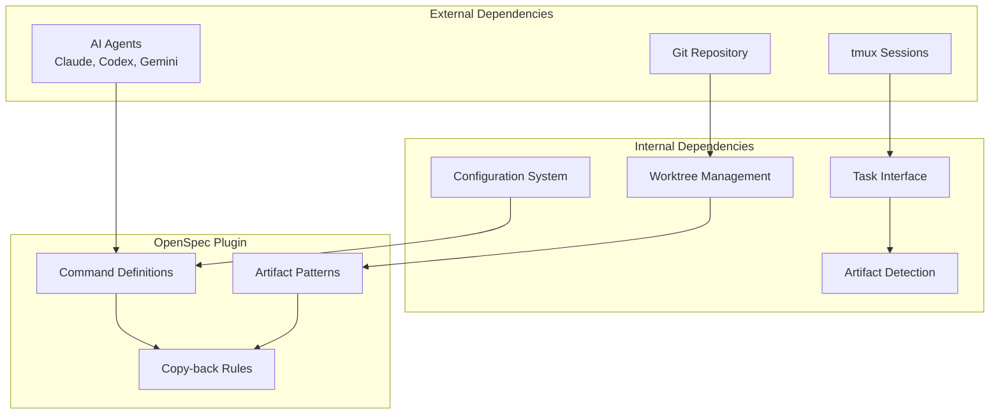

# OpenSpec Lightweight Framework

<cite>
**Referenced Files in This Document**
- [plugin.toml](file://plugins/openspec/plugin.toml)
- [README.md](file://README.md)
- [app.rs](file://src/tui/app.rs)
- [config/mod.rs](file://src/config/mod.rs)
- [skills.rs](file://src/skills.rs)
- [plugin.toml](file://plugins/spec-kit/plugin.toml)
</cite>

## Table of Contents
1. [Introduction](#introduction)
2. [Project Structure](#project-structure)
3. [Core Components](#core-components)
4. [Architecture Overview](#architecture-overview)
5. [Detailed Component Analysis](#detailed-component-analysis)
6. [Dependency Analysis](#dependency-analysis)
7. [Performance Considerations](#performance-considerations)
8. [Troubleshooting Guide](#troubleshooting-guide)
9. [Conclusion](#conclusion)

## Introduction
OpenSpec is a lightweight AI-guided specification framework plugin for the agtx system. It enables flexible, AI-assisted specification creation without the overhead of formal documentation processes. Unlike heavier frameworks that mandate extensive documentation artifacts, OpenSpec focuses on iterative, practical specification development that adapts to project needs and team preferences. This makes it ideal for diverse development scenarios where speed and adaptability are prioritized over rigid process adherence.

The framework balances structure and flexibility by providing:
- Minimal ceremony around specification creation
- AI-assisted generation, refinement, and validation of specifications
- Seamless integration with agtx's multi-agent orchestration
- Support for both small teams and large projects
- Compatibility across different agent types and workflows

## Project Structure
OpenSpec is packaged as a plugin within the agtx ecosystem. The plugin configuration defines how OpenSpec integrates with the broader system, including command mappings, artifact detection, and worktree synchronization.

**Diagram sources**
- [plugin.toml:1-21](file://plugins/openspec/plugin.toml#L1-L21)
- [README.md:506-547](file://README.md#L506-L547)

**Section sources**
- [plugin.toml:1-21](file://plugins/openspec/plugin.toml#L1-L21)
- [README.md:506-547](file://README.md#L506-L547)

## Core Components
OpenSpec's plugin configuration defines three primary phases and their associated commands and artifacts:

- Planning Phase: Uses the `/opsx:propose {task}` command with inline task context. Artifacts are stored under `openspec/changes/*/proposal.md`.
- Running Phase: Uses the `/opsx:apply` command (no inline task context). Artifacts are stored under `openspec/changes/*/tasks.md`.
- Review Phase: Uses the `/opsx:verify` command for validation and quality checks.

The plugin also configures automatic copying of the `openspec/` directory into worktrees and copying artifacts back to the project root after planning completion.

Key characteristics:
- Inline task context in planning eliminates the need for separate prompts
- Research phase is optional and can be bypassed in favor of direct planning
- Artifacts drive phase gating and automation
- Minimal configuration overhead compared to formal specification frameworks

**Section sources**
- [plugin.toml:7-20](file://plugins/openspec/plugin.toml#L7-L20)

## Architecture Overview
OpenSpec integrates seamlessly with agtx's task lifecycle and multi-agent orchestration system. The framework leverages agtx's tmux-based agent sessions, git worktrees for isolation, and automated artifact polling to maintain workflow continuity.

**Diagram sources**
- [plugin.toml:7-20](file://plugins/openspec/plugin.toml#L7-L20)
- [README.md:506-547](file://README.md#L506-L547)

## Detailed Component Analysis

### Plugin Configuration and Commands
OpenSpec's plugin configuration establishes the foundation for AI-guided specification development:

**Diagram sources**
- [config/mod.rs:410-451](file://src/config/mod.rs#L410-L451)

The OpenSpec plugin specifically configures:
- Planning command: `/opsx:propose {task}` with inline task context
- Running command: `/opsx:apply` (no inline context)
- Review command: `/opsx:verify`
- Artifacts: proposal.md and tasks.md in openspec/changes/*/ directory
- Copy-back: openspec directory after planning completion

**Section sources**
- [plugin.toml:1-21](file://plugins/openspec/plugin.toml#L1-L21)

### Phase Gating and Research Integration
OpenSpec's design allows for flexible phase progression. The system checks whether a plugin has research commands to determine if the research phase should be enforced:

**Diagram sources**
- [app.rs:5236-5247](file://src/tui/app.rs#L5236-L5247)

This design enables OpenSpec to bypass research when not needed, allowing teams to move directly from backlog to planning based on the task description.

**Section sources**
- [app.rs:5236-5247](file://src/tui/app.rs#L5236-L5247)

### AI Integration Features
OpenSpec leverages agtx's AI agent integration for specification generation and refinement:

- **Specification Generation**: The `/opsx:propose {task}` command initiates AI-assisted specification creation using the task description as context
- **Refinement Process**: Subsequent iterations can refine proposals based on feedback loops within the worktree environment
- **Validation**: The `/opsx:verify` command enables quality checks and validation of implemented specifications
- **Artifact-Driven Workflow**: Automated polling of proposal.md and tasks.md files maintains workflow continuity without manual intervention

The framework's AI integration is agent-agnostic, supporting Claude, Codex, Gemini, and other compatible agents through agtx's unified interface.

**Section sources**
- [plugin.toml:11-14](file://plugins/openspec/plugin.toml#L11-L14)
- [README.md:349-366](file://README.md#L349-L366)

### Comparison with Formal Specification Approaches
When comparing OpenSpec to more formal specification frameworks like Spec-Kit, several key differences emerge:

**Diagram sources**
- [plugin.toml:1-21](file://plugins/openspec/plugin.toml#L1-L21)
- [plugin.toml:1-21](file://plugins/spec-kit/plugin.toml#L1-L21)

Key advantages of OpenSpec for diverse scenarios:
- **Reduced Overhead**: Eliminates extensive documentation requirements
- **Adaptive Process**: Allows skipping phases based on project needs
- **Team Flexibility**: Supports varying team sizes and expertise levels
- **Development Speed**: Enables rapid iteration without process bottlenecks

**Section sources**
- [plugin.toml:1-21](file://plugins/spec-kit/plugin.toml#L1-L21)

## Dependency Analysis
OpenSpec's plugin configuration establishes clear dependencies and integration points within the agtx ecosystem:

**Diagram sources**
- [config/mod.rs:410-451](file://src/config/mod.rs#L410-L451)
- [README.md:506-547](file://README.md#L506-L547)

The plugin's dependencies are intentionally minimal, focusing on:
- Configuration system for agent and worktree settings
- TUI integration for task management
- Git worktree infrastructure for isolation
- Artifact-based workflow automation

**Section sources**
- [config/mod.rs:410-451](file://src/config/mod.rs#L410-L451)
- [README.md:506-547](file://README.md#L506-L547)

## Performance Considerations
OpenSpec is optimized for performance through several design choices:

- **Minimal Configuration Overhead**: Reduces parsing and validation time during plugin loading
- **Efficient Artifact Polling**: Targeted file watching reduces CPU usage
- **Worktree Isolation**: Separates AI agent sessions to prevent resource contention
- **Lazy Initialization**: Commands are executed only when needed, reducing unnecessary agent interactions

The framework scales efficiently across different project sizes because:
- Small projects benefit from reduced ceremony and faster iteration cycles
- Large projects leverage the same streamlined process while adding appropriate safeguards
- Team size flexibility accommodates both individual contributors and large teams

## Troubleshooting Guide
Common issues and solutions when using OpenSpec:

**Issue**: Research phase unavailable
- Cause: OpenSpec plugin has no research command configured
- Solution: Move directly to Planning phase or add research command to plugin configuration

**Issue**: Planning artifacts not detected
- Cause: Proposal generation failed or artifact path incorrect
- Solution: Verify openspec/changes/*/proposal.md exists and matches configured pattern

**Issue**: Running phase blocked
- Cause: Required planning artifacts not found
- Solution: Complete planning phase and ensure proposal.md is generated

**Issue**: Agent compatibility problems
- Cause: Selected agent not supported by OpenSpec commands
- Solution: Verify agent compatibility or adjust plugin configuration

**Section sources**
- [app.rs:5236-5247](file://src/tui/app.rs#L5236-L5247)
- [plugin.toml:7-20](file://plugins/openspec/plugin.toml#L7-L20)

## Conclusion
OpenSpec provides an elegant solution for AI-guided specification development that balances structure with flexibility. Its lightweight approach enables teams to harness AI assistance for specification creation without the overhead of formal documentation processes. The framework's adaptability across different project types and team sizes, combined with seamless integration into agtx's multi-agent orchestration system, makes it an excellent choice for organizations seeking development agility while maintaining specification quality.

The key strengths of OpenSpec include its minimal configuration requirements, flexible phase progression, AI-assisted generation and validation capabilities, and efficient artifact-driven workflow automation. These features enable rapid iteration and continuous improvement of specifications while preserving the quality and rigor needed for successful software development.

For teams that require more formal specification processes, alternatives like Spec-Kit remain available within the agtx ecosystem. However, for most development scenarios where speed and adaptability are priorities, OpenSpec offers an optimal balance between structure and flexibility.