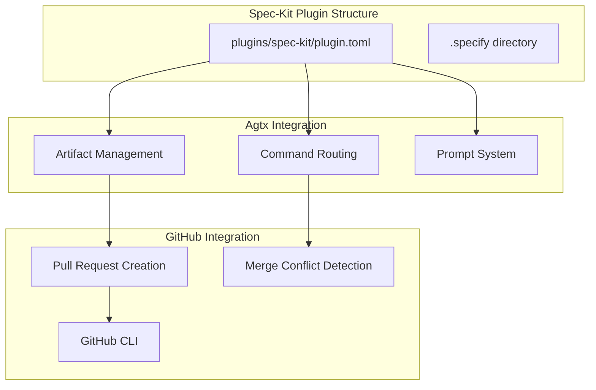
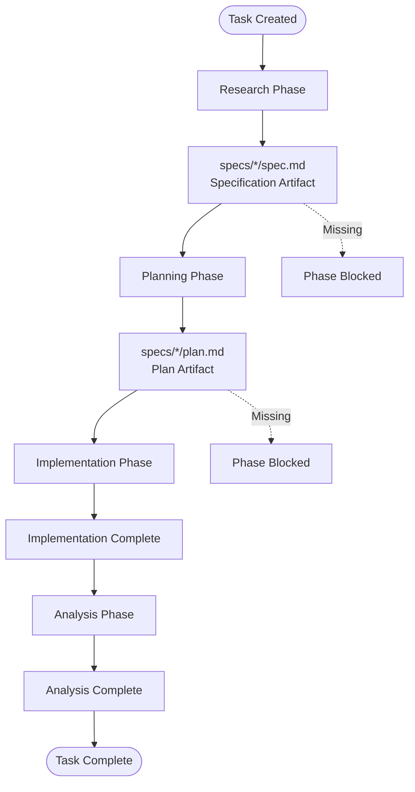
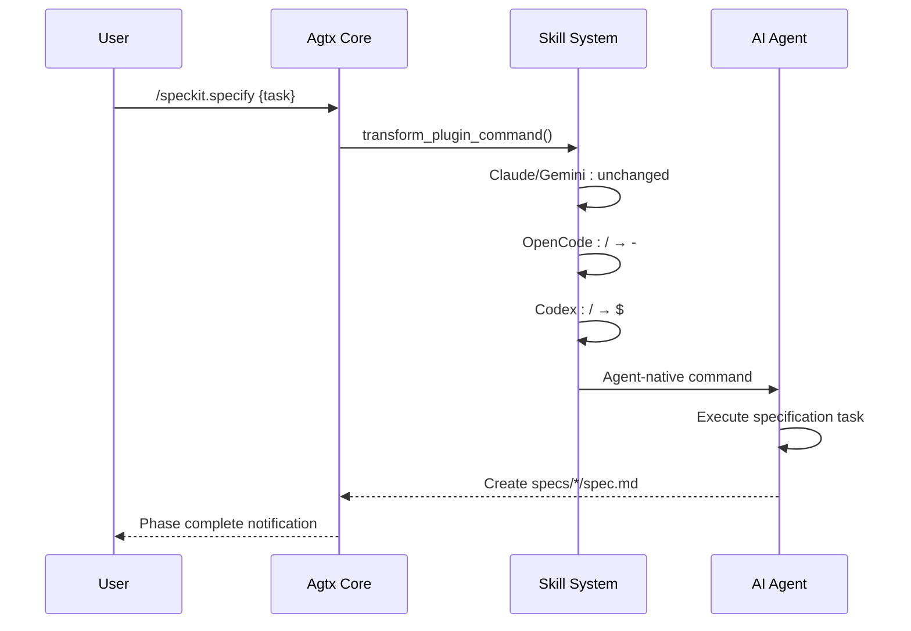
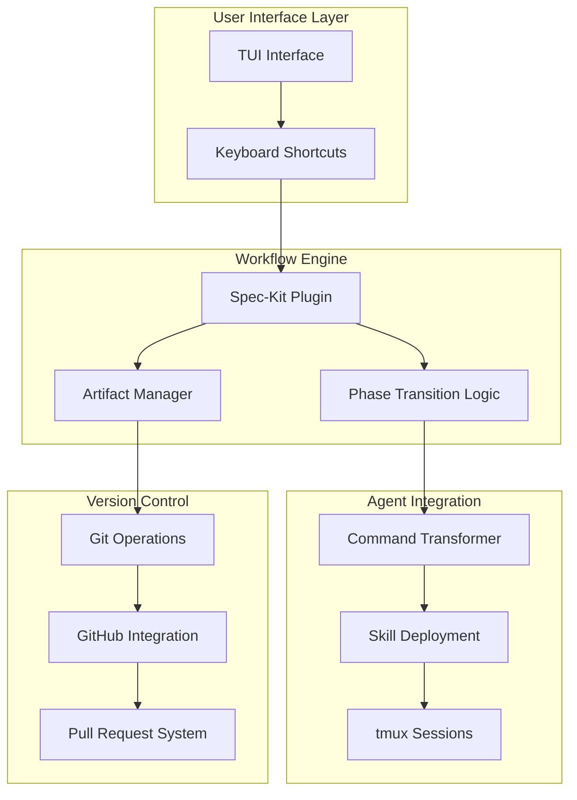
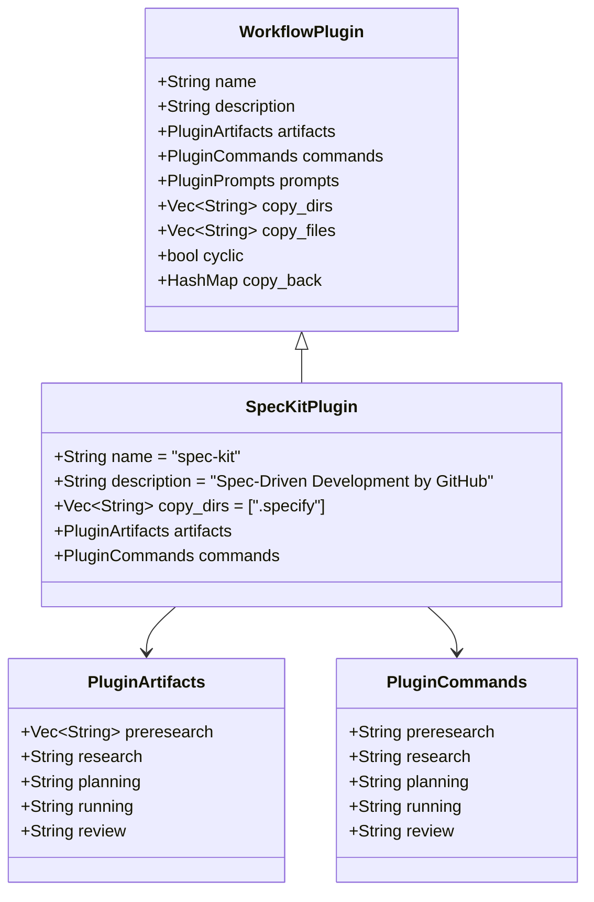
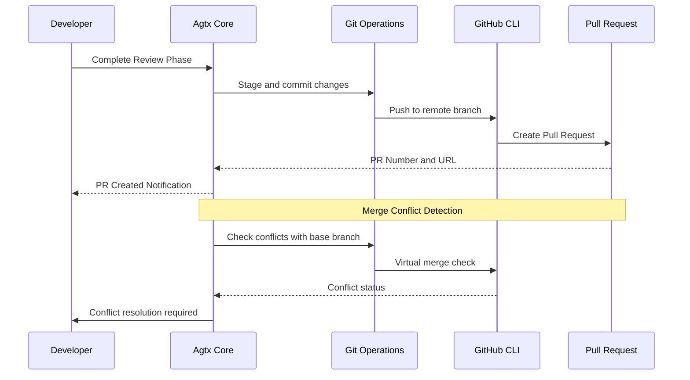
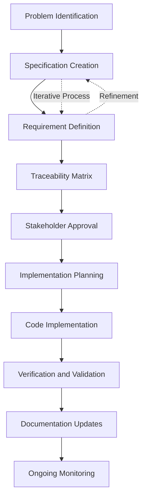
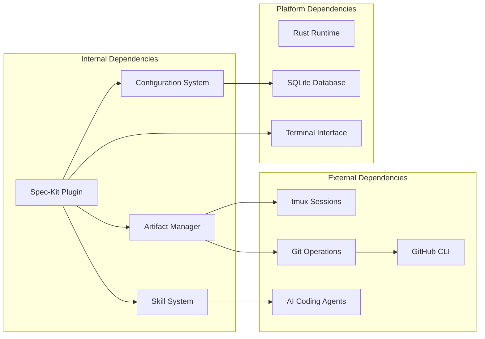

# Spec-Kit Framework

<cite>
**Referenced Files in This Document**
- [plugin.toml](file://plugins/spec-kit/plugin.toml)
- [README.md](file://README.md)
- [CLAUDE.md](file://CLAUDE.md)
- [provider.rs](file://src/git/provider.rs)
- [app.rs](file://src/tui/app.rs)
- [app_tests.rs](file://src/tui/app_tests.rs)
- [skills.rs](file://src/skills.rs)
</cite>

## Table of Contents
1. [Introduction](#introduction)
2. [Project Structure](#project-structure)
3. [Core Components](#core-components)
4. [Architecture Overview](#architecture-overview)
5. [Detailed Component Analysis](#detailed-component-analysis)
6. [Dependency Analysis](#dependency-analysis)
7. [Performance Considerations](#performance-considerations)
8. [Troubleshooting Guide](#troubleshooting-guide)
9. [Conclusion](#conclusion)

## Introduction
Spec-Kit is GitHub's specification-driven development framework integrated into the agtx workflow system. It emphasizes formal documentation, detailed planning, and comprehensive traceability before implementation begins. The framework transforms specifications into executable artifacts through a structured four-phase process: research/specification, planning, implementation, and analysis/review. This approach ensures that every change is grounded in well-defined requirements and maintainable documentation.

The Spec-Kit plugin integrates seamlessly with agtx's task lifecycle, providing artifact-based phase gating, cross-agent compatibility, and GitHub workflow integration. Specifications are stored as Markdown files in a standardized directory structure, enabling traceability and version control while maintaining flexibility for team-specific adaptations.

## Project Structure
The Spec-Kit framework is organized as a plugin within the agtx ecosystem, leveraging the platform's modular architecture for workflow customization.

**Diagram sources**
- [plugin.toml:1-21](file://plugins/spec-kit/plugin.toml#L1-L21)
- [README.md:340-341](file://README.md#L340-L341)

The plugin configuration defines the core workflow phases and artifact expectations. The `.specify` directory contains the command definitions that agents use to execute Spec-Kit operations. This structure enables seamless integration with multiple AI coding agents while maintaining consistent behavior across different platforms.

**Section sources**
- [plugin.toml:1-21](file://plugins/spec-kit/plugin.toml#L1-L21)
- [README.md:329-347](file://README.md#L329-L347)

## Core Components
The Spec-Kit framework consists of several interconnected components that work together to enforce specification-driven development practices.

### Artifact-Based Phase Management
Spec-Kit uses a file-based artifact system to control workflow progression. Each phase produces a specific artifact file that signals completion and enables the next phase to begin.

**Diagram sources**
- [plugin.toml:10-18](file://plugins/spec-kit/plugin.toml#L10-L18)

### Cross-Agent Command Transformation
The framework supports multiple AI coding agents through a unified command interface that automatically adapts to each agent's syntax requirements.

**Diagram sources**
- [skills.rs:93-115](file://src/skills.rs#L93-L115)
- [plugin.toml:14-18](file://plugins/spec-kit/plugin.toml#L14-L18)

**Section sources**
- [plugin.toml:10-18](file://plugins/spec-kit/plugin.toml#L10-L18)
- [skills.rs:93-115](file://src/skills.rs#L93-L115)

## Architecture Overview
The Spec-Kit framework operates within agtx's broader architecture, integrating with the task lifecycle, artifact management, and GitHub workflow systems.

**Diagram sources**
- [CLAUDE.md:506-547](file://CLAUDE.md#L506-L547)
- [README.md:105-164](file://README.md#L105-L164)

The architecture ensures that Spec-Kit enforces specification-driven development while maintaining flexibility for team-specific adaptations. The plugin system allows for easy extension and customization without modifying the core agtx functionality.

**Section sources**
- [CLAUDE.md:506-547](file://CLAUDE.md#L506-L547)
- [README.md:105-164](file://README.md#L105-L164)

## Detailed Component Analysis

### Plugin Configuration and Artifact Management
The Spec-Kit plugin configuration defines the workflow structure and artifact expectations that drive the specification process.

**Diagram sources**
- [plugin.toml:1-21](file://plugins/spec-kit/plugin.toml#L1-L21)

The artifact management system uses glob patterns to support flexible directory structures while maintaining consistent artifact identification. The research phase expects a specification document, and the planning phase requires a detailed implementation plan.

**Section sources**
- [plugin.toml:10-18](file://plugins/spec-kit/plugin.toml#L10-L18)

### GitHub Workflow Integration
Spec-Kit integrates with GitHub's pull request workflow through automated PR creation and merge conflict detection.

**Diagram sources**
- [provider.rs:21-38](file://src/git/provider.rs#L21-L38)
- [app.rs:7532-7561](file://src/tui/app.rs#L7532-L7561)

The integration leverages the GitHub CLI for PR operations and includes sophisticated merge conflict detection using Git's merge-tree functionality. This ensures that pull requests are only created when the code is ready and conflicts are properly resolved.

**Section sources**
- [provider.rs:21-38](file://src/git/provider.rs#L21-L38)
- [app.rs:7532-7561](file://src/tui/app.rs#L7532-L7561)

### Specification Creation and Management
The framework provides structured approaches for creating and managing specifications that serve as the foundation for all development work.

The specification process emphasizes detailed requirement definition, stakeholder alignment, and comprehensive traceability. Each specification serves as a contract between stakeholders and developers, ensuring that implementation aligns with business objectives and technical constraints.

**Section sources**
- [plugin.toml:14-18](file://plugins/spec-kit/plugin.toml#L14-L18)

## Dependency Analysis
The Spec-Kit framework has well-defined dependencies that enable its integration with the broader agtx ecosystem and external systems.

**Diagram sources**
- [CLAUDE.md:42-54](file://CLAUDE.md#L42-L54)
- [README.md:100-104](file://README.md#L100-L104)

The dependency structure ensures that Spec-Kit can operate independently while leveraging the robust infrastructure provided by agtx. The modular design allows for easy replacement of individual components without affecting the overall system stability.

**Section sources**
- [CLAUDE.md:42-54](file://CLAUDE.md#L42-L54)
- [README.md:100-104](file://README.md#L100-L104)

## Performance Considerations
The Spec-Kit framework is designed for efficiency and scalability while maintaining the rigor required for specification-driven development.

### Artifact Polling and Caching
The framework implements intelligent caching mechanisms to minimize unnecessary file system operations during phase transitions. Artifact detection uses glob patterns with efficient matching algorithms that scale well with project size.

### Memory Management
Spec-Kit maintains minimal memory footprint by processing artifacts on-demand and using streaming operations for large file handling. The plugin system is designed to load configurations lazily, reducing startup overhead.

### Concurrency Considerations
The framework supports concurrent task execution through separate tmux sessions and git worktrees, enabling teams to work on multiple specifications simultaneously without interference.

## Troubleshooting Guide

### Common Issues and Solutions

**Artifact Not Detected**
- Verify that specification files are created in the correct location: `specs/{branch-name}/spec.md`
- Check file permissions and ensure the agent has write access to the project directory
- Confirm that the artifact naming follows the expected pattern

**Command Translation Failures**
- Verify that the agent is properly detected and supported
- Check that the plugin configuration matches the agent's command syntax requirements
- Ensure that the .specify directory is properly copied to worktrees

**GitHub Integration Problems**
- Verify that the GitHub CLI is installed and configured
- Check network connectivity and authentication credentials
- Ensure that the repository has proper permissions for PR creation

**Merge Conflict Resolution**
- Use the built-in merge conflict detection to identify problematic changes
- Resolve conflicts systematically, focusing on specification compliance
- Verify that all stakeholder approvals are maintained after conflict resolution

**Section sources**
- [app_tests.rs:2323-2376](file://src/tui/app_tests.rs#L2323-L2376)
- [provider.rs:40-64](file://src/git/provider.rs#L40-L64)

## Conclusion
The Spec-Kit framework represents a comprehensive approach to specification-driven development that balances rigor with practical implementation. By emphasizing detailed planning, requirement definition, and comprehensive documentation, it provides a solid foundation for complex software development projects.

The framework's integration with agtx's task lifecycle, artifact management, and GitHub workflows creates a cohesive development environment that supports both individual contributors and large teams. The cross-agent compatibility ensures that teams can leverage their preferred AI coding tools while maintaining specification discipline.

Key benefits of the Spec-Kit approach include:
- Enhanced requirement traceability and stakeholder alignment
- Reduced rework through detailed upfront planning
- Improved quality through structured specification reviews
- Seamless integration with existing development workflows
- Flexible adaptation to team-specific needs

The framework's emphasis on formal documentation and traceability makes it particularly valuable for regulated environments, large organizations, and projects requiring extensive documentation and audit trails. Its modular design and plugin architecture ensure that it can evolve with changing requirements while maintaining consistency and reliability.