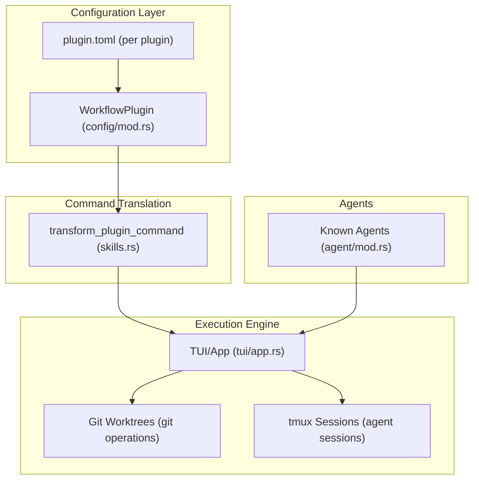
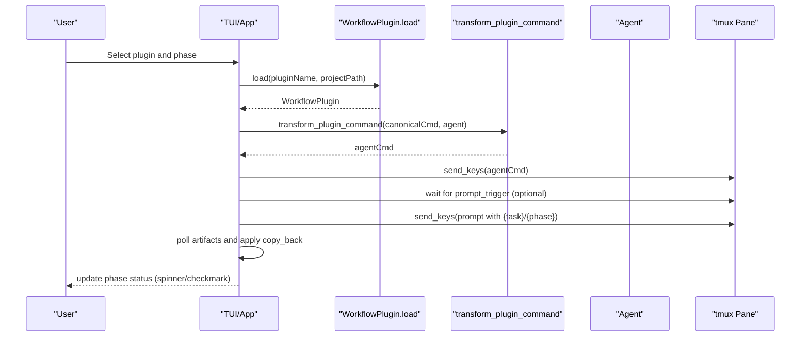
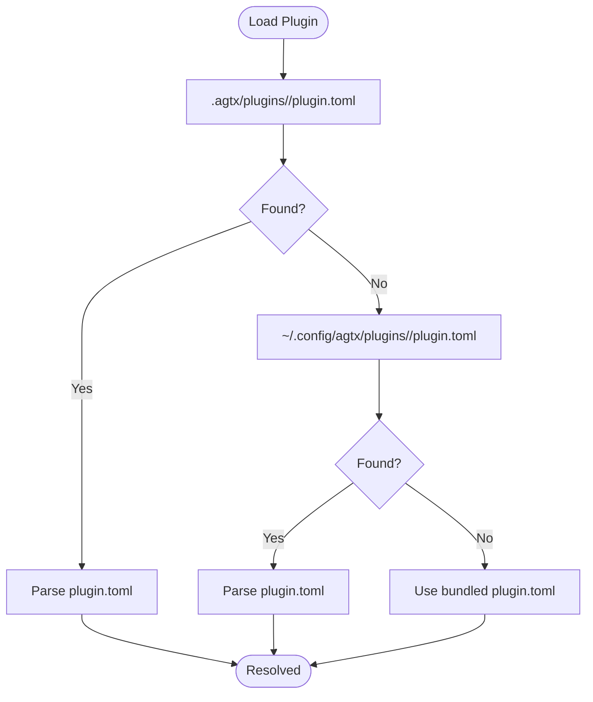
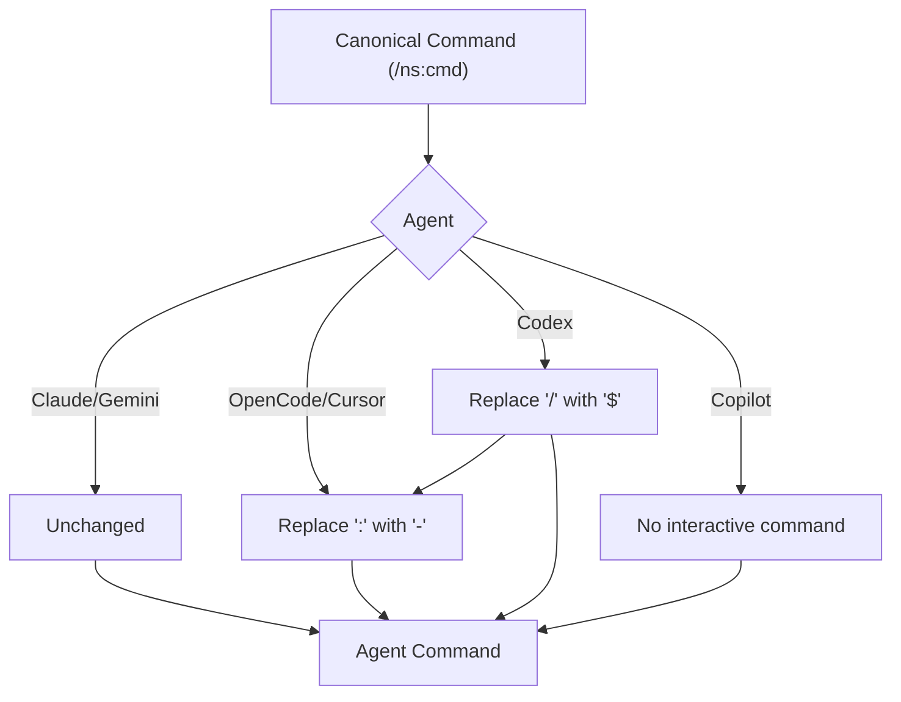
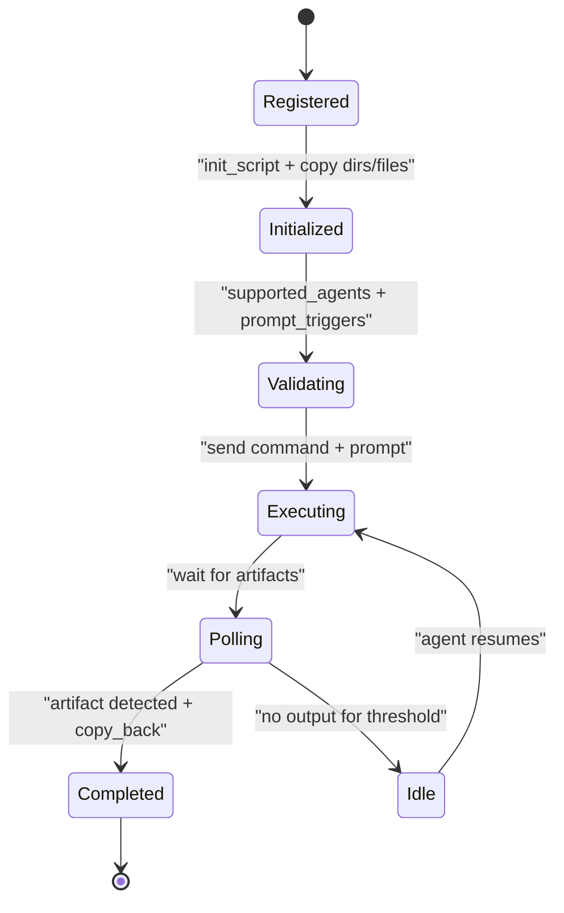
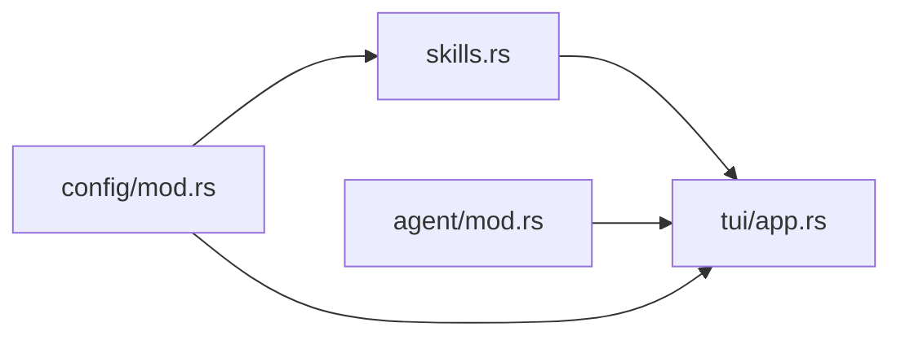

# Plugin Architecture

<cite>
**Referenced Files in This Document**
- [README.md](file://README.md)
- [CLAUDE.md](file://CLAUDE.md)
- [Cargo.toml](file://Cargo.toml)
- [src/config/mod.rs](file://src/config/mod.rs)
- [src/skills.rs](file://src/skills.rs)
- [src/agent/mod.rs](file://src/agent/mod.rs)
- [src/tui/app.rs](file://src/tui/app.rs)
- [plugins/agtx/plugin.toml](file://plugins/agtx/plugin.toml)
- [plugins/agent-skills/plugin.toml](file://plugins/agent-skills/plugin.toml)
- [plugins/bmad/plugin.toml](file://plugins/bmad/plugin.toml)
- [plugins/gsd/plugin.toml](file://plugins/gsd/plugin.toml)
- [plugins/superpowers/plugin.toml](file://plugins/superpowers/plugin.toml)
- [plugins/spec-kit/plugin.toml](file://plugins/spec-kit/plugin.toml)
- [plugins/openspec/plugin.toml](file://plugins/openspec/plugin.toml)
- [plugins/void/plugin.toml](file://plugins/void/plugin.toml)
</cite>

## Table of Contents
1. [Introduction](#introduction)
2. [Project Structure](#project-structure)
3. [Core Components](#core-components)
4. [Architecture Overview](#architecture-overview)
5. [Detailed Component Analysis](#detailed-component-analysis)
6. [Dependency Analysis](#dependency-analysis)
7. [Performance Considerations](#performance-considerations)
8. [Troubleshooting Guide](#troubleshooting-guide)
9. [Conclusion](#conclusion)
10. [Appendices](#appendices)

## Introduction
This document explains the agtx plugin architecture with a focus on the extensible plugin system design and configuration framework. It covers the TOML configuration format for plugins, the plugin loading mechanism, command translation for agent compatibility, artifact-based phase gating, and the lifecycle from registration to execution. It also documents the agent compatibility matrix and provides practical examples for minimal and full plugin configurations, along with guidance for developing, extending, and deploying plugins.

## Project Structure
The plugin system centers around:
- A TOML-based configuration format that defines plugin metadata, commands, prompts, artifacts, and compatibility.
- A loader that resolves plugins from project-local, global, or bundled locations.
- A command translation layer that adapts canonical commands to agent-specific formats.
- A phase gating engine driven by artifact detection and prompt triggers.
- A lifecycle that orchestrates worktree setup, skill deployment, agent switching, and cleanup.

**Diagram sources**
- [src/config/mod.rs:410-594](file://src/config/mod.rs#L410-L594)
- [src/skills.rs:83-115](file://src/skills.rs#L83-L115)
- [src/tui/app.rs:1-200](file://src/tui/app.rs#L1-L200)
- [src/agent/mod.rs:80-122](file://src/agent/mod.rs#L80-L122)

**Section sources**
- [README.md:329-504](file://README.md#L329-L504)
- [CLAUDE.md:111-127](file://CLAUDE.md#L111-L127)

## Core Components
- WorkflowPlugin: Describes a plugin’s metadata, commands, prompts, artifacts, compatibility, and side effects (copy_back, auto_dismiss, cyclic, clear_context_on_advance).
- Plugin loading: Resolves a plugin by name from project-local, global, or bundled sources.
- Command translation: Converts canonical commands to agent-specific formats.
- Phase gating: Determines whether a phase can be entered directly from Backlog based on presence of {task} in command or prompt.
- Agent compatibility: Restricts plugin usage to supported agents via supported_agents.

Key responsibilities:
- Configuration parsing and merging: Global and project-level configuration are merged into a runtime configuration object.
- Plugin resolution: Project-local plugin.toml is preferred; otherwise global; otherwise bundled.
- Command dispatch: Canonical commands are transformed per agent and sent to the agent’s tmux pane.
- Artifact polling: Completion indicators are derived from artifact file presence and copy_back semantics.

**Section sources**
- [src/config/mod.rs:410-594](file://src/config/mod.rs#L410-L594)
- [src/skills.rs:83-115](file://src/skills.rs#L83-L115)
- [src/skills.rs:23-29](file://src/skills.rs#L23-L29)
- [src/skills.rs:512-543](file://src/skills.rs#L512-L543)

## Architecture Overview
The plugin architecture integrates configuration, translation, and execution:

**Diagram sources**
- [src/config/mod.rs:545-572](file://src/config/mod.rs#L545-L572)
- [src/skills.rs:83-115](file://src/skills.rs#L83-L115)
- [src/tui/app.rs:1-200](file://src/tui/app.rs#L1-L200)

## Detailed Component Analysis

### TOML Configuration Format
A plugin is defined by a plugin.toml file containing:
- Metadata: name, description, optional init_script, supported_agents, cyclic, clear_context_on_advance.
- Artifacts: per-phase file globs signaling completion; supports * and {phase}.
- Commands: per-phase slash commands; preresearch for one-time setup; {phase} and {task} placeholders supported.
- Prompts: per-phase prompt templates; {task}, {task_id}, {phase} placeholders.
- Prompt triggers: text to await before sending prompts.
- Copy-back: files/dirs to copy from worktree to project root on completion.
- Auto-dismiss: rules to auto-resolve interactive prompts before sending prompts.
- Copy dirs/files: extra directories and files to copy into worktrees.

Examples:
- Minimal plugin configuration: [plugins/void/plugin.toml:1-4](file://plugins/void/plugin.toml#L1-L4)
- Full reference with all fields: [README.md:394-474](file://README.md#L394-L474)

Compatibility and translation:
- Agent compatibility: supported_agents restricts usage; empty means all agents supported.
- Command translation: canonical commands are transformed per agent (e.g., colon to hyphen, slash to dollar for Codex).

**Section sources**
- [plugins/void/plugin.toml:1-4](file://plugins/void/plugin.toml#L1-L4)
- [plugins/gsd/plugin.toml:1-34](file://plugins/gsd/plugin.toml#L1-L34)
- [plugins/bmad/plugin.toml:1-22](file://plugins/bmad/plugin.toml#L1-L22)
- [plugins/agent-skills/plugin.toml:1-19](file://plugins/agent-skills/plugin.toml#L1-L19)
- [plugins/superpowers/plugin.toml:1-16](file://plugins/superpowers/plugin.toml#L1-L16)
- [plugins/spec-kit/plugin.toml:1-21](file://plugins/spec-kit/plugin.toml#L1-L21)
- [plugins/openspec/plugin.toml:1-21](file://plugins/openspec/plugin.toml#L1-L21)
- [README.md:370-474](file://README.md#L370-L474)

### Plugin Loading Mechanism
Resolution order:
1. Project-local: .agtx/plugins/<name>/plugin.toml
2. Global: ~/.config/agtx/plugins/<name>/plugin.toml
3. Bundled: compile-time embedded plugin.toml

Fallback behavior:
- If a plugin cannot be loaded from disk, the system falls back to bundled plugins to ensure tasks always resolve their plugin.

**Diagram sources**
- [src/config/mod.rs:545-572](file://src/config/mod.rs#L545-L572)
- [src/skills.rs:23-29](file://src/skills.rs#L23-L29)

**Section sources**
- [src/config/mod.rs:545-572](file://src/config/mod.rs#L545-L572)
- [src/skills.rs:23-29](file://src/skills.rs#L23-L29)

### Command Translation System for Agent Compatibility
Commands are written once in canonical format and translated per agent:
- Claude/Gemini: unchanged
- OpenCode/Cursor: colon → hyphen
- Codex: slash → dollar, colon → hyphen
- Copilot: no interactive skill invocation (prompt-only)

**Diagram sources**
- [src/skills.rs:83-115](file://src/skills.rs#L83-L115)

**Section sources**
- [src/skills.rs:83-115](file://src/skills.rs#L83-L115)
- [CLAUDE.md:142-146](file://CLAUDE.md#L142-L146)

### Artifact-Based Phase Gating
Phase gating determines whether a phase can be entered directly from Backlog:
- If a phase’s command or prompt contains {task}, it can be entered directly.
- If neither command nor prompt contains {task}, the phase is gated and requires a prior phase artifact.
- If a phase has no command AND no prompt (e.g., void plugin), it is ungated.

Preresearch fallback:
- If preresearch is configured and no research artifacts exist, preresearch is used instead of research when initiating Research.

Cyclic workflows:
- When cyclic is true, Review → Planning transition is enabled with an incremented phase counter.

**Section sources**
- [src/config/mod.rs:512-543](file://src/config/mod.rs#L512-L543)
- [README.md:476-489](file://README.md#L476-L489)

### Plugin Lifecycle: Registration to Execution
Lifecycle stages:
1. Registration
   - Plugins are discovered from project-local, global, or bundled locations.
   - Bundled plugins are embedded at compile time for reliability.
2. Initialization
   - init_script runs in the worktree before the agent starts (supports {agent} placeholder).
   - copy_dirs and copy_files are merged with project-level settings to populate worktrees.
3. Validation
   - supported_agents validates compatibility with the selected agent.
   - prompt_triggers ensure interactive commands are awaited before sending prompts.
4. Execution
   - Command is sent to the agent via tmux.
   - Prompt is sent with {task}, {task_id}, {phase} substitutions.
   - Artifact polling drives phase completion; copy_back transfers artifacts back to the project root.
5. Cleanup
   - Worktrees and tmux windows are managed according to configuration and task status.

**Diagram sources**
- [src/config/mod.rs:545-572](file://src/config/mod.rs#L545-L572)
- [src/skills.rs:83-115](file://src/skills.rs#L83-L115)
- [src/tui/app.rs:1-200](file://src/tui/app.rs#L1-L200)

**Section sources**
- [src/config/mod.rs:410-594](file://src/config/mod.rs#L410-L594)
- [src/skills.rs:23-29](file://src/skills.rs#L23-L29)
- [CLAUDE.md:335-343](file://CLAUDE.md#L335-L343)

### Agent Compatibility Matrix
The compatibility matrix shows which plugins are supported by Claude, Codex, Gemini, OpenCode, Cursor, and Copilot. Commands are written once in canonical format and translated per agent.

| Plugin | Claude | Codex | Gemini | OpenCode | Cursor | Copilot |
|---|:---:|:---:|:---:|:---:|:---:|:---:|
| agtx | ✅ | ✅ | ✅ | ✅ | ✅ | 🟡 |
| gsd | ✅ | ✅ | ✅ | ✅ | ✅ | ❌ |
| spec-kit | ✅ | ✅ | ✅ | ✅ | ✅ | 🟡 |
| openspec | ✅ | ✅ | ✅ | ✅ | ✅ | 🟡 |
| bmad | ✅ | ✅ | ✅ | ✅ | ✅ | 🟡 |
| superpowers | ✅ | ❌ | ❌ | ❌ | ❌ | ❌ |
| oh-my-claudecode | ✅ | ❌ | ❌ | ❌ | ❌ | ❌ |
| agent-skills | ✅ | 🟡 | 🟡 | 🟡 | 🟡 | 🟡 |
| void | ✅ | ✅ | ✅ | ✅ | ✅ | ✅ |

Legend:
- ✅ Fully supported
- 🟡 Prompt-only, no interactive skill
- ❌ Not supported

**Section sources**
- [README.md:348-368](file://README.md#L348-L368)
- [CLAUDE.md:142-146](file://CLAUDE.md#L142-L146)

### Practical Examples
- Minimal plugin configuration: [plugins/void/plugin.toml:1-4](file://plugins/void/plugin.toml#L1-L4)
- Full reference with all fields: [README.md:394-474](file://README.md#L394-L474)
- Example plugins:
  - GSD: [plugins/gsd/plugin.toml:1-34](file://plugins/gsd/plugin.toml#L1-L34)
  - BMAD: [plugins/bmad/plugin.toml:1-22](file://plugins/bmad/plugin.toml#L1-L22)
  - Agent Skills: [plugins/agent-skills/plugin.toml:1-19](file://plugins/agent-skills/plugin.toml#L1-L19)
  - Superpowers: [plugins/superpowers/plugin.toml:1-16](file://plugins/superpowers/plugin.toml#L1-L16)
  - Spec Kit: [plugins/spec-kit/plugin.toml:1-21](file://plugins/spec-kit/plugin.toml#L1-L21)
  - OpenSpec: [plugins/openspec/plugin.toml:1-21](file://plugins/openspec/plugin.toml#L1-L21)

**Section sources**
- [plugins/void/plugin.toml:1-4](file://plugins/void/plugin.toml#L1-L4)
- [plugins/gsd/plugin.toml:1-34](file://plugins/gsd/plugin.toml#L1-L34)
- [plugins/bmad/plugin.toml:1-22](file://plugins/bmad/plugin.toml#L1-L22)
- [plugins/agent-skills/plugin.toml:1-19](file://plugins/agent-skills/plugin.toml#L1-L19)
- [plugins/superpowers/plugin.toml:1-16](file://plugins/superpowers/plugin.toml#L1-L16)
- [plugins/spec-kit/plugin.toml:1-21](file://plugins/spec-kit/plugin.toml#L1-L21)
- [plugins/openspec/plugin.toml:1-21](file://plugins/openspec/plugin.toml#L1-L21)
- [README.md:378-474](file://README.md#L378-L474)

### Plugin Development Process
- Creating a custom plugin:
  - Place plugin.toml in .agtx/plugins/<name>/plugin.toml (project-local) or ~/.config/agtx/plugins/<name>/plugin.toml (global).
  - Optionally include custom skills in plugins/<name>/skills/.
- Extending existing plugins:
  - Override skills by placing files in the plugin’s skills directory; they are deployed to agent-native discovery paths.
- Deploying to the marketplace:
  - Follow the marketplace registration pattern shown in the repository manifests and README.
  - Use init_script and supported_agents to tailor installation and compatibility.

**Section sources**
- [README.md:370-504](file://README.md#L370-L504)
- [CLAUDE.md:424-433](file://CLAUDE.md#L424-L433)

## Dependency Analysis
The plugin system relies on:
- Configuration module for parsing and merging plugin settings.
- Skills module for command translation and skill deployment.
- Agent module for agent detection and spawning.
- TUI module for orchestrating tmux sessions, git worktrees, and UI state.

**Diagram sources**
- [src/config/mod.rs:410-594](file://src/config/mod.rs#L410-L594)
- [src/skills.rs:83-115](file://src/skills.rs#L83-L115)
- [src/agent/mod.rs:80-122](file://src/agent/mod.rs#L80-L122)
- [src/tui/app.rs:1-200](file://src/tui/app.rs#L1-L200)

**Section sources**
- [src/config/mod.rs:410-594](file://src/config/mod.rs#L410-L594)
- [src/skills.rs:83-115](file://src/skills.rs#L83-L115)
- [src/agent/mod.rs:80-122](file://src/agent/mod.rs#L80-L122)
- [src/tui/app.rs:1-200](file://src/tui/app.rs#L1-L200)

## Performance Considerations
- Disk I/O minimization: Plugin instances are cached per task to avoid repeated disk reads.
- Background polling: Phase status polling runs in background threads with caching and non-blocking updates.
- Artifact polling: Efficient file globbing and copy-back reduce overhead.
- Command translation: Lightweight string transformations executed per task dispatch.

[No sources needed since this section provides general guidance]

## Troubleshooting Guide
Common issues and resolutions:
- Plugin not found: Verify plugin.toml exists in project-local or global path; fallback to bundled plugins occurs automatically.
- Agent not supported: Ensure supported_agents includes the selected agent or remove the restriction.
- Interactive prompts not sent: Confirm prompt_triggers are configured and appear in the tmux pane; adjust timing or add auto_dismiss rules.
- Artifacts not detected: Verify artifact globs and {phase} placeholders; ensure copy_back is configured to bring artifacts back.
- Command not recognized: Confirm canonical command format and agent-specific translation; check agent availability.

**Section sources**
- [src/config/mod.rs:545-572](file://src/config/mod.rs#L545-L572)
- [src/skills.rs:83-115](file://src/skills.rs#L83-L115)
- [CLAUDE.md:335-343](file://CLAUDE.md#L335-L343)

## Conclusion
The agtx plugin architecture provides a robust, extensible framework for spec-driven workflows. Its TOML-based configuration, agent-aware command translation, artifact-based gating, and lifecycle orchestration enable seamless integration across multiple AI coding agents. The compatibility matrix and development guidelines simplify building, extending, and deploying plugins tailored to diverse workflows.

[No sources needed since this section summarizes without analyzing specific files]

## Appendices

### Appendix A: Configuration Reference
- Global configuration: ~/.config/agtx/config.toml
- Project configuration: .agtx/config.toml
- Plugin configuration: .agtx/plugins/<name>/plugin.toml or ~/.config/agtx/plugins/<name>/plugin.toml

**Section sources**
- [README.md:261-307](file://README.md#L261-L307)
- [src/config/mod.rs:228-303](file://src/config/mod.rs#L228-L303)

### Appendix B: Command Translation Reference
- Claude/Gemini: /ns:cmd → /ns:cmd
- OpenCode/Cursor: /ns:cmd → /ns-cmd
- Codex: /ns:cmd → $ns-cmd
- Copilot: no interactive command

**Section sources**
- [src/skills.rs:83-115](file://src/skills.rs#L83-L115)
- [CLAUDE.md:142-146](file://CLAUDE.md#L142-L146)