# Plugin Configuration Reference

<cite>
**Referenced Files in This Document**
- [plugins/agtx/plugin.toml](file://plugins/agtx/plugin.toml)
- [plugins/agent-skills/plugin.toml](file://plugins/agent-skills/plugin.toml)
- [plugins/bmad/plugin.toml](file://plugins/bmad/plugin.toml)
- [plugins/gsd/plugin.toml](file://plugins/gsd/plugin.toml)
- [plugins/openspec/plugin.toml](file://plugins/openspec/plugin.toml)
- [plugins/spec-kit/plugin.toml](file://plugins/spec-kit/plugin.toml)
- [plugins/superpowers/plugin.toml](file://plugins/superpowers/plugin.toml)
- [plugins/void/plugin.toml](file://plugins/void/plugin.toml)
- [plugins/agtx/skills/research.md](file://plugins/agtx/skills/research.md)
- [plugins/agtx/skills/plan.md](file://plugins/agtx/skills/plan.md)
- [plugins/agtx/skills/execute.md](file://plugins/agtx/skills/execute.md)
- [plugins/agtx/skills/review.md](file://plugins/agtx/skills/review.md)
- [plugins/agtx-terse/skills/agtx-research/SKILL.md](file://plugins/agtx-terse/skills/agtx-research/SKILL.md)
- [plugins/agtx-terse/skills/agtx-plan/SKILL.md](file://plugins/agtx-terse/skills/agtx-plan/SKILL.md)
- [plugins/agtx-terse/skills/agtx-execute/SKILL.md](file://plugins/agtx-terse/skills/agtx-execute/SKILL.md)
- [plugins/agtx-terse/skills/agtx-review/SKILL.md](file://plugins/agtx-terse/skills/agtx-review/SKILL.md)
</cite>

## Table of Contents
1. [Introduction](#introduction)
2. [Project Structure](#project-structure)
3. [Core Components](#core-components)
4. [Architecture Overview](#architecture-overview)
5. [Detailed Component Analysis](#detailed-component-analysis)
6. [Dependency Analysis](#dependency-analysis)
7. [Performance Considerations](#performance-considerations)
8. [Troubleshooting Guide](#troubleshooting-guide)
9. [Conclusion](#conclusion)
10. [Appendices](#appendices)

## Introduction
This document provides a comprehensive configuration reference for all workflow plugins in the repository. It covers the complete TOML configuration schema, including metadata, artifacts arrays, commands mapping, placeholder syntax, clear_context_on_advance, cyclic workflow settings, and agent-specific constraints. It also explains artifact management, command configuration, memory management via clear_context_on_advance, and provides troubleshooting guidance and best practices for building custom plugins.

## Project Structure
Plugins are organized under the plugins directory, each containing a plugin.toml configuration file and optional assets such as skills documentation. The agtx plugin ships with built-in skills that define the phases and expected outputs. Other plugins demonstrate advanced features such as cyclic workflows, copy-back directories, prompt triggers, and auto-dismiss behaviors.

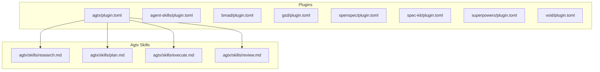

**Diagram sources**
- [plugins/agtx/plugin.toml:1-16](file://plugins/agtx/plugin.toml#L1-L16)
- [plugins/agtx/skills/research.md:1-45](file://plugins/agtx/skills/research.md#L1-L45)
- [plugins/agtx/skills/plan.md:1-43](file://plugins/agtx/skills/plan.md#L1-L43)
- [plugins/agtx/skills/execute.md:1-39](file://plugins/agtx/skills/execute.md#L1-L39)
- [plugins/agtx/skills/review.md:1-36](file://plugins/agtx/skills/review.md#L1-L36)

**Section sources**
- [plugins/agtx/plugin.toml:1-16](file://plugins/agtx/plugin.toml#L1-L16)
- [plugins/agent-skills/plugin.toml:1-19](file://plugins/agent-skills/plugin.toml#L1-L19)
- [plugins/bmad/plugin.toml:1-22](file://plugins/bmad/plugin.toml#L1-L22)
- [plugins/gsd/plugin.toml:1-34](file://plugins/gsd/plugin.toml#L1-L34)
- [plugins/openspec/plugin.toml:1-21](file://plugins/openspec/plugin.toml#L1-L21)
- [plugins/spec-kit/plugin.toml:1-21](file://plugins/spec-kit/plugin.toml#L1-L21)
- [plugins/superpowers/plugin.toml:1-16](file://plugins/superpowers/plugin.toml#L1-L16)
- [plugins/void/plugin.toml:1-4](file://plugins/void/plugin.toml#L1-L4)

## Core Components
This section documents the TOML configuration schema shared across plugins, with emphasis on how each plugin uses these keys.

- Metadata
  - name: Human-readable plugin identifier.
  - description: Short description of the plugin’s purpose.
  - supported_agents: Optional list restricting agent compatibility.
  - init_script: Optional shell command to initialize external tools or install marketplace plugins.
  - cyclic: Boolean enabling cyclic workflow behavior.

- Artifacts
  - Array of phase keys mapped to file or glob patterns indicating completion signals or outputs.
  - Patterns may include wildcards and placeholders understood by the runtime.
  - Some plugins rely on default fallbacks when certain phases are omitted.

- Commands
  - Mapping of phase keys to command strings.
  - Placeholder syntax: {task}, {phase}, and similar tokens are substituted at runtime.
  - Commands are executed by the agent runtime to trigger skills or external tools.

- Prompts
  - Optional per-phase prompt strings.
  - Some plugins embed task context directly in commands, making separate prompts unnecessary.

- Prompt Triggers
  - Optional trigger phrases that initiate prompt injection for specific phases.

- Copy Back
  - Optional array of directories or files to copy back after a phase completes.

- Copy Dirs
  - Optional array of directories to copy into worktrees for tooling or scaffolding.

- Clear Context on Advance
  - Boolean flag controlling whether memory/context is cleared between workflow phases.

- Auto Dismiss
  - Optional block to automate responses to interactive prompts or menus.

**Section sources**
- [plugins/agtx/plugin.toml:1-16](file://plugins/agtx/plugin.toml#L1-L16)
- [plugins/agent-skills/plugin.toml:1-19](file://plugins/agent-skills/plugin.toml#L1-L19)
- [plugins/bmad/plugin.toml:1-22](file://plugins/bmad/plugin.toml#L1-L22)
- [plugins/gsd/plugin.toml:1-34](file://plugins/gsd/plugin.toml#L1-L34)
- [plugins/openspec/plugin.toml:1-21](file://plugins/openspec/plugin.toml#L1-L21)
- [plugins/spec-kit/plugin.toml:1-21](file://plugins/spec-kit/plugin.toml#L1-L21)
- [plugins/superpowers/plugin.toml:1-16](file://plugins/superpowers/plugin.toml#L1-L16)
- [plugins/void/plugin.toml:1-4](file://plugins/void/plugin.toml#L1-L4)

## Architecture Overview
The plugin configuration orchestrates a workflow across phases. Each phase maps to a command and may produce artifacts. Plugins can opt into cyclic behavior, copy directories into worktrees, and manage context clearing between phases.

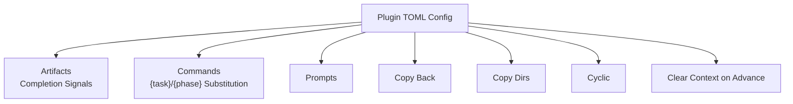

[No sources needed since this diagram shows conceptual workflow, not actual code structure]

## Detailed Component Analysis

### Agtx Plugin
- Purpose: Built-in workflow with four phases: research, planning, running (execution), and review.
- Key behaviors:
  - clear_context_on_advance enabled to reset memory between phases.
  - Artifacts define expected outputs per phase.
  - Commands map to internal skills with placeholder substitution.
- Skill expectations:
  - Research writes findings to a dedicated file.
  - Plan produces a plan file and waits for approval.
  - Execute implements changes and writes a summary.
  - Review validates changes and sets readiness status.

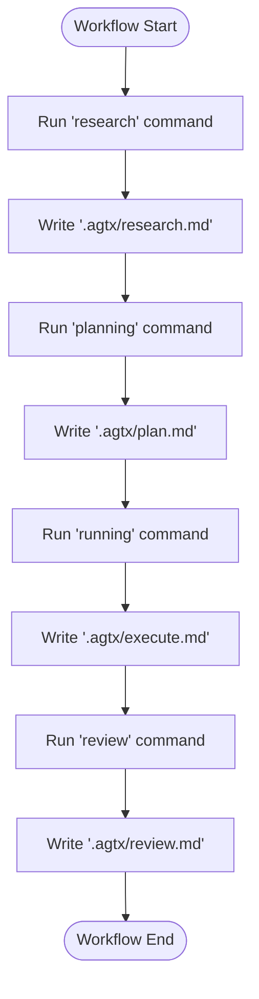

**Diagram sources**
- [plugins/agtx/plugin.toml:1-16](file://plugins/agtx/plugin.toml#L1-L16)
- [plugins/agtx/skills/research.md:1-45](file://plugins/agtx/skills/research.md#L1-L45)
- [plugins/agtx/skills/plan.md:1-43](file://plugins/agtx/skills/plan.md#L1-L43)
- [plugins/agtx/skills/execute.md:1-39](file://plugins/agtx/skills/execute.md#L1-L39)
- [plugins/agtx/skills/review.md:1-36](file://plugins/agtx/skills/review.md#L1-L36)

**Section sources**
- [plugins/agtx/plugin.toml:1-16](file://plugins/agtx/plugin.toml#L1-L16)
- [plugins/agtx/skills/research.md:1-45](file://plugins/agtx/skills/research.md#L1-L45)
- [plugins/agtx/skills/plan.md:1-43](file://plugins/agtx/skills/plan.md#L1-L43)
- [plugins/agtx/skills/execute.md:1-39](file://plugins/agtx/skills/execute.md#L1-L39)
- [plugins/agtx/skills/review.md:1-36](file://plugins/agtx/skills/review.md#L1-L36)

### Agent-Skills Plugin
- Purpose: Production-grade engineering lifecycle with commands for spec, plan, build, and review.
- Notable features:
  - Commands are concise and often embed {task} inline.
  - Prompts provide contextual guidance for each phase.
  - Initialization script installs marketplace plugin for Claude.

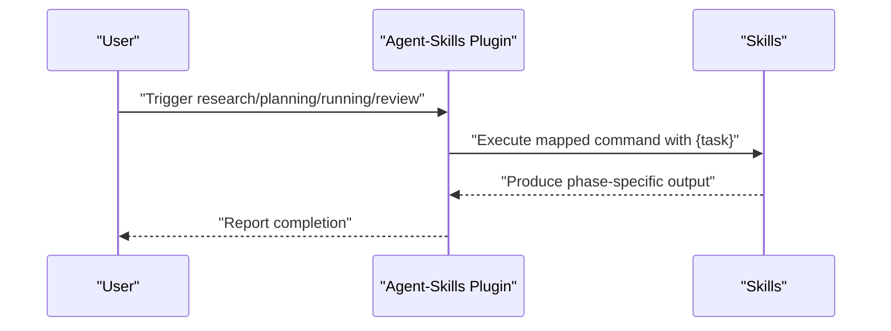

**Diagram sources**
- [plugins/agent-skills/plugin.toml:1-19](file://plugins/agent-skills/plugin.toml#L1-L19)

**Section sources**
- [plugins/agent-skills/plugin.toml:1-19](file://plugins/agent-skills/plugin.toml#L1-L19)

### Bmad Plugin
- Purpose: AI-driven agile with structured phases and output directories.
- Notable features:
  - Uses copy_dirs to stage tooling.
  - Artifacts leverage glob patterns for flexible output discovery.
  - Copy back configured for post-run artifacts.
  - Prompts include phase-specific guidance.

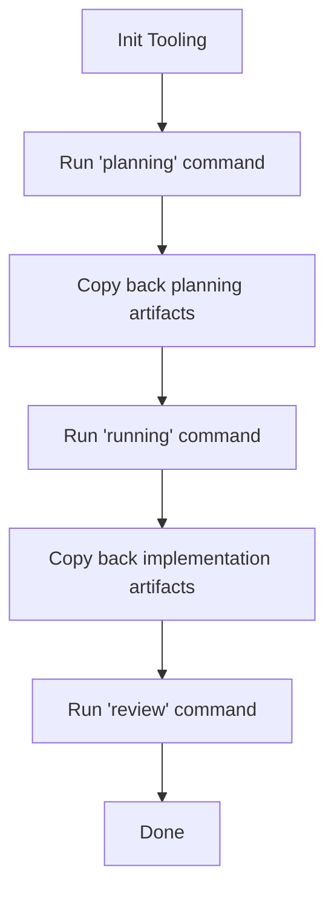

**Diagram sources**
- [plugins/bmad/plugin.toml:1-22](file://plugins/bmad/plugin.toml#L1-L22)

**Section sources**
- [plugins/bmad/plugin.toml:1-22](file://plugins/bmad/plugin.toml#L1-L22)

### Gsd Plugin
- Purpose: Spec-driven development with cyclic workflow support.
- Notable features:
  - Cyclic enabled for iterative phases.
  - Artifacts use wildcard patterns to capture per-phase outputs.
  - Commands include {phase} placeholder.
  - Prompt triggers automate initial questions.
  - Auto dismiss block automates menu selections.

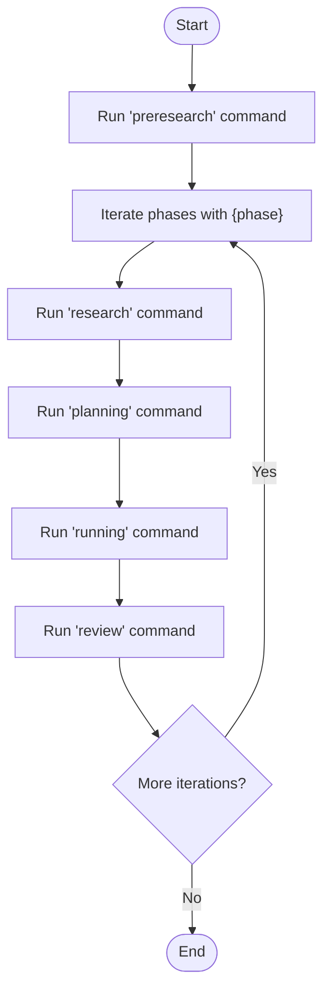

**Diagram sources**
- [plugins/gsd/plugin.toml:1-34](file://plugins/gsd/plugin.toml#L1-L34)

**Section sources**
- [plugins/gsd/plugin.toml:1-34](file://plugins/gsd/plugin.toml#L1-L34)

### Openspec Plugin
- Purpose: Lightweight AI-guided specification framework.
- Notable features:
  - copy_dirs copies the openspec directory into worktrees.
  - Commands target opsx skills with {task} or implicit task handling.
  - Copy back ensures artifacts persist after execution.

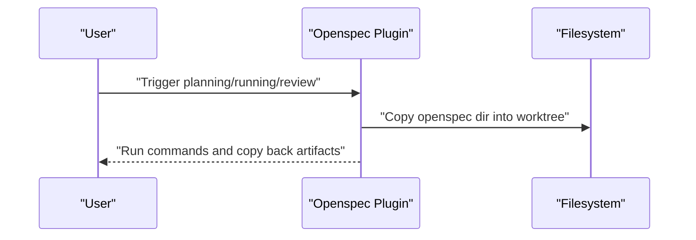

**Diagram sources**
- [plugins/openspec/plugin.toml:1-21](file://plugins/openspec/plugin.toml#L1-L21)

**Section sources**
- [plugins/openspec/plugin.toml:1-21](file://plugins/openspec/plugin.toml#L1-L21)

### Spec-Kit Plugin
- Purpose: Specifications become executable artifacts.
- Notable features:
  - copy_dirs copies .specify tooling into worktrees.
  - Artifacts define spec and plan outputs with wildcard patterns.
  - Prompts section is empty because commands embed {task}.

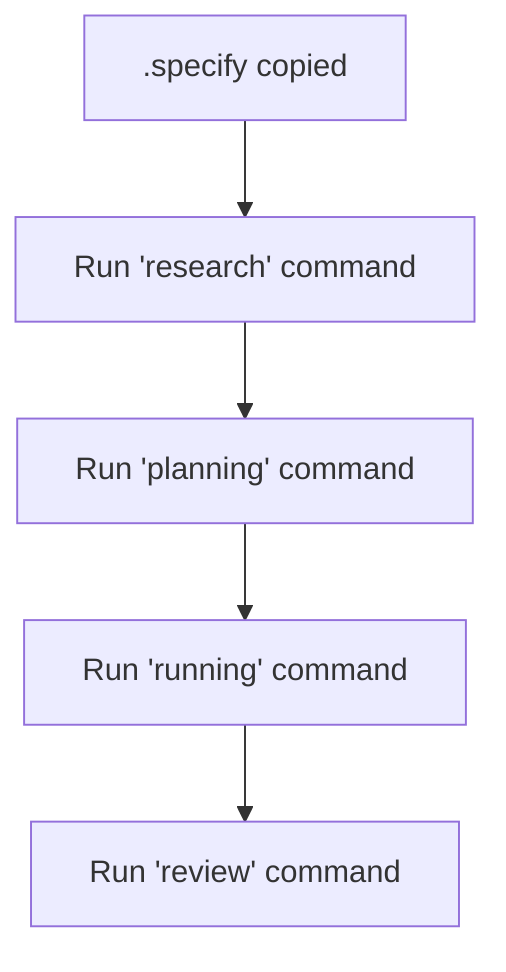

**Diagram sources**
- [plugins/spec-kit/plugin.toml:1-21](file://plugins/spec-kit/plugin.toml#L1-L21)

**Section sources**
- [plugins/spec-kit/plugin.toml:1-21](file://plugins/spec-kit/plugin.toml#L1-L21)

### Superpowers Plugin
- Purpose: Brainstorming, plans, TDD, and subagent-driven development.
- Notable features:
  - Restricts to specific agents via supported_agents.
  - Provides detailed prompts guiding work within isolated worktrees.
  - Copy back preserves generated plan artifacts.

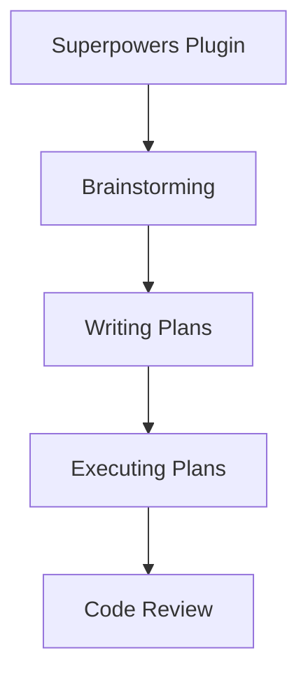

**Diagram sources**
- [plugins/superpowers/plugin.toml:1-16](file://plugins/superpowers/plugin.toml#L1-L16)

**Section sources**
- [plugins/superpowers/plugin.toml:1-16](file://plugins/superpowers/plugin.toml#L1-L16)

### Void Plugin
- Purpose: Plain coding agent session without prompting or skills.
- Notable features:
  - Cyclic enabled for continuous iteration.
  - Minimal configuration suitable as a base template.

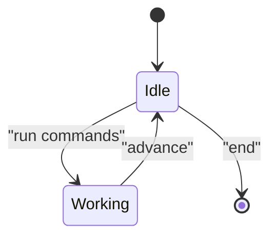

**Diagram sources**
- [plugins/void/plugin.toml:1-4](file://plugins/void/plugin.toml#L1-L4)

**Section sources**
- [plugins/void/plugin.toml:1-4](file://plugins/void/plugin.toml#L1-L4)

## Dependency Analysis
Plugins depend on:
- Command mapping to skills or external tools.
- Artifacts to signal completion and drive workflow progression.
- Optional copy-back and copy-dirs to manage tooling and outputs.
- Optional prompt triggers and auto-dismiss to streamline interactive flows.

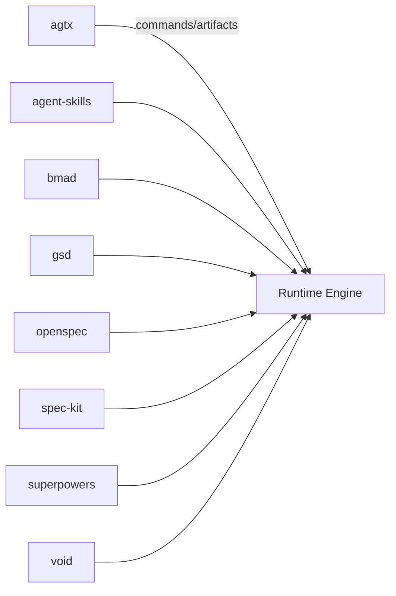

[No sources needed since this diagram shows conceptual relationships, not specific code structure]

## Performance Considerations
- Prefer glob patterns in artifacts judiciously to avoid scanning excessive directories.
- Limit copy_dirs to only necessary tooling to reduce overhead.
- Use clear_context_on_advance when long-running phases accumulate memory pressure.
- Enable cyclic only when iterative refinement is required to prevent unbounded loops.
- Keep commands concise and delegate heavy lifting to skills or external tools.

## Troubleshooting Guide
Common configuration errors and validations:
- Missing phase mappings
  - Symptom: Workflow stalls or throws phase-not-found errors.
  - Fix: Ensure commands include entries for all used phases.
  - Section sources
    - [plugins/agtx/plugin.toml:11-15](file://plugins/agtx/plugin.toml#L11-L15)
    - [plugins/agent-skills/plugin.toml:8-12](file://plugins/agent-skills/plugin.toml#L8-L12)

- Placeholder mismatch
  - Symptom: Commands fail due to unknown placeholders.
  - Fix: Confirm placeholder names align with supported tokens (e.g., {task}, {phase}).
  - Section sources
    - [plugins/gsd/plugin.toml:15-20](file://plugins/gsd/plugin.toml#L15-L20)
    - [plugins/openspec/plugin.toml:11-14](file://plugins/openspec/plugin.toml#L11-L14)

- Artifact path errors
  - Symptom: Completion signals not detected; workflow does not advance.
  - Fix: Verify artifact paths exist and match actual outputs; use globs carefully.
  - Section sources
    - [plugins/bmad/plugin.toml:6-8](file://plugins/bmad/plugin.toml#L6-L8)
    - [plugins/gsd/plugin.toml:8-13](file://plugins/gsd/plugin.toml#L8-L13)

- Cyclic misuse
  - Symptom: Infinite loops or runaway iterations.
  - Fix: Enable cyclic only when iterative refinement is intended; add exit conditions.
  - Section sources
    - [plugins/gsd/plugin.toml](file://plugins/gsd/plugin.toml#L5)
    - [plugins/void/plugin.toml](file://plugins/void/plugin.toml#L3)

- Agent compatibility
  - Symptom: Plugin fails to load or commands unsupported.
  - Fix: Set supported_agents appropriately; use init_script for marketplace installation.
  - Section sources
    - [plugins/superpowers/plugin.toml:3-4](file://plugins/superpowers/plugin.toml#L3-L4)
    - [plugins/agent-skills/plugin.toml](file://plugins/agent-skills/plugin.toml#L6)

- Memory accumulation
  - Symptom: Slower performance over long workflows.
  - Fix: Enable clear_context_on_advance to reset context between phases.
  - Section sources
    - [plugins/agtx/plugin.toml](file://plugins/agtx/plugin.toml#L3)

## Conclusion
Each plugin exposes a TOML configuration that defines metadata, commands, artifacts, and optional behaviors such as cyclic workflows, context clearing, and copy-back/copy-dirs. Understanding these keys and their interactions enables robust, repeatable workflows across diverse development lifecycles. Use the provided examples as templates and adapt them to your environment and agent preferences.

## Appendices

### Complete Configuration Templates by Plugin
- Agtx
  - Template path: [plugins/agtx/plugin.toml:1-16](file://plugins/agtx/plugin.toml#L1-L16)
- Agent-Skills
  - Template path: [plugins/agent-skills/plugin.toml:1-19](file://plugins/agent-skills/plugin.toml#L1-L19)
- Bmad
  - Template path: [plugins/bmad/plugin.toml:1-22](file://plugins/bmad/plugin.toml#L1-L22)
- Gsd
  - Template path: [plugins/gsd/plugin.toml:1-34](file://plugins/gsd/plugin.toml#L1-L34)
- Openspec
  - Template path: [plugins/openspec/plugin.toml:1-21](file://plugins/openspec/plugin.toml#L1-L21)
- Spec-Kit
  - Template path: [plugins/spec-kit/plugin.toml:1-21](file://plugins/spec-kit/plugin.toml#L1-L21)
- Superpowers
  - Template path: [plugins/superpowers/plugin.toml:1-16](file://plugins/superpowers/plugin.toml#L1-L16)
- Void
  - Template path: [plugins/void/plugin.toml:1-4](file://plugins/void/plugin.toml#L1-L4)

### Best Practices for Custom Plugin Development
- Keep commands minimal and delegate to skills or external tools.
- Use placeholders consistently and document them in plugin descriptions.
- Prefer explicit artifact paths over broad globs to improve reliability.
- Use copy_dirs sparingly and only for essential tooling.
- Leverage clear_context_on_advance for long workflows to maintain performance.
- Use cyclic thoughtfully and include exit criteria to avoid infinite loops.
- Provide init_script for marketplace installations or tool setup.
- Include prompt triggers and auto-dismiss blocks to reduce friction in interactive flows.