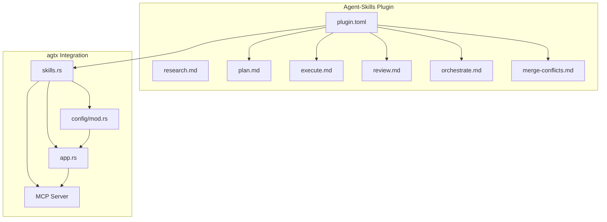
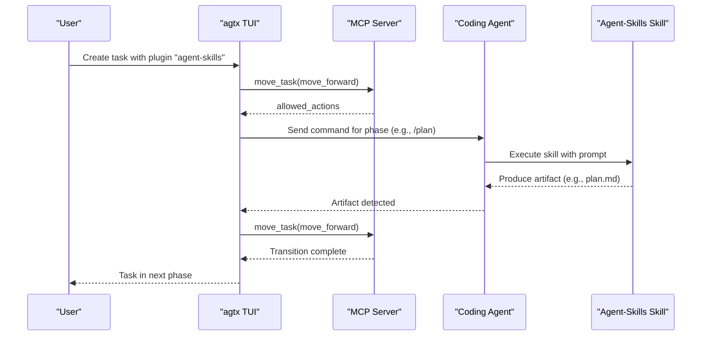
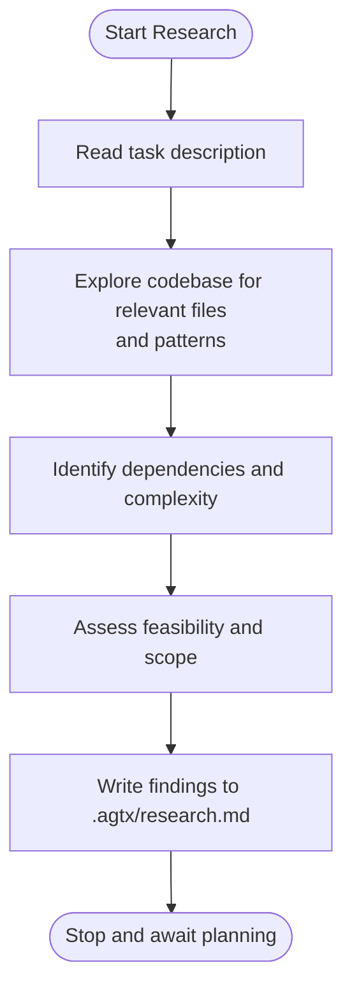
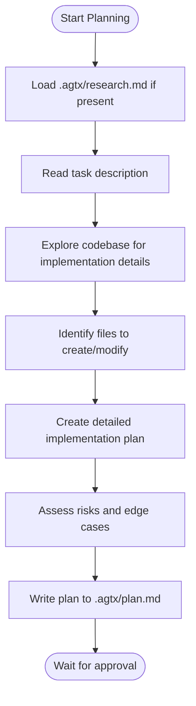
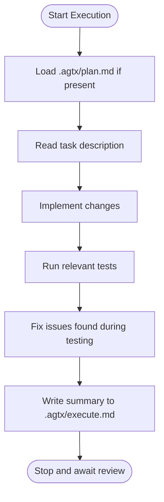
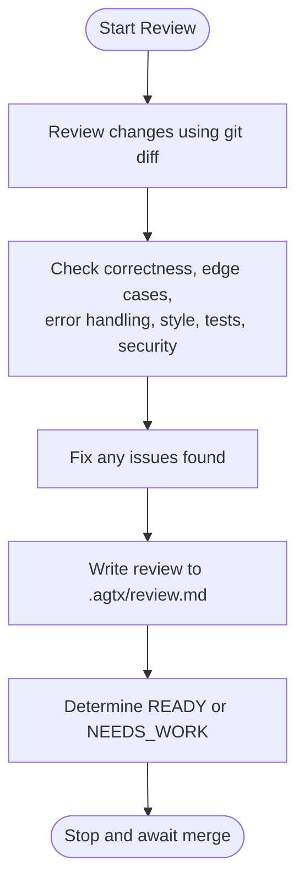
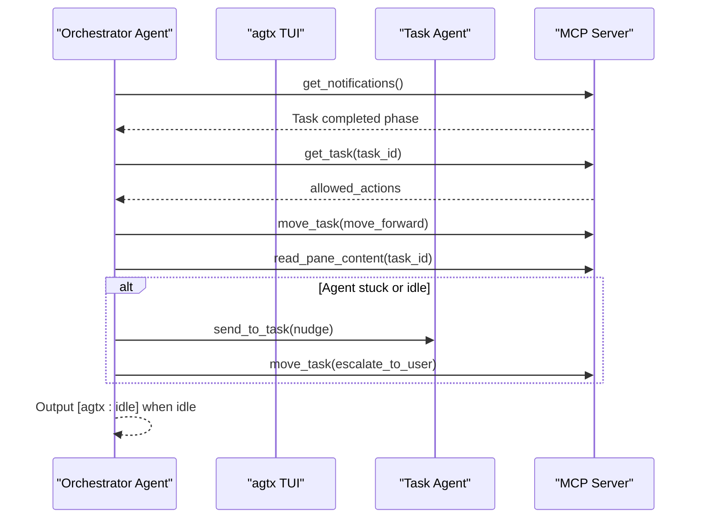
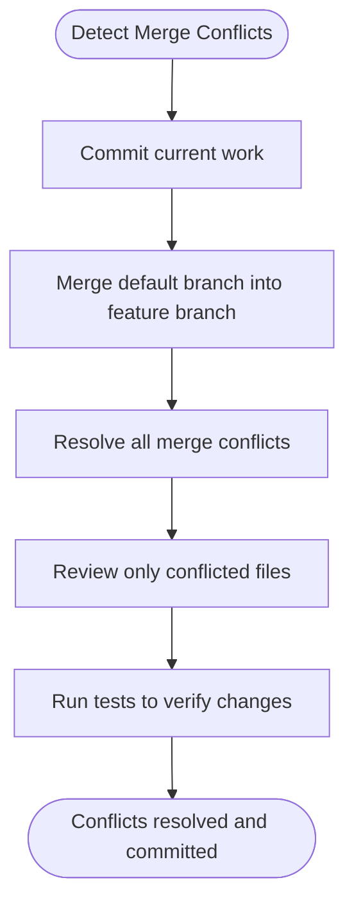
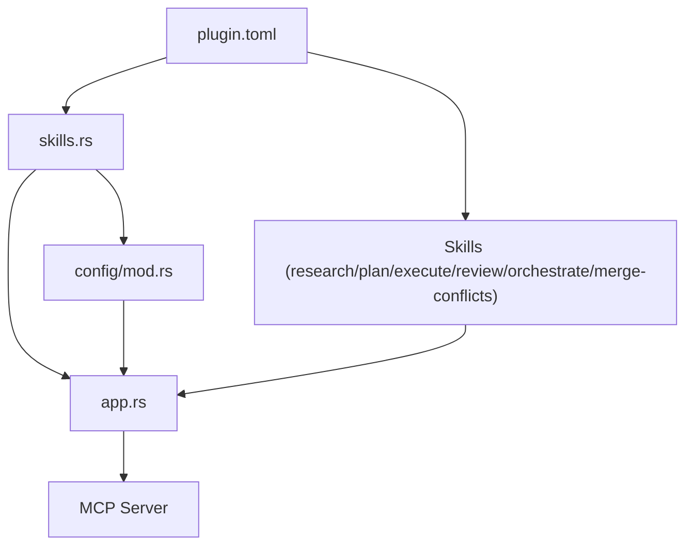

# Agent-Skills Plugin

<cite>
**Referenced Files in This Document**
- [plugin.toml](file://plugins/agent-skills/plugin.toml)
- [README.md](file://README.md)
- [AGENTS.md](file://AGENTS.md)
- [research.md](file://plugins/agtx/skills/research.md)
- [plan.md](file://plugins/agtx/skills/plan.md)
- [execute.md](file://plugins/agtx/skills/execute.md)
- [review.md](file://plugins/agtx/skills/review.md)
- [orchestrate.md](file://plugins/agtx/skills/orchestrate.md)
- [merge-conflicts.md](file://plugins/agtx/skills/merge-conflicts.md)
- [sweep/SKILL.md](file://skills/sweep/SKILL.md)
- [brainstorm/SKILL.md](file://skills/brainstorm/SKILL.md)
- [skills.rs](file://src/skills.rs)
- [app.rs](file://src/tui/app.rs)
- [config/mod.rs](file://src/config/mod.rs)
</cite>

## Table of Contents
1. [Introduction](#introduction)
2. [Project Structure](#project-structure)
3. [Core Components](#core-components)
4. [Architecture Overview](#architecture-overview)
5. [Detailed Component Analysis](#detailed-component-analysis)
6. [Dependency Analysis](#dependency-analysis)
7. [Performance Considerations](#performance-considerations)
8. [Troubleshooting Guide](#troubleshooting-guide)
9. [Conclusion](#conclusion)

## Introduction
The Agent-Skills plugin is a production engineering-focused workflow designed to streamline debugging, refactoring, and code quality improvements through a structured, spec-to-ship lifecycle. It integrates seamlessly with the agtx kanban board to orchestrate multi-agent collaboration, enabling autonomous task execution across Research, Planning, Running, and Review phases. The plugin emphasizes practical engineering tasks such as hotfix deployments, legacy code maintenance, and continuous quality improvement initiatives by providing standardized skills and prompts tailored to real-world development scenarios.

## Project Structure
The Agent-Skills plugin is packaged as a TOML-based workflow that defines commands, prompts, and artifacts for each phase of the engineering lifecycle. The plugin integrates with agtx’s skill system and MCP server to enable cross-agent compatibility and automated task progression.

**Diagram sources**
- [plugin.toml:1-19](file://plugins/agent-skills/plugin.toml#L1-L19)
- [research.md:1-45](file://plugins/agtx/skills/research.md#L1-L45)
- [plan.md:1-43](file://plugins/agtx/skills/plan.md#L1-L43)
- [execute.md:1-39](file://plugins/agtx/skills/execute.md#L1-L39)
- [review.md:1-36](file://plugins/agtx/skills/review.md#L1-L36)
- [orchestrate.md:1-200](file://plugins/agtx/skills/orchestrate.md#L1-L200)
- [merge-conflicts.md:1-53](file://plugins/agtx/skills/merge-conflicts.md#L1-L53)
- [skills.rs:1-29](file://src/skills.rs#L1-L29)
- [app.rs:4808-8479](file://src/tui/app.rs#L4808-L8479)
- [config/mod.rs:390-408](file://src/config/mod.rs#L390-L408)

**Section sources**
- [plugin.toml:1-19](file://plugins/agent-skills/plugin.toml#L1-L19)
- [README.md:329-367](file://README.md#L329-L367)
- [AGENTS.md:35-42](file://AGENTS.md#L35-L42)

## Core Components
The Agent-Skills plugin defines four primary phases—Research, Planning, Running, and Review—each with a dedicated skill file specifying inputs, instructions, and outputs. These skills are embedded at build time and deployed to agent-native discovery paths for each phase.

- Research skill: Read-only exploration to understand task scope and dependencies before planning.
- Planning skill: Analyze codebase, create detailed implementation plans, and await approval.
- Execution skill: Implement approved plans, run tests, and produce summaries.
- Review skill: Self-review for correctness, edge cases, and code quality; determine readiness to merge.
- Orchestrate skill: Coordinate task advancement through Planning and Running phases, handle stuck agents, and escalate when human intervention is required.
- Merge Conflicts skill: Resolve conflicts by merging the default branch into the feature branch and validating changes.

These components integrate with agtx’s task lifecycle, ensuring that each phase produces verifiable artifacts and maintains strict gating rules enforced by the plugin configuration.

**Section sources**
- [research.md:1-45](file://plugins/agtx/skills/research.md#L1-L45)
- [plan.md:1-43](file://plugins/agtx/skills/plan.md#L1-L43)
- [execute.md:1-39](file://plugins/agtx/skills/execute.md#L1-L39)
- [review.md:1-36](file://plugins/agtx/skills/review.md#L1-L36)
- [orchestrate.md:1-200](file://plugins/agtx/skills/orchestrate.md#L1-L200)
- [merge-conflicts.md:1-53](file://plugins/agtx/skills/merge-conflicts.md#L1-L53)
- [skills.rs:1-29](file://src/skills.rs#L1-L29)

## Architecture Overview
Agent-Skills operates within agtx’s Model Context Protocol (MCP) architecture, exposing board tools and automating task transitions. The orchestrator agent monitors task phases and advances them automatically, while the MCP server coordinates between agents and the TUI.

**Diagram sources**
- [README.md:573-646](file://README.md#L573-L646)
- [app.rs:4808-5450](file://src/tui/app.rs#L4808-L5450)
- [skills.rs:1-29](file://src/skills.rs#L1-L29)

**Section sources**
- [README.md:506-547](file://README.md#L506-L547)
- [README.md:573-646](file://README.md#L573-L646)
- [app.rs:4808-5450](file://src/tui/app.rs#L4808-L5450)

## Detailed Component Analysis

### Research Phase
The Research skill enables read-only exploration of the codebase to understand task requirements, locate relevant files, and assess complexity. It enforces a strict no-modification policy and produces findings in a structured format for downstream planning.

**Diagram sources**
- [research.md:10-44](file://plugins/agtx/skills/research.md#L10-L44)

**Section sources**
- [research.md:1-45](file://plugins/agtx/skills/research.md#L1-L45)

### Planning Phase
The Planning skill synthesizes research findings into a detailed implementation plan, identifying files to modify and outlining risks. It produces a structured plan and awaits explicit approval before implementation begins.

**Diagram sources**
- [plan.md:15-42](file://plugins/agtx/skills/plan.md#L15-L42)

**Section sources**
- [plan.md:1-43](file://plugins/agtx/skills/plan.md#L1-L43)

### Execution Phase
The Execution skill implements the approved plan, runs tests, and documents changes and verification results. It ensures that implementation remains aligned with the approved plan and produces a summary for review.

**Diagram sources**
- [execute.md:15-38](file://plugins/agtx/skills/execute.md#L15-L38)

**Section sources**
- [execute.md:1-39](file://plugins/agtx/skills/execute.md#L1-L39)

### Review Phase
The Review skill performs a self-review of changes, focusing on correctness, edge cases, code style, test coverage, and security. It determines whether the task is ready to merge and produces a structured review report.

**Diagram sources**
- [review.md:10-35](file://plugins/agtx/skills/review.md#L10-L35)

**Section sources**
- [review.md:1-36](file://plugins/agtx/skills/review.md#L1-L36)

### Orchestration and Task Coordination
The Orchestrate skill coordinates task advancement through Planning and Running phases, handles stuck agents, and escalates when human intervention is required. It respects plugin rules and allowed actions to maintain workflow integrity.

**Diagram sources**
- [orchestrate.md:30-90](file://plugins/agtx/skills/orchestrate.md#L30-L90)
- [app.rs:4808-5450](file://src/tui/app.rs#L4808-L5450)

**Section sources**
- [orchestrate.md:1-200](file://plugins/agtx/skills/orchestrate.md#L1-L200)
- [app.rs:4808-5450](file://src/tui/app.rs#L4808-L5450)

### Merge Conflict Resolution
The Merge Conflicts skill resolves conflicts by merging the default branch into the feature branch, guiding the agent through conflict marker removal, validation, and testing to ensure correctness.

**Diagram sources**
- [merge-conflicts.md:10-52](file://plugins/agtx/skills/merge-conflicts.md#L10-L52)

**Section sources**
- [merge-conflicts.md:1-53](file://plugins/agtx/skills/merge-conflicts.md#L1-L53)

## Dependency Analysis
Agent-Skills integrates with agtx through several key mechanisms:
- Skill embedding: Skills are embedded at build time and deployed to agent-native discovery paths.
- Plugin configuration: The plugin.toml file defines commands, prompts, and artifacts for each phase.
- MCP server: The orchestrator agent communicates with the MCP server to advance tasks and handle stuck agents.
- Phase gating: The TUI enforces plugin rules and artifact detection to gate phase transitions.

**Diagram sources**
- [plugin.toml:1-19](file://plugins/agent-skills/plugin.toml#L1-L19)
- [skills.rs:1-29](file://src/skills.rs#L1-L29)
- [app.rs:4808-8479](file://src/tui/app.rs#L4808-L8479)
- [config/mod.rs:390-408](file://src/config/mod.rs#L390-L408)

**Section sources**
- [plugin.toml:1-19](file://plugins/agent-skills/plugin.toml#L1-L19)
- [skills.rs:1-29](file://src/skills.rs#L1-L29)
- [app.rs:4808-8479](file://src/tui/app.rs#L4808-L8479)
- [config/mod.rs:390-408](file://src/config/mod.rs#L390-L408)

## Performance Considerations
- Artifact-based gating: Phase transitions occur only when artifacts are detected, reducing unnecessary agent work and minimizing resource consumption.
- Parallel execution: Each task runs in its own worktree and tmux window, enabling parallelism without interference.
- Minimal overhead: Skills are lightweight and focused on specific engineering tasks, avoiding heavy computation during phase transitions.
- MCP efficiency: The MCP server uses push notifications to reduce polling and improve responsiveness.

[No sources needed since this section provides general guidance]

## Troubleshooting Guide
Common issues and resolutions:
- Task stuck in a phase: Use the orchestrator’s stuck task handling to read pane content, send nudges, or escalate to the user with a concise reason.
- Missing artifacts: Ensure the correct artifact paths are configured in the plugin and that the agent writes the expected files.
- Agent compatibility: Verify that the agent supports the plugin’s commands and prompts; unsupported agents fall back to file-path prompts.
- Merge conflicts: Use the Merge Conflicts skill to resolve conflicts systematically and validate changes.

**Section sources**
- [orchestrate.md:91-200](file://plugins/agtx/skills/orchestrate.md#L91-L200)
- [merge-conflicts.md:10-52](file://plugins/agtx/skills/merge-conflicts.md#L10-L52)
- [README.md:348-367](file://README.md#L348-L367)

## Conclusion
The Agent-Skills plugin provides a robust, production-grade engineering workflow that emphasizes practical tasks such as debugging, refactoring, and code quality improvement. Through structured phases, standardized skills, and seamless integration with agtx’s MCP server and TUI, it enables autonomous task execution, reduces manual intervention, and improves overall development throughput. Its configuration flexibility supports diverse environments and team workflows, making it suitable for hotfix deployments, legacy code maintenance, and continuous quality initiatives.