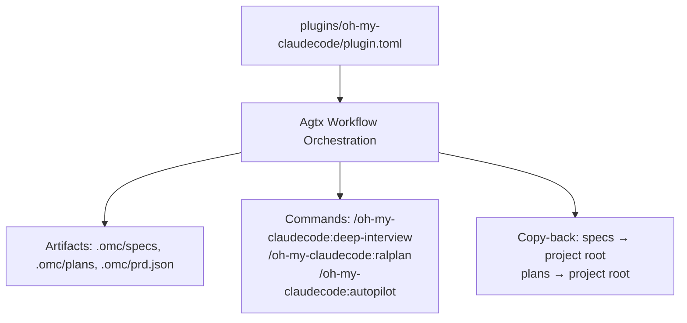
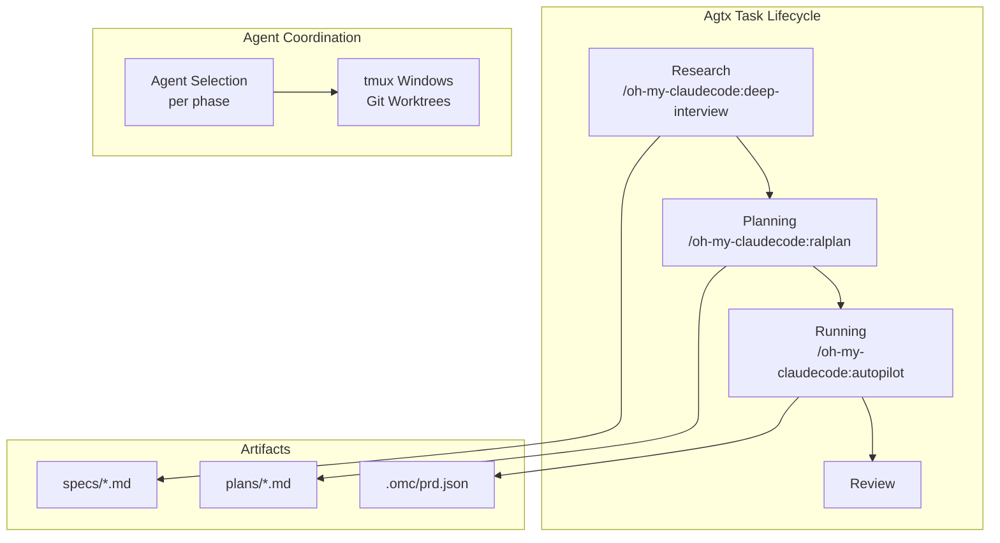
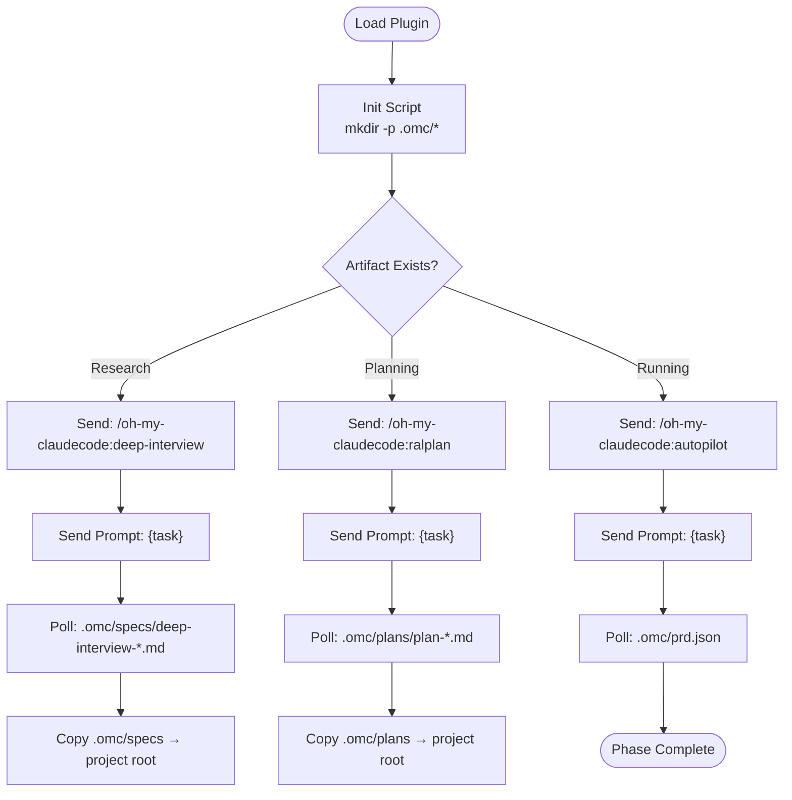
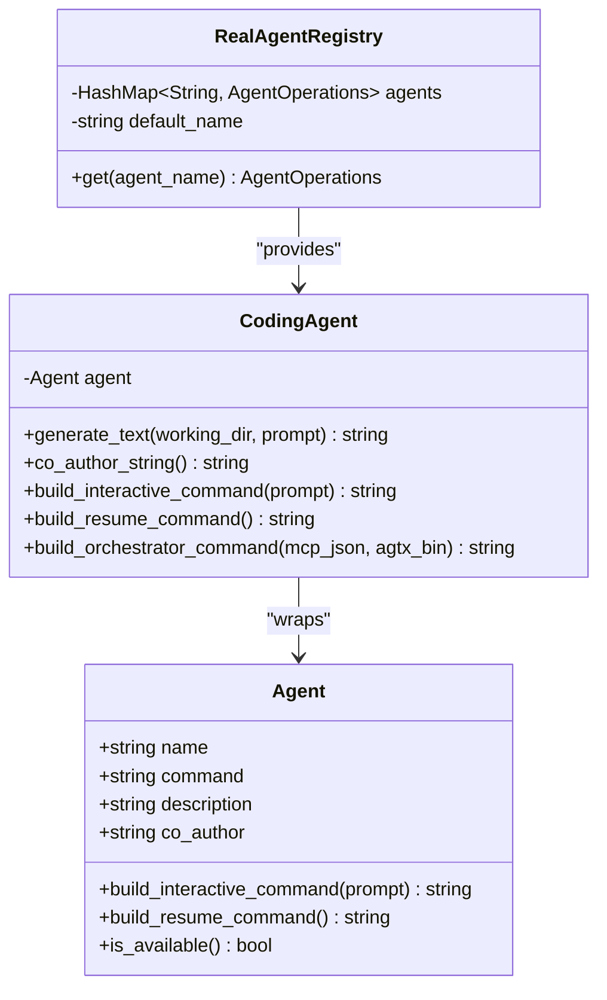
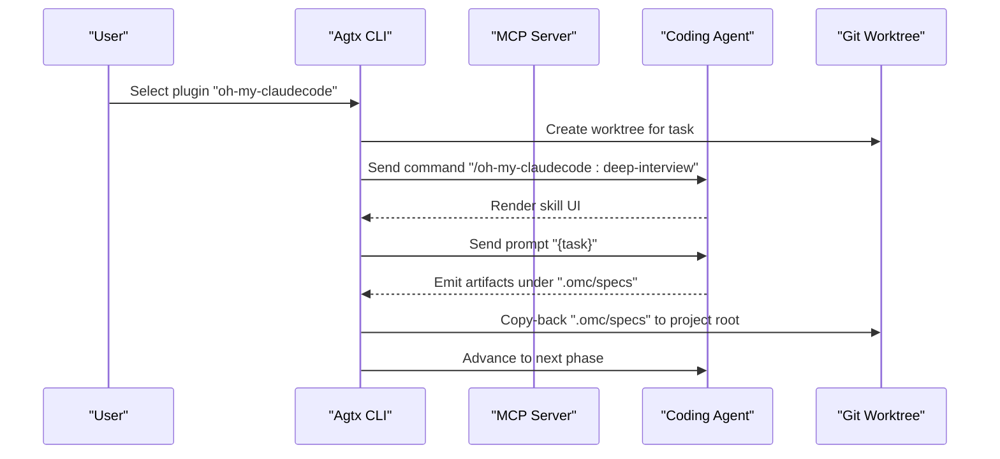
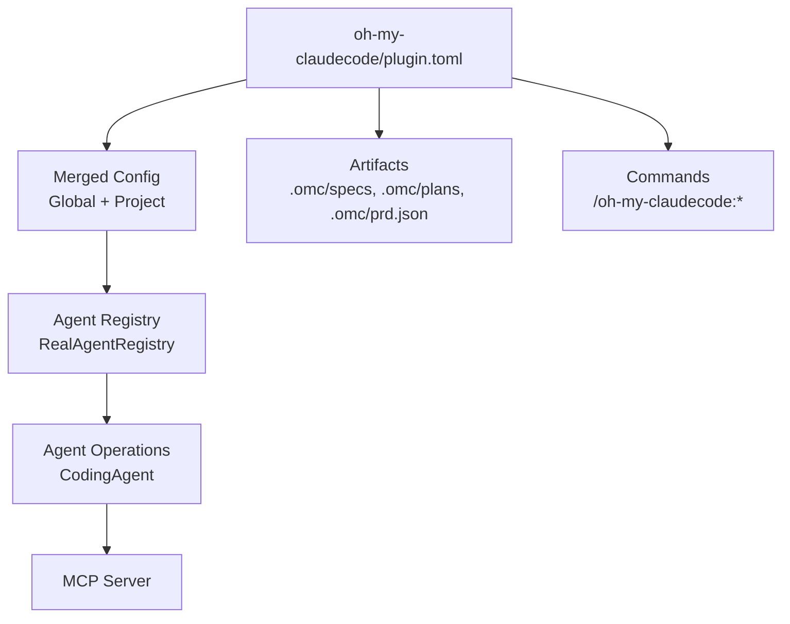

# Oh-My-ClaudeCode Plugin

<cite>
**Referenced Files in This Document**
- [plugin.toml](file://plugins/oh-my-claudecode/plugin.toml)
- [README.md](file://README.md)
- [AGENTS.md](file://AGENTS.md)
- [src/main.rs](file://src/main.rs)
- [src/lib.rs](file://src/lib.rs)
- [src/config/mod.rs](file://src/config/mod.rs)
- [src/agent/mod.rs](file://src/agent/mod.rs)
- [src/agent/operations.rs](file://src/agent/operations.rs)
</cite>

## Table of Contents
1. [Introduction](#introduction)
2. [Project Structure](#project-structure)
3. [Core Components](#core-components)
4. [Architecture Overview](#architecture-overview)
5. [Detailed Component Analysis](#detailed-component-analysis)
6. [Dependency Analysis](#dependency-analysis)
7. [Performance Considerations](#performance-considerations)
8. [Troubleshooting Guide](#troubleshooting-guide)
9. [Conclusion](#conclusion)
10. [Appendices](#appendices)

## Introduction
The Oh-My-ClaudeCode plugin is a multi-agent orchestration workflow tailored for complex, coordinated development scenarios. It leverages a suite of specialized agents and skills to automate end-to-end development lifecycles, from requirements clarification and iterative planning to autonomous execution, quality assurance, and validation. The plugin integrates deeply with the agtx platform to coordinate agent selection, workload distribution, and inter-agent communication patterns across parallel sessions, ensuring scalable and robust multi-agent collaboration in terminal environments.

## Project Structure
The Oh-My-ClaudeCode plugin is packaged as a spec-driven workflow plugin within the agtx ecosystem. Its configuration and behavior are defined by a single plugin manifest, with artifacts and commands orchestrated through the broader agtx task lifecycle.

**Diagram sources**
- [plugin.toml:1-41](file://plugins/oh-my-claudecode/plugin.toml#L1-L41)

**Section sources**
- [plugin.toml:1-41](file://plugins/oh-my-claudecode/plugin.toml#L1-L41)

## Core Components
- Plugin definition and lifecycle: The plugin defines commands, prompts, and artifacts for three phases—research, planning, and running—enabling a structured, spec-driven pipeline.
- Artifacts: Research and planning produce discoverable artifacts under .omc/specs and .omc/plans respectively, while running emits a product realization document (.omc/prd.json) to drive execution.
- Commands: Canonical slash commands are mapped to Oh-My-ClaudeCode skills, ensuring consistent invocation across agents.
- Copy-back: After research and planning, artifacts are copied back to the project root to enable cross-task referencing and continuity.

**Section sources**
- [plugin.toml:11-41](file://plugins/oh-my-claudecode/plugin.toml#L11-L41)

## Architecture Overview
The Oh-My-ClaudeCode plugin participates in the agtx task lifecycle, which coordinates agent sessions, tmux windows, and git worktrees. The plugin’s commands and prompts are translated per agent, and the system gates phase transitions based on artifact presence and plugin configuration.

**Diagram sources**
- [plugin.toml:22-34](file://plugins/oh-my-claudecode/plugin.toml#L22-L34)
- [plugin.toml:11-16](file://plugins/oh-my-claudecode/plugin.toml#L11-L16)

**Section sources**
- [plugin.toml:11-34](file://plugins/oh-my-claudecode/plugin.toml#L11-L34)
- [README.md:506-547](file://README.md#L506-L547)

## Detailed Component Analysis

### Plugin Configuration and Behavior
- Name and description: Identifies the plugin and its purpose within the agtx marketplace.
- Supported agents: Restricts usage to Claude-compatible environments.
- Init script: Prepares the .omc directory structure for artifacts.
- Artifacts: Defines glob patterns for research, planning, and running phases.
- Commands: Specifies canonical slash commands for each phase.
- Prompts: Provides templated prompts for research, planning, and running, with empty prompts for downstream phases.
- Copy-back: Ensures artifacts are synchronized back to the project root after research and planning.

**Diagram sources**
- [plugin.toml:5-41](file://plugins/oh-my-claudecode/plugin.toml#L5-L41)

**Section sources**
- [plugin.toml:1-41](file://plugins/oh-my-claudecode/plugin.toml#L1-L41)

### Agent Management and Selection Strategies
- Agent detection and registry: The system detects available agents and maintains a registry keyed by agent name, falling back to a default agent when necessary.
- Per-phase agent selection: The merged configuration resolves which agent to use for each phase, allowing different agents for research, planning, running, and review.
- Orchestrator integration: Agents can be launched as orchestrators with MCP registration, enabling autonomous task advancement and diagnostics.

**Diagram sources**
- [src/agent/mod.rs:10-171](file://src/agent/mod.rs#L10-L171)
- [src/agent/operations.rs:44-163](file://src/agent/operations.rs#L44-L163)

**Section sources**
- [src/agent/mod.rs:10-171](file://src/agent/mod.rs#L10-L171)
- [src/agent/operations.rs:44-163](file://src/agent/operations.rs#L44-L163)
- [src/config/mod.rs:390-408](file://src/config/mod.rs#L390-L408)

### Workflow Orchestration and Inter-Agent Communication
- Command translation: Commands are written in canonical format and translated per agent; Oh-My-ClaudeCode uses Claude-style commands.
- Prompt triggers and auto-dismiss: Plugins can define prompt triggers and auto-dismiss rules to handle interactive prompts consistently.
- MCP server integration: The global MCP server exposes board tools for external agents, enabling orchestrator-driven automation and diagnostics.

**Diagram sources**
- [plugin.toml:22-34](file://plugins/oh-my-claudecode/plugin.toml#L22-L34)
- [plugin.toml:39-41](file://plugins/oh-my-claudecode/plugin.toml#L39-L41)
- [README.md:573-603](file://README.md#L573-L603)

**Section sources**
- [plugin.toml:22-34](file://plugins/oh-my-claudecode/plugin.toml#L22-L34)
- [plugin.toml:39-41](file://plugins/oh-my-claudecode/plugin.toml#L39-L41)
- [README.md:573-603](file://README.md#L573-L603)

### Configuration Requirements for Multi-Agent Setups
- Global and project-level configuration: Merge global and project configurations to determine default agents and per-phase overrides.
- Agent compatibility: Oh-My-ClaudeCode is restricted to Claude-compatible environments; ensure the agent is available and properly configured.
- Resource allocation: Configure worktree base branch, worktree directory, and scripts for initialization and cleanup to optimize resource usage.

**Section sources**
- [src/config/mod.rs:337-408](file://src/config/mod.rs#L337-L408)
- [src/config/mod.rs:199-228](file://src/config/mod.rs#L199-L228)
- [src/agent/mod.rs:124-130](file://src/agent/mod.rs#L124-L130)

## Dependency Analysis
The Oh-My-ClaudeCode plugin relies on the agtx configuration system, agent registry, and MCP server to coordinate multi-agent workflows. The plugin’s commands and prompts are integrated into the broader task lifecycle, while artifacts and copy-back rules ensure continuity across phases.

**Diagram sources**
- [src/config/mod.rs:337-408](file://src/config/mod.rs#L337-L408)
- [src/agent/operations.rs:119-163](file://src/agent/operations.rs#L119-L163)
- [plugin.toml:11-16](file://plugins/oh-my-claudecode/plugin.toml#L11-L16)

**Section sources**
- [src/config/mod.rs:337-408](file://src/config/mod.rs#L337-L408)
- [src/agent/operations.rs:119-163](file://src/agent/operations.rs#L119-L163)
- [plugin.toml:11-16](file://plugins/oh-my-claudecode/plugin.toml#L11-L16)

## Performance Considerations
- Parallel execution: Each task runs in its own tmux window and git worktree, enabling parallelism across multiple agents without interference.
- Artifact polling: Efficient polling of artifact files reduces unnecessary agent interactions and minimizes overhead.
- Auto-dismiss rules: Reducing manual intervention improves throughput for repetitive workflows.
- Resource limits: Configure worktree directories and cleanup scripts to prevent disk pressure and maintain performance over long-running sessions.

[No sources needed since this section provides general guidance]

## Troubleshooting Guide
- Agent availability: Ensure the required agent is installed and available on PATH; the registry falls back to a default agent if none is detected.
- Command translation: Verify that commands are compatible with the selected agent; Oh-My-ClaudeCode uses Claude-style commands.
- Artifact gating: Confirm that artifact files are generated as expected; missing artifacts block phase transitions.
- MCP server: For orchestrator mode, ensure the MCP server is registered and reachable; diagnostics can escalate to user attention when tasks stall.

**Section sources**
- [src/agent/mod.rs:124-130](file://src/agent/mod.rs#L124-L130)
- [src/config/mod.rs:512-544](file://src/config/mod.rs#L512-L544)
- [README.md:623-646](file://README.md#L623-L646)

## Conclusion
The Oh-My-ClaudeCode plugin delivers a sophisticated multi-agent orchestration workflow within agtx, enabling complex coordination across specialized agents. Its structured phases, artifact-driven gating, and seamless agent integration make it suitable for large-scale development projects requiring diverse expertise and continuous automation.

[No sources needed since this section summarizes without analyzing specific files]

## Appendices

### Practical Usage Examples
- Large-scale development projects: Use Oh-My-ClaudeCode to coordinate iterative planning and autonomous execution across multiple specialized agents, with artifacts guiding downstream phases.
- Complex architectural decisions: Employ the research phase to capture requirements and constraints, then leverage planning and autopilot phases to explore alternatives and execute validated designs.
- Multi-agent expertise: Assign distinct agents to research, planning, and execution phases to maximize domain-specific capabilities and reduce context switching.

[No sources needed since this section provides general guidance]