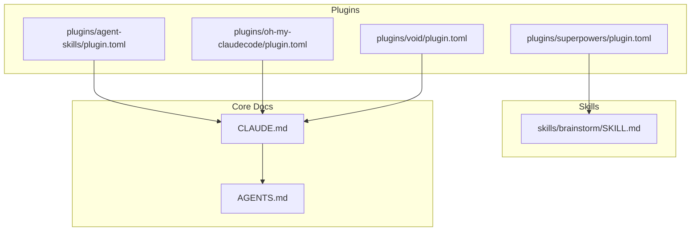
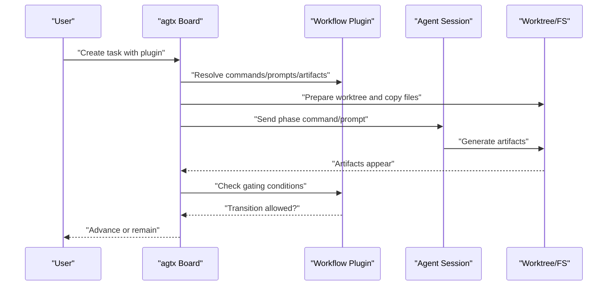
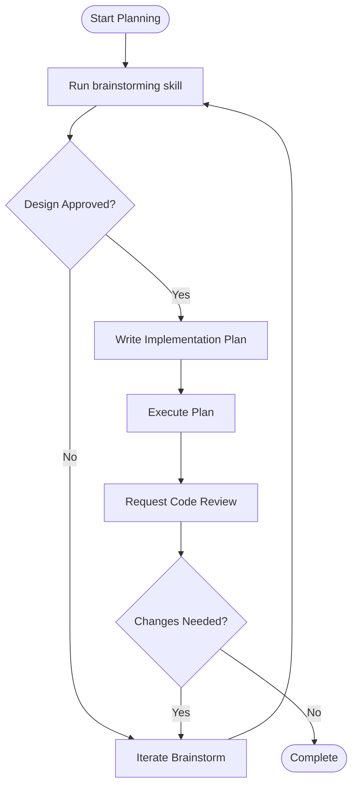
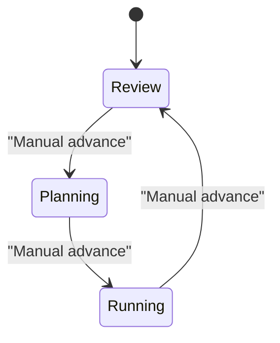
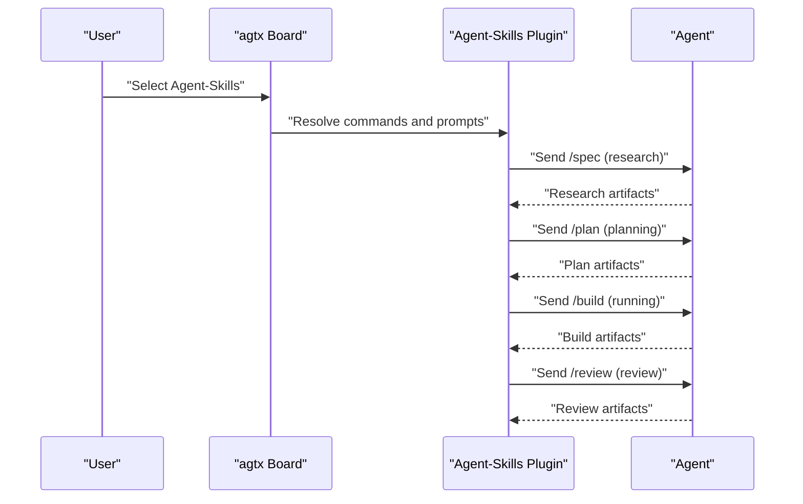
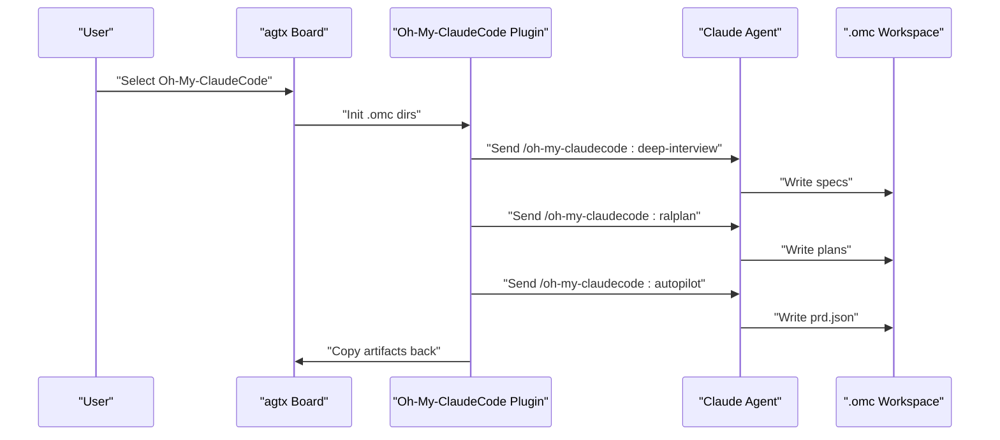
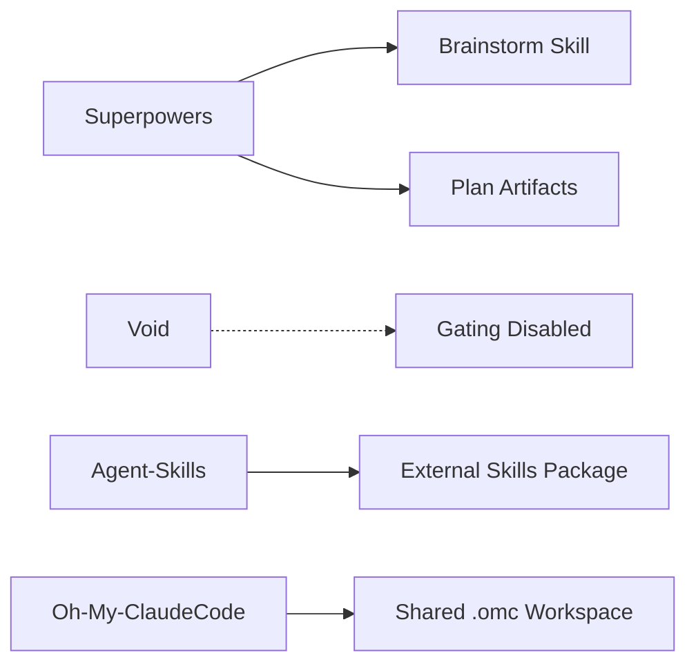

# Specialized Plugins

<cite>
**Referenced Files in This Document**
- [plugin.toml](file://plugins/superpowers/plugin.toml)
- [plugin.toml](file://plugins/void/plugin.toml)
- [plugin.toml](file://plugins/agent-skills/plugin.toml)
- [plugin.toml](file://plugins/oh-my-claudecode/plugin.toml)
- [SKILL.md](file://skills/brainstorm/SKILL.md)
- [CLAUDE.md](file://CLAUDE.md)
- [AGENTS.md](file://AGENTS.md)
- [plugin.toml](file://plugins/agtx/plugin.toml)
- [plugin.toml](file://plugins/openspec/plugin.toml)
- [plugin.toml](file://plugins/spec-kit/plugin.toml)
- [plugin.toml](file://plugins/gsd/plugin.toml)
- [plugin.toml](file://plugins/bmad/plugin.toml)
</cite>

## Table of Contents
1. [Introduction](#introduction)
2. [Project Structure](#project-structure)
3. [Core Components](#core-components)
4. [Architecture Overview](#architecture-overview)
5. [Detailed Component Analysis](#detailed-component-analysis)
6. [Dependency Analysis](#dependency-analysis)
7. [Performance Considerations](#performance-considerations)
8. [Troubleshooting Guide](#troubleshooting-guide)
9. [Conclusion](#conclusion)
10. [Appendices](#appendices)

## Introduction
This document focuses on specialized workflow plugins that extend the standard task lifecycle in the agtx system. It covers:
- Superpowers: a cycle-driven plugin for brainstorming, planning, testing, and refinement.
- Void: a manual control mode for direct task management without enforced automation.
- Agent-Skills: a production-grade engineering plugin integrating a suite of skills for research, planning, building, and review.
- Oh-My-ClaudeCode: a multi-agent orchestration plugin enabling complex coordination patterns with external agents and artifacts.

For each plugin, we explain target use cases, configuration requirements, integration patterns, practical examples, and advanced customization options for power users.

## Project Structure
The specialized plugins are defined as TOML configuration files under the plugins directory. Each plugin specifies commands, prompts, artifacts, and optional behaviors such as cyclic transitions, initialization scripts, and copy-back semantics. The agtx core documentation describes how plugins customize the task lifecycle across phases (Backlog → Planning → Running → Review → Done).

**Diagram sources**
- [plugin.toml](file://plugins/superpowers/plugin.toml)
- [plugin.toml](file://plugins/void/plugin.toml)
- [plugin.toml](file://plugins/agent-skills/plugin.toml)
- [plugin.toml](file://plugins/oh-my-claudecode/plugin.toml)
- [SKILL.md](file://skills/brainstorm/SKILL.md)
- [CLAUDE.md](file://CLAUDE.md)
- [AGENTS.md](file://AGENTS.md)

**Section sources**
- [CLAUDE.md:111-127](file://CLAUDE.md#L111-L127)
- [AGENTS.md:35-42](file://AGENTS.md#L35-L42)

## Core Components
- Superpowers plugin: orchestrates a structured cycle of ideation, planning, execution, and review. It leverages a brainstorming skill and plan artifacts to guide the process.
- Void plugin: disables workflow enforcement, allowing manual control of task phases without automated gating or prompts.
- Agent-Skills plugin: integrates a curated set of production engineering skills mapped to slash commands for research, planning, building, and review.
- Oh-My-ClaudeCode plugin: supports multi-agent orchestration with external agents and a shared workspace for specs, plans, state, and handoffs.

**Section sources**
- [plugin.toml](file://plugins/superpowers/plugin.toml)
- [plugin.toml](file://plugins/void/plugin.toml)
- [plugin.toml](file://plugins/agent-skills/plugin.toml)
- [plugin.toml](file://plugins/oh-my-claudecode/plugin.toml)

## Architecture Overview
The plugins integrate with the agtx workflow engine by defining:
- Commands per phase (auto-translated per agent).
- Prompts templated with task context.
- Artifacts that gate transitions between phases.
- Optional behaviors: cyclic transitions, init scripts, copy-back directories, and supported agents.

**Diagram sources**
- [CLAUDE.md:111-127](file://CLAUDE.md#L111-L127)

## Detailed Component Analysis

### Superpowers Plugin
- Purpose: Advanced brainstorming, plan-driven development, and iterative refinement aligned with TDD-like practices.
- Cycle: Ideation → Design Approval → Plan Writing → Execution → Code Review → Repeat until satisfied.
- Key behaviors:
  - Uses a brainstorming skill to explore ideas without planning or implementation.
  - Uses plan artifacts to drive subsequent phases.
  - Copies plan artifacts back to the project root after planning.
  - Supports agent scoping and an init script for plugin installation.
- Target use cases:
  - Exploring ambiguous or exploratory features.
  - Enforcing a strict plan-before-code discipline.
  - Integrating testing and review cycles into the workflow.
- Integration pattern:
  - Configure the plugin on a task; the board sends the planning prompt and waits for plan artifacts.
  - After plan approval, the plugin triggers execution and review commands.
- Practical examples:
  - Use Superpowers for UI feature discovery and API contract definition before implementation.
  - Combine with sweep to bring outcomes into the board as actionable tasks.
- Advanced configuration:
  - Customize prompts per phase.
  - Adjust artifact paths to align with team conventions.
  - Use supported_agents to restrict to Claude-compatible environments.

**Diagram sources**
- [plugin.toml](file://plugins/superpowers/plugin.toml)
- [SKILL.md](file://skills/brainstorm/SKILL.md)

**Section sources**
- [plugin.toml](file://plugins/superpowers/plugin.toml)
- [SKILL.md](file://skills/brainstorm/SKILL.md)
- [CLAUDE.md:111-127](file://CLAUDE.md#L111-L127)

### Void Plugin
- Purpose: Manual control mode for direct task management without enforced automation.
- Key behaviors:
  - cyclic = true enables Review → Planning transitions.
  - No commands or prompts are sent automatically; user controls phase advancement.
- Target use cases:
  - Expert-driven tasks where automation is unnecessary or counterproductive.
  - Ad-hoc experimentation outside the standard lifecycle.
- Integration pattern:
  - Select Void when creating a task to bypass automatic gating.
  - Manually move tasks between phases as needed.
- Practical examples:
  - Rapid prototyping or quick fixes where formal planning is not required.
  - Research spikes that do not need persistent artifacts.
- Advanced configuration:
  - Combine with custom prompts or skills for ad-hoc guidance.
  - Use copy_back to preserve ephemeral outputs.

**Diagram sources**
- [plugin.toml](file://plugins/void/plugin.toml)

**Section sources**
- [plugin.toml](file://plugins/void/plugin.toml)
- [CLAUDE.md:111-127](file://CLAUDE.md#L111-L127)

### Agent-Skills Plugin
- Purpose: Production-grade engineering skills covering the full spec-to-ship lifecycle.
- Key behaviors:
  - Maps slash commands to research, planning, building, and review phases.
  - Provides prompts tailored to each phase.
  - Uses an init script to install the external agent skills package for Claude.
- Target use cases:
  - Teams adopting a structured engineering lifecycle.
  - Projects requiring consistent research, planning, and review practices.
- Integration pattern:
  - Install the external skills package via the provided init script.
  - Use slash commands to trigger research, plan, build, and review actions.
- Practical examples:
  - Use /spec for research, /plan for planning, /build for implementation, and /review for review.
- Advanced configuration:
  - Customize prompts per phase.
  - Restrict to supported agents if needed.

**Diagram sources**
- [plugin.toml](file://plugins/agent-skills/plugin.toml)

**Section sources**
- [plugin.toml](file://plugins/agent-skills/plugin.toml)
- [CLAUDE.md:111-127](file://CLAUDE.md#L111-L127)

### Oh-My-ClaudeCode Plugin
- Purpose: Multi-agent orchestration with 37 skills and 22 specialized agents, supporting complex coordination patterns.
- Key behaviors:
  - Initializes a shared workspace (.omc) for specs, plans, state, and handoffs.
  - Uses slash commands in a canonical namespace to trigger deep-interview, ralplan, and autopilot.
  - Copies artifacts back to the project root after research and planning.
  - Supports artifact-based gating for research, planning, and autopilot completion.
- Target use cases:
  - Large-scale projects requiring multi-agent collaboration.
  - Scenarios needing structured requirements clarification, iterative planning, and autonomous execution.
- Integration pattern:
  - Install the external plugin and run the setup command.
  - Use /oh-my-claudecode:deep-interview for requirements clarification.
  - Use /oh-my-claudecode:ralplan for iterative consensus planning.
  - Use /oh-my-claudecode:autopilot for autonomous pipeline execution.
- Practical examples:
  - Kickoff a product feature with deep-interview, iterate with ralplan, and execute with autopilot.
- Advanced configuration:
  - Customize artifact paths and copy-back directories.
  - Extend command namespaces and prompts for domain-specific needs.

**Diagram sources**
- [plugin.toml](file://plugins/oh-my-claudecode/plugin.toml)

**Section sources**
- [plugin.toml](file://plugins/oh-my-claudecode/plugin.toml)
- [CLAUDE.md:111-127](file://CLAUDE.md#L111-L127)

## Dependency Analysis
- Superpowers depends on the brainstorm skill and plan artifacts to gate transitions.
- Void disables gating, relying on manual advancement.
- Agent-Skills relies on an external skills package and slash commands.
- Oh-My-ClaudeCode relies on a shared workspace and external agents.

**Diagram sources**
- [plugin.toml](file://plugins/superpowers/plugin.toml)
- [SKILL.md](file://skills/brainstorm/SKILL.md)
- [plugin.toml](file://plugins/agent-skills/plugin.toml)
- [plugin.toml](file://plugins/oh-my-claudecode/plugin.toml)

**Section sources**
- [plugin.toml](file://plugins/superpowers/plugin.toml)
- [plugin.toml](file://plugins/void/plugin.toml)
- [plugin.toml](file://plugins/agent-skills/plugin.toml)
- [plugin.toml](file://plugins/oh-my-claudecode/plugin.toml)

## Performance Considerations
- Plugin resolution and artifact checks occur in background threads with caching to minimize overhead.
- Copy-back operations are scoped to specific directories to reduce I/O.
- Cyclic transitions in Void and GSD reduce redundant setup costs by reusing workspaces.

[No sources needed since this section provides general guidance]

## Troubleshooting Guide
- Plugin not found or missing artifacts:
  - Verify plugin selection and that artifact paths match expectations.
  - Confirm copy_back directories are correctly configured.
- Agent command translation:
  - Ensure commands are in the canonical namespace; translation varies by agent.
- Init scripts:
  - For external plugins (Agent-Skills, Oh-My-ClaudeCode), confirm installation steps are executed.
- Manual control:
  - In Void, manually advance phases when artifacts are ready.

**Section sources**
- [CLAUDE.md:111-127](file://CLAUDE.md#L111-L127)
- [plugin.toml](file://plugins/agent-skills/plugin.toml)
- [plugin.toml](file://plugins/oh-my-claudecode/plugin.toml)

## Conclusion
These specialized plugins extend agtx to support advanced and experimental workflows:
- Superpowers enforces a disciplined cycle of ideation, planning, execution, and review.
- Void provides manual control for expert-driven tasks.
- Agent-Skills brings production-grade skills into the workflow.
- Oh-My-ClaudeCode enables multi-agent orchestration with complex coordination.

They integrate seamlessly with the core task lifecycle and can be customized to fit diverse project needs.

[No sources needed since this section summarizes without analyzing specific files]

## Appendices

### Appendix A: Related Plugins for Context
- agtx: Built-in workflow with standard artifacts and commands.
- openspec: Lightweight specification framework with copy-back of change proposals.
- spec-kit: Specification-driven development with artifact-based gating.
- gsd: Structured spec-driven development with cyclic phases and prompt triggers.
- bmad: AI-driven agile development with PRD and implementation artifacts.

**Section sources**
- [plugin.toml](file://plugins/agtx/plugin.toml)
- [plugin.toml](file://plugins/openspec/plugin.toml)
- [plugin.toml](file://plugins/spec-kit/plugin.toml)
- [plugin.toml](file://plugins/gsd/plugin.toml)
- [plugin.toml](file://plugins/bmad/plugin.toml)