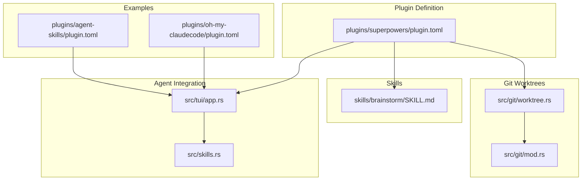
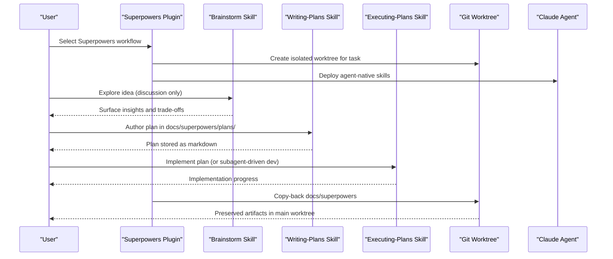
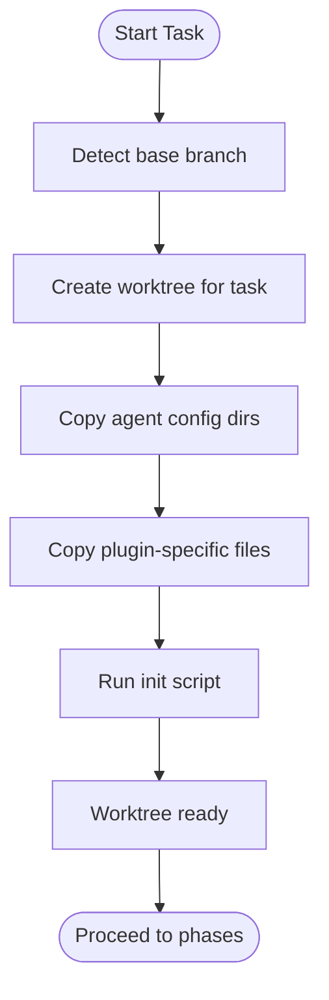
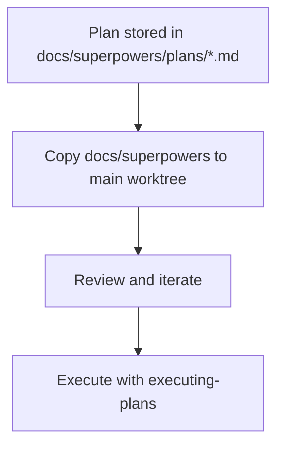
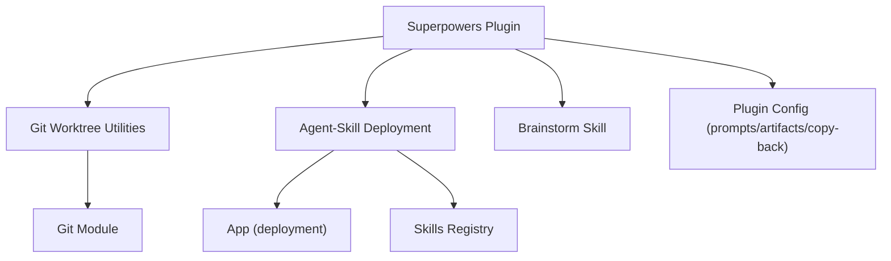

# Superpowers Plugin

<cite>
**Referenced Files in This Document**
- [plugin.toml](file://plugins/superpowers/plugin.toml)
- [SKILL.md](file://skills/brainstorm/SKILL.md)
- [install.sh](file://install.sh)
- [worktree.rs](file://src/git/worktree.rs)
- [mod.rs](file://src/git/mod.rs)
- [app.rs](file://src/tui/app.rs)
- [skills.rs](file://src/skills.rs)
- [plugin.toml](file://plugins/agent-skills/plugin.toml)
- [plugin.toml](file://plugins/oh-my-claudecode/plugin.toml)
</cite>

## Table of Contents
1. [Introduction](#introduction)
2. [Project Structure](#project-structure)
3. [Core Components](#core-components)
4. [Architecture Overview](#architecture-overview)
5. [Detailed Component Analysis](#detailed-component-analysis)
6. [Dependency Analysis](#dependency-analysis)
7. [Performance Considerations](#performance-considerations)
8. [Troubleshooting Guide](#troubleshooting-guide)
9. [Conclusion](#conclusion)
10. [Appendices](#appendices)

## Introduction
Superpowers is a specialized workflow plugin that formalizes a three-phase cycle for complex development tasks: ideation through brainstorming, planning via writing-plans, and execution through executing-plans with optional subagent coordination. It integrates tightly with Claude’s plugin ecosystem, automates plugin installation via an init script, and manages design artifacts persistently in docs/superpowers/plans/. The plugin also supports a copy-back mechanism to preserve planning artifacts in the main worktree for later phases and collaboration.

Superpowers complements standard workflows by emphasizing structured exploration and documentation-first planning before implementation, while still allowing seamless handoff to execution and review phases.

## Project Structure
The Superpowers plugin is defined by a small but powerful configuration that declares:
- Supported agents (Claude)
- An init script for automatic plugin installation
- Artifact patterns for planning documents
- Prompt templates for planning, running, and review
- Copy-back rules to bring planning artifacts into the main worktree

Key locations:
- Plugin definition: plugins/superpowers/plugin.toml
- Brainstorm skill: skills/brainstorm/SKILL.md
- Git worktree utilities: src/git/worktree.rs and src/git/mod.rs
- Agent-native skill deployment: src/tui/app.rs and src/skills.rs
- Example of another plugin with copy-back: plugins/oh-my-claudecode/plugin.toml
- Example of a competing plugin with prompts and commands: plugins/agent-skills/plugin.toml

**Diagram sources**
- [plugin.toml](file://plugins/superpowers/plugin.toml)
- [SKILL.md](file://skills/brainstorm/SKILL.md)
- [worktree.rs](file://src/git/worktree.rs)
- [mod.rs](file://src/git/mod.rs)
- [app.rs](file://src/tui/app.rs)
- [skills.rs](file://src/skills.rs)
- [plugin.toml](file://plugins/oh-my-claudecode/plugin.toml)
- [plugin.toml](file://plugins/agent-skills/plugin.toml)

**Section sources**
- [plugin.toml](file://plugins/superpowers/plugin.toml)
- [SKILL.md](file://skills/brainstorm/SKILL.md)
- [worktree.rs](file://src/git/worktree.rs)
- [mod.rs](file://src/git/mod.rs)
- [app.rs](file://src/tui/app.rs)
- [skills.rs](file://src/skills.rs)
- [plugin.toml](file://plugins/oh-my-claudecode/plugin.toml)
- [plugin.toml](file://plugins/agent-skills/plugin.toml)

## Core Components
- Plugin configuration: Declares supported agents, prompts, artifact patterns, and copy-back behavior.
- Brainstorm skill: A discussion-only skill that encourages exploratory thinking without planning or implementation.
- Git worktree orchestration: Creates isolated workspaces per task, initializes them with agent configs and plugin assets, and runs init scripts.
- Agent-native skill deployment: Writes both canonical and agent-specific command files for skills across supported agents.
- Copy-back mechanism: Ensures planning artifacts are preserved in the main worktree after each phase.

Practical implications:
- Use Superpowers when you need disciplined ideation and documentation before diving into implementation.
- Combine with git worktrees to keep experiments isolated and reproducible.
- Preserve design artifacts for peer review and future phases.

**Section sources**
- [plugin.toml](file://plugins/superpowers/plugin.toml)
- [SKILL.md](file://skills/brainstorm/SKILL.md)
- [worktree.rs](file://src/git/worktree.rs)
- [app.rs](file://src/tui/app.rs)
- [skills.rs](file://src/skills.rs)

## Architecture Overview
The Superpowers workflow orchestrates three phases:
1. Ideation: Use the brainstorm skill to explore ideas without committing to plans or code.
2. Planning: Produce implementation plans in docs/superpowers/plans/ using the writing-plans skill.
3. Execution: Implement the plan using executing-plans or subagent-driven-development, then review.

The system leverages git worktrees to isolate each task, deploys agent-native skills, and copies back planning artifacts to the main worktree for continuity.

**Diagram sources**
- [plugin.toml](file://plugins/superpowers/plugin.toml)
- [SKILL.md](file://skills/brainstorm/SKILL.md)
- [worktree.rs](file://src/git/worktree.rs)
- [app.rs](file://src/tui/app.rs)

## Detailed Component Analysis

### Plugin Configuration and Artifacts
- Supported agents: Claude
- Init script: Automatically installs the Superpowers plugin for Claude
- Artifacts: Planning documents stored under docs/superpowers/plans/*.md
- Prompts:
  - Planning: Guides the agent to use brainstorming, then writing-plans, within an isolated worktree
  - Running: Instructs the agent to implement the plan using executing-plans or subagent-driven-development
  - Review: Requests a code review of completed work
- Copy-back: Brings docs/superpowers back to the main worktree after planning

These settings enable a repeatable, artifact-rich process that preserves design decisions for later phases and collaboration.

**Section sources**
- [plugin.toml](file://plugins/superpowers/plugin.toml)

### Brainstorm Skill
- Purpose: Encourage exploratory thinking without moving into planning or implementation
- Behavior: Keeps the session in discussion mode; avoids proposing concrete steps or code
- Handoff: Provides a clear prompt to run /agtx:sweep to turn outcomes into tasks

This skill ensures that ideas are fully explored before committing to a plan, reducing rework downstream.

**Section sources**
- [SKILL.md](file://skills/brainstorm/SKILL.md)

### Git Worktree Orchestration
- Creation: Creates an isolated worktree per task, branching from a resolved base branch
- Initialization: Copies agent config directories, plugin-specific files, and runs init scripts
- Cleanup: Removes worktrees and prunes stale entries when needed
- Integration: Used by the Superpowers plugin to ensure each task runs in isolation

**Diagram sources**
- [worktree.rs](file://src/git/worktree.rs)
- [mod.rs](file://src/git/mod.rs)

**Section sources**
- [worktree.rs](file://src/git/worktree.rs)
- [mod.rs](file://src/git/mod.rs)

### Agent-Native Skill Deployment
- Canonical skills are deployed alongside agent-native formats for each agent
- For Claude, skills are written as .md files in agent-specific directories
- The deployment logic transforms frontmatter and filenames according to agent conventions

This ensures that Superpowers’ skills are discoverable and usable across agents, while maintaining a consistent internal structure.

**Section sources**
- [app.rs](file://src/tui/app.rs)
- [skills.rs](file://src/skills.rs)

### Copy-Back Mechanism
- After planning, Superpowers copies docs/superpowers back to the main worktree
- This preserves design artifacts for peer review, future planning, and integration with other workflows
- Example pattern: Similar behavior is implemented by oh-my-claudecode for .omc artifacts

**Diagram sources**
- [plugin.toml](file://plugins/superpowers/plugin.toml)
- [plugin.toml](file://plugins/oh-my-claudecode/plugin.toml)

**Section sources**
- [plugin.toml](file://plugins/superpowers/plugin.toml)
- [plugin.toml](file://plugins/oh-my-claudecode/plugin.toml)

### Practical Examples and Use Cases
- Complex feature development: Use brainstorm to explore alternatives, writing-plans to capture decisions, and executing-plans to implement incrementally with review cycles.
- Architectural design phases: Store design rationale and alternatives in docs/superpowers/plans/ for stakeholder alignment and auditability.
- Collaborative planning: Share planning documents across team members; copy-back ensures everyone sees the latest design artifacts.

### Configuration Options and Customization
- Planning prompts: Customize the planning prompt template in the plugin configuration to guide the agent’s approach for your domain.
- Running prompts: Adjust the running prompt to emphasize TDD, subagent coordination, or other practices.
- Copy-back directories: Extend copy_back to include additional directories or files relevant to your workflow.

Note: The plugin exposes prompts and copy_back sections in its configuration for customization.

**Section sources**
- [plugin.toml](file://plugins/superpowers/plugin.toml)

### Integration Patterns with Git Worktrees
- Each task runs in an isolated worktree to prevent cross-contamination and simplify cleanup.
- Agent configs and plugin assets are copied into the worktree to ensure skills are available during each phase.
- The init script runs automatically to set up the environment for the Superpowers workflow.

**Section sources**
- [worktree.rs](file://src/git/worktree.rs)
- [plugin.toml](file://plugins/superpowers/plugin.toml)

### Comparison with Other Plugins
- Agent Skills: A competing plugin with prompts and commands for a spec-to-ship lifecycle; useful for comparison of prompt strategies and artifact management.
- Oh My ClaudeCode: Demonstrates a robust copy-back mechanism for multi-agent orchestration artifacts (.omc), offering a model for how Superpowers can preserve planning artifacts.

**Section sources**
- [plugin.toml](file://plugins/agent-skills/plugin.toml)
- [plugin.toml](file://plugins/oh-my-claudecode/plugin.toml)

## Dependency Analysis
Superpowers depends on:
- Git worktree utilities for isolation and initialization
- Agent-native skill deployment for cross-agent compatibility
- Brainstorm skill for ideation
- Plugin configuration for prompts, artifacts, and copy-back

**Diagram sources**
- [plugin.toml](file://plugins/superpowers/plugin.toml)
- [worktree.rs](file://src/git/worktree.rs)
- [mod.rs](file://src/git/mod.rs)
- [app.rs](file://src/tui/app.rs)
- [skills.rs](file://src/skills.rs)
- [SKILL.md](file://skills/brainstorm/SKILL.md)

**Section sources**
- [plugin.toml](file://plugins/superpowers/plugin.toml)
- [worktree.rs](file://src/git/worktree.rs)
- [mod.rs](file://src/git/mod.rs)
- [app.rs](file://src/tui/app.rs)
- [skills.rs](file://src/skills.rs)
- [SKILL.md](file://skills/brainstorm/SKILL.md)

## Performance Considerations
- Worktree creation and initialization add overhead; batching tasks or reusing worktrees where safe can reduce latency.
- Copy-back operations should be scoped to necessary directories to minimize I/O.
- Prompt customization can influence model invocation frequency; keep prompts concise yet effective.

## Troubleshooting Guide
- Plugin not installed: The init script attempts to install Superpowers for Claude. If it fails, verify agent connectivity and plugin marketplace access.
- Worktree creation failures: Ensure git is available and the base branch resolves correctly. Check for permission issues in the worktree directory.
- Skills not available: Confirm that agent-native skill deployment ran and that the agent-specific directories exist in the worktree.
- Copy-back missing files: Verify the copy_back configuration and that the target directories exist post-phase completion.

**Section sources**
- [plugin.toml](file://plugins/superpowers/plugin.toml)
- [worktree.rs](file://src/git/worktree.rs)
- [app.rs](file://src/tui/app.rs)
- [install.sh](file://install.sh)

## Conclusion
Superpowers provides a disciplined, artifact-rich workflow that pairs exploratory brainstorming with documented planning and structured execution. Its integration with git worktrees, agent-native skill deployment, and copy-back mechanisms makes it ideal for complex feature development, architectural design, and collaborative planning. By customizing prompts and extending copy-back rules, teams can tailor Superpowers to their specific needs while preserving design artifacts for transparency and continuity.

## Appendices

### Quick Start Checklist
- Install the Superpowers plugin via the init script for Claude
- Create a task and run brainstorm to explore ideas
- Author a plan in docs/superpowers/plans/
- Execute the plan and review the results
- Leverage copy-back to preserve artifacts for future phases

### Related Scripts and Tools
- Installer script for the broader agtx toolchain: install.sh

**Section sources**
- [install.sh](file://install.sh)
- [plugin.toml](file://plugins/superpowers/plugin.toml)