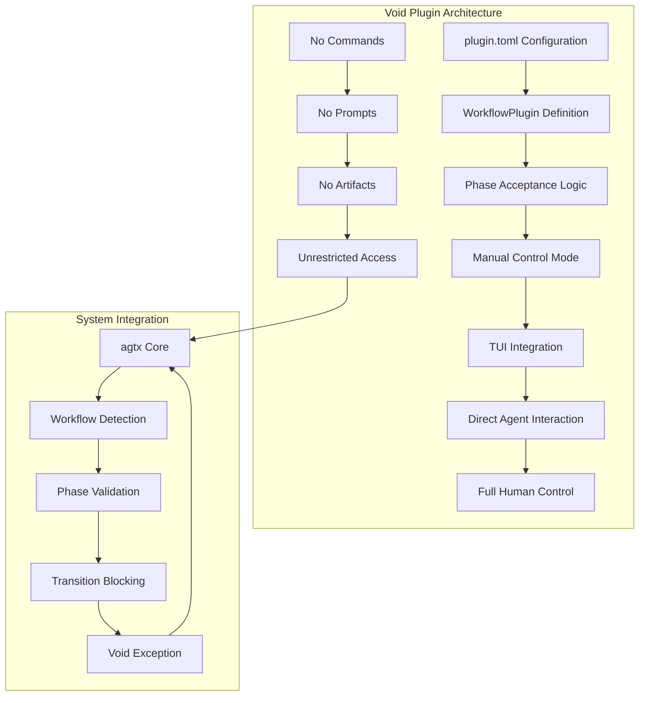
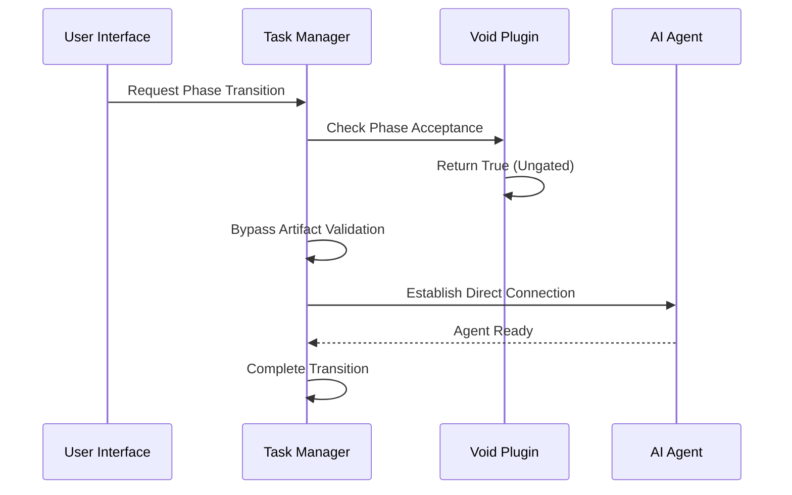

# Void Plugin

<cite>
**Referenced Files in This Document**
- [plugin.toml](file://plugins/void/plugin.toml)
- [README.md](file://README.md)
- [mod.rs](file://src/config/mod.rs)
- [app.rs](file://src/tui/app.rs)
- [app_tests.rs](file://src/tui/app_tests.rs)
- [skills.rs](file://src/skills.rs)
- [server.rs](file://src/mcp/server.rs)
</cite>

## Table of Contents
1. [Introduction](#introduction)
2. [Plugin Architecture](#plugin-architecture)
3. [Core Functionality](#core-functionality)
4. [Configuration and Setup](#configuration-and-setup)
5. [Integration with Task Management](#integration-with-task-management)
6. [Use Cases and Scenarios](#use-cases-and-scenarios)
7. [Comparison with Other Plugins](#comparison-with-other-plugins)
8. [Advanced Usage Patterns](#advanced-usage-patterns)
9. [Troubleshooting and Best Practices](#troubleshooting-and-best-practices)
10. [Conclusion](#conclusion)

## Introduction

The Void plugin serves as a fundamental component in the agtx workflow ecosystem, providing a passthrough mode that allows direct task manipulation without enforcing standard workflow phases or transitions. Unlike spec-driven plugins that automate task progression through structured phases, Void operates as a manual control mode that gives users complete autonomy over their coding sessions.

This plugin represents the antithesis of automated workflow enforcement, offering a "plain coding agent session" where users can work directly with their chosen AI coding agent without any prompting or skills intervention. The Void plugin is particularly valuable for emergency situations, custom workflow scenarios, and expert user control requirements where traditional workflow automation would be restrictive or inappropriate.

## Plugin Architecture

The Void plugin follows a minimalist design philosophy that prioritizes user control over automation. Its architecture is intentionally simple, consisting primarily of configuration metadata that signals the system to bypass standard workflow enforcement mechanisms.



**Diagram sources**
- [plugin.toml:1-4](file://plugins/void/plugin.toml#L1-L4)
- [mod.rs:512-543](file://src/config/mod.rs#L512-L543)

The architecture centers around the concept of "phase acceptance" - the Void plugin is designed to be ungated for all phases, meaning tasks can be moved directly between phases without requiring prerequisite artifacts or commands. This design choice reflects the plugin's core philosophy of providing unrestricted manual control.

**Section sources**
- [plugin.toml:1-4](file://plugins/void/plugin.toml#L1-L4)
- [mod.rs:512-543](file://src/config/mod.rs#L512-L543)

## Core Functionality

### Passthrough Operation Model

The Void plugin operates as a true passthrough, eliminating all workflow enforcement mechanisms that would normally constrain task progression. This functionality is achieved through several key design decisions:

**Phase Acceptance Mechanism**: The plugin's phase acceptance logic treats all phases as "ungated" - meaning tasks can enter Planning or Running phases directly from Backlog without requiring research artifacts or prior phase completion. This is fundamentally different from spec-driven plugins where phases are gated by artifact existence.

**Command-Free Environment**: Unlike other plugins that rely on specific slash commands for each phase, Void operates without any predefined commands. When commands are explicitly set to empty strings in the plugin configuration, the system recognizes this as a signal to bypass command execution entirely.

**Prompt-Free Experience**: The absence of prompts means users retain complete control over what they instruct their AI agents to do. There are no standardized prompts that might interfere with custom workflows or debugging processes.

**Artifact Independence**: Void plugins don't rely on specific artifact files to signal phase completion. This eliminates the need for complex artifact detection and synchronization mechanisms that could interfere with manual control.

### Manual Control Capabilities

The manual control mode enabled by Void provides several advantages for advanced users:

**Direct Agent Interaction**: Users can communicate directly with their AI agents without any intermediate workflow prompts or skill interventions. This is particularly valuable during debugging phases when precise control over agent instructions is essential.

**Custom Workflow Support**: Teams with non-standard development processes can leverage Void to implement their own workflow patterns without being constrained by predefined phase structures.

**Emergency Response Flexibility**: In crisis situations where standard workflows fail or become counterproductive, Void provides a reliable fallback mechanism that maintains system stability while allowing expert intervention.

**Expert User Empowerment**: Advanced users who prefer to manage their own workflow processes can operate with complete autonomy,不受任何自动化限制.

**Section sources**
- [mod.rs:512-543](file://src/config/mod.rs#L512-L543)
- [app_tests.rs:3959-3980](file://src/tui/app_tests.rs#L3959-L3980)

## Configuration and Setup

### Minimal Configuration Approach

The Void plugin exemplifies the principle of minimal configuration by providing only essential metadata required for system recognition. The entire plugin configuration consists of just four lines:

```toml
name = "void"
description = "Plain coding agent session without any prompting or skills"
cyclic = true
```

This minimal approach contrasts sharply with other plugins that require extensive configuration of commands, prompts, artifacts, and phase transitions. The simplicity of Void's configuration serves multiple purposes:

**Reduced Cognitive Load**: Users don't need to understand complex plugin mechanics or remember numerous configuration options.

**Lower Maintenance Burden**: With fewer configuration options, there's less risk of misconfiguration and reduced maintenance overhead.

**Universal Compatibility**: The simple structure ensures compatibility across all supported AI coding agents without requiring agent-specific adaptations.

**Section sources**
- [plugin.toml:1-4](file://plugins/void/plugin.toml#L1-L4)

### Integration with Existing Systems

The Void plugin integrates seamlessly with agtx's existing infrastructure through several key mechanisms:

**Plugin Discovery**: The system automatically discovers Void as a bundled plugin during startup, making it immediately available alongside other workflow plugins without additional installation steps.

**Workflow Plugin Loading**: Void integrates with the standard workflow plugin loading mechanism, allowing it to be selected through the same interface used for other plugins.

**Agent Compatibility**: Void supports all AI coding agents without requiring agent-specific modifications, leveraging the universal compatibility principle established in the main README.

**Section sources**
- [skills.rs:170-173](file://src/skills.rs#L170-L173)
- [README.md:366](file://README.md#L366)

## Integration with Task Management

### Phase Transition Behavior

The Void plugin fundamentally alters how phase transitions are handled within the task management system. Traditional plugins enforce strict phase gating based on artifact existence and command execution, while Void removes these constraints entirely.



**Diagram sources**
- [mod.rs:512-543](file://src/config/mod.rs#L512-L543)
- [app.rs:4808-4832](file://src/tui/app.rs#L4808-L4832)

### Task Lifecycle Management

Under Void's manual control model, the task lifecycle becomes significantly more flexible:

**Backlog to Planning**: Tasks can move directly to Planning without requiring research artifacts or preliminary setup commands.

**Planning to Running**: The transition from Planning to Running occurs without any validation of planning artifacts or completion criteria.

**Review and Done States**: While Void primarily focuses on the earlier phases, it maintains compatibility with the full task lifecycle, allowing tasks to progress through Review and Done states as needed.

**Cycle Management**: The cyclic setting in Void's configuration enables multi-phase workflows when needed, though this is less commonly used given the plugin's emphasis on manual control.

**Section sources**
- [app.rs:4808-4832](file://src/tui/app.rs#L4808-L4832)
- [app.rs:5418-5452](file://src/tui/app.rs#L5418-L5452)

### MCP Server Integration

The Void plugin also integrates with agtx's Model Context Protocol (MCP) server, enabling external tools and agents to interact with tasks managed under manual control:

**Allowed Actions Calculation**: The MCP server determines which task actions are valid based on the current plugin configuration, with Void allowing all standard actions without restriction.

**Task State Reporting**: The system accurately reports task states and allowed transitions, maintaining transparency even when operating under manual control.

**External Tool Compatibility**: Third-party tools can interact with Void-managed tasks using the standard MCP protocol, preserving interoperability with the broader agtx ecosystem.

**Section sources**
- [server.rs:473-505](file://src/mcp/server.rs#L473-L505)

## Use Cases and Scenarios

### Emergency Situations

The Void plugin excels in emergency scenarios where standard workflow automation fails or becomes counterproductive:

**System Crashes**: When automated workflow systems encounter errors or become unresponsive, Void provides a reliable fallback that maintains system functionality while allowing expert intervention.

**Critical Bug Fixes**: During urgent bug fixes, developers often need complete control over their AI agent interactions. Void eliminates any potential interference from automated prompts or skill executions.

**Security Incidents**: In security-sensitive situations, teams may need to bypass standard workflows to implement immediate protective measures without delay.

**Infrastructure Failures**: When integrated systems experience failures, Void allows teams to maintain productivity by operating outside the normal workflow constraints.

### Custom Workflow Scenarios

Organizations with unique development processes benefit significantly from Void's flexibility:

**Research-First Organizations**: Some teams prefer to conduct extensive research before any implementation work begins. Void allows this process to unfold naturally without forcing premature transitions.

**Prototyping Environments**: Rapid prototyping often requires iterative experimentation that doesn't fit standard workflow phases. Void enables this exploratory approach.

**Academic Research**: Universities and research institutions often need flexible workflows that accommodate different research methodologies and publication cycles.

**Experimental Development**: Teams exploring new technologies or methodologies can operate without being constrained by established workflow patterns.

### Expert User Control Requirements

Advanced users and expert teams frequently require the level of control that Void provides:

**Deep Debugging Sessions**: When investigating complex issues, developers need complete control over agent instructions and interactions without any automated interference.

**Custom Tool Integration**: Teams developing proprietary tools or frameworks may need to integrate custom scripts and processes that aren't compatible with standard workflow plugins.

**Highly Specialized Workflows**: Certain domains require workflows that are too complex or unique to be adequately represented by standard plugin configurations.

**Legacy System Maintenance**: Working with legacy systems often requires unconventional approaches that standard workflows cannot accommodate.

### Practical Implementation Examples

The following scenarios demonstrate how Void can be effectively utilized in real-world situations:

**Debugging Phase Example**: A developer encounters a complex memory leak issue that requires extensive investigation. Using Void, they can establish a direct connection with their AI agent and guide the debugging process without any automated prompts interfering with their methodology.

**Custom Integration Example**: A team building a specialized data processing pipeline needs to integrate with proprietary tools that don't follow standard workflow patterns. Void allows them to implement their custom integration without being constrained by standard phase structures.

**Emergency Response Example**: During a production incident, the automated workflow system becomes unresponsive. The team switches to Void mode to maintain operations while they investigate and resolve the underlying system issue.

**Section sources**
- [README.md:68-71](file://README.md#L68-L71)
- [app_tests.rs:3959-3980](file://src/tui/app_tests.rs#L3959-L3980)

## Comparison with Other Plugins

### Structural Differences

The Void plugin represents a fundamental departure from other workflow plugins in agtx, with several key structural differences:

**Command Architecture**: Unlike spec-driven plugins that rely on specific slash commands for each phase, Void operates without any predefined commands, providing complete freedom in agent interactions.

**Artifact Dependencies**: Standard plugins depend on specific artifact files to signal phase completion, while Void operates independently of artifact detection mechanisms.

**Phase Gating**: Other plugins implement strict phase gating based on artifact existence, whereas Void removes all gating constraints for maximum flexibility.

**Skill Integration**: Spec-driven plugins integrate with sophisticated skill systems, while Void provides a clean slate for custom skill development or external tool integration.

### Functional Trade-offs

Each plugin type offers different advantages depending on the use case:

**Void vs. GSD**: While GSD provides structured spec-driven development with comprehensive artifact tracking, Void offers complete manual control that can accommodate workflows GSD cannot represent.

**Void vs. Spec-Kit**: Spec-Kit emphasizes specification-driven development with formal documentation requirements, while Void focuses on flexible agent interaction without documentation constraints.

**Void vs. BMAD**: BMAD provides structured agile development methodologies, whereas Void enables completely custom development processes that may not align with traditional agile frameworks.

**Void vs. Superpowers**: Superpowers offers brainstorming and subagent capabilities, but Void provides a simpler foundation for teams that prefer direct agent interaction over complex multi-agent orchestration.

### Selection Criteria

Choosing between Void and other plugins depends on several factors:

**Team Experience Level**: Less experienced teams may benefit from the structure provided by spec-driven plugins, while expert teams often prefer Void's flexibility.

**Project Complexity**: Simple projects may not require the complexity of spec-driven plugins, making Void a more appropriate choice.

**Regulatory Requirements**: Projects with strict documentation requirements may need spec-driven plugins, while experimental projects can leverage Void's flexibility.

**Development Speed**: Teams prioritizing rapid iteration may prefer Void's streamlined approach over the structured processes of other plugins.

**Section sources**
- [README.md:337-346](file://README.md#L337-L346)
- [README.md:356-366](file://README.md#L356-L366)

## Advanced Usage Patterns

### Hybrid Workflow Strategies

Teams can effectively combine Void with other plugins based on specific project needs:

**Phase-Specific Plugin Selection**: Different phases of a project can use different plugins, allowing teams to leverage Void for debugging while using structured plugins for routine development work.

**Project Segmentation**: Large projects can be divided into segments, with some parts using Void for experimental work and others using structured plugins for production code.

**Team Specialization**: Different development teams within an organization can use different plugins based on their specific requirements and expertise levels.

**Milestone-Based Switching**: Teams can start with structured plugins and switch to Void for specialized phases, then return to structured plugins for final integration.

### Integration with External Tools

Void's flexibility makes it an excellent foundation for integrating external tools and processes:

**CI/CD Pipeline Integration**: Teams can integrate Void-managed tasks with custom CI/CD pipelines that don't conform to standard workflow patterns.

**Proprietary Tool Integration**: Organizations can integrate Void with proprietary development tools that require custom interaction patterns.

**Legacy System Integration**: Void enables integration with legacy systems that have unique requirements or constraints.

**Custom Testing Frameworks**: Teams can develop custom testing frameworks that work outside standard workflow constraints.

### Performance Optimization

While Void doesn't provide the automation benefits of other plugins, it offers several performance advantages:

**Reduced Overhead**: Without artifact tracking and phase validation, Void consumes fewer system resources than more complex plugins.

**Faster Transitions**: Phase transitions occur instantly without waiting for artifact detection or validation processes.

**Simplified Debugging**: When issues arise, the simplified architecture makes debugging and troubleshooting more straightforward.

**Resource Efficiency**: Void's minimal resource requirements make it suitable for environments with limited computational resources.

## Troubleshooting and Best Practices

### Common Issues and Solutions

**Unexpected Phase Transitions**: If tasks unexpectedly move between phases in Void mode, verify that the plugin configuration hasn't been inadvertently modified and that the phase acceptance logic is functioning correctly.

**Agent Communication Problems**: When AI agents don't respond as expected, check that the agent is properly configured and that there are no network connectivity issues preventing communication.

**Task State Inconsistencies**: If task states appear inconsistent, ensure that the MCP server is functioning correctly and that all external tools are properly synchronized with the task management system.

**Performance Degradation**: Monitor system performance when using Void extensively, as the lack of automation may lead to increased manual intervention requirements.

### Best Practices

**Clear Documentation**: Even though Void provides manual control, maintain clear documentation of custom workflows and procedures to ensure team consistency.

**Regular Audits**: Conduct periodic audits of Void-managed tasks to ensure they remain aligned with project goals and don't accumulate technical debt.

**Backup Procedures**: Implement backup procedures for Void-managed tasks, as the lack of automated artifact tracking means manual backups may be necessary.

**Training Requirements**: Ensure team members understand the responsibilities that come with manual control, including the need for careful task management and coordination.

**Integration Testing**: Regularly test integrations with external tools and processes to ensure compatibility and reliability.

### Security Considerations

**Access Control**: Implement appropriate access controls for Void-managed tasks, especially in shared development environments.

**Audit Trails**: Maintain audit trails for all Void-managed activities to ensure accountability and traceability.

**Data Protection**: Ensure that sensitive data processed under Void remains protected according to organizational policies and regulatory requirements.

**Compliance Requirements**: Verify that Void usage complies with applicable regulations and industry standards for the specific domain or organization.

## Conclusion

The Void plugin represents a crucial component in the agtx ecosystem, providing essential manual control capabilities that complement the automation features of other workflow plugins. Its minimalist design philosophy and comprehensive manual control approach make it invaluable for emergency situations, custom workflow scenarios, and expert user control requirements.

The plugin's strength lies in its ability to provide complete flexibility without sacrificing system stability or interoperability. By operating as a true passthrough that bypasses standard workflow enforcement mechanisms, Void enables teams to implement custom development processes, handle emergency situations effectively, and maintain complete control over their AI agent interactions.

As organizations continue to evolve their development practices and face increasingly complex challenges, the Void plugin serves as a reminder that sometimes the most powerful tool is the one that provides the greatest flexibility and control. Its integration with the broader agtx ecosystem ensures that teams can leverage Void's capabilities while maintaining compatibility with other workflow plugins and system components.

The future of workflow management likely lies in hybrid approaches that combine the automation benefits of structured plugins with the flexibility of manual control modes like Void. This balance between automation and control will enable teams to optimize their development processes for maximum effectiveness while maintaining the adaptability needed to handle diverse and evolving requirements.