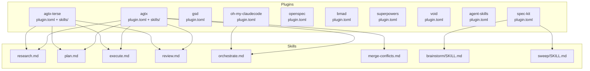
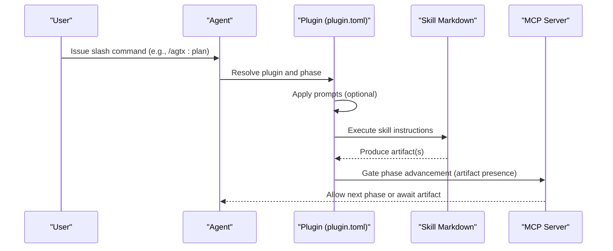
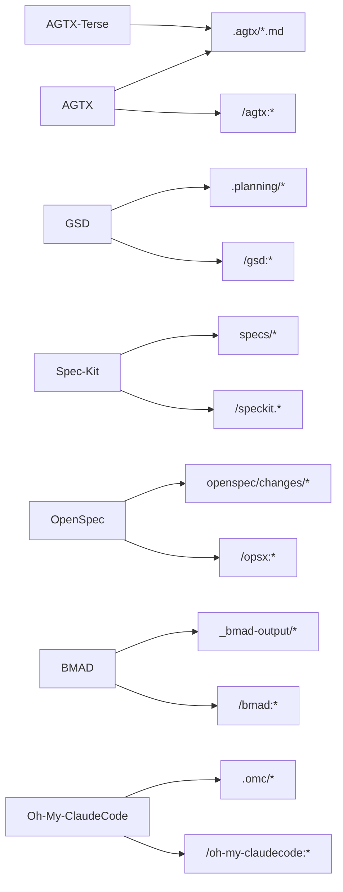

# Workflow Plugins

<cite>
**Referenced Files in This Document**
- [plugins/agtx/plugin.toml](file://plugins/agtx/plugin.toml)
- [plugins/agtx/skills/research.md](file://plugins/agtx/skills/research.md)
- [plugins/agtx/skills/plan.md](file://plugins/agtx/skills/plan.md)
- [plugins/agtx/skills/execute.md](file://plugins/agtx/skills/execute.md)
- [plugins/agtx/skills/review.md](file://plugins/agtx/skills/review.md)
- [plugins/agtx/skills/orchestrate.md](file://plugins/agtx/skills/orchestrate.md)
- [plugins/agtx/skills/merge-conflicts.md](file://plugins/agtx/skills/merge-conflicts.md)
- [plugins/agtx-terse/plugin.toml](file://plugins/agtx-terse/plugin.toml)
- [plugins/gsd/plugin.toml](file://plugins/gsd/plugin.toml)
- [plugins/spec-kit/plugin.toml](file://plugins/spec-kit/plugin.toml)
- [plugins/openspec/plugin.toml](file://plugins/openspec/plugin.toml)
- [plugins/bmad/plugin.toml](file://plugins/bmad/plugin.toml)
- [plugins/superpowers/plugin.toml](file://plugins/superpowers/plugin.toml)
- [plugins/void/plugin.toml](file://plugins/void/plugin.toml)
- [plugins/agent-skills/plugin.toml](file://plugins/agent-skills/plugin.toml)
- [plugins/oh-my-claudecode/plugin.toml](file://plugins/oh-my-claudecode/plugin.toml)
- [skills/brainstorm/SKILL.md](file://skills/brainstorm/SKILL.md)
- [skills/sweep/SKILL.md](file://skills/sweep/SKILL.md)
</cite>

## Table of Contents
1. [Introduction](#introduction)
2. [Project Structure](#project-structure)
3. [Core Components](#core-components)
4. [Architecture Overview](#architecture-overview)
5. [Detailed Component Analysis](#detailed-component-analysis)
6. [Dependency Analysis](#dependency-analysis)
7. [Performance Considerations](#performance-considerations)
8. [Troubleshooting Guide](#troubleshooting-guide)
9. [Conclusion](#conclusion)
10. [Appendices](#appendices)

## Introduction
This document explains the agtx workflow plugins system: its extensible plugin architecture, TOML configuration format, command translation for agent compatibility, and artifact-based phase gating. It documents each built-in plugin’s capabilities, configuration options, and how they integrate with the agtx kanban board and MCP tools. Guidance is included for selecting plugins based on project requirements and team preferences, along with practical steps for creating custom plugins and skills.

## Project Structure
The plugin system is organized under plugins/<plugin-name>/ with a plugin.toml configuration and optional skills/ and directories. Each plugin defines:
- Plugin metadata and behavior (name, description, cyclic, clear_context_on_advance)
- Artifacts that gate phase transitions
- Commands mapped to slash commands for agents
- Optional prompts, copy_back, copy_dirs, auto_dismiss, supported_agents, and init_script

**Diagram sources**
- [plugins/agtx/plugin.toml:1-16](file://plugins/agtx/plugin.toml#L1-L16)
- [plugins/agtx/skills/research.md:1-45](file://plugins/agtx/skills/research.md#L1-L45)
- [plugins/agtx/skills/plan.md:1-43](file://plugins/agtx/skills/plan.md#L1-L43)
- [plugins/agtx/skills/execute.md:1-39](file://plugins/agtx/skills/execute.md#L1-L39)
- [plugins/agtx/skills/review.md:1-36](file://plugins/agtx/skills/review.md#L1-L36)
- [plugins/agtx/skills/orchestrate.md:1-200](file://plugins/agtx/skills/orchestrate.md#L1-L200)
- [plugins/agtx/skills/merge-conflicts.md:1-53](file://plugins/agtx/skills/merge-conflicts.md#L1-L53)
- [plugins/agtx-terse/plugin.toml:1-16](file://plugins/agtx-terse/plugin.toml#L1-L16)
- [plugins/spec-kit/plugin.toml:1-21](file://plugins/spec-kit/plugin.toml#L1-L21)
- [skills/brainstorm/SKILL.md:1-51](file://skills/brainstorm/SKILL.md#L1-L51)
- [skills/sweep/SKILL.md:1-153](file://skills/sweep/SKILL.md#L1-L153)
- [plugins/oh-my-claudecode/plugin.toml:1-41](file://plugins/oh-my-claudecode/plugin.toml#L1-L41)

**Section sources**
- [plugins/agtx/plugin.toml:1-16](file://plugins/agtx/plugin.toml#L1-L16)
- [plugins/agtx-terse/plugin.toml:1-16](file://plugins/agtx-terse/plugin.toml#L1-L16)
- [plugins/gsd/plugin.toml:1-34](file://plugins/gsd/plugin.toml#L1-L34)
- [plugins/spec-kit/plugin.toml:1-21](file://plugins/spec-kit/plugin.toml#L1-L21)
- [plugins/openspec/plugin.toml:1-21](file://plugins/openspec/plugin.toml#L1-L21)
- [plugins/bmad/plugin.toml:1-22](file://plugins/bmad/plugin.toml#L1-L22)
- [plugins/superpowers/plugin.toml:1-16](file://plugins/superpowers/plugin.toml#L1-L16)
- [plugins/void/plugin.toml:1-4](file://plugins/void/plugin.toml#L1-L4)
- [plugins/agent-skills/plugin.toml:1-19](file://plugins/agent-skills/plugin.toml#L1-L19)
- [plugins/oh-my-claudecode/plugin.toml:1-41](file://plugins/oh-my-claudecode/plugin.toml#L1-L41)

## Core Components
- Plugin configuration (TOML):
  - name, description, cyclic, clear_context_on_advance
  - artifacts: glob patterns per phase (research, planning, running, review)
  - commands: slash commands per phase
  - prompts: optional inline prompts per phase
  - copy_back/copy_dirs/auto_dismiss/supported_agents/init_script: optional behaviors for artifact synchronization, directory copying, agent-specific setup, and dismissal automation
- Skill-based phases (AGTX/AGTX-Terse):
  - research, plan, execute, review, orchestrate, merge-conflicts
- Specialized plugins:
  - GSD, Spec-Kit, OpenSpec, BMAD, Superpowers, Void, Agent-Skills, Oh-My-ClaudeCode
- MCP integration:
  - Orchestrator skill coordinates tasks via MCP tools (list_tasks, get_task, move_task, etc.)

**Section sources**
- [plugins/agtx/plugin.toml:1-16](file://plugins/agtx/plugin.toml#L1-L16)
- [plugins/agtx/skills/research.md:1-45](file://plugins/agtx/skills/research.md#L1-L45)
- [plugins/agtx/skills/plan.md:1-43](file://plugins/agtx/skills/plan.md#L1-L43)
- [plugins/agtx/skills/execute.md:1-39](file://plugins/agtx/skills/execute.md#L1-L39)
- [plugins/agtx/skills/review.md:1-36](file://plugins/agtx/skills/review.md#L1-L36)
- [plugins/agtx/skills/orchestrate.md:1-200](file://plugins/agtx/skills/orchestrate.md#L1-L200)
- [plugins/agtx/skills/merge-conflicts.md:1-53](file://plugins/agtx/skills/merge-conflicts.md#L1-L53)
- [plugins/agtx-terse/plugin.toml:1-16](file://plugins/agtx-terse/plugin.toml#L1-L16)
- [plugins/gsd/plugin.toml:1-34](file://plugins/gsd/plugin.toml#L1-L34)
- [plugins/spec-kit/plugin.toml:1-21](file://plugins/spec-kit/plugin.toml#L1-L21)
- [plugins/openspec/plugin.toml:1-21](file://plugins/openspec/plugin.toml#L1-L21)
- [plugins/bmad/plugin.toml:1-22](file://plugins/bmad/plugin.toml#L1-L22)
- [plugins/superpowers/plugin.toml:1-16](file://plugins/superpowers/plugin.toml#L1-L16)
- [plugins/void/plugin.toml:1-4](file://plugins/void/plugin.toml#L1-L4)
- [plugins/agent-skills/plugin.toml:1-19](file://plugins/agent-skills/plugin.toml#L1-L19)
- [plugins/oh-my-claudecode/plugin.toml:1-41](file://plugins/oh-my-claudecode/plugin.toml#L1-L41)

## Architecture Overview
The plugin architecture centers on:
- Command translation: agents issue slash commands (e.g., /agtx:plan, /gsd:discuss-phase) that map to plugin phases
- Artifact-based gating: each phase completes when a configured artifact file(s) appear(s)
- Optional prompts: plugins can inject prompts after commands
- Optional cyclic workflows: some plugins loop through phases
- Optional copy_back/copy_dirs: synchronize artifacts into the main worktree for downstream tasks
- Optional init_script and supported_agents: initialize external tools and restrict agent compatibility

**Diagram sources**
- [plugins/agtx/plugin.toml:11-16](file://plugins/agtx/plugin.toml#L11-L16)
- [plugins/agtx/skills/plan.md:1-43](file://plugins/agtx/skills/plan.md#L1-L43)
- [plugins/gsd/plugin.toml:15-21](file://plugins/gsd/plugin.toml#L15-L21)
- [plugins/openspec/plugin.toml:11-15](file://plugins/openspec/plugin.toml#L11-L15)
- [plugins/bmad/plugin.toml:10-14](file://plugins/bmad/plugin.toml#L10-L14)
- [plugins/oh-my-claudecode/plugin.toml:22-26](file://plugins/oh-my-claudecode/plugin.toml#L22-L26)

## Detailed Component Analysis

### AGTX (Default Workflow)
- Purpose: Full spec-to-ship lifecycle with explicit phases
- Commands: research, plan, execute, review
- Artifacts: .agtx/research.md, .agtx/plan.md, .agtx/execute.md, .agtx/review.md
- Clear context on advance: enabled
- Skills: research, plan, execute, review, orchestrate, merge-conflicts
- Notes: Supports MCP orchestration and artifact gating; suitable for teams wanting explicit phases and reviewable outputs

**Section sources**
- [plugins/agtx/plugin.toml:1-16](file://plugins/agtx/plugin.toml#L1-L16)
- [plugins/agtx/skills/research.md:1-45](file://plugins/agtx/skills/research.md#L1-L45)
- [plugins/agtx/skills/plan.md:1-43](file://plugins/agtx/skills/plan.md#L1-L43)
- [plugins/agtx/skills/execute.md:1-39](file://plugins/agtx/skills/execute.md#L1-L39)
- [plugins/agtx/skills/review.md:1-36](file://plugins/agtx/skills/review.md#L1-L36)
- [plugins/agtx/skills/orchestrate.md:1-200](file://plugins/agtx/skills/orchestrate.md#L1-L200)
- [plugins/agtx/skills/merge-conflicts.md:1-53](file://plugins/agtx/skills/merge-conflicts.md#L1-L53)

### AGTX-Terse (Token-Efficient Variant)
- Purpose: Minimal token usage while preserving the same phases
- Commands: same as AGTX
- Artifacts: same as AGTX
- Clear context on advance: enabled
- Differences: optimized prompts and outputs for lower token consumption

**Section sources**
- [plugins/agtx-terse/plugin.toml:1-16](file://plugins/agtx-terse/plugin.toml#L1-L16)

### GSD (Get Shit Done)
- Purpose: Structured spec-driven development with pre-research and multi-phase artifacts
- Init script: installs get-shit-done-cc
- Supported agents: claude, codex, gemini, opencode
- Cyclic: enabled
- Pre-research: preresearch phase with project initialization artifacts
- Phases: research, planning, running, review with phase-specific artifacts
- Commands: /gsd:new-project, /gsd:discuss-phase, /gsd:plan-phase, /gsd:execute-phase, /gsd:verify-work
- Prompts: research prompt injected inline
- Prompt triggers: interactive trigger for research
- Copy back: project initialization artifacts returned to root after preresearch
- Auto-dismiss: automated responses for common CLI prompts

**Section sources**
- [plugins/gsd/plugin.toml:1-34](file://plugins/gsd/plugin.toml#L1-L34)

### Spec-Kit (GitHub Specification-Driven Development)
- Purpose: Specifications become executable artifacts
- Copy dirs: .specify directory copied into worktrees
- Artifacts: research -> specs/*/spec.md; planning -> specs/*/plan.md
- Commands: /speckit.specify, /speckit.plan, /speckit.implement, /speckit.analyze
- Notes: Falls back to AGTX defaults for unspecified phases

**Section sources**
- [plugins/spec-kit/plugin.toml:1-21](file://plugins/spec-kit/plugin.toml#L1-L21)

### OpenSpec (Lightweight AI-Guided Specification)
- Purpose: Lightweight proposal-driven workflow
- Copy dirs: openspec directory copied into worktrees
- Artifacts: planning -> openspec/changes/*/proposal.md; running -> openspec/changes/*/tasks.md
- Commands: /opsx:propose, /opsx:apply, /opsx:verify
- Copy back: openspec directory synchronized back after planning

**Section sources**
- [plugins/openspec/plugin.toml:1-21](file://plugins/openspec/plugin.toml#L1-L21)

### BMAD (Agile Methodology)
- Purpose: AI-driven agile with structured phases and outputs
- Init script: installs bmad-method
- Copy dirs: _bmad, _bmad-output directories copied into worktrees
- Artifacts: planning -> _bmad-output/planning-artifacts/PRD.md; running -> _bmad-output/implementation-artifacts/*.md
- Commands: /bmad:bmm-create-prd, /bmad:dev-story, /bmad:code-review
- Prompts: planning and running prompts provided
- Copy back: output directories synchronized back after planning and running

**Section sources**
- [plugins/bmad/plugin.toml:1-22](file://plugins/bmad/plugin.toml#L1-L22)

### Superpowers (Brainstorming/TDD)
- Purpose: Brainstorming, plans, TDD, and subagent-driven development
- Supported agents: claude
- Init script: installs official superpowers plugin for claude
- Artifacts: planning -> docs/superpowers/plans/*.md
- Prompts: research, running, and review prompts provided
- Copy back: docs/superpowers directory synchronized back after planning

**Section sources**
- [plugins/superpowers/plugin.toml:1-16](file://plugins/superpowers/plugin.toml#L1-L16)

### Void (Manual Control)
- Purpose: Plain coding agent session without prompting or skills
- Cyclic: enabled
- Notes: Best for ad-hoc sessions or when you want full manual control

**Section sources**
- [plugins/void/plugin.toml:1-4](file://plugins/void/plugin.toml#L1-L4)

### Agent-Skills (Production Engineering Skills)
- Purpose: Production-grade engineering skills across the spec-to-ship lifecycle
- Init script: installs agent-skills plugin for claude or sets up for other agents
- Commands: /spec, /plan, /build, /review
- Prompts: research, planning, running, review prompts provided

**Section sources**
- [plugins/agent-skills/plugin.toml:1-19](file://plugins/agent-skills/plugin.toml#L1-L19)

### Oh-My-ClaudeCode (Multi-Agent Orchestration)
- Purpose: Multi-agent orchestration with 37 skills and 22 specialized agents
- Supported agents: claude
- Init script: prepares .omc directory for plans/specs/state/handoffs
- Copy dirs: .omc directory copied into worktrees
- Artifacts: research -> .omc/specs/deep-interview-*.md; planning -> .omc/plans/plan-*.md; running -> .omc/prd.json
- Commands: /oh-my-claudecode:deep-interview, /oh-my-claudecode:ralplan, /oh-my-claudecode:autopilot
- Prompts: research, planning, running prompts; running_with_research_or_planning intentionally empty
- Copy back: .omc/specs and .omc/plans synchronized back after research and planning

**Section sources**
- [plugins/oh-my-claudecode/plugin.toml:1-41](file://plugins/oh-my-claudecode/plugin.toml#L1-L41)

### Built-in Skills and Orchestration
- AGTX skills:
  - research, plan, execute, review, orchestrate, merge-conflicts
- Spec-Kit skills:
  - brainstorm (exploration), sweep (decomposition and task creation)

**Section sources**
- [plugins/agtx/skills/research.md:1-45](file://plugins/agtx/skills/research.md#L1-L45)
- [plugins/agtx/skills/plan.md:1-43](file://plugins/agtx/skills/plan.md#L1-L43)
- [plugins/agtx/skills/execute.md:1-39](file://plugins/agtx/skills/execute.md#L1-L39)
- [plugins/agtx/skills/review.md:1-36](file://plugins/agtx/skills/review.md#L1-L36)
- [plugins/agtx/skills/orchestrate.md:1-200](file://plugins/agtx/skills/orchestrate.md#L1-L200)
- [plugins/agtx/skills/merge-conflicts.md:1-53](file://plugins/agtx/skills/merge-conflicts.md#L1-L53)
- [skills/brainstorm/SKILL.md:1-51](file://skills/brainstorm/SKILL.md#L1-L51)
- [skills/sweep/SKILL.md:1-153](file://skills/sweep/SKILL.md#L1-L153)

## Dependency Analysis
- Plugin-to-phase mapping:
  - Each plugin defines commands per phase (research, planning, running, review)
  - Artifacts define completion gates for each phase
- Cross-plugin dependencies:
  - Some plugins copy directories into worktrees (.omc, _bmad, openspec, .specify)
  - Some plugins copy artifacts back to the root for downstream tasks
- Agent compatibility:
  - supported_agents restricts which agents can use a plugin
  - init_script may install external tooling or plugins for specific agents
- MCP integration:
  - Orchestrator skill coordinates tasks via MCP tools

**Diagram sources**
- [plugins/agtx/plugin.toml:5-16](file://plugins/agtx/plugin.toml#L5-L16)
- [plugins/agtx-terse/plugin.toml:5-16](file://plugins/agtx-terse/plugin.toml#L5-L16)
- [plugins/gsd/plugin.toml:8-21](file://plugins/gsd/plugin.toml#L8-L21)
- [plugins/spec-kit/plugin.toml:10-19](file://plugins/spec-kit/plugin.toml#L10-L19)
- [plugins/openspec/plugin.toml:7-15](file://plugins/openspec/plugin.toml#L7-L15)
- [plugins/bmad/plugin.toml:6-14](file://plugins/bmad/plugin.toml#L6-L14)
- [plugins/oh-my-claudecode/plugin.toml:12-26](file://plugins/oh-my-claudecode/plugin.toml#L12-L26)

**Section sources**
- [plugins/agtx/plugin.toml:1-16](file://plugins/agtx/plugin.toml#L1-L16)
- [plugins/agtx-terse/plugin.toml:1-16](file://plugins/agtx-terse/plugin.toml#L1-L16)
- [plugins/gsd/plugin.toml:1-34](file://plugins/gsd/plugin.toml#L1-L34)
- [plugins/spec-kit/plugin.toml:1-21](file://plugins/spec-kit/plugin.toml#L1-L21)
- [plugins/openspec/plugin.toml:1-21](file://plugins/openspec/plugin.toml#L1-L21)
- [plugins/bmad/plugin.toml:1-22](file://plugins/bmad/plugin.toml#L1-L22)
- [plugins/oh-my-claudecode/plugin.toml:1-41](file://plugins/oh-my-claudecode/plugin.toml#L1-L41)

## Performance Considerations
- Token efficiency: AGTX-Terse reduces token usage while maintaining phase gating
- Artifact gating: ensures deterministic phase transitions and avoids redundant work
- Cyclic workflows: enable continuous iteration without manual intervention
- Copy back/copy dirs: minimize repeated setup by persisting artifacts and directories

[No sources needed since this section provides general guidance]

## Troubleshooting Guide
- Merge conflicts:
  - Use the merge-conflicts skill to resolve and commit cleanly
  - Follow the step-by-step procedure to merge upstream changes and verify outcomes
- Stuck agents:
  - The orchestrator skill includes decision rules for confirmation prompts, numbered menus, domain questions, and persistent errors
  - Escalation to the user is supported for ambiguous choices
- Agent compatibility:
  - Verify supported_agents and init_script for plugins that require external tooling
- Artifact gating:
  - Ensure artifact paths match plugin configuration; adjust glob patterns if needed

**Section sources**
- [plugins/agtx/skills/merge-conflicts.md:1-53](file://plugins/agtx/skills/merge-conflicts.md#L1-L53)
- [plugins/agtx/skills/orchestrate.md:91-200](file://plugins/agtx/skills/orchestrate.md#L91-L200)
- [plugins/oh-my-claudecode/plugin.toml:6-6](file://plugins/oh-my-claudecode/plugin.toml#L6-L6)
- [plugins/superpowers/plugin.toml:3-4](file://plugins/superpowers/plugin.toml#L3-L4)

## Conclusion
The agtx plugin system offers a flexible, artifact-gated workflow architecture compatible with multiple AI coding platforms. Built-in plugins cover diverse methodologies—from explicit AGTX phases to GSD, Spec-Kit, OpenSpec, BMAD, Superpowers, and Oh-My-ClaudeCode—while Void and Agent-Skills provide manual and production-focused options. By configuring commands, prompts, artifacts, cyclic workflows, and copy-back semantics, teams can tailor the system to their development practices and scale across parallel tasks with MCP integration.

[No sources needed since this section summarizes without analyzing specific files]

## Appendices

### Plugin Configuration Options Reference
- name: Plugin identifier
- description: Human-readable description
- cyclic: Enable continuous looping through phases
- clear_context_on_advance: Clear context when moving to the next phase
- artifacts: Glob patterns per phase (research, planning, running, review)
- commands: Slash commands per phase
- prompts: Inline prompts per phase
- copy_back: Paths to copy back after a phase completes
- copy_dirs: Directories to copy into worktrees
- auto_dismiss: Automated responses for common prompts
- supported_agents: List of compatible agents
- init_script: One-time setup for external tools or plugins

**Section sources**
- [plugins/gsd/plugin.toml:3-34](file://plugins/gsd/plugin.toml#L3-L34)
- [plugins/spec-kit/plugin.toml:4-5](file://plugins/spec-kit/plugin.toml#L4-L5)
- [plugins/openspec/plugin.toml:3-5](file://plugins/openspec/plugin.toml#L3-L5)
- [plugins/bmad/plugin.toml:3-5](file://plugins/bmad/plugin.toml#L3-L5)
- [plugins/superpowers/plugin.toml:3-4](file://plugins/superpowers/plugin.toml#L3-L4)
- [plugins/agent-skills/plugin.toml:3-6](file://plugins/agent-skills/plugin.toml#L3-L6)
- [plugins/oh-my-claudecode/plugin.toml:3-6](file://plugins/oh-my-claudecode/plugin.toml#L3-L6)

### Agent Compatibility Matrix
- AGTX: Compatible with Claude, Codex, Gemini, Opencode (via AGTX-Terse)
- AGTX-Terse: Same as AGTX
- GSD: claude, codex, gemini, opencode
- Spec-Kit: Depends on project setup and tool availability
- OpenSpec: Depends on project setup and tool availability
- BMAD: Depends on project setup and tool availability
- Superpowers: claude
- Void: Any agent
- Agent-Skills: claude (official marketplace) or manual setup for others
- Oh-My-ClaudeCode: claude

**Section sources**
- [plugins/gsd/plugin.toml:4-4](file://plugins/gsd/plugin.toml#L4-L4)
- [plugins/superpowers/plugin.toml:3-4](file://plugins/superpowers/plugin.toml#L3-L4)
- [plugins/agent-skills/plugin.toml:3-6](file://plugins/agent-skills/plugin.toml#L3-L6)
- [plugins/oh-my-claudecode/plugin.toml:6-6](file://plugins/oh-my-claudecode/plugin.toml#L6-L6)

### Creating a Custom Plugin
- Minimal example:
  - Create plugins/<my-plugin>/plugin.toml with name, description, artifacts, and commands
  - Optionally add skills/<phase>.md for instructions
- Full reference configuration:
  - Include prompts, cyclic, clear_context_on_advance, copy_back, copy_dirs, auto_dismiss, supported_agents, init_script
- Custom skills:
  - Place SKILL.md files under skills/ or plugins/<plugin>/skills/
  - Use disable-model-invocation: true for orchestrator-like skills
- Deployment:
  - Copy plugin.toml and skills into the plugins/<my-plugin>/ directory
  - Register slash commands and ensure artifact paths align with your workflow

**Section sources**
- [plugins/agtx/plugin.toml:1-16](file://plugins/agtx/plugin.toml#L1-L16)
- [plugins/agtx/skills/research.md:1-45](file://plugins/agtx/skills/research.md#L1-L45)
- [skills/brainstorm/SKILL.md:4-4](file://skills/brainstorm/SKILL.md#L4-L4)

### Practical Selection Guide
- Choose AGTX for explicit phases and strong artifact gating
- Choose AGTX-Terse for token efficiency with similar phases
- Choose GSD for structured spec-driven development with pre-research
- Choose Spec-Kit for GitHub-style specification artifacts
- Choose OpenSpec for lightweight proposal-driven iterations
- Choose BMAD for agile PRD and implementation artifacts
- Choose Superpowers for brainstorming and TDD workflows
- Choose Oh-My-ClaudeCode for multi-agent orchestration
- Choose Void for manual control or ad-hoc sessions
- Choose Agent-Skills for production-grade skills across the lifecycle

[No sources needed since this section provides general guidance]