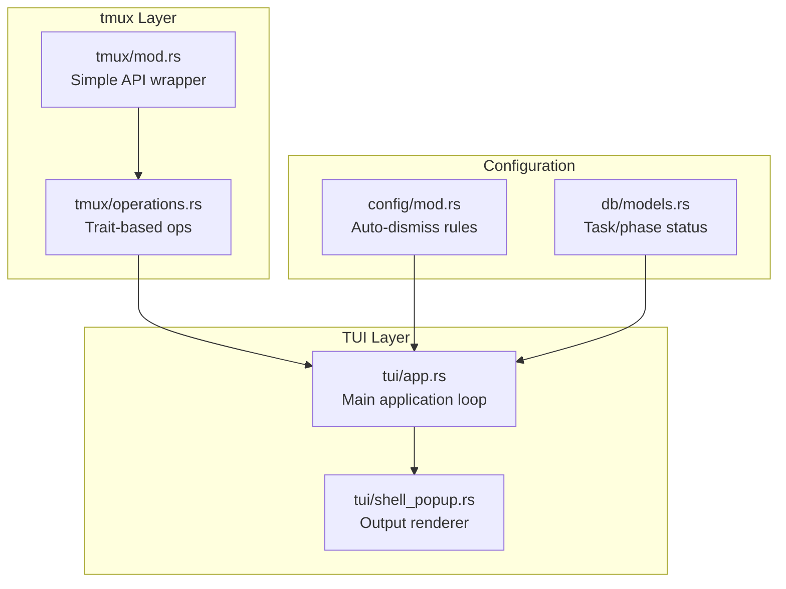
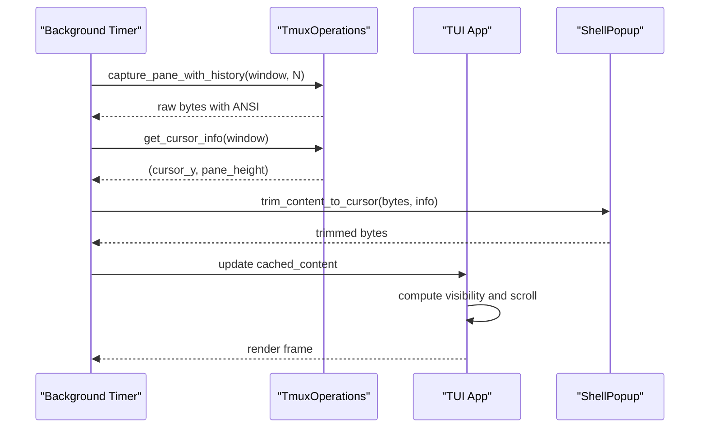
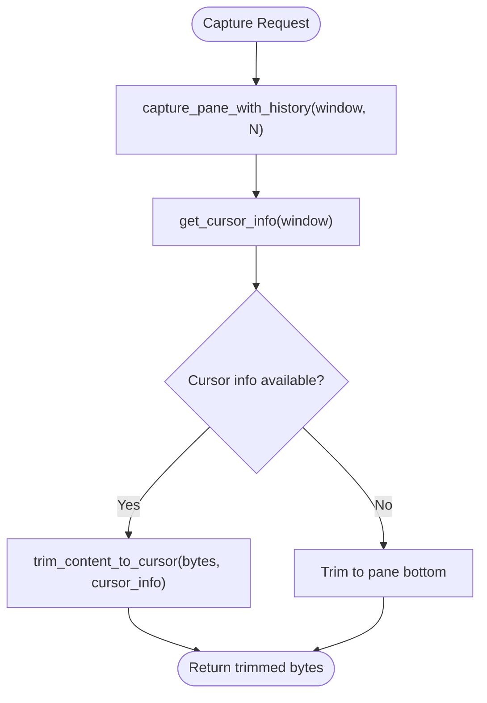
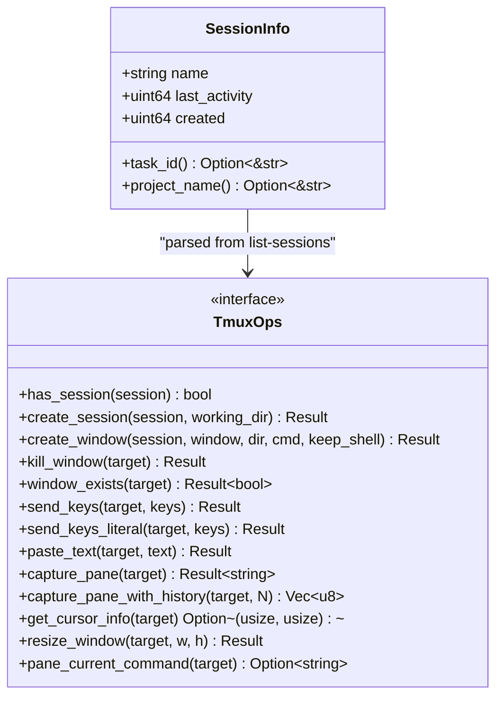
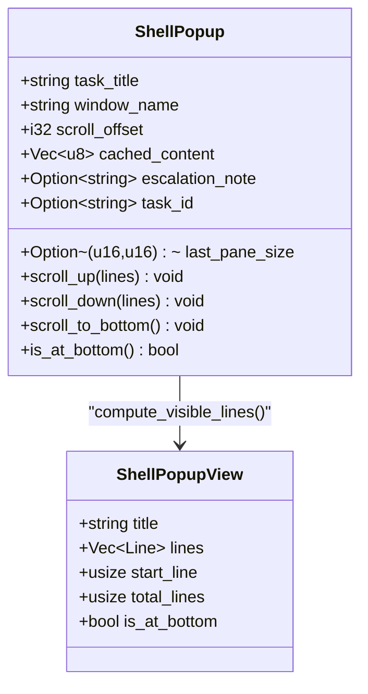
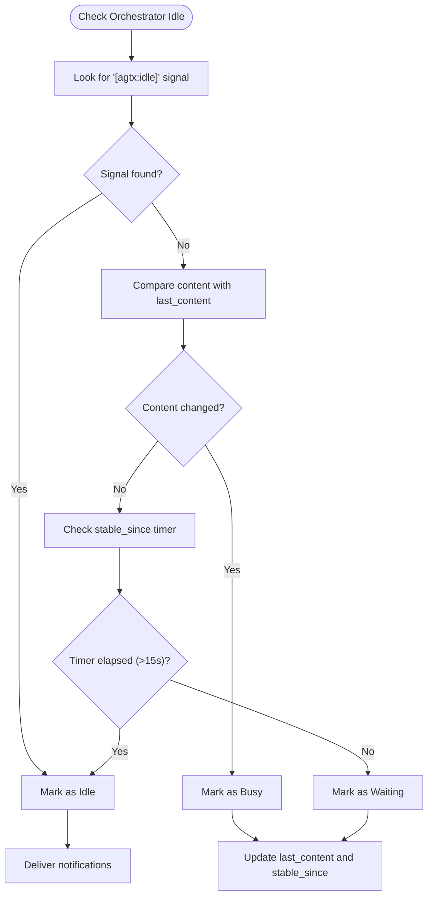
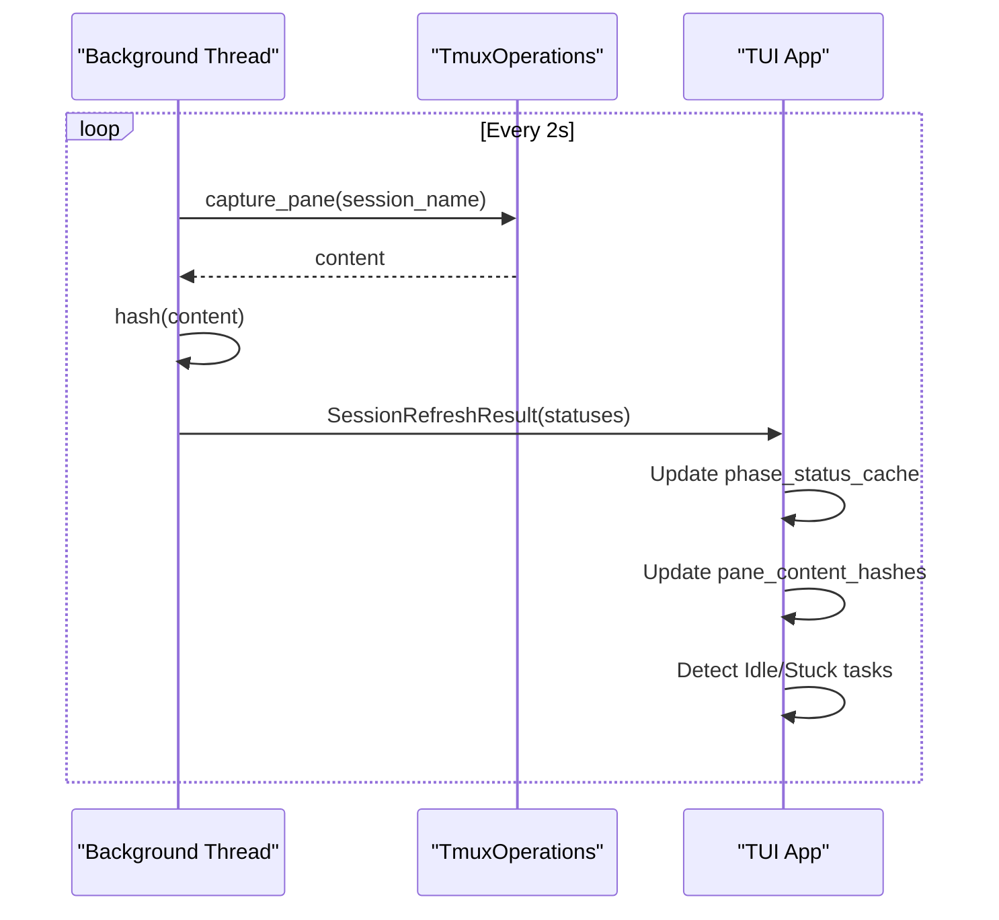
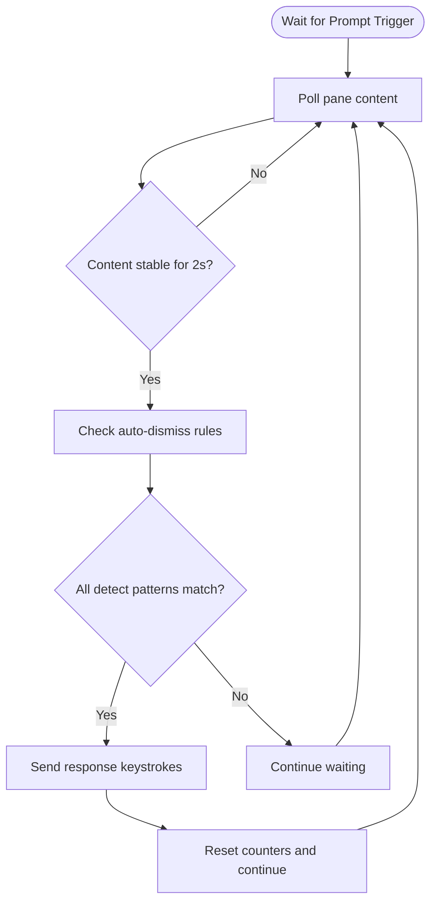
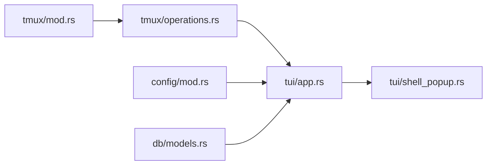

# Agent Pane Monitoring and Activity Tracking

<cite>
**Referenced Files in This Document**
- [tmux/mod.rs](file://src/tmux/mod.rs)
- [tmux/operations.rs](file://src/tmux/operations.rs)
- [tui/app.rs](file://src/tui/app.rs)
- [tui/shell_popup.rs](file://src/tui/shell_popup.rs)
- [config/mod.rs](file://src/config/mod.rs)
- [db/models.rs](file://src/db/models.rs)
</cite>

## Table of Contents
1. [Introduction](#introduction)
2. [Project Structure](#project-structure)
3. [Core Components](#core-components)
4. [Architecture Overview](#architecture-overview)
5. [Detailed Component Analysis](#detailed-component-analysis)
6. [Dependency Analysis](#dependency-analysis)
7. [Performance Considerations](#performance-considerations)
8. [Troubleshooting Guide](#troubleshooting-guide)
9. [Conclusion](#conclusion)

## Introduction
This document explains the agent pane monitoring and activity tracking systems that enable real-time supervision of AI agent operations within tmux panes. It covers how recent output is captured for display in the TUI interface, how tmux's built-in activity timestamps are leveraged to detect idle or unresponsive agents, and how the TUI integrates with tmux to provide interactive debugging capabilities. Practical examples demonstrate monitoring agent output, detecting activity patterns, identifying potential issues like infinite loops or stuck operations, and configuring monitoring intervals and alerts.

## Project Structure
The monitoring system spans three primary modules:
- tmux integration: Provides low-level tmux operations and session management
- TUI application: Implements real-time monitoring, idle detection, and interactive debugging
- Shell popup: Renders agent output in a dedicated TUI overlay with scrolling and trimming

**Diagram sources**
- [tmux/mod.rs:1-189](file://src/tmux/mod.rs#L1-L189)
- [tmux/operations.rs:1-249](file://src/tmux/operations.rs#L1-L249)
- [tui/app.rs:6200-6799](file://src/tui/app.rs#L6200-L6799)
- [tui/shell_popup.rs:1-326](file://src/tui/shell_popup.rs#L1-L326)
- [config/mod.rs:450-462](file://src/config/mod.rs#L450-L462)
- [db/models.rs:58-133](file://src/db/models.rs#L58-L133)

**Section sources**
- [tmux/mod.rs:1-189](file://src/tmux/mod.rs#L1-L189)
- [tmux/operations.rs:1-249](file://src/tmux/operations.rs#L1-L249)
- [tui/app.rs:6200-6799](file://src/tui/app.rs#L6200-L6799)
- [tui/shell_popup.rs:1-326](file://src/tui/shell_popup.rs#L1-L326)
- [config/mod.rs:450-462](file://src/config/mod.rs#L450-L462)
- [db/models.rs:58-133](file://src/db/models.rs#L58-L133)

## Core Components
- tmux capture and pane inspection: Captures recent pane output and trims unused buffer space using cursor position and pane height
- Activity tracking: Uses tmux's session activity timestamps to detect idle agents
- TUI shell popup: Displays agent output with scrolling, trimming, and interactive controls
- Idle detection: Implements content-hash-based stability detection and orchestrator-specific idle signals
- Auto-dismiss rules: Automatic response to interactive prompts that block agent progress

**Section sources**
- [tmux/mod.rs:97-107](file://src/tmux/mod.rs#L97-L107)
- [tmux/operations.rs:39-43](file://src/tmux/operations.rs#L39-L43)
- [tui/app.rs:6484-6512](file://src/tui/app.rs#L6484-L6512)
- [tui/shell_popup.rs:133-184](file://src/tui/shell_popup.rs#L133-L184)
- [tui/app.rs:6522-6539](file://src/tui/app.rs#L6522-L6539)
- [config/mod.rs:453-462](file://src/config/mod.rs#L453-L462)

## Architecture Overview
The monitoring pipeline consists of periodic tmux pane captures, content trimming, idle detection, and TUI rendering. The orchestrator uses a specialized idle detection mechanism that prioritizes explicit idle signals over content stability.

**Diagram sources**
- [tui/app.rs:7334-7348](file://src/tui/app.rs#L7334-L7348)
- [tui/shell_popup.rs:133-184](file://src/tui/shell_popup.rs#L133-L184)
- [tmux/operations.rs:184-201](file://src/tmux/operations.rs#L184-L201)

**Section sources**
- [tui/app.rs:7334-7348](file://src/tui/app.rs#L7334-L7348)
- [tui/shell_popup.rs:133-184](file://src/tui/shell_popup.rs#L133-L184)
- [tmux/operations.rs:184-201](file://src/tmux/operations.rs#L184-L201)

## Detailed Component Analysis

### tmux Pane Capture and Content Trimming
The capture pipeline retrieves pane content with history and trims it to the visible region using cursor position and pane height. This prevents the TUI from displaying unused buffer space below the current prompt.

**Diagram sources**
- [tui/app.rs:7334-7348](file://src/tui/app.rs#L7334-L7348)
- [tmux/operations.rs:174-182](file://src/tmux/operations.rs#L174-L182)
- [tmux/operations.rs:184-201](file://src/tmux/operations.rs#L184-L201)
- [tui/shell_popup.rs:133-184](file://src/tui/shell_popup.rs#L133-L184)

**Section sources**
- [tui/app.rs:7334-7348](file://src/tui/app.rs#L7334-L7348)
- [tmux/operations.rs:174-182](file://src/tmux/operations.rs#L174-L182)
- [tmux/operations.rs:184-201](file://src/tmux/operations.rs#L184-L201)
- [tui/shell_popup.rs:133-184](file://src/tui/shell_popup.rs#L133-L184)

### Activity Tracking Using tmux Session Timestamps
The system tracks agent activity by leveraging tmux's built-in session activity timestamps. These timestamps reflect the last activity time for each session, enabling detection of idle or unresponsive agents.

**Diagram sources**
- [tmux/mod.rs:168-188](file://src/tmux/mod.rs#L168-L188)
- [tmux/operations.rs:10-59](file://src/tmux/operations.rs#L10-L59)

**Section sources**
- [tmux/mod.rs:50-84](file://src/tmux/mod.rs#L50-L84)
- [tmux/mod.rs:168-188](file://src/tmux/mod.rs#L168-L188)
- [tmux/operations.rs:10-59](file://src/tmux/operations.rs#L10-L59)

### TUI Shell Popup Rendering and Interaction
The shell popup provides a dedicated overlay for agent output with scrolling, trimming, and interactive controls. It maintains cached content and computes visible lines for efficient rendering.

**Diagram sources**
- [tui/shell_popup.rs:5-57](file://src/tui/shell_popup.rs#L5-L57)
- [tui/shell_popup.rs:69-116](file://src/tui/shell_popup.rs#L69-L116)

**Section sources**
- [tui/shell_popup.rs:5-57](file://src/tui/shell_popup.rs#L5-L57)
- [tui/shell_popup.rs:69-116](file://src/tui/shell_popup.rs#L69-L116)

### Idle Detection and Orchestrator Notifications
The orchestrator implements a dual-path idle detection mechanism: explicit idle signals embedded in pane content and a stability-based fallback. When idle, pending notifications are delivered to the orchestrator pane.

**Diagram sources**
- [tui/app.rs:6251-6325](file://src/tui/app.rs#L6251-L6325)
- [tui/app.rs:6774-6796](file://src/tui/app.rs#L6774-L6796)

**Section sources**
- [tui/app.rs:6251-6325](file://src/tui/app.rs#L6251-L6325)
- [tui/app.rs:6774-6796](file://src/tui/app.rs#L6774-L6796)

### Task Status and Phase Monitoring
The application monitors task phases by capturing pane content hashes and detecting stability periods. This enables identification of idle tasks and triggers for stuck-task notifications.

**Diagram sources**
- [tui/app.rs:6327-6512](file://src/tui/app.rs#L6327-L6512)
- [tui/app.rs:6514-6699](file://src/tui/app.rs#L6514-L6699)

**Section sources**
- [tui/app.rs:6327-6512](file://src/tui/app.rs#L6327-L6512)
- [tui/app.rs:6514-6699](file://src/tui/app.rs#L6514-L6699)

### Interactive Debugging and Auto-dismiss Rules
The system supports interactive debugging by attaching to tmux panes and provides auto-dismiss rules to automatically respond to prompts that would otherwise block agent progress.

**Diagram sources**
- [tui/app.rs:8218-8264](file://src/tui/app.rs#L8218-L8264)
- [config/mod.rs:453-462](file://src/config/mod.rs#L453-L462)

**Section sources**
- [tui/app.rs:8218-8264](file://src/tui/app.rs#L8218-L8264)
- [config/mod.rs:453-462](file://src/config/mod.rs#L453-L462)

## Dependency Analysis
The monitoring system exhibits clear separation of concerns:
- tmux layer: Provides low-level operations via a trait abstraction
- TUI layer: Implements monitoring logic, idle detection, and rendering
- Configuration layer: Supplies auto-dismiss rules and plugin configurations
- Database layer: Tracks task status and orchestrator notifications

**Diagram sources**
- [tmux/mod.rs:1-189](file://src/tmux/mod.rs#L1-L189)
- [tmux/operations.rs:1-249](file://src/tmux/operations.rs#L1-L249)
- [tui/app.rs:6200-6799](file://src/tui/app.rs#L6200-L6799)
- [tui/shell_popup.rs:1-326](file://src/tui/shell_popup.rs#L1-L326)
- [config/mod.rs:450-462](file://src/config/mod.rs#L450-L462)
- [db/models.rs:58-133](file://src/db/models.rs#L58-L133)

**Section sources**
- [tmux/mod.rs:1-189](file://src/tmux/mod.rs#L1-L189)
- [tmux/operations.rs:1-249](file://src/tmux/operations.rs#L1-L249)
- [tui/app.rs:6200-6799](file://src/tui/app.rs#L6200-L6799)
- [tui/shell_popup.rs:1-326](file://src/tui/shell_popup.rs#L1-L326)
- [config/mod.rs:450-462](file://src/config/mod.rs#L450-L462)
- [db/models.rs:58-133](file://src/db/models.rs#L58-L133)

## Performance Considerations
- Capture frequency: The background refresh thread runs every 2 seconds to balance responsiveness with tmux overhead
- Content hashing: Pane content is hashed to detect stability efficiently
- History limits: The capture pipeline limits history to reduce memory usage
- Cursor trimming: Unused buffer space is trimmed to minimize rendering overhead
- Asynchronous operations: Long-running operations (like waiting for agent readiness) use background threads

Optimization strategies for large-scale deployments:
- Tune refresh intervals based on workload intensity
- Limit history capture for frequently monitored panes
- Implement connection pooling for tmux operations
- Cache pane dimensions to avoid repeated resize operations
- Use selective monitoring for non-critical tasks

[No sources needed since this section provides general guidance]

## Troubleshooting Guide
Common issues and resolutions:
- Infinite loops or stuck operations: Monitor for content stability over extended periods (≥15s) and implement stuck-task notifications
- Interactive prompts blocking progress: Configure auto-dismiss rules to automatically respond to known prompt patterns
- Window recreation: When panes disappear, recreate them using the agent's resume command
- Agent readiness: Wait for explicit readiness signals or content stabilization before sending commands
- Memory usage: Limit history capture and trim unused buffer space

**Section sources**
- [tui/app.rs:6522-6539](file://src/tui/app.rs#L6522-L6539)
- [tui/app.rs:8218-8264](file://src/tui/app.rs#L8218-L8264)
- [tui/app.rs:8579-8602](file://src/tui/app.rs#L8579-L8602)
- [tui/app.rs:8737-8799](file://src/tui/app.rs#L8737-L8799)

## Conclusion
The agent pane monitoring and activity tracking system provides comprehensive real-time supervision of AI agent operations within tmux panes. By combining tmux's built-in activity timestamps, content-hash-based stability detection, and targeted trimming techniques, it delivers accurate insights into agent behavior while maintaining performance. The TUI's shell popup integration enables interactive debugging and seamless operator intervention when issues arise.