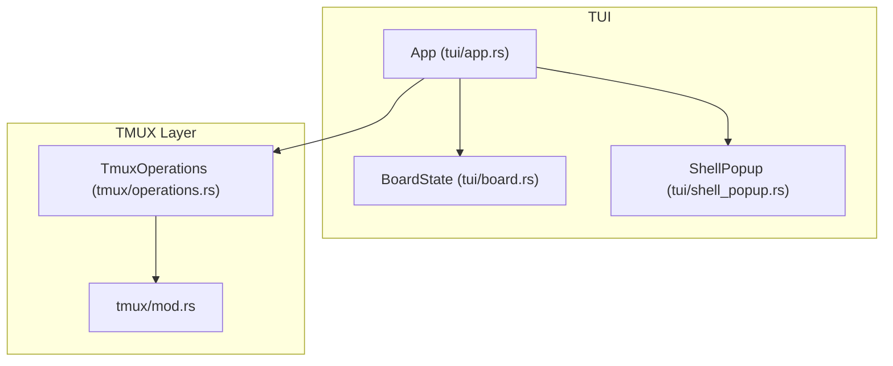
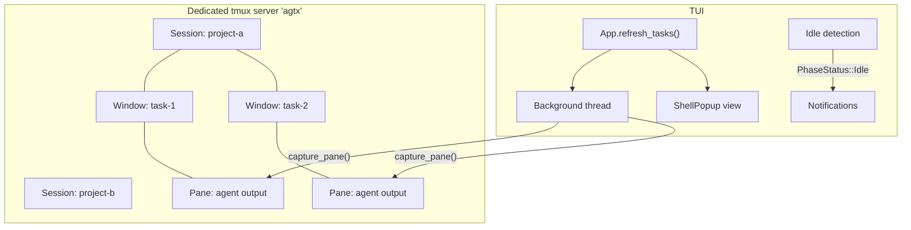
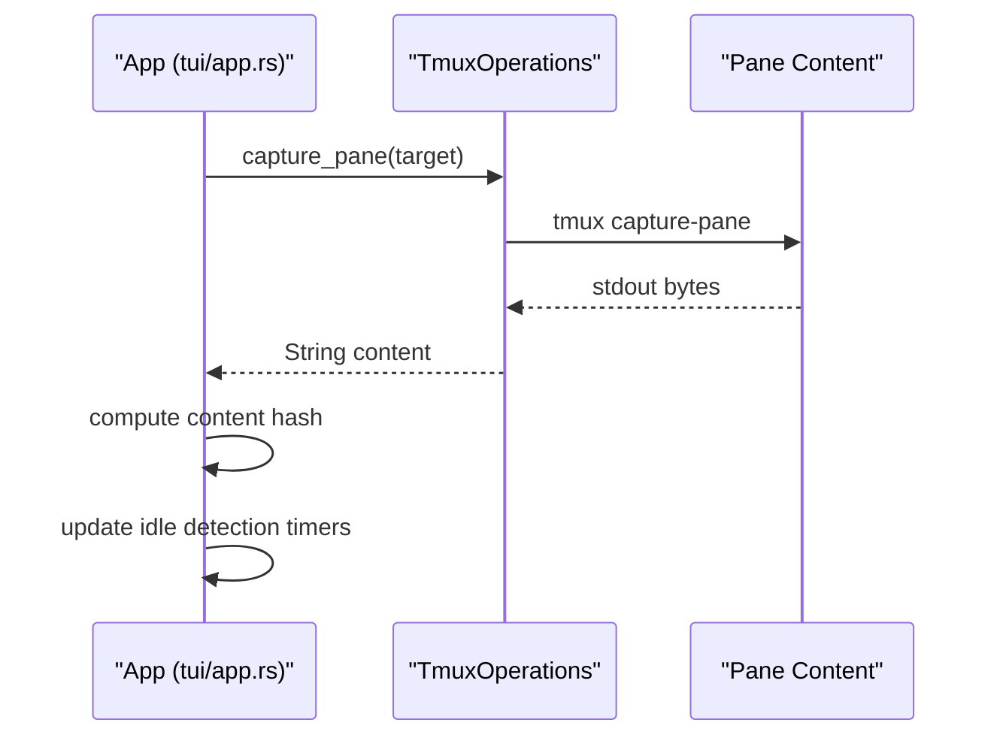
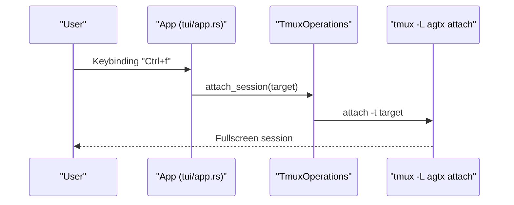
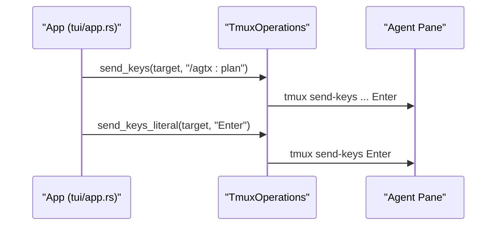
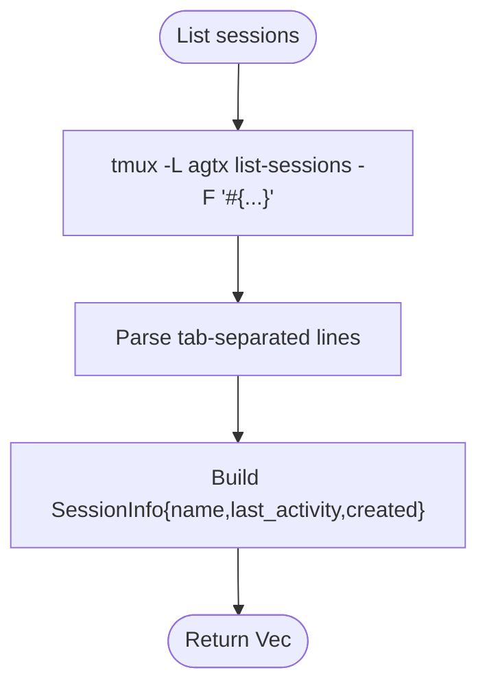
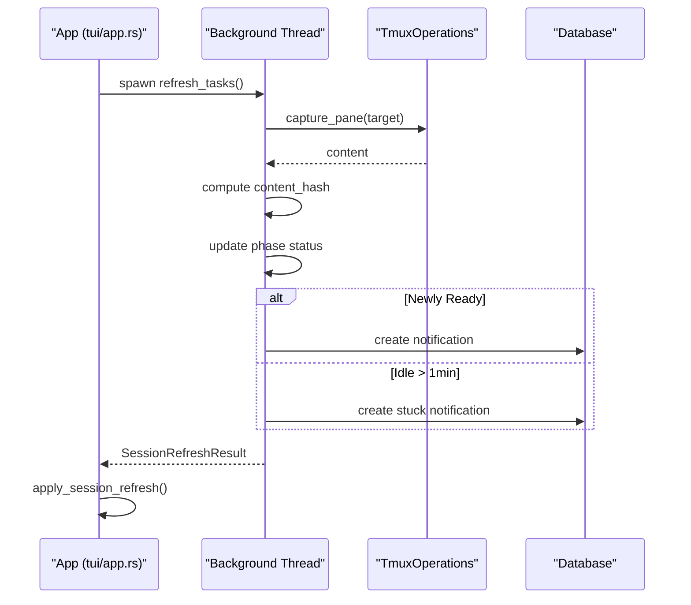
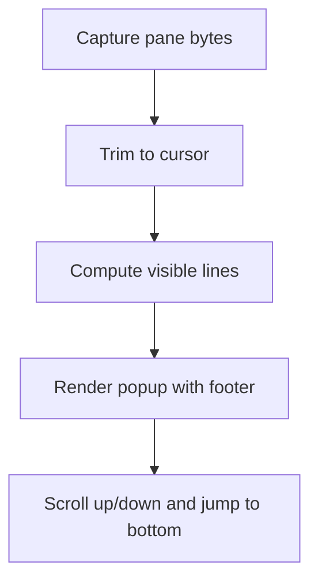
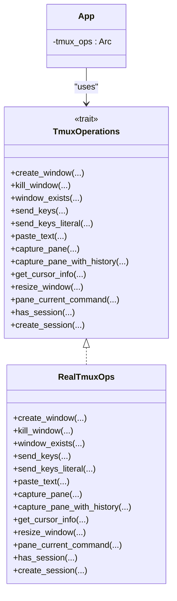

# Monitoring and Attachment

<cite>
**Referenced Files in This Document**
- [README.md](file://README.md)
- [main.rs](file://src/main.rs)
- [lib.rs](file://src/lib.rs)
- [tmux/mod.rs](file://src/tmux/mod.rs)
- [tmux/operations.rs](file://src/tmux/operations.rs)
- [tui/app.rs](file://src/tui/app.rs)
- [tui/shell_popup.rs](file://src/tui/shell_popup.rs)
- [tui/board.rs](file://src/tui/board.rs)
- [shell_popup_tests.rs](file://tests/shell_popup_tests.rs)
</cite>

## Table of Contents
1. [Introduction](#introduction)
2. [Project Structure](#project-structure)
3. [Core Components](#core-components)
4. [Architecture Overview](#architecture-overview)
5. [Detailed Component Analysis](#detailed-component-analysis)
6. [Dependency Analysis](#dependency-analysis)
7. [Performance Considerations](#performance-considerations)
8. [Troubleshooting Guide](#troubleshooting-guide)
9. [Conclusion](#conclusion)
10. [Appendices](#appendices)

## Introduction
This document explains how the tmux monitoring system enables real-time observation and control of agent sessions within the kanban board TUI. It covers pane capture for recent output retrieval, session attachment for fullscreen monitoring, inline task popups for integrated viewing, and interactive control via send_keys. It also documents session activity monitoring using last_activity and created timestamps, integration with the TUI for seamless management, and practical guidance for building custom monitoring scripts, alerting, and automated state detection. Finally, it provides troubleshooting tips for common issues.

## Project Structure
The tmux monitoring stack is organized into focused modules:
- tmux interface: public APIs for spawning, listing, capturing panes, sending keys, attaching, and killing sessions
- tmux operations: a trait abstraction enabling testable, injectable tmux operations
- TUI app: orchestrates periodic session refresh, idle detection, and orchestrator notifications
- Shell popup: renders an inline, scrollable tmux pane view inside the TUI
- Board: kanban board state and selection logic

**Diagram sources**
- [tui/app.rs:793-9181](file://src/tui/app.rs#L793-L9181)
- [tui/board.rs:1-99](file://src/tui/board.rs#L1-L99)
- [tui/shell_popup.rs:1-364](file://src/tui/shell_popup.rs#L1-L364)
- [tmux/mod.rs:1-189](file://src/tmux/mod.rs#L1-L189)
- [tmux/operations.rs:1-249](file://src/tmux/operations.rs#L1-L249)

**Section sources**
- [README.md:506-572](file://README.md#L506-L572)
- [lib.rs:1-24](file://src/lib.rs#L1-L24)

## Core Components
- tmux/mod.rs: Public functions for tmux operations including spawn_session, list_sessions, session_exists, capture_pane, send_keys, attach_session, kill_session, and safe_session_name. It parses tmux list-sessions output to extract last_activity and created timestamps.
- tmux/operations.rs: Trait-based abstraction for tmux operations with a real implementation. Provides capture_pane, capture_pane_with_history, send_keys, send_keys_literal, paste_text, get_cursor_info, resize_window, pane_current_command, window_exists, has_session, and create_session.
- tui/app.rs: Central application orchestrating background session refresh, idle detection, orchestrator notifications, and TUI rendering. Uses TmuxOperations to poll pane content and drive state transitions.
- tui/shell_popup.rs: Inline popup rendering for tmux panes, including scrolling, trimming to cursor, and footer navigation.
- tui/board.rs: Kanban board state and selection logic used by the TUI.

**Section sources**
- [tmux/mod.rs:11-189](file://src/tmux/mod.rs#L11-L189)
- [tmux/operations.rs:1-249](file://src/tmux/operations.rs#L1-L249)
- [tui/app.rs:6519-6828](file://src/tui/app.rs#L6519-L6828)
- [tui/shell_popup.rs:1-364](file://src/tui/shell_popup.rs#L1-L364)
- [tui/board.rs:1-99](file://src/tui/board.rs#L1-L99)

## Architecture Overview
The monitoring architecture combines a dedicated tmux server with a TUI that continuously observes agent sessions and presents them in the kanban board. The TUI periodically captures pane content to detect activity and idle states, and offers inline and fullscreen views.

**Diagram sources**
- [README.md:549-564](file://README.md#L549-L564)
- [tmux/mod.rs:50-84](file://src/tmux/mod.rs#L50-L84)
- [tmux/operations.rs:166-182](file://src/tmux/operations.rs#L166-L182)
- [tui/app.rs:6519-6828](file://src/tui/app.rs#L6519-L6828)
- [tui/shell_popup.rs:241-364](file://src/tui/shell_popup.rs#L241-L364)

## Detailed Component Analysis

### Pane Capture and Activity Monitoring
- capture_pane: Retrieves recent pane output for a given target. The TUI uses this to compute content hashes and detect idle states.
- capture_pane_with_history: Captures pane content with history for richer analysis and rendering.
- last_activity and created timestamps: Retrieved via list-sessions and parsed to track session activity and creation time.

**Diagram sources**
- [tmux/operations.rs:166-182](file://src/tmux/operations.rs#L166-L182)
- [tui/app.rs:6613-6625](file://src/tui/app.rs#L6613-L6625)

**Section sources**
- [tmux/mod.rs:97-107](file://src/tmux/mod.rs#L97-L107)
- [tmux/operations.rs:166-182](file://src/tmux/operations.rs#L166-L182)
- [tui/app.rs:6613-6625](file://src/tui/app.rs#L6613-L6625)

### Session Attachment and Inline Popup
- attach_session: Fullscreen attachment to a session using the dedicated tmux server.
- ShellPopup: Renders an inline, scrollable tmux pane view with footer navigation and cursor-aware trimming.

**Diagram sources**
- [tmux/mod.rs:120-131](file://src/tmux/mod.rs#L120-L131)
- [tui/app.rs:1176-6519](file://src/tui/app.rs#L1176-L6519)

**Section sources**
- [tmux/mod.rs:120-131](file://src/tmux/mod.rs#L120-L131)
- [tui/shell_popup.rs:241-364](file://src/tui/shell_popup.rs#L241-L364)

### Interactive Control with send_keys
- send_keys: Sends keys followed by Enter to a target pane.
- send_keys_literal: Sends keys without appending Enter.
- Agent skill invocation: The TUI resolves plugin commands and sends them to agent panes, with delays and agent-specific behaviors.

**Diagram sources**
- [tmux/operations.rs:127-146](file://src/tmux/operations.rs#L127-L146)
- [tui/app.rs:8227-8261](file://src/tui/app.rs#L8227-L8261)

**Section sources**
- [tmux/operations.rs:127-146](file://src/tmux/operations.rs#L127-L146)
- [tui/app.rs:8227-8261](file://src/tui/app.rs#L8227-L8261)

### Session Activity Monitoring and Timestamps
- list_sessions: Queries tmux for session_name, last_activity, and created timestamps.
- SessionInfo: Parses session names to extract task_id and project_name.

**Diagram sources**
- [tmux/mod.rs:50-84](file://src/tmux/mod.rs#L50-L84)
- [tmux/mod.rs:168-188](file://src/tmux/mod.rs#L168-L188)

**Section sources**
- [tmux/mod.rs:50-84](file://src/tmux/mod.rs#L50-L84)
- [tmux/mod.rs:168-188](file://src/tmux/mod.rs#L168-L188)

### Integration with the TUI Kanban Board
- Background refresh: A dedicated thread collects phase status, content hashes, and orchestrator readiness.
- Idle detection: If pane content remains unchanged for 15 seconds, the phase is marked Idle.
- Notifications: On phase Ready transitions, the orchestrator is notified; on 1-minute Idle in Planning/Running, a stuck-task notification is generated.

**Diagram sources**
- [tui/app.rs:6519-6828](file://src/tui/app.rs#L6519-L6828)

**Section sources**
- [tui/app.rs:6519-6828](file://src/tui/app.rs#L6519-L6828)

### Inline Task Popup Rendering
- ShellPopup: Manages cached pane content, scroll offsets, and cursor-aware trimming.
- compute_visible_lines: Computes visible lines for rendering with smooth scrolling.
- trim_content_to_cursor: Trims pane content to the cursor position to remove unused buffer space.
- render_shell_popup: Renders the popup with header, content, and footer, including interactive footer items.

**Diagram sources**
- [tui/shell_popup.rs:73-118](file://src/tui/shell_popup.rs#L73-L118)
- [tui/shell_popup.rs:144-186](file://src/tui/shell_popup.rs#L144-L186)
- [tui/shell_popup.rs:241-364](file://src/tui/shell_popup.rs#L241-L364)

**Section sources**
- [tui/shell_popup.rs:1-364](file://src/tui/shell_popup.rs#L1-L364)

## Dependency Analysis
The TUI depends on the tmux operations abstraction to remain testable and portable. The abstraction enables injecting mocks for unit tests and swapping implementations if needed.

**Diagram sources**
- [tmux/operations.rs:9-59](file://src/tmux/operations.rs#L9-L59)
- [tmux/operations.rs:62-248](file://src/tmux/operations.rs#L62-L248)
- [tui/app.rs:519-526](file://src/tui/app.rs#L519-L526)

**Section sources**
- [tmux/operations.rs:1-249](file://src/tmux/operations.rs#L1-L249)
- [tui/app.rs:519-526](file://src/tui/app.rs#L519-L526)

## Performance Considerations
- Background polling: The TUI spawns a background thread to collect session statuses, avoiding blocking the UI.
- Content hashing: Computing a hash of pane content is efficient for detecting changes without storing large buffers.
- Cursor-aware trimming: Reduces rendering overhead by trimming unused pane buffer space.
- Scroll caching: The inline popup caches pane content and computes visible lines to minimize rendering work per frame.

[No sources needed since this section provides general guidance]

## Troubleshooting Guide
Common issues and remedies:
- Session attachment fails
  - Verify the tmux server "agtx" is running and sessions exist.
  - Ensure the target session/window exists before attaching.
  - Check permissions and environment isolation if running inside containers or restricted shells.
- Output capture problems
  - Confirm tmux capture-pane is available and the target exists.
  - For agent-specific UIs (e.g., Codex command picker), wait for UI elements to stabilize before sending Enter.
- Monitoring performance
  - Reduce polling frequency by adjusting the background refresh interval.
  - Limit the number of concurrent tasks being polled.
  - Use cursor-aware trimming to reduce rendering workload.
- Inline popup anomalies
  - Validate scroll offset calculations and ensure trailing empty lines are trimmed appropriately.
  - Confirm footer navigation items are correctly mapped to key events.

**Section sources**
- [tui/app.rs:8227-8261](file://src/tui/app.rs#L8227-L8261)
- [tui/shell_popup.rs:35-58](file://src/tui/shell_popup.rs#L35-L58)
- [tui/shell_popup.rs:144-186](file://src/tui/shell_popup.rs#L144-L186)

## Conclusion
The tmux monitoring system integrates tightly with the TUI to provide persistent, real-time visibility into agent sessions. Through pane capture, interactive control, and inline/fullscreen viewing, users can observe progress, detect idle states, and automate transitions. The design emphasizes testability via a trait-based abstraction and efficient rendering for smooth user experience.

[No sources needed since this section summarizes without analyzing specific files]

## Appendices

### Practical Examples
- Monitoring agent progress
  - Use capture_pane to retrieve recent output and compute a content hash to detect changes.
  - Periodically poll the pane and update the board state accordingly.
- Detecting completion signals
  - Watch for phase artifacts (e.g., files) indicating completion; mark the phase Ready when found.
  - Optionally rely on explicit idle signals in the pane content to gate notifications.
- Troubleshooting session issues
  - Inspect pane_current_command to verify the agent is running the expected command.
  - Use get_cursor_info to trim pane content to the visible region and reduce noise.
  - For agent UIs that require confirmation, send Enter after the UI stabilizes.

**Section sources**
- [tmux/operations.rs:213-229](file://src/tmux/operations.rs#L213-L229)
- [tui/app.rs:6644-6641](file://src/tui/app.rs#L6644-L6641)
- [tui/shell_popup.rs:144-186](file://src/tui/shell_popup.rs#L144-L186)

### Integration Notes
- Tmux server and targets
  - All sessions run under the dedicated server "agtx".
  - Sessions are named after projects; windows are named after tasks.
- TUI keyboard shortcuts
  - Inline view: open task to view pane inside the TUI.
  - Fullscreen: attach to the agent pane for uninterrupted control.
- MCP tools for external automation
  - read_pane_content and send_to_task enable external tools to monitor and control sessions.

**Section sources**
- [README.md:549-564](file://README.md#L549-L564)
- [README.md:601-602](file://README.md#L601-L602)
- [README.md:117-127](file://README.md#L117-L127)