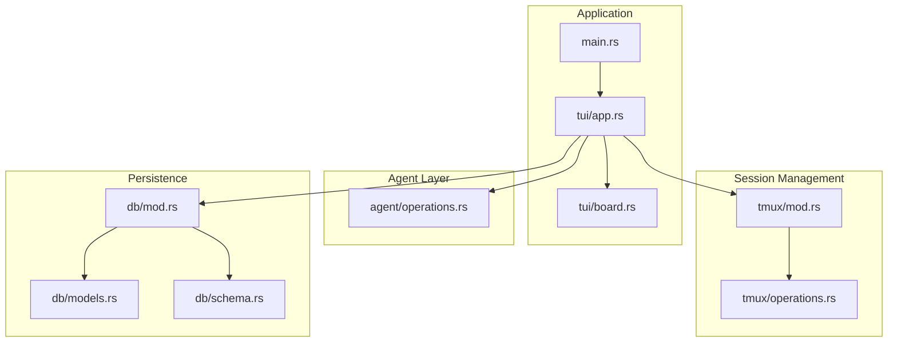
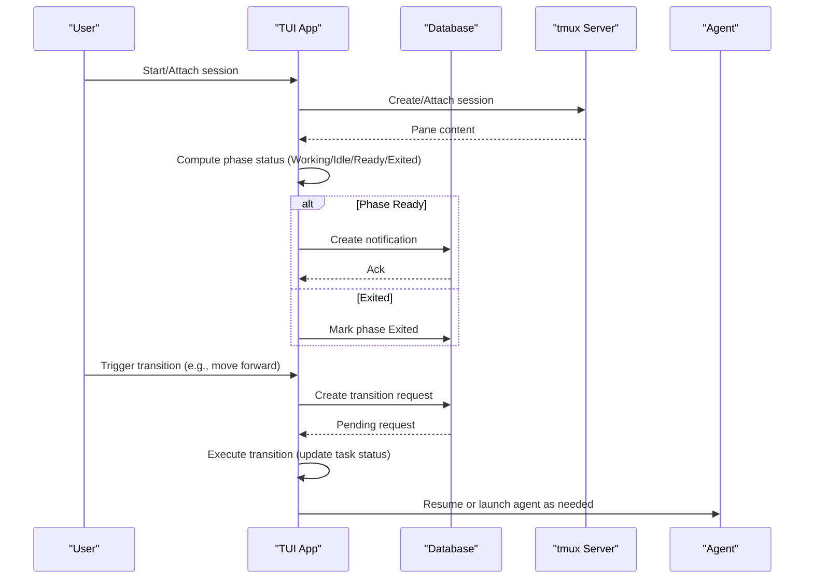
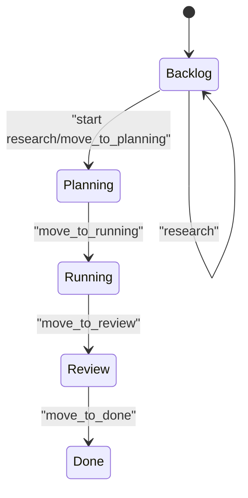
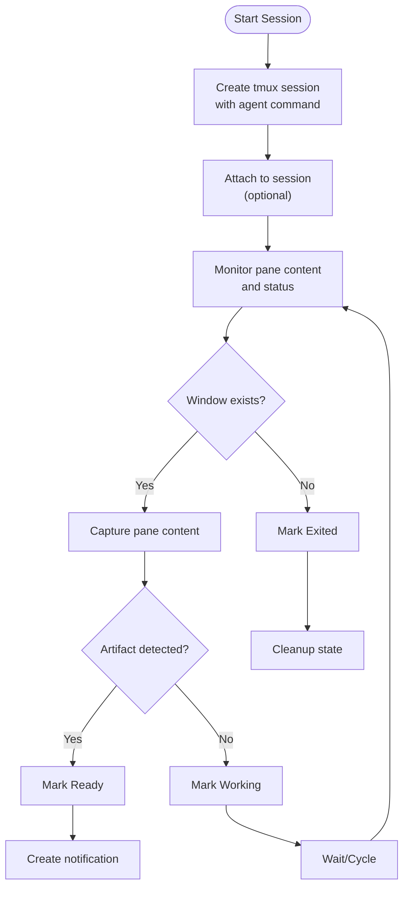
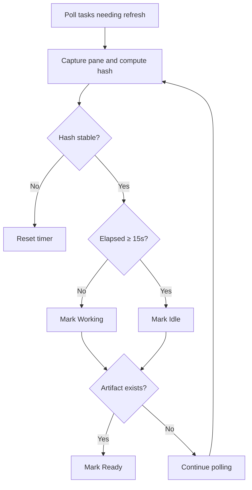
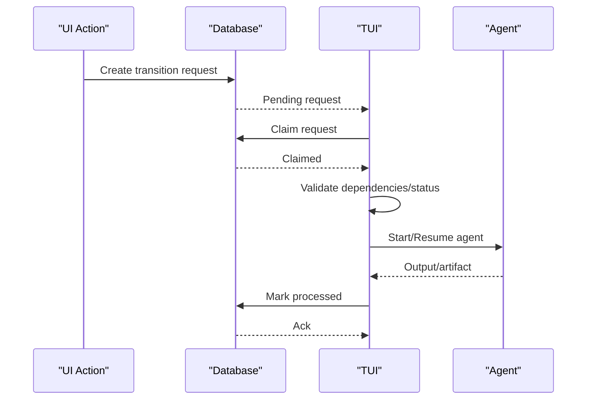
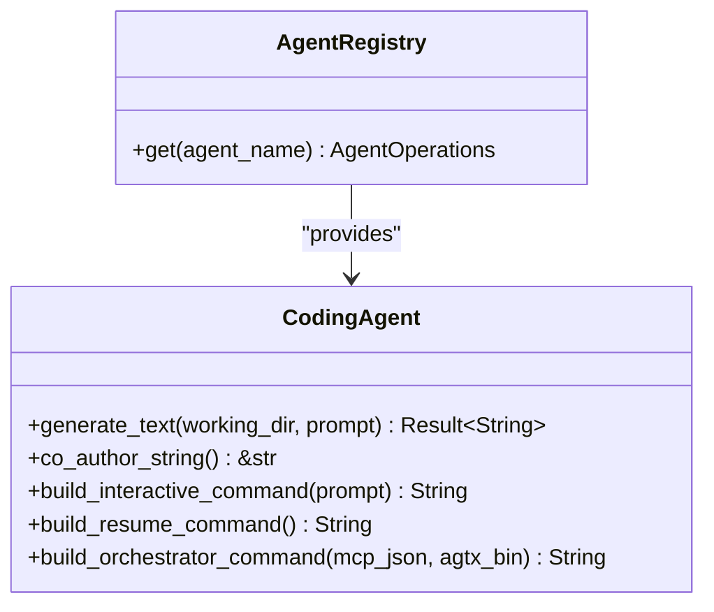
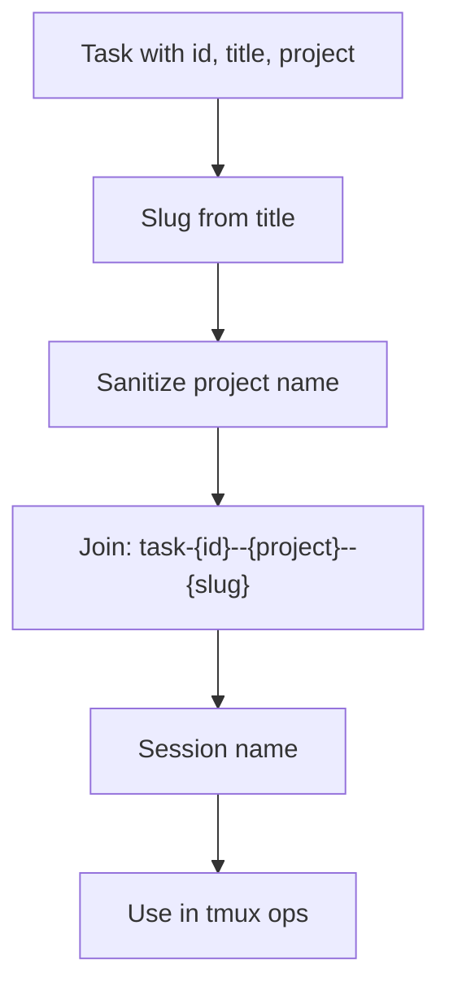
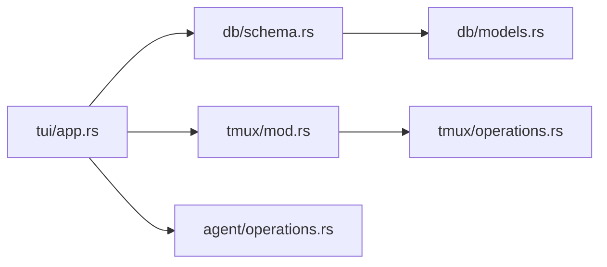

# Persistent Session Management

<cite>
**Referenced Files in This Document**
- [src/db/mod.rs](file://src/db/mod.rs)
- [src/db/models.rs](file://src/db/models.rs)
- [src/db/schema.rs](file://src/db/schema.rs)
- [src/tmux/mod.rs](file://src/tmux/mod.rs)
- [src/tmux/operations.rs](file://src/tmux/operations.rs)
- [src/agent/operations.rs](file://src/agent/operations.rs)
- [src/tui/board.rs](file://src/tui/board.rs)
- [src/tui/app.rs](file://src/tui/app.rs)
- [src/main.rs](file://src/main.rs)
</cite>

## Table of Contents
1. [Introduction](#introduction)
2. [Project Structure](#project-structure)
3. [Core Components](#core-components)
4. [Architecture Overview](#architecture-overview)
5. [Detailed Component Analysis](#detailed-component-analysis)
6. [Dependency Analysis](#dependency-analysis)
7. [Performance Considerations](#performance-considerations)
8. [Troubleshooting Guide](#troubleshooting-guide)
9. [Conclusion](#conclusion)

## Introduction
This document explains persistent session management that enables seamless agent context preservation across development phase transitions and agent switching. It details how persistent sessions maintain agent state between phases, allowing agents to continue from previous work without losing context. The document covers session attachment and detachment mechanisms, integration with the kanban board workflow (Research → Planning → Execution → Review), examples of session state preservation during agent switching and multi-phase cycles, monitoring techniques for detecting agent activity and completion signals, performance considerations for long-running sessions, and guidance for debugging and troubleshooting.

## Project Structure
The persistent session system spans several modules:
- Database layer: task lifecycle, transition requests, notifications, and running agent tracking
- Tmux integration: session creation, attachment, pane capture, and lifecycle checks
- Agent operations: building interactive and resume commands for agents
- TUI: kanban board state, background session refresh, and transition request processing
- Application entry point: initialization and mode selection

**Diagram sources**
- [src/main.rs:1-228](file://src/main.rs#L1-L228)
- [src/tui/app.rs:1-200](file://src/tui/app.rs#L1-L200)
- [src/tui/board.rs:1-99](file://src/tui/board.rs#L1-L99)
- [src/agent/operations.rs:1-163](file://src/agent/operations.rs#L1-L163)
- [src/tmux/mod.rs:1-189](file://src/tmux/mod.rs#L1-L189)
- [src/tmux/operations.rs:1-249](file://src/tmux/operations.rs#L1-L249)
- [src/db/mod.rs:1-6](file://src/db/mod.rs#L1-L6)
- [src/db/models.rs:1-245](file://src/db/models.rs#L1-L245)
- [src/db/schema.rs:1-656](file://src/db/schema.rs#L1-L656)

**Section sources**
- [src/main.rs:1-228](file://src/main.rs#L1-L228)
- [src/tui/app.rs:1-200](file://src/tui/app.rs#L1-L200)
- [src/db/mod.rs:1-6](file://src/db/mod.rs#L1-L6)

## Core Components
- Task model and kanban status: Tasks track status, agent, session name, worktree, and timestamps. Status transitions align with Research → Planning → Execution → Review → Done.
- Running agent tracking: Tracks active agent sessions with status and timing.
- Transition requests: Queue of state change actions processed by the TUI, enabling MCP-driven automation.
- Notifications: Pull-based events sent to the orchestrator agent when phases complete.
- Tmux session management: Creation, attachment, pane capture, and existence checks for persistent sessions.
- Agent operations: Building interactive and resume commands to recover from restarts.

**Section sources**
- [src/db/models.rs:58-133](file://src/db/models.rs#L58-L133)
- [src/db/models.rs:186-212](file://src/db/models.rs#L186-L212)
- [src/db/models.rs:159-184](file://src/db/models.rs#L159-L184)
- [src/db/models.rs:214-231](file://src/db/models.rs#L214-L231)
- [src/tmux/mod.rs:11-189](file://src/tmux/mod.rs#L11-L189)
- [src/tmux/operations.rs:8-59](file://src/tmux/operations.rs#L8-L59)
- [src/agent/operations.rs:16-108](file://src/agent/operations.rs#L16-L108)

## Architecture Overview
Persistent sessions are anchored to tmux windows and tracked in the database. The TUI periodically refreshes phase status by capturing pane content, detecting artifacts, and signaling completion. Transition requests drive state changes, while notifications inform the orchestrator. Agents can be switched per phase, and sessions persist across restarts using resume commands.

**Diagram sources**
- [src/tui/app.rs:6330-6600](file://src/tui/app.rs#L6330-L6600)
- [src/db/schema.rs:478-554](file://src/db/schema.rs#L478-L554)
- [src/db/models.rs:214-231](file://src/db/models.rs#L214-L231)
- [src/tmux/mod.rs:120-142](file://src/tmux/mod.rs#L120-L142)
- [src/agent/operations.rs:31-41](file://src/agent/operations.rs#L31-L41)

## Detailed Component Analysis

### Task Lifecycle and Kanban Integration
- Task status follows Backlog → Planning → Running → Review → Done.
- Each task can carry a session name for persistent agent sessions.
- The kanban board state tracks selection and column membership for UI navigation and transitions.

**Diagram sources**
- [src/db/models.rs:5-56](file://src/db/models.rs#L5-L56)
- [src/tui/board.rs:1-99](file://src/tui/board.rs#L1-L99)

**Section sources**
- [src/db/models.rs:58-79](file://src/db/models.rs#L58-L79)
- [src/tui/board.rs:11-92](file://src/tui/board.rs#L11-L92)

### Persistent Session Attachment and Detachment
- Sessions are created under a dedicated tmux server and named consistently with task IDs and project slugs.
- Attachment supports resuming agent sessions directly from the terminal.
- Existence checks and pane capture enable monitoring and recovery.

**Diagram sources**
- [src/tmux/mod.rs:14-48](file://src/tmux/mod.rs#L14-L48)
- [src/tmux/mod.rs:120-142](file://src/tmux/mod.rs#L120-L142)
- [src/tmux/operations.rs:64-110](file://src/tmux/operations.rs#L64-L110)
- [src/tmux/operations.rs:166-182](file://src/tmux/operations.rs#L166-L182)

**Section sources**
- [src/tmux/mod.rs:14-189](file://src/tmux/mod.rs#L14-L189)
- [src/tmux/operations.rs:8-59](file://src/tmux/operations.rs#L8-L59)

### Session Monitoring and Completion Signals
- Background refresh threads compute phase status by capturing pane content and hashing.
- Idle detection triggers after 15 seconds of unchanged output.
- Completion detection occurs when artifacts are found or when tmux windows disappear (Exited).
- Notifications are emitted when a phase becomes Ready, enabling orchestrator awareness.

**Diagram sources**
- [src/tui/app.rs:6330-6600](file://src/tui/app.rs#L6330-L6600)
- [src/db/models.rs:233-244](file://src/db/models.rs#L233-L244)

**Section sources**
- [src/tui/app.rs:6330-6600](file://src/tui/app.rs#L6330-L6600)
- [src/db/models.rs:233-244](file://src/db/models.rs#L233-L244)

### Transition Requests and Kanban Advancement
- Transition requests are created for state changes and processed by the TUI with claims and cleanup.
- Forward transitions are validated against dependencies and task status.
- Actions include research initiation, moving to planning/running/review/done, and resuming from review.

**Diagram sources**
- [src/db/schema.rs:478-554](file://src/db/schema.rs#L478-L554)
- [src/tui/app.rs:5650-5809](file://src/tui/app.rs#L5650-L5809)

**Section sources**
- [src/db/schema.rs:478-554](file://src/db/schema.rs#L478-L554)
- [src/tui/app.rs:5650-5809](file://src/tui/app.rs#L5650-L5809)

### Agent Switching Across Phases
- Different agents can be selected per phase; the registry resolves agent implementations and availability.
- Resume commands allow agents to reconnect to existing sessions after restarts.
- The kanban board and task metadata support agent switching without losing session continuity.

**Diagram sources**
- [src/agent/operations.rs:110-163](file://src/agent/operations.rs#L110-L163)

**Section sources**
- [src/agent/operations.rs:16-108](file://src/agent/operations.rs#L16-L108)
- [src/agent/operations.rs:110-163](file://src/agent/operations.rs#L110-L163)

### Session Name Generation and Recovery
- Session names encode task IDs, project names, and a slug derived from the task title.
- Safe sanitization ensures tmux-compatible names.
- Resume commands enable recovery after tmux or server restarts.

**Diagram sources**
- [src/db/models.rs:119-132](file://src/db/models.rs#L119-L132)
- [src/tmux/mod.rs:144-166](file://src/tmux/mod.rs#L144-L166)

**Section sources**
- [src/db/models.rs:119-132](file://src/db/models.rs#L119-L132)
- [src/tmux/mod.rs:144-166](file://src/tmux/mod.rs#L144-L166)

## Dependency Analysis
- The TUI depends on the database for task state and transition requests, and on tmux for session lifecycle.
- Agent operations depend on agent configurations and provide commands for interactive and resume modes.
- The database schema defines tables for tasks, transition requests, notifications, and running agents.

**Diagram sources**
- [src/tui/app.rs:1-200](file://src/tui/app.rs#L1-L200)
- [src/db/schema.rs:1-656](file://src/db/schema.rs#L1-L656)
- [src/db/models.rs:1-245](file://src/db/models.rs#L1-L245)
- [src/tmux/mod.rs:1-189](file://src/tmux/mod.rs#L1-L189)
- [src/tmux/operations.rs:1-249](file://src/tmux/operations.rs#L1-L249)
- [src/agent/operations.rs:1-163](file://src/agent/operations.rs#L1-L163)

**Section sources**
- [src/tui/app.rs:1-200](file://src/tui/app.rs#L1-L200)
- [src/db/schema.rs:1-656](file://src/db/schema.rs#L1-L656)

## Performance Considerations
- Background refresh rate: The cache TTL is two seconds, balancing responsiveness with overhead.
- Idle detection: After 15 seconds of unchanged pane content, a task is marked Idle to reduce polling frequency.
- Artifact-based transitions: Copy-back and Ready detection minimize unnecessary work.
- Long-running sessions: Use pane capture sparingly; rely on artifact detection and window existence checks to avoid excessive I/O.
- Memory management: Clear content hashes on Ready/Exited to prevent accumulation; prune old transition requests periodically.

[No sources needed since this section provides general guidance]

## Troubleshooting Guide
Common issues and remedies:
- Session not found: Verify tmux server and window existence; recreate if missing.
- No progress: Check for Idle state after 15s; provide prompts or inputs to agent.
- Transition stuck: Inspect pending transition requests and claims; ensure dependencies are met.
- Notifications not received: Confirm notifications are being created and consumed; check orchestrator connectivity.
- Agent not resuming: Ensure resume command is built correctly and session name matches task metadata.

Operational checks:
- List sessions and inspect activity timestamps.
- Capture pane content to confirm agent output.
- Validate task session_name and worktree_path alignment.
- Review transition request logs and cleanup policies.

**Section sources**
- [src/tmux/mod.rs:50-95](file://src/tmux/mod.rs#L50-L95)
- [src/tmux/operations.rs:166-182](file://src/tmux/operations.rs#L166-L182)
- [src/db/schema.rs:511-554](file://src/db/schema.rs#L511-L554)
- [src/db/models.rs:214-231](file://src/db/models.rs#L214-L231)

## Conclusion
Persistent session management in this system combines tmux-backed agent sessions with robust database tracking and TUI-driven monitoring. By anchoring sessions to task metadata, supporting agent switching, and integrating with the kanban workflow, it enables seamless continuation across phases and resilience against restarts. Monitoring via pane capture, artifact detection, and notifications ensures visibility into agent activity and completion signals, while performance and troubleshooting practices help sustain long-running development cycles.