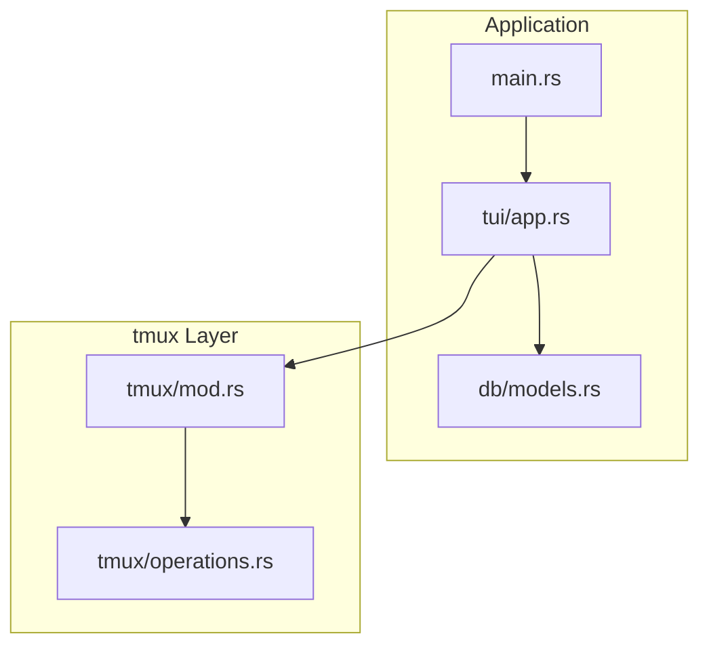
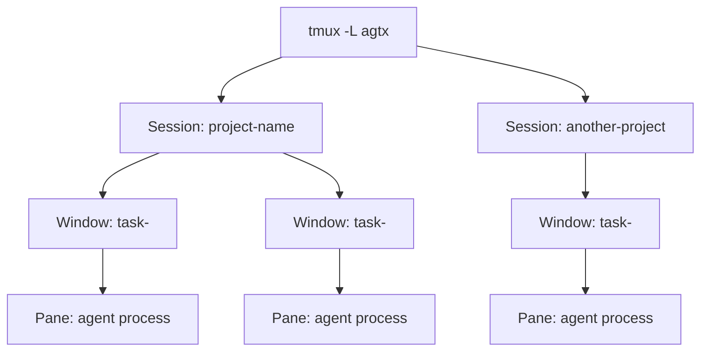
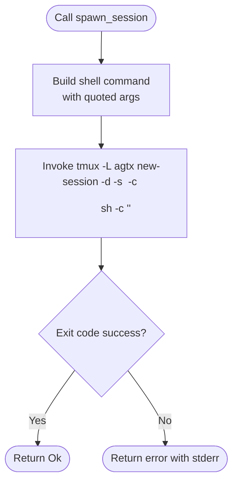
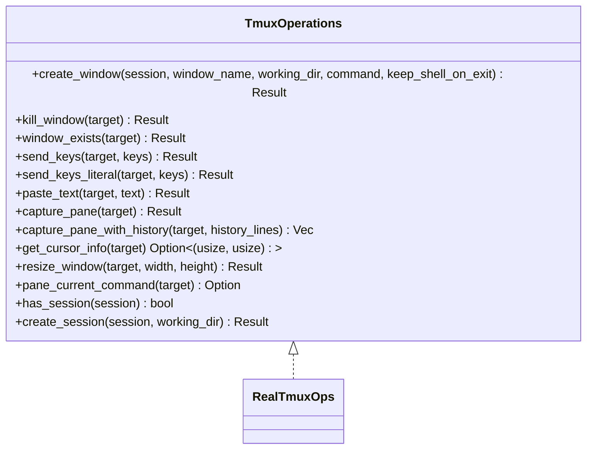
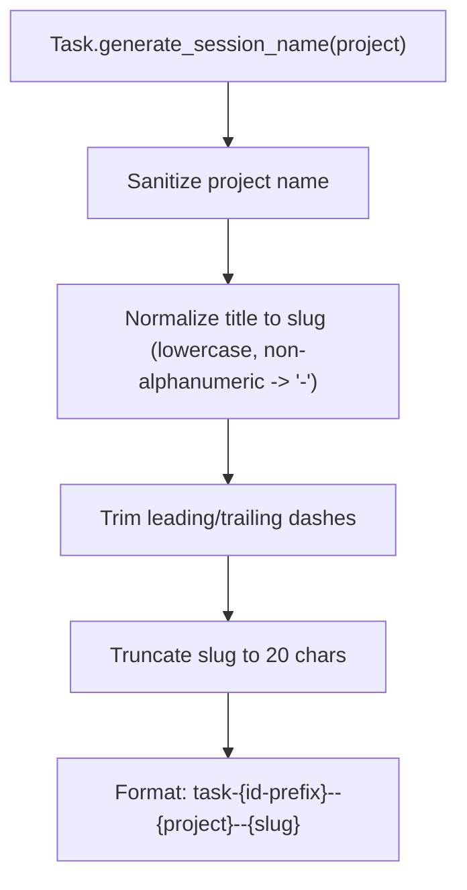
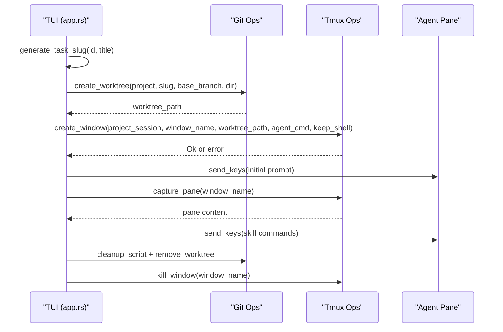
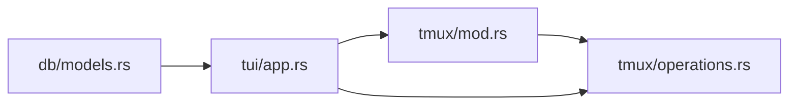

# Server Architecture and Session Organization

<cite>
**Referenced Files in This Document**
- [README.md](file://README.md)
- [CLAUDE.md](file://CLAUDE.md)
- [src/tmux/mod.rs](file://src/tmux/mod.rs)
- [src/tmux/operations.rs](file://src/tmux/operations.rs)
- [src/db/models.rs](file://src/db/models.rs)
- [src/tui/app.rs](file://src/tui/app.rs)
- [src/main.rs](file://src/main.rs)
- [tests/db_tests.rs](file://tests/db_tests.rs)
</cite>

## Table of Contents
1. [Introduction](#introduction)
2. [Project Structure](#project-structure)
3. [Core Components](#core-components)
4. [Architecture Overview](#architecture-overview)
5. [Detailed Component Analysis](#detailed-component-analysis)
6. [Dependency Analysis](#dependency-analysis)
7. [Performance Considerations](#performance-considerations)
8. [Troubleshooting Guide](#troubleshooting-guide)
9. [Conclusion](#conclusion)

## Introduction
This document explains AGTX’s dedicated tmux server architecture and how it isolates agent sessions from a user’s default tmux environment. AGTX runs a separate tmux server named “agtx” and organizes sessions, windows, and panes in a strict hierarchy: projects are top-level tmux sessions, tasks are windows within those sessions, and individual agent instances are managed as panes. The session naming convention task-{id}--{project}--{slug} encodes task identity and project context, enabling precise identification and management of agent workspaces. Practical examples demonstrate creating sessions, listing existing sessions, and navigating the hierarchy. Benefits include strong isolation, predictable resource management, and conflict prevention with user sessions. Guidance is included for configuring and customizing the tmux server setup.

## Project Structure
The tmux-related logic is encapsulated under the tmux module and integrated with higher-level components:
- The tmux module defines constants and operations for interacting with the dedicated “agtx” server.
- The operations trait abstracts tmux commands to enable testing and reuse across subsystems.
- The database models define how tasks generate tmux session names and track running agent sessions.
- The TUI orchestrates worktree creation, tmux window setup, and agent pane management.
- The main entrypoint initializes the application and indirectly coordinates tmux usage.

**Diagram sources**
- [src/main.rs:16-96](file://src/main.rs#L16-L96)
- [src/tui/app.rs:6926-6950](file://src/tui/app.rs#L6926-L6950)
- [src/db/models.rs:119-133](file://src/db/models.rs#L119-L133)
- [src/tmux/mod.rs:11-12](file://src/tmux/mod.rs#L11-L12)
- [src/tmux/operations.rs:8-59](file://src/tmux/operations.rs#L8-L59)

**Section sources**
- [src/main.rs:16-96](file://src/main.rs#L16-L96)
- [src/tmux/mod.rs:11-12](file://src/tmux/mod.rs#L11-L12)
- [src/tmux/operations.rs:8-59](file://src/tmux/operations.rs#L8-L59)
- [src/db/models.rs:119-133](file://src/db/models.rs#L119-L133)
- [src/tui/app.rs:6926-6950](file://src/tui/app.rs#L6926-L6950)

## Core Components
- Dedicated tmux server: AGTX uses a named server “agtx” to keep agent sessions separate from user sessions. All tmux commands target this server via the -L flag.
- Session naming convention: task-{id}--{project}--{slug}, where id is the task identifier, project is sanitized to a safe session name, and slug is a normalized, truncated task title.
- Hierarchical organization:
  - Projects are tmux sessions named after the project.
  - Tasks are tmux windows within the project session.
  - Agent panes are managed within each task window.
- Session lifecycle operations: spawn, list, attach, kill, and pane capture are exposed through both a simple module and a trait-backed implementation for testing and reuse.

Benefits:
- Isolation: Agent sessions do not interfere with user tmux sessions.
- Predictability: Consistent naming and hierarchy simplify discovery and automation.
- Resource control: Centralized tmux server enables consistent resource management and cleanup.

**Section sources**
- [src/tmux/mod.rs:11-12](file://src/tmux/mod.rs#L11-L12)
- [src/tmux/mod.rs:144-188](file://src/tmux/mod.rs#L144-L188)
- [src/db/models.rs:119-133](file://src/db/models.rs#L119-L133)
- [src/tmux/operations.rs:61-249](file://src/tmux/operations.rs#L61-L249)
- [README.md:549-564](file://README.md#L549-L564)
- [CLAUDE.md:184-189](file://CLAUDE.md#L184-L189)

## Architecture Overview
The AGTX tmux architecture enforces a strict hierarchy:
- Server: tmux -L agtx
- Sessions: One per project
- Windows: One per task within a project
- Panes: Agent instances run in panes within a task window

**Diagram sources**
- [README.md:549-564](file://README.md#L549-L564)
- [CLAUDE.md:184-189](file://CLAUDE.md#L184-L189)
- [src/db/models.rs:119-133](file://src/db/models.rs#L119-L133)
- [src/tui/app.rs:6949-6953](file://src/tui/app.rs#L6949-L6953)

## Detailed Component Analysis

### tmux Module: Server and Session Management
The tmux module centralizes operations against the dedicated “agtx” server:
- Server constant: AGENT_SERVER identifies the server name.
- Session creation: spawn_session builds a shell command and invokes tmux with -L agtx to create a detached session with a given name and working directory.
- Listing and inspection: list_sessions parses tmux list-sessions output into structured records; session_exists checks for a session’s presence.
- Pane operations: capture_pane reads recent pane output; send_keys injects keystrokes; attach_session provides a blocking attach; kill_session terminates a session.
- Name sanitization: safe_session_name transforms arbitrary project names into tmux-safe identifiers.

**Diagram sources**
- [src/tmux/mod.rs:15-48](file://src/tmux/mod.rs#L15-L48)

**Section sources**
- [src/tmux/mod.rs:11-12](file://src/tmux/mod.rs#L11-L12)
- [src/tmux/mod.rs:15-48](file://src/tmux/mod.rs#L15-L48)
- [src/tmux/mod.rs:51-84](file://src/tmux/mod.rs#L51-L84)
- [src/tmux/mod.rs:87-95](file://src/tmux/mod.rs#L87-L95)
- [src/tmux/mod.rs:98-107](file://src/tmux/mod.rs#L98-L107)
- [src/tmux/mod.rs:110-118](file://src/tmux/mod.rs#L110-L118)
- [src/tmux/mod.rs:123-131](file://src/tmux/mod.rs#L123-L131)
- [src/tmux/mod.rs:134-142](file://src/tmux/mod.rs#L134-L142)
- [src/tmux/mod.rs:144-166](file://src/tmux/mod.rs#L144-L166)

### Tmux Operations Trait: Abstraction and Testing
The operations trait defines a contract for tmux interactions:
- Methods cover window creation, killing, existence checks, key sending, text pasting, pane capture, cursor info, resizing, current command detection, and session existence.
- RealTmuxOps implements these methods by invoking tmux with -L agtx and appropriate targets.
- The abstraction supports mocking for unit tests and enables swapping implementations.

**Diagram sources**
- [src/tmux/operations.rs:9-59](file://src/tmux/operations.rs#L9-L59)
- [src/tmux/operations.rs:61-249](file://src/tmux/operations.rs#L61-L249)

**Section sources**
- [src/tmux/operations.rs:9-59](file://src/tmux/operations.rs#L9-L59)
- [src/tmux/operations.rs:61-249](file://src/tmux/operations.rs#L61-L249)

### Session Naming Convention and Parsing
Tasks generate tmux session names using a deterministic convention:
- task-{id}--{project}--{slug}
- id: first 8 characters of the task identifier
- project: sanitized project name (dots become dashes, unsafe characters collapsed)
- slug: lowercase, non-alphanumeric characters replaced with dashes, trimmed, truncated to 20 characters

The SessionInfo struct provides helpers to parse task_id and project_name from the session name.

**Diagram sources**
- [src/db/models.rs:119-133](file://src/db/models.rs#L119-L133)
- [src/tmux/mod.rs:144-166](file://src/tmux/mod.rs#L144-L166)
- [src/tmux/mod.rs:176-188](file://src/tmux/mod.rs#L176-L188)

**Section sources**
- [src/db/models.rs:119-133](file://src/db/models.rs#L119-L133)
- [src/tmux/mod.rs:144-166](file://src/tmux/mod.rs#L144-L166)
- [src/tmux/mod.rs:176-188](file://src/tmux/mod.rs#L176-L188)
- [tests/db_tests.rs:65-94](file://tests/db_tests.rs#L65-L94)

### TUI Orchestration: Worktree, Window, and Pane Lifecycle
The TUI coordinates worktree creation, tmux window setup, and agent pane management:
- Worktree creation: A unique slug is generated and a git worktree is created for the task.
- Window naming: The window name follows task-<slug>, targeting the project session.
- Pane management: Agents run in panes within the task window; the TUI captures pane content, sends keys, and resizes panes as needed.
- Cleanup: On task completion, the TUI kills the tmux window, runs cleanup scripts, and removes the worktree.

**Diagram sources**
- [src/tui/app.rs:6926-6950](file://src/tui/app.rs#L6926-L6950)
- [src/tui/app.rs:6950-6999](file://src/tui/app.rs#L6950-L6999)
- [src/tmux/operations.rs:64-110](file://src/tmux/operations.rs#L64-L110)

**Section sources**
- [src/tui/app.rs:6926-6950](file://src/tui/app.rs#L6926-L6950)
- [src/tui/app.rs:6950-6999](file://src/tui/app.rs#L6950-L6999)
- [src/tmux/operations.rs:64-110](file://src/tmux/operations.rs#L64-L110)

### Practical Examples: Creating, Listing, and Understanding the Hierarchy
- Create a session in the dedicated server:
  - tmux -L agtx new-session -d -s "<session-name>" -c "<working-dir>" sh -c "<agent-command>"
- List sessions on the dedicated server:
  - tmux -L agtx list-sessions -F "#{session_name}\t#{session_activity}\t#{session_created}"
- List windows across sessions:
  - tmux -L agtx list-windows -a
- Attach to the dedicated server:
  - tmux -L agtx attach

These commands reflect the operations implemented in the tmux module and operations trait.

**Section sources**
- [src/tmux/mod.rs:33-39](file://src/tmux/mod.rs#L33-L39)
- [src/tmux/mod.rs:52-58](file://src/tmux/mod.rs#L52-L58)
- [src/tmux/operations.rs:112-118](file://src/tmux/operations.rs#L112-L118)
- [src/tmux/operations.rs:240-247](file://src/tmux/operations.rs#L240-L247)
- [README.md:555-564](file://README.md#L555-L564)

## Dependency Analysis
The tmux layer depends on:
- The operations trait for decoupled tmux interactions.
- The database models for generating tmux session names and tracking running agents.
- The TUI for orchestrating worktree creation and window/pane lifecycle.

**Diagram sources**
- [src/db/models.rs:119-133](file://src/db/models.rs#L119-L133)
- [src/tui/app.rs:6926-6950](file://src/tui/app.rs#L6926-L6950)
- [src/tmux/mod.rs:11-12](file://src/tmux/mod.rs#L11-L12)
- [src/tmux/operations.rs:8-59](file://src/tmux/operations.rs#L8-L59)

**Section sources**
- [src/db/models.rs:119-133](file://src/db/models.rs#L119-L133)
- [src/tui/app.rs:6926-6950](file://src/tui/app.rs#L6926-L6950)
- [src/tmux/mod.rs:11-12](file://src/tmux/mod.rs#L11-L12)
- [src/tmux/operations.rs:8-59](file://src/tmux/operations.rs#L8-L59)

## Performance Considerations
- Centralized server reduces overhead: Using a single server minimizes tmux daemon contention and simplifies resource accounting.
- Efficient pane capture: Capturing only recent lines avoids heavy I/O for large panes.
- Background refresh: The TUI polls phase status and pane content in background threads to keep the UI responsive.
- Worktree reuse: Reusing worktrees across task phases reduces filesystem churn and speeds up agent startup.

[No sources needed since this section provides general guidance]

## Troubleshooting Guide
Common issues and resolutions:
- tmux server not running:
  - Ensure the dedicated server is reachable. The list_sessions function gracefully handles absence of sessions and returns an empty list.
- Session conflicts:
  - The naming convention task-{id}--{project}--{slug} prevents collisions for distinct tasks. Verify id and project name sanitization.
- Permission or quoting issues:
  - The spawn_session function properly escapes arguments for shell execution. If commands fail, verify the composed shell command and working directory.
- Attaching to sessions:
  - Use tmux -L agtx attach to connect to the dedicated server. From there, navigate windows and panes normally.

**Section sources**
- [src/tmux/mod.rs:51-84](file://src/tmux/mod.rs#L51-L84)
- [src/tmux/mod.rs:144-166](file://src/tmux/mod.rs#L144-L166)
- [src/tmux/mod.rs:33-48](file://src/tmux/mod.rs#L33-L48)
- [README.md:555-564](file://README.md#L555-L564)

## Conclusion
AGTX’s tmux architecture isolates agent sessions in a dedicated server, enforcing a clear hierarchy that scales across projects and tasks. The naming convention task-{id}--{project}--{slug} provides robust identification and parsing capabilities. The tmux module and operations trait abstract tmux interactions for reliability and testability. Together, these components deliver predictable session management, efficient pane operations, and strong separation from user tmux environments.