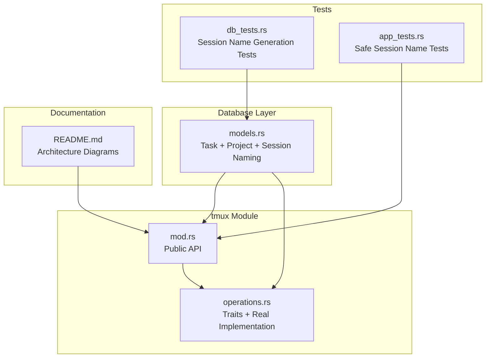
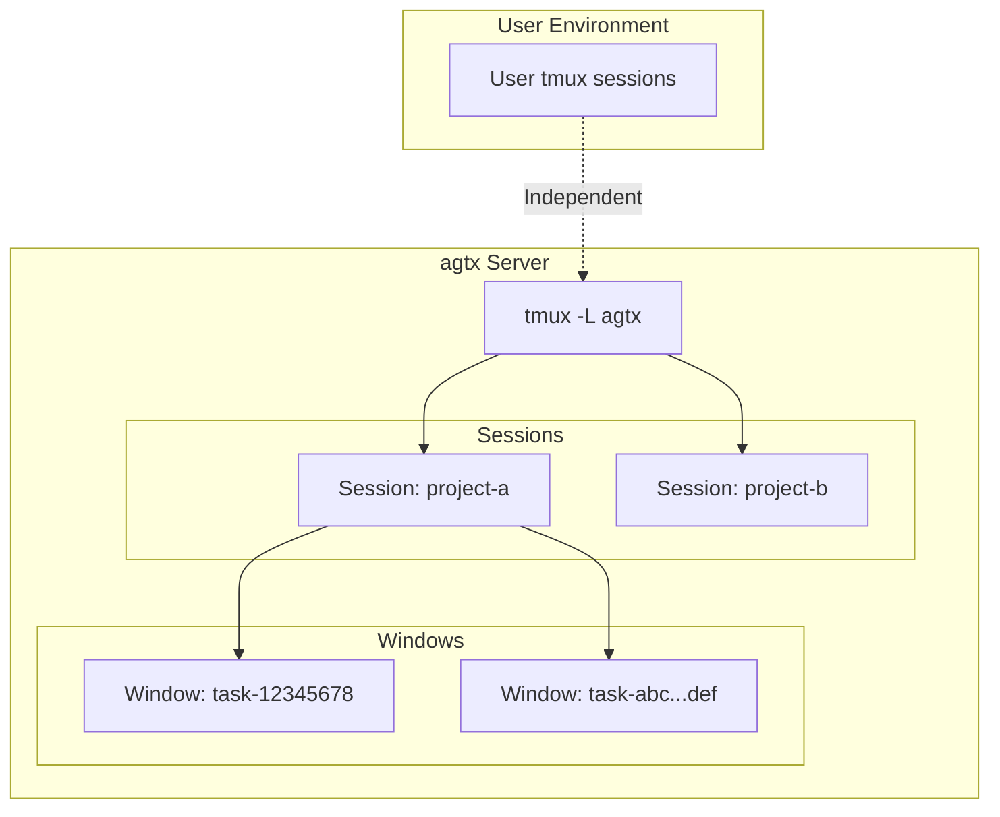
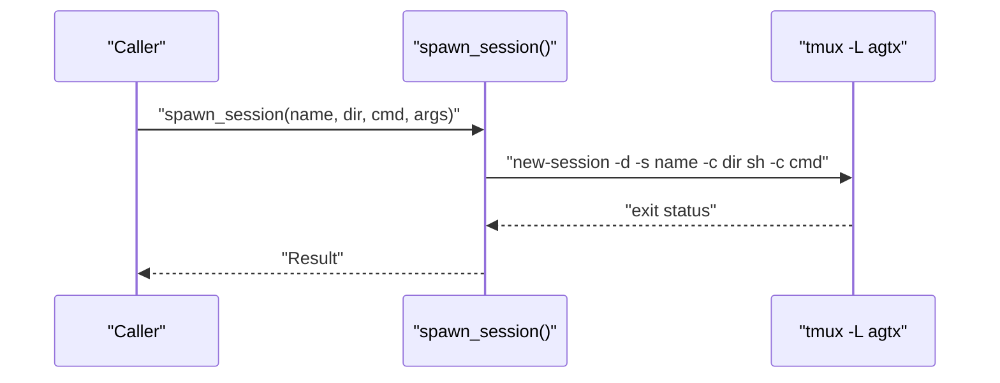
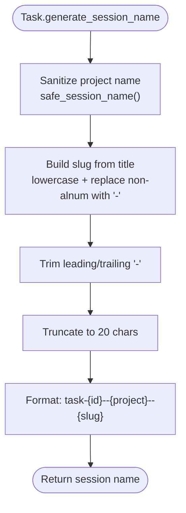
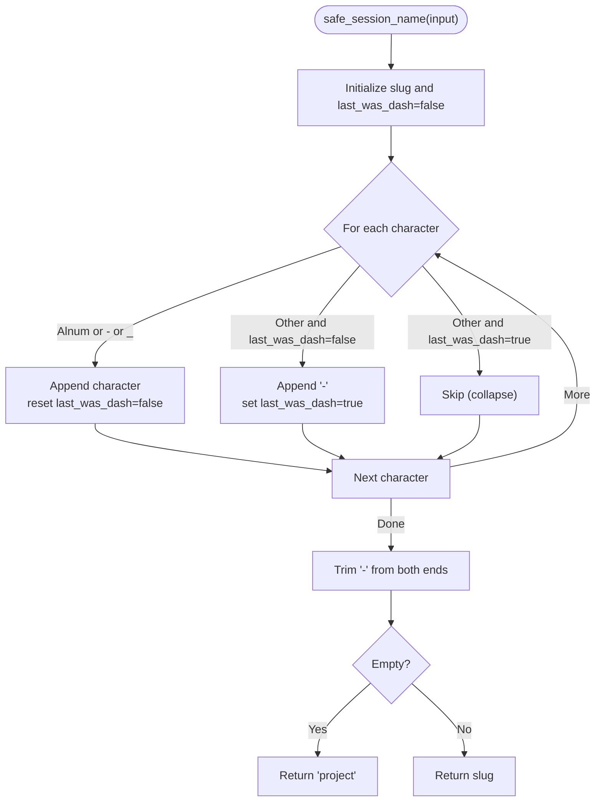
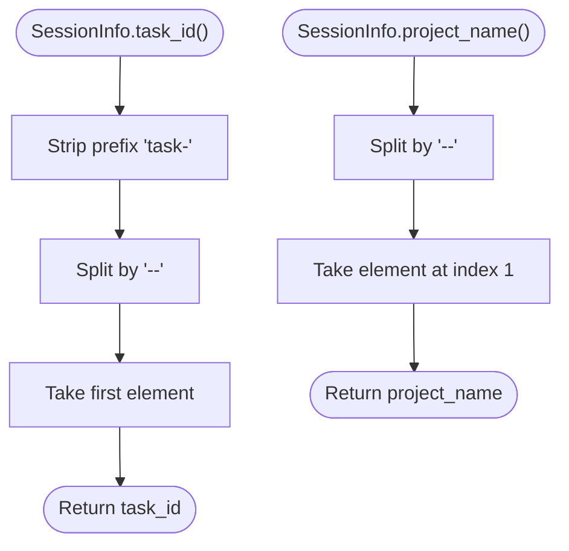
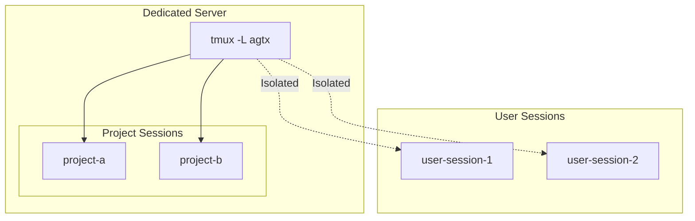
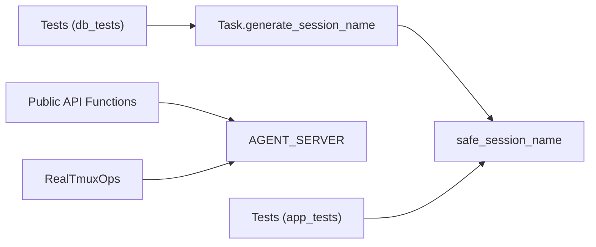

# Session Architecture

<cite>
**Referenced Files in This Document**
- [mod.rs](file://src/tmux/mod.rs)
- [operations.rs](file://src/tmux/operations.rs)
- [models.rs](file://src/db/models.rs)
- [README.md](file://README.md)
- [db_tests.rs](file://tests/db_tests.rs)
- [app_tests.rs](file://src/tui/app_tests.rs)
</cite>

## Table of Contents
1. [Introduction](#introduction)
2. [Project Structure](#project-structure)
3. [Core Components](#core-components)
4. [Architecture Overview](#architecture-overview)
5. [Detailed Component Analysis](#detailed-component-analysis)
6. [Dependency Analysis](#dependency-analysis)
7. [Performance Considerations](#performance-considerations)
8. [Troubleshooting Guide](#troubleshooting-guide)
9. [Conclusion](#conclusion)

## Introduction
This document explains the tmux session architecture used by agtx, focusing on the dedicated "agtx" server design and session naming conventions. It details how the system isolates agent sessions from existing tmux environments, how session names encode task identity and project context, and how the system safely parses session identifiers to extract meaningful metadata.

## Project Structure
The tmux-related functionality is organized into two primary modules:
- A high-level API module that exposes convenience functions for spawning, listing, checking existence, capturing panes, sending keys, attaching, and killing sessions.
- A traits-based operations module that defines an interface for tmux operations and provides a real implementation that executes tmux commands against the dedicated "agtx" server.

**Diagram sources**
- [mod.rs:1-188](file://src/tmux/mod.rs#L1-L188)
- [operations.rs:1-248](file://src/tmux/operations.rs#L1-L248)
- [models.rs:119-132](file://src/db/models.rs#L119-L132)
- [db_tests.rs:65-94](file://tests/db_tests.rs#L65-L94)
- [app_tests.rs:976-981](file://src/tui/app_tests.rs#L976-L981)
- [README.md:508-547](file://README.md#L508-L547)

**Section sources**
- [mod.rs:1-188](file://src/tmux/mod.rs#L1-L188)
- [operations.rs:1-248](file://src/tmux/operations.rs#L1-L248)
- [models.rs:119-132](file://src/db/models.rs#L119-L132)
- [README.md:508-547](file://README.md#L508-L547)

## Core Components
- AGENT_SERVER constant: Defines the dedicated tmux server name "agtx" used for all agent sessions.
- Public API functions: spawn_session, list_sessions, session_exists, capture_pane, send_keys, attach_session, kill_session.
- TmuxOperations trait and RealTmuxOps implementation: Provide a testable abstraction around tmux commands executed against the "agtx" server.
- Session naming: Task.generate_session_name produces names in the format "task-{id}--{project}--{slug}".
- Safe sanitization: safe_session_name transforms arbitrary project names into valid tmux identifiers.

**Section sources**
- [mod.rs:11-142](file://src/tmux/mod.rs#L11-L142)
- [operations.rs:9-248](file://src/tmux/operations.rs#L9-L248)
- [models.rs:119-132](file://src/db/models.rs#L119-L132)
- [mod.rs:144-166](file://src/tmux/mod.rs#L144-L166)

## Architecture Overview
The system uses a dedicated tmux server to isolate agent sessions from the user's existing tmux environments. This separation prevents conflicts and simplifies management.

**Diagram sources**
- [README.md:549-564](file://README.md#L549-L564)
- [mod.rs:11-142](file://src/tmux/mod.rs#L11-L142)

## Detailed Component Analysis

### Dedicated "agtx" Server Design
- The AGENT_SERVER constant sets the tmux socket name to "agtx".
- All public API functions and the RealTmuxOps implementation pass "-L agtx" to tmux commands.
- Benefits:
  - Prevents conflicts with user sessions.
  - Enables clean lifecycle management (list, kill, attach) scoped to agent workloads.
  - Allows external tmux workflows to continue unaffected.

**Diagram sources**
- [mod.rs:14-48](file://src/tmux/mod.rs#L14-L48)
- [operations.rs:240-247](file://src/tmux/operations.rs#L240-L247)

**Section sources**
- [mod.rs:11-142](file://src/tmux/mod.rs#L11-L142)
- [operations.rs:231-247](file://src/tmux/operations.rs#L231-L247)

### Session Naming Convention: task-{id}--{project}--{slug}
- The Task model generates session names using generate_session_name.
- Format: "task-{id}--{project}--{slug}"
  - id: first 8 characters of the task UUID.
  - project: sanitized project name via safe_session_name.
  - slug: lowercase, non-alphanumeric characters replaced with "-", trimmed, truncated to 20 characters.
- Example validations:
  - Special characters are converted to dashes.
  - Dots in project names are converted to dashes.
  - Long titles are truncated to keep names reasonable.

**Diagram sources**
- [models.rs:119-132](file://src/db/models.rs#L119-L132)
- [mod.rs:144-166](file://src/tmux/mod.rs#L144-L166)

**Section sources**
- [models.rs:119-132](file://src/db/models.rs#L119-L132)
- [db_tests.rs:65-94](file://tests/db_tests.rs#L65-L94)

### Safe Session Name Sanitization
- safe_session_name replaces invalid characters with dashes, collapses consecutive replacements, trims leading/trailing dashes, and returns a default if empty.
- This ensures tmux session names remain valid and human-readable.

**Diagram sources**
- [mod.rs:144-166](file://src/tmux/mod.rs#L144-L166)

**Section sources**
- [mod.rs:144-166](file://src/tmux/mod.rs#L144-L166)
- [app_tests.rs:976-981](file://src/tui/app_tests.rs#L976-L981)

### Parsing Session Identifiers
- SessionInfo provides helpers to parse task_id and project_name from session names.
- task_id extracts the first 8 characters after "task-".
- project_name extracts the segment between the first two "--".

**Diagram sources**
- [mod.rs:176-187](file://src/tmux/mod.rs#L176-L187)

**Section sources**
- [mod.rs:176-187](file://src/tmux/mod.rs#L176-L187)

### Session Hierarchy and Isolation
- Hierarchy:
  - Server: "agtx"
  - Sessions: One per project (derived from project_name via safe_session_name).
  - Windows: One per task within a project session.
- Isolation benefits:
  - Independent lifecycle management.
  - No interference with user tmux sessions.
  - Clear separation of concerns for agent workloads.
- Security implications:
  - Agent commands run within controlled tmux contexts.
  - Dedicated server reduces risk of accidental exposure to user sessions.
- Compatibility with external tmux workflows:
  - External tmux usage remains unaffected because agtx operates on a separate socket.
  - Users can still use their own tmux sessions without conflict.

**Diagram sources**
- [README.md:549-564](file://README.md#L549-L564)
- [mod.rs:11-142](file://src/tmux/mod.rs#L11-L142)

**Section sources**
- [README.md:549-564](file://README.md#L549-L564)
- [mod.rs:11-142](file://src/tmux/mod.rs#L11-L142)

## Dependency Analysis
- Task.generate_session_name depends on safe_session_name for project name sanitization.
- Public API functions and RealTmuxOps depend on AGENT_SERVER for tmux socket selection.
- Tests validate both the naming logic and sanitization behavior.

**Diagram sources**
- [models.rs:119-132](file://src/db/models.rs#L119-L132)
- [mod.rs:11-166](file://src/tmux/mod.rs#L11-L166)
- [operations.rs:231-247](file://src/tmux/operations.rs#L231-L247)
- [db_tests.rs:65-94](file://tests/db_tests.rs#L65-L94)
- [app_tests.rs:976-981](file://src/tui/app_tests.rs#L976-L981)

**Section sources**
- [models.rs:119-132](file://src/db/models.rs#L119-L132)
- [mod.rs:11-166](file://src/tmux/mod.rs#L11-L166)
- [operations.rs:231-247](file://src/tmux/operations.rs#L231-L247)
- [db_tests.rs:65-94](file://tests/db_tests.rs#L65-L94)
- [app_tests.rs:976-981](file://src/tui/app_tests.rs#L976-L981)

## Performance Considerations
- Session naming uses simple transformations and truncation, minimizing overhead.
- The dedicated server avoids cross-session interference, reducing contention and potential blocking.
- Using "-d" (detached) sessions during creation prevents unnecessary UI overhead.

## Troubleshooting Guide
- If tmux commands fail, verify the AGENT_SERVER socket exists and is accessible.
- When parsing session names, ensure the "task-{id}--{project}--{slug}" format is maintained.
- If project names cause invalid session names, sanitize them using safe_session_name before creating sessions.

**Section sources**
- [mod.rs:11-142](file://src/tmux/mod.rs#L11-L142)
- [mod.rs:144-166](file://src/tmux/mod.rs#L144-L166)

## Conclusion
The agtx tmux session architecture centers on a dedicated "agtx" server and a structured naming convention that encodes task identity, project context, and human-readable slugs. The safe_session_name function ensures robust session names, while parsing helpers enable reliable extraction of metadata. This design provides strong isolation, compatibility with external tmux workflows, and a clear hierarchy for managing agent sessions across projects and tasks.