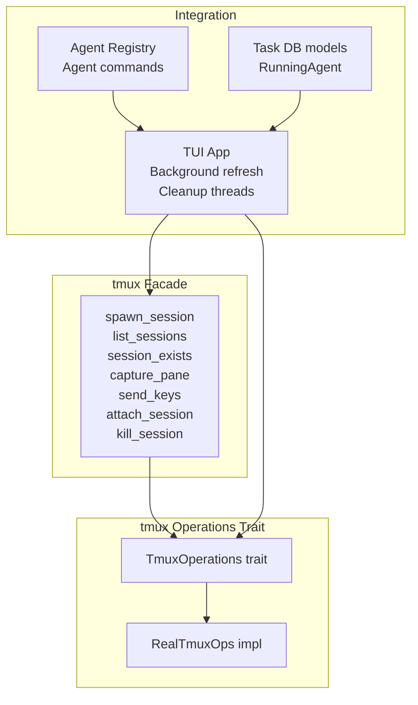
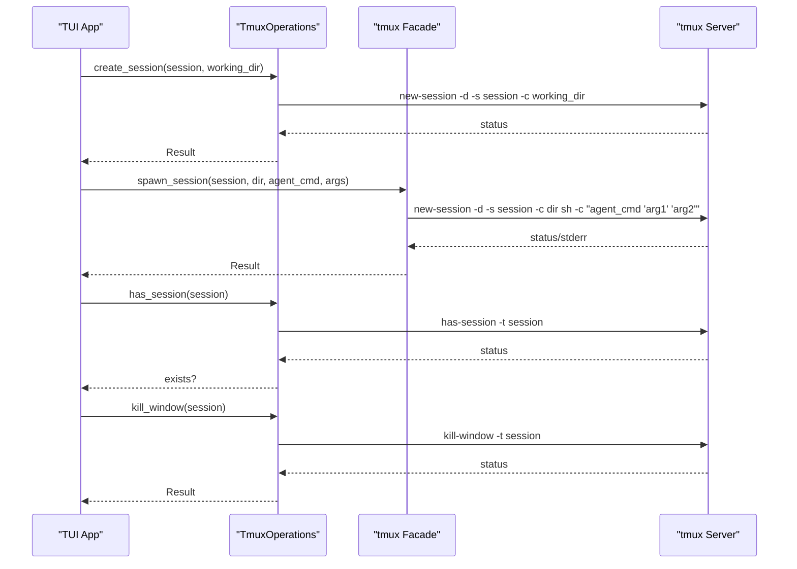
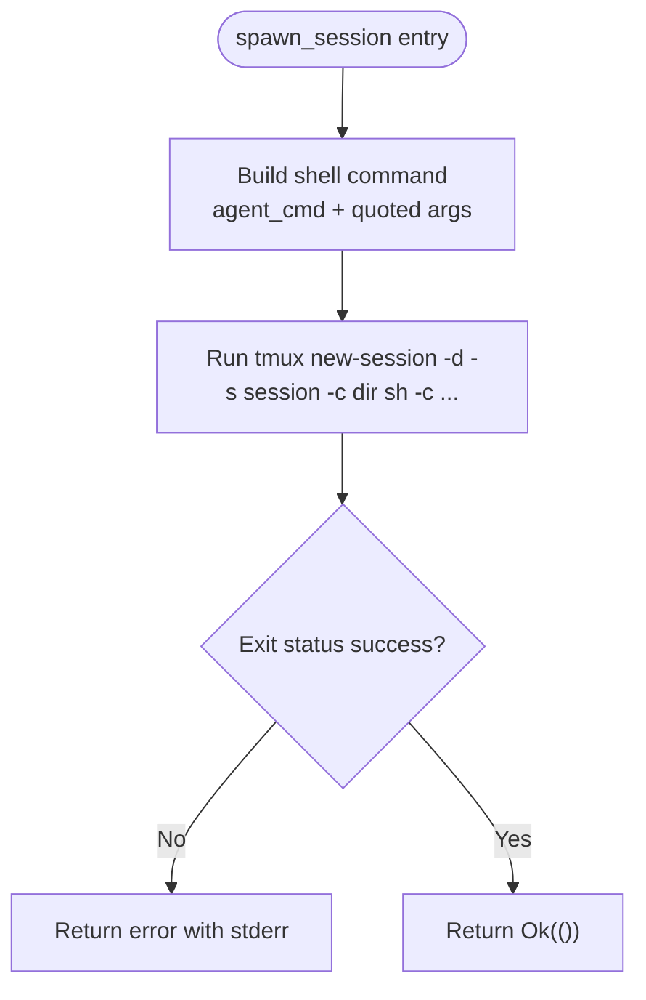
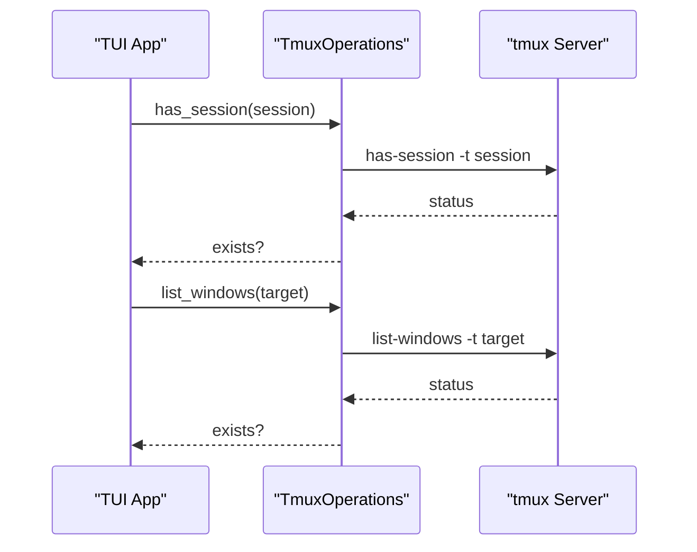
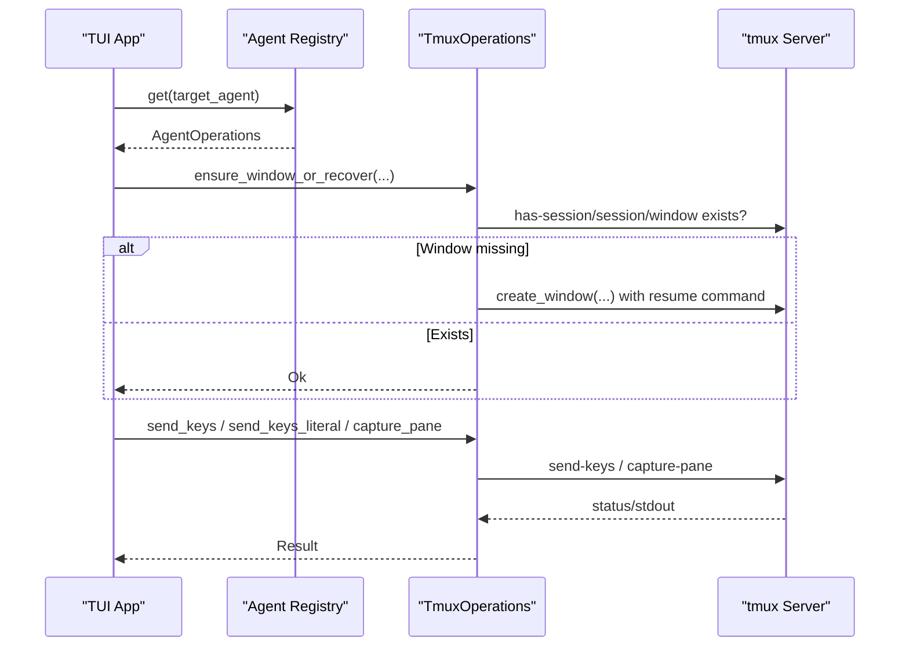
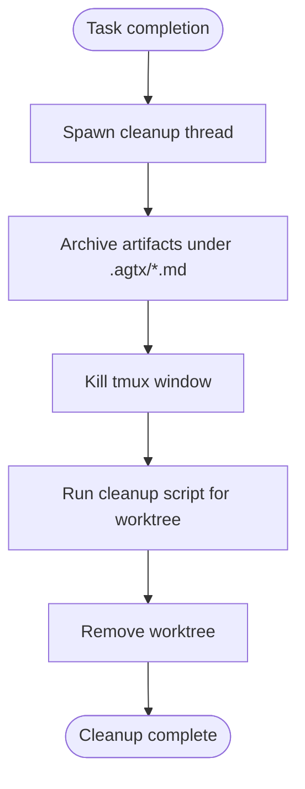
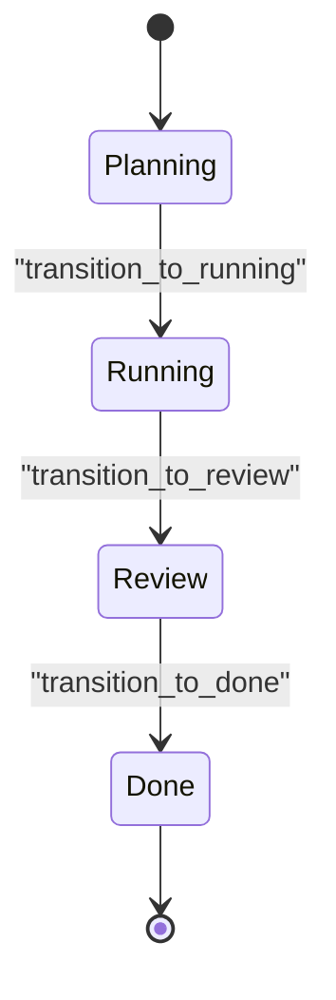
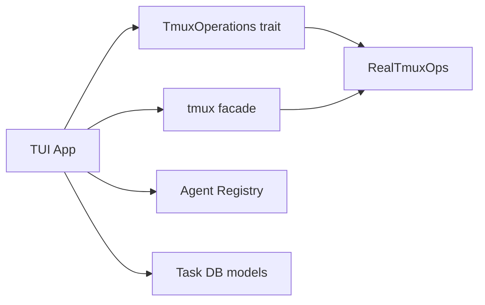

# Session Lifecycle Management

<cite>
**Referenced Files in This Document**
- [src/tmux/mod.rs](file://src/tmux/mod.rs)
- [src/tmux/operations.rs](file://src/tmux/operations.rs)
- [src/tui/app.rs](file://src/tui/app.rs)
- [src/agent/mod.rs](file://src/agent/mod.rs)
- [src/db/models.rs](file://src/db/models.rs)
- [src/tui/app_tests.rs](file://src/tui/app_tests.rs)
</cite>

## Table of Contents
1. [Introduction](#introduction)
2. [Project Structure](#project-structure)
3. [Core Components](#core-components)
4. [Architecture Overview](#architecture-overview)
5. [Detailed Component Analysis](#detailed-component-analysis)
6. [Dependency Analysis](#dependency-analysis)
7. [Performance Considerations](#performance-considerations)
8. [Troubleshooting Guide](#troubleshooting-guide)
9. [Conclusion](#conclusion)

## Introduction
This document explains the tmux session lifecycle management in the project, focusing on the complete flow from session creation to monitoring and cleanup. It covers:
- How sessions are created, including shell command construction, argument escaping, and working directory specification
- How to monitor active sessions and check for session existence
- How sessions are terminated and cleaned up automatically
- Examples of session creation with various agent commands and arguments
- Session state transitions from creation to completion and error handling
- Concurrent session management, resource cleanup strategies, and recovery mechanisms
- Troubleshooting guidance for common lifecycle issues

## Project Structure
The tmux lifecycle is implemented primarily in two modules:
- A thin facade module that exposes convenience functions for spawning, listing, existence checks, capturing panes, sending keys, attaching, and killing sessions
- An operations module that defines a trait for tmux operations and a real implementation using actual tmux commands, enabling testing with mocks

These capabilities integrate with the TUI application, which manages tasks, orchestrates agent interactions, and performs background cleanup.

**Diagram sources**
- [src/tmux/mod.rs:14-142](file://src/tmux/mod.rs#L14-L142)
- [src/tmux/operations.rs:9-59](file://src/tmux/operations.rs#L9-L59)
- [src/tmux/operations.rs:62-248](file://src/tmux/operations.rs#L62-L248)
- [src/tui/app.rs:6327-6512](file://src/tui/app.rs#L6327-L6512)
- [src/agent/mod.rs:112-162](file://src/agent/mod.rs#L112-L162)
- [src/db/models.rs:186-202](file://src/db/models.rs#L186-L202)

**Section sources**
- [src/tmux/mod.rs:1-189](file://src/tmux/mod.rs#L1-L189)
- [src/tmux/operations.rs:1-249](file://src/tmux/operations.rs#L1-L249)
- [src/tui/app.rs:6327-6512](file://src/tui/app.rs#L6327-L6512)
- [src/agent/mod.rs:1-171](file://src/agent/mod.rs#L1-L171)
- [src/db/models.rs:186-202](file://src/db/models.rs#L186-L202)

## Core Components
- tmux facade functions:
  - spawn_session: Creates a detached tmux session with a constructed shell command and working directory
  - list_sessions: Lists sessions with activity and creation timestamps
  - session_exists: Checks if a session exists
  - capture_pane: Captures pane output
  - send_keys: Sends keys to a session
  - attach_session: Attaches to a session
  - kill_session: Terminates a session
- TmuxOperations trait and RealTmuxOps implementation:
  - Provides a testable interface for tmux operations
  - Includes window-level operations and session-level helpers
- TUI integration:
  - Background session refresh and status updates
  - Cleanup threads that archive artifacts, kill windows, run cleanup scripts, and remove worktrees
  - Agent registry constructs agent-specific commands for resume and interactive runs

Key responsibilities:
- Session creation and teardown
- Monitoring and recovery
- Resource cleanup and artifact archival

**Section sources**
- [src/tmux/mod.rs:14-142](file://src/tmux/mod.rs#L14-L142)
- [src/tmux/operations.rs:9-248](file://src/tmux/operations.rs#L9-L248)
- [src/tui/app.rs:6327-6512](file://src/tui/app.rs#L6327-L6512)
- [src/tui/app.rs:6990-7031](file://src/tui/app.rs#L6990-L7031)

## Architecture Overview
The lifecycle spans three layers:
- Application layer (TUI): Orchestrates task phases, triggers agent interactions, and manages cleanup
- tmux abstraction: Provides a trait-based interface for tmux operations and a real implementation
- tmux server: Executes tmux commands against a dedicated server namespace

**Diagram sources**
- [src/tmux/operations.rs:231-247](file://src/tmux/operations.rs#L231-L247)
- [src/tmux/mod.rs:14-48](file://src/tmux/mod.rs#L14-L48)
- [src/tmux/operations.rs:112-118](file://src/tmux/operations.rs#L112-L118)

## Detailed Component Analysis

### Session Creation: spawn_session
- Purpose: Launch a detached tmux session running a specific agent command with properly escaped arguments
- Shell command construction:
  - Starts with the agent command
  - Iteratively appends each argument, quoting with single quotes and escaping internal single quotes
- Working directory specification:
  - Uses the -c flag to set the session’s working directory
- Error handling:
  - Captures stderr and returns a descriptive error if the tmux command fails

**Diagram sources**
- [src/tmux/mod.rs:14-48](file://src/tmux/mod.rs#L14-L48)

**Section sources**
- [src/tmux/mod.rs:14-48](file://src/tmux/mod.rs#L14-L48)

### Session Existence Checking and Monitoring
- Existence check:
  - has-session -t session returns success/failure
- Listing sessions:
  - list-sessions with format fields for name, last activity, and creation time
  - Parses tab-separated output into structured records
- Monitoring:
  - TUI periodically spawns a background refresh thread to collect session/task statuses
  - Refresh uses a TTL cache and non-blocking receive to avoid UI stalls

**Diagram sources**
- [src/tmux/operations.rs:120-126](file://src/tmux/operations.rs#L120-L126)
- [src/tmux/operations.rs:231-238](file://src/tmux/operations.rs#L231-L238)

**Section sources**
- [src/tmux/mod.rs:86-95](file://src/tmux/mod.rs#L86-L95)
- [src/tmux/mod.rs:50-84](file://src/tmux/mod.rs#L50-L84)
- [src/tui/app.rs:6327-6512](file://src/tui/app.rs#L6327-L6512)

### Pane Interaction and Recovery
- Pane capture:
  - capture-pane -p -S N retrieves the last N lines
- Sending keys:
  - send-keys supports both literal and newline-terminated variants
- Recovery:
  - When a tmux window disappears, the system can recreate it using the agent’s resume command
  - The TUI ensures the window exists before sending prompts and commands

**Diagram sources**
- [src/tui/app.rs:7952-7980](file://src/tui/app.rs#L7952-L7980)
- [src/agent/mod.rs:36-48](file://src/agent/mod.rs#L36-L48)
- [src/tmux/operations.rs:128-146](file://src/tmux/operations.rs#L128-L146)
- [src/tmux/operations.rs:166-182](file://src/tmux/operations.rs#L166-L182)

**Section sources**
- [src/tmux/mod.rs:97-118](file://src/tmux/mod.rs#L97-L118)
- [src/tui/app.rs:7952-7980](file://src/tui/app.rs#L7952-L7980)
- [src/agent/mod.rs:36-48](file://src/agent/mod.rs#L36-L48)

### Termination and Automatic Cleanup
- Termination:
  - kill_session removes a session
  - kill_window removes a window (used during cleanup)
- Automatic cleanup:
  - Background thread archives artifacts, kills tmux windows, runs cleanup scripts, and removes worktrees
  - Cleans up only when resources exist; otherwise, it proceeds without errors

**Diagram sources**
- [src/tui/app.rs:5046-5071](file://src/tui/app.rs#L5046-L5071)
- [src/tui/app.rs:6990-7031](file://src/tui/app.rs#L6990-L7031)

**Section sources**
- [src/tmux/mod.rs:133-142](file://src/tmux/mod.rs#L133-L142)
- [src/tmux/operations.rs:112-118](file://src/tmux/operations.rs#L112-L118)
- [src/tui/app.rs:5046-5071](file://src/tui/app.rs#L5046-L5071)
- [src/tui/app.rs:6990-7031](file://src/tui/app.rs#L6990-L7031)

### Session State Transitions and Examples
- State model:
  - Tasks track a session name and status; cleanup clears session and worktree references upon completion
- Example transitions:
  - Planning → Running: send execution skill/prompt to the agent via tmux
  - Running → Review: send review skill/prompt and handle PR state
  - Review → Done: optional PR checks and cleanup
- Agent commands:
  - Interactive commands are built per-agent with appropriate escaping
  - Resume commands reconstruct the previous session state

**Diagram sources**
- [src/tui/app.rs:4883-4929](file://src/tui/app.rs#L4883-L4929)
- [src/tui/app.rs:4931-5008](file://src/tui/app.rs#L4931-L5008)
- [src/tui/app.rs:5010-5071](file://src/tui/app.rs#L5010-L5071)
- [src/db/models.rs:186-202](file://src/db/models.rs#L186-L202)
- [src/agent/mod.rs:36-76](file://src/agent/mod.rs#L36-L76)

**Section sources**
- [src/tui/app.rs:4883-5008](file://src/tui/app.rs#L4883-L5008)
- [src/db/models.rs:186-202](file://src/db/models.rs#L186-L202)
- [src/agent/mod.rs:36-76](file://src/agent/mod.rs#L36-L76)

### Argument Escaping and Safety
- Arguments are single-quoted and internal single quotes are escaped to preserve literal values
- The agent module also escapes prompts for agent-specific commands
- These practices prevent shell injection and ensure arguments are passed exactly as intended

**Section sources**
- [src/tmux/mod.rs:22-31](file://src/tmux/mod.rs#L22-L31)
- [src/agent/mod.rs:66-76](file://src/agent/mod.rs#L66-L76)

## Dependency Analysis
- Internal dependencies:
  - TUI depends on TmuxOperations (trait) and tmux facade functions
  - Agent registry supplies agent-specific commands for resume and interactive runs
  - Task database models track running agents and task state
- External dependencies:
  - tmux binary invoked via std::process::Command
  - which crate for agent availability detection

**Diagram sources**
- [src/tmux/operations.rs:9-59](file://src/tmux/operations.rs#L9-L59)
- [src/tmux/operations.rs:62-248](file://src/tmux/operations.rs#L62-L248)
- [src/tmux/mod.rs:14-142](file://src/tmux/mod.rs#L14-L142)
- [src/agent/mod.rs:112-162](file://src/agent/mod.rs#L112-L162)
- [src/db/models.rs:186-202](file://src/db/models.rs#L186-L202)

**Section sources**
- [src/tmux/operations.rs:9-248](file://src/tmux/operations.rs#L9-L248)
- [src/tmux/mod.rs:1-189](file://src/tmux/mod.rs#L1-L189)
- [src/agent/mod.rs:1-171](file://src/agent/mod.rs#L1-L171)
- [src/db/models.rs:186-202](file://src/db/models.rs#L186-L202)

## Performance Considerations
- Non-blocking refresh:
  - Background thread with TTL cache prevents frequent tmux queries and UI blocking
- Minimal shell overhead:
  - Detached sessions reduce overhead compared to attached sessions
- Efficient cleanup:
  - Cleanup runs asynchronously to avoid stalling task completion

[No sources needed since this section provides general guidance]

## Troubleshooting Guide
Common issues and resolutions:
- Stuck sessions:
  - Use kill_session to terminate a session and free resources
  - Verify with list_sessions and session_exists
- Orphaned processes:
  - Ensure cleanup threads run to kill windows and remove worktrees
  - Confirm that resume commands are available for recovery
- Cleanup failures:
  - Check that tmux is available and the dedicated server namespace is accessible
  - Validate that cleanup scripts and worktree paths exist
- Recovery from tmux restarts:
  - Use agent resume commands to recreate missing windows

Concrete references:
- Session termination and existence checks
- Background cleanup and artifact archival
- Agent resume command construction

**Section sources**
- [src/tmux/mod.rs:133-142](file://src/tmux/mod.rs#L133-L142)
- [src/tmux/mod.rs:86-95](file://src/tmux/mod.rs#L86-L95)
- [src/tui/app.rs:6990-7031](file://src/tui/app.rs#L6990-L7031)
- [src/agent/mod.rs:36-48](file://src/agent/mod.rs#L36-L48)

## Conclusion
The tmux session lifecycle is encapsulated by a clean facade and a testable operations trait. Sessions are created with robust argument escaping, monitored efficiently, and cleaned up comprehensively. The TUI integrates these capabilities to manage task phases, recover from failures, and ensure resources are released promptly. Following the patterns documented here enables reliable concurrent session management and resilient recovery from common operational issues.