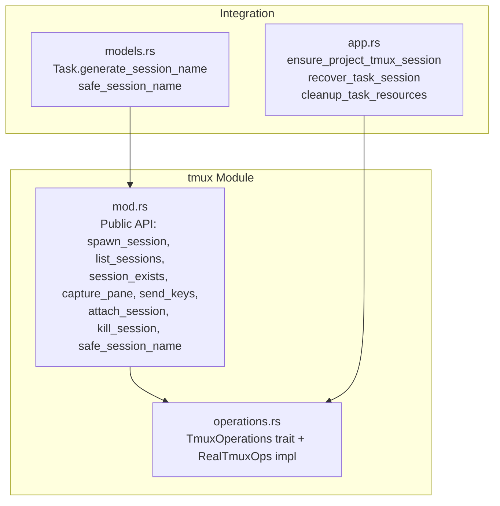
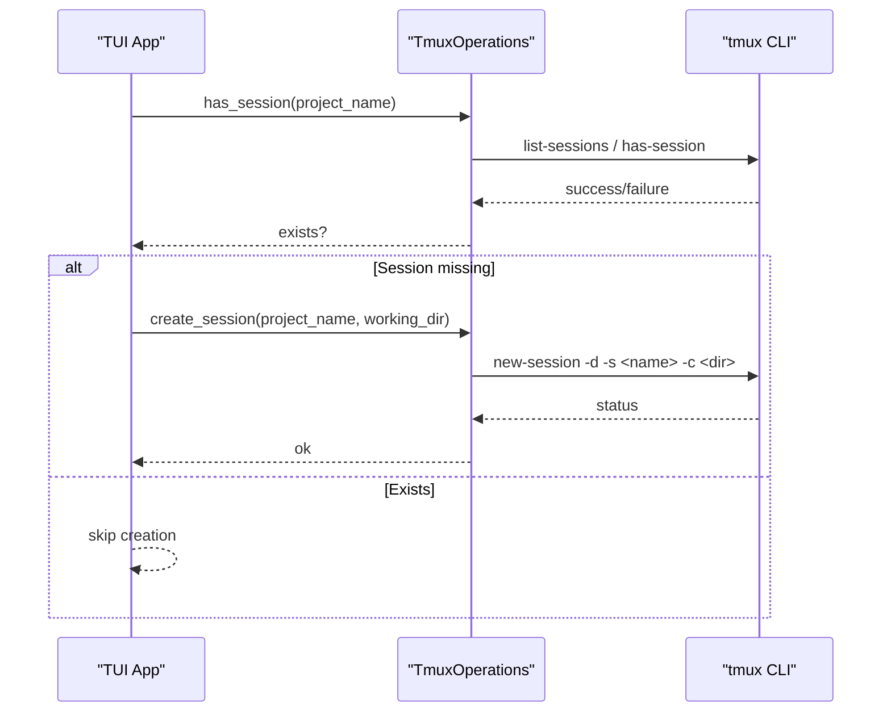
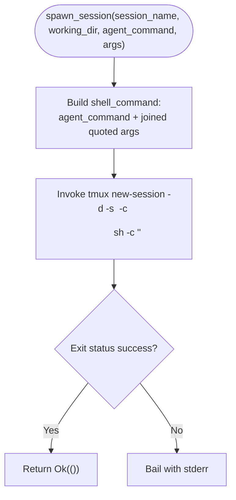
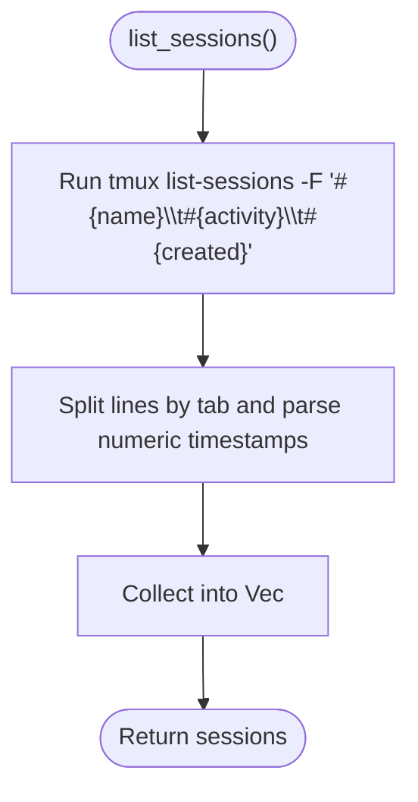
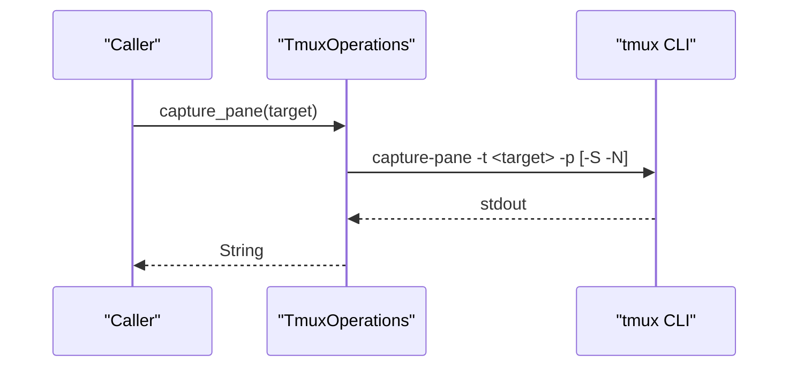
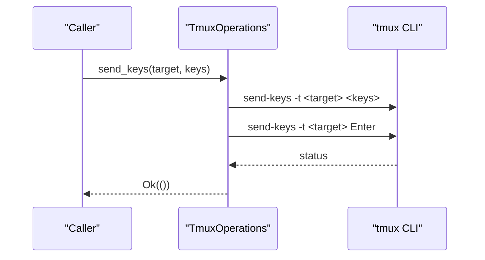
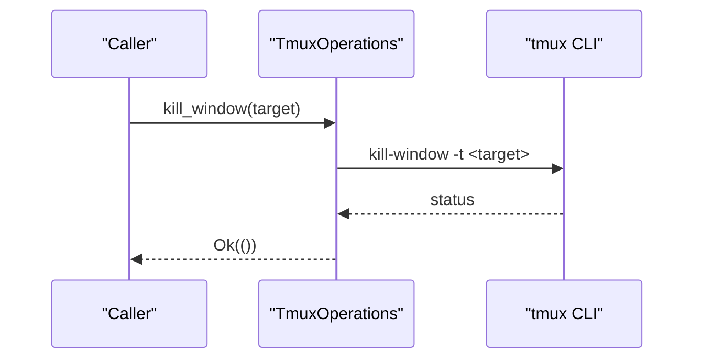
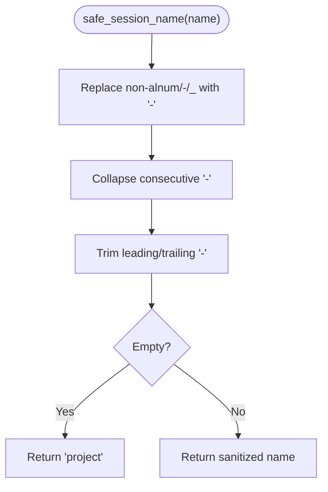
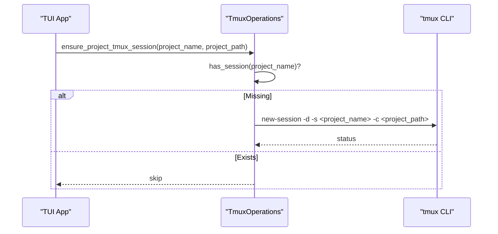
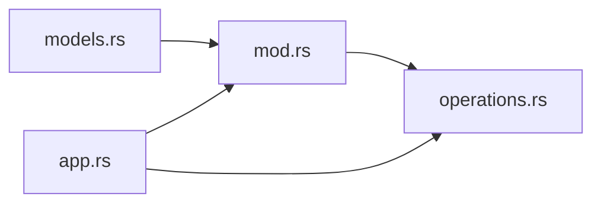

# Session Management and Lifecycle

<cite>
**Referenced Files in This Document**
- [mod.rs](file://src/tmux/mod.rs)
- [operations.rs](file://src/tmux/operations.rs)
- [app.rs](file://src/tui/app.rs)
- [models.rs](file://src/db/models.rs)
- [Cargo.toml](file://Cargo.toml)
</cite>

## Table of Contents
1. [Introduction](#introduction)
2. [Project Structure](#project-structure)
3. [Core Components](#core-components)
4. [Architecture Overview](#architecture-overview)
5. [Detailed Component Analysis](#detailed-component-analysis)
6. [Dependency Analysis](#dependency-analysis)
7. [Performance Considerations](#performance-considerations)
8. [Troubleshooting Guide](#troubleshooting-guide)
9. [Conclusion](#conclusion)
10. [Appendices](#appendices)

## Introduction
This document explains the complete lifecycle of tmux agent sessions in the project, from creation to termination. It focuses on:
- Creating detached agent sessions with robust shell command escaping and working directory specification
- Checking session existence and listing active sessions with activity timestamps
- Capturing recent pane output for debugging
- Practical examples for naming, organizing, and persisting sessions across task lifecycles
- Strategies to prevent zombie sessions and ensure proper cleanup
- Troubleshooting common issues and best practices for naming and maintenance

## Project Structure
The tmux session management spans two modules:
- A thin facade module that exposes convenience functions for spawning, listing, existence checks, capturing output, sending keys, attaching, and killing sessions
- An operations trait abstraction that enables real tmux command execution and supports mocking for tests

**Diagram sources**
- [mod.rs:1-189](file://src/tmux/mod.rs#L1-L189)
- [operations.rs:1-249](file://src/tmux/operations.rs#L1-L249)
- [app.rs:6757-6955](file://src/tui/app.rs#L6757-L6955)
- [models.rs:119-133](file://src/db/models.rs#L119-L133)

**Section sources**
- [mod.rs:1-189](file://src/tmux/mod.rs#L1-L189)
- [operations.rs:1-249](file://src/tmux/operations.rs#L1-L249)
- [app.rs:6757-6955](file://src/tui/app.rs#L6757-L6955)
- [models.rs:119-133](file://src/db/models.rs#L119-L133)

## Core Components
- Public tmux API (spawning, listing, existence checks, capturing, sending keys, attaching, killing)
- Operations abstraction with a real implementation that shells out to tmux
- Task model helpers for deterministic session naming
- Application-level helpers for ensuring project sessions and cleaning up resources

Key responsibilities:
- spawn_session: Creates a detached tmux session with a properly escaped shell command and working directory
- list_sessions: Enumerates sessions with activity and creation timestamps
- session_exists/capture_pane/send_keys/attach_session/kill_session: Standard lifecycle operations
- TmuxOperations: Abstraction for window/session management and pane operations
- ensure_project_tmux_session: Ensures a project-level tmux session exists
- recover_task_session: Recovers a task’s session after tmux restarts or accidental kills
- cleanup_task_resources: Archives artifacts, kills windows, runs cleanup scripts, and removes worktrees

**Section sources**
- [mod.rs:14-189](file://src/tmux/mod.rs#L14-L189)
- [operations.rs:10-249](file://src/tmux/operations.rs#L10-L249)
- [models.rs:119-133](file://src/db/models.rs#L119-L133)
- [app.rs:6757-6955](file://src/tui/app.rs#L6757-L6955)

## Architecture Overview
The system separates concerns between a public API and a pluggable operations layer. The TUI orchestrates session lifecycle using the operations abstraction, while the Task model provides naming conventions that integrate with tmux naming.

**Diagram sources**
- [app.rs:6757-6765](file://src/tui/app.rs#L6757-L6765)
- [operations.rs:231-238](file://src/tmux/operations.rs#L231-L238)
- [operations.rs:240-247](file://src/tmux/operations.rs#L240-L247)

## Detailed Component Analysis

### spawn_session: Creating Detached Agent Sessions
Purpose:
- Launch a new tmux session in detached mode with a shell command built from an agent command and its arguments
- Properly escape/quote arguments to avoid shell injection and preserve literal values
- Set the working directory for the session

Behavior highlights:
- Builds a shell command string by concatenating the agent command and its arguments, quoting each argument with single quotes and escaping internal single quotes
- Invokes tmux with a server identifier, detached flag, session name, working directory, and a shell command wrapper
- Propagates errors from tmux failure with captured stderr

**Diagram sources**
- [mod.rs:15-48](file://src/tmux/mod.rs#L15-L48)

Practical example (conceptual):
- Create a session named after a task with a working directory derived from the project path
- Pass agent-specific arguments that are properly escaped

**Section sources**
- [mod.rs:15-48](file://src/tmux/mod.rs#L15-L48)

### Session Existence Checking and Listing
- session_exists: Uses tmux has-session to determine if a session exists
- list_sessions: Lists sessions with tab-separated fields for name, last activity, and creation timestamps; parses and returns typed records

**Diagram sources**
- [mod.rs:51-84](file://src/tmux/mod.rs#L51-L84)

**Section sources**
- [mod.rs:87-95](file://src/tmux/mod.rs#L87-L95)
- [mod.rs:51-84](file://src/tmux/mod.rs#L51-L84)

### Pane Capture and Debugging
- capture_pane: Captures the last N lines of a session’s pane output for debugging
- Additional pane capture variants exist in the operations layer for richer output capture

**Diagram sources**
- [mod.rs:97-107](file://src/tmux/mod.rs#L97-L107)
- [operations.rs:166-172](file://src/tmux/operations.rs#L166-L172)

**Section sources**
- [mod.rs:97-107](file://src/tmux/mod.rs#L97-L107)
- [operations.rs:166-182](file://src/tmux/operations.rs#L166-L182)

### Sending Keys and Attaching
- send_keys: Sends a keystroke sequence followed by Enter to a target (session/window/pane)
- attach_session: Attaches to a session; blocks until detach or session end

**Diagram sources**
- [mod.rs:109-131](file://src/tmux/mod.rs#L109-L131)
- [operations.rs:128-146](file://src/tmux/operations.rs#L128-L146)

**Section sources**
- [mod.rs:109-131](file://src/tmux/mod.rs#L109-L131)

### Killing Sessions and Windows
- kill_session: Terminates a session
- kill_window: Terminates a window (used during cleanup)

**Diagram sources**
- [mod.rs:133-142](file://src/tmux/mod.rs#L133-L142)
- [operations.rs:112-118](file://src/tmux/operations.rs#L112-L118)

**Section sources**
- [mod.rs:133-142](file://src/tmux/mod.rs#L133-L142)
- [operations.rs:112-118](file://src/tmux/operations.rs#L112-L118)

### Session Naming and Organization
- safe_session_name: Sanitizes project names for tmux session names
- Task.generate_session_name: Produces a structured session name including task ID, project, and a slug derived from the task title

**Diagram sources**
- [mod.rs:144-166](file://src/tmux/mod.rs#L144-L166)
- [models.rs:119-133](file://src/db/models.rs#L119-L133)

**Section sources**
- [mod.rs:144-166](file://src/tmux/mod.rs#L144-L166)
- [models.rs:119-133](file://src/db/models.rs#L119-L133)

### Application-Level Session Lifecycle Helpers
- ensure_project_tmux_session: Ensures a project-level tmux session exists; creates it if missing
- recover_task_session: Recovers a task’s session by creating a new window with the agent’s resume command; used after tmux restarts or accidental kills
- cleanup_task_resources: Archives artifacts, kills the task window, runs cleanup scripts, and removes the worktree

**Diagram sources**
- [app.rs:6757-6765](file://src/tui/app.rs#L6757-L6765)
- [operations.rs:231-247](file://src/tmux/operations.rs#L231-L247)

**Section sources**
- [app.rs:6757-6802](file://src/tui/app.rs#L6757-L6802)
- [app.rs:6869-6913](file://src/tui/app.rs#L6869-L6913)
- [app.rs:6915-6956](file://src/tui/app.rs#L6915-L6956)

## Dependency Analysis
- The public API module re-exports the operations trait and exposes convenience functions
- The operations trait is implemented by RealTmuxOps and used throughout the TUI for session and window management
- The Task model depends on safe_session_name for deterministic naming
- The TUI integrates session management into task lifecycle workflows

**Diagram sources**
- [mod.rs:1-3](file://src/tmux/mod.rs#L1-L3)
- [operations.rs:1-10](file://src/tmux/operations.rs#L1-L10)
- [models.rs:1-2](file://src/db/models.rs#L1-L2)
- [app.rs:6757-6765](file://src/tui/app.rs#L6757-L6765)

**Section sources**
- [mod.rs:1-3](file://src/tmux/mod.rs#L1-L3)
- [operations.rs:1-10](file://src/tmux/operations.rs#L1-L10)
- [models.rs:1-2](file://src/db/models.rs#L1-L2)
- [app.rs:6757-6765](file://src/tui/app.rs#L6757-L6765)

## Performance Considerations
- Shell command construction in spawn_session builds a single shell command string; keep argument counts reasonable to avoid extremely long command lines
- Using detached sessions avoids blocking the caller and reduces overhead
- Capturing pane output is lightweight but avoid excessive frequency in tight loops
- Prefer batched operations where possible (e.g., check existence before creation)

## Troubleshooting Guide
Common issues and resolutions:
- Permission problems
  - Symptom: tmux new-session fails with permission errors
  - Resolution: Ensure the user has permission to start tmux sessions and write to the working directory; verify tmux server accessibility
  - Section sources
    - [mod.rs:33-47](file://src/tmux/mod.rs#L33-L47)

- Session conflicts
  - Symptom: tmux reports “session name already exists”
  - Resolution: Use safe_session_name and Task.generate_session_name to produce unique, sanitized names; consider appending a timestamp or counter if collisions occur
  - Section sources
    - [mod.rs:144-166](file://src/tmux/mod.rs#L144-L166)
    - [models.rs:119-133](file://src/db/models.rs#L119-L133)

- Cleanup failures
  - Symptom: Windows or sessions remain after task completion
  - Resolution: Use cleanup_task_resources to kill windows, run cleanup scripts, and remove worktrees; ensure the TUI invokes cleanup on task transitions
  - Section sources
    - [app.rs:6869-6913](file://src/tui/app.rs#L6869-L6913)
    - [app.rs:6915-6956](file://src/tui/app.rs#L6915-L6956)

- Zombie sessions
  - Symptom: Stuck sessions after crashes or abrupt shutdowns
  - Resolution: Implement periodic cleanup and use recover_task_session to recreate windows; ensure sessions are killed on task completion
  - Section sources
    - [app.rs:6767-6802](file://src/tui/app.rs#L6767-L6802)
    - [operations.rs:112-118](file://src/tmux/operations.rs#L112-L118)

- Debugging output
  - Use capture_pane to retrieve recent pane output for diagnosis
  - Section sources
    - [mod.rs:97-107](file://src/tmux/mod.rs#L97-L107)

Best practices:
- Always sanitize names with safe_session_name and Task.generate_session_name
- Use detached sessions for agent processes to avoid blocking
- Attach interactively only when needed for debugging
- Implement robust cleanup routines to prevent orphaned sessions and worktrees
- Archive artifacts before removing worktrees to preserve evidence

## Conclusion
The tmux session management layer provides a clean separation between a public API and a pluggable operations abstraction. It supports robust session creation with proper escaping, reliable existence checks, and convenient debugging via pane capture. The TUI integrates these capabilities into task lifecycles, ensuring sessions are created, recovered, and cleaned up consistently. Following the best practices outlined here will help maintain a stable and observable agent session environment.

## Appendices

### Practical Examples Index
- Creating a session with agent commands
  - Use spawn_session with a properly escaped agent command and arguments
  - Section sources
    - [mod.rs:15-48](file://src/tmux/mod.rs#L15-L48)

- Capturing recent output for debugging
  - Use capture_pane to retrieve recent pane output
  - Section sources
    - [mod.rs:97-107](file://src/tmux/mod.rs#L97-L107)

- Managing session persistence across task lifecycles
  - Use ensure_project_tmux_session to ensure project sessions exist
  - Use Task.generate_session_name for consistent naming
  - Section sources
    - [app.rs:6757-6765](file://src/tui/app.rs#L6757-L6765)
    - [models.rs:119-133](file://src/db/models.rs#L119-L133)

- Preventing zombie sessions and cleanup
  - Use cleanup_task_resources to kill windows, run cleanup scripts, and remove worktrees
  - Section sources
    - [app.rs:6869-6913](file://src/tui/app.rs#L6869-L6913)
    - [app.rs:6915-6956](file://src/tui/app.rs#L6915-L6956)

### Feature Flags and Testing
- The project includes a test-mocks feature that enables automocking of TmuxOperations for unit tests
- Section sources
  - [Cargo.toml:39-41](file://Cargo.toml#L39-L41)
  - [operations.rs:5-7](file://src/tmux/operations.rs#L5-L7)