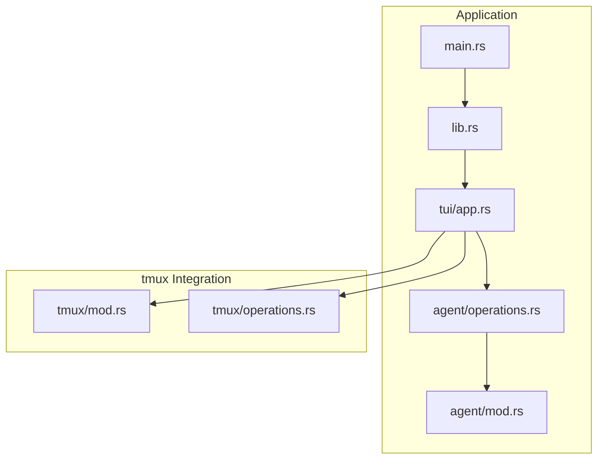
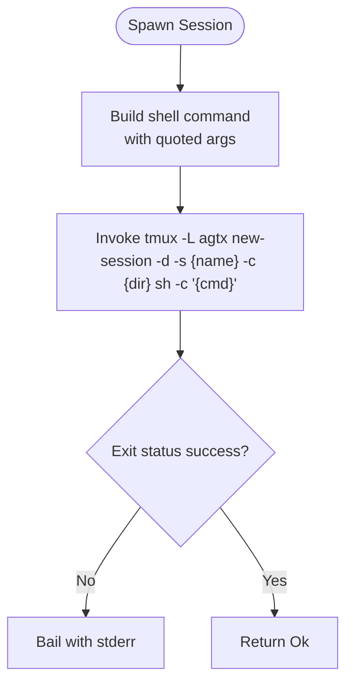
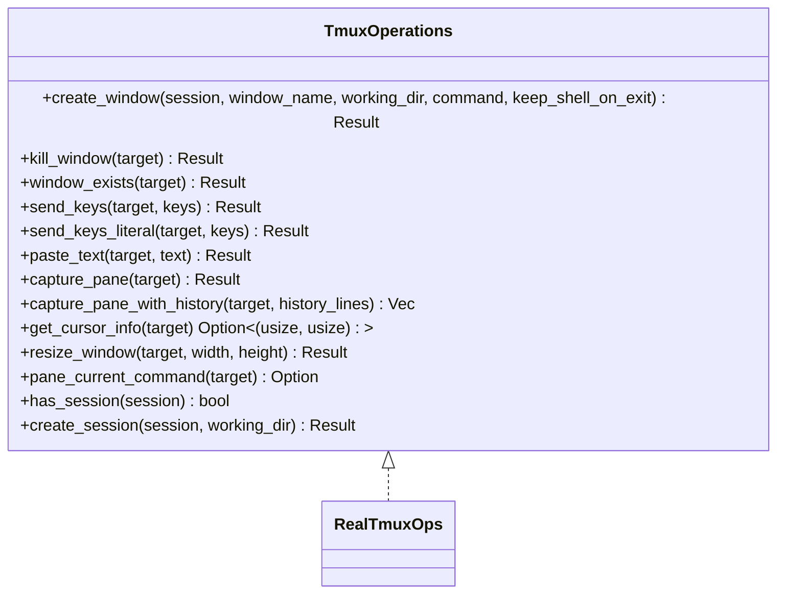
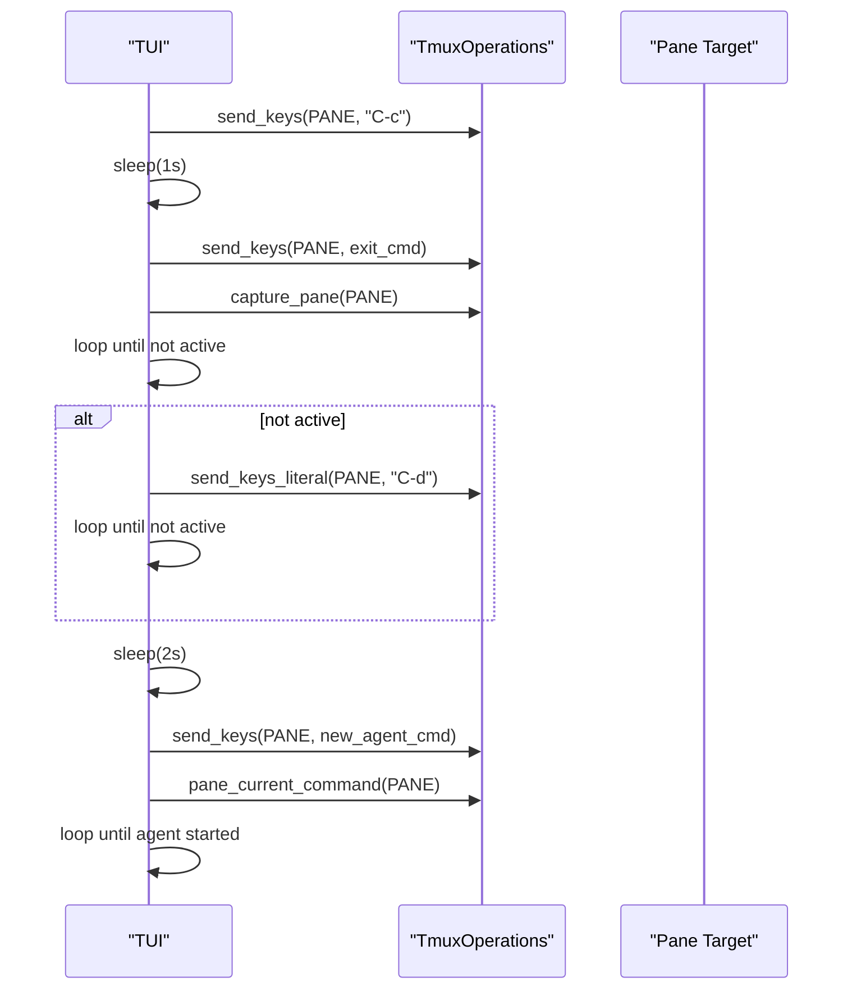
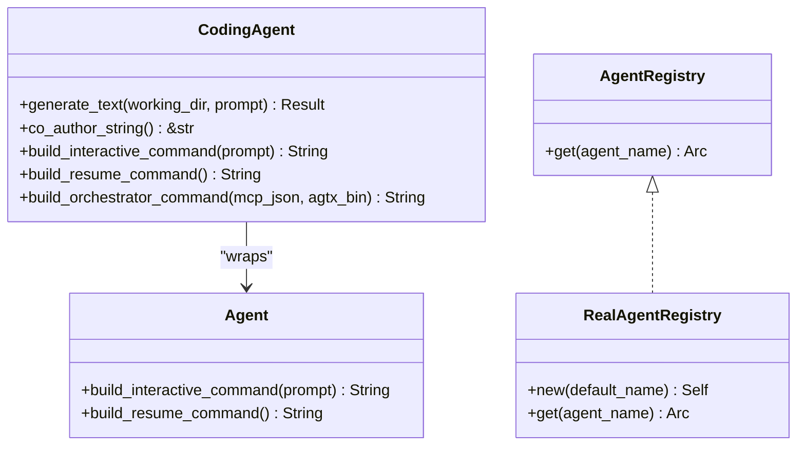
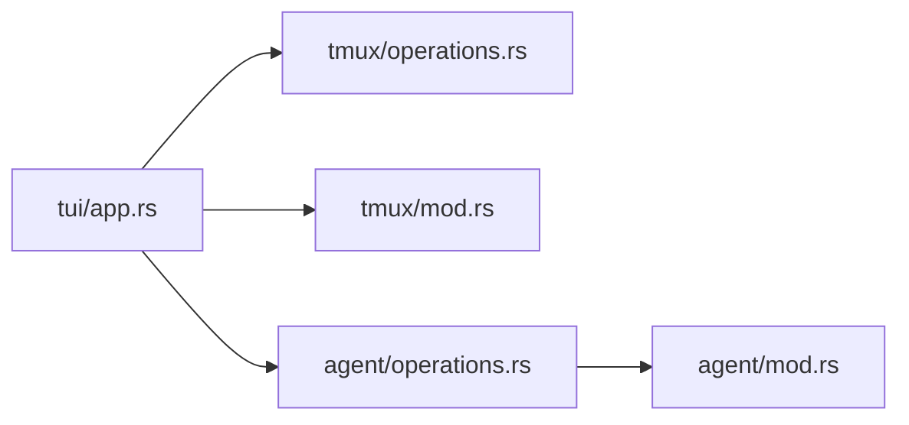

# Troubleshooting and Performance Optimization

<cite>
**Referenced Files in This Document**
- [mod.rs](file://src/tmux/mod.rs)
- [operations.rs](file://src/tmux/operations.rs)
- [app.rs](file://src/tui/app.rs)
- [app_tests.rs](file://src/tui/app_tests.rs)
- [agent.rs](file://src/agent/mod.rs)
- [operations.rs](file://src/agent/operations.rs)
- [lib.rs](file://src/lib.rs)
- [main.rs](file://src/main.rs)
</cite>

## Table of Contents
1. [Introduction](#introduction)
2. [Project Structure](#project-structure)
3. [Core Components](#core-components)
4. [Architecture Overview](#architecture-overview)
5. [Detailed Component Analysis](#detailed-component-analysis)
6. [Dependency Analysis](#dependency-analysis)
7. [Performance Considerations](#performance-considerations)
8. [Troubleshooting Guide](#troubleshooting-guide)
9. [Conclusion](#conclusion)
10. [Appendices](#appendices)

## Introduction
This document provides comprehensive troubleshooting and optimization guidance for AGTX’s tmux-based agent management system. It focuses on diagnosing and resolving tmux-related issues, optimizing performance for large-scale deployments, and establishing robust monitoring and recovery procedures. The content is grounded in the actual tmux integration code and TUI orchestration logic present in the repository.

## Project Structure
AGTX integrates tmux operations through a dedicated module with a traits-based design that supports both real tmux commands and test mocks. The TUI application orchestrates agent sessions, manages windows, and performs health checks and recovery actions.



**Diagram sources**
- [main.rs:1-228](file://src/main.rs#L1-L228)
- [lib.rs:1-24](file://src/lib.rs#L1-L24)
- [app.rs:1-800](file://src/tui/app.rs#L1-L800)
- [agent.rs:1-171](file://src/agent/mod.rs#L1-L171)
- [operations.rs:1-163](file://src/agent/operations.rs#L1-L163)
- [mod.rs:1-189](file://src/tmux/mod.rs#L1-L189)
- [operations.rs:1-249](file://src/tmux/operations.rs#L1-L249)

**Section sources**
- [main.rs:1-228](file://src/main.rs#L1-L228)
- [lib.rs:1-24](file://src/lib.rs#L1-L24)
- [app.rs:1-800](file://src/tui/app.rs#L1-L800)
- [mod.rs:1-189](file://src/tmux/mod.rs#L1-L189)
- [operations.rs:1-249](file://src/tmux/operations.rs#L1-L249)

## Core Components
- tmux module: Provides high-level functions for spawning sessions, listing sessions, capturing panes, sending keys, attaching, and killing sessions. It encapsulates tmux command invocations with server targeting and error handling.
- tmux operations trait: Defines a testable interface for tmux operations, with a real implementation that executes tmux commands and returns structured results.
- TUI orchestration: Uses tmux operations to manage agent sessions, windows, pane content capture, and recovery flows for stuck or corrupted agents.
- Agent integration: Builds interactive and resume commands for agents and exposes orchestrator command construction for supported agents.

Key responsibilities:
- Session lifecycle management (create, attach, kill)
- Pane inspection and content capture
- Command injection and paste operations
- Health checks and recovery procedures
- Agent command composition and orchestration

**Section sources**
- [mod.rs:14-166](file://src/tmux/mod.rs#L14-L166)
- [operations.rs:10-59](file://src/tmux/operations.rs#L10-L59)
- [operations.rs:64-248](file://src/tmux/operations.rs#L64-L248)
- [app.rs:744-759](file://src/tui/app.rs#L744-L759)
- [agent.rs:36-77](file://src/agent/mod.rs#L36-L77)
- [operations.rs:55-108](file://src/agent/operations.rs#L55-L108)

## Architecture Overview
The tmux integration follows a layered design:
- Application entry initializes the TUI and injects tmux operations.
- The TUI orchestrates tasks, creates tmux windows/sessions, and monitors pane activity.
- tmux operations are executed via tmux CLI with a dedicated server name.
- Recovery routines detect agent readiness, send exit commands, and restart agents when necessary.

```mermaid
sequenceDiagram
participant App as "TUI App"
participant Ops as "TmuxOperations"
participant Tmux as "tmux CLI"
participant Agent as "Agent Process"
App->>Ops : create_window(session, window, dir, command, keep_shell)
Ops->>Tmux : new-window -d -t {session} : -n {window} -c {dir} [sh -c "{command}"]
Tmux-->>Ops : status
Ops-->>App : Result
App->>Ops : send_keys(target, keys)
Ops->>Tmux : send-keys -t {target} {keys}; send-keys -t {target} Enter
Tmux-->>Ops : status
Ops-->>App : Result
App->>Ops : capture_pane(target)
Ops->>Tmux : capture-pane -t {target} -p -S -N
Tmux-->>Ops : stdout
Ops-->>App : content
App->>Ops : pane_current_command(target)
Ops->>Tmux : display -p -t {target} "#{pane_current_command}"
Tmux-->>Ops : stdout
Ops-->>App : command
```

**Diagram sources**
- [operations.rs:64-248](file://src/tmux/operations.rs#L64-L248)
- [app.rs:5925-5950](file://src/tui/app.rs#L5925-L5950)
- [app.rs:8460-8738](file://src/tui/app.rs#L8460-L8738)

**Section sources**
- [operations.rs:64-248](file://src/tmux/operations.rs#L64-L248)
- [app.rs:5925-5950](file://src/tui/app.rs#L5925-L5950)
- [app.rs:8460-8738](file://src/tui/app.rs#L8460-L8738)

## Detailed Component Analysis

### tmux Module Functions
- Session creation and lifecycle:
  - Spawn a new session with a working directory and agent command.
  - List sessions with activity and creation timestamps.
  - Check existence of a session.
  - Kill a session.
  - Attach to a session.
- Pane operations:
  - Capture pane content with configurable line count.
  - Send keys with implicit Enter.
- Utilities:
  - Sanitize session names for safe tmux identifiers.



**Diagram sources**
- [mod.rs:15-48](file://src/tmux/mod.rs#L15-L48)

**Section sources**
- [mod.rs:15-166](file://src/tmux/mod.rs#L15-L166)

### tmux Operations Trait and Real Implementation
- The trait abstracts tmux operations for testability and enables mocking.
- Real implementation executes tmux commands with the dedicated server name and returns structured results or errors.
- Notable operations include:
  - Window creation with optional shell retention on exit.
  - Pane content capture with and without history.
  - Cursor info retrieval and window resizing.
  - Current pane command detection.
  - Session existence checks and creation.



**Diagram sources**
- [operations.rs:10-59](file://src/tmux/operations.rs#L10-L59)
- [operations.rs:64-248](file://src/tmux/operations.rs#L64-L248)

**Section sources**
- [operations.rs:10-59](file://src/tmux/operations.rs#L10-L59)
- [operations.rs:64-248](file://src/tmux/operations.rs#L64-L248)

### TUI Orchestration and Recovery Procedures
- The TUI uses tmux operations to:
  - Detect orchestrator readiness and resize panes.
  - Capture pane content with history for UI rendering.
  - Manage agent lifecycle transitions and recovery.
- Recovery logic includes:
  - Sending cancellation and exit commands.
  - Waiting for agent termination.
  - Force-terminating with Ctrl+D if necessary.
  - Re-sending the new agent command after a stabilization delay.



**Diagram sources**
- [app.rs:8460-8738](file://src/tui/app.rs#L8460-L8738)

**Section sources**
- [app.rs:5925-5950](file://src/tui/app.rs#L5925-L5950)
- [app.rs:8460-8738](file://src/tui/app.rs#L8460-L8738)

### Agent Integration and Command Construction
- Agent commands are constructed for interactive and resume modes.
- Orchestrator command composition wraps agent launch with MCP registration steps for supported agents.
- The agent registry provides a default fallback and maps agent names to operations.



**Diagram sources**
- [agent.rs:10-171](file://src/agent/mod.rs#L10-L171)
- [operations.rs:44-163](file://src/agent/operations.rs#L44-L163)

**Section sources**
- [agent.rs:36-77](file://src/agent/mod.rs#L36-L77)
- [operations.rs:55-108](file://src/agent/operations.rs#L55-L108)
- [operations.rs:110-163](file://src/agent/operations.rs#L110-L163)

## Dependency Analysis
- The TUI depends on the tmux operations trait, enabling injection of mocks for testing.
- The tmux module and operations share a constant server name for isolation.
- Agent operations depend on agent definitions and build commands tailored to each agent.



**Diagram sources**
- [app.rs:744-759](file://src/tui/app.rs#L744-L759)
- [operations.rs:10-59](file://src/tmux/operations.rs#L10-L59)
- [mod.rs:11-12](file://src/tmux/mod.rs#L11-L12)
- [operations.rs:14-108](file://src/agent/operations.rs#L14-L108)

**Section sources**
- [app.rs:744-759](file://src/tui/app.rs#L744-L759)
- [operations.rs:10-59](file://src/tmux/operations.rs#L10-L59)
- [mod.rs:11-12](file://src/tmux/mod.rs#L11-L12)
- [operations.rs:14-108](file://src/agent/operations.rs#L14-L108)

## Performance Considerations
- Session isolation: Using a dedicated tmux server name prevents interference from user sessions and reduces conflicts.
- Minimal command overhead: Prefer batched operations and avoid unnecessary pane captures.
- History capture limits: Use bounded history capture for UI rendering to reduce memory usage.
- Window sizing: Dynamically resize panes to fit terminal constraints and avoid excessive scrolling.
- Agent startup delays: Introduce small delays after shell initialization before sending commands to prevent premature command injection.
- Scaling patterns:
  - Pooling: Reuse sessions and windows for similar tasks to minimize spawn overhead.
  - Parallelism: Use asynchronous operations for pane capture and status polling.
  - Resource caps: Monitor system resources and limit concurrent agent sessions to avoid contention.

[No sources needed since this section provides general guidance]

## Troubleshooting Guide

### Step-by-step Diagnostics
- Verify tmux server connectivity:
  - Confirm the dedicated server exists and responds to queries.
  - List sessions and check for activity timestamps.
  - Validate session existence before attempting operations.
- Inspect pane content:
  - Capture recent pane output to diagnose command execution failures.
  - Use history capture for deeper inspection when needed.
- Check agent readiness:
  - Poll current pane command to distinguish between shell and agent processes.
  - Wait for agent startup completion before sending further commands.

**Section sources**
- [mod.rs:51-95](file://src/tmux/mod.rs#L51-L95)
- [operations.rs:166-229](file://src/tmux/operations.rs#L166-L229)
- [app.rs:8460-8738](file://src/tui/app.rs#L8460-L8738)

### Resolving tmux Server Connectivity Issues
- Symptoms: Commands fail with “failed to list sessions” or “failed to spawn session.”
- Actions:
  - Ensure the tmux binary is available and executable.
  - Verify the dedicated server name is consistent across operations.
  - Check for permission issues or conflicting tmux instances.
  - Restart the tmux server if necessary and reinitialize sessions.

**Section sources**
- [mod.rs:51-95](file://src/tmux/mod.rs#L51-L95)
- [operations.rs:231-247](file://src/tmux/operations.rs#L231-L247)

### Handling Session Permission Errors
- Symptoms: “Permission denied” or “has-session failed.”
- Actions:
  - Validate user permissions for the tmux socket and server directory.
  - Run under the same user context that owns the target tmux server.
  - Avoid mixing privileged and unprivileged tmux usage.

**Section sources**
- [mod.rs:42-45](file://src/tmux/mod.rs#L42-L45)
- [operations.rs:90-107](file://src/tmux/operations.rs#L90-L107)

### Fixing Command Execution Failures
- Symptoms: Pane remains at shell prompt or agent does not start.
- Actions:
  - Send explicit exit commands and wait for shell readiness.
  - Force-terminate with Ctrl+D if needed and re-send the agent command.
  - Add a stabilization delay after shell initialization before sending commands.

**Section sources**
- [app.rs:8460-8738](file://src/tui/app.rs#L8460-L8738)

### Managing Resource Exhaustion Scenarios
- Symptoms: Slow response, high CPU/memory usage, or session crashes.
- Actions:
  - Limit concurrent sessions and implement backpressure.
  - Use history capture bounds to control memory footprint.
  - Periodically clean up inactive sessions and windows.
  - Monitor system resources and scale horizontally if needed.

**Section sources**
- [operations.rs:174-182](file://src/tmux/operations.rs#L174-L182)
- [app.rs:5925-5950](file://src/tui/app.rs#L5925-L5950)

### Platform-Specific Issues and Compatibility
- tmux version compatibility:
  - Ensure tmux supports required flags (e.g., display format, capture-pane options).
  - Validate behavior differences across platforms (Linux vs macOS).
- Environment variables:
  - Confirm PATH includes tmux and agent binaries.
  - Verify HOME and user-specific tmux directories are writable.

**Section sources**
- [operations.rs:73-86](file://src/tmux/operations.rs#L73-L86)
- [operations.rs:174-182](file://src/tmux/operations.rs#L174-L182)

### Configuration Recommendations
- Dedicated tmux server:
  - Use the predefined server name consistently across the application.
- Session naming:
  - Sanitize project names to avoid invalid tmux identifiers.
- Logging and monitoring:
  - Log tmux command invocations and outcomes for diagnostics.
  - Track session activity and pane content changes for anomaly detection.

**Section sources**
- [mod.rs:11-12](file://src/tmux/mod.rs#L11-L12)
- [mod.rs:148-166](file://src/tmux/mod.rs#L148-L166)

### Monitoring Best Practices and Automated Health Checks
- Health checks:
  - Periodically poll pane current command and pane content hashes.
  - Detect stuck tasks by comparing content hashes over time.
- Automated recovery:
  - Implement retries for transient failures.
  - Trigger recovery flows when agents become unresponsive.

**Section sources**
- [app.rs:524-531](file://src/tui/app.rs#L524-L531)
- [app.rs:8460-8738](file://src/tui/app.rs#L8460-L8738)

### Recovery Procedures
- Corrupted sessions:
  - Kill problematic windows/sessions and recreate them.
  - Reinitialize agent processes with sanitized commands.
- Stuck agents:
  - Use cancellation and exit commands, then force-terminate if necessary.
  - Re-send the agent command after stabilization.
- System resource constraints:
  - Reduce concurrency and prune inactive sessions.
  - Monitor resource usage and scale down until stability is restored.

**Section sources**
- [mod.rs:133-142](file://src/tmux/mod.rs#L133-L142)
- [app.rs:8460-8738](file://src/tui/app.rs#L8460-L8738)

## Conclusion
AGTX’s tmux integration provides a robust foundation for managing autonomous agent sessions with clear separation of concerns via a traits-based design. By following the diagnostic procedures, applying the optimization strategies, and implementing the recommended monitoring and recovery practices, teams can operate reliably at scale while minimizing downtime and resource contention.

[No sources needed since this section summarizes without analyzing specific files]

## Appendices

### Appendix A: Key tmux Operation Reference
- Server targeting: All operations target the dedicated server name.
- Session operations: Spawn, list, exists, attach, kill.
- Pane operations: Capture pane content and send keys.
- Window operations: Create, kill, exists, resize, current command.

**Section sources**
- [mod.rs:11-12](file://src/tmux/mod.rs#L11-L12)
- [mod.rs:15-166](file://src/tmux/mod.rs#L15-L166)
- [operations.rs:64-248](file://src/tmux/operations.rs#L64-L248)