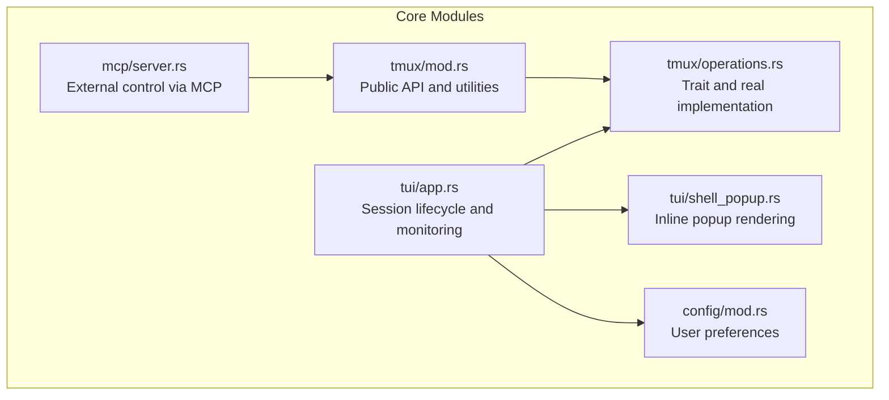
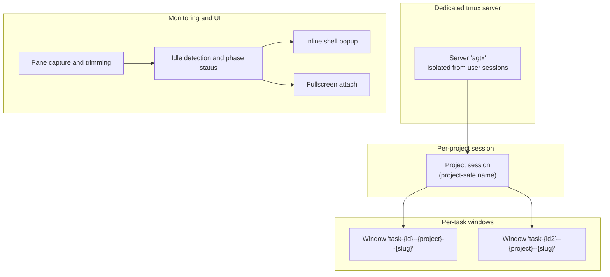
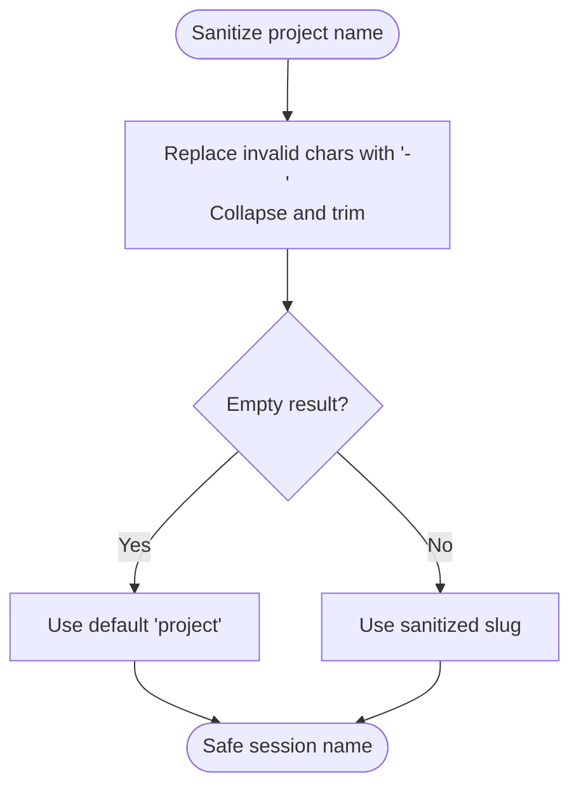
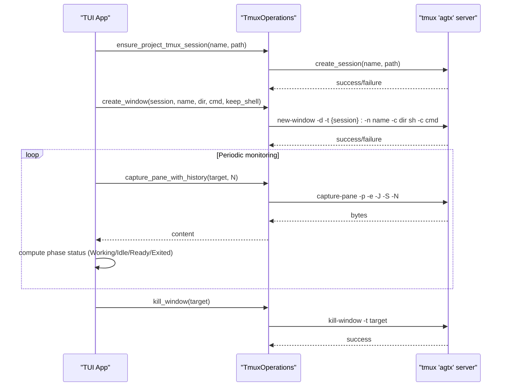
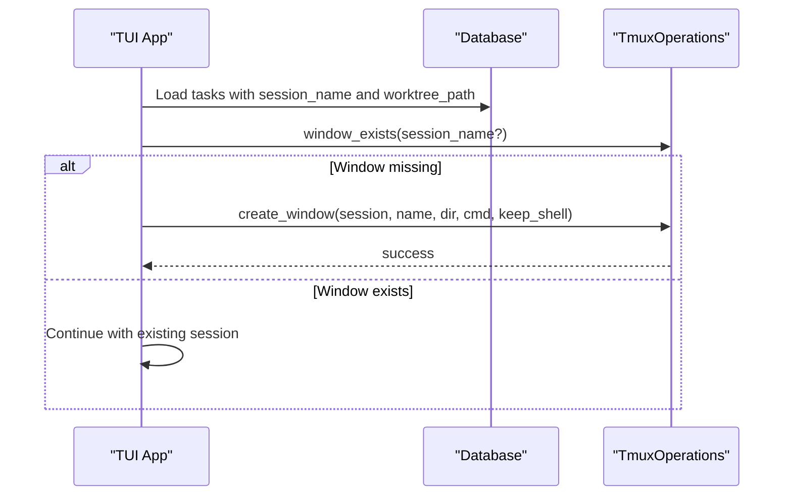
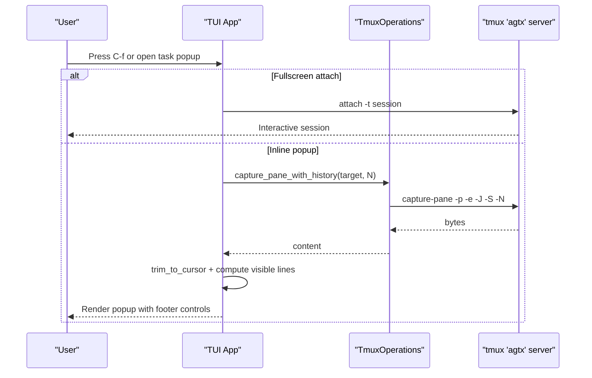
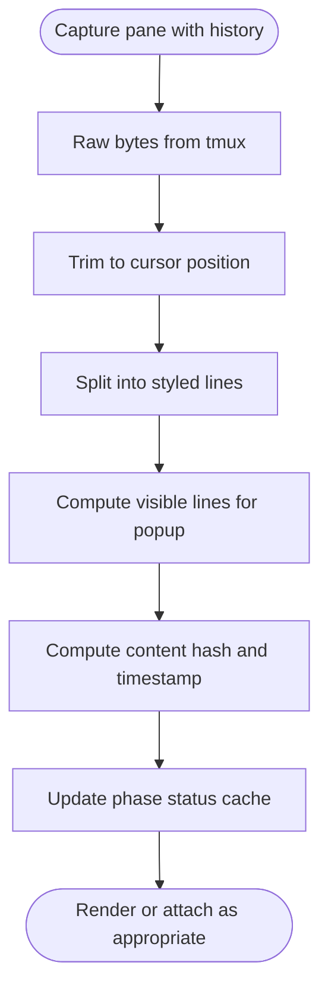
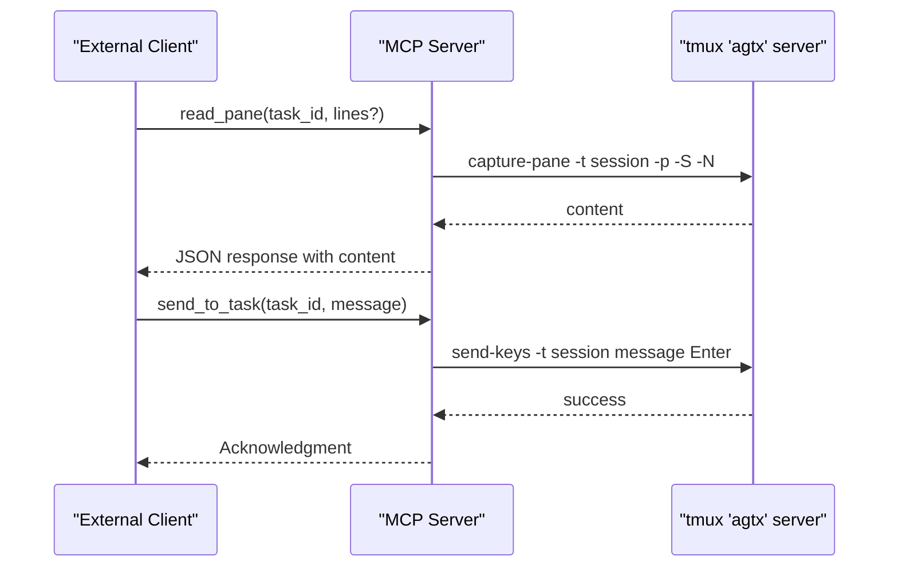
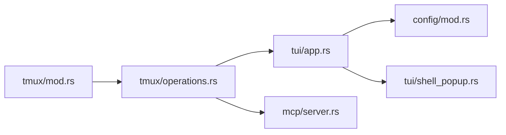

# tmux Integration

<cite>
**Referenced Files in This Document**
- [src/tmux/mod.rs](file://src/tmux/mod.rs)
- [src/tmux/operations.rs](file://src/tmux/operations.rs)
- [src/tui/app.rs](file://src/tui/app.rs)
- [src/tui/shell_popup.rs](file://src/tui/shell_popup.rs)
- [src/mcp/server.rs](file://src/mcp/server.rs)
- [src/config/mod.rs](file://src/config/mod.rs)
- [src/lib.rs](file://src/lib.rs)
- [src/main.rs](file://src/main.rs)
</cite>

## Table of Contents
1. [Introduction](#introduction)
2. [Project Structure](#project-structure)
3. [Core Components](#core-components)
4. [Architecture Overview](#architecture-overview)
5. [Detailed Component Analysis](#detailed-component-analysis)
6. [Dependency Analysis](#dependency-analysis)
7. [Performance Considerations](#performance-considerations)
8. [Troubleshooting Guide](#troubleshooting-guide)
9. [Security Considerations](#security-considerations)
10. [Customization and Integration](#customization-and-integration)
11. [Conclusion](#conclusion)

## Introduction
This document explains the tmux integration that powers agent sessions in the application. It covers the dedicated tmux server architecture, per-project sessions, per-task windows, session lifecycle management, persistent agent workflows, fullscreen attachment, inline task popups, pane capture and monitoring, configuration best practices, performance optimization, troubleshooting, security considerations, and integration guidance.

## Project Structure
The tmux integration is implemented across several modules:
- Low-level tmux operations and utilities
- A trait-based abstraction enabling testability and runtime substitution
- TUI integration for session management, monitoring, and user interaction
- MCP server integration for external control and inspection
- Configuration options affecting tmux behavior

**Diagram sources**
- [src/tmux/mod.rs:1-189](file://src/tmux/mod.rs#L1-L189)
- [src/tmux/operations.rs:1-249](file://src/tmux/operations.rs#L1-L249)
- [src/tui/app.rs:1-120](file://src/tui/app.rs#L1-L120)
- [src/tui/shell_popup.rs:1-326](file://src/tui/shell_popup.rs#L1-L326)
- [src/mcp/server.rs:108-959](file://src/mcp/server.rs#L108-L959)
- [src/config/mod.rs:23-35](file://src/config/mod.rs#L23-L35)

**Section sources**
- [src/lib.rs:1-24](file://src/lib.rs#L1-L24)
- [src/main.rs:16-96](file://src/main.rs#L16-L96)

## Core Components
- Dedicated tmux server: All agent sessions run under a named server to isolate them from user sessions.
- Per-project tmux session: A top-level session groups all tasks for a project.
- Per-task tmux windows: Each task runs in its own window within the project session.
- Persistent agent context: Sessions persist across task lifecycle transitions, enabling seamless agent switching and continuity.
- Inline task popup: An embedded TUI popup displays live pane content with scrolling and cursor-aware trimming.
- Fullscreen attachment: Users can attach directly to a task’s tmux session for uninterrupted interaction.
- Pane capture and monitoring: Continuous capture of pane content drives idle detection and phase readiness checks.

**Section sources**
- [src/tmux/mod.rs:11-189](file://src/tmux/mod.rs#L11-L189)
- [src/tmux/operations.rs:10-249](file://src/tmux/operations.rs#L10-L249)
- [src/tui/app.rs:6831-6890](file://src/tui/app.rs#L6831-L6890)
- [src/tui/shell_popup.rs:1-326](file://src/tui/shell_popup.rs#L1-L326)
- [src/config/mod.rs:23-35](file://src/config/mod.rs#L23-L35)

## Architecture Overview
The tmux integration centers on a dedicated server and a layered approach to session management and monitoring.

**Diagram sources**
- [src/tmux/mod.rs:11-189](file://src/tmux/mod.rs#L11-L189)
- [src/tui/app.rs:6831-6890](file://src/tui/app.rs#L6831-L6890)
- [src/tui/shell_popup.rs:132-211](file://src/tui/shell_popup.rs#L132-L211)

## Detailed Component Analysis

### tmux Server and Naming Conventions
- Dedicated server: All agent sessions are created and managed under a fixed server name to prevent interference with user tmux sessions.
- Safe project names: Project names are sanitized to produce valid tmux session names.
- Session naming scheme: Windows use a structured naming convention encoding task ID, project, and slug, enabling parsing and recovery.

**Diagram sources**
- [src/tmux/mod.rs:144-166](file://src/tmux/mod.rs#L144-L166)

**Section sources**
- [src/tmux/mod.rs:11-189](file://src/tmux/mod.rs#L11-L189)

### Session Lifecycle Management
Lifecycle from creation to completion and cleanup:
- Ensure project session exists at startup and during task setup.
- Recover missing task windows after tmux restarts or manual kills.
- Monitor pane content to detect phase completion and idle states.
- Clean up transition requests and other artifacts post-completion.

**Diagram sources**
- [src/tui/app.rs:816-820](file://src/tui/app.rs#L816-L820)
- [src/tui/app.rs:909-943](file://src/tui/app.rs#L909-L943)
- [src/tui/app.rs:7334-7350](file://src/tui/app.rs#L7334-L7350)
- [src/tmux/operations.rs:64-110](file://src/tmux/operations.rs#L64-L110)
- [src/tmux/operations.rs:174-182](file://src/tmux/operations.rs#L174-L182)

**Section sources**
- [src/tui/app.rs:816-820](file://src/tui/app.rs#L816-L820)
- [src/tui/app.rs:909-943](file://src/tui/app.rs#L909-L943)
- [src/tui/app.rs:6831-6890](file://src/tui/app.rs#L6831-L6890)
- [src/tui/app.rs:7334-7350](file://src/tui/app.rs#L7334-L7350)
- [src/tmux/operations.rs:64-110](file://src/tmux/operations.rs#L64-L110)
- [src/tmux/operations.rs:174-182](file://src/tmux/operations.rs#L174-L182)

### Persistent Agent Workflows and Seamless Switching
- Persistent context: Agent sessions remain alive across phase transitions, preserving state and logs.
- Recovery: On startup, the app detects missing task windows and recreates them using stored metadata.
- Orchestrator persistence: An orchestrator session can be re-detected and re-attached to maintain continuous supervision.

**Diagram sources**
- [src/tui/app.rs:909-943](file://src/tui/app.rs#L909-L943)
- [src/tui/app.rs:6845-6868](file://src/tui/app.rs#L6845-L6868)
- [src/tmux/operations.rs:112-126](file://src/tmux/operations.rs#L112-L126)

**Section sources**
- [src/tui/app.rs:909-943](file://src/tui/app.rs#L909-L943)
- [src/tui/app.rs:6845-6868](file://src/tui/app.rs#L6845-L6868)

### Fullscreen Attachment and Inline Task Popup
- Fullscreen attachment: Users can attach directly to a task’s tmux session for uninterrupted interaction.
- Inline popup: When not fullscreen-attaching, the TUI renders a popup containing recent pane content with scrolling and cursor-aware trimming.

**Diagram sources**
- [src/tui/app.rs:1168-1174](file://src/tui/app.rs#L1168-L1174)
- [src/tui/shell_popup.rs:132-211](file://src/tui/shell_popup.rs#L132-L211)
- [src/tmux/operations.rs:174-182](file://src/tmux/operations.rs#L174-L182)
- [src/tmux/mod.rs:120-131](file://src/tmux/mod.rs#L120-L131)

**Section sources**
- [src/tui/app.rs:1168-1174](file://src/tui/app.rs#L1168-L1174)
- [src/tui/shell_popup.rs:132-211](file://src/tui/shell_popup.rs#L132-L211)
- [src/tmux/mod.rs:120-131](file://src/tmux/mod.rs#L120-L131)

### Pane Capture and Monitoring System
- Capture pane content with history for robust analysis.
- Trim content to cursor position to avoid capturing empty buffer space.
- Compute visible lines for efficient rendering in the popup.
- Track content hashes and timestamps to detect idle and readiness.

**Diagram sources**
- [src/tui/shell_popup.rs:132-211](file://src/tui/shell_popup.rs#L132-L211)
- [src/tui/app.rs:7334-7350](file://src/tui/app.rs#L7334-L7350)

**Section sources**
- [src/tui/shell_popup.rs:132-211](file://src/tui/shell_popup.rs#L132-L211)
- [src/tui/app.rs:7334-7350](file://src/tui/app.rs#L7334-L7350)

### MCP Integration for External Control
- Read pane content: Retrieve recent pane output for diagnostics or automation.
- Send to task: Inject keystrokes into a task’s agent pane to guide or nudge the agent.

**Diagram sources**
- [src/mcp/server.rs:108-959](file://src/mcp/server.rs#L108-L959)

**Section sources**
- [src/mcp/server.rs:108-959](file://src/mcp/server.rs#L108-L959)

## Dependency Analysis
The tmux integration relies on a clean separation of concerns:
- Public API module exposes high-level functions for spawning, listing, attaching, and killing sessions.
- Operations trait abstracts tmux commands for testability and runtime substitution.
- TUI module orchestrates lifecycle, monitoring, and user interaction.
- MCP module provides external control and inspection.
- Configuration module influences behavior such as fullscreen-on-enter.

**Diagram sources**
- [src/tmux/mod.rs:1-189](file://src/tmux/mod.rs#L1-L189)
- [src/tmux/operations.rs:1-249](file://src/tmux/operations.rs#L1-L249)
- [src/tui/app.rs:1-120](file://src/tui/app.rs#L1-L120)
- [src/tui/shell_popup.rs:1-326](file://src/tui/shell_popup.rs#L1-L326)
- [src/mcp/server.rs:108-959](file://src/mcp/server.rs#L108-L959)
- [src/config/mod.rs:23-35](file://src/config/mod.rs#L23-L35)

**Section sources**
- [src/tmux/mod.rs:1-189](file://src/tmux/mod.rs#L1-L189)
- [src/tmux/operations.rs:1-249](file://src/tmux/operations.rs#L1-L249)
- [src/tui/app.rs:1-120](file://src/tui/app.rs#L1-L120)
- [src/tui/shell_popup.rs:1-326](file://src/tui/shell_popup.rs#L1-L326)
- [src/mcp/server.rs:108-959](file://src/mcp/server.rs#L108-L959)
- [src/config/mod.rs:23-35](file://src/config/mod.rs#L23-L35)

## Performance Considerations
- Minimize tmux invocations: Batch operations and reuse captured content when possible.
- Limit pane capture size: Use reasonable history limits to balance observability and performance.
- Efficient trimming: Trim to cursor and trailing empty lines to reduce rendering overhead.
- Non-blocking monitoring: Use background threads or channels for periodic pane capture and status updates.
- Window reuse: Prefer reusing existing windows to avoid frequent creation/destruction overhead.

## Troubleshooting Guide
Common issues and resolutions:
- tmux server not running: Ensure the dedicated server is started before operations. The public API checks for server existence implicitly through command responses.
- Session/window missing: The app recovers missing windows on startup by checking existing tasks and recreating windows as needed.
- Permission errors: Verify the user has permission to create and manage sessions on the dedicated server.
- Argument quoting failures: The spawn function properly escapes arguments; verify agent commands and arguments passed to it.
- MCP send_to_task failures: Confirm the task is in an active phase and has an associated session name.

**Section sources**
- [src/tui/app.rs:909-943](file://src/tui/app.rs#L909-L943)
- [src/mcp/server.rs:912-959](file://src/mcp/server.rs#L912-L959)

## Security Considerations
- Isolation: Use the dedicated server to prevent interference with user sessions and limit blast radius.
- Credential handling: Avoid embedding secrets in agent commands or pane content. If credentials are required, pass them via secure environment variables or configuration files with restricted permissions.
- Input sanitization: The spawn function escapes arguments to prevent shell injection; ensure external inputs are validated before constructing commands.
- Access control: Restrict who can attach to sessions or send keystrokes. Consider gating access through MCP with authentication and authorization.

## Customization and Integration
- Configuration options:
  - fullscreen_on_enter: Controls whether opening a task defaults to fullscreen attach or inline popup.
- Integration patterns:
  - External tools can use MCP endpoints to read pane content or send keystrokes to agent panes.
  - The operations trait allows substituting mock implementations for testing or alternate backends.
- Best practices:
  - Keep agent commands deterministic and idempotent where possible.
  - Use structured logging in agent panes to facilitate pane capture and monitoring.
  - Employ consistent naming conventions for sessions and windows to simplify recovery and automation.

**Section sources**
- [src/config/mod.rs:23-35](file://src/config/mod.rs#L23-L35)
- [src/mcp/server.rs:108-959](file://src/mcp/server.rs#L108-L959)
- [src/tmux/operations.rs:1-249](file://src/tmux/operations.rs#L1-249)

## Conclusion
The tmux integration provides a robust, persistent, and observable environment for agent-driven workflows. By isolating sessions on a dedicated server, structuring per-project and per-task sessions, and combining continuous pane monitoring with flexible UI modes, the system supports seamless agent switching, reliable lifecycle management, and powerful external control via MCP.