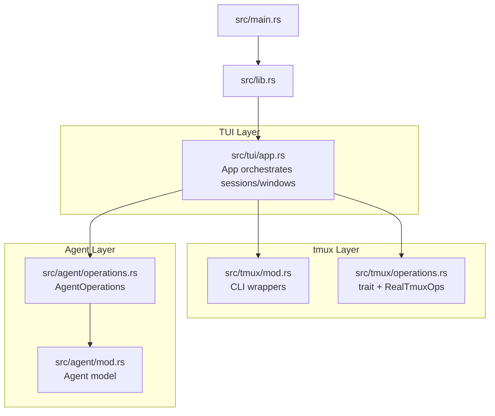
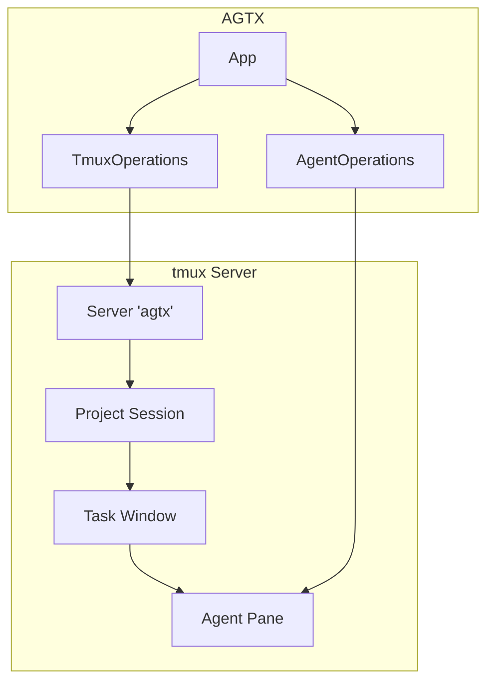
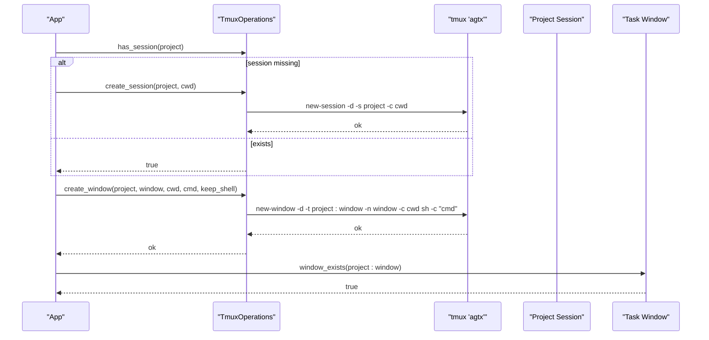
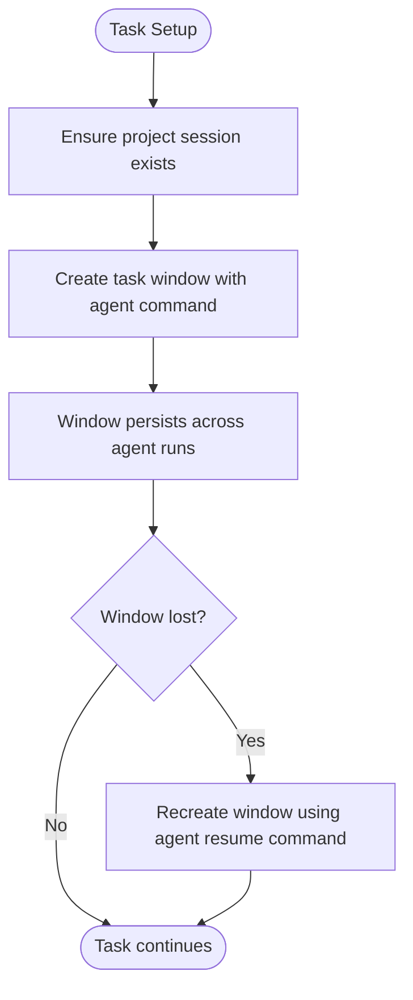
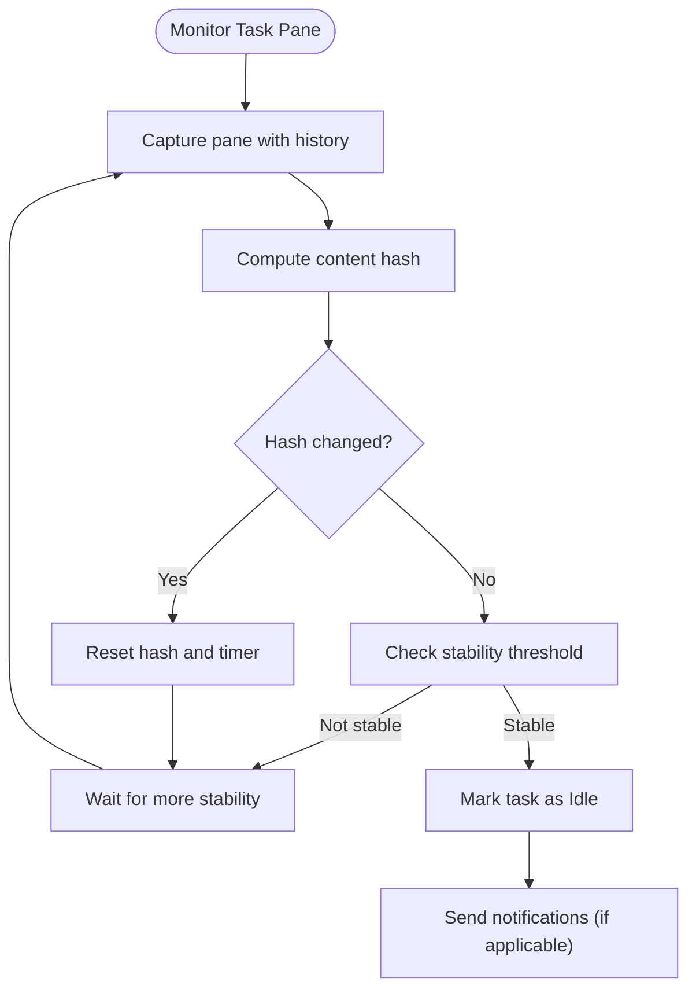
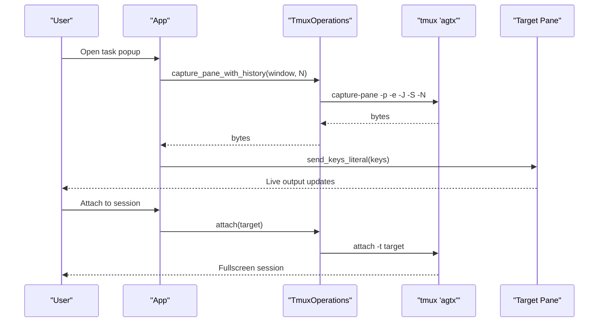
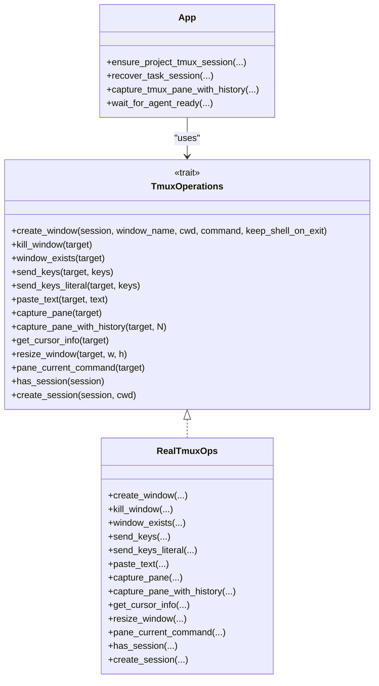

# tmux Integration

<cite>
**Referenced Files in This Document**
- [mod.rs](file://src/tmux/mod.rs)
- [operations.rs](file://src/tmux/operations.rs)
- [app.rs](file://src/tui/app.rs)
- [agent.rs](file://src/agent/mod.rs)
- [operations.rs](file://src/agent/operations.rs)
- [lib.rs](file://src/lib.rs)
- [main.rs](file://src/main.rs)
</cite>

## Table of Contents
1. [Introduction](#introduction)
2. [Project Structure](#project-structure)
3. [Core Components](#core-components)
4. [Architecture Overview](#architecture-overview)
5. [Detailed Component Analysis](#detailed-component-analysis)
6. [Dependency Analysis](#dependency-analysis)
7. [Performance Considerations](#performance-considerations)
8. [Troubleshooting Guide](#troubleshooting-guide)
9. [Conclusion](#conclusion)

## Introduction
This document explains how AGTX integrates with tmux to manage persistent, isolated agent sessions for development tasks. It covers the dedicated tmux server architecture, session and window management, agent pane monitoring, and practical workflows for interacting with agent sessions. It also provides configuration guidance and troubleshooting advice for tmux-related operations.

## Project Structure
AGTX organizes tmux integration into focused modules:
- A low-level tmux module that wraps tmux CLI invocations for session/window/pane operations.
- An injectable operations trait for tmux to support testing and alternate backends.
- A TUI application layer that orchestrates project sessions, task windows, agent startup, and pane monitoring.
- Agent integration that builds agent-specific commands and resumes sessions after tmux restarts.

**Diagram sources**
- [mod.rs:1-189](file://src/tmux/mod.rs#L1-L189)
- [operations.rs:1-249](file://src/tmux/operations.rs#L1-L249)
- [app.rs:1-120](file://src/tui/app.rs#L1-L120)
- [agent.rs:1-171](file://src/agent/mod.rs#L1-L171)
- [operations.rs:1-163](file://src/agent/operations.rs#L1-L163)
- [lib.rs:1-24](file://src/lib.rs#L1-L24)
- [main.rs:1-96](file://src/main.rs#L1-L96)

**Section sources**
- [mod.rs:1-189](file://src/tmux/mod.rs#L1-L189)
- [operations.rs:1-249](file://src/tmux/operations.rs#L1-L249)
- [app.rs:1-120](file://src/tui/app.rs#L1-L120)
- [agent.rs:1-171](file://src/agent/mod.rs#L1-L171)
- [operations.rs:1-163](file://src/agent/operations.rs#L1-L163)
- [lib.rs:1-24](file://src/lib.rs#L1-L24)
- [main.rs:1-96](file://src/main.rs#L1-L96)

## Core Components
- Dedicated tmux server: AGTX uses a named server to isolate agent sessions from the user’s default tmux environment.
- Session naming: Projects are mapped to tmux sessions; tasks become tmux windows within those sessions.
- Window lifecycle: Windows are created per task with working directories set to task worktrees; they persist across agent restarts.
- Pane monitoring: Content hashing and cursor-aware capture power real-time UI updates and idle detection.
- Agent integration: Agents are launched with project-appropriate commands; sessions can be resumed after tmux server restarts.

**Section sources**
- [mod.rs:11-188](file://src/tmux/mod.rs#L11-L188)
- [operations.rs:8-59](file://src/tmux/operations.rs#L8-L59)
- [app.rs:6525-6571](file://src/tui/app.rs#L6525-L6571)
- [agent.rs:10-77](file://src/agent/mod.rs#L10-L77)
- [operations.rs:44-108](file://src/agent/operations.rs#L44-L108)

## Architecture Overview
The tmux integration centers on a single server for agent sessions, with project-level sessions and task-level windows. The TUI ensures the project session exists, creates task windows, monitors pane activity, and recovers sessions when needed.

**Diagram sources**
- [mod.rs:11-188](file://src/tmux/mod.rs#L11-L188)
- [operations.rs:61-248](file://src/tmux/operations.rs#L61-L248)
- [app.rs:6525-6571](file://src/tui/app.rs#L6525-L6571)
- [operations.rs:55-108](file://src/agent/operations.rs#L55-L108)

## Detailed Component Analysis

### tmux Server and Session Management
- Server name: All agent sessions run under a dedicated server named for AGTX.
- Project sessions: On project load, the application ensures a project-level session exists; if missing, it is created.
- Task windows: Each task gets a window within the project session, with the window name derived from the task and project identifiers.
- Recovery: If a task window disappears (server restart, manual kill), the application can recreate it using the agent’s resume command.

**Diagram sources**
- [app.rs:6525-6534](file://src/tui/app.rs#L6525-L6534)
- [operations.rs:61-110](file://src/tmux/operations.rs#L61-L110)
- [mod.rs:233-247](file://src/tmux/mod.rs#L233-L247)

**Section sources**
- [mod.rs:11-188](file://src/tmux/mod.rs#L11-L188)
- [operations.rs:61-110](file://src/tmux/operations.rs#L61-L110)
- [app.rs:6525-6571](file://src/tui/app.rs#L6525-L6571)

### Task Windows and Persistent Sessions
- Window naming: Windows are created per task; the application ensures the project session exists before creating windows.
- Working directories: Windows are initialized with the task’s worktree path.
- Resume capability: When a task window is missing, the application can recreate it using the agent’s resume command, preserving the task’s context.

**Diagram sources**
- [app.rs:6539-6571](file://src/tui/app.rs#L6539-L6571)
- [operations.rs:61-110](file://src/tmux/operations.rs#L61-L110)
- [agent.rs:36-48](file://src/agent/mod.rs#L36-L48)

**Section sources**
- [app.rs:6539-6571](file://src/tui/app.rs#L6539-L6571)
- [agent.rs:36-48](file://src/agent/mod.rs#L36-L48)

### Agent Pane Monitoring and Idle Detection
- Real-time pane capture: The UI captures pane content with history and trims to the cursor position to avoid rendering unused buffer.
- Content hashing: The application hashes pane content to detect when it stabilizes, indicating potential idleness.
- Readiness gating: Before sending prompts or skills, the application waits for the agent to reach a ready state using either explicit indicators or content stability heuristics.
- Orchestrator notifications: The orchestrator pane is monitored separately; notifications are delivered only when the orchestrator is idle.

**Diagram sources**
- [app.rs:7028-7042](file://src/tui/app.rs#L7028-L7042)
- [app.rs:6218-6244](file://src/tui/app.rs#L6218-L6244)
- [app.rs:8437-8512](file://src/tui/app.rs#L8437-L8512)

**Section sources**
- [app.rs:7028-7042](file://src/tui/app.rs#L7028-L7042)
- [app.rs:6218-6244](file://src/tui/app.rs#L6218-L6244)
- [app.rs:8437-8512](file://src/tui/app.rs#L8437-L8512)

### Practical tmux Workflows
- Opening task popups: The UI renders a shell popup capturing pane history and trimming to the cursor; this enables real-time viewing of agent output without leaving the terminal UI.
- Attaching to sessions: The application can attach to a task window for full-screen terminal interaction, regardless of whether the user is currently inside tmux.
- Sending keys: Keyboard input is translated into tmux send-keys commands, including Alt-modified keys and special keys.

**Diagram sources**
- [app.rs:7028-7042](file://src/tui/app.rs#L7028-L7042)
- [app.rs:7164-7200](file://src/tui/app.rs#L7164-L7200)
- [mod.rs:123-131](file://src/tmux/mod.rs#L123-L131)
- [operations.rs:138-146](file://src/tmux/operations.rs#L138-L146)

**Section sources**
- [app.rs:7028-7042](file://src/tui/app.rs#L7028-L7042)
- [app.rs:7164-7200](file://src/tui/app.rs#L7164-L7200)
- [mod.rs:123-131](file://src/tmux/mod.rs#L123-L131)

### tmux Configuration Options and Environment
- Server isolation: All agent sessions run under a dedicated server to prevent interference with user sessions.
- Session naming: Project names are sanitized to produce valid tmux session names.
- Window and pane controls: The operations layer exposes resizing, cursor info retrieval, and current command detection for pane diagnostics.

**Section sources**
- [mod.rs:11-188](file://src/tmux/mod.rs#L11-L188)
- [operations.rs:48-59](file://src/tmux/operations.rs#L48-L59)
- [operations.rs:203-229](file://src/tmux/operations.rs#L203-L229)

## Dependency Analysis
The tmux integration relies on a clean separation of concerns:
- Low-level CLI wrappers encapsulate tmux commands.
- An injectable operations trait abstracts tmux interactions for testability and flexibility.
- The TUI orchestrates lifecycle events (session creation, window creation, pane monitoring) and delegates tmux operations to the injected implementation.
- Agent operations supply the commands and resume logic needed to bootstrap agent sessions.

**Diagram sources**
- [operations.rs:8-59](file://src/tmux/operations.rs#L8-L59)
- [operations.rs:61-248](file://src/tmux/operations.rs#L61-L248)
- [app.rs:6525-6571](file://src/tui/app.rs#L6525-L6571)
- [app.rs:7028-7042](file://src/tui/app.rs#L7028-L7042)
- [app.rs:8437-8512](file://src/tui/app.rs#L8437-L8512)

**Section sources**
- [operations.rs:8-59](file://src/tmux/operations.rs#L8-L59)
- [operations.rs:61-248](file://src/tmux/operations.rs#L61-L248)
- [app.rs:6525-6571](file://src/tui/app.rs#L6525-L6571)
- [app.rs:7028-7042](file://src/tui/app.rs#L7028-L7042)
- [app.rs:8437-8512](file://src/tui/app.rs#L8437-L8512)

## Performance Considerations
- History capture limits: Capturing large histories can be expensive; limit history lines for popup rendering and pane monitoring.
- Content hashing: Use periodic hashing and stable thresholds to avoid frequent recomputation.
- Concurrency: Background threads handle long-running operations (e.g., merge conflict checks) to keep the UI responsive.
- Server isolation: Using a dedicated server avoids contention with user sessions and reduces overhead.

## Troubleshooting Guide
- tmux connectivity issues:
  - Verify the dedicated server is running and accessible.
  - Confirm that tmux is installed and the server name matches the expected value.
  - Check for permission or environment issues when invoking tmux commands.

- Session cleanup problems:
  - If a task window disappears unexpectedly, the application attempts to recover it using the agent’s resume command.
  - Ensure the task’s worktree still exists; otherwise, recovery is not possible.

- Performance optimization tips:
  - Limit pane history captured for popups to reduce memory and CPU usage.
  - Adjust idle detection thresholds to balance responsiveness and accuracy.
  - Prefer targeted pane capture and cursor-aware trimming to minimize unnecessary data processing.

**Section sources**
- [app.rs:7028-7042](file://src/tui/app.rs#L7028-L7042)
- [app.rs:6539-6571](file://src/tui/app.rs#L6539-L6571)
- [mod.rs:11-188](file://src/tmux/mod.rs#L11-L188)

## Conclusion
AGTX’s tmux integration provides a robust foundation for persistent, isolated agent sessions. By organizing projects into dedicated sessions and tasks into windows, and by monitoring pane activity to gate agent readiness, AGTX delivers a reliable environment for multi-phase development workflows. The modular design supports testing and customization, while practical UI features enable seamless interaction with agent sessions.